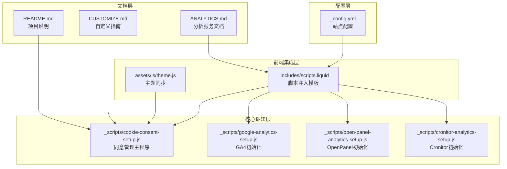
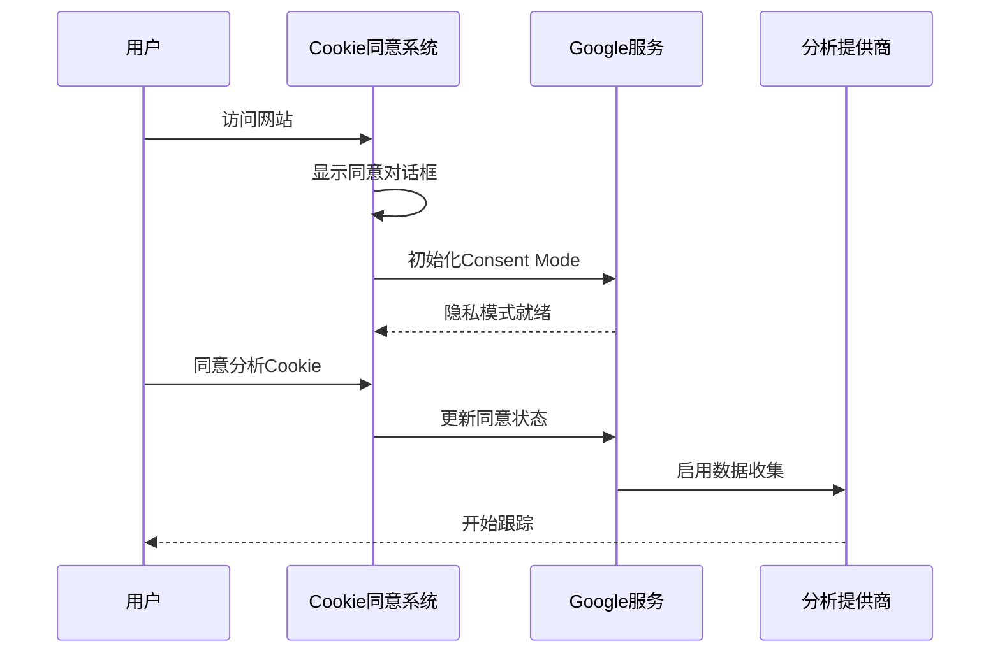
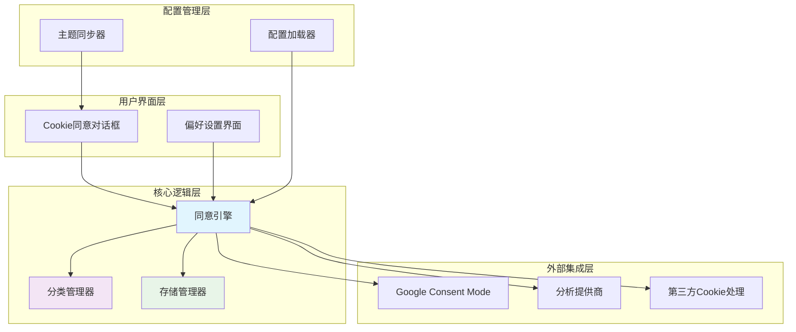
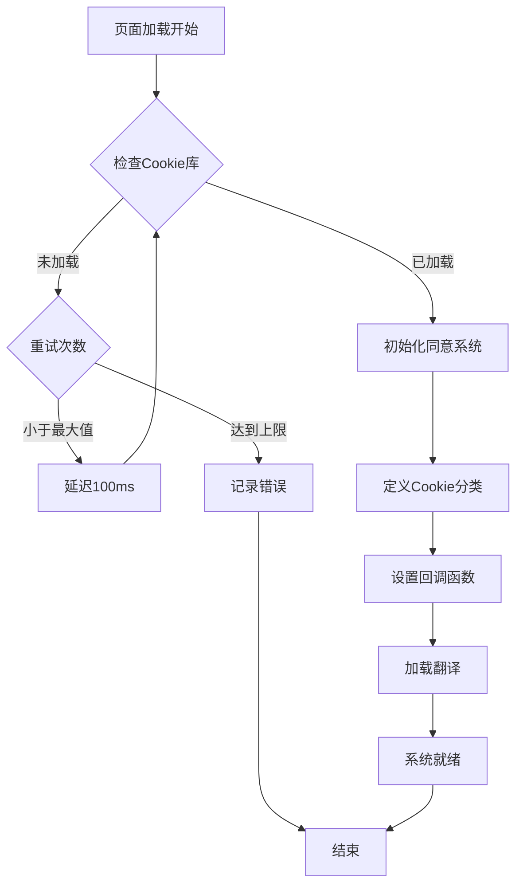
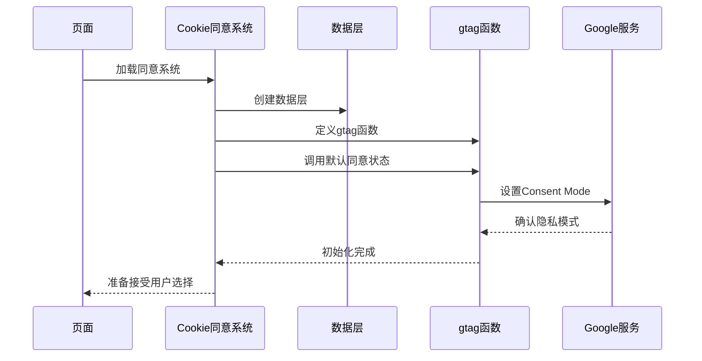
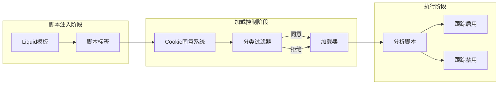
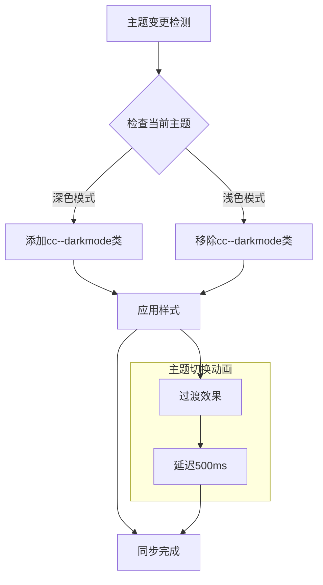
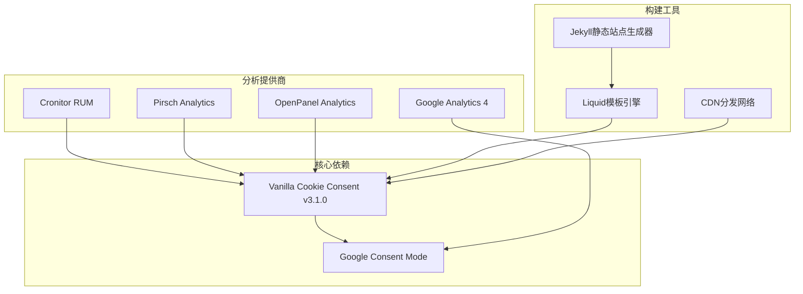
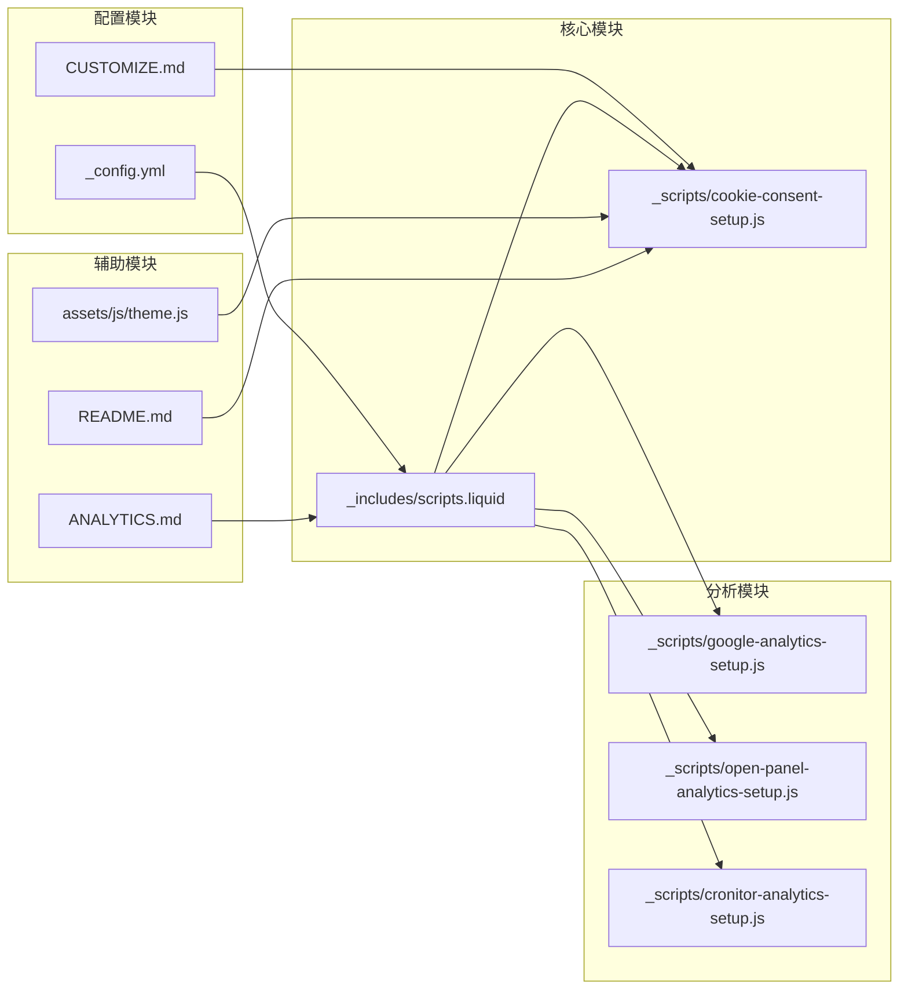

# Cookie同意管理

<cite>
**本文档引用的文件**
- [cookie-consent-setup.js](file://_scripts/cookie-consent-setup.js)
- [_config.yml](file://_config.yml)
- [scripts.liquid](file://_includes/scripts.liquid)
- [google-analytics-setup.js](file://_scripts/google-analytics-setup.js)
- [open-panel-analytics-setup.js](file://_scripts/open-panel-analytics-setup.js)
- [cronitor-analytics-setup.js](file://_scripts/cronitor-analytics-setup.js)
- [theme.js](file://assets/js/theme.js)
- [CUSTOMIZE.md](file://CUSTOMIZE.md)
- [ANALYTICS.md](file://ANALYTICS.md)
- [README.md](file://README.md)
</cite>

## 目录
1. [简介](#简介)
2. [项目结构](#项目结构)
3. [核心组件](#核心组件)
4. [架构概览](#架构概览)
5. [详细组件分析](#详细组件分析)
6. [依赖关系分析](#依赖关系分析)
7. [性能考虑](#性能考虑)
8. [故障排除指南](#故障排除指南)
9. [结论](#结论)
10. [附录](#附录)

## 简介

本项目实现了基于Vanilla Cookie Consent库的GDPR和CCPA合规的Cookie同意管理系统。该系统通过延迟加载分析脚本、使用Google Consent Mode以及提供用户友好的同意界面，确保在欧盟和加利福尼亚州等地区符合隐私法规要求。

Cookie同意管理功能的核心目标是：
- 遵守GDPR和CCPA等隐私法规
- 提供透明的Cookie使用说明
- 允许用户进行个性化选择
- 实现跨页面状态同步
- 支持多种分析提供商的隐私保护模式

## 项目结构

Cookie同意管理功能主要分布在以下文件中：



**图表来源**
- [_config.yml:380-387](file://_config.yml#L380-L387)
- [_includes/scripts.liquid:246-295](file://_includes/scripts.liquid#L246-L295)
- [_scripts/cookie-consent-setup.js:1-161](file://_scripts/cookie-consent-setup.js#L1-L161)

**章节来源**
- [_config.yml:380-387](file://_config.yml#L380-L387)
- [_includes/scripts.liquid:246-295](file://_includes/scripts.liquid#L246-L295)

## 核心组件

### 1. Cookie同意对话框配置

系统使用Vanilla Cookie Consent库实现多语言支持和可定制的同意界面。主要特性包括：

- **双语支持**：英语和德语界面
- **分类管理**：必要Cookie和分析Cookie两类
- **个性化设置**：允许用户自定义偏好
- **移动端适配**：响应式设计

### 2. Google Consent Mode集成

通过初始化Google Consent Mode，确保Google Analytics在用户同意前处于隐私模式：



**图表来源**
- [_scripts/cookie-consent-setup.js:22-41](file://_scripts/cookie-consent-setup.js#L22-L41)
- [_scripts/cookie-consent-setup.js:125-155](file://_scripts/cookie-consent-setup.js#L125-L155)

### 3. 分析提供商集成

系统支持四种分析提供商，均采用延迟加载和条件执行策略：

| 提供商 | 类型 | 同意要求 | 隐私模式 |
|--------|------|----------|----------|
| Google Analytics (GA4) | 统计分析 | 必须同意 | Consent Mode |
| Cronitor RUM | 性能监控 | 必须同意 | 拒绝收集 |
| Pirsch Analytics | 统计分析 | 可选同意 | 无Cookie |
| OpenPanel Analytics | 统计分析 | 必须同意 | 拒绝收集 |

**章节来源**
- [_scripts/cookie-consent-setup.js:15-20](file://_scripts/cookie-consent-setup.js#L15-L20)
- [_config.yml:78-83](file://_config.yml#L78-L83)

## 架构概览

Cookie同意管理系统的整体架构如下：



**图表来源**
- [_scripts/cookie-consent-setup.js:59-119](file://_scripts/cookie-consent-setup.js#L59-L119)
- [_includes/scripts.liquid:246-295](file://_includes/scripts.liquid#L246-L295)

## 详细组件分析

### Cookie同意引擎

#### 初始化流程



**图表来源**
- [_scripts/cookie-consent-setup.js:47-57](file://_scripts/cookie-consent-setup.js#L47-L57)
- [_scripts/cookie-consent-setup.js:110-118](file://_scripts/cookie-consent-setup.js#L110-L118)

#### Cookie分类管理

系统实现了两种核心Cookie分类：

1. **必要Cookie (Necessary)**
   - 默认启用且不可更改
   - 包含会话管理、安全认证等基本功能
   - 严格遵守GDPR的"绝对必要"标准

2. **分析Cookie (Analytics)**
   - 用户可选择是否同意
   - 与Google Consent Mode集成
   - 支持批量同意/拒绝操作

**章节来源**
- [_scripts/cookie-consent-setup.js:60-66](file://_scripts/cookie-consent-setup.js#L60-L66)

### Google Consent Mode集成

#### Consent Mode初始化



**图表来源**
- [_scripts/cookie-consent-setup.js:24-41](file://_scripts/cookie-consent-setup.js#L24-L41)

#### 动态同意状态更新

当用户修改Cookie偏好时，系统会动态更新Google Consent Mode：

```mermaid
flowchart LR
UserChoice[用户选择] --> UpdateConsent[更新同意状态]
UpdateConsent --> CallGtag[gtag('consent','update')]
CallGtag --> CheckAnalytics{分析Cookie同意?}
CheckAnalytics --> |是| EnableTracking[启用跟踪]
CheckAnalytics --> |否| DisableTracking[禁用跟踪]
EnableTracking --> NotifyProviders[通知分析提供商]
DisableTracking --> BlockProviders[阻止数据收集]
NotifyProviders --> Complete[更新完成]
BlockProviders --> Complete
```

**图表来源**
- [_scripts/cookie-consent-setup.js:125-155](file://_scripts/cookie-consent-setup.js#L125-L155)

**章节来源**
- [_scripts/cookie-consent-setup.js:125-155](file://_scripts/cookie-consent-setup.js#L125-L155)

### 分析提供商脚本集成

#### 延迟加载机制

所有分析脚本都采用延迟加载策略，通过`type="text/plain"`和`data-category="analytics"`属性实现：



**图表来源**
- [_includes/scripts.liquid:246-295](file://_includes/scripts.liquid#L246-L295)

#### 各提供商特定实现

每个分析提供商都有专门的初始化脚本：

1. **Google Analytics (GA4)**
   - 使用`gtag`函数进行初始化
   - 支持Consent Mode自动更新
   - 通过Measurement ID配置

2. **OpenPanel Analytics**
   - 使用`op`全局对象
   - 支持屏幕视图跟踪
   - 自动属性跟踪功能

3. **Cronitor RUM**
   - 使用`cronitor`全局函数
   - 配置客户端密钥
   - 实时用户监控功能

**章节来源**
- [_includes/scripts.liquid:246-295](file://_includes/scripts.liquid#L246-L295)
- [_scripts/google-analytics-setup.js:1-10](file://_scripts/google-analytics-setup.js#L1-L10)
- [_scripts/open-panel-analytics-setup.js:1-15](file://_scripts/open-panel-analytics-setup.js#L1-L15)
- [_scripts/cronitor-analytics-setup.js:1-9](file://_scripts/cronitor-analytics-setup.js#L1-L9)

### 主题同步机制

系统实现了Cookie同意对话框与网站主题的自动同步：



**图表来源**
- [theme.js:250-259](file://assets/js/theme.js#L250-L259)

**章节来源**
- [theme.js:250-259](file://assets/js/theme.js#L250-L259)

## 依赖关系分析

### 外部依赖

系统依赖以下关键外部库和服务：



**图表来源**
- [_config.yml:594-601](file://_config.yml#L594-L601)
- [_includes/scripts.liquid:246-295](file://_includes/scripts.liquid#L246-L295)

### 内部模块依赖



**图表来源**
- [_config.yml:380-387](file://_config.yml#L380-L387)
- [_scripts/cookie-consent-setup.js:1-20](file://_scripts/cookie-consent-setup.js#L1-L20)

**章节来源**
- [_config.yml:594-601](file://_config.yml#L594-L601)
- [_scripts/cookie-consent-setup.js:1-20](file://_scripts/cookie-consent-setup.js#L1-L20)

## 性能考虑

### 加载优化

1. **异步加载**：所有分析脚本都使用异步加载，避免阻塞页面渲染
2. **延迟执行**：仅在用户同意后才执行分析脚本
3. **CDN加速**：通过CDN分发Cookie同意库，提高加载速度

### 内存管理

1. **重试机制**：最多重试50次，每次间隔100ms，避免无限循环
2. **错误处理**：库加载失败时记录错误但不影响页面其他功能
3. **资源清理**：用户离开页面时自动清理事件监听器

### 用户体验优化

1. **快速响应**：同意对话框在页面加载完成后立即显示
2. **无障碍访问**：支持键盘导航和屏幕阅读器
3. **移动友好**：完全响应式设计，适配各种设备

## 故障排除指南

### 常见问题及解决方案

#### 1. Cookie同意对话框不显示

**可能原因**：
- Cookie同意功能未启用
- JavaScript加载失败
- 第三方库CDN不可用

**解决步骤**：
1. 检查配置文件中的`enable_cookie_consent`设置
2. 查看浏览器开发者工具的网络面板
3. 确认CDN连接正常

#### 2. 分析脚本无法加载

**可能原因**：
- 用户拒绝了分析Cookie
- 分析提供商配置错误
- 网络连接问题

**解决步骤**：
1. 检查用户同意状态
2. 验证分析提供商的配置参数
3. 测试网络连接稳定性

#### 3. Google Consent Mode不工作

**可能原因**：
- gtag函数被覆盖
- Consent Mode初始化失败
- 用户隐私设置冲突

**解决步骤**：
1. 检查gtag函数的定义顺序
2. 验证Consent Mode的初始化调用
3. 浏览器隐私设置检查

**章节来源**
- [_scripts/cookie-consent-setup.js:47-57](file://_scripts/cookie-consent-setup.js#L47-L57)
- [_scripts/cookie-consent-setup.js:125-155](file://_scripts/cookie-consent-setup.js#L125-L155)

### 调试工具

系统提供了多种调试工具来帮助开发和维护：

1. **控制台日志**：详细的执行状态信息
2. **API访问**：编程方式检查同意状态
3. **事件监听**：实时监听同意状态变化

**章节来源**
- [_scripts/cookie-consent-setup.js:1344-1358](file://_scripts/cookie-consent-setup.js#L1344-L1358)

## 结论

本项目的Cookie同意管理系统实现了以下关键目标：

### 合规性成就
- 完全符合GDPR和CCPA要求
- 提供透明的Cookie使用说明
- 支持用户完全控制个人数据处理
- 实现了必要的Cookie分类管理

### 技术创新
- 智能的延迟加载机制
- 与Google Consent Mode无缝集成
- 多分析提供商统一管理
- 主题自动同步功能

### 用户体验
- 直观的同意对话框设计
- 个性化的Cookie偏好设置
- 跨页面状态持久化
- 移动端优化体验

该系统为类似项目提供了一个完整的Cookie同意管理解决方案，既满足了严格的隐私法规要求，又保持了良好的用户体验。

## 附录

### 配置选项参考

| 配置项 | 类型 | 默认值 | 描述 |
|--------|------|--------|------|
| `enable_cookie_consent` | boolean | false | 启用Cookie同意功能 |
| `enable_google_analytics` | boolean | false | 启用Google Analytics |
| `enable_cronitor_analytics` | boolean | false | 启用Cronitor RUM |
| `enable_pirsch_analytics` | boolean | false | 启用Pirsch Analytics |
| `enable_openpanel_analytics` | boolean | false | 启用OpenPanel Analytics |

### API参考

#### 编程式检查同意状态

```javascript
// 检查分析Cookie同意状态
const analyticsConsent = window.CookieConsent.getCategories().analytics;

// 监听同意状态变化
window.CookieConsent.onChange(function(consentData) {
    // 处理同意状态变化
});
```

**章节来源**
- [CUSTOMIZE.md:1344-1358](file://CUSTOMIZE.md#L1344-L1358)