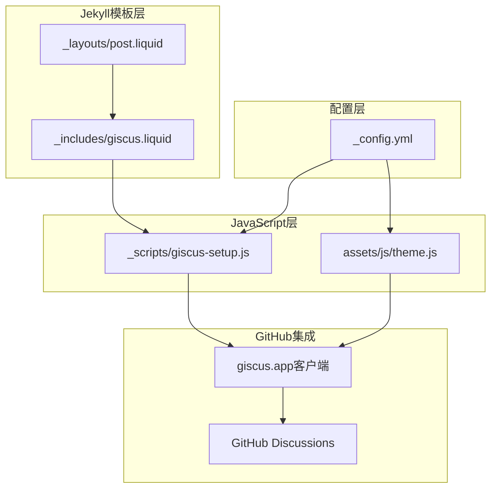
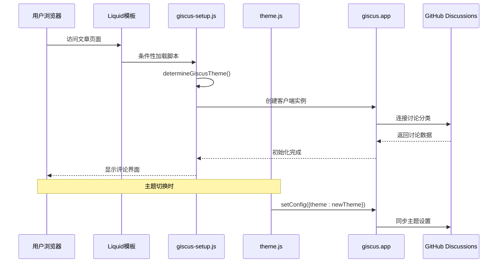
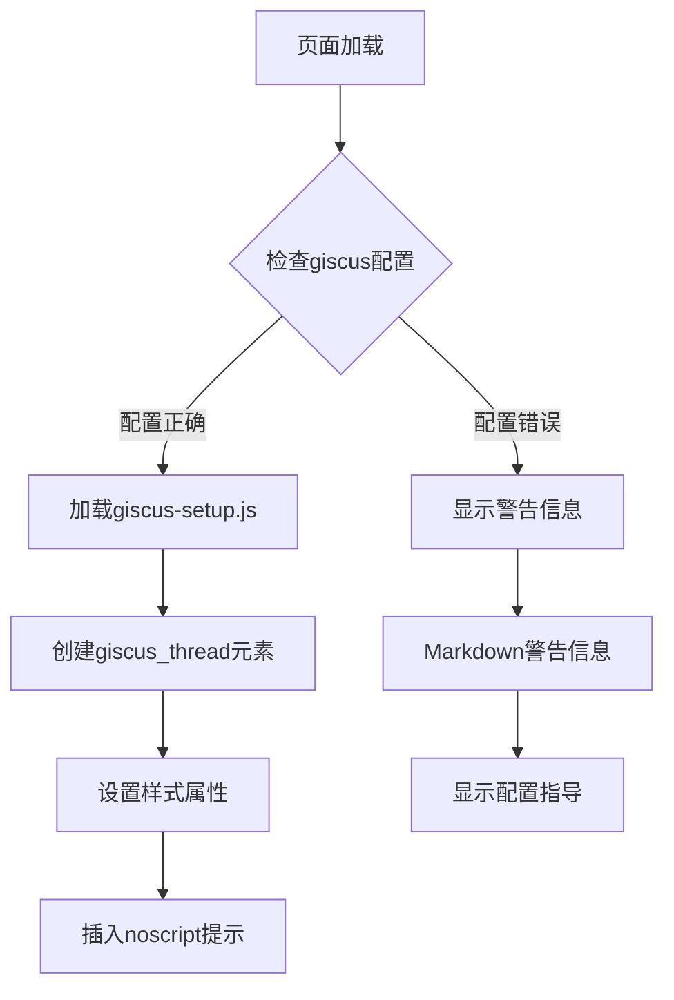
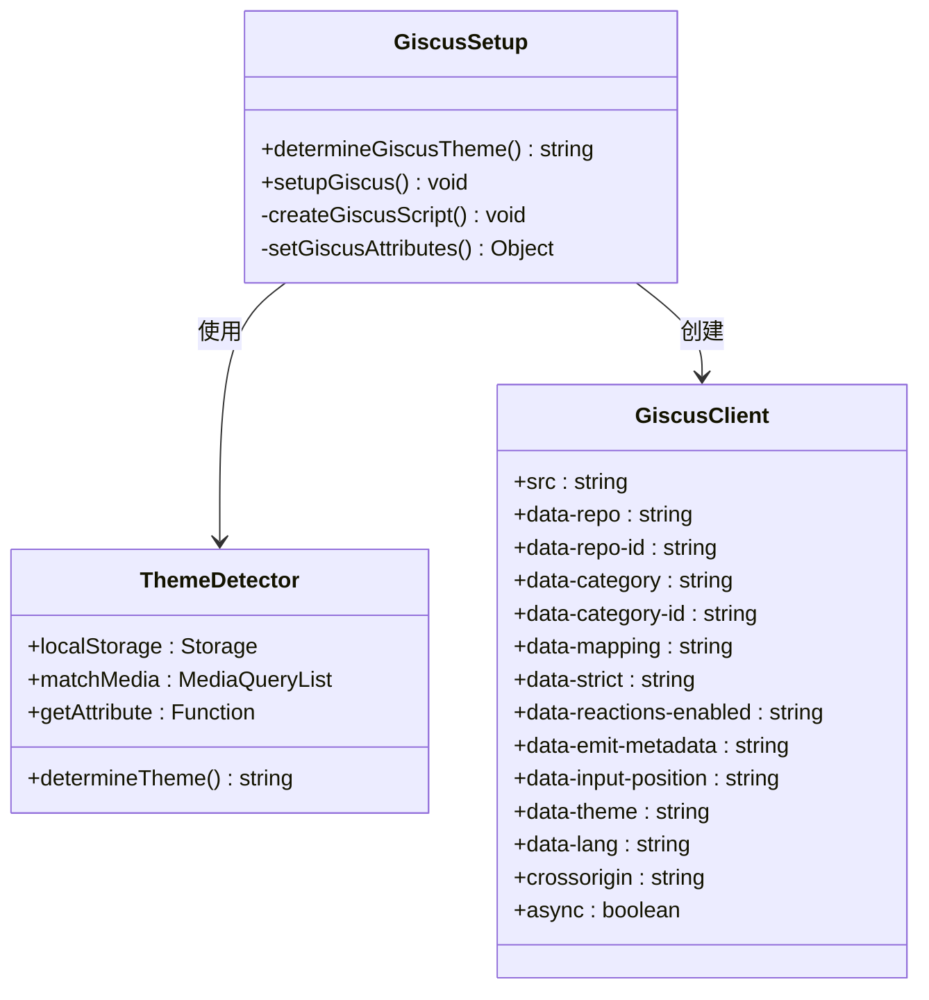
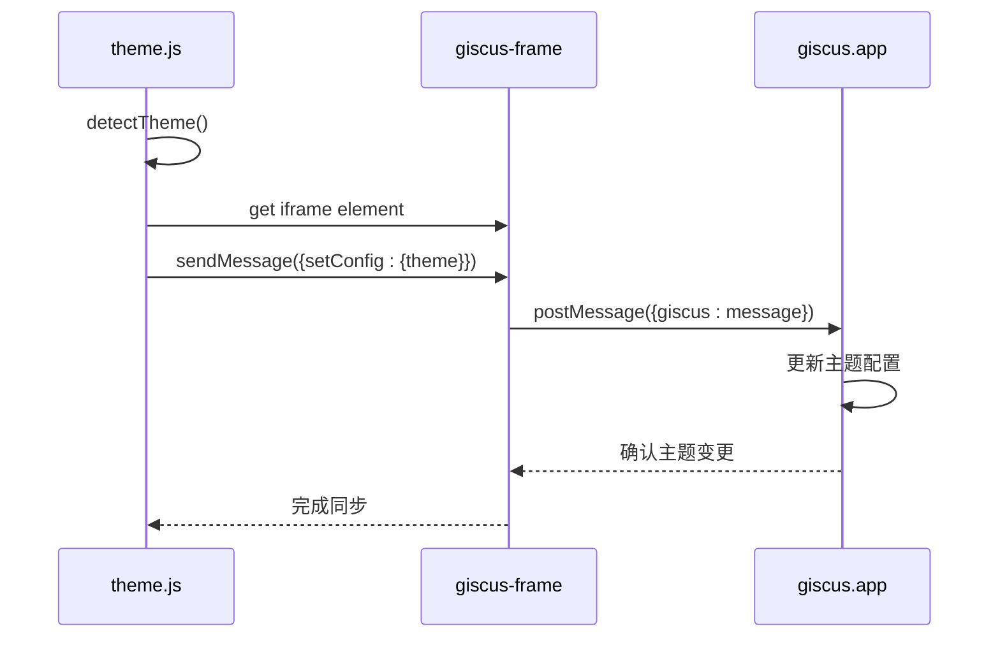
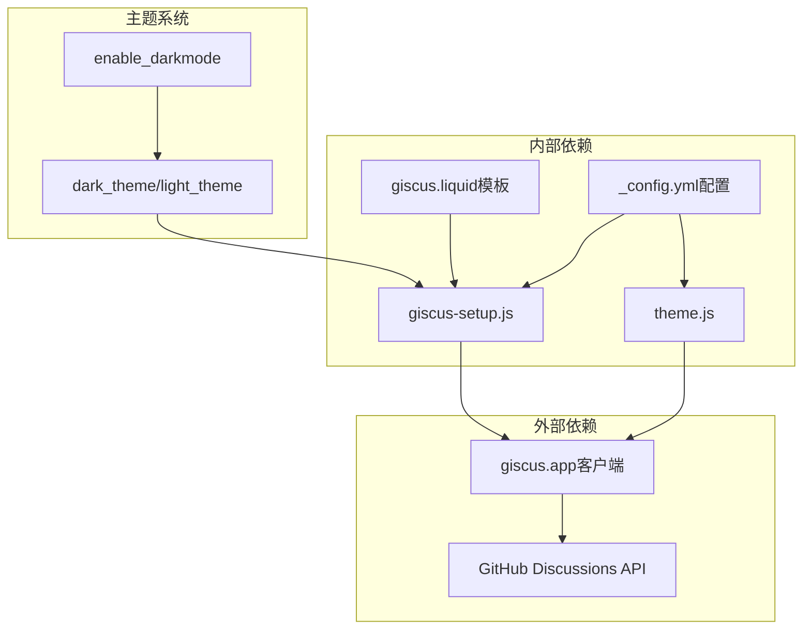

# Giscus评论系统

<cite>
**本文档引用的文件**
- [_includes/giscus.liquid](file://_includes/giscus.liquid)
- [_scripts/giscus-setup.js](file://_scripts/giscus-setup.js)
- [_config.yml](file://_config.yml)
- [assets/js/theme.js](file://assets/js/theme.js)
- [_layouts/post.liquid](file://_layouts/post.liquid)
- [TROUBLESHOOTING.md](file://TROUBLESHOOTING.md)
</cite>

## 目录
1. [简介](#简介)
2. [项目结构](#项目结构)
3. [核心组件](#核心组件)
4. [架构概览](#架构概览)
5. [详细组件分析](#详细组件分析)
6. [依赖关系分析](#依赖关系分析)
7. [性能考虑](#性能考虑)
8. [故障排除指南](#故障排除指南)
9. [结论](#结论)

## 简介

Giscus是一个基于GitHub Discussions的现代评论系统，它将博客文章与GitHub仓库的讨论功能无缝集成。该系统通过GitHub Discussions提供评论功能，实现了真正的开源协作体验，用户可以直接在GitHub上参与讨论，无需第三方服务。

本项目中的Giscus实现采用了轻量级的JavaScript客户端，通过动态加载的方式集成到Jekyll静态站点中，确保了良好的性能和用户体验。

## 项目结构

Giscus评论系统在项目中的组织结构如下：

**图表来源**
- [_includes/giscus.liquid:1-26](file://_includes/giscus.liquid#L1-L26)
- [_scripts/giscus-setup.js:1-49](file://_scripts/giscus-setup.js#L1-L49)
- [_config.yml:106-121](file://_config.yml#L106-L121)

**章节来源**
- [_includes/giscus.liquid:1-26](file://_includes/giscus.liquid#L1-L26)
- [_scripts/giscus-setup.js:1-49](file://_scripts/giscus-setup.js#L1-L49)
- [_config.yml:106-121](file://_config.yml#L106-L121)

## 核心组件

### 模板集成组件

Giscus通过Liquid模板系统集成到Jekyll站点中，主要包含以下组件：

1. **giscus.liquid模板**：负责渲染评论区域和条件性加载JavaScript
2. **giscus-setup.js脚本**：动态创建和配置giscus客户端
3. **主题同步机制**：确保评论系统与站点主题保持一致

### 配置管理系统

系统支持丰富的配置选项，包括：
- GitHub仓库连接信息
- 讨论分类和ID映射
- 主题和语言设置
- 功能开关配置

**章节来源**
- [_includes/giscus.liquid:11-24](file://_includes/giscus.liquid#L11-L24)
- [_scripts/giscus-setup.js:25-40](file://_scripts/giscus-setup.js#L25-L40)
- [_config.yml:108-121](file://_config.yml#L108-L121)

## 架构概览

Giscus评论系统的整体架构采用客户端驱动的设计模式：

**图表来源**
- [_scripts/giscus-setup.js:22-47](file://_scripts/giscus-setup.js#L22-L47)
- [assets/js/theme.js:103-115](file://assets/js/theme.js#L103-L115)

## 详细组件分析

### giscus.liquid模板组件

该模板负责在页面中渲染评论区域，并根据配置条件性地加载JavaScript脚本：

**图表来源**
- [_includes/giscus.liquid:1-26](file://_includes/giscus.liquid#L1-L26)

该组件的关键特性包括：
- **条件性加载**：仅在配置正确时才加载脚本
- **样式适配**：针对不同布局自动调整宽度
- **错误处理**：提供清晰的配置指导

**章节来源**
- [_includes/giscus.liquid:1-26](file://_includes/giscus.liquid#L1-L26)

### giscus-setup.js核心脚本

这个JavaScript文件是Giscus系统的核心执行逻辑：

**图表来源**
- [_scripts/giscus-setup.js:5-47](file://_scripts/giscus-setup.js#L5-L47)

核心功能包括：
- **主题检测**：智能识别当前主题状态
- **属性配置**：动态设置所有giscus参数
- **异步加载**：避免阻塞页面渲染

**章节来源**
- [_scripts/giscus-setup.js:1-49](file://_scripts/giscus-setup.js#L1-L49)

### 主题同步机制

系统实现了完整的主题同步功能，确保评论界面与站点主题保持一致：

**图表来源**
- [assets/js/theme.js:103-115](file://assets/js/theme.js#L103-L115)

**章节来源**
- [assets/js/theme.js:103-115](file://assets/js/theme.js#L103-L115)

### 配置选项详解

Giscus系统支持以下配置选项：

| 配置项 | 类型 | 默认值 | 描述 |
|--------|------|--------|------|
| `repo` | 字符串 | 无 | GitHub仓库标识（用户名/仓库名） |
| `repo_id` | 字符串 | 空 | 仓库ID（可选） |
| `category` | 字符串 | "Comments" | 讨论分类名称 |
| `category_id` | 字符串 | 空 | 分类ID（可选） |
| `mapping` | 字符串 | "title" | 映射方式（title/url/path） |
| `strict` | 数字 | 1 | 严格模式开关 |
| `reactions_enabled` | 数字 | 1 | 表情反应功能 |
| `input_position` | 字符串 | "bottom" | 输入框位置（top/bottom） |
| `dark_theme` | 字符串 | "dark" | 深色主题名称 |
| `light_theme` | 字符串 | "light" | 浅色主题名称 |
| `emit_metadata` | 数字 | 0 | 元数据发送开关 |
| `lang` | 字符串 | "en" | 语言设置 |

**章节来源**
- [_config.yml:108-121](file://_config.yml#L108-L121)

## 依赖关系分析

Giscus评论系统与其他组件的依赖关系如下：

**图表来源**
- [_scripts/giscus-setup.js:25-40](file://_scripts/giscus-setup.js#L25-L40)
- [_config.yml:108-121](file://_config.yml#L108-L121)

**章节来源**
- [_scripts/giscus-setup.js:1-49](file://_scripts/giscus-setup.js#L1-L49)
- [_config.yml:106-121](file://_config.yml#L106-L121)

## 性能考虑

Giscus评论系统在设计时充分考虑了性能优化：

### 异步加载策略
- 使用`async`属性避免阻塞页面渲染
- 条件性加载脚本，仅在需要时才执行
- 动态创建DOM元素，减少初始页面负担

### 主题切换优化
- 通过postMessage通信，避免重新加载整个评论系统
- 智能主题检测，减少不必要的主题切换
- 缓存主题设置，提升响应速度

### 资源管理
- 最小化JavaScript文件大小
- 智能的错误处理和降级方案
- 支持离线环境的基本功能

## 故障排除指南

### 常见问题及解决方案

#### 评论不显示
**问题症状**：页面加载后看不到评论区域

**可能原因**：
1. GitHub仓库未启用Discussions功能
2. giscus配置信息不正确
3. JavaScript被浏览器阻止

**解决步骤**：
1. 检查`_config.yml`中的giscus配置
2. 确认GitHub仓库已启用Discussions
3. 在giscus.app网站获取正确的ID信息
4. 清除浏览器缓存后重试

**章节来源**
- [TROUBLESHOOTING.md:362-380](file://TROUBLESHOOTING.md#L362-L380)

#### 主题不匹配
**问题症状**：评论界面主题与站点不一致

**解决方法**：
1. 检查`enable_darkmode`配置
2. 确认`dark_theme`和`light_theme`设置
3. 刷新页面或手动切换主题

#### 语言设置问题
**问题症状**：评论界面显示非预期语言

**解决方法**：
1. 修改`lang`配置项
2. 确保语言代码格式正确
3. 清除缓存后重新加载

**章节来源**
- [TROUBLESHOOTING.md:362-380](file://TROUBLESHOOTING.md#L362-L380)

## 结论

Giscus评论系统为基于GitHub的学术和个人网站提供了强大而灵活的评论功能。通过将评论系统与GitHub Discussions深度集成，实现了真正的开源协作体验。

### 系统优势

1. **开源协作**：直接在GitHub上进行讨论，符合开源社区习惯
2. **零维护成本**：基于GitHub基础设施，无需额外服务器
3. **主题一致性**：完美集成站点主题系统
4. **性能优化**：异步加载和智能缓存机制
5. **配置灵活**：丰富的配置选项满足不同需求

### 技术特点

- **轻量级设计**：最小化JavaScript依赖
- **响应式布局**：适配各种设备屏幕
- **无障碍支持**：遵循Web标准和最佳实践
- **安全性**：通过GitHub OAuth进行身份验证

该系统为学术网站、个人博客和开源项目提供了一个可靠、易用且功能丰富的评论解决方案。