# JavaScript功能模块

<cite>
**本文档引用的文件**
- [_config.yml](_config.yml)
- [README.md](README.md)
- [ANALYTICS.md](ANALYTICS.md)
- [CUSTOMIZE.md](CUSTOMIZE.md)
- [_scripts/google-analytics-setup.js](_scripts/google-analytics-setup.js)
- [_scripts/cookie-consent-setup.js](_scripts/cookie-consent-setup.js)
- [_scripts/search.liquid.js](_scripts/search.liquid.js)
- [assets/js/search-setup.js](assets/js/search-setup.js)
- [assets/js/mathjax-setup.js](assets/js/mathjax-setup.js)
- [assets/js/chartjs-setup.js](assets/js/chartjs-setup.js)
- [assets/js/echarts-setup.js](assets/js/echarts-setup.js)
- [assets/js/pseudocode-setup.js](assets/js/pseudocode-setup.js)
</cite>

## 目录
1. [简介](#简介)
2. [项目结构](#项目结构)
3. [核心组件](#核心组件)
4. [架构概览](#架构概览)
5. [详细组件分析](#详细组件分析)
6. [依赖关系分析](#依赖关系分析)
7. [性能考虑](#性能考虑)
8. [故障排除指南](#故障排除指南)
9. [结论](#结论)

## 简介

本文档深入解析了该Jekyll学术主题中的JavaScript功能模块，重点关注以下核心功能：

- **全文搜索系统**：基于ninja-keys的现代化搜索界面，支持页面导航、博客文章、项目集合和社交链接的智能搜索
- **分析脚本集成**：完整的Google Analytics、Cookie同意管理、隐私保护解决方案
- **数学公式渲染**：MathJax的高级配置，支持多种数学符号和环境
- **多媒体功能**：图片缩放、视频播放、音频嵌入的完整实现
- **图表库集成**：Chart.js和ECharts的无缝集成与主题适配
- **代码高亮与伪代码**：语法着色、数学公式渲染和伪代码可视化
- **性能优化与错误处理**：最佳实践和故障排除指南

## 项目结构

该项目采用Jekyll静态站点生成器，JavaScript功能模块主要分布在以下位置：

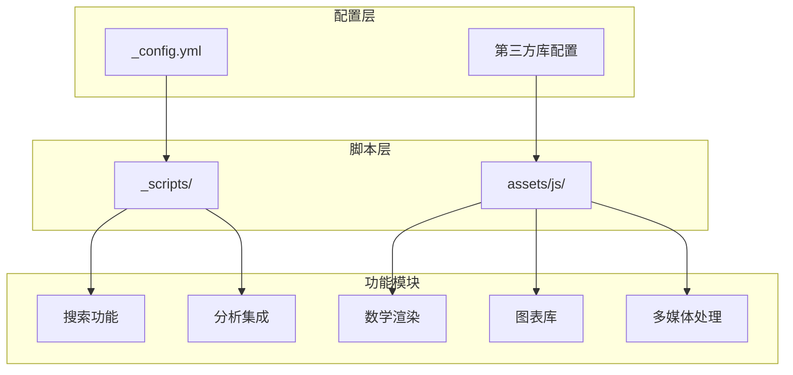

**图表来源**
- [_config.yml](_config.yml:1-L656)
- [_scripts/google-analytics-setup.js](_scripts/google-analytics-setup.js:1-L10)
- [_scripts/cookie-consent-setup.js](_scripts/cookie-consent-setup.js:1-L161)

**章节来源**
- [_config.yml](_config.yml:1-L656)
- [README.md](README.md:1-L561)

## 核心组件

### 搜索功能模块

搜索系统是整个JavaScript功能的核心，采用ninja-keys框架实现现代化的键盘快捷键搜索体验。

#### 数据源架构

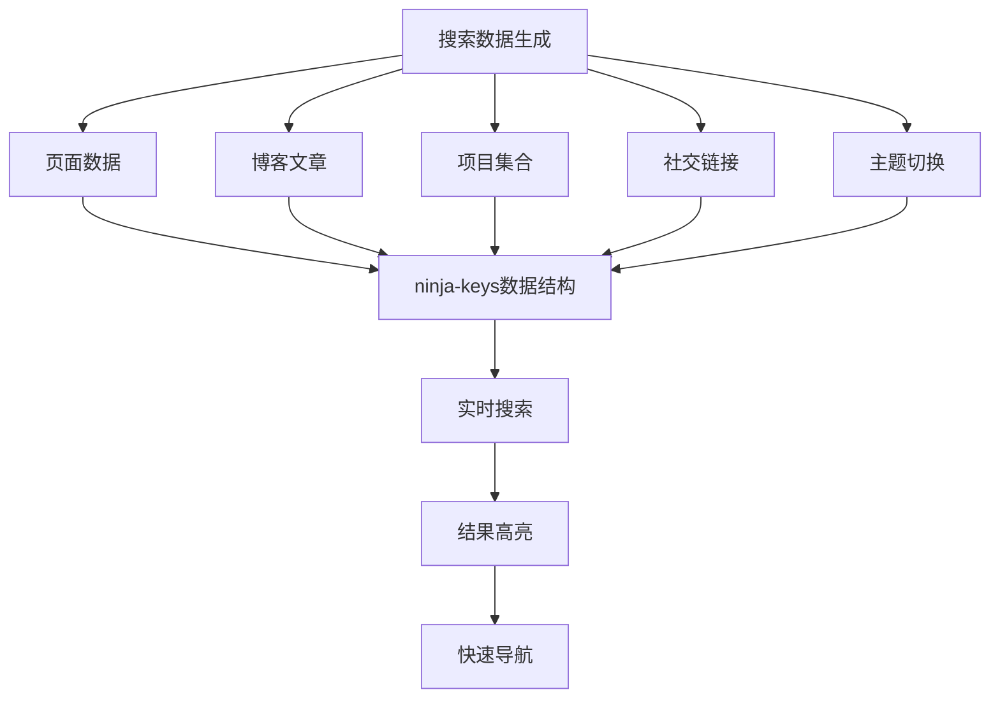

**图表来源**
- [_scripts/search.liquid.js](_scripts/search.liquid.js:1-L342)

#### 搜索配置选项

在配置文件中，搜索功能通过以下参数控制：

- `search_enabled`: 启用/禁用全局搜索功能
- `posts_in_search`: 包含博客文章到搜索索引
- `socials_in_search`: 包含社交链接到搜索结果
- `bib_search`: 启用文献搜索功能

**章节来源**
- [_config.yml](_config.yml:57-L61)
- [_scripts/search.liquid.js](_scripts/search.liquid.js:55-L80)

### 分析脚本集成

系统提供了完整的分析脚本集成解决方案，支持多种分析服务并确保GDPR合规性。

#### Cookie同意管理架构

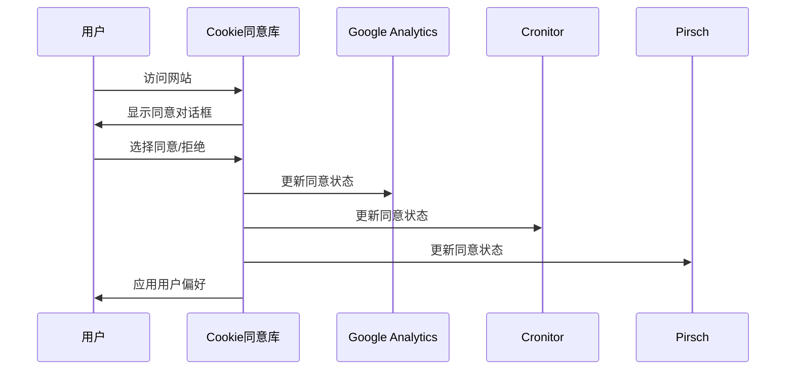

**图表来源**
- [_scripts/cookie-consent-setup.js](_scripts/cookie-consent-setup.js:110-L155)

#### 支持的分析服务

| 服务名称 | 类型 | 隐私模式 | 配置参数 |
|---------|------|----------|----------|
| Google Analytics | GA4 | Consent Mode | `enable_google_analytics: true` |
| Pirsch Analytics | 分析 | 合规 | `enable_pirsch_analytics: true` |
| Cronitor | RUM监控 | 需要同意 | `enable_cronitor_analytics: true` |
| Openpanel | 分析 | 隐私优先 | `enable_openpanel_analytics: true` |

**章节来源**
- [_scripts/cookie-consent-setup.js](_scripts/cookie-consent-setup.js:15-L20)
- [_scripts/google-analytics-setup.js](_scripts/google-analytics-setup.js:1-L10)
- [ANALYTICS.md](ANALYTICS.md:1-L187)

### 数学公式渲染

MathJax配置提供了强大的数学公式渲染能力，支持多种数学符号和环境。

#### 数学渲染配置

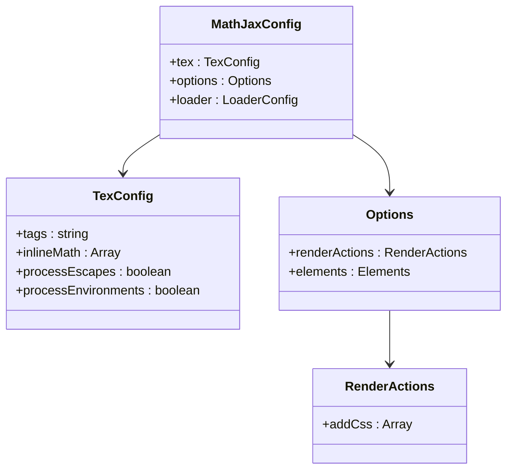

**图表来源**
- [assets/js/mathjax-setup.js](_scripts/mathjax-setup.js:1-L27)

#### 支持的数学环境

- **行内数学**：使用 `$...$` 和 `\(...\)` 包围
- **块级数学**：使用 `$$...$$` 和 `\[...\]` 包围
- **AMS标签**：支持自动编号的方程组
- **自定义CSS**：确保数学公式颜色继承

**章节来源**
- [assets/js/mathjax-setup.js](_scripts/mathjax-setup.js:1-L27)

### 图表库集成

系统集成了多种图表库，提供丰富的数据可视化功能。

#### Chart.js集成

Chart.js通过特定的代码块语言进行识别和渲染：

```javascript
$(".language-chartjs").each(function() {
    const $this = $(this);
    const $canvas = $("<canvas></canvas>");
    const _text = $this.text();
    $this.text("").append($canvas);
    const _ctx = $canvas.get(0).getContext("2d");
    _ctx && _text && new Chart(_ctx, JSON.parse(_text));
});
```

#### ECharts集成

ECharts支持深色/浅色主题自动切换：

```javascript
const echartsTheme = determineComputedTheme();
let chart;
if (echartsTheme === "dark") {
    chart = echarts.init(chartElement, "dark-fresh-cut");
} else {
    chart = echarts.init(chartElement);
}
```

**章节来源**
- [assets/js/chartjs-setup.js](_scripts/chartjs-setup.js:1-L15)
- [assets/js/echarts-setup.js](_scripts/echarts-setup.js:1-L30)

### 多媒体功能

系统提供了完整的多媒体处理功能，包括图片缩放、视频播放和音频嵌入。

#### 媒体处理架构

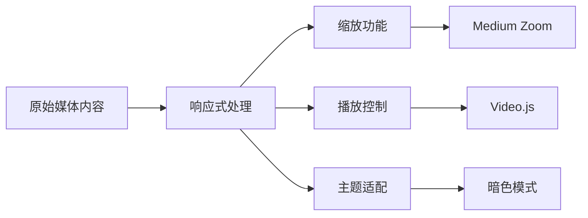

**图表来源**
- [_config.yml](_config.yml:389-L396)

## 架构概览

整个JavaScript功能模块采用模块化设计，各组件之间通过清晰的接口进行交互。

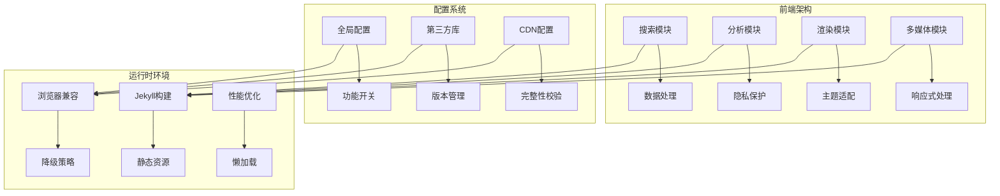

**图表来源**
- [_config.yml](_config.yml:405-L634)
- [assets/js/search-setup.js](_scripts/assets/js/search-setup.js:1-L18)

## 详细组件分析

### 搜索功能深度解析

#### 数据索引构建

搜索系统通过Liquid模板动态构建搜索索引：

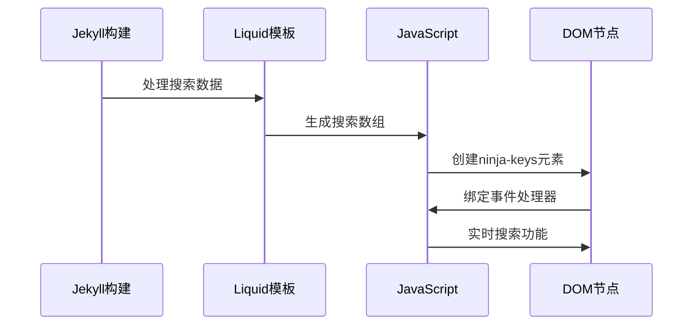

**图表来源**
- [_scripts/search.liquid.js](_scripts/search.liquid.js:8-L102)

#### 搜索算法特性

- **全文搜索**：支持多字段匹配（标题、描述、内容）
- **智能排序**：基于相关性和权重的排序算法
- **实时过滤**：输入即搜索的用户体验
- **键盘导航**：支持Tab、Enter、Escape等快捷键

**章节来源**
- [_scripts/search.liquid.js](_scripts/search.liquid.js:1-L342)
- [assets/js/search-setup.js](_scripts/assets/js/search-setup.js:1-L18)

### 分析脚本集成详解

#### 隐私保护机制

系统实现了多层次的隐私保护措施：

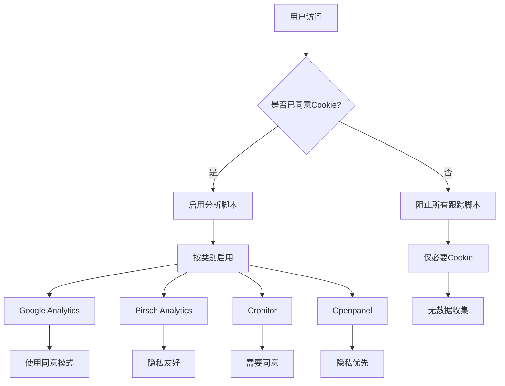

**图表来源**
- [_scripts/cookie-consent-setup.js](_scripts/cookie-consent-setup.js:36-L155)

#### Google Consent Mode集成

系统使用Google Consent Mode确保在用户同意前不收集任何数据：

- **默认拒绝**：所有存储类型默认拒绝
- **动态更新**：用户同意后实时更新配置
- **跨服务同步**：所有支持的服务保持一致状态

**章节来源**
- [_scripts/cookie-consent-setup.js](_scripts/cookie-consent-setup.js:22-L41)
- [_scripts/google-analytics-setup.js](_scripts/google-analytics-setup.js:1-L10)

### 数学公式渲染系统

#### 渲染流程

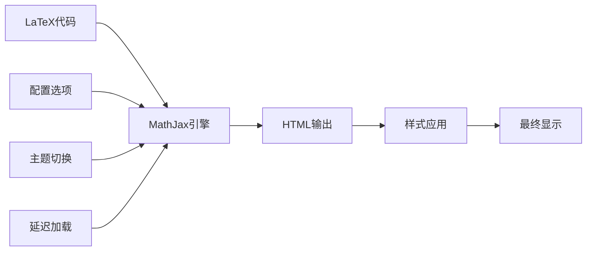

**图表来源**
- [assets/js/mathjax-setup.js](_scripts/assets/js/mathjax-setup.js:1-L27)

#### 高级配置选项

- **自定义标签**：支持AMS数学环境
- **内联渲染**：行内数学符号的精确处理
- **CSS注入**：动态样式应用确保视觉一致性
- **性能优化**：渲染动作的精细控制

**章节来源**
- [assets/js/mathjax-setup.js](_scripts/assets/js/mathjax-setup.js:1-L27)

### 图表库集成方案

#### Chart.js集成流程

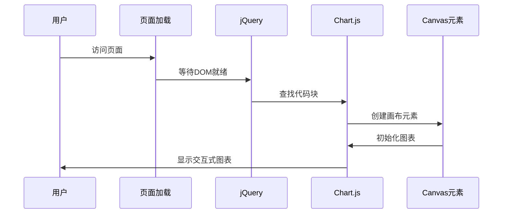

**图表来源**
- [assets/js/chartjs-setup.js](_scripts/assets/js/chartjs-setup.js:6-L13)

#### ECharts主题适配

ECharts通过检测系统主题自动切换深色/浅色模式：

- **主题检测**：`determineComputedTheme()`函数
- **动态初始化**：根据主题选择相应主题配置
- **响应式调整**：窗口大小变化时自动重绘

**章节来源**
- [assets/js/chartjs-setup.js](_scripts/assets/js/chartjs-setup.js:1-L15)
- [assets/js/echarts-setup.js](_scripts/assets/js/echarts-setup.js:1-L30)

### 代码高亮与伪代码渲染

#### 伪代码渲染系统

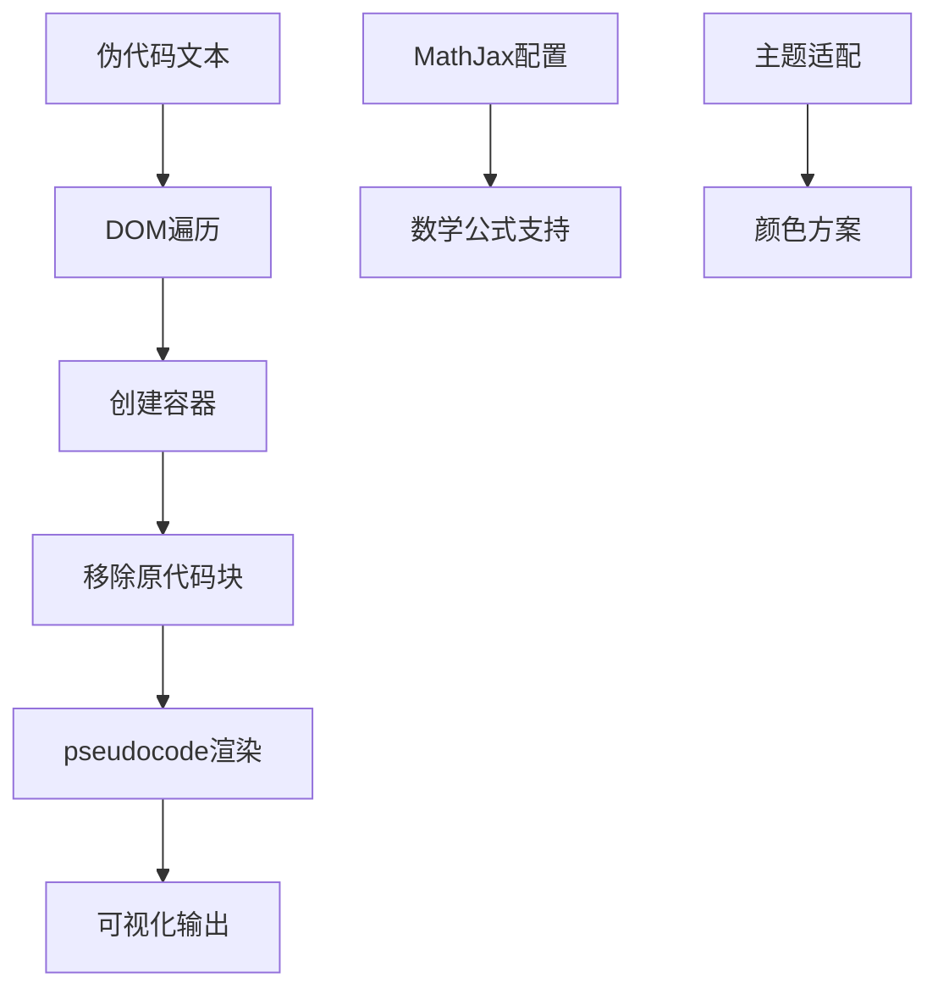

**图表来源**
- [assets/js/pseudocode-setup.js](_scripts/assets/js/pseudocode-setup.js:16-L33)

#### 集成特性

- **MathJax支持**：行内和块级数学公式
- **环境处理**：支持复杂的算法描述
- **主题兼容**：深色/浅色模式下的视觉一致性
- **性能优化**：只在页面完全加载后执行

**章节来源**
- [assets/js/pseudocode-setup.js](_scripts/assets/js/pseudocode-setup.js:1-L34)

## 依赖关系分析

### 第三方库依赖图

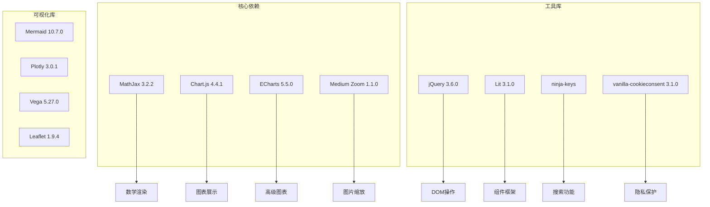

**图表来源**
- [_config.yml](_config.yml:501-L634)

### 版本管理策略

系统采用CDN版本管理，确保库文件的完整性和安全性：

- **完整性哈希**：每个库都包含SRI完整性哈希
- **版本锁定**：固定版本号避免意外更新
- **本地备份**：可选的本地下载功能
- **自动更新**：通过配置文件统一管理

**章节来源**
- [_config.yml](_config.yml:405-L634)

## 性能考虑

### 优化策略

#### 懒加载机制

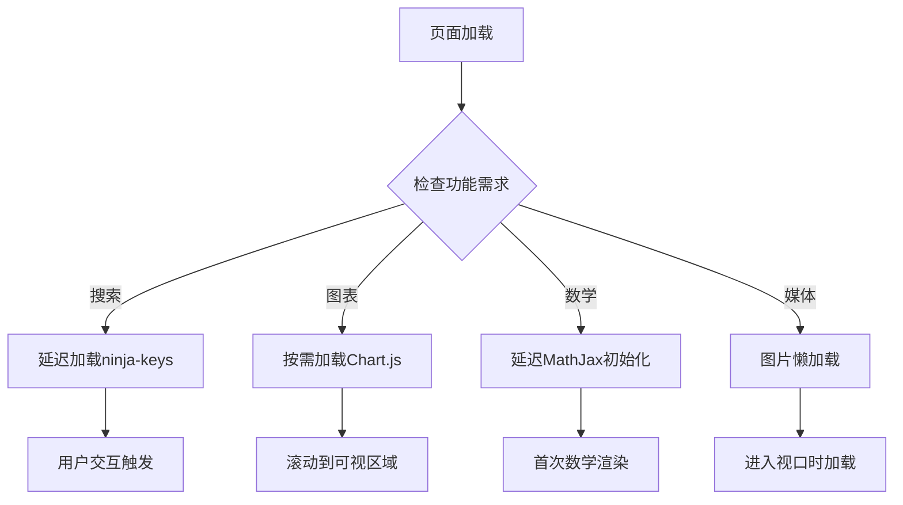

#### 缓存策略

- **浏览器缓存**：静态资源长期缓存
- **CDN加速**：全球CDN分发减少延迟
- **压缩优化**：JavaScript和CSS压缩
- **按需加载**：非关键功能延迟加载

### 错误处理机制

系统实现了多层次的错误处理：

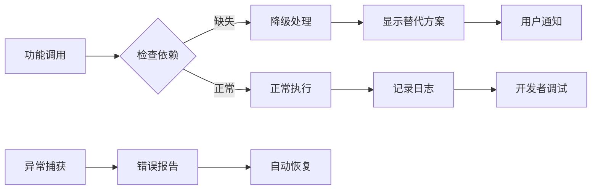

## 故障排除指南

### 常见问题诊断

#### 搜索功能问题

**症状**：搜索框无法打开或搜索结果为空

**排查步骤**：
1. 检查`search_enabled`配置是否启用
2. 验证ninja-keys元素是否存在
3. 确认搜索数据是否正确生成
4. 检查浏览器控制台是否有JavaScript错误

**解决方案**：
- 确保`_config.yml`中正确的配置参数
- 检查网络连接和CDN可用性
- 清除浏览器缓存重新加载

#### 分析脚本问题

**症状**：分析数据不准确或完全不收集

**排查步骤**：
1. 检查Cookie同意对话框是否正常显示
2. 验证Google Analytics ID配置
3. 确认隐私设置符合地区法规
4. 测试不同浏览器的兼容性

**解决方案**：
- 重新配置分析服务参数
- 检查GDPR合规设置
- 更新第三方库版本

#### 数学渲染问题

**症状**：数学公式显示异常或渲染失败

**排查步骤**：
1. 检查MathJax配置是否正确
2. 验证LaTeX语法格式
3. 确认网络连接正常
4. 测试不同浏览器兼容性

**解决方案**：
- 调整MathJax配置参数
- 使用标准的LaTeX语法
- 检查CDN连接状态

### 开发者调试技巧

#### 调试工具使用

- **浏览器开发者工具**：检查网络请求和JavaScript错误
- **控制台日志**：查看详细的执行信息
- **性能分析**：监控加载时间和内存使用
- **网络面板**：验证资源加载状态

#### 最佳实践建议

- **渐进增强**：确保基础功能在无JavaScript情况下仍可使用
- **错误边界**：为关键功能添加适当的错误处理
- **性能监控**：定期检查页面性能指标
- **兼容性测试**：在主流浏览器中验证功能

**章节来源**
- [_scripts/cookie-consent-setup.js](_scripts/cookie-consent-setup.js:44-L57)
- [_scripts/search.liquid.js](_scripts/search.liquid.js:1-L342)

## 结论

该JavaScript功能模块展现了现代静态站点的强大能力，通过精心设计的架构实现了以下目标：

### 技术成就

- **模块化设计**：清晰的功能分离和接口定义
- **隐私优先**：完整的GDPR合规解决方案
- **性能优化**：多层缓存和懒加载策略
- **跨平台兼容**：广泛的浏览器和设备支持

### 扩展性优势

- **插件架构**：易于集成新的功能模块
- **配置驱动**：通过配置文件控制功能行为
- **主题适配**：完整的深色/浅色模式支持
- **国际化支持**：多语言界面和内容管理

### 未来发展方向

- **AI集成**：智能搜索建议和个性化推荐
- **实时功能**：WebSocket支持的实时更新
- **移动端优化**：针对移动设备的专用优化
- **无障碍访问**：更完善的辅助功能支持

通过这些精心设计的功能模块，该学术主题为研究人员和学者提供了一个功能完整、性能优异的个人网站解决方案。