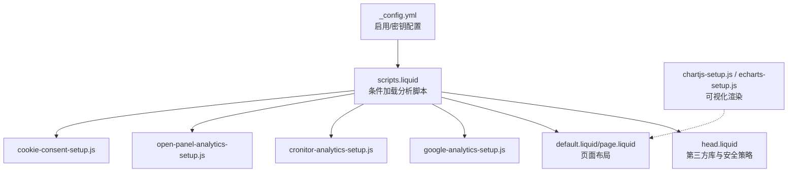
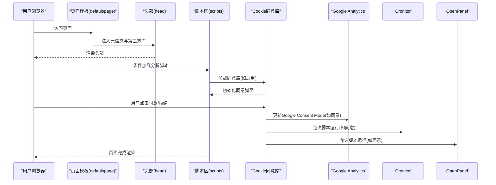
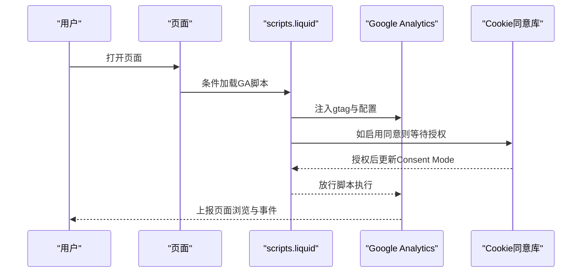
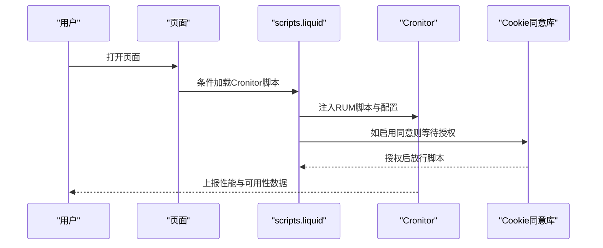
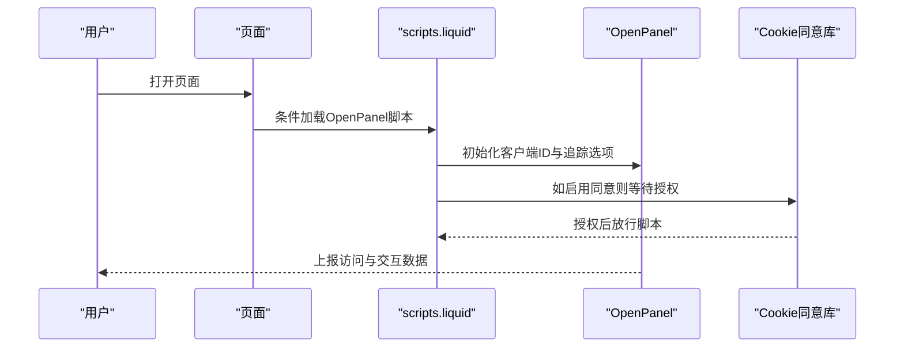
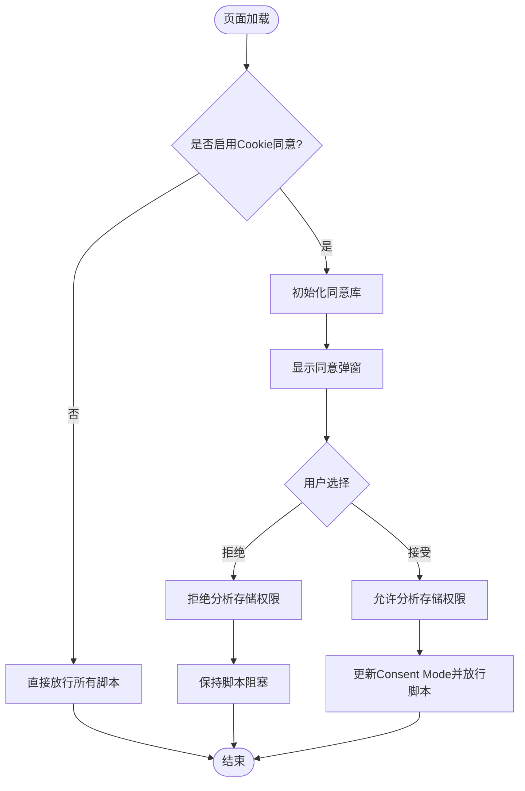
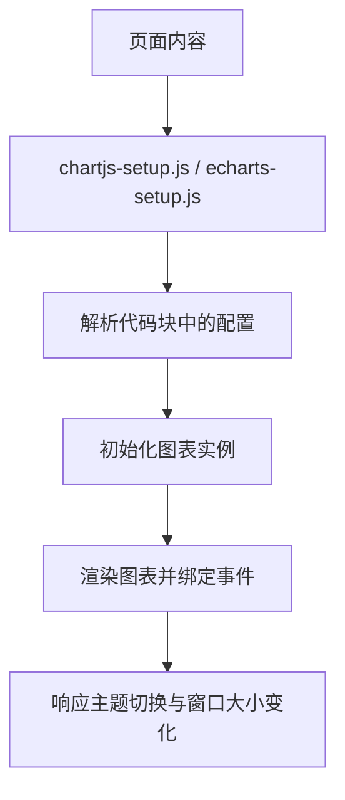
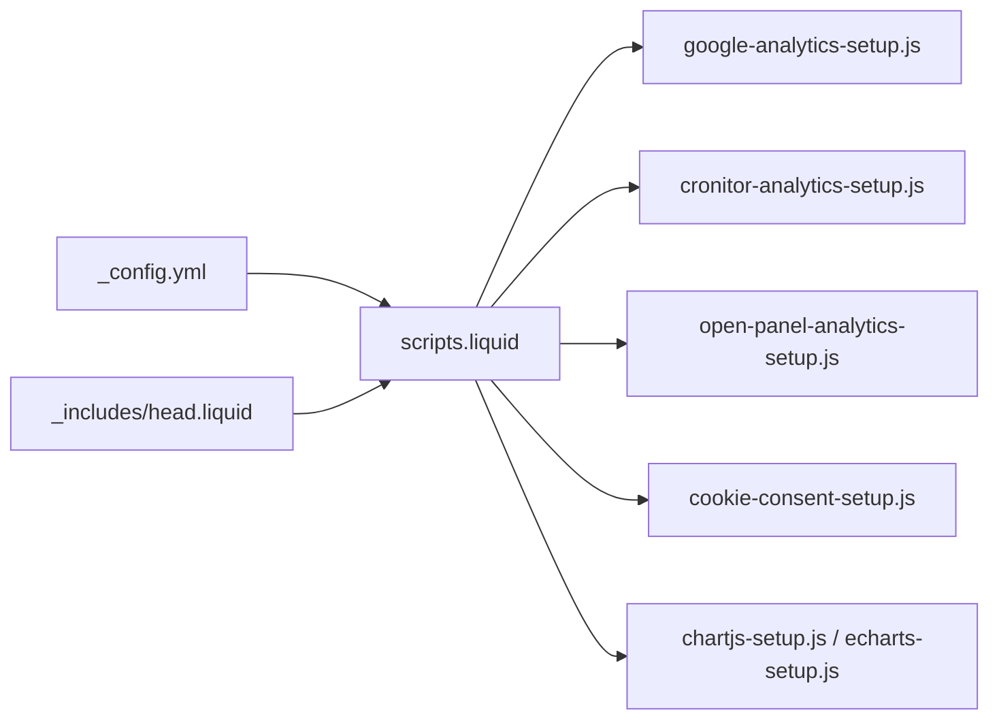

# 分析和跟踪

<cite>
**本文引用的文件**
- [ANALYTICS.md](file://ANALYTICS.md)
- [_config.yml](file://_config.yml)
- [google-analytics-setup.js](file://_scripts/google-analytics-setup.js)
- [cronitor-analytics-setup.js](file://_scripts/cronitor-analytics-setup.js)
- [open-panel-analytics-setup.js](file://_scripts/open-panel-analytics-setup.js)
- [cookie-consent-setup.js](file://_scripts/cookie-consent-setup.js)
- [head.liquid](file://_includes/head.liquid)
- [scripts.liquid](file://_includes/scripts.liquid)
- [metadata.liquid](file://_includes/metadata.liquid)
- [default.liquid](file://_layouts/default.liquid)
- [page.liquid](file://_layouts/page.liquid)
- [chartjs-setup.js](file://assets/js/chartjs-setup.js)
- [echarts-setup.js](file://assets/js/echarts-setup.js)
</cite>

## 目录
1. [简介](#简介)
2. [项目结构](#项目结构)
3. [核心组件](#核心组件)
4. [架构总览](#架构总览)
5. [详细组件分析](#详细组件分析)
6. [依赖关系分析](#依赖关系分析)
7. [性能考量](#性能考量)
8. [故障排查指南](#故障排查指南)
9. [结论](#结论)
10. [附录](#附录)

## 简介
本文件面向分析与跟踪功能的技术文档，聚焦以下方面：
- Google Analytics 的集成配置（跟踪 ID 设置、事件追踪、用户行为分析）
- Cronitor 监控系统（站点健康检查、性能监控、异常告警）
- Open Panel 分析工具（访问统计、用户来源分析、页面性能监控）
- 隐私保护与 GDPR 合规（数据收集控制、用户同意管理、数据删除机制）
- 分析数据的可视化展示与报告生成
- 调试技巧与常见问题解决方案

该站点基于 Jekyll 模板（al-folio），通过配置文件与 Liquid 模板在构建时注入分析脚本，并结合 Cookie 同意机制实现合规化部署。

## 项目结构
围绕分析与跟踪的关键文件组织如下：
- 配置层：站点配置集中于配置文件，启用/禁用各分析服务并传入密钥
- 模板层：在页面头部与脚本区段按需加载分析脚本与第三方库
- 脚本层：各分析服务的初始化脚本以独立文件形式存在，便于版本与缓存管理
- 可视化层：图表库初始化脚本负责解析代码块中的配置并渲染图表

**图示来源**
- [_config.yml](file://_config.yml)
- [scripts.liquid](file://_includes/scripts.liquid)
- [head.liquid](file://_includes/head.liquid)
- [default.liquid](file://_layouts/default.liquid)
- [page.liquid](file://_layouts/page.liquid)
- [google-analytics-setup.js](file://_scripts/google-analytics-setup.js)
- [cronitor-analytics-setup.js](file://_scripts/cronitor-analytics-setup.js)
- [open-panel-analytics-setup.js](file://_scripts/open-panel-analytics-setup.js)
- [cookie-consent-setup.js](file://_scripts/cookie-consent-setup.js)
- [chartjs-setup.js](file://assets/js/chartjs-setup.js)
- [echarts-setup.js](file://assets/js/echarts-setup.js)

**章节来源**
- [_config.yml](file://_config.yml)
- [scripts.liquid](file://_includes/scripts.liquid)
- [head.liquid](file://_includes/head.liquid)
- [default.liquid](file://_layouts/default.liquid)
- [page.liquid](file://_layouts/page.liquid)

## 核心组件
- 配置开关与密钥
  - 在配置文件中启用/禁用各分析服务，并填入对应密钥或站点 ID
  - 示例键位：启用开关、Google Analytics 测量 ID、Cronitor 站点 ID、Pirsch 站点 ID、OpenPanel 客户端 ID
- 分析脚本注入
  - 通过模板条件判断，仅在启用相应服务时加载脚本与初始化代码
  - 支持 Cookie 同意模式下，脚本以占位类型与分类属性标记，等待用户授权后运行
- Cookie 同意与隐私模式
  - 初始化 Google Consent Mode，设置默认拒绝存储权限
  - 使用第三方 Cookie 同意库，提供弹窗与偏好设置，更新 Google Consent Mode 以尊重用户选择
- 可视化与报告
  - 内置图表库初始化脚本，解析页面中的配置代码块并渲染图表，用于报告与展示

**章节来源**
- [_config.yml](file://_config.yml)
- [scripts.liquid](file://_includes/scripts.liquid)
- [cookie-consent-setup.js](file://_scripts/cookie-consent-setup.js)
- [chartjs-setup.js](file://assets/js/chartjs-setup.js)
- [echarts-setup.js](file://assets/js/echarts-setup.js)

## 架构总览
整体流程：站点构建时根据配置决定是否注入分析脚本；页面加载时，若启用 Cookie 同意，则先加载同意库，再依据用户选择动态放行脚本；分析脚本完成初始化后开始采集数据；可视化脚本解析页面内容并渲染图表。

**图示来源**
- [default.liquid](file://_layouts/default.liquid)
- [page.liquid](file://_layouts/page.liquid)
- [head.liquid](file://_includes/head.liquid)
- [scripts.liquid](file://_includes/scripts.liquid)
- [cookie-consent-setup.js](file://_scripts/cookie-consent-setup.js)
- [google-analytics-setup.js](file://_scripts/google-analytics-setup.js)
- [cronitor-analytics-setup.js](file://_scripts/cronitor-analytics-setup.js)
- [open-panel-analytics-setup.js](file://_scripts/open-panel-analytics-setup.js)

## 详细组件分析

### Google Analytics 集成
- 配置步骤
  - 创建账户并获取测量 ID（Measurement ID）
  - 在配置文件中启用开关并填入测量 ID
  - 提交更改后，构建站点并在实时标签验证
- 初始化流程
  - 动态注入 gtag 脚本与初始化代码，使用站点配置中的测量 ID
  - 若启用 Cookie 同意，脚本以占位类型与分类属性标记，等待授权
  - 同意后通过 Google Consent Mode 更新存储许可，允许数据写入
- 事件追踪与用户行为
  - 基于 GA4 的事件模型进行自定义事件上报
  - 结合页面浏览、交互元素点击等行为进行归因分析
- 数据处理与延迟
  - 实时数据通常秒级可见，趋势数据约 24–48 小时生效

**图示来源**
- [scripts.liquid](file://_includes/scripts.liquid)
- [google-analytics-setup.js](file://_scripts/google-analytics-setup.js)
- [cookie-consent-setup.js](file://_scripts/cookie-consent-setup.js)

**章节来源**
- [ANALYTICS.md](file://ANALYTICS.md)
- [_config.yml](file://_config.yml)
- [scripts.liquid](file://_includes/scripts.liquid)
- [google-analytics-setup.js](file://_scripts/google-analytics-setup.js)
- [cookie-consent-setup.js](file://_scripts/cookie-consent-setup.js)

### Cronitor 监控系统
- 功能定位
  - 站点可用性监控与 RUM（真实用户监控）性能指标采集
- 配置与部署
  - 在配置文件中启用开关并填入站点 ID
  - 页面加载时注入 Cronitor RUM 脚本与初始化代码
- 运行机制
  - 若启用 Cookie 同意，脚本同样以占位方式等待授权
  - 同意后开始采集性能与可用性数据
- 告警与报告
  - 基于站点健康状态与性能阈值触发告警
  - 结合仪表盘查看实时与历史趋势

**图示来源**
- [scripts.liquid](file://_includes/scripts.liquid)
- [cronitor-analytics-setup.js](file://_scripts/cronitor-analytics-setup.js)
- [cookie-consent-setup.js](file://_scripts/cookie-consent-setup.js)

**章节来源**
- [ANALYTICS.md](file://ANALYTICS.md)
- [_config.yml](file://_config.yml)
- [scripts.liquid](file://_includes/scripts.liquid)
- [cronitor-analytics-setup.js](file://_scripts/cronitor-analytics-setup.js)
- [cookie-consent-setup.js](file://_scripts/cookie-consent-setup.js)

### Open Panel 分析工具
- 特性与优势
  - 开源、可自托管、注重隐私
  - 支持屏幕视图、外链追踪、属性追踪等
- 配置与初始化
  - 在配置文件中启用开关并填入客户端 ID
  - 页面加载时注入初始化脚本，开启关键追踪选项
- 合规与隐私
  - 默认不收集敏感数据，适合对隐私要求较高的场景
  - 若启用 Cookie 同意，脚本同样受控于用户授权

**图示来源**
- [scripts.liquid](file://_includes/scripts.liquid)
- [open-panel-analytics-setup.js](file://_scripts/open-panel-analytics-setup.js)
- [cookie-consent-setup.js](file://_scripts/cookie-consent-setup.js)

**章节来源**
- [ANALYTICS.md](file://ANALYTICS.md)
- [_config.yml](file://_config.yml)
- [scripts.liquid](file://_includes/scripts.liquid)
- [open-panel-analytics-setup.js](file://_scripts/open-panel-analytics-setup.js)
- [cookie-consent-setup.js](file://_scripts/cookie-consent-setup.js)

### Cookie 同意与隐私模式
- 设计原则
  - 所有分析脚本以占位类型与分类属性标记
  - 默认拒绝存储权限，确保在未获得明确同意前不进行任何数据采集
  - 对 Google Analytics 使用隐私模式（Consent Mode），尊重用户选择
- 用户交互
  - 弹窗提供“全部接受”“仅必要”“管理偏好”等选项
  - 修改偏好会即时更新 Consent Mode，影响后续脚本放行
- 合规要点
  - 明确标注各服务的数据用途与存储范围
  - 提供清晰的隐私政策链接与联系方式

**图示来源**
- [scripts.liquid](file://_includes/scripts.liquid)
- [cookie-consent-setup.js](file://_scripts/cookie-consent-setup.js)

**章节来源**
- [cookie-consent-setup.js](file://_scripts/cookie-consent-setup.js)
- [scripts.liquid](file://_includes/scripts.liquid)

### 分析数据可视化与报告生成
- 图表库支持
  - Chart.js：解析页面中特定语言代码块，渲染图表
  - ECharts：在页面就绪后扫描代码块，初始化图表并响应窗口尺寸变化
- 使用建议
  - 将图表配置以 JSON 形式放入代码块，前端自动渲染
  - 结合分析数据导出，生成静态或动态报告
- 报告维度
  - 访问统计、用户来源、页面性能、转化路径等

**图示来源**
- [chartjs-setup.js](file://assets/js/chartjs-setup.js)
- [echarts-setup.js](file://assets/js/echarts-setup.js)

**章节来源**
- [chartjs-setup.js](file://assets/js/chartjs-setup.js)
- [echarts-setup.js](file://assets/js/echarts-setup.js)

## 依赖关系分析
- 配置驱动的依赖
  - 配置文件决定是否加载某分析服务及其初始化参数
- 模板层耦合
  - 头部模板负责安全策略与第三方库加载
  - 脚本模板负责条件注入与脚本顺序
- 脚本间解耦
  - 各分析脚本独立初始化，互不影响
  - Cookie 同意库作为统一入口协调脚本放行

**图示来源**
- [_config.yml](file://_config.yml)
- [scripts.liquid](file://_includes/scripts.liquid)
- [head.liquid](file://_includes/head.liquid)
- [google-analytics-setup.js](file://_scripts/google-analytics-setup.js)
- [cronitor-analytics-setup.js](file://_scripts/cronitor-analytics-setup.js)
- [open-panel-analytics-setup.js](file://_scripts/open-panel-analytics-setup.js)
- [cookie-consent-setup.js](file://_scripts/cookie-consent-setup.js)
- [chartjs-setup.js](file://assets/js/chartjs-setup.js)
- [echarts-setup.js](file://assets/js/echarts-setup.js)

**章节来源**
- [_config.yml](file://_config.yml)
- [scripts.liquid](file://_includes/scripts.liquid)
- [head.liquid](file://_includes/head.liquid)

## 性能考量
- 资源加载优化
  - 使用 defer 与异步加载，避免阻塞主线程
  - 第三方库通过 CDN 提供完整性校验，减少本地维护成本
- 分析脚本延迟
  - Cookie 同意弹窗可能延后脚本执行，建议合理安排非关键脚本的加载时机
- 可视化渲染
  - 图表初始化在页面就绪后进行，避免重复渲染
  - 响应式图表需监听窗口尺寸变化，保证在不同设备上的表现一致

## 故障排查指南
- 无法看到实时数据
  - 确认已在配置文件中启用对应服务并填入正确密钥
  - 检查是否启用了 Cookie 同意且用户已授予分析权限
  - 验证初始化脚本是否成功注入（查看网络面板与控制台）
- 数据缺失或延迟
  - Google Analytics 趋势数据通常需要 24–48 小时
  - Cronitor 与 OpenPanel 需要一定访问量才能形成稳定指标
- 图表未渲染
  - 确认代码块格式正确，包含可解析的配置 JSON
  - 检查图表库脚本是否加载成功
- 合规问题
  - 若位于欧盟地区，启用 Google Analytics 或 Cronitor 时必须提供 Cookie 同意弹窗
  - 确保隐私政策清晰说明数据用途与保留期限

**章节来源**
- [ANALYTICS.md](file://ANALYTICS.md)
- [scripts.liquid](file://_includes/scripts.liquid)
- [cookie-consent-setup.js](file://_scripts/cookie-consent-setup.js)
- [chartjs-setup.js](file://assets/js/chartjs-setup.js)
- [echarts-setup.js](file://assets/js/echarts-setup.js)

## 结论
本项目通过配置驱动的方式灵活集成多类分析与监控能力，结合 Cookie 同意机制实现隐私优先的部署策略。借助图表库脚本，可在页面内直接生成可视化报告，满足日常运营与合规需求。建议根据业务目标选择合适的服务组合，并持续关注数据质量与用户体验平衡。

## 附录
- 快速对照表
  - Google Analytics：启用开关、测量 ID、实时验证
  - Cronitor：启用开关、站点 ID、RUM 采集
  - OpenPanel：启用开关、客户端 ID、追踪选项
  - Cookie 同意：启用开关、弹窗文案、Consent Mode 更新
  - 可视化：Chart.js/ECharts 代码块格式、主题适配