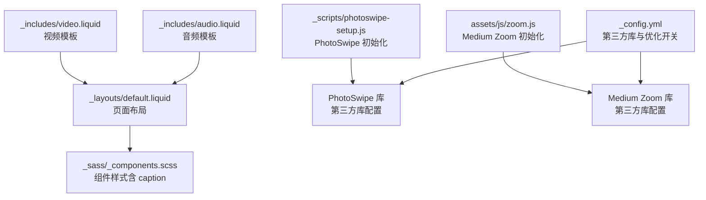
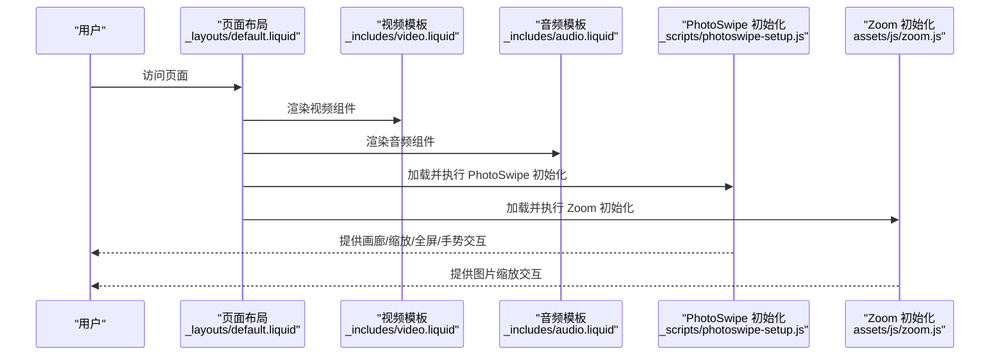
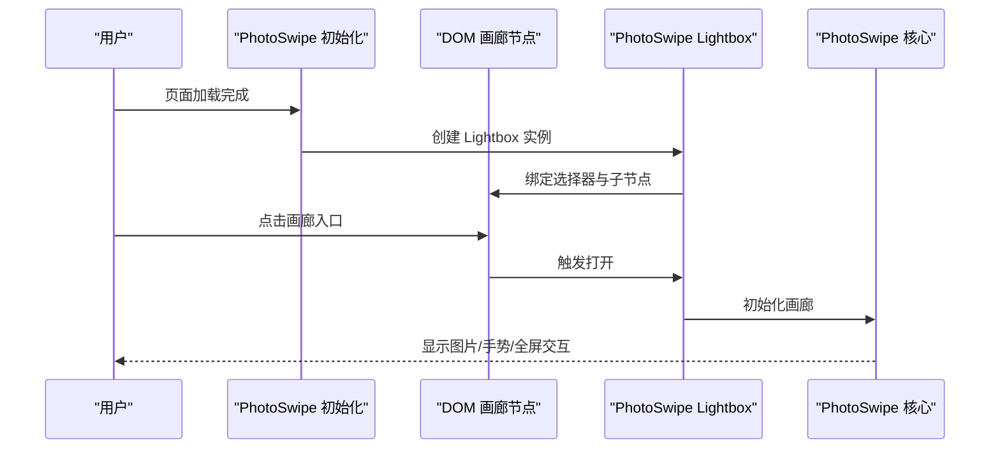
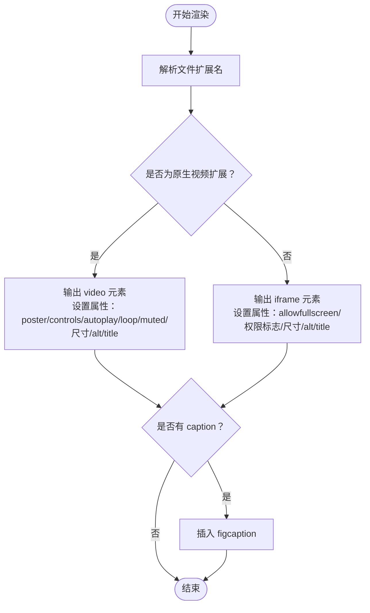
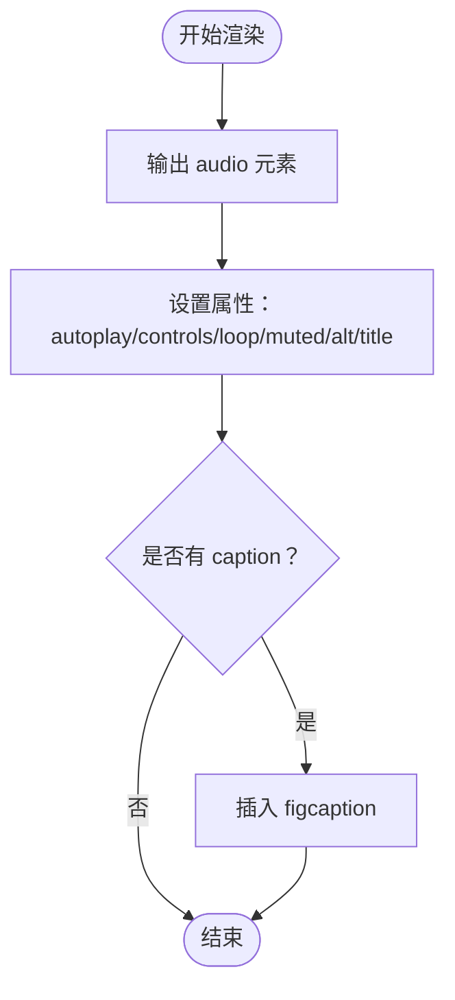
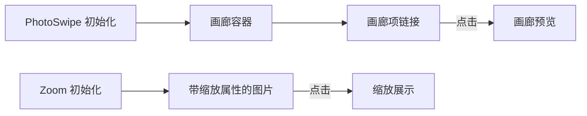
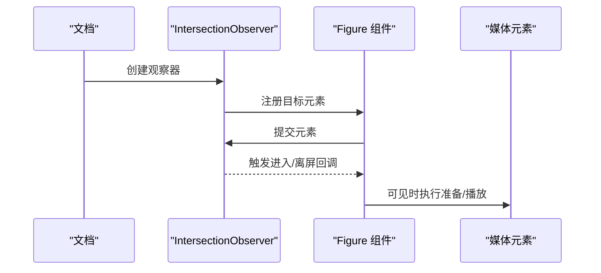
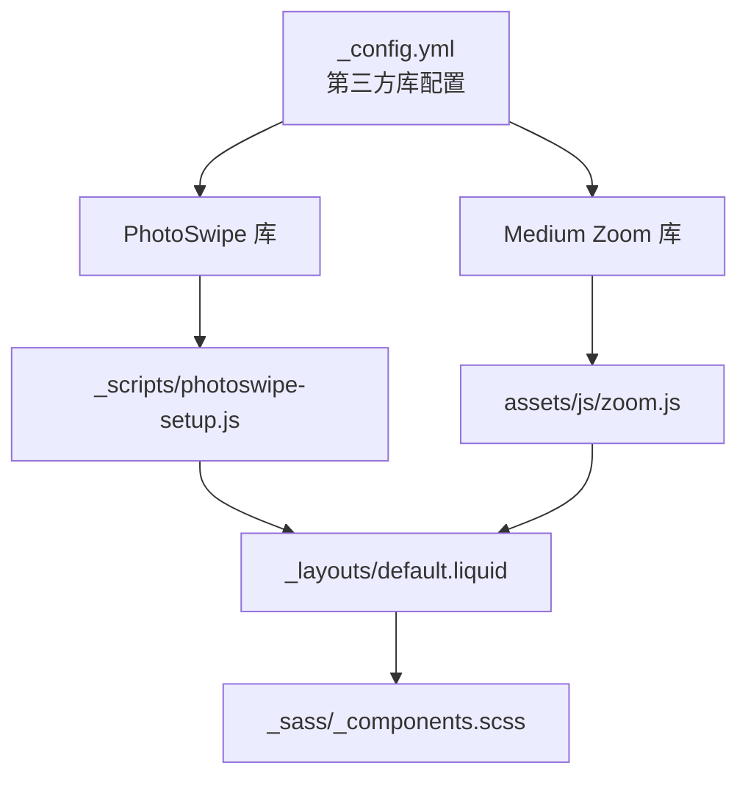

# 多媒体增强功能

<cite>
**本文档引用的文件**
- [_scripts/photoswipe-setup.js](file://_scripts/photoswipe-setup.js)
- [_includes/video.liquid](file://_includes/video.liquid)
- [_includes/audio.liquid](file://_includes/audio.liquid)
- [_config.yml](file://_config.yml)
- [assets/js/zoom.js](file://assets/js/zoom.js)
- [_layouts/default.liquid](file://_layouts/default.liquid)
- [_sass/_components.scss](file://_sass/_components.scss)
- [assets/js/distillpub/template.v2.js](file://assets/js/distillpub/template.v2.js)
</cite>

## 目录
1. [简介](#简介)
2. [项目结构](#项目结构)
3. [核心组件](#核心组件)
4. [架构总览](#架构总览)
5. [详细组件分析](#详细组件分析)
6. [依赖关系分析](#依赖关系分析)
7. [性能考虑](#性能考虑)
8. [故障排除指南](#故障排除指南)
9. [结论](#结论)

## 简介
本文件面向多媒体增强功能，围绕以下目标展开：PhotoSwipe 图片画廊的集成与配置（图片预览、缩放、全屏、手势控制）、HTML5 视频播放器实现（原生标签、自定义控件、响应式布局、字幕支持）、音频播放功能（音乐播放器、播客集成、音效控制、循环播放）、多媒体资源优化策略（懒加载、预加载、格式转换、压缩）、无障碍访问支持（屏幕阅读器兼容、键盘导航、替代文本）、多媒体事件监听与自定义交互逻辑、以及性能优化与错误处理最佳实践。

## 项目结构
多媒体功能主要由三部分构成：
- 模板组件：通过 Liquid 模板封装 HTML5 媒体元素，统一属性注入与可选参数（如 autoplay、controls、loop、muted、poster、宽高与最小最大尺寸、alt/title/caption 等）。
- 脚本初始化：PhotoSwipe 画廊初始化脚本与 Medium Zoom 图片缩放初始化脚本，分别负责图片画廊与单图缩放。
- 配置与主题：站点配置中声明第三方库版本与完整性校验，以及启用懒加载与响应式 WebP 图像等优化选项。

**图表来源**
- [_includes/video.liquid:1-98](file://_includes/video.liquid#L1-L98)
- [_includes/audio.liquid:1-31](file://_includes/audio.liquid#L1-L31)
- [_scripts/photoswipe-setup.js:1-12](file://_scripts/photoswipe-setup.js#L1-L12)
- [assets/js/zoom.js:1-6](file://assets/js/zoom.js#L1-L6)
- [_config.yml:405-634](file://_config.yml#L405-L634)
- [_layouts/default.liquid:1-57](file://_layouts/default.liquid#L1-L57)
- [_sass/_components.scss:28-36](file://_sass/_components.scss#L28-L36)

**章节来源**
- [_includes/video.liquid:1-98](file://_includes/video.liquid#L1-L98)
- [_includes/audio.liquid:1-31](file://_includes/audio.liquid#L1-L31)
- [_scripts/photoswipe-setup.js:1-12](file://_scripts/photoswipe-setup.js#L1-L12)
- [assets/js/zoom.js:1-6](file://assets/js/zoom.js#L1-L6)
- [_config.yml:405-634](file://_config.yml#L405-L634)
- [_layouts/default.liquid:1-57](file://_layouts/default.liquid#L1-L57)
- [_sass/_components.scss:28-36](file://_sass/_components.scss#L28-L36)

## 核心组件
- PhotoSwipe 画廊初始化：通过导入第三方库模块，创建 Lightbox 实例并绑定到具有特定类名的画廊容器，自动为子节点（链接）启用画廊交互。
- 视频组件：根据扩展名判断使用原生 video 元素或 iframe 嵌入，支持多种尺寸与约束、标题/替代文本、封面图、自动播放、控件、循环与静音等属性。
- 音频组件：提供基础的 audio 元素封装，支持标题/替代文本、自动播放、控件、循环与静音等属性。
- Medium Zoom 图片缩放：在文档就绪后对带数据属性的图片启用缩放，背景色与主题一致。
- 响应式与懒加载：站点配置启用图像懒加载与响应式 WebP 生成，提升加载性能与兼容性。

**章节来源**
- [_scripts/photoswipe-setup.js:4-11](file://_scripts/photoswipe-setup.js#L4-L11)
- [_includes/video.liquid:1-98](file://_includes/video.liquid#L1-L98)
- [_includes/audio.liquid:1-31](file://_includes/audio.liquid#L1-L31)
- [assets/js/zoom.js:1-6](file://assets/js/zoom.js#L1-L6)
- [_config.yml:374-376](file://_config.yml#L374-L376)
- [_config.yml:352-368](file://_config.yml#L352-L368)

## 架构总览
多媒体功能的运行时架构如下：
- 页面渲染阶段：Liquid 模板根据传入参数生成 HTML5 媒体元素；布局文件引入通用脚本。
- 初始化阶段：PhotoSwipe 与 Medium Zoom 在页面加载完成后初始化，建立事件监听与交互。
- 运行时阶段：用户触发缩放/画廊浏览、视频/音频播放控制、响应式尺寸适配与懒加载生效。

**图表来源**
- [_layouts/default.liquid:1-57](file://_layouts/default.liquid#L1-L57)
- [_includes/video.liquid:1-98](file://_includes/video.liquid#L1-L98)
- [_includes/audio.liquid:1-31](file://_includes/audio.liquid#L1-L31)
- [_scripts/photoswipe-setup.js:1-12](file://_scripts/photoswipe-setup.js#L1-L12)
- [assets/js/zoom.js:1-6](file://assets/js/zoom.js#L1-L6)

## 详细组件分析

### PhotoSwipe 图片画廊
- 组件职责：为一组图片链接提供现代化画廊体验，支持缩放、全屏、手势与键盘导航。
- 集成方式：通过导入第三方库模块，构造 Lightbox 并绑定到指定选择器，自动发现子节点。
- 配置要点：选择器需与模板输出的容器类名一致；模块引用指向官方 ESM 版本以获得更好的打包与按需加载能力。
- 交互特性：点击进入画廊，支持双击/捏合缩放、滑动切换、全屏模式、ESC 退出等。

**图表来源**
- [_scripts/photoswipe-setup.js:6-11](file://_scripts/photoswipe-setup.js#L6-L11)

**章节来源**
- [_scripts/photoswipe-setup.js:1-12](file://_scripts/photoswipe-setup.js#L1-L12)
- [_config.yml:540-552](file://_config.yml#L540-L552)

### 视频播放器
- 组件职责：提供统一的视频/嵌入式视频渲染接口，支持多种扩展名与外链视频源。
- 渲染逻辑：
  - 当扩展名为 mp4/webm/ogg 时，使用原生 video 元素，支持 poster、controls、autoplay、loop、muted 等属性。
  - 否则使用 iframe 嵌入，适用于外部平台视频（如 YouTube/Vimeo），自动开启全屏与现代权限标志。
- 响应式与尺寸：支持 width/height 与 min/max 宽高约束，配合 CSS 可实现流式布局。
- 字幕支持：可通过原生 video 的 track 元素扩展（在模板中未直接暴露该参数，但可在调用处自行补充）。
- 可访问性：建议为视频提供 alt/title 与可选的 caption，便于屏幕阅读器理解内容语义。

**图表来源**
- [_includes/video.liquid:1-98](file://_includes/video.liquid#L1-L98)

**章节来源**
- [_includes/video.liquid:1-98](file://_includes/video.liquid#L1-L98)
- [_sass/_components.scss:28-36](file://_sass/_components.scss#L28-L36)

### 音频播放功能
- 组件职责：提供统一的音频播放封装，支持标题/替代文本、自动播放、控件、循环与静音。
- 使用场景：音乐播放器、播客集成、音效控制等。
- 可访问性：建议提供 alt/title 与可选 caption，帮助视障用户理解音频内容。

**图表来源**
- [_includes/audio.liquid:1-31](file://_includes/audio.liquid#L1-L31)

**章节来源**
- [_includes/audio.liquid:1-31](file://_includes/audio.liquid#L1-L31)
- [_sass/_components.scss:28-36](file://_sass/_components.scss#L28-L36)

### 图片缩放与画廊联动
- Medium Zoom：为单张图片提供缩放，背景色与主题一致，适合文章内图片放大查看。
- PhotoSwipe：为多张图片提供画廊浏览，支持手势切换与全屏。
- 协同策略：在图文混排场景下，优先使用 Zoom 查看单图细节，再通过画廊进行系列图片浏览。

**图表来源**
- [assets/js/zoom.js:1-6](file://assets/js/zoom.js#L1-L6)
- [_scripts/photoswipe-setup.js:6-11](file://_scripts/photoswipe-setup.js#L6-L11)

**章节来源**
- [assets/js/zoom.js:1-6](file://assets/js/zoom.js#L1-L6)
- [_scripts/photoswipe-setup.js:1-12](file://_scripts/photoswipe-setup.js#L1-L12)

### 媒体事件监听与自定义交互
- Distill 发布物中的 Figure 组件展示了基于 IntersectionObserver 的“进入/离屏”事件机制，可用于媒体元素的懒加载与可见性感知。
- 自定义交互建议：
  - 监听视频/音频的 play/pause/ended/loadstart 等事件，动态更新 UI 或统计埋点。
  - 结合 IntersectionObserver 判断媒体元素是否进入视口，再触发加载或播放，减少首屏压力。
  - 为画廊/缩放组件提供键盘快捷键（如方向键、ESC）增强可访问性。

**图表来源**
- [assets/js/distillpub/template.v2.js:4794-4834](file://assets/js/distillpub/template.v2.js#L4794-L4834)
- [assets/js/distillpub/template.v2.js:4853-4876](file://assets/js/distillpub/template.v2.js#L4853-L4876)

**章节来源**
- [assets/js/distillpub/template.v2.js:4717-4876](file://assets/js/distillpub/template.v2.js#L4717-L4876)

## 依赖关系分析
- 第三方库管理：站点配置集中声明 PhotoSwipe 与 Medium Zoom 的版本、CDN 地址与完整性校验，确保安全与一致性。
- 脚本加载顺序：布局文件引入通用脚本，PhotoSwipe 与 Zoom 初始化脚本在页面就绪后执行，避免 DOM 未就绪导致的初始化失败。
- 样式与组件：caption 统一样式位于组件样式表中，保证视频/音频与图片的标注风格一致。

**图表来源**
- [_config.yml:405-634](file://_config.yml#L405-L634)
- [_scripts/photoswipe-setup.js:1-12](file://_scripts/photoswipe-setup.js#L1-L12)
- [assets/js/zoom.js:1-6](file://assets/js/zoom.js#L1-L6)
- [_layouts/default.liquid:1-57](file://_layouts/default.liquid#L1-L57)
- [_sass/_components.scss:28-36](file://_sass/_components.scss#L28-L36)

**章节来源**
- [_config.yml:405-634](file://_config.yml#L405-L634)
- [_layouts/default.liquid:1-57](file://_layouts/default.liquid#L1-L57)

## 性能考虑
- 懒加载与响应式图像：启用图像懒加载与响应式 WebP 生成，降低首屏体积与网络开销。
- 媒体预加载策略：根据场景选择合适的 preload 值（none/metadata/auto），避免不必要的带宽占用。
- 格式与压缩：优先采用现代编码（如 H.265/AV1 对于视频，Opus/Ogg 对于音频），结合 CDN 与缓存策略提升加载速度。
- 画廊与缩放：仅在需要时初始化 PhotoSwipe/Zoom，避免对静态图片造成额外负担；对大图采用分层缩略图与渐进式加载。

**章节来源**
- [_config.yml:352-368](file://_config.yml#L352-L368)
- [_config.yml:374-376](file://_config.yml#L374-L376)

## 故障排除指南
- 画廊不生效
  - 检查容器类名与初始化脚本选择器是否一致。
  - 确认第三方库版本与完整性校验正确。
- 缩放无响应
  - 确保图片具备缩放属性且脚本已执行。
  - 检查主题颜色变量是否正确解析。
- 视频无法播放
  - 确认浏览器对所选格式的支持情况，必要时提供多种格式备用。
  - 检查 autoplay 策略（静音/用户交互要求）与跨域资源权限。
- 嵌入视频无法全屏
  - 确认 iframe 的 allowfullscreen 与权限标志已正确设置。
- 可访问性问题
  - 为所有媒体提供 alt/title 与可选 caption；为键盘用户提供快捷键支持。

**章节来源**
- [_scripts/photoswipe-setup.js:6-11](file://_scripts/photoswipe-setup.js#L6-L11)
- [assets/js/zoom.js:1-6](file://assets/js/zoom.js#L1-L6)
- [_includes/video.liquid:55-92](file://_includes/video.liquid#L55-L92)
- [_includes/audio.liquid:1-31](file://_includes/audio.liquid#L1-L31)

## 结论
本项目的多媒体增强功能通过模板化封装、第三方库集成与站点级优化配置，实现了从图片画廊、视频/音频播放到可访问性与性能优化的完整闭环。建议在实际使用中遵循可访问性规范、合理选择媒体格式与预加载策略，并结合事件监听与懒加载机制进一步提升用户体验与性能表现。