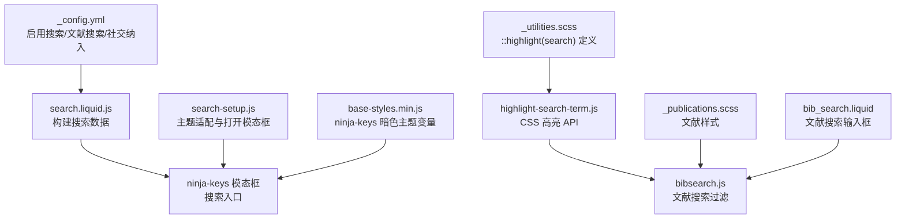
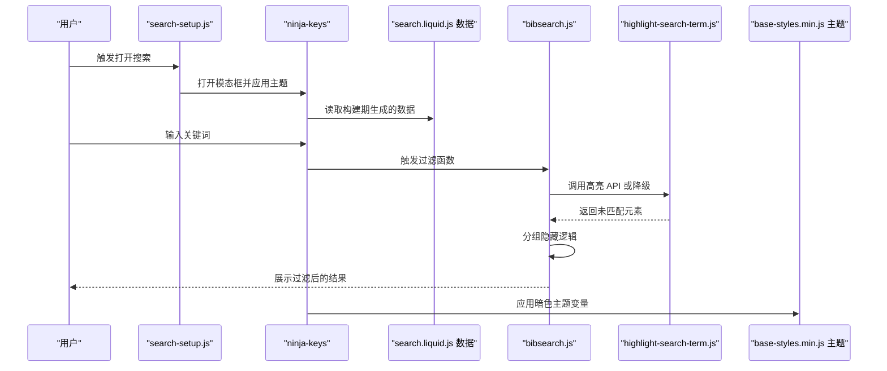
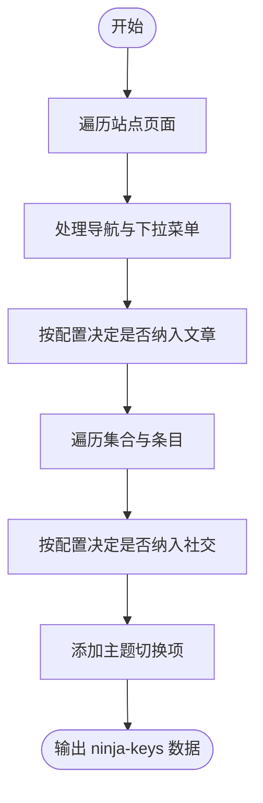
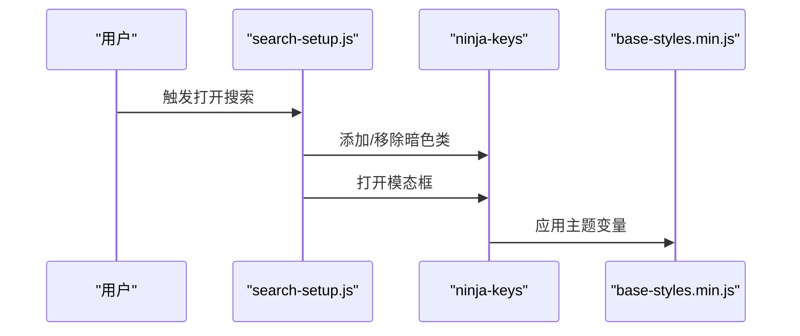
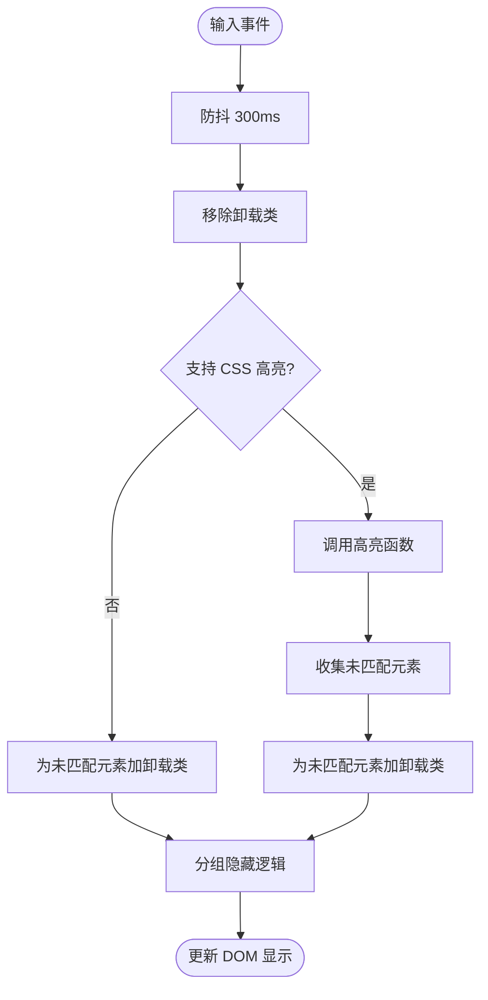
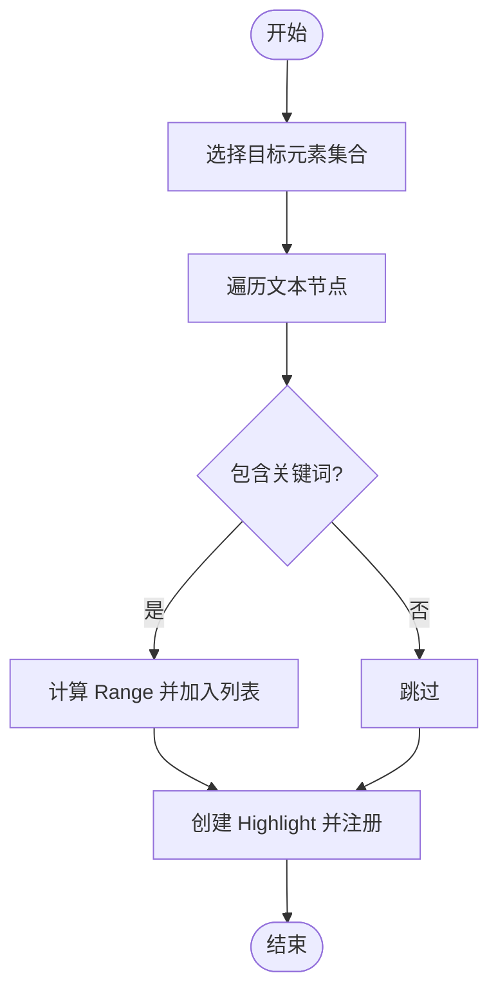
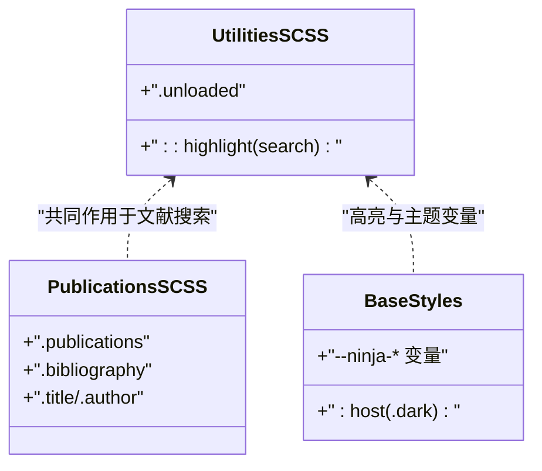
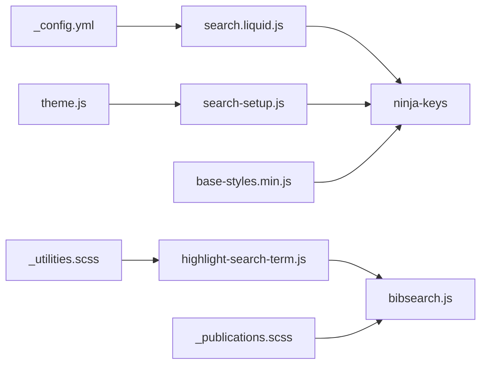

# 搜索功能

<cite>
**本文引用的文件**
- [search.liquid.js](file://_scripts/search.liquid.js)
- [search-setup.js](file://assets/js/search-setup.js)
- [highlight-search-term.js](file://assets/js/highlight-search-term.js)
- [bibsearch.js](file://assets/js/bibsearch.js)
- [_config.yml](file://_config.yml)
- [_publications.scss](file://_sass/_publications.scss)
- [_utilities.scss](file://_sass/_utilities.scss)
- [common.js](file://assets/js/common.js)
- [base-styles.min.js](file://assets/js/search/base-styles.min.js)
- [bib_search.liquid](file://_includes/bib_search.liquid)
</cite>

## 目录
1. [简介](#简介)
2. [项目结构](#项目结构)
3. [核心组件](#核心组件)
4. [架构总览](#架构总览)
5. [详细组件分析](#详细组件分析)
6. [依赖关系分析](#依赖关系分析)
7. [性能考虑](#性能考虑)
8. [故障排除指南](#故障排除指南)
9. [结论](#结论)
10. [附录](#附录)

## 简介
本文件系统性地阐述该站点的搜索功能，覆盖以下方面：
- 全文搜索算法与索引构建：基于 Jekyll 构建时的数据聚合与前端检索。
- 查询解析与结果过滤：输入解析、敏感度控制（防抖）、分组隐藏逻辑。
- 结果高亮：基于 CSS 自定义高亮 API 的关键词高亮与降级方案。
- 搜索界面与样式：输入框、下拉列表、结果展示与暗色主题适配。
- 配置项：搜索开关、社交链接与文章纳入搜索、文献搜索开关等。
- 性能优化：防抖、异步加载、降级策略。
- 使用示例与故障排除。

## 项目结构
搜索相关能力由三部分组成：
- 构建期数据导出：通过 Liquid 模板在构建期生成可搜索数据。
- 运行期界面与逻辑：ninja-keys 搜索模态框、文献搜索过滤、关键词高亮。
- 样式与主题：SCSS 变量与 CSS 自定义高亮伪元素、暗色主题变量。

**图表来源**
- [_config.yml:57-60](file://_config.yml#L57-L60)
- [search.liquid.js:1-342](file://_scripts/search.liquid.js#L1-L342)
- [search-setup.js:1-18](file://assets/js/search-setup.js#L1-L18)
- [highlight-search-term.js:1-111](file://assets/js/highlight-search-term.js#L1-L111)
- [bibsearch.js:1-71](file://assets/js/bibsearch.js#L1-L71)
- [_publications.scss:1-189](file://_sass/_publications.scss#L1-L189)
- [_utilities.scss:429-440](file://_sass/_utilities.scss#L429-L440)
- [base-styles.min.js:36-286](file://assets/js/search/base-styles.min.js#L36-L286)
- [bib_search.liquid:1-5](file://_includes/bib_search.liquid#L1-L5)

**章节来源**
- [_config.yml:57-60](file://_config.yml#L57-L60)
- [search.liquid.js:1-342](file://_scripts/search.liquid.js#L1-L342)
- [search-setup.js:1-18](file://assets/js/search-setup.js#L1-L18)
- [highlight-search-term.js:1-111](file://assets/js/highlight-search-term.js#L1-L111)
- [bibsearch.js:1-71](file://assets/js/bibsearch.js#L1-L71)
- [_publications.scss:1-189](file://_sass/_publications.scss#L1-L189)
- [_utilities.scss:429-440](file://_sass/_utilities.scss#L429-L440)
- [base-styles.min.js:36-286](file://assets/js/search/base-styles.min.js#L36-L286)
- [bib_search.liquid:1-5](file://_includes/bib_search.liquid#L1-L5)

## 核心组件
- 搜索数据构建器：在构建期遍历页面、集合、社交链接等，生成 ninja-keys 可消费的数据源。
- 搜索界面与入口：ninja-keys 模态框，支持主题切换、键盘快捷键等。
- 文献搜索过滤：对文献列表进行实时过滤，支持分组隐藏与高亮。
- 关键词高亮：基于 CSS 自定义高亮 API，兼容不支持浏览器的降级方案。
- 样式与主题：SCSS 变量驱动的高亮颜色与暗色主题变量，ninja-keys 组件样式。

**章节来源**
- [search.liquid.js:8-102](file://_scripts/search.liquid.js#L8-L102)
- [search-setup.js:1-18](file://assets/js/search-setup.js#L1-L18)
- [highlight-search-term.js:42-79](file://assets/js/highlight-search-term.js#L42-L79)
- [bibsearch.js:5-51](file://assets/js/bibsearch.js#L5-L51)
- [_utilities.scss:429-440](file://_sass/_utilities.scss#L429-L440)
- [base-styles.min.js:42-63](file://assets/js/search/base-styles.min.js#L42-L63)

## 架构总览
搜索从“构建期数据”到“运行期交互”的端到端流程如下：

**图表来源**
- [search-setup.js:10-17](file://assets/js/search-setup.js#L10-L17)
- [search.liquid.js:8-102](file://_scripts/search.liquid.js#L8-L102)
- [bibsearch.js:5-51](file://assets/js/bibsearch.js#L5-L51)
- [highlight-search-term.js:42-79](file://assets/js/highlight-search-term.js#L42-L79)
- [base-styles.min.js:42-63](file://assets/js/search/base-styles.min.js#L42-L63)

## 详细组件分析

### 组件A：搜索数据构建（Liquid）
- 数据来源：站点页面、集合、社交链接、主题切换项等。
- 输出格式：数组对象，包含 id、title、description、section、handler 等字段。
- 特性：支持导航、下拉菜单、文章、集合、社交链接、主题切换等多类条目；根据配置决定是否纳入文章与社交。

**图表来源**
- [search.liquid.js:8-102](file://_scripts/search.liquid.js#L8-L102)

**章节来源**
- [search.liquid.js:8-102](file://_scripts/search.liquid.js#L8-L102)

### 组件B：搜索界面与入口（ninja-keys）
- 主题适配：根据当前主题动态添加或移除暗色类名。
- 打开行为：关闭移动端导航栏后打开搜索模态框。
- 样式变量：通过 CSS 变量控制背景、文字、选中状态等。

**图表来源**
- [search-setup.js:1-17](file://assets/js/search-setup.js#L1-L17)
- [base-styles.min.js:42-63](file://assets/js/search/base-styles.min.js#L42-L63)

**章节来源**
- [search-setup.js:1-17](file://assets/js/search-setup.js#L1-L17)
- [base-styles.min.js:42-63](file://assets/js/search/base-styles.min.js#L42-L63)

### 组件C：文献搜索过滤与高亮（bibsearch + highlight-search-term）
- 过滤流程：移除卸载类 -> 高亮匹配 -> 未匹配元素添加卸载类 -> 分组隐藏逻辑。
- 防抖：输入停止 300ms 后执行过滤。
- 高亮：优先使用 CSS 高亮 API，否则回退到为未匹配元素添加卸载类。
- 分组隐藏：当某分组内全部条目被隐藏时，连同分组标题一并隐藏。

**图表来源**
- [bibsearch.js:5-51](file://assets/js/bibsearch.js#L5-L51)
- [highlight-search-term.js:42-79](file://assets/js/highlight-search-term.js#L42-L79)

**章节来源**
- [bibsearch.js:1-71](file://assets/js/bibsearch.js#L1-L71)
- [highlight-search-term.js:1-111](file://assets/js/highlight-search-term.js#L1-L111)
- [_utilities.scss:429-440](file://_sass/_utilities.scss#L429-L440)

### 组件D：高亮算法与关键词匹配
- 文本节点遍历：使用 TreeWalker 遍历指定容器内的文本节点。
- 匹配算法：大小写不敏感的子串查找，生成多个 Range。
- 高亮实现：创建 Highlight 对象并注册到 CSS.highlights。
- 降级策略：若不支持 CSS 高亮，则直接为未匹配元素添加卸载类。

**图表来源**
- [highlight-search-term.js:81-108](file://assets/js/highlight-search-term.js#L81-L108)

**章节来源**
- [highlight-search-term.js:42-108](file://assets/js/highlight-search-term.js#L42-L108)

### 组件E：样式与主题
- 高亮样式：通过 ::highlight(search) 定义背景色与文字色。
- 卸载类：.unloaded 控制元素隐藏。
- 暗色主题：ninja-keys 的 CSS 变量在暗色模式下调整背景、文字、边框等。
- 文献样式：文献列表的标题、条目、按钮、徽章等样式。

**图表来源**
- [_utilities.scss:429-440](file://_sass/_utilities.scss#L429-L440)
- [_publications.scss:7-183](file://_sass/_publications.scss#L7-L183)
- [base-styles.min.js:42-63](file://assets/js/search/base-styles.min.js#L42-L63)

**章节来源**
- [_utilities.scss:429-440](file://_sass/_utilities.scss#L429-L440)
- [_publications.scss:7-183](file://_sass/_publications.scss#L7-L183)
- [base-styles.min.js:42-63](file://assets/js/search/base-styles.min.js#L42-L63)

## 依赖关系分析
- 配置依赖：_config.yml 决定是否启用搜索、文献搜索、社交纳入等。
- 数据依赖：search.liquid.js 生成 ninja-keys 数据，供搜索界面使用。
- 逻辑依赖：search-setup.js 依赖 theme.js 中的主题设置，ninja-keys 依赖 base-styles 的主题变量。
- 样式依赖：文献样式与高亮样式共同影响过滤后的显示效果。

**图表来源**
- [_config.yml:57-60](file://_config.yml#L57-L60)
- [search.liquid.js:1-342](file://_scripts/search.liquid.js#L1-L342)
- [search-setup.js:1-17](file://assets/js/search-setup.js#L1-L17)
- [highlight-search-term.js:1-111](file://assets/js/highlight-search-term.js#L1-L111)
- [bibsearch.js:1-71](file://assets/js/bibsearch.js#L1-L71)
- [_publications.scss:1-189](file://_sass/_publications.scss#L1-L189)
- [_utilities.scss:429-440](file://_sass/_utilities.scss#L429-L440)
- [base-styles.min.js:36-286](file://assets/js/search/base-styles.min.js#L36-L286)

**章节来源**
- [_config.yml:57-60](file://_config.yml#L57-L60)
- [search.liquid.js:1-342](file://_scripts/search.liquid.js#L1-L342)
- [search-setup.js:1-17](file://assets/js/search-setup.js#L1-L17)
- [highlight-search-term.js:1-111](file://assets/js/highlight-search-term.js#L1-L111)
- [bibsearch.js:1-71](file://assets/js/bibsearch.js#L1-L71)
- [_publications.scss:1-189](file://_sass/_publications.scss#L1-L189)
- [_utilities.scss:429-440](file://_sass/_utilities.scss#L429-L440)
- [base-styles.min.js:36-286](file://assets/js/search/base-styles.min.js#L36-L286)

## 性能考虑
- 防抖处理：文献搜索对输入事件使用 300ms 防抖，降低频繁重排与高亮计算成本。
- 异步加载：ninja-keys 作为独立组件，初始化与主题切换在运行期完成，避免阻塞主内容渲染。
- 降级策略：在不支持 CSS 高亮 API 的浏览器中，采用为未匹配元素添加卸载类的方式，保证可用性。
- 样式与变量：通过 SCSS 变量统一管理高亮颜色与主题，减少重复计算与样式切换开销。

**章节来源**
- [bibsearch.js:59-65](file://assets/js/bibsearch.js#L59-L65)
- [highlight-search-term.js:47-47](file://assets/js/highlight-search-term.js#L47-L47)
- [_utilities.scss:429-440](file://_sass/_utilities.scss#L429-L440)
- [base-styles.min.js:42-63](file://assets/js/search/base-styles.min.js#L42-L63)

## 故障排除指南
- 高亮无效或无效果
  - 检查浏览器是否支持 CSS 高亮 API；不支持时会自动降级。
  - 确认 ::highlight(search) 样式已生效。
  - 参考：[highlight-search-term.js:47-47](file://assets/js/highlight-search-term.js#L47-L47)、[_utilities.scss:431-434](file://_sass/_utilities.scss#L431-L434)
- 文献搜索无结果或全隐藏
  - 确认输入内容与条目文本大小写不敏感匹配。
  - 检查分组隐藏逻辑：当某分组内全部条目被隐藏时，分组标题也会隐藏。
  - 参考：[bibsearch.js:27-50](file://assets/js/bibsearch.js#L27-L50)
- 搜索模态框主题异常
  - 确认主题设置与 ninja-keys 暗色类一致。
  - 检查 base-styles 的主题变量是否正确应用。
  - 参考：[search-setup.js:4-8](file://assets/js/search-setup.js#L4-L8)、[base-styles.min.js:42-63](file://assets/js/search/base-styles.min.js#L42-L63)
- 搜索数据缺失
  - 检查 _config.yml 中的搜索开关与社交/文章纳入配置。
  - 确认 search.liquid.js 的数据生成逻辑覆盖了所需集合与页面。
  - 参考：[_config.yml:57-60](file://_config.yml#L57-L60)、[search.liquid.js:8-102](file://_scripts/search.liquid.js#L8-L102)

**章节来源**
- [highlight-search-term.js:47-47](file://assets/js/highlight-search-term.js#L47-L47)
- [_utilities.scss:431-434](file://_sass/_utilities.scss#L431-L434)
- [bibsearch.js:27-50](file://assets/js/bibsearch.js#L27-L50)
- [search-setup.js:4-8](file://assets/js/search-setup.js#L4-L8)
- [base-styles.min.js:42-63](file://assets/js/search/base-styles.min.js#L42-L63)
- [_config.yml:57-60](file://_config.yml#L57-L60)
- [search.liquid.js:8-102](file://_scripts/search.liquid.js#L8-L102)

## 结论
该搜索功能以“构建期数据 + 运行期交互”为核心，结合 CSS 高亮 API 与降级策略，实现了跨页面、跨集合的全文检索体验，并通过防抖与主题变量优化性能与一致性。文献搜索模块进一步增强了学术内容的可发现性与可读性。

## 附录

### 搜索配置选项
- 搜索总开关与范围
  - 启用搜索：在 _config.yml 中设置对应键值。
  - 社交纳入搜索：控制社交条目是否出现在搜索结果中。
  - 文章纳入搜索：控制文章条目是否出现在搜索结果中。
  - 参考：[_config.yml:57-60](file://_config.yml#L57-L60)
- 文献搜索输入框
  - 条件渲染：仅在开启文献搜索时显示输入框。
  - 参考：[bib_search.liquid:1-5](file://_includes/bib_search.liquid#L1-L5)

### 搜索界面与样式要点
- 输入框设计
  - 类名与占位符：用于文献搜索的输入框具备特定类名与占位符。
  - 参考：[bib_search.liquid:3-3](file://_includes/bib_search.liquid#L3-L3)
- 下拉列表布局
  - ninja-keys 提供分组与高亮的视觉反馈，支持键盘导航与主题适配。
  - 参考：[search.liquid.js:8-102](file://_scripts/search.liquid.js#L8-L102)、[base-styles.min.js:42-63](file://assets/js/search/base-styles.min.js#L42-L63)
- 结果展示格式
  - 导航、下拉菜单、文章、集合、社交、主题切换等条目统一以列表形式呈现。
  - 参考：[search.liquid.js:8-102](file://_scripts/search.liquid.js#L8-L102)
- 高亮显示机制
  - CSS 自定义高亮与降级方案，确保在不同浏览器中的可用性。
  - 参考：[highlight-search-term.js:42-79](file://assets/js/highlight-search-term.js#L42-L79)、[_utilities.scss:429-440](file://_sass/_utilities.scss#L429-L440)

### 使用示例
- 打开搜索模态框
  - 在页面中触发打开搜索的逻辑，会自动应用主题并打开 ninja-keys。
  - 参考：[search-setup.js:10-17](file://assets/js/search-setup.js#L10-L17)
- 文献搜索过滤
  - 在文献页输入关键词，观察条目高亮与分组隐藏变化。
  - 参考：[bibsearch.js:5-51](file://assets/js/bibsearch.js#L5-L51)