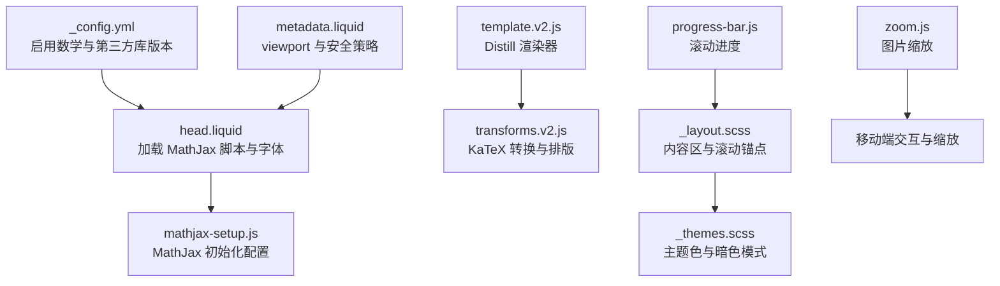
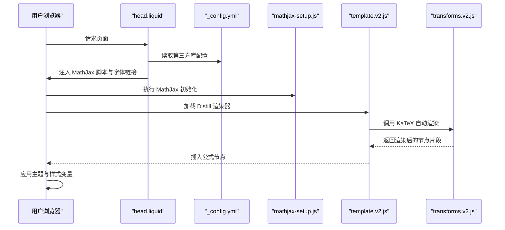
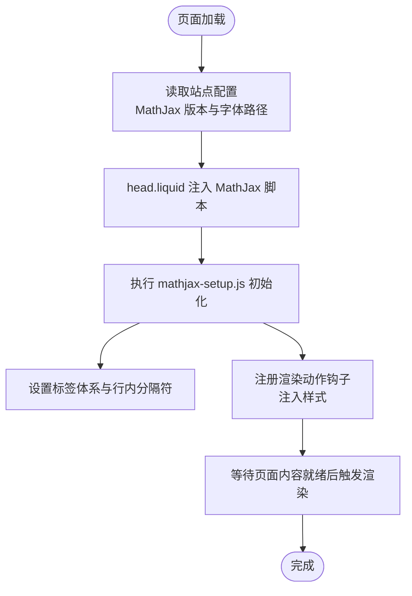
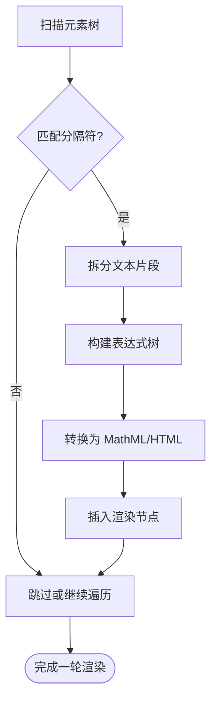
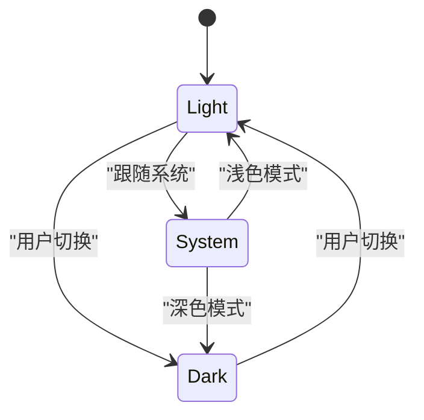
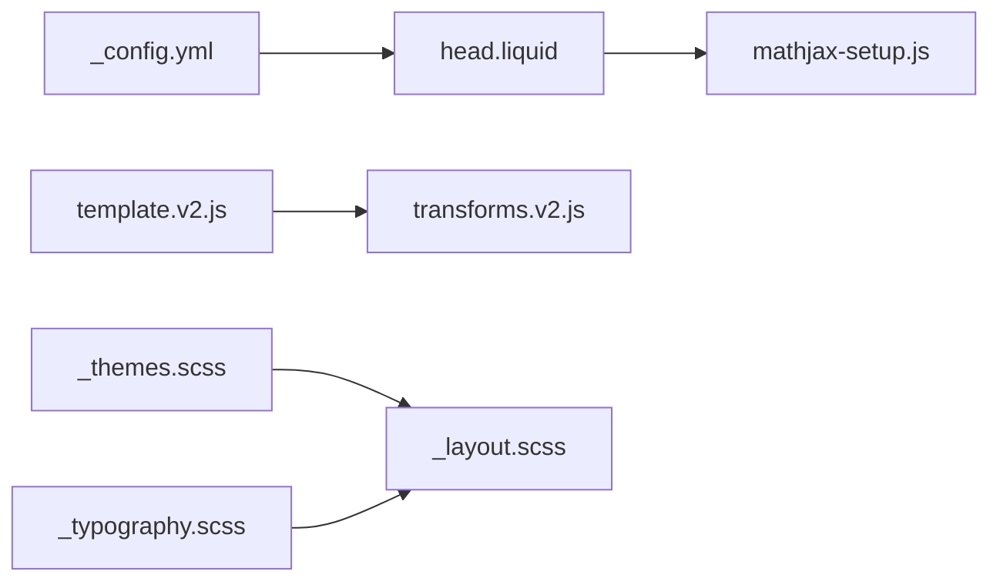

# 数学公式渲染

<cite>
**本文引用的文件**
- [mathjax-setup.js](file://assets/js/mathjax-setup.js)
- [_config.yml](file://_config.yml)
- [head.liquid](file://_includes/head.liquid)
- [metadata.liquid](file://_includes/metadata.liquid)
- [_layout.scss](file://_sass/_layout.scss)
- [_themes.scss](file://_sass/_themes.scss)
- [_typography.scss](file://_sass/_typography.scss)
- [zoom.js](file://assets/js/zoom.js)
- [progress-bar.js](file://assets/js/progress-bar.js)
- [template.v2.js](file://assets/js/distillpub/template.v2.js)
- [transforms.v2.js](file://assets/js/distillpub/transforms.v2.js)
</cite>

## 目录
1. [简介](#简介)
2. [项目结构](#项目结构)
3. [核心组件](#核心组件)
4. [架构总览](#架构总览)
5. [详细组件分析](#详细组件分析)
6. [依赖关系分析](#依赖关系分析)
7. [性能考量](#性能考量)
8. [故障排查指南](#故障排查指南)
9. [结论](#结论)
10. [附录](#附录)

## 简介
本文件面向“数学公式渲染”功能，系统梳理该站点在 Jekyll 主题下的数学公式支持与实现方式。当前站点同时集成了 MathJax（LaTeX 与 MathML）与 KaTeX（Distill 模板内嵌渲染链路）。本文将从配置与初始化、LaTeX/MathML 支持与转换、显示优化策略、样式定制、移动端与响应式适配、编辑与预览思路、以及常见问题与调试技巧等方面进行深入说明。

## 项目结构
围绕数学公式渲染的关键文件与位置如下：
- 配置与初始化：MathJax 全局配置、第三方库版本与加载路径
- 渲染链路：Distill 模板中的 KaTeX 自动渲染逻辑
- 样式与主题：全局排版、主题色变量、暗色模式切换
- 响应式与交互：viewport 设置、滚动进度条、图片缩放

图表来源
- [_config.yml:389-509](file://_config.yml#L389-L509)
- [head.liquid:1-209](file://_includes/head.liquid#L1-L209)
- [mathjax-setup.js:1-27](file://assets/js/mathjax-setup.js#L1-L27)
- [template.v2.js:613-682](file://assets/js/distillpub/template.v2.js#L613-L682)
- [transforms.v2.js:13517-13528](file://assets/js/distillpub/transforms.v2.js#L13517-L13528)
- [_layout.scss:1-59](file://_sass/_layout.scss#L1-L59)
- [_themes.scss:1-209](file://_sass/_themes.scss#L1-L209)
- [metadata.liquid:1-32](file://_includes/metadata.liquid#L1-L32)
- [progress-bar.js:31-73](file://assets/js/progress-bar.js#L31-L73)
- [zoom.js:1-6](file://assets/js/zoom.js#L1-L6)

章节来源
- [_config.yml:389-509](file://_config.yml#L389-L509)
- [head.liquid:1-209](file://_includes/head.liquid#L1-L209)
- [mathjax-setup.js:1-27](file://assets/js/mathjax-setup.js#L1-L27)
- [template.v2.js:613-682](file://assets/js/distillpub/template.v2.js#L613-L682)
- [transforms.v2.js:13517-13528](file://assets/js/distillpub/transforms.v2.js#L13517-L13528)
- [_layout.scss:1-59](file://_sass/_layout.scss#L1-L59)
- [_themes.scss:1-209](file://_sass/_themes.scss#L1-L209)
- [metadata.liquid:1-32](file://_includes/metadata.liquid#L1-L32)
- [progress-bar.js:31-73](file://assets/js/progress-bar.js#L31-L73)
- [zoom.js:1-6](file://assets/js/zoom.js#L1-L6)

## 核心组件
- MathJax 配置与初始化
  - 在全局对象中设置标签体系、行内分隔符与渲染动作钩子，注入样式以继承文本颜色。
- 第三方库与版本管理
  - 通过站点配置统一声明 MathJax 版本、CDN 地址与字体路径，确保稳定加载。
- Distill/KaTeX 渲染链路
  - 提供自动扫描与渲染函数，支持多种分隔符与忽略标签，具备错误回调能力。
- 样式与主题
  - 使用 CSS 变量统一主题色与文本色；暗色模式切换由脚本驱动。
- 响应式与交互
  - viewport 设置保证移动端体验；滚动进度条与图片缩放提升阅读流畅度。

章节来源
- [mathjax-setup.js:1-27](file://assets/js/mathjax-setup.js#L1-L27)
- [_config.yml:389-509](file://_config.yml#L389-L509)
- [template.v2.js:613-682](file://assets/js/distillpub/template.v2.js#L613-L682)
- [transforms.v2.js:13517-13528](file://assets/js/distillpub/transforms.v2.js#L13517-L13528)
- [_themes.scss:1-209](file://_sass/_themes.scss#L1-L209)
- [metadata.liquid:1-32](file://_includes/metadata.liquid#L1-L32)
- [progress-bar.js:31-73](file://assets/js/progress-bar.js#L31-L73)
- [zoom.js:1-6](file://assets/js/zoom.js#L1-L6)

## 架构总览
下图展示从页面加载到公式渲染的整体流程，涵盖 MathJax 初始化、Distill 渲染器与 KaTeX 转换、样式注入与主题切换。

图表来源
- [head.liquid:1-209](file://_includes/head.liquid#L1-L209)
- [_config.yml:389-509](file://_config.yml#L389-L509)
- [mathjax-setup.js:1-27](file://assets/js/mathjax-setup.js#L1-L27)
- [template.v2.js:613-682](file://assets/js/distillpub/template.v2.js#L613-L682)
- [transforms.v2.js:13517-13528](file://assets/js/distillpub/transforms.v2.js#L13517-L13528)

## 详细组件分析

### MathJax 配置与初始化
- 标签体系与行内公式
  - 启用 AMS 标签体系，支持行内分隔符组合，便于与正文混排。
- 渲染动作钩子
  - 在特定阶段注入样式，确保渲染容器继承文本颜色，避免与主题冲突。
- 字体与加载
  - 通过站点配置指定 MathJax 版本与字体 CDN 路径，head.liquid 中按需加载。

图表来源
- [_config.yml:389-509](file://_config.yml#L389-L509)
- [head.liquid:1-209](file://_includes/head.liquid#L1-L209)
- [mathjax-setup.js:1-27](file://assets/js/mathjax-setup.js#L1-L27)

章节来源
- [mathjax-setup.js:1-27](file://assets/js/mathjax-setup.js#L1-L27)
- [_config.yml:389-509](file://_config.yml#L389-L509)
- [head.liquid:1-209](file://_includes/head.liquid#L1-L209)

### LaTeX 与 MathML 支持与转换机制
- LaTeX 支持
  - 通过 MathJax 的 TeX 输入处理器解析 LaTeX 表达式，输出 HTML-CSS 或 SVG 输出。
- MathML 支持
  - MathJax 同时支持 MathML 输入与输出，可直接处理原生 MathML。
- Distill/KaTeX 自动渲染
  - 提供自动扫描与替换逻辑，识别多种分隔符，递归遍历元素树，忽略特定标签，错误时回退为原始文本。
- 符号映射与布局计算
  - 内部维护符号到 MathML 节点的映射与布局规则，结合 CSS/HTML 容器完成最终排版。

图表来源
- [template.v2.js:613-682](file://assets/js/distillpub/template.v2.js#L613-L682)
- [transforms.v2.js:13517-13528](file://assets/js/distillpub/transforms.v2.js#L13517-L13528)

章节来源
- [template.v2.js:613-682](file://assets/js/distillpub/template.v2.js#L613-L682)
- [transforms.v2.js:13517-13528](file://assets/js/distillpub/transforms.v2.js#L13517-L13528)

### 显示优化策略
- 延迟渲染
  - 通过渲染动作钩子与页面就绪事件配合，避免首屏阻塞。
- 缓存机制
  - 利用浏览器缓存与 CDN 字体资源，减少重复下载。
- 性能调优
  - 合理设置分隔符与忽略标签，降低不必要的扫描与解析开销。
  - 对长公式采用分块渲染或懒加载策略（建议在业务层扩展）。

章节来源
- [mathjax-setup.js:1-27](file://assets/js/mathjax-setup.js#L1-L27)
- [_config.yml:389-509](file://_config.yml#L389-L509)

### 公式样式自定义
- 颜色设置
  - 通过注入样式使公式容器继承文本颜色，保持与主题一致。
- 字体调整
  - 通过站点配置指定 MathJax 字体 CDN，确保跨平台一致性。
- 间距控制
  - 结合 CSS 变量与排版样式，统一段落与公式间的间距。

章节来源
- [mathjax-setup.js:1-27](file://assets/js/mathjax-setup.js#L1-L27)
- [_config.yml:389-509](file://_config.yml#L389-L509)
- [_themes.scss:1-209](file://_sass/_themes.scss#L1-L209)
- [_typography.scss:1-137](file://_sass/_typography.scss#L1-L137)

### 移动端适配与响应式设计
- 视口与缩放
  - 通过 viewport 设置保证移动端宽度与缩放比例；图片缩放使用 medium-zoom，支持触摸手势。
- 滚动优化
  - 滚动进度条随窗口尺寸变化动态重算，避免遮挡导航栏。
- 主题切换
  - 暗色模式通过 CSS 变量与脚本切换，适配不同设备偏好。

图表来源
- [_themes.scss:1-209](file://_sass/_themes.scss#L1-L209)
- [progress-bar.js:31-73](file://assets/js/progress-bar.js#L31-L73)
- [zoom.js:1-6](file://assets/js/zoom.js#L1-L6)
- [metadata.liquid:1-32](file://_includes/metadata.liquid#L1-L32)

章节来源
- [zoom.js:1-6](file://assets/js/zoom.js#L1-L6)
- [progress-bar.js:31-73](file://assets/js/progress-bar.js#L31-L73)
- [_themes.scss:1-209](file://_sass/_themes.scss#L1-L209)
- [metadata.liquid:1-32](file://_includes/metadata.liquid#L1-L32)

### 公式编辑与预览思路
- 编辑器集成
  - 建议在编辑层使用支持 LaTeX 的编辑器，并在保存时生成符合分隔符约定的标记。
- 预览策略
  - 本地预览可复用 MathJax 或 KaTeX 的渲染管线；Distill 模板的自动渲染函数可作为参考实现。
- 错误处理
  - 对解析失败的公式保留原始文本，避免破坏页面结构。

章节来源
- [template.v2.js:613-682](file://assets/js/distillpub/template.v2.js#L613-L682)
- [transforms.v2.js:13517-13528](file://assets/js/distillpub/transforms.v2.js#L13517-L13528)

## 依赖关系分析
- MathJax 与站点配置
  - _config.yml 统一声明版本与字体路径；head.liquid 动态注入脚本与字体链接。
- 渲染器与转换器
  - template.v2.js 负责将数据转为 DOM 片段并交由 KaTeX 处理；transforms.v2.js 实现符号到 MathML 的映射与布局。
- 样式与主题
  - _themes.scss 通过 CSS 变量统一主题色；_layout.scss 控制滚动锚点与容器宽度；_typography.scss 统一文本与链接颜色。

图表来源
- [_config.yml:389-509](file://_config.yml#L389-L509)
- [head.liquid:1-209](file://_includes/head.liquid#L1-L209)
- [mathjax-setup.js:1-27](file://assets/js/mathjax-setup.js#L1-L27)
- [template.v2.js:613-682](file://assets/js/distillpub/template.v2.js#L613-L682)
- [transforms.v2.js:13517-13528](file://assets/js/distillpub/transforms.v2.js#L13517-L13528)
- [_themes.scss:1-209](file://_sass/_themes.scss#L1-L209)
- [_layout.scss:1-59](file://_sass/_layout.scss#L1-L59)
- [_typography.scss:1-137](file://_sass/_typography.scss#L1-L137)

章节来源
- [_config.yml:389-509](file://_config.yml#L389-L509)
- [head.liquid:1-209](file://_includes/head.liquid#L1-L209)
- [template.v2.js:613-682](file://assets/js/distillpub/template.v2.js#L613-L682)
- [transforms.v2.js:13517-13528](file://assets/js/distillpub/transforms.v2.js#L13517-L13528)
- [_themes.scss:1-209](file://_sass/_themes.scss#L1-L209)
- [_layout.scss:1-59](file://_sass/_layout.scss#L1-L59)
- [_typography.scss:1-137](file://_sass/_typography.scss#L1-L137)

## 性能考量
- 资源加载
  - 使用 CDN 与缓存策略，减少字体与脚本的重复下载。
- 渲染时机
  - 将渲染动作置于页面就绪之后，避免阻塞首屏。
- 扫描范围
  - 合理配置忽略标签与分隔符，缩小扫描范围，提高效率。
- 长文公式
  - 对长文档中的复杂公式考虑懒渲染或分页渲染，减轻一次性渲染压力。

## 故障排查指南
- 公式不显示
  - 检查 MathJax 脚本是否成功加载与字体路径是否可达。
  - 确认分隔符与行内模式设置是否正确。
- 解析错误
  - 查看控制台错误回调，定位具体表达式；必要时回退为原始文本。
- 主题颜色异常
  - 确认样式注入是否生效，检查 CSS 变量覆盖情况。
- 移动端显示问题
  - 核对 viewport 设置与图片缩放初始化参数。

章节来源
- [mathjax-setup.js:1-27](file://assets/js/mathjax-setup.js#L1-L27)
- [template.v2.js:613-682](file://assets/js/distillpub/template.v2.js#L613-L682)
- [transforms.v2.js:13517-13528](file://assets/js/distillpub/transforms.v2.js#L13517-L13528)
- [_themes.scss:1-209](file://_sass/_themes.scss#L1-L209)
- [metadata.liquid:1-32](file://_includes/metadata.liquid#L1-L32)
- [zoom.js:1-6](file://assets/js/zoom.js#L1-L6)

## 结论
该站点通过 MathJax 与 Distill/KaTeX 的协同，实现了对 LaTeX 与 MathML 的良好支持。借助统一的第三方库配置、主题化样式与响应式交互，能够在桌面与移动端提供一致且高效的公式渲染体验。后续可在渲染时机、长文优化与编辑预览方面进一步增强。

## 附录
- 常见公式类型
  - 行内公式：使用行内分隔符包裹表达式。
  - 块级公式：使用块级分隔符包裹表达式。
- 调试技巧
  - 开启浏览器开发者工具查看网络请求与控制台日志。
  - 临时禁用部分忽略标签以验证扫描范围。
  - 在 head.liquid 中临时切换字体路径以排除网络问题。