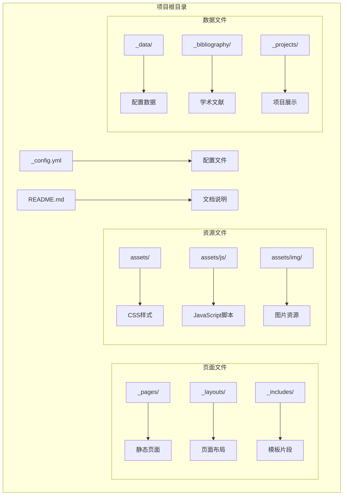
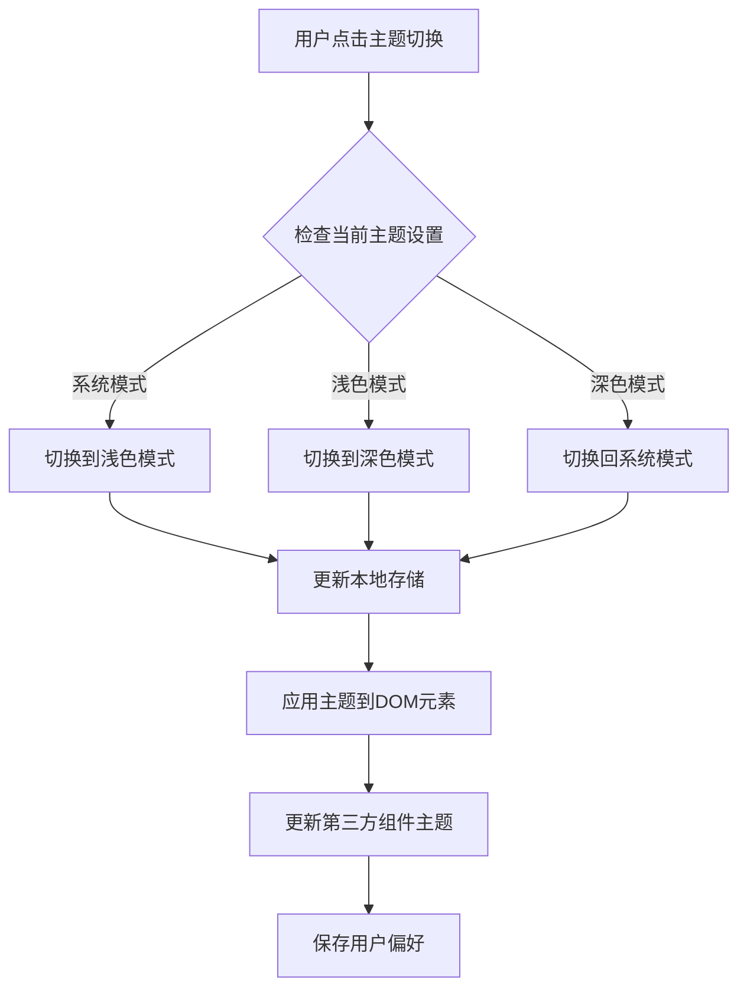
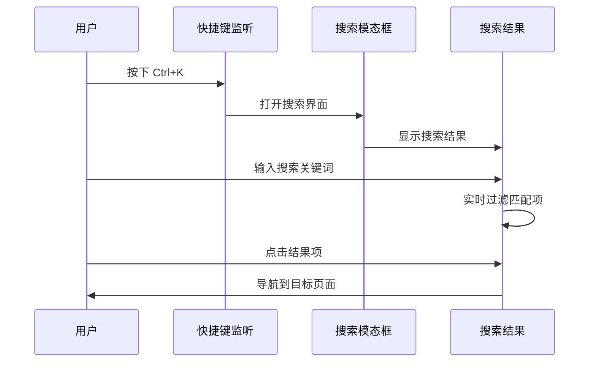
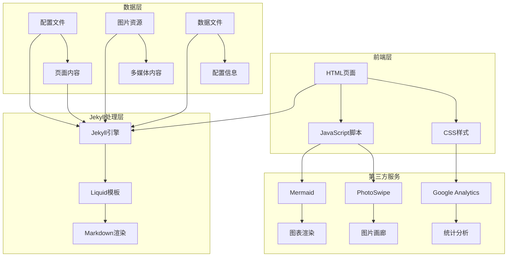
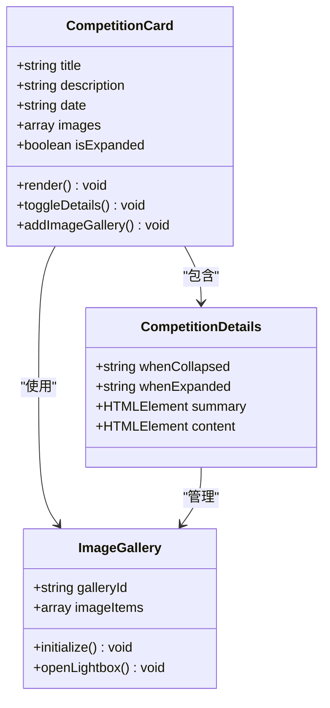
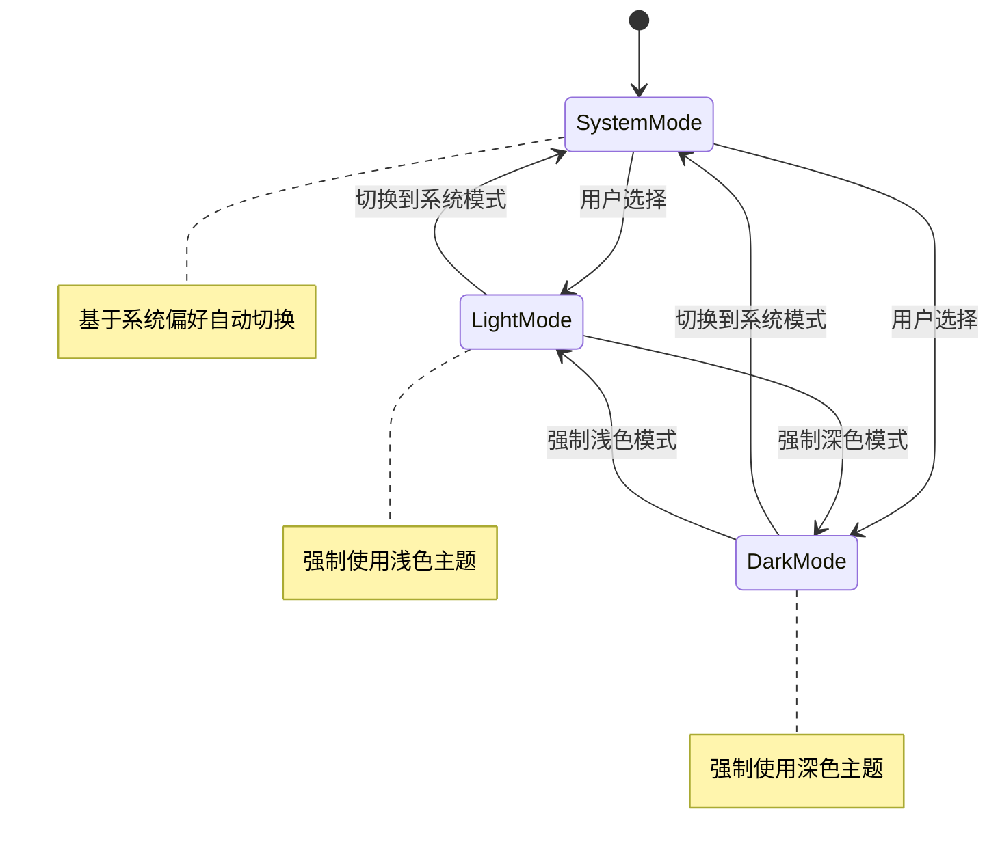
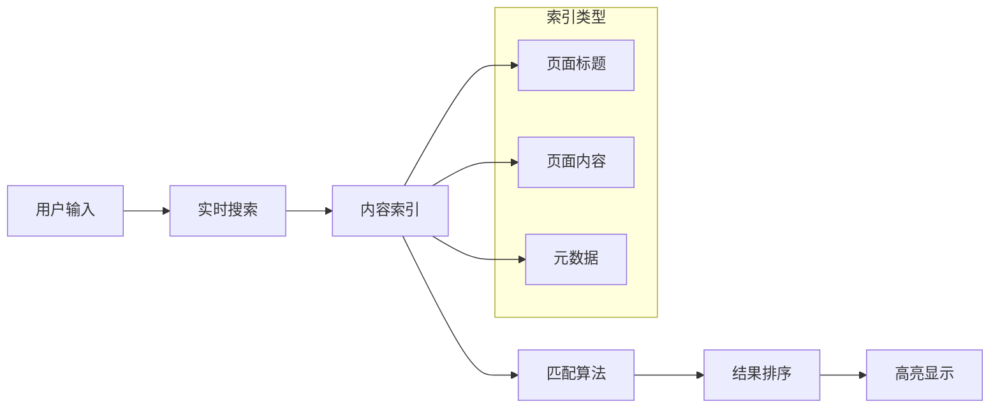
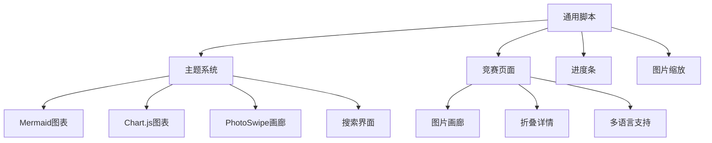

# 交互式竞赛展示系统

<cite>
**本文档中引用的文件**
- [_config.yml](_config.yml)
- [README.md](README.md)
- [competitions.md](_pages/competitions.md)
- [common.js](assets/js/common.js)
- [theme.js](assets/js/theme.js)
- [search-setup.js](assets/js/search-setup.js)
- [mermaid-setup.js](assets/js/mermaid-setup.js)
- [progress-bar.js](assets/js/progress-bar.js)
- [zoom.js](assets/js/zoom.js)
- [shortcut-key.js](assets/js/shortcut-key.js)
</cite>

## 目录
1. [项目概述](#项目概述)
2. [项目结构](#项目结构)
3. [核心组件](#核心组件)
4. [架构概览](#架构概览)
5. [详细组件分析](#详细组件分析)
6. [依赖关系分析](#依赖关系分析)
7. [性能考虑](#性能考虑)
8. [故障排除指南](#故障排除指南)
9. [结论](#结论)

## 项目概述

交互式竞赛展示系统是一个基于 Jekyll 的现代化学术个人网站，专门用于展示竞赛获奖经历和项目成果。该系统采用响应式设计，支持多种主题模式切换，提供丰富的多媒体展示功能。

### 主要特性

- **竞赛展示**：专门的竞赛页面，展示各类竞赛获奖经历
- **多语言支持**：同时支持中文和英文内容
- **响应式设计**：适配各种设备尺寸
- **主题切换**：支持浅色、深色和系统主题模式
- **多媒体集成**：图片画廊、视频、动画等多媒体内容
- **搜索功能**：内置全文搜索系统
- **进度指示器**：页面滚动进度显示

## 项目结构

该项目采用标准的 Jekyll 项目结构，主要包含以下目录：

**图表来源**
- [_config.yml](file://_config.yml)
- [README.md](file://README.md)

**章节来源**
- [_config.yml](file://_config.yml)
- [README.md](file://README.md)

## 核心组件

### 竞赛展示页面

竞赛展示页面是系统的核心组件，位于 `_pages/competitions.md` 文件中。该页面采用卡片式布局，每个竞赛条目都包含完整的展示信息。

#### 页面结构特点

- **卡片布局**：每个竞赛项目使用独立的卡片容器
- **双语内容**：同时提供中文和英文描述
- **折叠详情**：使用 `
` 元素实现可折叠的详细信息
- **图片画廊**：集成 PhotoSwipe 图片浏览功能
- **时间标签**：显示竞赛的具体时间

### 主题管理系统

系统实现了完整的主题管理功能，支持用户自定义主题偏好。

#### 主题切换机制

**图表来源**
- [theme.js](file://assets/js/theme.js)

### 搜索系统

系统集成了强大的搜索功能，支持全文搜索和快捷键操作。

#### 搜索工作流程

**图表来源**
- [search-setup.js](file://assets/js/search-setup.js)
- [shortcut-key.js](file://assets/js/shortcut-key.js)

**章节来源**
- [competitions.md](_pages/competitions.md)
- [theme.js](file://assets/js/theme.js)
- [search-setup.js](file://assets/js/search-setup.js)

## 架构概览

系统采用分层架构设计，各组件职责明确，耦合度低。

**图表来源**
- [_config.yml](_config.yml)
- [competitions.md](_pages/competitions.md)

## 详细组件分析

### 竞赛卡片组件

每个竞赛项目都封装在一个独立的卡片组件中，具有完整的展示逻辑。

#### 组件结构

**图表来源**
- [competitions.md](_pages/competitions.md)

#### 展示功能

每个竞赛卡片包含以下功能：

1. **基本信息展示**：竞赛名称、获奖等级、时间信息
2. **折叠详情**：通过 `
` 元素实现的可折叠内容区域
3. **图片画廊**：支持多张图片的缩略图预览和全屏浏览
4. **多媒体内容**：支持 GIF 动画、CAD 图纸、3D 模型等

### 主题切换组件

主题管理系统提供了灵活的主题切换机制。

#### 主题状态管理

**图表来源**
- [theme.js](file://assets/js/theme.js)

#### 第三方组件适配

系统能够自动适配多个第三方组件的主题：

- **Mermaid 图表**：支持动态主题切换
- **Chart.js 图表**：深色主题优化
- **Diff2Html 代码对比**：主题一致性
- **ECharts 图表**：深色主题支持
- **Plotly 图表**：完整的主题适配
- **Vega Lite 图表**：主题切换支持

**章节来源**
- [competitions.md](_pages/competitions.md)
- [theme.js](file://assets/js/theme.js)

### 搜索组件

搜索系统提供了高效的全文搜索功能。

#### 搜索架构

**图表来源**
- [search-setup.js](file://assets/js/search-setup.js)

#### 快捷键支持

系统支持跨平台的快捷键操作：

- **Windows/Linux**：Ctrl + K
- **macOS**：⌘ + K（使用 Unicode 符号显示）

**章节来源**
- [search-setup.js](file://assets/js/search-setup.js)
- [shortcut-key.js](file://assets/js/shortcut-key.js)

## 依赖关系分析

系统依赖关系清晰，主要依赖包括：

### 外部库依赖

| 库名称 | 版本 | 用途 | 依赖来源 |
|--------|------|------|----------|
| Bootstrap | 5.x | 响应式框架 | CDN |
| jQuery | 3.6.0 | DOM操作 | CDN |
| Mermaid | 10.7.0 | 流程图渲染 | CDN |
| Chart.js | 4.4.1 | 图表绘制 | CDN |
| PhotoSwipe | 5.4.4 | 图片画廊 | CDN |
| Medium Zoom | 1.1.0 | 图片缩放 | CDN |
| Highlight.js | 11.9.0 | 代码高亮 | CDN |

### 内部组件依赖

**图表来源**
- [theme.js](file://assets/js/theme.js)
- [common.js](file://assets/js/common.js)

**章节来源**
- [theme.js](file://assets/js/theme.js)
- [common.js](file://assets/js/common.js)

## 性能考虑

系统在设计时充分考虑了性能优化：

### 加载优化策略

1. **懒加载图片**：使用 `loading="lazy"` 属性延迟加载图片
2. **CDN加速**：所有外部库通过 CDN 提供，提升加载速度
3. **按需加载**：非关键功能延迟初始化
4. **缓存策略**：合理设置浏览器缓存头

### 渲染性能

1. **虚拟滚动**：大量图片时使用虚拟滚动减少DOM节点
2. **防抖处理**：搜索输入使用防抖避免频繁计算
3. **CSS过渡优化**：使用硬件加速的CSS属性
4. **内存管理**：及时清理事件监听器和定时器

## 故障排除指南

### 常见问题及解决方案

#### 主题切换问题

**问题**：主题切换不生效或切换后恢复默认

**解决方案**：
1. 检查浏览器是否禁用本地存储
2. 清除浏览器缓存重新加载
3. 确认 `localStorage` 中的 `theme` 键值正确

#### 图片加载问题

**问题**：图片无法显示或加载缓慢

**解决方案**：
1. 检查图片路径是否正确
2. 确认图片格式支持情况
3. 验证图片文件大小限制
4. 检查网络连接状态

#### 搜索功能异常

**问题**：搜索无结果或搜索框无法打开

**解决方案**：
1. 确认 JavaScript 已正确加载
2. 检查浏览器控制台错误信息
3. 验证搜索索引是否正常构建
4. 确认快捷键组合是否正确

#### 竞赛页面显示问题

**问题**：竞赛卡片布局错乱或内容不显示

**解决方案**：
1. 检查 YAML 头信息格式
2. 验证 Liquid 模板语法
3. 确认图片资源路径正确
4. 检查 CSS 样式冲突

**章节来源**
- [theme.js](file://assets/js/theme.js)
- [common.js](file://assets/js/common.js)

## 结论

交互式竞赛展示系统是一个功能完整、设计精良的现代化个人网站解决方案。系统采用模块化设计，各组件职责明确，具有良好的可维护性和扩展性。

### 系统优势

1. **用户体验优秀**：响应式设计适配各种设备
2. **功能丰富**：涵盖竞赛展示、搜索、主题切换等核心功能
3. **性能优化**：采用多种优化策略确保快速加载
4. **易于定制**：基于 Jekyll 和 Liquid 模板，便于个性化定制
5. **多语言支持**：同时支持中文和英文内容展示

### 发展建议

1. **移动端优化**：进一步优化移动端触摸交互体验
2. **SEO增强**：增加结构化数据支持，提升搜索引擎可见性
3. **国际化扩展**：支持更多语言版本
4. **数据分析**：集成更详细的访问统计功能
5. **内容管理**：提供更便捷的内容编辑和管理工具

该系统为学术个人网站提供了一个优秀的参考实现，具有很强的实用价值和推广意义。