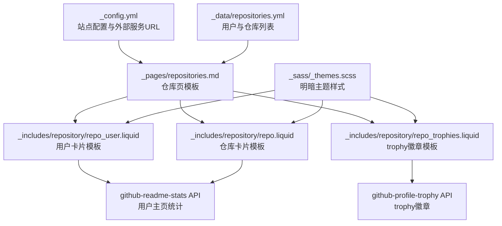
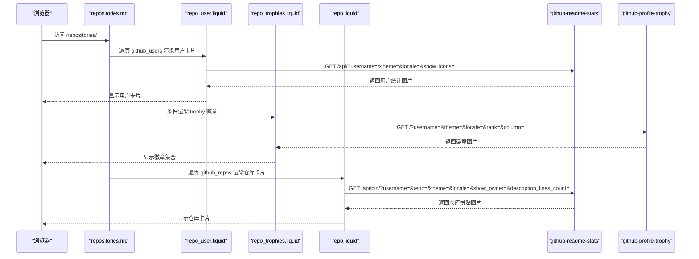
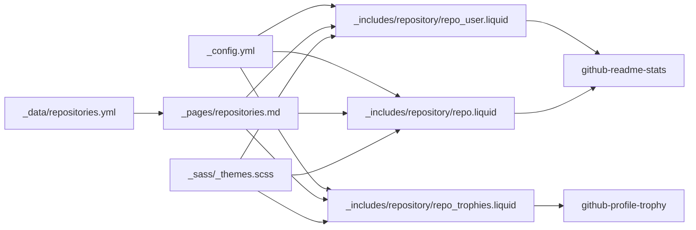

# 仓库集成系统

<cite>
**本文引用的文件**
- [_config.yml](file://_config.yml)
- [_pages/repositories.md](file://_pages/repositories.md)
- [_data/repositories.yml](file://_data/repositories.yml)
- [_includes/repository/repo.liquid](file://_includes/repository/repo.liquid)
- [_includes/repository/repo_user.liquid](file://_includes/repository/repo_user.liquid)
- [_includes/repository/repo_trophies.liquid](file://_includes/repository/repo_trophies.liquid)
- [_sass/_themes.scss](file://_sass/_themes.scss)
- [TROUBLESHOOTING.md](file://TROUBLESHOOTING.md)
- [Gemfile](file://Gemfile)
</cite>

## 目录
1. [简介](#简介)
2. [项目结构](#项目结构)
3. [核心组件](#核心组件)
4. [架构总览](#架构总览)
5. [详细组件分析](#详细组件分析)
6. [依赖关系分析](#依赖关系分析)
7. [性能考量](#性能考量)
8. [故障排除指南](#故障排除指南)
9. [结论](#结论)
10. [附录](#附录)

## 简介
本仓库集成系统通过 Jekyll 模板与外部服务（github-readme-stats、github-profile-trophy）实现 GitHub 用户与仓库信息的自动获取与展示。系统以 Liquid 模板为核心，结合站点配置与数据文件，动态渲染 GitHub 统计卡片、个人主页徽章与仓库徽章（trophy）。页面通过读取数据文件中的用户列表与仓库列表，调用外部服务提供的 API，生成带主题与本地化支持的图片卡片，并在明暗主题下分别加载对应主题的图像资源。

## 项目结构
该系统围绕以下关键目录与文件组织：
- 配置层：站点主题与外部服务地址由配置文件统一管理
- 数据层：用户与仓库列表由数据文件提供
- 视图层：仓库页模板负责聚合展示；各组件模板负责具体卡片渲染
- 主题层：明暗主题切换与显示逻辑由样式文件控制

图表来源
- [_config.yml:30-44](file://_config.yml#L30-L44)
- [_pages/repositories.md:10-47](file://_pages/repositories.md#L10-L47)
- [_includes/repository/repo_user.liquid:21-34](file://_includes/repository/repo_user.liquid#L21-L34)
- [_includes/repository/repo_trophies.liquid:1-43](file://_includes/repository/repo_trophies.liquid#L1-L43)
- [_includes/repository/repo.liquid:34-47](file://_includes/repository/repo.liquid#L34-L47)
- [_sass/_themes.scss:58-122](file://_sass/_themes.scss#L58-L122)

章节来源
- [_config.yml:30-44](file://_config.yml#L30-L44)
- [_pages/repositories.md:1-48](file://_pages/repositories.md#L1-L48)
- [_data/repositories.yml:1-7](file://_data/repositories.yml#L1-L7)
- [_includes/repository/repo_user.liquid:1-35](file://_includes/repository/repo_user.liquid#L1-L35)
- [_includes/repository/repo_trophies.liquid:1-43](file://_includes/repository/repo_trophies.liquid#L1-L43)
- [_includes/repository/repo.liquid:1-48](file://_includes/repository/repo.liquid#L1-L48)
- [_sass/_themes.scss:1-200](file://_sass/_themes.scss#L1-L200)

## 核心组件
- 仓库页模板：负责读取用户与仓库列表，按需渲染用户卡片、trophy徽章与仓库卡片
- 用户卡片模板：渲染用户主页统计卡片，支持明暗主题与语言本地化
- trophy徽章模板：渲染用户成就徽章集合，适配不同屏幕尺寸
- 仓库卡片模板：渲染单个仓库的“拼贴”卡片，支持是否显示所有者、描述行数等参数
- 配置与数据：站点主题与外部服务地址、用户与仓库列表
- 主题样式：控制明暗主题下的图片显示与切换

章节来源
- [_pages/repositories.md:10-47](file://_pages/repositories.md#L10-L47)
- [_includes/repository/repo_user.liquid:21-34](file://_includes/repository/repo_user.liquid#L21-L34)
- [_includes/repository/repo_trophies.liquid:1-43](file://_includes/repository/repo_trophies.liquid#L1-L43)
- [_includes/repository/repo.liquid:34-47](file://_includes/repository/repo.liquid#L34-L47)
- [_config.yml:30-44](file://_config.yml#L30-L44)
- [_data/repositories.yml:1-7](file://_data/repositories.yml#L1-L7)
- [_sass/_themes.scss:58-122](file://_sass/_themes.scss#L58-L122)

## 架构总览
系统采用“模板驱动 + 外部服务”的轻量级架构：
- 页面模板从数据文件读取用户与仓库列表
- 模板根据站点配置选择外部服务地址与主题
- 模板将语言、主题、参数拼装为外部 API 请求
- 外部服务返回图片资源，模板在明暗主题下分别加载

图表来源
- [_pages/repositories.md:10-47](file://_pages/repositories.md#L10-L47)
- [_includes/repository/repo_user.liquid:21-34](file://_includes/repository/repo_user.liquid#L21-L34)
- [_includes/repository/repo_trophies.liquid:1-43](file://_includes/repository/repo_trophies.liquid#L1-L43)
- [_includes/repository/repo.liquid:34-47](file://_includes/repository/repo.liquid#L34-L47)

## 详细组件分析

### 仓库页模板（repositories.md）
- 功能：条件渲染用户卡片、trophy徽章与仓库卡片
- 关键点：
  - 仅当存在用户或仓库列表时才渲染对应区块
  - trophy徽章受全局开关控制
  - 用户名数量大于1时，会在每个徽章区块前显示用户名标题

章节来源
- [_pages/repositories.md:10-47](file://_pages/repositories.md#L10-L47)

### 用户卡片模板（repo_user.liquid）
- 功能：渲染用户主页统计卡片
- 参数来源：
  - 用户名来自 include.username
  - 主题来自站点配置（明暗主题）
  - 语言本地化处理（支持多语言）
- 输出：同一用户在明暗主题下分别加载一张图片

章节来源
- [_includes/repository/repo_user.liquid:1-35](file://_includes/repository/repo_user.liquid#L1-L35)
- [_config.yml:30-36](file://_config.yml#L30-L36)

### Trophy徽章模板（repo_trophies.liquid）
- 功能：渲染用户成就徽章集合
- 响应式设计：针对不同断点提供不同的列数与边距
- 参数来源：
  - 用户名来自 include.username
  - 主题来自站点配置（明暗主题）
  - 语言本地化
- 输出：同一用户在明暗主题下分别加载一组图片

章节来源
- [_includes/repository/repo_trophies.liquid:1-43](file://_includes/repository/repo_trophies.liquid#L1-L43)
- [_config.yml:33-36](file://_config.yml#L33-L36)

### 仓库卡片模板（repo.liquid）
- 功能：渲染单个仓库的“拼贴”卡片
- 关键逻辑：
  - 解析仓库标识为“用户名/仓库名”
  - 若仓库属于已配置的用户，则隐藏所有者显示
  - 语言本地化处理（支持多语言）
  - 描述行数可由数据文件配置，默认为2
- 输出：同一仓库在明暗主题下分别加载一张图片

章节来源
- [_includes/repository/repo.liquid:1-48](file://_includes/repository/repo.liquid#L1-L48)
- [_data/repositories.yml:4-4](file://_data/repositories.yml#L4-L4)
- [_config.yml:30-36](file://_config.yml#L30-L36)

### 配置与数据文件

#### 站点配置（_config.yml）
- 主题与外部服务：
  - 仓库主题：明/暗主题名称
  - 外部服务地址：github-readme-stats 与 github-profile-trophy 的 URL
- trophy开关与主题：控制是否启用trophy以及明暗主题

章节来源
- [_config.yml:30-44](file://_config.yml#L30-L44)

#### 数据文件（_data/repositories.yml）
- 字段定义：
  - github_users：要展示的 GitHub 用户名列表
  - repo_description_lines_max：仓库卡片描述最大行数
  - github_repos：要展示的仓库标识列表（格式：用户名/仓库名）

章节来源
- [_data/repositories.yml:1-7](file://_data/repositories.yml#L1-L7)

### 主题与样式（_sass/_themes.scss）
- 明暗主题切换：
  - 通过 CSS 变量与属性选择器控制明/暗主题
  - 控制 only-light 与 only-dark 类的显示状态
- 图片显示：
  - 在明主题下显示 only-light，在暗主题下显示 only-dark

章节来源
- [_sass/_themes.scss:58-122](file://_sass/_themes.scss#L58-L122)

## 依赖关系分析
- 模板对配置的依赖：主题、外部服务地址、trophy开关
- 模板对数据的依赖：用户列表、仓库列表、描述行数
- 外部服务依赖：github-readme-stats 与 github-profile-trophy
- 主题样式依赖：明暗主题切换逻辑

图表来源
- [_config.yml:30-44](file://_config.yml#L30-L44)
- [_data/repositories.yml:1-7](file://_data/repositories.yml#L1-L7)
- [_pages/repositories.md:10-47](file://_pages/repositories.md#L10-L47)
- [_includes/repository/repo_user.liquid:21-34](file://_includes/repository/repo_user.liquid#L21-L34)
- [_includes/repository/repo_trophies.liquid:1-43](file://_includes/repository/repo_trophies.liquid#L1-L43)
- [_includes/repository/repo.liquid:34-47](file://_includes/repository/repo.liquid#L34-L47)
- [_sass/_themes.scss:58-122](file://_sass/_themes.scss#L58-L122)

章节来源
- [_config.yml:30-44](file://_config.yml#L30-L44)
- [_data/repositories.yml:1-7](file://_data/repositories.yml#L1-L7)
- [_pages/repositories.md:10-47](file://_pages/repositories.md#L10-L47)
- [_includes/repository/repo_user.liquid:21-34](file://_includes/repository/repo_user.liquid#L21-L34)
- [_includes/repository/repo_trophies.liquid:1-43](file://_includes/repository/repo_trophies.liquid#L1-L43)
- [_includes/repository/repo.liquid:34-47](file://_includes/repository/repo.liquid#L34-L47)
- [_sass/_themes.scss:58-122](file://_sass/_themes.scss#L58-L122)

## 性能考量
- 外部服务请求：所有卡片均为图片请求，建议确保网络稳定与 CDN 加速
- 主题切换：明暗主题切换通过 CSS 类控制，无额外脚本开销
- 列表渲染：用户与仓库列表较大时，建议分页或懒加载策略（当前模板未内置）
- 缓存与更新：Jekyll 构建时生成静态内容，不包含运行时缓存逻辑；可通过外部服务的缓存策略减少重复请求

## 故障排除指南
- 外部服务不可达或返回错误
  - 检查站点配置中的外部服务地址是否正确
  - 确认网络连通性与代理设置
- 语言显示异常
  - 模板会根据站点语言进行本地化处理，若出现显示问题，请检查可用的本地化代码
- trophy徽章不显示
  - 确认站点配置中已开启 trophy 开关
  - 检查用户名是否正确
- 仓库卡片不显示或空白
  - 检查仓库标识格式是否为“用户名/仓库名”
  - 确认仓库公开且存在
- 明暗主题切换无效
  - 检查主题样式文件中的类与属性设置
  - 确认浏览器未禁用 CSS 或缓存未刷新

章节来源
- [TROUBLESHOOTING.md:1-455](file://TROUBLESHOOTING.md#L1-L455)
- [_config.yml:39-44](file://_config.yml#L39-L44)
- [_includes/repository/repo_user.liquid:1-19](file://_includes/repository/repo_user.liquid#L1-L19)
- [_includes/repository/repo_trophies.liquid:1-43](file://_includes/repository/repo_trophies.liquid#L1-L43)
- [_includes/repository/repo.liquid:1-26](file://_includes/repository/repo.liquid#L1-L26)
- [_sass/_themes.scss:58-122](file://_sass/_themes.scss#L58-L122)

## 结论
该仓库集成系统通过简洁的 Liquid 模板与外部服务 API，实现了 GitHub 用户与仓库信息的自动化展示。其优势在于配置灵活、主题友好、易于扩展。实际部署中，建议关注外部服务稳定性、语言本地化与明暗主题一致性，并结合站点实际规模考虑性能优化策略。

## 附录

### 配置选项速查
- 站点主题与外部服务
  - 仓库主题（明/暗）：见站点配置
  - 外部服务地址：github-readme-stats 与 github-profile-trophy
- trophy开关与主题
  - 启用开关与明暗主题：见站点配置
- 数据文件字段
  - github_users：用户列表
  - repo_description_lines_max：仓库描述最大行数
  - github_repos：仓库标识列表（格式：用户名/仓库名）

章节来源
- [_config.yml:30-44](file://_config.yml#L30-L44)
- [_data/repositories.yml:1-7](file://_data/repositories.yml#L1-L7)