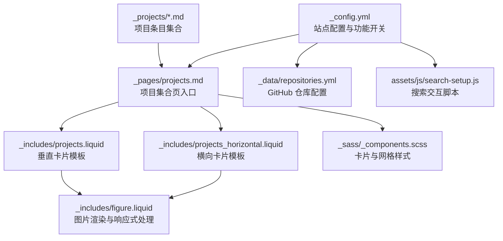
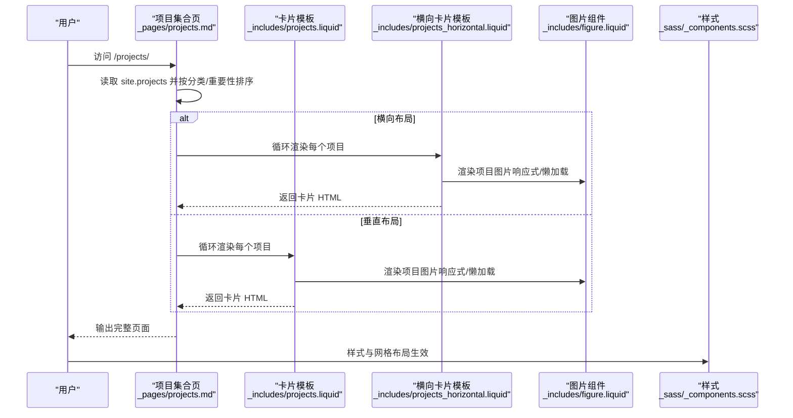
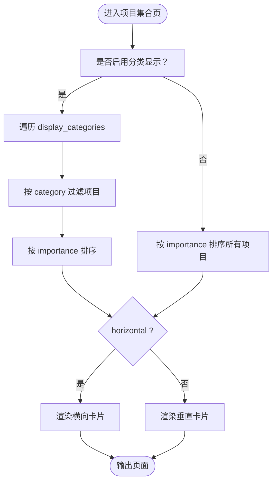
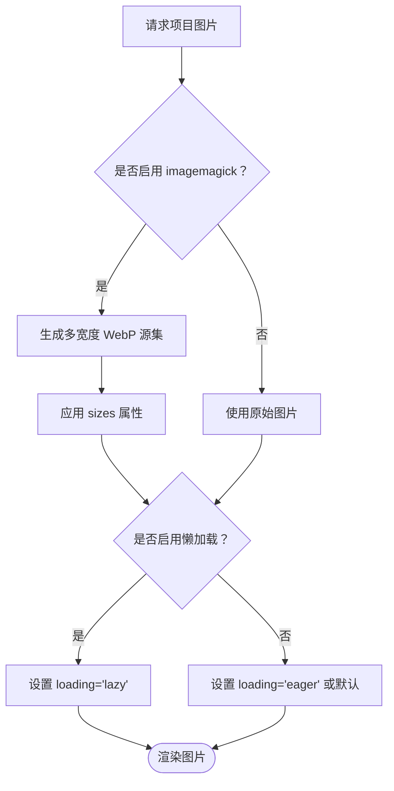
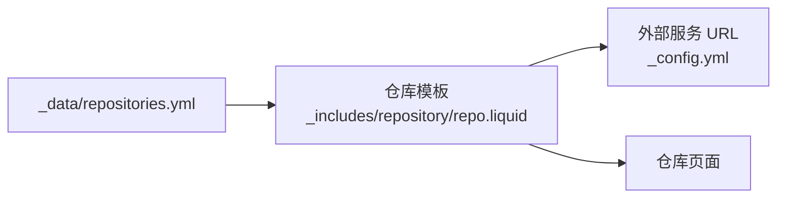
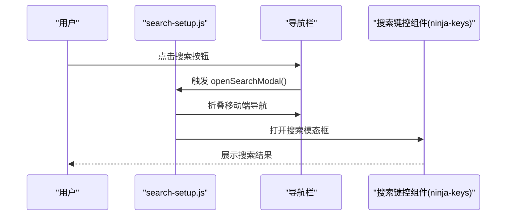
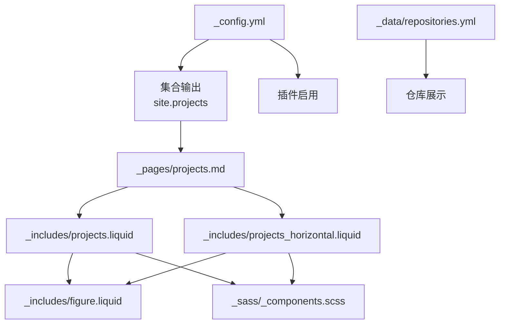

# 作品集项目展示

<cite>
**本文引用的文件**
- [_config.yml](file://_config.yml)
- [_pages/projects.md](file://_pages/projects.md)
- [_pages/zh/projects.md](file://_pages/zh/projects.md)
- [_projects/1_project.md](file://_projects/1_project.md)
- [_projects/2_project.md](file://_projects/2_project.md)
- [_projects/3_project.md](file://_projects/3_project.md)
- [_includes/projects.liquid](file://_includes/projects.liquid)
- [_includes/projects_horizontal.liquid](file://_includes/projects_horizontal.liquid)
- [_includes/figure.liquid](file://_includes/figure.liquid)
- [_layouts/page.liquid](file://_layouts/page.liquid)
- [_sass/_components.scss](file://_sass/_components.scss)
- [assets/js/search-setup.js](file://assets/js/search-setup.js)
- [_data/repositories.yml](file://_data/repositories.yml)
- [INSTALL.md](file://INSTALL.md)
- [TROUBLESHOOTING.md](file://TROUBLESHOOTING.md)
</cite>

## 目录
1. [简介](#简介)
2. [项目结构](#项目结构)
3. [核心组件](#核心组件)
4. [架构总览](#架构总览)
5. [详细组件分析](#详细组件分析)
6. [依赖关系分析](#依赖关系分析)
7. [性能考虑](#性能考虑)
8. [故障排查指南](#故障排查指南)
9. [结论](#结论)
10. [附录](#附录)

## 简介
本文件面向“作品集与项目展示系统”的使用者与维护者，系统基于 Jekyll 模板（al-folio）构建，提供项目集合页的组织、展示与交互能力。内容涵盖：
- 项目数据模型与字段设计（标题、描述、图片、重要性、分类、跳转链接等）
- 项目页面布局与展示逻辑（网格布局、卡片样式、响应式设计）
- 分类与标签系统的配置方法（分类显示、排序规则）
- 图片处理与优化策略（WebP 响应式图片、懒加载、缩略图生成）
- GitHub 集成（仓库列表、统计与徽章）
- 搜索、筛选、排序功能的使用与配置
- 实际配置示例与最佳实践建议

## 项目结构
该站点采用 Jekyll 的标准目录结构，项目集合通过集合（Collection）机制管理，页面通过 Liquid 模板渲染，样式由 SCSS 编译输出。

**图表来源**
- [_config.yml](file://_config.yml)
- [_pages/projects.md](file://_pages/projects.md)
- [_includes/projects.liquid](file://_includes/projects.liquid)
- [_includes/projects_horizontal.liquid](file://_includes/projects_horizontal.liquid)
- [_includes/figure.liquid](file://_includes/figure.liquid)
- [_sass/_components.scss](file://_sass/_components.scss)
- [_data/repositories.yml](file://_data/repositories.yml)
- [assets/js/search-setup.js](file://assets/js/search-setup.js)
- [_projects/1_project.md](file://_projects/1_project.md)

**章节来源**
- [_config.yml](file://_config.yml)
- [_pages/projects.md](file://_pages/projects.md)
- [_includes/projects.liquid](file://_includes/projects.liquid)
- [_includes/projects_horizontal.liquid](file://_includes/projects_horizontal.liquid)
- [_includes/figure.liquid](file://_includes/figure.liquid)
- [_sass/_components.scss](file://_sass/_components.scss)
- [_data/repositories.yml](file://_data/repositories.yml)
- [assets/js/search-setup.js](file://assets/js/search-setup.js)
- [_projects/1_project.md](file://_projects/1_project.md)

## 核心组件
- 项目集合页：负责读取集合、按分类与重要性排序、渲染卡片。
- 项目卡片模板：支持垂直与横向两种布局，统一图片、标题、描述与 GitHub 链接展示。
- 图片渲染组件：封装响应式图片与懒加载，支持 WebP 输出与多宽度源集。
- 样式组件：定义卡片、网格、分类标题等样式，确保在不同屏幕尺寸下一致体验。
- 站点配置：控制功能开关（如分类、懒加载、图片处理）、导航与搜索等。

**章节来源**
- [_pages/projects.md](file://_pages/projects.md)
- [_includes/projects.liquid](file://_includes/projects.liquid)
- [_includes/projects_horizontal.liquid](file://_includes/projects_horizontal.liquid)
- [_includes/figure.liquid](file://_includes/figure.liquid)
- [_sass/_components.scss](file://_sass/_components.scss)
- [_config.yml](file://_config.yml)

## 架构总览
项目集合页通过 Liquid 模板从 Jekyll 集合中读取项目条目，按配置进行分类与排序，再调用卡片模板渲染。图片渲染组件负责响应式与性能优化。搜索脚本提供快捷打开搜索框的能力。

**图表来源**
- [_pages/projects.md](file://_pages/projects.md)
- [_includes/projects.liquid](file://_includes/projects.liquid)
- [_includes/projects_horizontal.liquid](file://_includes/projects_horizontal.liquid)
- [_includes/figure.liquid](file://_includes/figure.liquid)
- [_sass/_components.scss](file://_sass/_components.scss)

## 详细组件分析

### 数据模型与字段设计
- 必填字段
  - title：项目标题
  - description：项目描述
- 常用字段
  - img：项目图片路径（用于卡片封面）
  - importance：重要性数值，用于排序（数值越小优先级越高）
  - category：分类标签，用于分组展示
  - redirect：外部跳转链接（可选）
  - github：GitHub 仓库地址（可选）
  - github_stars：GitHub 星标计数占位（可选）
- 示例参考
  - [1_project.md](file://_projects/1_project.md)
  - [2_project.md](file://_projects/2_project.md)
  - [3_project.md](file://_projects/3_project.md)

字段与排序逻辑
- 排序依据：按 importance 升序排列
- 分类依据：按 category 字段分组
- 展示顺序：先按分类，再按重要性排序

**章节来源**
- [_projects/1_project.md](file://_projects/1_project.md)
- [_projects/2_project.md](file://_projects/2_project.md)
- [_projects/3_project.md](file://_projects/3_project.md)
- [_pages/projects.md](file://_pages/projects.md)

### 页面布局与展示逻辑
- 布局选择
  - 垂直布局：每行 3 列卡片（中屏及以上）
  - 横向布局：左右分栏，适合图文并茂的展示
- 卡片内容
  - 标题、描述、图片、GitHub 链接与星标（可选）
  - 支持外部跳转（redirect）
- 响应式设计
  - 使用 Bootstrap 栅格系统（row-cols-*）
  - 图片组件自动适配不同视口宽度
- 样式要点
  - 卡片悬停效果、标题颜色变化
  - 分类标题分隔线与对齐
  - 图片宽度自适应容器

**图表来源**
- [_pages/projects.md](file://_pages/projects.md)
- [_includes/projects.liquid](file://_includes/projects.liquid)
- [_includes/projects_horizontal.liquid](file://_includes/projects_horizontal.liquid)

**章节来源**
- [_pages/projects.md](file://_pages/projects.md)
- [_includes/projects.liquid](file://_includes/projects.liquid)
- [_includes/projects_horizontal.liquid](file://_includes/projects_horizontal.liquid)
- [_sass/_components.scss](file://_sass/_components.scss)

### 图片处理与优化策略
- WebP 响应式图片
  - 通过 jekyll-imagemagick 插件生成多宽度 WebP 资源
  - 图片组件根据 sizes 与 srcset 自动选择合适尺寸
- 懒加载
  - 默认启用懒加载；可在图片组件中覆盖 loading 属性
- 错误回退
  - 图片加载失败时移除响应式源集，回退到原图
- 尺寸与比例
  - 卡片图片宽度自适应，保持良好视觉比例

**图表来源**
- [_includes/figure.liquid](file://_includes/figure.liquid)
- [_config.yml](file://_config.yml)

**章节来源**
- [_includes/figure.liquid](file://_includes/figure.liquid)
- [_config.yml](file://_config.yml)

### GitHub 集成与配置
- 仓库列表
  - 通过 _data/repositories.yml 配置要展示的仓库或用户
  - 支持按语言环境切换显示文案
- 外部服务
  - 可配置 GitHub README 统计与奖杯服务的域名
- 仓库页模板
  - 使用仓库模板渲染仓库卡片与徽章

**图表来源**
- [_data/repositories.yml](file://_data/repositories.yml)
- [_config.yml](file://_config.yml)

**章节来源**
- [_data/repositories.yml](file://_data/repositories.yml)
- [_config.yml](file://_config.yml)

### 搜索、筛选与排序
- 搜索功能
  - 在配置中启用搜索并设置站点 URL
  - 通过搜索脚本打开搜索模态框
- 筛选与排序
  - 项目集合页按 importance 排序
  - 可通过 display_categories 控制展示的分类
- 国际化
  - 中文项目页示例位于 _pages/zh/projects.md

**图表来源**
- [assets/js/search-setup.js](file://assets/js/search-setup.js)
- [_pages/projects.md](file://_pages/projects.md)

**章节来源**
- [assets/js/search-setup.js](file://assets/js/search-setup.js)
- [_pages/projects.md](file://_pages/projects.md)
- [_pages/zh/projects.md](file://_pages/zh/projects.md)
- [_config.yml](file://_config.yml)

## 依赖关系分析
- 配置依赖
  - _config.yml 控制功能开关（如分类、懒加载、图片处理、搜索）
  - 集合输出与插件启用影响项目集合页生成
- 模板依赖
  - 项目集合页依赖卡片模板与图片组件
  - 卡片模板依赖图片组件与样式组件
- 数据依赖
  - 项目条目来源于 _projects 目录的集合文件
  - 仓库信息来源于 _data/repositories.yml

**图表来源**
- [_config.yml](file://_config.yml)
- [_pages/projects.md](file://_pages/projects.md)
- [_includes/projects.liquid](file://_includes/projects.liquid)
- [_includes/projects_horizontal.liquid](file://_includes/projects_horizontal.liquid)
- [_includes/figure.liquid](file://_includes/figure.liquid)
- [_sass/_components.scss](file://_sass/_components.scss)
- [_data/repositories.yml](file://_data/repositories.yml)

**章节来源**
- [_config.yml](file://_config.yml)
- [_pages/projects.md](file://_pages/projects.md)
- [_includes/projects.liquid](file://_includes/projects.liquid)
- [_includes/projects_horizontal.liquid](file://_includes/projects_horizontal.liquid)
- [_includes/figure.liquid](file://_includes/figure.liquid)
- [_sass/_components.scss](file://_sass/_components.scss)
- [_data/repositories.yml](file://_data/repositories.yml)

## 性能考虑
- 图片优化
  - 启用 jekyll-imagemagick 自动生成多宽度 WebP，减少带宽与提升加载速度
  - 启用懒加载，降低首屏资源压力
- 样式与脚本
  - 使用压缩样式与按需脚本，避免不必要的资源加载
- 排版与布局
  - 使用栅格系统与固定卡片高度，减少重排与重绘
- 构建与缓存
  - 合理配置缓存与压缩插件，缩短构建时间

[本节为通用指导，无需特定文件引用]

## 故障排查指南
- 搜索功能异常
  - 确认已启用搜索且配置了有效站点 URL
  - 等待构建完成后再测试
- GitHub 集成问题
  - 确认仓库配置与外部服务 URL 正确
  - 检查语言环境映射与显示行数限制
- 项目图片不显示或加载慢
  - 检查图片路径与权限
  - 确认已启用图片处理插件并正确生成资源
- 页面布局错乱
  - 检查卡片模板与样式组件是否被意外修改
  - 确认响应式断点与媒体查询正常

**章节来源**
- [TROUBLESHOOTING.md](file://TROUBLESHOOTING.md)
- [_config.yml](file://_config.yml)
- [_includes/figure.liquid](file://_includes/figure.liquid)
- [_sass/_components.scss](file://_sass/_components.scss)

## 结论
该作品集与项目展示系统以 Jekyll 为核心，结合集合、Liquid 模板与响应式图片处理，提供了清晰的项目组织与展示方案。通过合理的配置与最佳实践，可以在保证性能的同时，获得良好的跨设备体验。

[本节为总结，无需特定文件引用]

## 附录

### 配置示例与最佳实践
- 启用项目分类与懒加载
  - 在 _config.yml 中开启分类与懒加载开关
- 定义项目集合页
  - 在 _pages/projects.md 中设置 display_categories 与 horizontal
- 添加项目条目
  - 在 _projects 下新增 Markdown 文件，填写必要字段
- 图片优化
  - 将图片放入 assets/img/ 并启用 imagemagick
- GitHub 集成
  - 在 _data/repositories.yml 中配置仓库或用户
- 搜索与部署
  - 在 _config.yml 中启用搜索并设置 url
  - 参考安装文档配置自动部署

**章节来源**
- [_config.yml](file://_config.yml)
- [_pages/projects.md](file://_pages/projects.md)
- [_projects/1_project.md](file://_projects/1_project.md)
- [_includes/figure.liquid](file://_includes/figure.liquid)
- [_data/repositories.yml](file://_data/repositories.yml)
- [INSTALL.md](file://INSTALL.md)