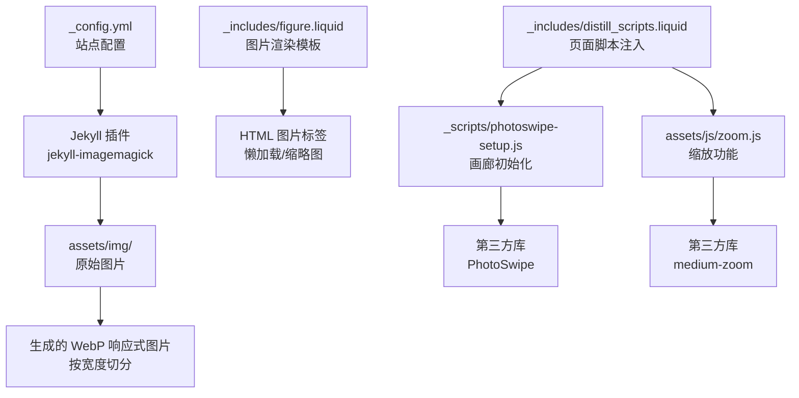
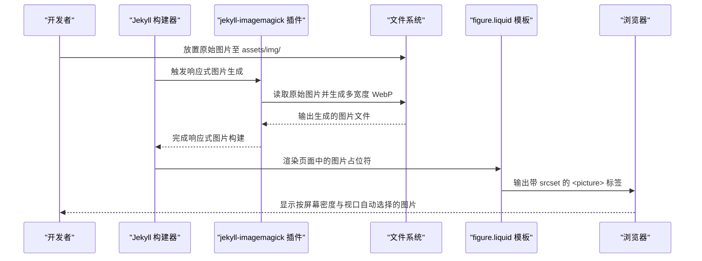
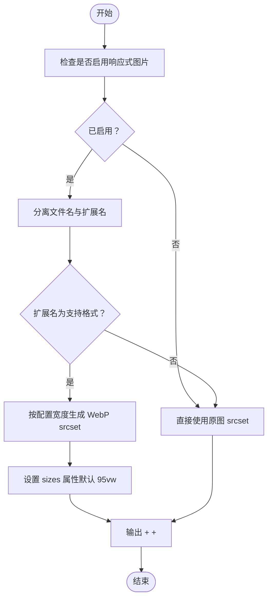
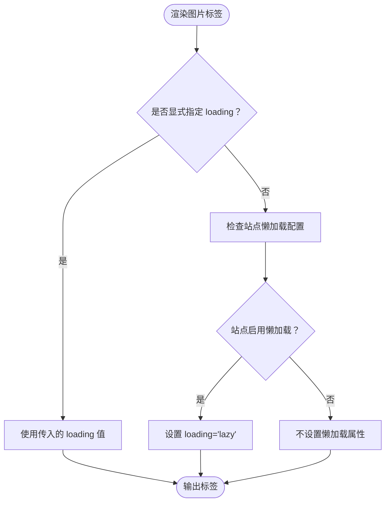
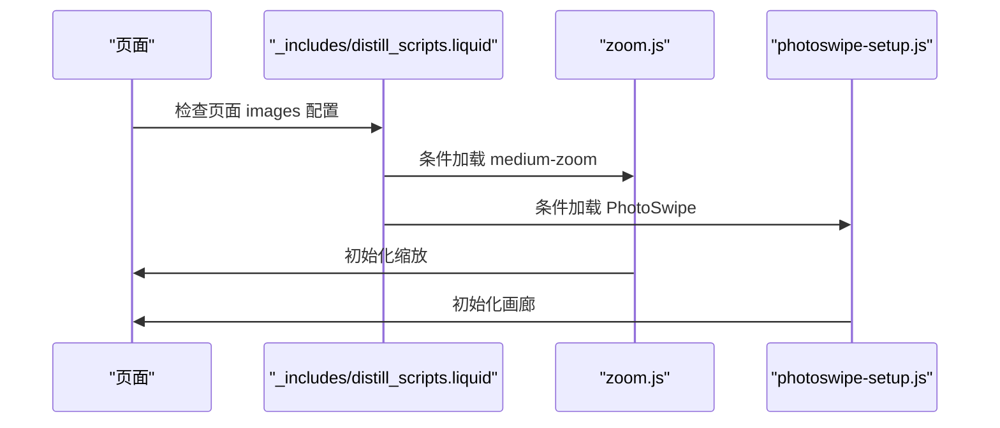
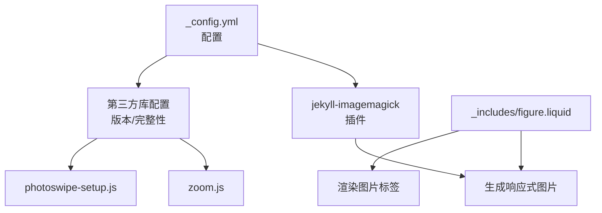

# 项目图片管理

<cite>
**本文档引用的文件**
- [_config.yml](file://_config.yml)
- [_includes/figure.liquid](file://_includes/figure.liquid)
- [_scripts/photoswipe-setup.js](file://_scripts/photoswipe-setup.js)
- [assets/js/zoom.js](file://assets/js/zoom.js)
- [_includes/distill_scripts.liquid](file://_includes/distill_scripts.liquid)
- [_plugins/file-exists.rb](file://_plugins/file-exists.rb)
</cite>

## 目录
1. [简介](#简介)
2. [项目结构](#项目结构)
3. [核心组件](#核心组件)
4. [架构概览](#架构概览)
5. [详细组件分析](#详细组件分析)
6. [依赖关系分析](#依赖关系分析)
7. [性能考虑](#性能考虑)
8. [故障排除指南](#故障排除指南)
9. [结论](#结论)
10. [附录](#附录)

## 简介
本文件为该项目的图片管理系统提供全面的技术文档，涵盖图片存储结构与命名规范、路径配置与相对路径使用方法、尺寸优化与压缩策略、懒加载实现与性能优化技巧、缩略图生成与响应式图片适配配置，以及图片格式选择建议与最佳实践。同时提供图片上传、管理和维护的工作流程指导。

## 项目结构
该项目基于 Jekyll 构建，图片资源主要存放于 `assets/img/` 目录下，配合 Jekyll 插件系统实现响应式图片生成与懒加载等特性。核心配置位于站点根目录的配置文件中，模板层通过 Liquid 模板实现图片渲染逻辑。

**图表来源**
- [_config.yml:352-375](file://_config.yml#L352-L375)
- [_includes/figure.liquid:10-33](file://_includes/figure.liquid#L10-L33)
- [_scripts/photoswipe-setup.js:1-12](file://_scripts/photoswipe-setup.js#L1-L12)
- [assets/js/zoom.js:1-7](file://assets/js/zoom.js#L1-L7)
- [_includes/distill_scripts.liquid:291-293](file://_includes/distill_scripts.liquid#L291-L293)

**章节来源**
- [_config.yml:352-375](file://_config.yml#L352-L375)
- [_includes/figure.liquid:1-87](file://_includes/figure.liquid#L1-L87)
- [_scripts/photoswipe-setup.js:1-12](file://_scripts/photoswipe-setup.js#L1-L12)
- [assets/js/zoom.js:1-7](file://assets/js/zoom.js#L1-L7)
- [_includes/distill_scripts.liquid:291-293](file://_includes/distill_scripts.liquid#L291-L293)

## 核心组件
- 响应式图片生成：通过 Jekyll 插件在构建时自动生成多宽度 WebP 图片，并在模板中以 `<picture>` + `<source>` 提供 srcset。
- 懒加载：默认启用浏览器级懒加载，支持覆盖与特定场景禁用。
- 缩略图与画廊：通过第三方库实现图片缩放与画廊浏览。
- 路径与缓存：统一使用相对路径与缓存破坏机制，确保资源正确加载与更新。

**章节来源**
- [_config.yml:352-375](file://_config.yml#L352-L375)
- [_includes/figure.liquid:16-33](file://_includes/figure.liquid#L16-L33)
- [_includes/figure.liquid:74-78](file://_includes/figure.liquid#L74-L78)

## 架构概览
图片从原始素材到最终渲染的完整流程如下：

**图表来源**
- [_config.yml:352-367](file://_config.yml#L352-L367)
- [_includes/figure.liquid:16-33](file://_includes/figure.liquid#L16-L33)

## 详细组件分析

### 响应式图片与 WebP 生成
- 配置项位置：站点配置中启用响应式图片并指定输入目录、输入格式与输出参数。
- 生成策略：根据配置的宽度列表，为每张图片生成对应宽度的 WebP 版本；非支持格式则回退为原图。
- 模板集成：模板在 `<picture>` 中插入 `<source>`，使用 `srcset` 和 `sizes` 属性，结合 `relative_url` 生成相对路径。

**图表来源**
- [_config.yml:352-367](file://_config.yml#L352-L367)
- [_includes/figure.liquid:16-33](file://_includes/figure.liquid#L16-L33)
- [_includes/figure.liquid:26-30](file://_includes/figure.liquid#L26-L30)

**章节来源**
- [_config.yml:352-367](file://_config.yml#L352-L367)
- [_includes/figure.liquid:16-33](file://_includes/figure.liquid#L16-L33)
- [_includes/figure.liquid:26-30](file://_includes/figure.liquid#L26-L30)

### 懒加载实现
- 全局开关：站点配置中开启懒加载后，模板会为所有图片添加 `loading="lazy"`。
- 覆盖机制：可在模板调用时传入 `loading` 参数覆盖默认行为。
- 错误处理：当图片加载失败时，模板提供错误回退逻辑，移除响应式源集以避免进一步失败。

**图表来源**
- [_includes/figure.liquid:74-78](file://_includes/figure.liquid#L74-L78)
- [_config.yml:369-375](file://_config.yml#L369-L375)

**章节来源**
- [_includes/figure.liquid:74-78](file://_includes/figure.liquid#L74-L78)
- [_config.yml:369-375](file://_config.yml#L369-L375)

### 缩略图与画廊
- 缩放功能：通过 `data-zoomable` 属性触发缩放，使用 medium-zoom 实现点击放大效果。
- 画廊功能：在页面中启用 PhotoSwipe 画廊，通过脚本初始化相册浏览体验。
- 脚本注入：根据页面配置动态引入第三方库脚本，确保按需加载。

**图表来源**
- [_includes/distill_scripts.liquid:291-293](file://_includes/distill_scripts.liquid#L291-L293)
- [assets/js/zoom.js:1-7](file://assets/js/zoom.js#L1-L7)
- [_scripts/photoswipe-setup.js:1-12](file://_scripts/photoswipe-setup.js#L1-L12)

**章节来源**
- [_includes/distill_scripts.liquid:291-293](file://_includes/distill_scripts.liquid#L291-L293)
- [assets/js/zoom.js:1-7](file://assets/js/zoom.js#L1-L7)
- [_scripts/photoswipe-setup.js:1-12](file://_scripts/photoswipe-setup.js#L1-L12)

### 路径配置与相对路径使用
- 相对路径：模板使用 `relative_url` 将图片路径转换为相对于站点根的链接，保证在不同部署环境下的一致性。
- 缓存破坏：模板支持在需要时对静态资源进行缓存破坏，确保更新后的资源被正确加载。
- 文件存在检测：提供 Liquid 标签用于判断资源是否存在，便于条件渲染与容错。

**章节来源**
- [_includes/figure.liquid:34-35](file://_includes/figure.liquid#L34-L35)
- [_includes/figure.liquid:35-35](file://_includes/figure.liquid#L35-L35)
- [_plugins/file-exists.rb:1-22](file://_plugins/file-exists.rb#L1-L22)

## 依赖关系分析
- 插件依赖：响应式图片能力依赖 `jekyll-imagemagick` 插件，需确保 ImageMagick 工具链可用。
- 第三方库：缩放与画廊功能依赖第三方 JavaScript 库，通过站点配置集中管理版本与完整性校验。
- 模板耦合：图片模板与站点配置强耦合，配置变更直接影响生成的图片属性与行为。

**图表来源**
- [_config.yml:196-217](file://_config.yml#L196-L217)
- [_config.yml:405-633](file://_config.yml#L405-L633)
- [_includes/figure.liquid:16-33](file://_includes/figure.liquid#L16-L33)
- [_scripts/photoswipe-setup.js:1-12](file://_scripts/photoswipe-setup.js#L1-L12)
- [assets/js/zoom.js:1-7](file://assets/js/zoom.js#L1-L7)

**章节来源**
- [_config.yml:196-217](file://_config.yml#L196-L217)
- [_config.yml:405-633](file://_config.yml#L405-L633)
- [_includes/figure.liquid:16-33](file://_includes/figure.liquid#L16-L33)

## 性能考虑
- 图片体积控制：优先采用 WebP 格式并设置合理质量参数，减少传输体积。
- 响应式策略：仅生成必要的宽度档位，避免过度切分导致构建时间与存储开销增加。
- 懒加载：全局启用懒加载可显著降低首屏资源请求量，提升页面初始加载速度。
- 缓存策略：利用浏览器缓存与 CDN 缓存，结合缓存破坏机制确保资源更新及时生效。
- 资源按需加载：通过页面配置决定是否加载缩放与画廊脚本，避免不必要的 JavaScript 下载。

## 故障排除指南
- 响应式图片未生成
  - 检查站点配置中是否启用响应式图片与正确的输入目录。
  - 确认 ImageMagick 工具链已安装且在系统 PATH 中可用。
  - 验证图片扩展名是否在支持列表内。
- 懒加载无效
  - 确认站点配置中已启用懒加载。
  - 检查模板调用时是否显式设置了 `loading` 参数覆盖默认行为。
- 图片加载失败
  - 模板内置错误回退逻辑会尝试移除响应式源集以避免重复失败，可检查资源路径与权限。
- 缩放或画廊功能异常
  - 确认页面配置中启用了相应功能，且第三方库脚本已正确注入。
  - 检查浏览器控制台是否有脚本加载错误。

**章节来源**
- [_config.yml:352-375](file://_config.yml#L352-L375)
- [_includes/figure.liquid:74-78](file://_includes/figure.liquid#L74-L78)
- [_includes/figure.liquid:79-79](file://_includes/figure.liquid#L79-L79)
- [_includes/distill_scripts.liquid:291-293](file://_includes/distill_scripts.liquid#L291-L293)

## 结论
该图片管理系统通过 Jekyll 插件与模板层的协同，实现了从图片生成、路径处理到渲染优化的完整闭环。合理的配置与最佳实践能够显著提升页面性能与用户体验。建议在实际使用中结合业务需求调整宽度档位与质量参数，并持续关注第三方库的版本更新与兼容性。

## 附录

### 图片存储结构与命名规范
- 存储位置：`assets/img/` 目录用于存放原始图片素材。
- 命名建议：使用语义化名称，避免特殊字符；若需生成多宽度版本，保持主文件名一致以便模板识别。
- 扩展名：支持 `.jpg`、`.jpeg`、`.png`、`.tiff`、`.gif` 等格式；其他格式将回退为原图。

**章节来源**
- [_config.yml:358-366](file://_config.yml#L358-L366)
- [_includes/figure.liquid:1-3](file://_includes/figure.liquid#L1-L3)

### 图片路径配置与相对路径使用
- 相对路径：模板统一使用 `relative_url` 生成相对路径，确保在不同部署环境下的稳定性。
- 缓存破坏：在需要强制刷新缓存时，可使用缓存破坏函数以确保新资源被加载。

**章节来源**
- [_includes/figure.liquid:34-35](file://_includes/figure.liquid#L34-L35)
- [_includes/figure.liquid:35-35](file://_includes/figure.liquid#L35-L35)

### 图片尺寸优化与压缩策略
- 多宽度生成：根据配置的宽度列表生成 WebP 版本，减少带宽占用。
- 质量参数：WebP 输出质量参数已在配置中设定，可根据网络环境与视觉要求微调。
- 过滤策略：非支持格式将回退为原图，避免不必要的转换。

**章节来源**
- [_config.yml:354-367](file://_config.yml#L354-L367)
- [_includes/figure.liquid:20-25](file://_includes/figure.liquid#L20-L25)

### 懒加载实现与性能优化技巧
- 全局启用：站点配置中开启懒加载，模板自动为所有图片添加懒加载属性。
- 覆盖机制：可通过模板参数覆盖默认行为，满足特定场景需求。
- 错误回退：模板内置错误处理，避免因单个图片失败影响整体渲染。

**章节来源**
- [_config.yml:369-375](file://_config.yml#L369-L375)
- [_includes/figure.liquid:74-78](file://_includes/figure.liquid#L74-L78)
- [_includes/figure.liquid:79-79](file://_includes/figure.liquid#L79-L79)

### 缩略图生成与响应式图片适配配置
- 缩略图：通过模板参数控制是否生成缩略图，结合第三方库实现缩放与画廊功能。
- 响应式适配：模板根据 `sizes` 属性与视口宽度选择合适分辨率的图片，提升加载效率。

**章节来源**
- [_includes/figure.liquid:26-30](file://_includes/figure.liquid#L26-L30)
- [_includes/figure.liquid:71-73](file://_includes/figure.liquid#L71-L73)

### 图片格式选择建议与最佳实践
- 推荐格式：优先使用 WebP，兼顾体积与质量；对需要透明度的场景可考虑 PNG。
- 质量权衡：在保证视觉质量的前提下适当降低质量参数，以换取更小的文件体积。
- 构建效率：合理设置宽度档位，避免过多切分导致构建时间过长。

**章节来源**
- [_config.yml:360-367](file://_config.yml#L360-L367)

### 图片上传、管理和维护工作流程
- 上传流程：将图片放入 `assets/img/` 对应子目录，确保扩展名符合支持列表。
- 构建验证：执行构建命令，确认响应式图片生成成功且无错误提示。
- 页面集成：在内容中通过模板调用图片组件，传入必要参数（如尺寸、标题、描述等）。
- 维护更新：修改配置后重新构建；如需强制刷新缓存，使用缓存破坏机制。
- 容错处理：利用文件存在检测标签与模板错误回退逻辑，确保页面稳定显示。

**章节来源**
- [_plugins/file-exists.rb:1-22](file://_plugins/file-exists.rb#L1-L22)
- [_includes/figure.liquid:34-35](file://_includes/figure.liquid#L34-L35)
- [_includes/figure.liquid:79-79](file://_includes/figure.liquid#L79-L79)