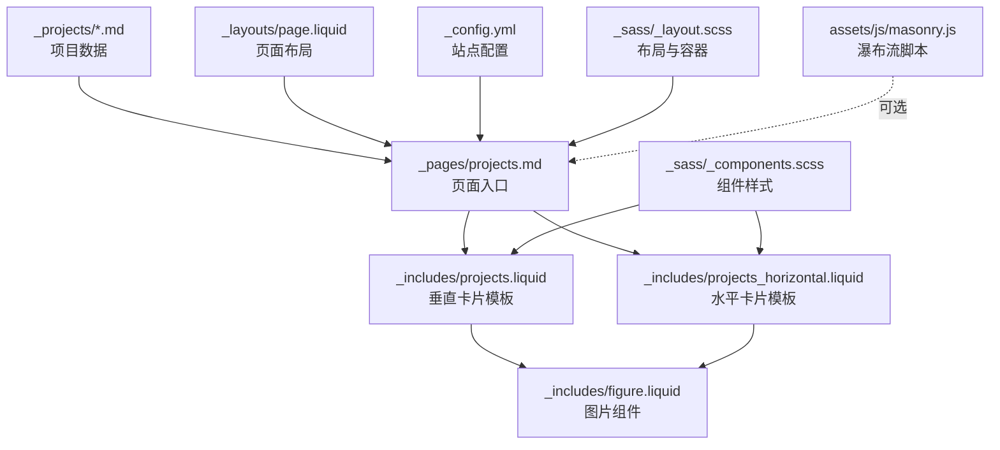
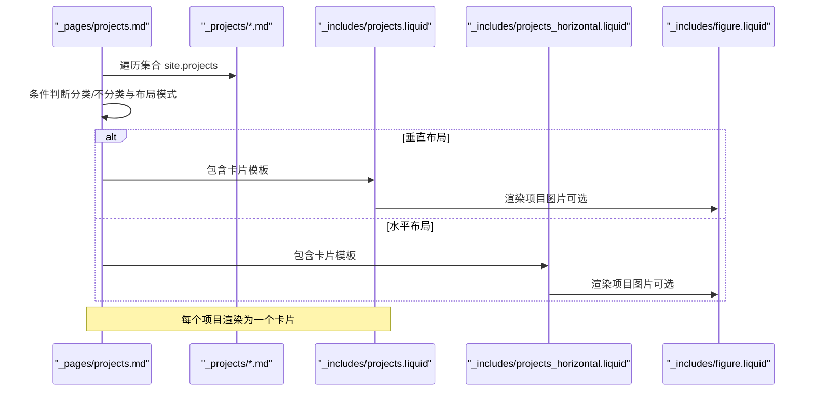
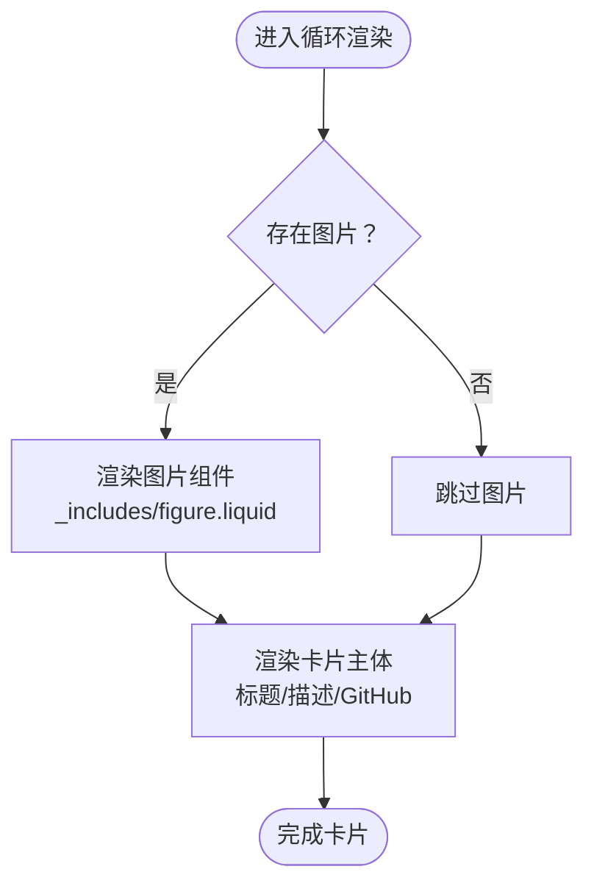
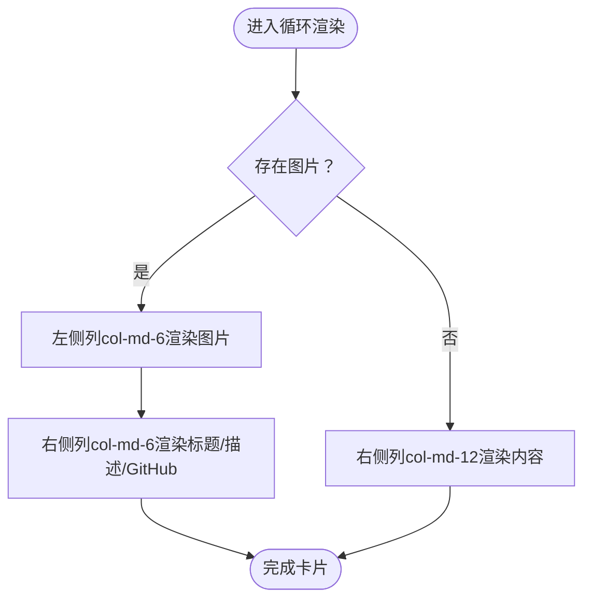
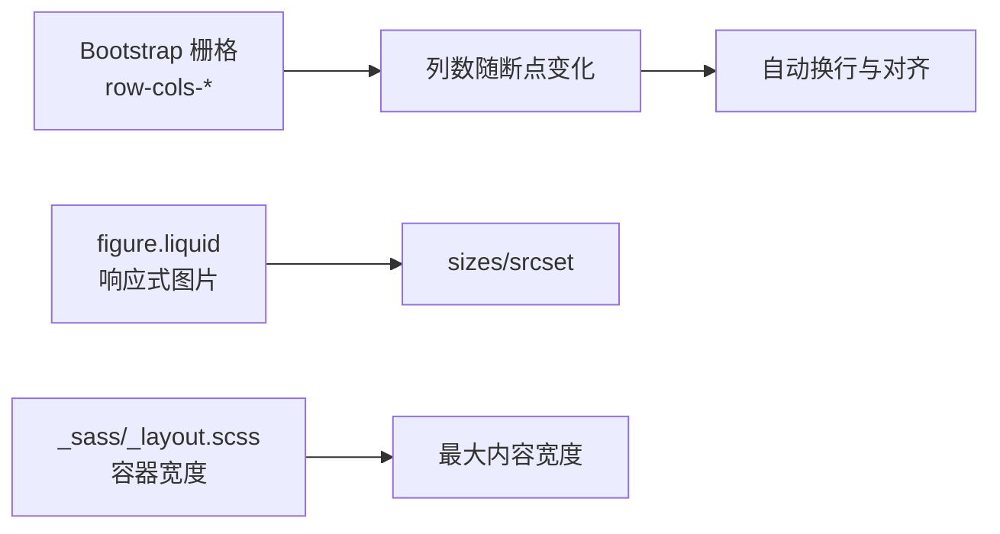
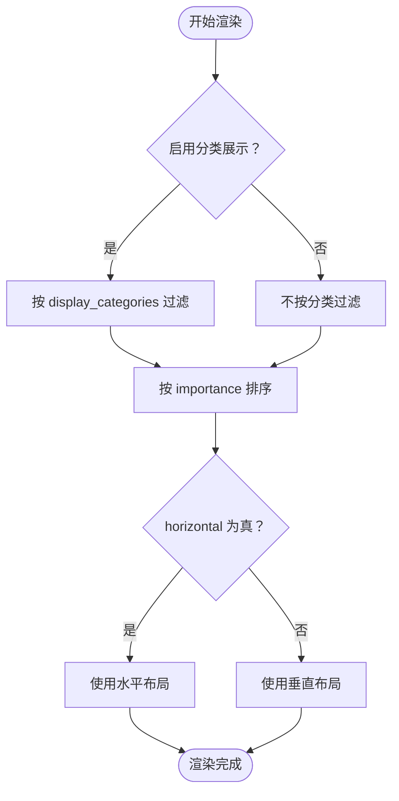
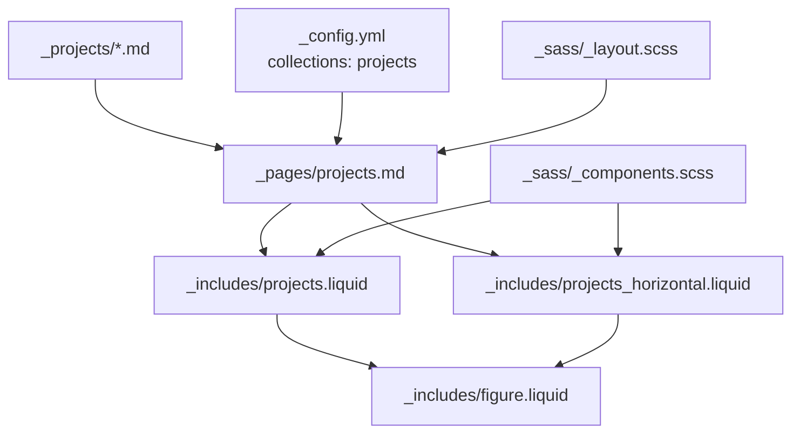

# 项目布局和展示

<cite>
**本文引用的文件**
- [_pages/projects.md](file://_pages/projects.md)
- [_includes/projects.liquid](file://_includes/projects.liquid)
- [_includes/projects_horizontal.liquid](file://_includes/projects_horizontal.liquid)
- [_includes/figure.liquid](file://_includes/figure.liquid)
- [_projects/1_project.md](file://_projects/1_project.md)
- [_projects/2_project.md](file://_projects/2_project.md)
- [_projects/3_project.md](file://_projects/3_project.md)
- [_layouts/page.liquid](file://_layouts/page.liquid)
- [_config.yml](file://_config.yml)
- [_sass/_components.scss](file://_sass/_components.scss)
- [_sass/_layout.scss](file://_sass/_layout.scss)
- [_sass/_variables.scss](file://_sass/_variables.scss)
- [assets/js/masonry.js](file://assets/js/masonry.js)
</cite>

## 目录
1. [简介](#简介)
2. [项目结构](#项目结构)
3. [核心组件](#核心组件)
4. [架构总览](#架构总览)
5. [详细组件分析](#详细组件分析)
6. [依赖关系分析](#依赖关系分析)
7. [性能考量](#性能考量)
8. [故障排查指南](#故障排查指南)
9. [结论](#结论)
10. [附录](#附录)

## 简介
本文件系统性阐述该项目的“项目布局与展示”体系，重点解析两类项目卡片布局模板：垂直项目卡片布局（projects.liquid）与水平项目布局（projects_horizontal.liquid），并说明其在页面中的集成方式、网格布局算法、响应式设计策略、视觉元素构成、布局自定义与样式修改方法、排序与筛选机制，以及实际配置示例与最佳实践。

## 项目结构
项目采用 Jekyll 静态站点生成器，项目数据来源于集合（collection）_projects 下的 Markdown 条目，页面模板位于 _pages，布局模板位于 _layouts，可复用的片段（includes）位于 _includes，样式位于 _sass，脚本位于 assets/js。

- 页面入口：_pages/projects.md 负责组织项目列表的展示逻辑，按分类或无分类渲染，并根据配置选择垂直或水平布局。
- 布局模板：_layouts/page.liquid 提供页面级容器与通用样式注入能力。
- 卡片模板：_includes/projects.liquid 与 _includes/projects_horizontal.liquid 分别渲染垂直与水平项目卡片。
- 图片组件：_includes/figure.liquid 统一处理响应式图片与懒加载。
- 数据来源：_projects/*.md 定义每个项目的元数据（如标题、描述、图片、分类、重要性等）。
- 样式与主题：_sass 下的 SCSS 文件控制布局、组件样式与变量；_config.yml 控制站点功能开关与集合输出。

图表来源
- [_pages/projects.md:14-66](file://_pages/projects.md#L14-L66)
- [_includes/projects.liquid:1-36](file://_includes/projects.liquid#L1-L36)
- [_includes/projects_horizontal.liquid:1-35](file://_includes/projects_horizontal.liquid#L1-L35)
- [_includes/figure.liquid:1-86](file://_includes/figure.liquid#L1-L86)
- [_projects/1_project.md:1-21](file://_projects/1_project.md#L1-L21)
- [_layouts/page.liquid:11-19](file://_layouts/page.liquid#L11-L19)
- [_config.yml:150-152](file://_config.yml#L150-L152)
- [_sass/_components.scss:127-162](file://_sass/_components.scss#L127-L162)
- [_sass/_layout.scss:32-34](file://_sass/_layout.scss#L32-L34)
- [assets/js/masonry.js:1-12](file://assets/js/masonry.js#L1-L12)

章节来源
- [_pages/projects.md:1-67](file://_pages/projects.md#L1-L67)
- [_layouts/page.liquid:1-32](file://_layouts/page.liquid#L1-L32)
- [_config.yml:145-152](file://_config.yml#L145-L152)

## 核心组件
- 项目页面模板（_pages/projects.md）
  - 支持按分类展示与不分类展示两种模式。
  - 使用 Liquid 过滤器对项目进行排序（按 importance 字段）。
  - 通过 page.horizontal 切换垂直（row-cols-1 row-cols-md-3）与水平（row-cols-1 row-cols-md-2）网格列数。
  - 每个项目循环内包含对应的卡片模板（projects.liquid 或 projects_horizontal.liquid）。
- 垂直项目卡片模板（_includes/projects.liquid）
  - 卡片结构：图片（可选）、标题、描述、GitHub 链接与星标（可选）。
  - 图片通过 _includes/figure.liquid 渲染，支持响应式与懒加载。
  - 标题与描述来自项目 Front Matter。
- 水平项目卡片模板（_includes/projects_horizontal.liquid）
  - 卡片内部采用 Bootstrap 行列结构：左侧为图片（可选），右侧为标题、描述与 GitHub 信息。
  - 左右分栏宽度根据是否存在图片动态调整（col-md-6 与 col-md-12）。
- 图片组件（_includes/figure.liquid）
  - 自动根据站点配置生成多尺寸 WebP 源集（srcset）与 sizes 属性，实现响应式图片。
  - 支持 loading 模式（eager/lazy）与错误回退。
- 项目数据（_projects/*.md）
  - 元数据字段：title、description、img、importance、category、redirect、github、github_stars 等。
- 页面布局（_layouts/page.liquid）
  - 提供页面级容器与样式注入位点，便于局部样式覆盖。
- 站点配置（_config.yml）
  - collections: projects 输出开启，使项目集合可被遍历。
  - enable_project_categories：控制是否启用项目分类展示。
  - enable_masonry：控制是否启用瀑布流布局（见附录）。

章节来源
- [_pages/projects.md:14-66](file://_pages/projects.md#L14-L66)
- [_includes/projects.liquid:1-36](file://_includes/projects.liquid#L1-L36)
- [_includes/projects_horizontal.liquid:1-35](file://_includes/projects_horizontal.liquid#L1-L35)
- [_includes/figure.liquid:1-86](file://_includes/figure.liquid#L1-L86)
- [_projects/1_project.md:1-21](file://_projects/1_project.md#L1-L21)
- [_layouts/page.liquid:11-19](file://_layouts/page.liquid#L11-L19)
- [_config.yml:150-152](file://_config.yml#L150-L152)

## 架构总览
下图展示了从页面到卡片再到图片组件的整体调用链路与数据流向。

图表来源
- [_pages/projects.md:14-66](file://_pages/projects.md#L14-L66)
- [_includes/projects.liquid:1-36](file://_includes/projects.liquid#L1-L36)
- [_includes/projects_horizontal.liquid:1-35](file://_includes/projects_horizontal.liquid#L1-L35)
- [_includes/figure.liquid:1-86](file://_includes/figure.liquid#L1-L86)

## 详细组件分析

### 垂直项目卡片布局（projects.liquid）
- 结构要点
  - 外层列容器（col）承载单个卡片。
  - 卡片容器（card）内包含图片区域（可选）、卡片主体（card-body）、标题与描述。
  - GitHub 图标与星标（可选）置于卡片底部行容器中。
- 视觉元素
  - 图片：通过 _includes/figure.liquid 渲染，支持响应式与懒加载。
  - 标题：使用卡片标题类，支持悬停主题色变化。
  - 描述：卡片文本类，用于简要说明。
  - GitHub：图标与仓库链接，可选显示星标计数。
- 响应式与网格
  - 在页面模板中，垂直布局使用 Bootstrap 列断点（row-cols-1 row-cols-md-3），在中等及以上屏幕每行显示 3 列。
- 排序与筛选
  - 页面模板对项目按 importance 排序；若启用分类展示，则先按分类过滤再排序。

图表来源
- [_includes/projects.liquid:1-36](file://_includes/projects.liquid#L1-L36)
- [_includes/figure.liquid:1-86](file://_includes/figure.liquid#L1-L86)

章节来源
- [_includes/projects.liquid:1-36](file://_includes/projects.liquid#L1-L36)
- [_pages/projects.md:32-37](file://_pages/projects.md#L32-L37)

### 水平项目卡片布局（projects_horizontal.liquid）
- 结构要点
  - 卡片内部使用 Bootstrap 行列结构（row no-gutters）。
  - 左侧列（col-md-6）放置图片，右侧列（col-md-6）放置标题、描述与 GitHub 信息。
  - 若无图片，右侧列扩展为整宽（col-md-12）。
- 视觉元素
  - 图片：在水平布局中，sizes 属性针对不同断点设置更紧凑的尺寸，以适配左右分栏。
  - 标题与描述：与垂直布局一致。
  - GitHub：同上。
- 响应式与网格
  - 水平布局使用 Bootstrap 列断点（row-cols-1 row-cols-md-2），在中等及以上屏幕每行显示 2 列。

图表来源
- [_includes/projects_horizontal.liquid:1-35](file://_includes/projects_horizontal.liquid#L1-L35)
- [_includes/figure.liquid:1-86](file://_includes/figure.liquid#L1-L86)

章节来源
- [_includes/projects_horizontal.liquid:1-35](file://_includes/projects_horizontal.liquid#L1-L35)
- [_pages/projects.md:24-31](file://_pages/projects.md#L24-L31)

### 项目网格布局算法与响应式设计
- 网格算法
  - 使用 Bootstrap 的栅格系统（grid system）与列断点（row-cols-*）实现自动换行与列数控制。
  - 垂直布局：row-cols-1 row-cols-md-3；水平布局：row-cols-1 row-cols-md-2。
- 响应式设计
  - 图片组件通过 sizes 与 srcset 实现响应式图片加载。
  - 容器最大宽度由 _sass/_layout.scss 中的变量控制，确保内容在大屏与小屏均保持良好阅读体验。
- 样式与间距
  - 卡片列容器统一设置底部间距，避免卡片贴合。
  - 卡片图片宽度自适应容器，保证视觉一致性。

图表来源
- [_pages/projects.md:24-37](file://_pages/projects.md#L24-L37)
- [_includes/figure.liquid:16-33](file://_includes/figure.liquid#L16-L33)
- [_sass/_layout.scss:32-34](file://_sass/_layout.scss#L32-L34)

章节来源
- [_pages/projects.md:24-37](file://_pages/projects.md#L24-L37)
- [_sass/_components.scss:144-152](file://_sass/_components.scss#L144-L152)
- [_sass/_layout.scss:32-34](file://_sass/_layout.scss#L32-L34)

### 项目排序与筛选机制
- 排序
  - 使用 Liquid 过滤器对项目集合按 importance 字段进行升序/降序排列（当前为升序）。
- 筛选
  - 当启用项目分类展示时，先按 category 过滤，再对分类内的项目进行排序。
- 页面控制
  - page.display_categories 决定展示哪些分类。
  - page.horizontal 控制使用垂直或水平布局。

图表来源
- [_pages/projects.md:15-40](file://_pages/projects.md#L15-L40)
- [_pages/projects.md:41-65](file://_pages/projects.md#L41-L65)

章节来源
- [_pages/projects.md:15-40](file://_pages/projects.md#L15-L40)
- [_pages/projects.md:41-65](file://_pages/projects.md#L41-L65)

### 布局自定义与样式修改
- 修改卡片外观
  - 通过 _sass/_components.scss 中的 .projects、.card、.col 等选择器调整卡片间距、图片宽度与悬停效果。
- 修改网格密度
  - 在 _pages/projects.md 中调整 row-cols-* 断点值以改变列数。
- 修改容器宽度
  - 在 _sass/_variables.scss 中调整 $max-content-width，影响全局容器最大宽度。
- 自定义图片尺寸与加载策略
  - 在 _includes/figure.liquid 中调整 sizes 与 loading 参数，或在卡片模板中传入不同参数。
- 启用瀑布流布局（可选）
  - 若需更灵活的瀑布流排列，可在页面中引入瀑布流脚本（assets/js/masonry.js），并配合 .grid、.grid-sizer、.grid-item 类名使用。

章节来源
- [_sass/_components.scss:127-162](file://_sass/_components.scss#L127-L162)
- [_sass/_variables.scss:51-53](file://_sass/_variables.scss#L51-L53)
- [_pages/projects.md:24-37](file://_pages/projects.md#L24-L37)
- [_includes/figure.liquid:16-33](file://_includes/figure.liquid#L16-L33)
- [assets/js/masonry.js:1-12](file://assets/js/masonry.js#L1-L12)

## 依赖关系分析
- 页面到模板
  - _pages/projects.md 依赖 _includes/projects.liquid 与 _includes/projects_horizontal.liquid。
- 模板到组件
  - 两个卡片模板均依赖 _includes/figure.liquid 渲染图片。
- 数据到页面
  - _projects/*.md 提供项目数据，site.projects 集合由 _config.yml 中的 collections: projects 输出开启。
- 样式到组件
  - _sass/_components.scss 为项目卡片提供默认样式，_sass/_layout.scss 控制容器与全局布局。

图表来源
- [_pages/projects.md:14-66](file://_pages/projects.md#L14-L66)
- [_includes/projects.liquid:1-36](file://_includes/projects.liquid#L1-L36)
- [_includes/projects_horizontal.liquid:1-35](file://_includes/projects_horizontal.liquid#L1-L35)
- [_includes/figure.liquid:1-86](file://_includes/figure.liquid#L1-L86)
- [_projects/1_project.md:1-21](file://_projects/1_project.md#L1-L21)
- [_config.yml:150-152](file://_config.yml#L150-L152)
- [_sass/_components.scss:127-162](file://_sass/_components.scss#L127-L162)
- [_sass/_layout.scss:32-34](file://_sass/_layout.scss#L32-L34)

章节来源
- [_pages/projects.md:14-66](file://_pages/projects.md#L14-L66)
- [_config.yml:150-152](file://_config.yml#L150-L152)

## 性能考量
- 图片优化
  - 使用 _includes/figure.liquid 自动生成多尺寸 WebP 源集与 sizes 属性，减少带宽占用并提升加载速度。
  - 支持懒加载（lazy）与错误回退（onerror），增强健壮性。
- 网格与布局
  - Bootstrap 栅格系统轻量高效，适合静态内容展示。
  - 如需更复杂的布局，可考虑引入瀑布流脚本（assets/js/masonry.js），但需注意图片加载完成后的重新布局开销。
- 样式体积
  - 将样式拆分为模块化 SCSS，按需维护，避免不必要的样式膨胀。

[本节为通用指导，无需列出具体文件来源]

## 故障排查指南
- 图片未显示或加载缓慢
  - 检查项目 Front Matter 中的 img 路径是否正确且可访问。
  - 确认 _includes/figure.liquid 的 sizes 与 loading 参数是否符合预期。
  - 若站点启用了 imagmagick，确认输入目录与格式配置正确。
- 卡片布局错乱
  - 检查 _pages/projects.md 中 row-cols-* 断点值是否与期望一致。
  - 确认容器最大宽度变量（_sass/_variables.scss）未被意外覆盖。
- 分类展示异常
  - 确认 _pages/projects.md 中 display_categories 是否包含项目实际的 category 值。
  - 检查 _config.yml 中 enable_project_categories 是否启用。
- 瀑布流不生效
  - 确认已引入瀑布流脚本（assets/js/masonry.js）并在页面中使用 .grid、.grid-sizer、.grid-item 类名。

章节来源
- [_includes/figure.liquid:16-33](file://_includes/figure.liquid#L16-L33)
- [_pages/projects.md:24-37](file://_pages/projects.md#L24-L37)
- [_sass/_variables.scss:51-53](file://_sass/_variables.scss#L51-L53)
- [_config.yml:393](file://_config.yml#L393)
- [assets/js/masonry.js:1-12](file://assets/js/masonry.js#L1-L12)

## 结论
该布局系统以简洁的 Liquid 模板与 Bootstrap 栅格为核心，结合统一的图片组件，实现了高度可定制的项目展示方案。通过页面配置即可灵活切换布局模式与分类展示，配合响应式图片与样式模块化，兼顾了性能与可维护性。对于更复杂的布局需求，可按需引入瀑布流脚本并遵循最佳实践进行扩展。

[本节为总结性内容，无需列出具体文件来源]

## 附录

### 布局配置示例与最佳实践
- 基础配置（_pages/projects.md）
  - 启用分类展示：设置 display_categories 为需要展示的分类数组。
  - 选择布局：horizontal 设为 true 使用水平布局，false 使用垂直布局。
  - 排序：依靠 importance 字段进行排序。
- 最佳实践
  - 为每个项目提供清晰的 title、description 与 img，确保卡片信息完整。
  - 合理设置 importance，以体现项目优先级。
  - 使用相对路径指定图片，确保在不同环境下均可访问。
  - 在小屏设备上优先保证文字可读性，必要时降低列数或调整卡片尺寸。
  - 如需瀑布流效果，引入 masonry 脚本并确保图片加载完成后触发重排。

章节来源
- [_pages/projects.md:9-11](file://_pages/projects.md#L9-L11)
- [_pages/projects.md:24-37](file://_pages/projects.md#L24-L37)
- [_projects/1_project.md:5-7](file://_projects/1_project.md#L5-L7)
- [_projects/2_project.md:5-7](file://_projects/2_project.md#L5-L7)
- [_projects/3_project.md:5-7](file://_projects/3_project.md#L5-L7)