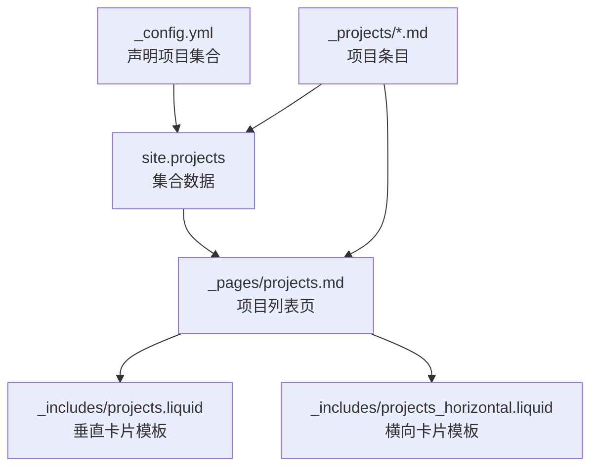
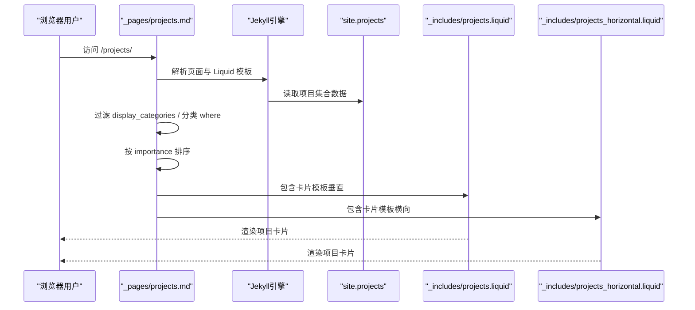
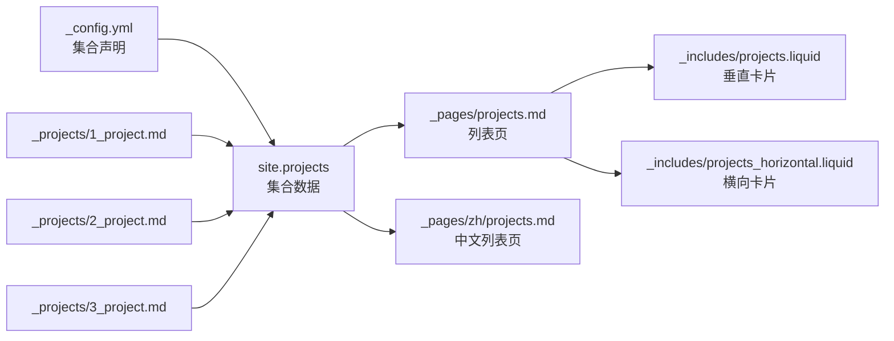

# 项目数据模型

<cite>
**本文引用的文件**
- [_config.yml](file://_config.yml)
- [_pages/projects.md](file://_pages/projects.md)
- [_pages/zh/projects.md](file://_pages/zh/projects.md)
- [_projects/1_project.md](file://_projects/1_project.md)
- [_projects/2_project.md](file://_projects/2_project.md)
- [_projects/3_project.md](file://_projects/3_project.md)
- [_includes/projects.liquid](file://_includes/projects.liquid)
- [_includes/projects_horizontal.liquid](file://_includes/projects_horizontal.liquid)
- [.github/instructions/markdown-content.instructions.md](file://.github/instructions/markdown-content.instructions.md)
- [CUSTOMIZE.md](file://CUSTOMIZE.md)
</cite>

## 目录
1. [引言](#引言)
2. [项目结构](#项目结构)
3. [核心组件](#核心组件)
4. [架构总览](#架构总览)
5. [详细组件分析](#详细组件分析)
6. [依赖关系分析](#依赖关系分析)
7. [性能考量](#性能考量)
8. [故障排查指南](#故障排查指南)
9. [结论](#结论)
10. [附录](#附录)

## 引言
本文件系统化梳理本仓库的“项目”数据模型，重点说明项目 YAML front matter 的字段定义与配置方法，解释项目分类系统与重要性级别，并给出完整配置示例与在 Jekyll 中的处理流程及 Liquid 模板使用方式。目标是帮助内容作者准确、一致地维护项目数据，确保在页面中正确渲染与排序。

## 项目结构
项目数据主要由三部分构成：
- 集合定义：在站点配置中声明项目集合，使 Jekyll 能识别并处理项目条目。
- 条目文件：位于 _projects/ 下的 Markdown 文件，每个文件代表一个项目条目，包含 YAML front matter 与正文内容。
- 页面与模板：项目列表页负责展示项目卡片，包含分类筛选与排序逻辑；项目卡片模板负责具体渲染。

图表来源
- [_config.yml:145-152](file://_config.yml#L145-L152)
- [_pages/projects.md:14-66](file://_pages/projects.md#L14-L66)
- [_includes/projects.liquid:1-36](file://_includes/projects.liquid#L1-L36)
- [_includes/projects_horizontal.liquid:1-35](file://_includes/projects_horizontal.liquid#L1-L35)
- [_projects/1_project.md:1-21](file://_projects/1_project.md#L1-L21)

章节来源
- [_config.yml:145-152](file://_config.yml#L145-L152)
- [_pages/projects.md:14-66](file://_pages/projects.md#L14-L66)

## 核心组件
本节聚焦项目数据模型的关键字段及其作用与配置要点。

- 字段清单与职责
  - title：项目标题，用于卡片标题与页面标题显示。
  - description：项目描述，用于卡片摘要与页面描述显示。
  - img：项目缩略图路径，支持响应式图片组件。
  - importance：整数型重要性权重，数值越大越靠前。
  - category：项目分类字符串，用于按类别分组展示。
  - redirect：可选重定向链接，优先于内部 URL。
  - github / github_stars：可选 GitHub 仓库链接与星标展示。
  - featured：可选置顶标记（在项目集合中常见），用于主区域展示。

- 字段来源与用法依据
  - 项目条目 front matter 字段来自项目条目文件与通用内容规范。
  - 列表页通过过滤与排序实现分类与重要性展示。
  - 卡片模板从项目对象读取字段进行渲染。

章节来源
- [_projects/1_project.md:1-21](file://_projects/1_project.md#L1-L21)
- [_projects/2_project.md:1-21](file://_projects/2_project.md#L1-L21)
- [_projects/3_project.md:1-21](file://_projects/3_project.md#L1-L21)
- [.github/instructions/markdown-content.instructions.md:108-113](file://.github/instructions/markdown-content.instructions.md#L108-L113)
- [_includes/projects.liquid:14-31](file://_includes/projects.liquid#L14-L31)
- [_includes/projects_horizontal.liquid:10-27](file://_includes/projects_horizontal.liquid#L10-L27)

## 架构总览
项目数据在 Jekyll 中的处理流程如下：

图表来源
- [_pages/projects.md:14-66](file://_pages/projects.md#L14-L66)
- [_includes/projects.liquid:1-36](file://_includes/projects.liquid#L1-L36)
- [_includes/projects_horizontal.liquid:1-35](file://_includes/projects_horizontal.liquid#L1-L35)

## 详细组件分析

### 数据模型字段详解
- title
  - 类型：字符串
  - 作用：卡片标题与页面标题
  - 配置：直接写入 front matter
  - 使用：卡片模板与页面布局均读取该字段
  - 参考路径：[_projects/1_project.md:3](file://_projects/1_project.md#L3)，[_includes/projects.liquid:15](file://_includes/projects.liquid#L15)，[_includes/projects_horizontal.liquid:12](file://_includes/projects_horizontal.liquid#L12)

- description
  - 类型：字符串
  - 作用：卡片摘要与页面描述
  - 配置：直接写入 front matter
  - 使用：卡片模板与页面布局均读取该字段
  - 参考路径：[_projects/1_project.md:4](file://_projects/1_project.md#L4)，[_includes/projects.liquid:16](file://_includes/projects.liquid#L16)，[_includes/projects_horizontal.liquid:13](file://_includes/projects_horizontal.liquid#L13)

- img
  - 类型：字符串（相对路径）
  - 作用：项目缩略图，支持响应式加载
  - 配置：front matter 中指定图片路径
  - 使用：卡片模板通过 include 图片组件渲染
  - 参考路径：[_projects/1_project.md:5](file://_projects/1_project.md#L5)，[_includes/projects.liquid:4-13](file://_includes/projects.liquid#L4-L13)，[_includes/projects_horizontal.liquid:5-10](file://_includes/projects_horizontal.liquid#L5-L10)

- importance
  - 类型：整数
  - 作用：排序权重，数值越大越靠前
  - 配置：front matter 中整数
  - 使用：列表页通过排序过滤实现
  - 参考路径：[_projects/1_project.md:6](file://_projects/1_project.md#L6)，[_pages/projects.md:22](file://_pages/projects.md#L22)，[_pages/zh/projects.md:20](file://_pages/zh/projects.md#L20)

- category
  - 类型：字符串
  - 作用：项目分类，用于分组展示
  - 配置：front matter 中字符串
  - 使用：列表页按分类过滤并分组渲染
  - 参考路径：[_projects/1_project.md:7](file://_projects/1_project.md#L7)，[_pages/projects.md:21](file://_pages/projects.md#L21)，[_pages/zh/projects.md:19](file://_pages/zh/projects.md#L19)

- redirect
  - 类型：字符串（URL）
  - 作用：优先于内部 URL 的外部跳转
  - 配置：front matter 中可选字段
  - 使用：卡片链接优先读取该字段
  - 参考路径：[_includes/projects.liquid:2](file://_includes/projects.liquid#L2)，[_includes/projects_horizontal.liquid:2](file://_includes/projects_horizontal.liquid#L2)

- github / github_stars
  - 类型：字符串（URL）、字符串（标识符）
  - 作用：GitHub 仓库链接与星标展示
  - 配置：front matter 中可选字段
  - 使用：卡片模板条件渲染 GitHub 图标与星标
  - 参考路径：[_includes/projects.liquid:18-30](file://_includes/projects.liquid#L18-L30)，[_includes/projects_horizontal.liquid:15-27](file://_includes/projects_horizontal.liquid#L15-L27)

- featured
  - 类型：布尔或字符串
  - 作用：在主区域置顶展示（常见于项目集合）
  - 配置：front matter 中可选字段
  - 使用：列表页可基于该字段筛选置顶项目
  - 参考路径：[markdown-content.instructions.md:112](file://.github/instructions/markdown-content.instructions.md#L112)

章节来源
- [_projects/1_project.md:1-21](file://_projects/1_project.md#L1-L21)
- [_projects/2_project.md:1-21](file://_projects/2_project.md#L1-L21)
- [_projects/3_project.md:1-21](file://_projects/3_project.md#L1-L21)
- [_includes/projects.liquid:1-36](file://_includes/projects.liquid#L1-L36)
- [_includes/projects_horizontal.liquid:1-35](file://_includes/projects_horizontal.liquid#L1-L35)
- [.github/instructions/markdown-content.instructions.md:108-113](file://.github/instructions/markdown-content.instructions.md#L108-L113)

### 项目分类系统
- 可用值与用途
  - 可用值：由各项目条目的 category 值决定，示例中出现 research 与 engineering。
  - 用途：列表页根据 page.display_categories 控制展示哪些分类；每个分类内再按 importance 排序。
- 配置方法
  - 在项目条目 front matter 中设置 category 字符串。
  - 在项目列表页 front matter 中设置 display_categories 数组以限定展示范围。
- 示例参考
  - 条目分类：[_projects/1_project.md:7](file://_projects/1_project.md#L7)，[_projects/2_project.md:7](file://_projects/2_project.md#L7)，[_projects/3_project.md:7](file://_projects/3_project.md#L7)
  - 列表页分类控制：[_pages/projects.md:9](file://_pages/projects.md#L9)，[_pages/zh/projects.md:8](file://_pages/zh/projects.md#L8)

章节来源
- [_projects/1_project.md:7](file://_projects/1_project.md#L7)
- [_projects/2_project.md:7](file://_projects/2_project.md#L7)
- [_projects/3_project.md:7](file://_projects/3_project.md#L7)
- [_pages/projects.md:9](file://_pages/projects.md#L9)
- [_pages/zh/projects.md:8](file://_pages/zh/projects.md#L8)

### 项目重要性级别
- 概念与设置
  - importance 为整数型权重，数值越大越靠前。
  - 列表页通过排序过滤实现重要性排序。
- 配置示例
  - 1_project.md：importance: 1
  - 2_project.md：importance: 2
  - 3_project.md：importance: 3
- 排序逻辑
  - 列表页对 site.projects 按 importance 进行排序后渲染。
- 参考路径
  - 条目设置：[_projects/1_project.md:6](file://_projects/1_project.md#L6)，[_projects/2_project.md:6](file://_projects/2_project.md#L6)，[_projects/3_project.md:6](file://_projects/3_project.md#L6)
  - 排序实现：[_pages/projects.md:22](file://_pages/projects.md#L22)，[_pages/zh/projects.md:20](file://_pages/zh/projects.md#L20)

章节来源
- [_projects/1_project.md:6](file://_projects/1_project.md#L6)
- [_projects/2_project.md:6](file://_projects/2_project.md#L6)
- [_projects/3_project.md:6](file://_projects/3_project.md#L6)
- [_pages/projects.md:22](file://_pages/projects.md#L22)
- [_pages/zh/projects.md:20](file://_pages/zh/projects.md#L20)

### 完整项目配置示例
以下示例展示不同类型项目的 front matter 配置要点（仅列出字段与取值，不包含正文内容）：

- 研究项目
  - front matter 关键字段：title、description、img、importance、category
  - 示例参考：[_projects/1_project.md:1-8](file://_projects/1_project.md#L1-L8)，[_projects/2_project.md:1-8](file://_projects/2_project.md#L1-L8)

- 工程项目
  - front matter 关键字段：title、description、img、importance、category
  - 示例参考：[_projects/3_project.md:1-8](file://_projects/3_project.md#L1-L8)

- 开源项目（可选）
  - front matter 关键字段：title、description、img、importance、category、github、github_stars
  - 示例参考：[_includes/projects.liquid:18-30](file://_includes/projects.liquid#L18-L30)，[_includes/projects_horizontal.liquid:15-27](file://_includes/projects_horizontal.liquid#L15-L27)

- 置顶项目（可选）
  - front matter 关键字段：title、description、img、importance、category、featured
  - 示例参考：[markdown-content.instructions.md:112](file://.github/instructions/markdown-content.instructions.md#L112)

章节来源
- [_projects/1_project.md:1-8](file://_projects/1_project.md#L1-L8)
- [_projects/2_project.md:1-8](file://_projects/2_project.md#L1-L8)
- [_projects/3_project.md:1-8](file://_projects/3_project.md#L1-L8)
- [_includes/projects.liquid:18-30](file://_includes/projects.liquid#L18-L30)
- [_includes/projects_horizontal.liquid:15-27](file://_includes/projects_horizontal.liquid#L15-L27)
- [.github/instructions/markdown-content.instructions.md:112](file://.github/instructions/markdown-content.instructions.md#L112)

### Jekyll 处理流程与 Liquid 使用
- 集合声明
  - 在站点配置中声明 projects 集合，使 Jekyll 能识别 _projects/ 下的条目。
  - 参考路径：[_config.yml:150-151](file://_config.yml#L150-L151)

- 列表页处理
  - 读取 page.display_categories，按分类过滤 site.projects。
  - 对每个分类内的项目按 importance 排序，再渲染卡片模板。
  - 参考路径：[_pages/projects.md:15-40](file://_pages/projects.md#L15-L40)，[_pages/zh/projects.md:14-37](file://_pages/zh/projects.md#L14-L37)

- 卡片模板使用
  - 垂直卡片模板：[_includes/projects.liquid:1-36](file://_includes/projects.liquid#L1-L36)
  - 横向卡片模板：[_includes/projects_horizontal.liquid:1-35](file://_includes/projects_horizontal.liquid#L1-L35)
  - 模板从项目对象读取 title、description、img、redirect、github、github_stars 等字段。

- 页面布局
  - 页面布局文件提供页面级 title 与 description 展示，便于 SEO 与元数据。
  - 参考路径：[_layouts/page.liquid:11-19](file://_layouts/page.liquid#L11-L19)

章节来源
- [_config.yml:150-151](file://_config.yml#L150-L151)
- [_pages/projects.md:15-40](file://_pages/projects.md#L15-L40)
- [_pages/zh/projects.md:14-37](file://_pages/zh/projects.md#L14-L37)
- [_includes/projects.liquid:1-36](file://_includes/projects.liquid#L1-L36)
- [_includes/projects_horizontal.liquid:1-35](file://_includes/projects_horizontal.liquid#L1-L35)
- [_layouts/page.liquid:11-19](file://_layouts/page.liquid#L11-L19)

## 依赖关系分析
项目数据模型的依赖关系如下：

图表来源
- [_config.yml:150-151](file://_config.yml#L150-L151)
- [_pages/projects.md:14-66](file://_pages/projects.md#L14-L66)
- [_pages/zh/projects.md:12-58](file://_pages/zh/projects.md#L12-L58)
- [_includes/projects.liquid:1-36](file://_includes/projects.liquid#L1-L36)
- [_includes/projects_horizontal.liquid:1-35](file://_includes/projects_horizontal.liquid#L1-L35)
- [_projects/1_project.md:1-21](file://_projects/1_project.md#L1-L21)
- [_projects/2_project.md:1-21](file://_projects/2_project.md#L1-L21)
- [_projects/3_project.md:1-21](file://_projects/3_project.md#L1-L21)

章节来源
- [_config.yml:150-151](file://_config.yml#L150-L151)
- [_pages/projects.md:14-66](file://_pages/projects.md#L14-L66)
- [_pages/zh/projects.md:12-58](file://_pages/zh/projects.md#L12-L58)
- [_includes/projects.liquid:1-36](file://_includes/projects.liquid#L1-L36)
- [_includes/projects_horizontal.liquid:1-35](file://_includes/projects_horizontal.liquid#L1-L35)
- [_projects/1_project.md:1-21](file://_projects/1_project.md#L1-L21)
- [_projects/2_project.md:1-21](file://_projects/2_project.md#L1-L21)
- [_projects/3_project.md:1-21](file://_projects/3_project.md#L1-L21)

## 性能考量
- 图片懒加载与响应式
  - 卡片模板使用响应式图片组件，结合懒加载属性，有助于提升首屏性能。
  - 参考路径：[_includes/projects.liquid:6-12](file://_includes/projects.liquid#L6-L12)，[_includes/projects_horizontal.liquid:7](file://_includes/projects_horizontal.liquid#L7)

- 排序与过滤
  - 列表页对项目进行分类过滤与重要性排序，建议控制单页项目数量，避免大规模集合渲染带来的性能压力。
  - 参考路径：[_pages/projects.md:21-22](file://_pages/projects.md#L21-L22)，[_pages/zh/projects.md:19-20](file://_pages/zh/projects.md#L19-L20)

- 静态生成优势
  - Jekyll 静态生成，构建时完成数据处理与模板渲染，运行时仅需传输静态资源，访问速度快。

## 故障排查指南
- front matter 语法错误
  - 症状：构建时报 YAML 解析错误。
  - 排查：检查缩进、引号、特殊字符，遵循通用内容规范。
  - 参考路径：[markdown-content.instructions.md:32-39](file://.github/instructions/markdown-content.instructions.md#L32-L39)

- 图片路径错误
  - 症状：项目卡片无图或图片 404。
  - 排查：确认 img 路径以 /assets/ 开头且文件存在。
  - 参考路径：[_includes/projects.liquid:8](file://_includes/projects.liquid#L8)，[_includes/projects_horizontal.liquid:7](file://_includes/projects_horizontal.liquid#L7)

- 项目未出现在列表页
  - 症状：新增项目未显示。
  - 排查：确认已加入项目集合（_config.yml 声明）、front matter 字段完整、分类与 display_categories 设置正确。
  - 参考路径：[_config.yml:150-151](file://_config.yml#L150-L151)，[_pages/projects.md:9](file://_pages/projects.md#L9)

- 排序不符合预期
  - 症状：项目顺序与 importance 不一致。
  - 排查：确认 importance 为整数，且列表页排序逻辑生效。
  - 参考路径：[_pages/projects.md:22](file://_pages/projects.md#L22)，[_pages/zh/projects.md:20](file://_pages/zh/projects.md#L20)

章节来源
- [.github/instructions/markdown-content.instructions.md:32-39](file://.github/instructions/markdown-content.instructions.md#L32-L39)
- [_includes/projects.liquid:8](file://_includes/projects.liquid#L8)
- [_includes/projects_horizontal.liquid:7](file://_includes/projects_horizontal.liquid#L7)
- [_config.yml:150-151](file://_config.yml#L150-L151)
- [_pages/projects.md:9](file://_pages/projects.md#L9)
- [_pages/projects.md:22](file://_pages/projects.md#L22)
- [_pages/zh/projects.md:20](file://_pages/zh/projects.md#L20)

## 结论
本仓库的项目数据模型以 Jekyll 集合为核心，通过简洁明确的 YAML front matter 字段（title、description、img、importance、category 等）与列表页的分类过滤、重要性排序逻辑，实现了清晰、可扩展的项目展示体系。配合卡片模板的响应式图片与链接处理，整体具备良好的可维护性与性能表现。建议在新增或修改项目时严格遵循字段规范与配置方法，确保渲染一致性与可读性。

## 附录
- 术语对照
  - 集合：Jekyll 中的自定义内容类型，此处为 projects。
  - front matter：Markdown 文件顶部的 YAML 配置块。
  - Liquid：Jekyll 使用的模板语言。