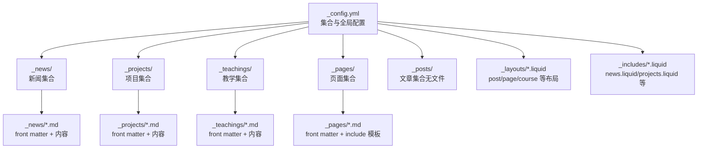
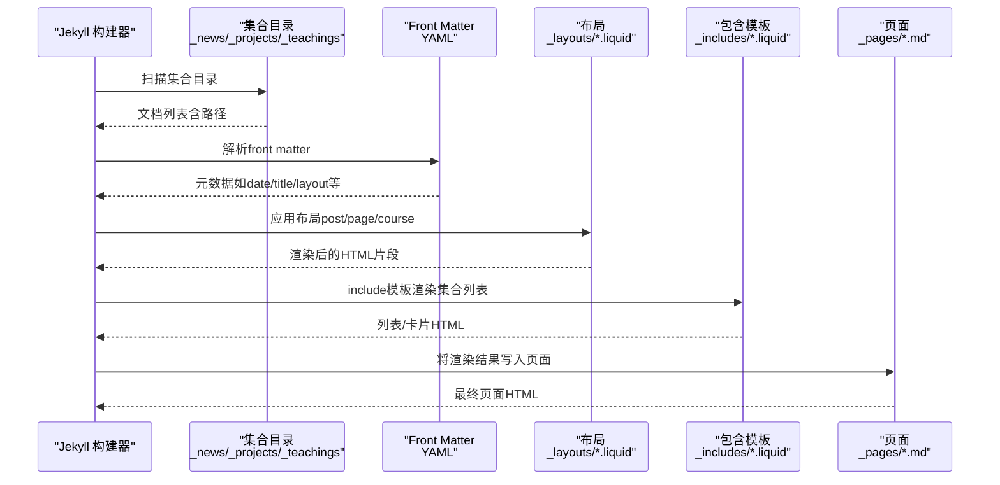
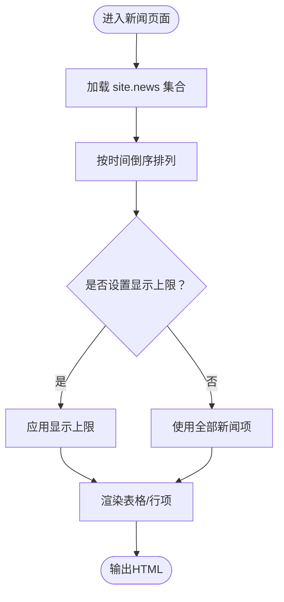
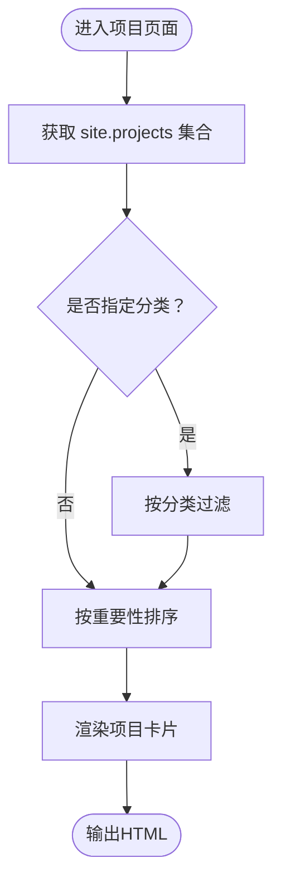
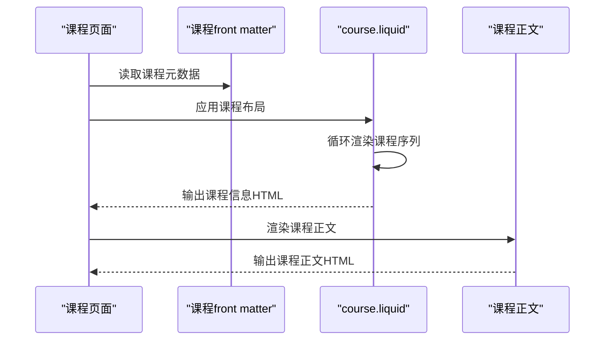
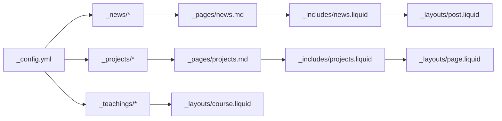

# Collections集合系统

<cite>
**本文档引用的文件**
- [_config.yml](file://_config.yml)
- [_news/announcement_1.md](file://_news/announcement_1.md)
- [_news/announcement_2.md](file://_news/announcement_2.md)
- [_news/announcement_3.md](file://_news/announcement_3.md)
- [_projects/1_project.md](file://_projects/1_project.md)
- [_teachings/data-science-fundamentals.md](file://_teachings/data-science-fundamentals.md)
- [_pages/news.md](file://_pages/news.md)
- [_pages/projects.md](file://_pages/projects.md)
- [_includes/news.liquid](file://_includes/news.liquid)
- [_includes/projects.liquid](file://_includes/projects.liquid)
- [_layouts/post.liquid](file://_layouts/post.liquid)
- [_layouts/page.liquid](file://_layouts/page.liquid)
- [_layouts/course.liquid](file://_layouts/course.liquid)
</cite>

## 目录
1. [简介](#简介)
2. [项目结构](#项目结构)
3. [核心组件](#核心组件)
4. [架构总览](#架构总览)
5. [详细组件分析](#详细组件分析)
6. [依赖关系分析](#依赖关系分析)
7. [性能考虑](#性能考虑)
8. [故障排除指南](#故障排除指南)
9. [结论](#结论)
10. [附录](#附录)

## 简介
本文件系统性阐述该Jekyll站点的Collections集合系统，涵盖以下主题：
- Jekyll Collections的概念与工作原理
- 如何定义collections、配置collection属性、设置permalinks
- 内置collections（posts、pages）与自定义collections（news、projects、teachings等）的区别与使用场景
- collection文档的front matter配置、排序规则、分页功能等高级特性
- 遍历与过滤collection数据的方法
- 实际的collections配置示例与性能优化建议

## 项目结构
该站点采用标准Jekyll目录组织方式，Collections通过以下划线前缀的目录进行管理：
- 自定义集合：_news、_projects、_teachings
- 内置集合：_pages（页面）、_posts（文章，当前仓库中未发现对应文件）
- 布局与包含模板：_layouts、_includes
- 全局配置：_config.yml

图表来源
- [_config.yml](file://_config.yml)
- [_news/announcement_1.md](file://_news/announcement_1.md)
- [_projects/1_project.md](file://_projects/1_project.md)
- [_teachings/data-science-fundamentals.md](file://_teachings/data-science-fundamentals.md)
- [_pages/news.md](file://_pages/news.md)
- [_pages/projects.md](file://_pages/projects.md)
- [_layouts/post.liquid](file://_layouts/post.liquid)
- [_layouts/page.liquid](file://_layouts/page.liquid)
- [_layouts/course.liquid](file://_layouts/course.liquid)
- [_includes/news.liquid](file://_includes/news.liquid)
- [_includes/projects.liquid](file://_includes/projects.liquid)

章节来源
- [_config.yml](file://_config.yml)
- [_news/announcement_1.md](file://_news/announcement_1.md)
- [_projects/1_project.md](file://_projects/1_project.md)
- [_teachings/data-science-fundamentals.md](file://_teachings/data-science-fundamentals.md)
- [_pages/news.md](file://_pages/news.md)
- [_pages/projects.md](file://_pages/projects.md)

## 核心组件
- 集合定义与输出控制
  - 在配置文件中声明集合及其默认属性（如默认布局、是否生成页面），并启用输出以生成集合文档的HTML。
  - 示例路径：[_config.yml](file://_config.yml)
- 集合文档（Markdown + Front Matter）
  - 各集合目录下的文档均采用YAML front matter声明元数据，内容为Markdown正文。
  - 示例路径：[_news/announcement_1.md](file://_news/announcement_1.md)、[_projects/1_project.md](file://_projects/1_project.md)、[_teachings/data-science-fundamentals.md](file://_teachings/data-science-fundamentals.md)
- 页面与集合的集成
  - 页面通过include模板渲染集合列表或卡片，实现“集合到页面”的展示桥接。
  - 示例路径：[_pages/news.md](file://_pages/news.md)、[_pages/projects.md](file://_pages/projects.md)、[_includes/news.liquid](file://_includes/news.liquid)、[_includes/projects.liquid](file://_includes/projects.liquid)
- 布局与样式
  - 不同集合可共享或复用布局；课程集合使用专门布局展示课程信息与课程序列。
  - 示例路径：[_layouts/post.liquid](file://_layouts/post.liquid)、[_layouts/page.liquid](file://_layouts/page.liquid)、[_layouts/course.liquid](file://_layouts/course.liquid)

章节来源
- [_config.yml](file://_config.yml)
- [_news/announcement_1.md](file://_news/announcement_1.md)
- [_projects/1_project.md](file://_projects/1_project.md)
- [_teachings/data-science-fundamentals.md](file://_teachings/data-science-fundamentals.md)
- [_pages/news.md](file://_pages/news.md)
- [_pages/projects.md](file://_pages/projects.md)
- [_includes/news.liquid](file://_includes/news.liquid)
- [_includes/projects.liquid](file://_includes/projects.liquid)
- [_layouts/post.liquid](file://_layouts/post.liquid)
- [_layouts/page.liquid](file://_layouts/page.liquid)
- [_layouts/course.liquid](file://_layouts/course.liquid)

## 架构总览
Collections在Jekyll中的工作流如下：
- 构建阶段：Jekyll扫描集合目录，读取每个文档的front matter与内容，构建集合对象。
- 渲染阶段：页面通过Liquid模板访问site.<collection>集合，结合include模板与布局生成最终HTML。

图表来源
- [_config.yml](file://_config.yml)
- [_news/announcement_1.md](file://_news/announcement_1.md)
- [_projects/1_project.md](file://_projects/1_project.md)
- [_teachings/data-science-fundamentals.md](file://_teachings/data-science-fundamentals.md)
- [_layouts/post.liquid](file://_layouts/post.liquid)
- [_layouts/page.liquid](file://_layouts/page.liquid)
- [_layouts/course.liquid](file://_layouts/course.liquid)
- [_includes/news.liquid](file://_includes/news.liquid)
- [_includes/projects.liquid](file://_includes/projects.liquid)
- [_pages/news.md](file://_pages/news.md)
- [_pages/projects.md](file://_pages/projects.md)

## 详细组件分析

### 新闻集合（news）
- 定义与配置
  - 在配置文件中声明news集合，并为其设置默认布局为post，启用输出。
  - 示例路径：[_config.yml](file://_config.yml)
- 文档结构
  - 使用post布局，front matter包含日期、inline标记、相关文章开关等。
  - 示例路径：[_news/announcement_1.md](file://_news/announcement_1.md)、[_news/announcement_2.md](file://_news/announcement_2.md)、[_news/announcement_3.md](file://_news/announcement_3.md)
- 页面集成
  - 页面通过include模板渲染新闻列表，支持限制显示数量与滚动容器。
  - 示例路径：[_pages/news.md](file://_pages/news.md)、[_includes/news.liquid](file://_includes/news.liquid)

图表来源
- [_includes/news.liquid](file://_includes/news.liquid)
- [_pages/news.md](file://_pages/news.md)

章节来源
- [_config.yml](file://_config.yml)
- [_news/announcement_1.md](file://_news/announcement_1.md)
- [_news/announcement_2.md](file://_news/announcement_2.md)
- [_news/announcement_3.md](file://_news/announcement_3.md)
- [_pages/news.md](file://_pages/news.md)
- [_includes/news.liquid](file://_includes/news.liquid)

### 项目集合（projects）
- 定义与配置
  - 在配置文件中声明projects集合，启用输出。
  - 示例路径：[_config.yml](file://_config.yml)
- 文档结构
  - front matter包含标题、描述、图片、重要性权重、分类等字段。
  - 示例路径：[_projects/1_project.md](file://_projects/1_project.md)
- 页面集成与排序
  - 页面根据front matter中的分类与重要性字段进行筛选与排序，支持横向/纵向展示。
  - 示例路径：[_pages/projects.md](file://_pages/projects.md)、[_includes/projects.liquid](file://_includes/projects.liquid)

图表来源
- [_pages/projects.md](file://_pages/projects.md)
- [_includes/projects.liquid](file://_includes/projects.liquid)
- [_projects/1_project.md](file://_projects/1_project.md)

章节来源
- [_config.yml](file://_config.yml)
- [_projects/1_project.md](file://_projects/1_project.md)
- [_pages/projects.md](file://_pages/projects.md)
- [_includes/projects.liquid](file://_includes/projects.liquid)

### 教学集合（teachings）
- 定义与配置
  - 在配置文件中声明teachings集合，启用输出。
  - 示例路径：[_config.yml](file://_config.yml)
- 文档结构
  - front matter包含课程标题、描述、教师、学期、地点、时间、课程编号等；正文包含课程大纲、先修要求、教材、评分等。
  - 示例路径：[_teachings/data-science-fundamentals.md](file://_teachings/data-science-fundamentals.md)
- 布局与展示
  - 使用course布局渲染课程信息与课程序列，支持循环输出每节课的主题、材料等。
  - 示例路径：[_layouts/course.liquid](file://_layouts/course.liquid)

图表来源
- [_teachings/data-science-fundamentals.md](file://_teachings/data-science-fundamentals.md)
- [_layouts/course.liquid](file://_layouts/course.liquid)

章节来源
- [_config.yml](file://_config.yml)
- [_teachings/data-science-fundamentals.md](file://_teachings/data-science-fundamentals.md)
- [_layouts/course.liquid](file://_layouts/course.liquid)

### 内置集合与页面（posts、pages）
- 内置集合（posts）
  - 用于博客类文章，通常包含日期、标签、分类等元数据；当前仓库未发现对应文件。
  - 参考路径：[_config.yml](file://_config.yml)
- 内置集合（pages）
  - 用于静态页面，如about、projects、news等；页面可通过include模板集成集合数据。
  - 示例路径：[_pages/news.md](file://_pages/news.md)、[_pages/projects.md](file://_pages/projects.md)

章节来源
- [_config.yml](file://_config.yml)
- [_pages/news.md](file://_pages/news.md)
- [_pages/projects.md](file://_pages/projects.md)

## 依赖关系分析
- 配置驱动的集合声明
  - 集合的默认布局、输出开关由配置文件统一管理，影响所有集合文档的渲染行为。
  - 示例路径：[_config.yml](file://_config.yml)
- 页面到集合的数据桥接
  - 页面通过include模板访问site.<collection>集合，实现“集合数据”到“页面展示”的解耦。
  - 示例路径：[_pages/news.md](file://_pages/news.md)、[_pages/projects.md](file://_pages/projects.md)、[_includes/news.liquid](file://_includes/news.liquid)、[_includes/projects.liquid](file://_includes/projects.liquid)
- 布局对集合的适配
  - 不同集合可共享或复用布局；课程集合使用专门布局以满足复杂数据结构展示需求。
  - 示例路径：[_layouts/post.liquid](file://_layouts/post.liquid)、[_layouts/page.liquid](file://_layouts/page.liquid)、[_layouts/course.liquid](file://_layouts/course.liquid)

图表来源
- [_config.yml](file://_config.yml)
- [_pages/news.md](file://_pages/news.md)
- [_pages/projects.md](file://_pages/projects.md)
- [_includes/news.liquid](file://_includes/news.liquid)
- [_includes/projects.liquid](file://_includes/projects.liquid)
- [_layouts/post.liquid](file://_layouts/post.liquid)
- [_layouts/page.liquid](file://_layouts/page.liquid)
- [_layouts/course.liquid](file://_layouts/course.liquid)

章节来源
- [_config.yml](file://_config.yml)
- [_pages/news.md](file://_pages/news.md)
- [_pages/projects.md](file://_pages/projects.md)
- [_includes/news.liquid](file://_includes/news.liquid)
- [_includes/projects.liquid](file://_includes/projects.liquid)
- [_layouts/post.liquid](file://_layouts/post.liquid)
- [_layouts/page.liquid](file://_layouts/page.liquid)
- [_layouts/course.liquid](file://_layouts/course.liquid)

## 性能考虑
- 减少不必要的集合渲染
  - 对大型集合（如项目）仅在必要页面渲染，避免全量遍历。
- 控制include模板的循环范围
  - 使用limit参数限制显示数量，降低DOM节点数与渲染开销。
- 合理使用排序与过滤
  - 优先在Liquid层做轻量级排序与过滤，避免在布局中重复计算。
- 图片与资源优化
  - 项目卡片中的缩略图应按需加载，减少首屏压力。
- 构建时缓存与增量构建
  - 结合Jekyll插件与构建环境，尽量利用增量构建能力。

## 故障排除指南
- 集合未生成页面
  - 检查集合是否在配置中声明并启用输出。
  - 参考路径：[_config.yml](file://_config.yml)
- 页面无法显示集合数据
  - 确认页面是否正确include对应的集合模板，且集合文档存在front matter。
  - 参考路径：[_pages/news.md](file://_pages/news.md)、[_pages/projects.md](file://_pages/projects.md)、[_includes/news.liquid](file://_includes/news.liquid)、[_includes/projects.liquid](file://_includes/projects.liquid)
- 排序与过滤异常
  - 检查front matter字段类型（如日期、数值）是否一致，确保排序逻辑生效。
  - 参考路径：[_pages/projects.md](file://_pages/projects.md)、[_projects/1_project.md](file://_projects/1_project.md)
- 布局不匹配
  - 确认集合文档的layout与目标布局兼容，课程集合应使用course布局。
  - 参考路径：[_layouts/course.liquid](file://_layouts/course.liquid)

章节来源
- [_config.yml](file://_config.yml)
- [_pages/news.md](file://_pages/news.md)
- [_pages/projects.md](file://_pages/projects.md)
- [_includes/news.liquid](file://_includes/news.liquid)
- [_includes/projects.liquid](file://_includes/projects.liquid)
- [_layouts/course.liquid](file://_layouts/course.liquid)
- [_projects/1_project.md](file://_projects/1_project.md)

## 结论
该站点通过清晰的Collections组织与配置，实现了新闻、项目、教学等多类内容的模块化管理与展示。借助include模板与布局的组合，页面与集合数据解耦良好，便于扩展与维护。建议在大型集合场景下进一步优化渲染性能，并保持front matter字段的一致性以确保排序与过滤的稳定性。

## 附录
- 实际配置示例（路径）
  - 集合声明与默认属性：[_config.yml](file://_config.yml)
  - 新闻文档示例：[_news/announcement_1.md](file://_news/announcement_1.md)、[_news/announcement_2.md](file://_news/announcement_2.md)、[_news/announcement_3.md](file://_news/announcement_3.md)
  - 项目文档示例：[_projects/1_project.md](file://_projects/1_project.md)
  - 教学文档示例：[_teachings/data-science-fundamentals.md](file://_teachings/data-science-fundamentals.md)
  - 页面集成示例：[_pages/news.md](file://_pages/news.md)、[_pages/projects.md](file://_pages/projects.md)
  - 模板与布局：[_includes/news.liquid](file://_includes/news.liquid)、[_includes/projects.liquid](file://_includes/projects.liquid)、[_layouts/post.liquid](file://_layouts/post.liquid)、[_layouts/page.liquid](file://_layouts/page.liquid)、[_layouts/course.liquid](file://_layouts/course.liquid)