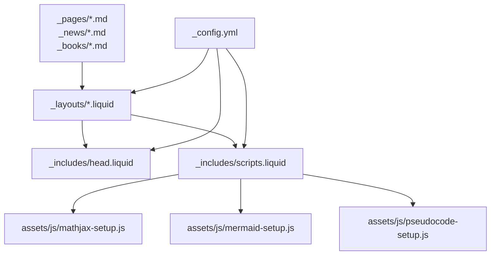
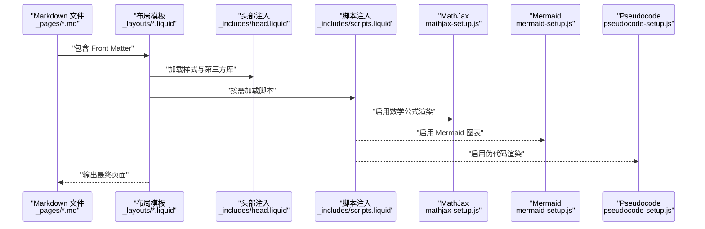
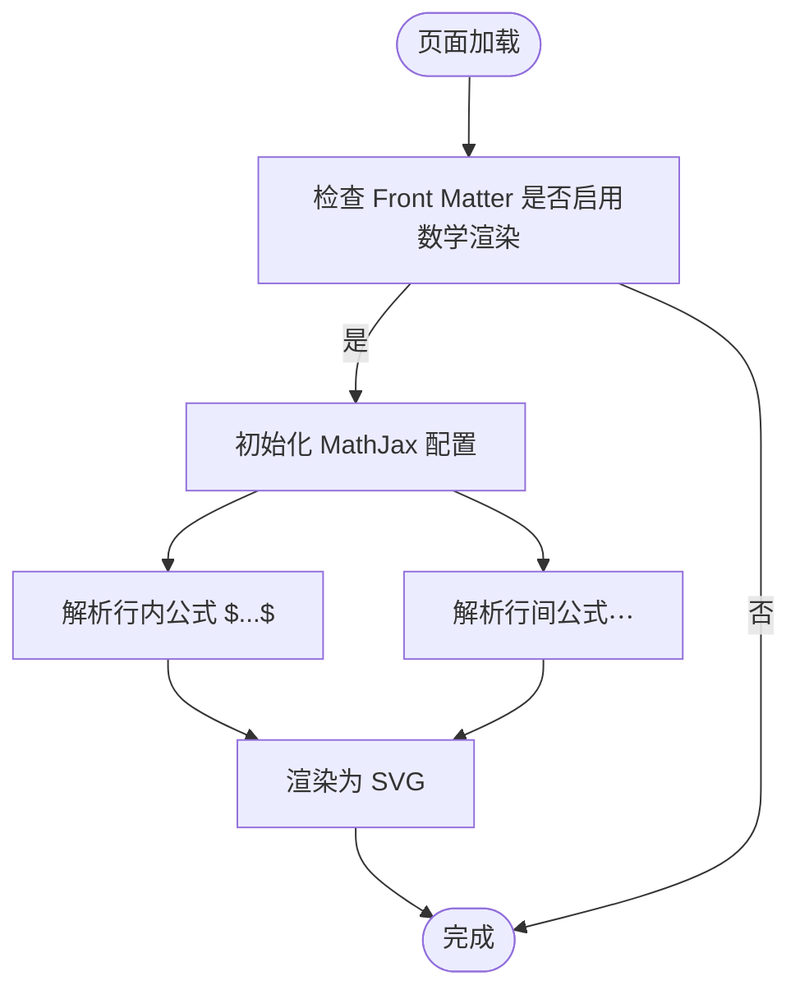
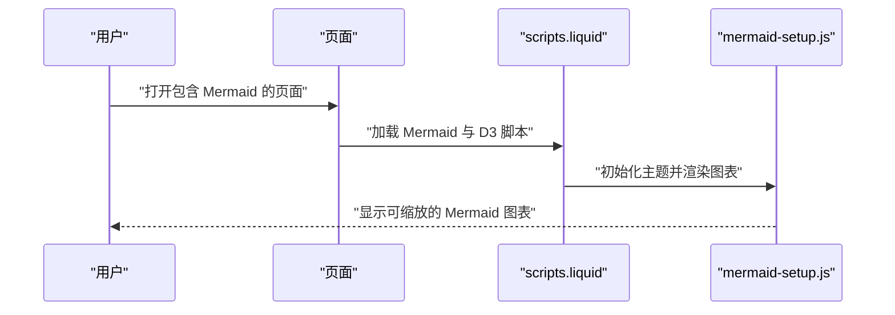
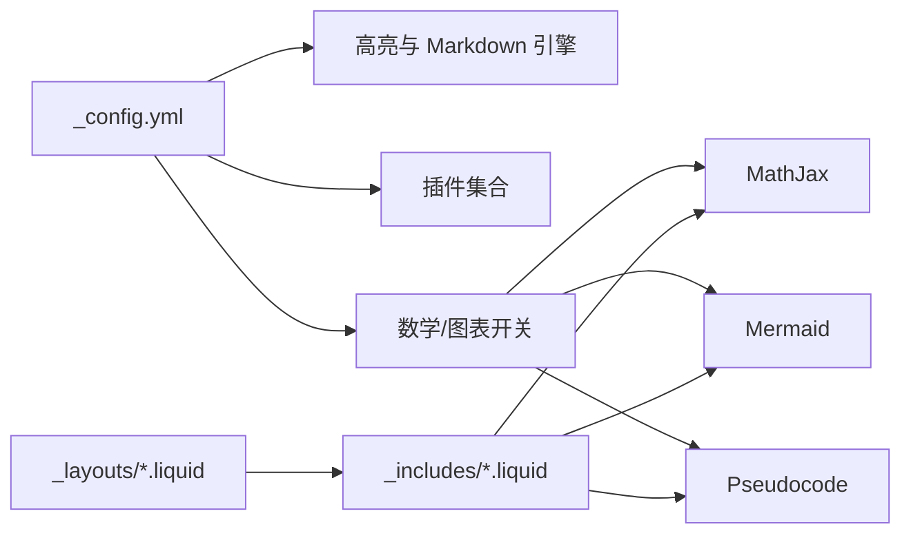

# Markdown内容编写规范

<cite>
**本文引用的文件**
- [_config.yml](file://_config.yml)
- [README.md](file://README.md)
- [INSTALL.md](file://INSTALL.md)
- [QUICKSTART.md](file://QUICKSTART.md)
- [FAQ.md](file://FAQ.md)
- [_pages/about.md](file://_pages/about.md)
- [_news/announcement_1.md](file://_news/announcement_1.md)
- [_books/the_godfather.md](file://_books/the_godfather.md)
- [_includes/head.liquid](file://_includes/head.liquid)
- [_includes/scripts.liquid](file://_includes/scripts.liquid)
- [assets/js/mathjax-setup.js](file://assets/js/mathjax-setup.js)
- [assets/js/mermaid-setup.js](file://assets/js/mermaid-setup.js)
- [assets/js/pseudocode-setup.js](file://assets/js/pseudocode-setup.js)
- [_layouts/post.liquid](file://_layouts/post.liquid)
- [_layouts/page.liquid](file://_layouts/page.liquid)
</cite>

## 目录
1. [简介](#简介)
2. [项目结构](#项目结构)
3. [核心组件](#核心组件)
4. [架构总览](#架构总览)
5. [详细组件分析](#详细组件分析)
6. [依赖关系分析](#依赖关系分析)
7. [性能考量](#性能考量)
8. [故障排查指南](#故障排查指南)
9. [结论](#结论)
10. [附录](#附录)

## 简介
本指南面向在 Jekyll 主题 al-folio 中编写 Markdown 内容的作者，系统讲解 Front Matter 的格式与必需字段、标题层级与列表嵌套规则、链接与图片插入标准、以及代码高亮、数学公式渲染、Mermaid 图表等高级功能的正确用法。文档结合仓库中的真实配置与示例文件，帮助你在 GitHub Pages 上稳定生成高质量静态页面。

## 项目结构
该站点基于 Jekyll，采用 Liquid 模板语言与 YAML Front Matter 驱动。Markdown 文件通常位于以下目录：
- 页面：_pages/*.md（如 about.md）
- 新闻公告：_news/*.md（如 announcement_1.md）
- 书籍书评：_books/*.md（如 the_godfather.md）
- 布局模板：_layouts/*.liquid（如 post.liquid、page.liquid）
- 头部与脚本注入：_includes/head.liquid、_includes/scripts.liquid
- 数学与图表相关脚本：assets/js/mathjax-setup.js、assets/js/mermaid-setup.js、assets/js/pseudocode-setup.js
- 全局配置：_config.yml

**图示来源**
- [_pages/about.md](file://_pages/about.md)
- [_news/announcement_1.md](file://_news/announcement_1.md)
- [_books/the_godfather.md](file://_books/the_godfather.md)
- [_layouts/post.liquid](file://_layouts/post.liquid)
- [_layouts/page.liquid](file://_layouts/page.liquid)
- [_includes/head.liquid](file://_includes/head.liquid)
- [_includes/scripts.liquid](file://_includes/scripts.liquid)
- [_config.yml](file://_config.yml)

**章节来源**
- [_config.yml](file://_config.yml)
- [_pages/about.md](file://_pages/about.md)
- [_news/announcement_1.md](file://_news/announcement_1.md)
- [_books/the_godfather.md](file://_books/the_godfather.md)
- [_layouts/post.liquid](file://_layouts/post.liquid)
- [_layouts/page.liquid](file://_layouts/page.liquid)
- [_includes/head.liquid](file://_includes/head.liquid)
- [_includes/scripts.liquid](file://_includes/scripts.liquid)

## 核心组件
- Front Matter：定义页面元数据（如 layout、title、permalink、lang、profile、social、announcements 等），决定页面如何渲染与展示。
- Markdown 内容：正文文本，支持表格、列表、链接、图片、代码块、数学公式、Mermaid 图等。
- 布局模板：post.liquid、page.liquid 等，负责统一页面结构与样式注入。
- 脚本与配置：MathJax、Mermaid、Pseudocode 等脚本在 scripts.liquid 中按需加载，并通过 _config.yml 控制开关。

**章节来源**
- [_pages/about.md](file://_pages/about.md)
- [_news/announcement_1.md](file://_news/announcement_1.md)
- [_books/the_godfather.md](file://_books/the_godfather.md)
- [_layouts/post.liquid](file://_layouts/post.liquid)
- [_layouts/page.liquid](file://_layouts/page.liquid)
- [_includes/scripts.liquid](file://_includes/scripts.liquid)
- [_config.yml](file://_config.yml)

## 架构总览
下图展示了从 Markdown 到最终页面渲染的关键流程：Front Matter 决定布局与特性；布局模板引入 CSS/JS；MathJax/Mermaid/Pseudocode 在页面加载后解析相应语法。

**图示来源**
- [_layouts/post.liquid](file://_layouts/post.liquid)
- [_layouts/page.liquid](file://_layouts/page.liquid)
- [_includes/head.liquid](file://_includes/head.liquid)
- [_includes/scripts.liquid](file://_includes/scripts.liquid)
- [assets/js/mathjax-setup.js](file://assets/js/mathjax-setup.js)
- [assets/js/mermaid-setup.js](file://assets/js/mermaid-setup.js)
- [assets/js/pseudocode-setup.js](file://assets/js/pseudocode-setup.js)

## 详细组件分析

### Front Matter 规范与必需字段
- 必需字段
  - layout：指定页面使用的布局（如 about、post、page）。
  - title：页面标题。
  - permalink：自定义链接路径（如根路径 /）。
- 常用字段
  - lang：语言代码（如 en）。
  - subtitle：副标题或简介。
  - profile：头像、对齐方式、更多信息等。
  - social：是否显示社交信息。
  - announcements：公告模块开关与滚动/数量限制。
  - latest_posts：最新文章模块开关与滚动/数量限制。
  - date：新闻公告的时间戳。
  - inline：公告是否内联显示。
  - related_posts：是否显示相关文章。
  - author、tags、categories：文章作者、标签、分类。
  - cover、isbn、olid、buy_link、stars、status 等：书籍书评相关字段。
- 示例参考
  - 页面示例：[_pages/about.md](file://_pages/about.md)
  - 新闻公告示例：[_news/announcement_1.md](file://_news/announcement_1.md)
  - 书籍书评示例：[_books/the_godfather.md](file://_books/the_godfather.md)

**章节来源**
- [_pages/about.md](file://_pages/about.md)
- [_news/announcement_1.md](file://_news/announcement_1.md)
- [_books/the_godfather.md](file://_books/the_godfather.md)

### 标题层级与列表嵌套规则
- 标题层级
  - 使用 #、##、### ... 表示一级到多级标题，建议遵循“单一主标题 + 递进子标题”的结构。
  - 避免跳跃式降级（例如从一级直接跳到三级）。
- 列表嵌套
  - 有序与无序列表可混合嵌套，缩进保持一致。
  - 嵌套段落建议使用空行分隔，提升可读性。
- 注意事项
  - 避免在标题中使用未转义的特殊字符（如反斜杠、美元符号等），以免与渲染引擎冲突。

**章节来源**
- [_pages/about.md](file://_pages/about.md)
- [_news/announcement_1.md](file://_news/announcement_1.md)
- [_books/the_godfather.md](file://_books/the_godfather.md)

### 链接与图片插入标准
- 链接
  - 内部链接：使用相对路径或 permalink，确保在部署后仍有效。
  - 外部链接：添加 rel、target 等属性以符合安全策略。
- 图片
  - 推荐使用 assets/img 下的资源路径，配合懒加载与响应式图片设置。
  - 插入时注意 alt 文本，便于无障碍访问与 SEO。
- 参考
  - 配置中启用了外部链接属性与懒加载图片，详见 [_config.yml](file://_config.yml) 与 [_includes/head.liquid](file://_includes/head.liquid)。

**章节来源**
- [_config.yml](file://_config.yml)
- [_includes/head.liquid](file://_includes/head.liquid)

### 表格、代码块与列表
- 表格
  - 使用标准 Markdown 表格语法，列宽可通过 CSS 控制。
  - 若需要更丰富的表格交互，可在页面 Front Matter 中开启相关特性。
- 代码块
  - 使用三反引号包裹语言标识（如 mermaid、pseudocode、javascript 等），由对应脚本处理。
  - 代码高亮由 Rouge 与 GitHub 风格主题提供，详见 [_config.yml](file://_config.yml)。
- 列表
  - 严格保持缩进，避免混用空格与制表符。
  - 嵌套列表时，子项与父项保持一致的缩进步长。

**章节来源**
- [_config.yml](file://_config.yml)
- [_includes/scripts.liquid](file://_includes/scripts.liquid)

### 数学公式渲染（MathJax）
- 启用方式
  - 在 _config.yml 中启用数学渲染（enable_math: true）。
  - 页面中使用行内公式 $...$ 或行间公式 $$...$$。
- 渲染行为
  - MathJax 初始化脚本在 assets/js/mathjax-setup.js 中配置，支持 AMS 标签与动态样式注入。
- 注意事项
  - 避免与 LaTeX 特殊字符冲突；必要时进行转义。
  - 若使用伪代码渲染，将自动切换到伪代码模式。

**图示来源**
- [_config.yml](file://_config.yml)
- [assets/js/mathjax-setup.js](file://assets/js/mathjax-setup.js)
- [_includes/scripts.liquid](file://_includes/scripts.liquid)

**章节来源**
- [_config.yml](file://_config.yml)
- [assets/js/mathjax-setup.js](file://assets/js/mathjax-setup.js)
- [_includes/scripts.liquid](file://_includes/scripts.liquid)

### Mermaid 图表
- 启用方式
  - 在页面 Front Matter 中声明 mermaid: { enabled: true }，并按需开启 zoomable。
  - 脚本在 _includes/scripts.liquid 中按需加载，并在页面加载完成后初始化。
- 使用要点
  - 代码块语言标识为 mermaid，图表会替换原始代码块。
  - 支持 D3 缩放（当启用 zoomable 时）。
- 常见问题
  - 若图表不显示，请确认 Front Matter 开关与脚本加载顺序。

**图示来源**
- [_includes/scripts.liquid](file://_includes/scripts.liquid)
- [assets/js/mermaid-setup.js](file://assets/js/mermaid-setup.js)

**章节来源**
- [_includes/scripts.liquid](file://_includes/scripts.liquid)
- [assets/js/mermaid-setup.js](file://assets/js/mermaid-setup.js)

### 伪代码渲染（Pseudocode）
- 启用方式
  - 当页面包含伪代码时，MathJax 将切换到伪代码模式，使用专门的渲染器。
- 使用要点
  - 代码块语言标识为 pseudocode，渲染后以可视化伪代码呈现。
- 注意事项
  - 与数学公式共存时，行内/行间公式语法与 MathJax 配置保持一致。

**章节来源**
- [assets/js/pseudocode-setup.js](file://assets/js/pseudocode-setup.js)
- [_includes/scripts.liquid](file://_includes/scripts.liquid)

### 布局与页面结构
- post.liquid
  - 用于博客文章页，支持目录（toc）、标签/分类链接、相关文章、评论区等。
- page.liquid
  - 用于普通页面，支持描述与引用区域。
- head.liquid 与 scripts.liquid
  - 统一注入样式与脚本，按页面特性选择性加载第三方库。

**章节来源**
- [_layouts/post.liquid](file://_layouts/post.liquid)
- [_layouts/page.liquid](file://_layouts/page.liquid)
- [_includes/head.liquid](file://_includes/head.liquid)
- [_includes/scripts.liquid](file://_includes/scripts.liquid)

## 依赖关系分析
- 配置驱动
  - _config.yml 控制 Markdown 引擎、高亮、插件、数学与图表开关等。
- 模板耦合
  - 布局模板依赖 _includes 注入的样式与脚本，实现统一外观与交互。
- 功能解耦
  - MathJax、Mermaid、Pseudocode 通过条件加载，避免对非目标页面产生额外开销。

**图示来源**
- [_config.yml](file://_config.yml)
- [_layouts/post.liquid](file://_layouts/post.liquid)
- [_layouts/page.liquid](file://_layouts/page.liquid)
- [_includes/head.liquid](file://_includes/head.liquid)
- [_includes/scripts.liquid](file://_includes/scripts.liquid)

**章节来源**
- [_config.yml](file://_config.yml)
- [_layouts/post.liquid](file://_layouts/post.liquid)
- [_layouts/page.liquid](file://_layouts/page.liquid)
- [_includes/head.liquid](file://_includes/head.liquid)
- [_includes/scripts.liquid](file://_includes/scripts.liquid)

## 性能考量
- 资源按需加载：scripts.liquid 仅在页面声明相应特性时加载对应库，减少首屏负担。
- 懒加载图片：启用懒加载可降低初始带宽占用。
- CSS 压缩与缓存：构建产物经压缩与缓存控制，提升加载速度。
- 代码高亮：Rouge 提供轻量级本地高亮，避免额外网络请求。

**章节来源**
- [_config.yml](file://_config.yml)
- [_includes/head.liquid](file://_includes/head.liquid)
- [_includes/scripts.liquid](file://_includes/scripts.liquid)

## 故障排查指南
- 部署后 CSS/JS 加载失败
  - 检查 _config.yml 中 url 与 baseurl 设置，确保与 GitHub Pages 分支配置一致。
  - 参考 FAQ 中的相关说明。
- 无法显示 Mermaid 图表
  - 确认页面 Front Matter 中已启用 mermaid，并检查脚本加载顺序。
- 数学公式不渲染
  - 确认 _config.yml 中启用数学渲染，且公式语法正确。
- 相关文章计算异常
  - 若出现 Zero vector 或 sqrt 错误，检查文章内容长度与词汇质量，或禁用相关功能。

**章节来源**
- [FAQ.md](file://FAQ.md)
- [_config.yml](file://_config.yml)
- [_includes/scripts.liquid](file://_includes/scripts.liquid)

## 结论
通过规范的 Front Matter 字段、严谨的标题与列表书写、以及对数学公式、Mermaid 图表与伪代码的正确使用，你可以在 al-folio 主题中高效产出专业级内容。结合按需加载与懒加载策略，可进一步优化页面性能与用户体验。

## 附录
- 快速开始：参考 QUICKSTART.md 完成基础配置与预览。
- 安装与部署：参考 INSTALL.md 了解本地开发与 GitHub Pages 部署流程。
- 主题特性概览：参考 README.md 了解主题能力与示例。

**章节来源**
- [QUICKSTART.md](file://QUICKSTART.md)
- [INSTALL.md](file://INSTALL.md)
- [README.md](file://README.md)