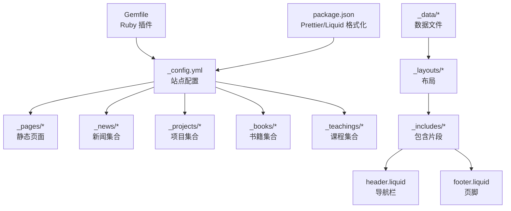
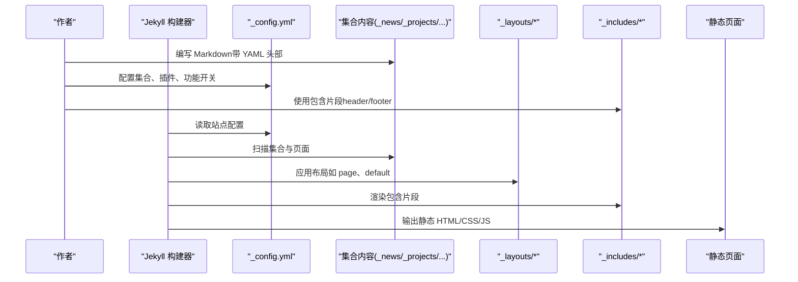
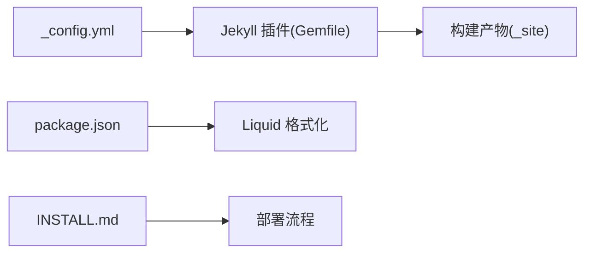

# 内容管理系统

<cite>
**本文引用的文件**
- [_config.yml](file://_config.yml)
- [Gemfile](file://Gemfile)
- [package.json](file://package.json)
- [INSTALL.md](file://INSTALL.md)
- [README.md](file://README.md)
- [_data/navigation.yml](file://_data/navigation.yml)
- [_data/cv.yml](file://_data/cv.yml)
- [_layouts/default.liquid](file://_layouts/default.liquid)
- [_layouts/page.liquid](file://_layouts/page.liquid)
- [_includes/header.liquid](file://_includes/header.liquid)
- [_includes/footer.liquid](file://_includes/footer.liquid)
- [_pages/about.md](file://_pages/about.md)
- [_news/announcement_1.md](file://_news/announcement_1.md)
- [_projects/1_project.md](file://_projects/1_project.md)
- [_books/the_godfather.md](file://_books/the_godfather.md)
</cite>

## 目录
1. [简介](#简介)
2. [项目结构](#项目结构)
3. [核心组件](#核心组件)
4. [架构总览](#架构总览)
5. [详细组件分析](#详细组件分析)
6. [依赖关系分析](#依赖关系分析)
7. [性能与可维护性](#性能与可维护性)
8. [故障排查指南](#故障排查指南)
9. [结论](#结论)
10. [附录](#附录)

## 简介
本文件为内容管理系统（基于 Jekyll + Liquid 模板）的综合文档，面向需要搭建学术型或个人主页的用户。内容覆盖页面结构、Markdown 内容编写、数据文件管理、Jekyll Collections 的概念与使用、Liquid 模板基础语法、Markdown 写作规范、数据文件（YAML/JSON）结构与用途、内容组织最佳实践与 SEO 优化建议，以及常见问题解决方案。

## 项目结构
该站点采用 Jekyll 标准目录结构，结合 al-folio 主题进行定制化扩展。关键目录与职责如下：
- 根配置：_config.yml 定义站点元信息、集合、插件、搜索、分析、数学公式、图片懒加载等全局设置
- 页面与集合：_pages 存放静态页面；_news、_projects、_books、_teachings 等为自定义集合，用于组织新闻、项目、书籍、课程等内容
- 数据：_data 下存放导航、简历、社交、仓库等数据文件，支持多语言
- 布局与包含：_layouts 提供页面骨架与具体布局；_includes 提供头部、页脚、导航、评论等可复用片段
- 插件与脚本：_plugins 放置 Ruby 插件；_scripts 放置前端脚本；Gemfile 与 package.json 管理依赖
- 资源：assets 下存放样式、字体、媒体资源等

图表来源
- [_config.yml:142-152](file://_config.yml#L142-L152)
- [_pages/about.md:1-39](file://_pages/about.md#L1-L39)
- [_news/announcement_1.md:1-9](file://_news/announcement_1.md#L1-L9)
- [_projects/1_project.md:1-21](file://_projects/1_project.md#L1-L21)
- [_books/the_godfather.md:1-29](file://_books/the_godfather.md#L1-L29)
- [_layouts/default.liquid:1-57](file://_layouts/default.liquid#L1-L57)
- [_layouts/page.liquid:1-32](file://_layouts/page.liquid#L1-L32)
- [_includes/header.liquid:1-108](file://_includes/header.liquid#L1-L108)
- [_includes/footer.liquid:1-31](file://_includes/footer.liquid#L1-L31)
- [Gemfile:1-42](file://Gemfile#L1-L42)
- [package.json:1-7](file://package.json#L1-L7)

章节来源
- [_config.yml:142-152](file://_config.yml#L142-L152)
- [_pages/about.md:1-39](file://_pages/about.md#L1-L39)
- [_news/announcement_1.md:1-9](file://_news/announcement_1.md#L1-L9)
- [_projects/1_project.md:1-21](file://_projects/1_project.md#L1-L21)
- [_books/the_godfather.md:1-29](file://_books/the_godfather.md#L1-L29)
- [_layouts/default.liquid:1-57](file://_layouts/default.liquid#L1-L57)
- [_layouts/page.liquid:1-32](file://_layouts/page.liquid#L1-L32)
- [_includes/header.liquid:1-108](file://_includes/header.liquid#L1-L108)
- [_includes/footer.liquid:1-31](file://_includes/footer.liquid#L1-L31)
- [Gemfile:1-42](file://Gemfile#L1-L42)
- [package.json:1-7](file://package.json#L1-L7)

## 核心组件
- 配置中心：_config.yml 统一管理站点标题、语言、URL、集合、插件、搜索、分析、数学与懒加载等
- 数据层：_data 下的 YAML/JSON 文件（如 navigation.yml、cv.yml）承载导航、简历、社交等数据
- 布局层：_layouts 提供 default、page 等布局，控制页面骨架与内容渲染
- 包含层：_includes 提供 header、footer、导航、评论等可复用片段
- 内容层：_pages、_news、_projects、_books、_teachings 等集合中的 Markdown 文档
- 插件生态：Gemfile 中声明的 Jekyll 插件（如 jekyll-scholar、jekyll-feed、jekyll-sitemap 等）
- 开发工具：package.json 中的 Prettier 与 Liquid 格式化工具

章节来源
- [_config.yml:1-656](file://_config.yml#L1-L656)
- [_data/navigation.yml:1-24](file://_data/navigation.yml#L1-L24)
- [_data/cv.yml:1-95](file://_data/cv.yml#L1-L95)
- [_layouts/default.liquid:1-57](file://_layouts/default.liquid#L1-L57)
- [_layouts/page.liquid:1-32](file://_layouts/page.liquid#L1-L32)
- [_includes/header.liquid:1-108](file://_includes/header.liquid#L1-L108)
- [_includes/footer.liquid:1-31](file://_includes/footer.liquid#L1-L31)
- [Gemfile:1-42](file://Gemfile#L1-L42)
- [package.json:1-7](file://package.json#L1-L7)

## 架构总览
下图展示从内容到页面生成的关键流程：Jekyll 读取 _config.yml 与集合内容，应用布局与包含片段，渲染最终静态页面；数据文件通过 Liquid 注入到页面中。

图表来源
- [_config.yml:142-152](file://_config.yml#L142-L152)
- [_layouts/page.liquid:1-32](file://_layouts/page.liquid#L1-L32)
- [_layouts/default.liquid:1-57](file://_layouts/default.liquid#L1-L57)
- [_includes/header.liquid:1-108](file://_includes/header.liquid#L1-L108)
- [_includes/footer.liquid:1-31](file://_includes/footer.liquid#L1-L31)
- [_news/announcement_1.md:1-9](file://_news/announcement_1.md#L1-L9)
- [_projects/1_project.md:1-21](file://_projects/1_project.md#L1-L21)

## 详细组件分析

### Jekyll Collections 概念与使用
- 概念：Collections 是 Jekyll 的内容容器，允许按类型组织内容（如 news、projects、books、teachings），每个集合可独立输出为页面。
- 配置：在 _config.yml 中声明集合及其默认布局、是否输出页面等。
- 典型集合：
  - news：用于发布新闻公告，适合 inline 展示与相关文章关闭
  - projects：用于展示项目，支持分类、重要性、图片等字段
  - books：用于书籍书评，支持评分、阅读状态、标签等字段
  - teachings：用于课程资料
- 使用建议：
  - 为集合创建专用布局（如 post、page），并在 YAML 头部指定
  - 合理使用 category、importance、img 等字段进行排序与筛选
  - 通过 include 或循环在页面中聚合集合内容

章节来源
- [_config.yml:145-151](file://_config.yml#L145-L151)
- [_news/announcement_1.md:1-9](file://_news/announcement_1.md#L1-L9)
- [_projects/1_project.md:1-21](file://_projects/1_project.md#L1-L21)
- [_books/the_godfather.md:1-29](file://_books/the_godfather.md#L1-L29)

### Liquid 模板语言基础
- 变量与过滤器：通过 site、page、layout 等上下文访问数据；使用过滤器处理日期、链接、字符串等
- 控制结构：for 循环、if/else 判断、case/when 分支
- 包含片段：使用 include 引入 _includes 下的片段（如 header、footer、scripts）
- 数据注入：_data 下的 YAML/JSON 文件可通过 site.data.* 访问
- 示例要点：
  - 导航栏：根据当前语言从 _data/navigation.yml 动态生成菜单项
  - 页脚：动态拼接版权与最后更新时间
  - 布局：default 布局中根据页面配置决定侧边栏与目录显示

章节来源
- [_includes/header.liquid:1-108](file://_includes/header.liquid#L1-L108)
- [_includes/footer.liquid:1-31](file://_includes/footer.liquid#L1-L31)
- [_layouts/default.liquid:1-57](file://_layouts/default.liquid#L1-L57)
- [_layouts/page.liquid:1-32](file://_layouts/page.liquid#L1-L32)
- [_data/navigation.yml:1-24](file://_data/navigation.yml#L1-L24)

### Markdown 写作规范
- 标题层级：使用 #、##、### 表示主标题、副标题、小节标题，保持层级清晰
- 列表：有序与无序列表配合缩进，避免过深嵌套
- 链接：优先使用相对链接；对外链接添加 rel、target 等属性（由插件统一处理）
- 图片：建议使用 assets/img 下的路径；启用懒加载以提升性能
- 代码块：指定语言以便高亮；长代码建议折叠或分段
- 数学公式：启用 MathJax 后可用行内与块级公式语法
- 任务清单：用于进度跟踪与待办事项
- 注意：避免在 Markdown 中直接写 HTML 样式，尽量通过布局与样式文件控制

章节来源
- [_config.yml:389-390](file://_config.yml#L389-L390)
- [_config.yml:374-375](file://_config.yml#L374-L375)

### 数据文件结构与用途
- navigation.yml：多语言导航菜单，包含标题与链接
- cv.yml：简历数据，包含基本信息、教育背景、经历、发表论文、奖项、技能、语言、兴趣等
- 其他数据文件：如 socials.yml、repositories.yml、venues.yml 等，用于社交链接、仓库统计、会议地点等
- 使用方式：在 Liquid 中通过 site.data.<文件名> 访问，实现导航、简历、社交等模块的动态渲染

章节来源
- [_data/navigation.yml:1-24](file://_data/navigation.yml#L1-L24)
- [_data/cv.yml:1-95](file://_data/cv.yml#L1-L95)

### 页面与布局组织
- 页面文件：_pages 下的 Markdown 文件（如 about.md）通过 YAML 头部指定布局、永久链接、语言等
- 布局文件：default.liquid 作为通用骨架，page.liquid 用于普通页面内容渲染
- 包含片段：header.liquid 生成导航栏与搜索、主题切换、语言切换；footer.liquid 生成页脚与版权信息
- 评论与目录：根据页面配置决定是否启用 Giscus 评论与目录侧边栏

章节来源
- [_pages/about.md:1-39](file://_pages/about.md#L1-L39)
- [_layouts/default.liquid:1-57](file://_layouts/default.liquid#L1-L57)
- [_layouts/page.liquid:1-32](file://_layouts/page.liquid#L1-L32)
- [_includes/header.liquid:1-108](file://_includes/header.liquid#L1-L108)
- [_includes/footer.liquid:1-31](file://_includes/footer.liquid#L1-L31)

### 内容组织最佳实践
- 结构化命名：集合内容使用语义化文件名，如 announcement_1.md、1_project.md
- YAML 头部标准化：为每类内容定义一致的 front matter 字段（如 title、description、img、category、date 等）
- 多语言支持：在 _data/navigation.yml 中维护中英文导航；页面通过 lang 字段切换
- 分类与标签：利用 category、tags 等字段便于筛选与归档
- 性能优先：启用懒加载与响应式图片；合理使用目录与侧边栏，避免冗余渲染

章节来源
- [_data/navigation.yml:1-24](file://_data/navigation.yml#L1-L24)
- [_news/announcement_1.md:1-9](file://_news/announcement_1.md#L1-L9)
- [_projects/1_project.md:1-21](file://_projects/1_project.md#L1-L21)
- [_books/the_godfather.md:1-29](file://_books/the_godfather.md#L1-L29)

### SEO 优化建议
- 元信息：在 _config.yml 中设置 title、description、keywords、url、baseurl
- 社交预览：可选开启 Open Graph 与 Schema.org（需配置 og_image 等）
- 站点地图与订阅：启用 jekyll-sitemap 与 jekyll-feed
- 链接属性：外部链接自动添加 rel、target 等属性，提升安全性与可访问性
- 结构化数据：简历与出版物可借助数据文件与布局生成结构化展示

章节来源
- [_config.yml:66-72](file://_config.yml#L66-L72)
- [_config.yml:106-121](file://_config.yml#L106-L121)
- [_config.yml:209-212](file://_config.yml#L209-L212)
- [_config.yml:339-344](file://_config.yml#L339-L344)

## 依赖关系分析
- Ruby 插件：Gemfile 声明了构建与功能插件（如 jekyll-scholar、jekyll-feed、jekyll-sitemap、jekyll-paginate-v2 等）
- 前端格式化：package.json 引入 Prettier 与 Liquid 格式化插件，保证模板一致性
- 构建与部署：INSTALL.md 提供本地开发与自动化部署流程，支持 Docker 与 GitHub Actions

图表来源
- [Gemfile:1-42](file://Gemfile#L1-L42)
- [package.json:1-7](file://package.json#L1-L7)
- [INSTALL.md:154-182](file://INSTALL.md#L154-L182)

章节来源
- [Gemfile:1-42](file://Gemfile#L1-L42)
- [package.json:1-7](file://package.json#L1-L7)
- [INSTALL.md:154-182](file://INSTALL.md#L154-L182)

## 性能与可维护性
- 图片优化：启用响应式 WebP 图像与懒加载，减少首屏加载时间
- 代码压缩：启用 jekyll-minifier 与 terser 压缩 JS/CSS
- 目录与侧边栏：仅在需要时启用目录侧边栏，避免不必要的 DOM
- 插件精简：仅启用必要插件，减少构建时间与体积
- 版本管理：通过 Gemfile 与 package.json 固定版本，确保环境一致性

章节来源
- [_config.yml:350-375](file://_config.yml#L350-L375)
- [_config.yml:233-244](file://_config.yml#L233-L244)
- [_config.yml:196-218](file://_config.yml#L196-L218)

## 故障排查指南
- 构建失败：检查 Gemfile 与 Ruby 版本；使用 Docker 一键运行，避免本地环境差异
- 自动部署未触发：确认 GitHub Actions 已启用且工作流权限为“读写”
- 本地开发：参考 INSTALL.md 的 Docker 与开发容器步骤，快速启动
- 依赖升级：遵循 INSTALL.md 的维护与升级流程，注意 keep_files 与排除规则
- 常见问题：查看 FAQ.md 与 TROUBLESHOOTING.md 获取针对性解决方案

章节来源
- [INSTALL.md:70-133](file://INSTALL.md#L70-L133)
- [INSTALL.md:174-182](file://INSTALL.md#L174-L182)
- [INSTALL.md:259-297](file://INSTALL.md#L259-L297)

## 结论
本内容管理系统以 Jekyll 为核心，结合 al-folio 主题与丰富的插件生态，提供了从内容创作到页面生成的完整链路。通过标准化的集合、数据文件与 Liquid 模板，能够高效组织学术主页、项目展示、新闻公告与书籍书评等内容。建议在实际使用中遵循本文的写作规范与最佳实践，持续优化性能与可维护性，并结合 SEO 指南提升内容可见度。

## 附录
- 快速开始：参考 QUICKSTART.md 与 INSTALL.md 的本地与部署步骤
- 定制化：参考 CUSTOMIZE.md 进行主题、数据与功能的个性化配置
- 社区与文档：README.md 提供社区示例与功能概览，便于快速上手

章节来源
- [README.md:294-320](file://README.md#L294-L320)
- [INSTALL.md:1-297](file://INSTALL.md#L1-L297)