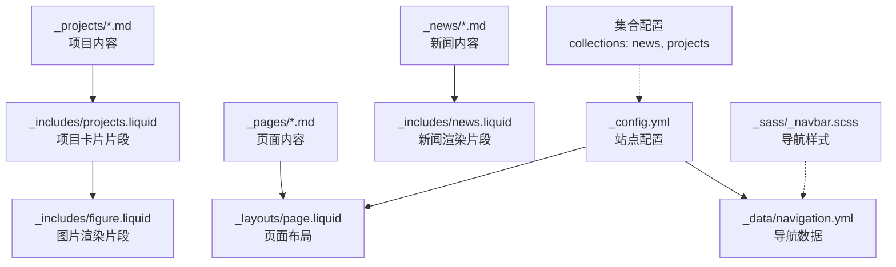
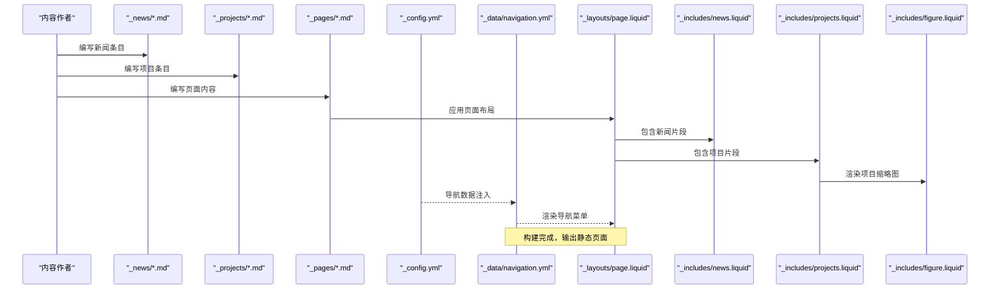
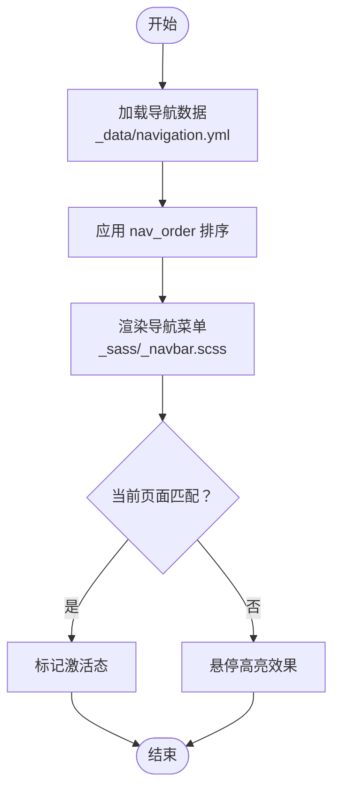
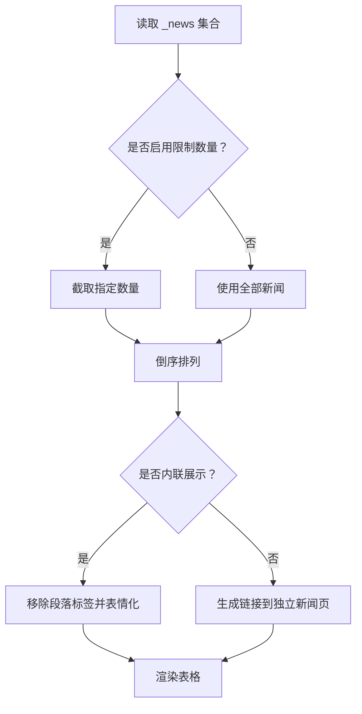
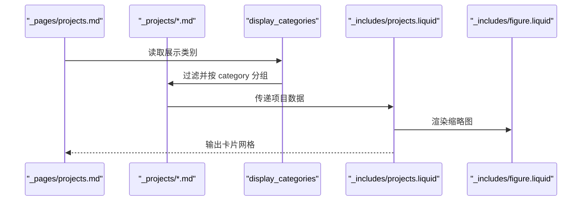
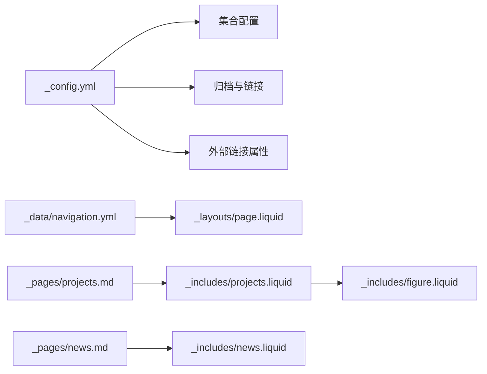

# 内容组织和分类

<cite>
**本文引用的文件**
- [_config.yml](file://_config.yml)
- [_data/navigation.yml](file://_data/navigation.yml)
- [_layouts/page.liquid](file://_layouts/page.liquid)
- [_includes/news.liquid](file://_includes/news.liquid)
- [_includes/projects.liquid](file://_includes/projects.liquid)
- [_includes/figure.liquid](file://_includes/figure.liquid)
- [_sass/_navbar.scss](file://_sass/_navbar.scss)
- [_pages/about.md](file://_pages/about.md)
- [_pages/news.md](file://_pages/news.md)
- [_pages/projects.md](file://_pages/projects.md)
- [_pages/publications.md](file://_pages/publications.md)
- [_pages/cv.md](file://_pages/cv.md)
- [_pages/competitions.md](file://_pages/competitions.md)
- [_news/announcement_1.md](file://_news/announcement_1.md)
- [_projects/1_project.md](file://_projects/1_project.md)
</cite>

## 目录
1. [简介](#简介)
2. [项目结构](#项目结构)
3. [核心组件](#核心组件)
4. [架构总览](#架构总览)
5. [详细组件分析](#详细组件分析)
6. [依赖关系分析](#依赖关系分析)
7. [性能考虑](#性能考虑)
8. [故障排查指南](#故障排查指南)
9. [结论](#结论)
10. [附录](#附录)

## 简介
本指南面向使用 Jekyll（al-folio 主题）构建个人或学术主页的团队与个人，围绕“内容组织与分类”主题，系统阐述页面分类、项目归类、新闻分组策略；导航菜单配置与多级菜单实现；URL 结构设计与 SEO 友好路径规划；内容更新流程与版本管理最佳实践；以及内容审核、草稿发布、内容迁移等高级功能的使用方法。文档同时提供可落地的组织架构示例与维护策略，帮助读者在不牺牲可维护性的前提下，持续产出高质量内容。

## 项目结构
该站点采用 Jekyll 的标准目录组织方式，结合 al-folio 主题特性，形成清晰的内容与布局分离：
- 配置层：通过站点配置文件统一控制主题行为、集合、链接属性、分析与搜索等全局设置
- 数据层：导航菜单等静态数据集中于 _data 目录
- 布局层：页面与文章共用布局模板，通过 front matter 控制页面行为
- 内容层：页面、新闻、项目、教学资料等分别存放于对应集合目录
- 资源层：样式、脚本、媒体资源按功能模块组织

图表来源
- [_config.yml](file://_config.yml)
- [_data/navigation.yml](file://_data/navigation.yml)
- [_layouts/page.liquid](file://_layouts/page.liquid)
- [_includes/news.liquid](file://_includes/news.liquid)
- [_includes/projects.liquid](file://_includes/projects.liquid)
- [_includes/figure.liquid](file://_includes/figure.liquid)
- [_sass/_navbar.scss](file://_sass/_navbar.scss)

章节来源
- [_config.yml](file://_config.yml)
- [_data/navigation.yml](file://_data/navigation.yml)
- [_layouts/page.liquid](file://_layouts/page.liquid)

## 核心组件
- 导航菜单
  - 多语言导航由 _data/navigation.yml 提供，支持中英文双语菜单项与路径
  - 导航项通过 nav 与 nav_order 控制显示顺序与可见性
- 页面与布局
  - 页面通过 front matter 指定布局、标题、永久链接与描述
  - 页面布局模板负责标题、描述、内容区与评论区等通用结构
- 新闻与公告
  - 新闻集合通过 _news 目录管理，使用 _includes/news.liquid 渲染表格化列表
  - 支持限制展示数量、滚动容器与内联/链接两种展示模式
- 项目与作品集
  - 项目集合通过 _projects 目录管理，支持按类别分组与重要度排序
  - 使用 _includes/projects.liquid 生成卡片式展示，支持 GitHub 仓库图标与星数
- 图片与媒体
  - 统一通过 _includes/figure.liquid 渲染，支持响应式 WebP 缩略图与懒加载
- URL 与 SEO
  - 通过 _config.yml 中的 permalink、jekyll-archives 与 jekyll-sitemap 插件生成结构化路径与站点地图
  - 支持外部链接 rel、target 等安全属性配置

章节来源
- [_data/navigation.yml](file://_data/navigation.yml)
- [_pages/about.md](file://_pages/about.md)
- [_pages/news.md](file://_pages/news.md)
- [_pages/projects.md](file://_pages/projects.md)
- [_includes/news.liquid](file://_includes/news.liquid)
- [_includes/projects.liquid](file://_includes/projects.liquid)
- [_includes/figure.liquid](file://_includes/figure.liquid)
- [_layouts/page.liquid](file://_layouts/page.liquid)
- [_config.yml](file://_config.yml)

## 架构总览
下图展示了从内容到呈现的整体流程：内容作者在集合目录编写内容，Jekyll 在构建时读取配置与数据，调用相应布局与包含片段进行渲染，最终输出静态页面。

图表来源
- [_pages/news.md](file://_pages/news.md)
- [_pages/projects.md](file://_pages/projects.md)
- [_layouts/page.liquid](file://_layouts/page.liquid)
- [_includes/news.liquid](file://_includes/news.liquid)
- [_includes/projects.liquid](file://_includes/projects.liquid)
- [_includes/figure.liquid](file://_includes/figure.liquid)
- [_data/navigation.yml](file://_data/navigation.yml)
- [_config.yml](file://_config.yml)

## 详细组件分析

### 页面分类与导航菜单
- 导航数据
  - 英文与中文两套导航项，每项包含标题与 URL
  - 通过 nav 与 nav_order 控制页面在导航中的出现与顺序
- 导航样式
  - 导航栏样式由 _sass/_navbar.scss 定义，支持悬停、激活态与品牌社交图标
- 实践建议
  - 将常用页面（如关于、论文、项目、CV、竞赛）纳入导航
  - 使用 nav_order 对页面进行稳定排序，避免每次构建顺序变化
  - 为多语言站点维护双语导航，确保路径一致性

图表来源
- [_data/navigation.yml](file://_data/navigation.yml)
- [_sass/_navbar.scss](file://_sass/_navbar.scss)

章节来源
- [_data/navigation.yml](file://_data/navigation.yml)
- [_sass/_navbar.scss](file://_sass/_navbar.scss)

### 新闻分组与展示
- 集合与布局
  - 新闻集合在 _config.yml 中声明，布局默认为 post
  - 页面通过 _pages/news.md 引入新闻片段
- 展示逻辑
  - _includes/news.liquid 支持倒序展示、限制数量、滚动容器与内联/链接两种模式
  - 支持 inline 字段用于首页公告的内联展示
- 实践建议
  - 使用 inline 作为首页公告，使用独立页面承载完整新闻列表
  - 为重要事件设置固定日期，便于时间线展示与 SEO

图表来源
- [_pages/news.md](file://_pages/news.md)
- [_includes/news.liquid](file://_includes/news.liquid)
- [_news/announcement_1.md](file://_news/announcement_1.md)

章节来源
- [_pages/news.md](file://_pages/news.md)
- [_includes/news.liquid](file://_includes/news.liquid)
- [_news/announcement_1.md](file://_news/announcement_1.md)

### 项目归类与卡片展示
- 分类与排序
  - 项目条目通过 category 字段进行分组，通过 importance 字段排序
  - 页面可通过 display_categories 指定展示类别，支持横向/纵向卡片布局
- 卡片渲染
  - _includes/projects.liquid 生成卡片，支持 GitHub 链接与星数展示
  - 缩略图通过 _includes/figure.liquid 渲染，支持响应式 WebP 与懒加载
- 实践建议
  - 为每个项目明确 category 与 importance，确保分类与排序一致
  - 使用横向布局提升密集信息展示密度，纵向布局突出细节

图表来源
- [_pages/projects.md](file://_pages/projects.md)
- [_includes/projects.liquid](file://_includes/projects.liquid)
- [_includes/figure.liquid](file://_includes/figure.liquid)
- [_projects/1_project.md](file://_projects/1_project.md)

章节来源
- [_pages/projects.md](file://_pages/projects.md)
- [_includes/projects.liquid](file://_includes/projects.liquid)
- [_includes/figure.liquid](file://_includes/figure.liquid)
- [_projects/1_project.md](file://_projects/1_project.md)

### URL 结构设计与 SEO 友好路径
- 永久链接与归档
  - 通过 _config.yml 中的 permalink 与 jekyll-archives 插件生成博客年份/标签/分类归档路径
  - 通过 jekyll-sitemap 插件自动生成站点地图，利于搜索引擎抓取
- 外链安全
  - external_links 配置对外部链接添加 rel、target 等属性，提升安全性与可访问性
- 实践建议
  - 固定页面永久链接，避免重定向导致的 SEO 价值损失
  - 为集合页面（如项目、新闻）提供独立入口，配合归档页实现层级化信息架构

章节来源
- [_config.yml](file://_config.yml)

### 内容更新流程与版本管理
- 更新流程
  - 在对应集合目录新增/编辑内容条目，提交至版本控制系统
  - 本地预览后推送至部署分支，触发自动化构建与发布
- 版本管理
  - 使用分支策略隔离草稿与正式发布，合并前进行审查
  - 对重大变更使用标签与发布说明，便于回溯与审计
- 实践建议
  - 为草稿内容设置占位符与未发布标记，避免误发布
  - 对图片与资源进行版本化命名，减少缓存冲突

### 内容审核、草稿发布与迁移
- 审核与草稿
  - 利用集合与 front matter 字段控制可见性与排序，先在草稿集合中完成初审
  - 通过 nav 与 nav_order 控制导航可见性，正式发布后再开放导航
- 发布与迁移
  - 使用 jekyll-archives 与 jekyll-sitemap 保持历史路径稳定
  - 迁移时保留原永久链接，必要时配置重定向以保护 SEO
- 实践建议
  - 建立“草稿 → 审核 → 发布”的三阶段流程，明确责任人
  - 对跨站点迁移，导出集合数据并批量更新链接与元数据

## 依赖关系分析
- 配置驱动
  - _config.yml 是内容组织与呈现的中枢，影响集合、插件、归档、外链等全局行为
- 数据耦合
  - 导航数据与页面 front matter 紧密关联，共同决定导航呈现
- 片段复用
  - 项目与新闻卡片通过包含片段实现复用，降低维护成本
- 样式约束
  - 导航样式与布局模板相互作用，保证视觉一致性

图表来源
- [_config.yml](file://_config.yml)
- [_data/navigation.yml](file://_data/navigation.yml)
- [_layouts/page.liquid](file://_layouts/page.liquid)
- [_pages/projects.md](file://_pages/projects.md)
- [_pages/news.md](file://_pages/news.md)
- [_includes/projects.liquid](file://_includes/projects.liquid)
- [_includes/news.liquid](file://_includes/news.liquid)
- [_includes/figure.liquid](file://_includes/figure.liquid)

章节来源
- [_config.yml](file://_config.yml)
- [_data/navigation.yml](file://_data/navigation.yml)
- [_layouts/page.liquid](file://_layouts/page.liquid)

## 性能考虑
- 图片优化
  - 启用响应式 WebP 与懒加载，减少首屏体积与带宽占用
- 构建优化
  - 使用 jekyll-minifier 与 terser 压缩资源，避免重复压缩
- 导航与搜索
  - 合理控制导航项数量，避免过度嵌套导致渲染复杂度上升
- 归档与索引
  - 仅对必要集合启用归档，减少构建时间与页面体积

## 故障排查指南
- 导航不显示或顺序异常
  - 检查导航数据与页面 front matter 中的 nav/nav_order 设置
  - 确认导航样式未被覆盖或禁用
- 新闻列表为空或不显示
  - 确认集合已启用且内容文件命名与 front matter 正确
  - 检查 include 是否正确引入新闻片段
- 项目卡片缺失或图片不显示
  - 检查项目条目的 category/importance 字段与图片路径
  - 确认 _includes/figure.liquid 的路径解析与权限
- 外链安全与可访问性
  - 检查 external_links 配置是否生效，确认 rel/target 属性正确添加

章节来源
- [_data/navigation.yml](file://_data/navigation.yml)
- [_pages/news.md](file://_pages/news.md)
- [_pages/projects.md](file://_pages/projects.md)
- [_includes/news.liquid](file://_includes/news.liquid)
- [_includes/projects.liquid](file://_includes/projects.liquid)
- [_includes/figure.liquid](file://_includes/figure.liquid)
- [_config.yml](file://_config.yml)

## 结论
通过将“配置—数据—布局—内容—片段—样式”各层职责清晰分离，本项目实现了可扩展、可维护的内容组织与分类体系。遵循本文提供的策略与流程，可在不牺牲性能与 SEO 的前提下，高效地组织页面、项目与新闻，实现从草稿到发布的全生命周期管理，并为未来的迁移与扩展打下坚实基础。

## 附录
- 组织架构示例
  - 页面：关于、论文、项目、CV、竞赛、新闻等
  - 集合：新闻（_news）、项目（_projects）
  - 数据：导航（_data/navigation.yml）
  - 布局：页面布局（_layouts/page.liquid）
  - 片段：新闻（_includes/news.liquid）、项目（_includes/projects.liquid）、图片（_includes/figure.liquid）
- 维护策略
  - 建立“内容规范 + 审核流程 + 自动化校验”的闭环
  - 对图片与资源进行版本化管理，定期清理无效链接
  - 保持导航与集合的双语一致性，确保多语言体验