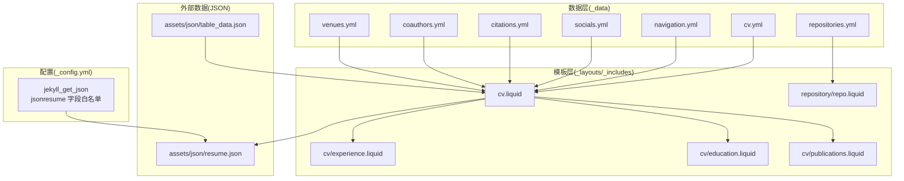
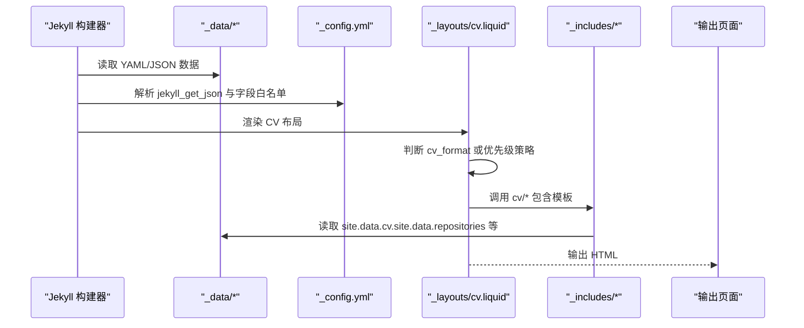
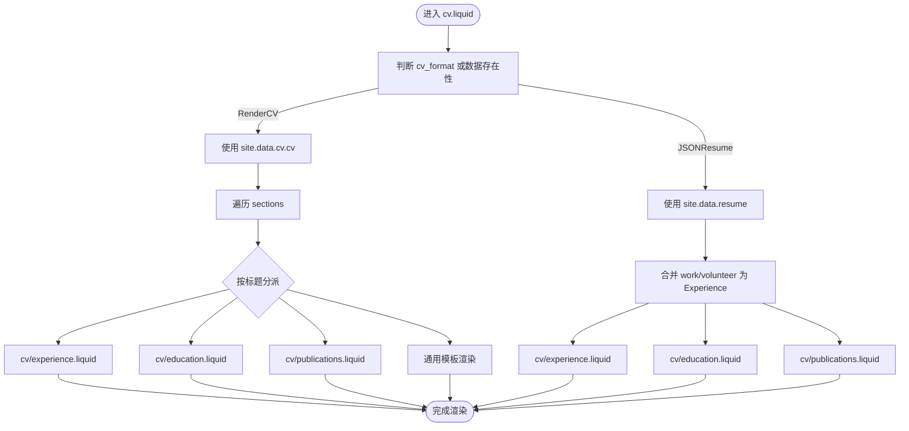
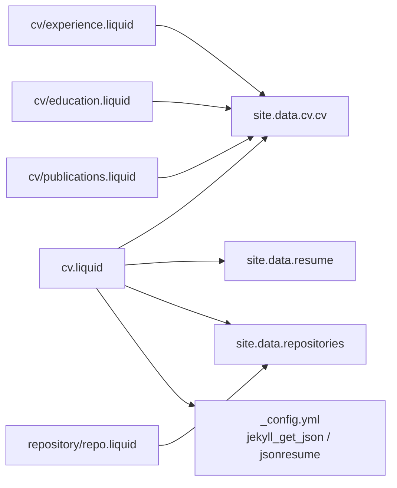

# 数据文件配置管理

<cite>
**本文引用的文件**
- [_data/cv.yml](file://_data/cv.yml)
- [_data/navigation.yml](file://_data/navigation.yml)
- [_data/socials.yml](file://_data/socials.yml)
- [_data/repositories.yml](file://_data/repositories.yml)
- [_data/citations.yml](file://_data/citations.yml)
- [_data/coauthors.yml](file://_data/coauthors.yml)
- [_data/venues.yml](file://_data/venues.yml)
- [_config.yml](file://_config.yml)
- [_layouts/cv.liquid](file://_layouts/cv.liquid)
- [_includes/cv/experience.liquid](file://_includes/cv/experience.liquid)
- [_includes/cv/education.liquid](file://_includes/cv/education.liquid)
- [_includes/cv/publications.liquid](file://_includes/cv/publications.liquid)
- [_includes/repository/repo.liquid](file://_includes/repository/repo.liquid)
- [assets/json/resume.json](file://assets/json/resume.json)
- [assets/json/table_data.json](file://assets/json/table_data.json)
</cite>

## 目录
1. [简介](#简介)
2. [项目结构](#项目结构)
3. [核心组件](#核心组件)
4. [架构总览](#架构总览)
5. [详细组件分析](#详细组件分析)
6. [依赖关系分析](#依赖关系分析)
7. [性能考量](#性能考量)
8. [故障排查指南](#故障排查指南)
9. [结论](#结论)
10. [附录](#附录)

## 简介
本文件系统性阐述该 Jekyll 站点中的“数据文件配置管理”。重点覆盖以下方面：
- YAML 与 JSON 数据文件的结构、用途与最佳实践
- 核心数据文件：cv.yml、navigation.yml、socials.yml、repositories.yml、citations.yml、coauthors.yml、venues.yml
- 数据文件在 Liquid 模板中的调用与渲染流程
- 数据模型设计原则、验证与版本管理建议
- 多语言数据处理方法与调试技巧

## 项目结构
数据文件主要位于 _data 目录，配合 _layouts 与 _includes 中的 Liquid 模板进行渲染；部分外部 JSON 数据通过配置项引入。

**图示来源**
- [_data/cv.yml:1-95](file://_data/cv.yml#L1-L95)
- [_data/navigation.yml:1-24](file://_data/navigation.yml#L1-L24)
- [_data/socials.yml:1-6](file://_data/socials.yml#L1-L6)
- [_data/repositories.yml:1-7](file://_data/repositories.yml#L1-L7)
- [_data/citations.yml:1-800](file://_data/citations.yml#L1-L800)
- [_data/coauthors.yml:1-3](file://_data/coauthors.yml#L1-L3)
- [_data/venues.yml:1-10](file://_data/venues.yml#L1-L10)
- [_config.yml:639-656](file://_config.yml#L639-L656)
- [_layouts/cv.liquid:1-393](file://_layouts/cv.liquid#L1-L393)
- [_includes/cv/experience.liquid:1-92](file://_includes/cv/experience.liquid#L1-L92)
- [_includes/cv/education.liquid:1-94](file://_includes/cv/education.liquid#L1-L94)
- [_includes/cv/publications.liquid:1-71](file://_includes/cv/publications.liquid#L1-L71)
- [_includes/repository/repo.liquid:1-48](file://_includes/repository/repo.liquid#L1-L48)
- [assets/json/resume.json:1-163](file://assets/json/resume.json#L1-L163)
- [assets/json/table_data.json:1-129](file://assets/json/table_data.json#L1-L129)

**章节来源**
- [_data/cv.yml:1-95](file://_data/cv.yml#L1-L95)
- [_data/navigation.yml:1-24](file://_data/navigation.yml#L1-L24)
- [_data/socials.yml:1-6](file://_data/socials.yml#L1-L6)
- [_data/repositories.yml:1-7](file://_data/repositories.yml#L1-L7)
- [_data/citations.yml:1-800](file://_data/citations.yml#L1-L800)
- [_data/coauthors.yml:1-3](file://_data/coauthors.yml#L1-L3)
- [_data/venues.yml:1-10](file://_data/venues.yml#L1-L10)
- [_config.yml:639-656](file://_config.yml#L639-L656)
- [_layouts/cv.liquid:1-393](file://_layouts/cv.liquid#L1-L393)
- [_includes/cv/experience.liquid:1-92](file://_includes/cv/experience.liquid#L1-L92)
- [_includes/cv/education.liquid:1-94](file://_includes/cv/education.liquid#L1-L94)
- [_includes/cv/publications.liquid:1-71](file://_includes/cv/publications.liquid#L1-L71)
- [_includes/repository/repo.liquid:1-48](file://_includes/repository/repo.liquid#L1-L48)
- [assets/json/resume.json:1-163](file://assets/json/resume.json#L1-L163)
- [assets/json/table_data.json:1-129](file://assets/json/table_data.json#L1-L129)

## 核心组件
- cv.yml：统一的 RenderCV 风格 CV 数据源，支持 sections 下多类条目（教育、经验、发表、奖项、技能、语言、兴趣、证书、参考等），并包含联系信息与地址等字段。
- navigation.yml：多语言导航菜单，键为语言代码，值为链接列表。
- socials.yml：社交账号与平台标识，如邮箱、GitHub 用户名、ORCID 等。
- repositories.yml：仓库用户列表、描述行数限制、以及空仓库列表占位。
- citations.yml：学术引用元数据与论文条目集合，包含更新时间与大量论文条目。
- coauthors.yml：用于文献作者链接的合著者映射占位。
- venues.yml：期刊/会议简称到链接与主题色的映射。
- 配置与外部 JSON：_config.yml 中定义了外部 JSON 获取与字段白名单，assets/json/resume.json 提供 JSONResume 格式数据，table_data.json 提供表格型数据。

**章节来源**
- [_data/cv.yml:1-95](file://_data/cv.yml#L1-L95)
- [_data/navigation.yml:1-24](file://_data/navigation.yml#L1-L24)
- [_data/socials.yml:1-6](file://_data/socials.yml#L1-L6)
- [_data/repositories.yml:1-7](file://_data/repositories.yml#L1-L7)
- [_data/citations.yml:1-800](file://_data/citations.yml#L1-L800)
- [_data/coauthors.yml:1-3](file://_data/coauthors.yml#L1-L3)
- [_data/venues.yml:1-10](file://_data/venues.yml#L1-L10)
- [_config.yml:639-656](file://_config.yml#L639-L656)
- [assets/json/resume.json:1-163](file://assets/json/resume.json#L1-L163)
- [assets/json/table_data.json:1-129](file://assets/json/table_data.json#L1-L129)

## 架构总览
Jekyll 在构建时读取 _data 下的 YAML/JSON 文件，生成 site.data 对象；Liquid 模板通过 site.data.* 访问这些数据，并按需渲染页面。CV 页面同时兼容 RenderCV 与 JSONResume 两种格式，通过布局逻辑选择渲染路径。

**图示来源**
- [_layouts/cv.liquid:42-57](file://_layouts/cv.liquid#L42-L57)
- [_includes/cv/experience.liquid:1-92](file://_includes/cv/experience.liquid#L1-L92)
- [_includes/cv/education.liquid:1-94](file://_includes/cv/education.liquid#L1-L94)
- [_includes/cv/publications.liquid:1-71](file://_includes/cv/publications.liquid#L1-L71)
- [_config.yml:639-656](file://_config.yml#L639-L656)

**章节来源**
- [_layouts/cv.liquid:1-393](file://_layouts/cv.liquid#L1-L393)
- [_includes/cv/experience.liquid:1-92](file://_includes/cv/experience.liquid#L1-L92)
- [_includes/cv/education.liquid:1-94](file://_includes/cv/education.liquid#L1-L94)
- [_includes/cv/publications.liquid:1-71](file://_includes/cv/publications.liquid#L1-L71)
- [_config.yml:639-656](file://_config.yml#L639-L656)

## 详细组件分析

### cv.yml 数据模型与渲染
- 结构要点
  - 顶层包含个人信息、地址、摘要、社交网络等。
  - sections 下以标题为键，值为数组，数组元素为对象，包含时间、地点、高亮等字段。
  - 支持多种条目类型：Education、Experience、Publications、Awards、Skills、Languages、Interests、Certificates、References 等。
- 渲染机制
  - 布局根据 page.cv_format 或存在性决定渲染 RenderCV 或 JSONResume。
  - RenderCV 条目通过 cv.liquid 的 sections 迭代，再按标题分派到 cv/* 模板。
  - cv/experience.liquid、cv/education.liquid、cv/publications.liquid 统一处理 RenderCV 与 JSONResume 字段差异（如 start_date vs startDate）。

**图示来源**
- [_layouts/cv.liquid:42-197](file://_layouts/cv.liquid#L42-L197)
- [_includes/cv/experience.liquid:1-92](file://_includes/cv/experience.liquid#L1-L92)
- [_includes/cv/education.liquid:1-94](file://_includes/cv/education.liquid#L1-L94)
- [_includes/cv/publications.liquid:1-71](file://_includes/cv/publications.liquid#L1-L71)

**章节来源**
- [_data/cv.yml:1-95](file://_data/cv.yml#L1-L95)
- [_layouts/cv.liquid:1-393](file://_layouts/cv.liquid#L1-L393)
- [_includes/cv/experience.liquid:1-92](file://_includes/cv/experience.liquid#L1-L92)
- [_includes/cv/education.liquid:1-94](file://_includes/cv/education.liquid#L1-L94)
- [_includes/cv/publications.liquid:1-71](file://_includes/cv/publications.liquid#L1-L71)

### navigation.yml 多语言导航
- 结构：以语言代码为键，值为链接数组，每项包含标题与 URL。
- 使用：可在布局中按当前语言键访问对应导航列表，实现多语言菜单切换。

**章节来源**
- [_data/navigation.yml:1-24](file://_data/navigation.yml#L1-L24)

### socials.yml 社交信息
- 结构：简单键值对，如邮箱、GitHub 用户名、ORCID 等。
- 使用：在页面或布局中通过 site.data.socials.* 读取，用于展示社交入口。

**章节来源**
- [_data/socials.yml:1-6](file://_data/socials.yml#L1-L6)

### repositories.yml 仓库集成
- 结构：包含 github_users 数组、repo_description_lines_max、github_repos 空数组等。
- 使用：仓库卡片模板会读取 github_users 与 repo_description_lines_max，控制仓库描述行数与是否显示仓库拥有者等。

**章节来源**
- [_data/repositories.yml:1-7](file://_data/repositories.yml#L1-L7)
- [_includes/repository/repo.liquid:1-48](file://_includes/repository/repo.liquid#L1-L48)

### citations.yml 学术引用数据
- 结构：metadata.last_updated 与 papers 键，papers 下为论文条目集合。
- 使用：可用于文献页或引用统计，注意其规模较大，建议在模板中按需筛选与分页。

**章节来源**
- [_data/citations.yml:1-800](file://_data/citations.yml#L1-L800)

### coauthors.yml 合著者映射
- 结构：占位注释，用于后续扩展作者链接映射。
- 使用：可结合 _config.yml 中的学者配置与模板逻辑实现作者名到页面或资料的跳转。

**章节来源**
- [_data/coauthors.yml:1-3](file://_data/coauthors.yml#L1-L3)

### venues.yml 会议/期刊简称映射
- 结构：简称到 URL 与颜色的映射，便于在文献页统一展示来源与风格。
- 使用：在文献模板中按简称查找链接与颜色，提升一致性与可维护性。

**章节来源**
- [_data/venues.yml:1-10](file://_data/venues.yml#L1-L10)

### JSON 数据：resume.json 与 table_data.json
- resume.json：遵循 JSONResume 规范，包含 basics、work、education、publications、projects、volunteer、awards、certificates、skills、languages、interests、references 等。
- table_data.json：数组形式的表格数据，适合用于展示列表、统计或交互式图表。
- 配置：_config.yml 中通过 jekyll_get_json 指定数据键与 JSON 文件路径；jsonresume 白名单限定仅导入指定字段。

**章节来源**
- [assets/json/resume.json:1-163](file://assets/json/resume.json#L1-L163)
- [assets/json/table_data.json:1-129](file://assets/json/table_data.json#L1-L129)
- [_config.yml:639-656](file://_config.yml#L639-L656)

## 依赖关系分析
- cv.liquid 依赖：
  - site.data.cv.cv（RenderCV）
  - site.data.resume（JSONResume）
  - site.data.repositories（仓库描述行数等）
  - site.lang（语言环境，影响仓库卡片本地化）
- cv/* 模板依赖：
  - 统一处理 RenderCV 与 JSONResume 字段差异（如日期字段命名不同）
- 配置依赖：
  - jekyll_get_json 决定外部 JSON 数据注入
  - jsonresume 白名单决定哪些字段可用

**图示来源**
- [_layouts/cv.liquid:42-57](file://_layouts/cv.liquid#L42-L57)
- [_includes/cv/experience.liquid:1-92](file://_includes/cv/experience.liquid#L1-L92)
- [_includes/cv/education.liquid:1-94](file://_includes/cv/education.liquid#L1-L94)
- [_includes/cv/publications.liquid:1-71](file://_includes/cv/publications.liquid#L1-L71)
- [_includes/repository/repo.liquid:1-48](file://_includes/repository/repo.liquid#L1-L48)
- [_config.yml:639-656](file://_config.yml#L639-L656)

**章节来源**
- [_layouts/cv.liquid:1-393](file://_layouts/cv.liquid#L1-L393)
- [_includes/cv/experience.liquid:1-92](file://_includes/cv/experience.liquid#L1-L92)
- [_includes/cv/education.liquid:1-94](file://_includes/cv/education.liquid#L1-L94)
- [_includes/cv/publications.liquid:1-71](file://_includes/cv/publications.liquid#L1-L71)
- [_includes/repository/repo.liquid:1-48](file://_includes/repository/repo.liquid#L1-L48)
- [_config.yml:639-656](file://_config.yml#L639-L656)

## 性能考量
- 数据体量控制：citations.yml 规模较大，建议在模板中按年份或关键词筛选，避免一次性渲染过多条目。
- 外部 JSON：通过 jekyll_get_json 仅导入必要字段（jsonresume 白名单），减少内存占用与构建时间。
- 仓库卡片：合理设置 repo_description_lines_max，避免过长描述导致渲染开销增加。
- 模板复用：cv/* 模板统一处理字段差异，减少重复逻辑与分支判断。

[本节为通用指导，无需特定文件引用]

## 故障排查指南
- 数据未生效
  - 检查 _config.yml 中 jekyll_get_json 的键与路径是否正确，确认 JSON 文件路径与键一致。
  - 确认 jsonresume 白名单包含所需字段。
- 字段不匹配
  - RenderCV 与 JSONResume 的字段命名差异（如 start_date/startDate）已在 cv/* 模板中处理，若自定义字段缺失，请在模板中补充兼容逻辑。
- 仓库卡片异常
  - 检查 repositories.yml 中 github_users 是否包含仓库所属用户名，repo_description_lines_max 是否为数值。
- 导航语言错误
  - 确认 navigation.yml 的语言键与 site.lang 设置一致，例如 zh-CN、zh-TW 等变体需在模板中正确映射。
- 多语言显示问题
  - 仓库卡片模板对 zh 变体做了本地化映射，若出现显示异常，检查 locales 列表与外部服务支持范围。

**章节来源**
- [_config.yml:639-656](file://_config.yml#L639-L656)
- [_includes/cv/experience.liquid:1-92](file://_includes/cv/experience.liquid#L1-L92)
- [_includes/cv/education.liquid:1-94](file://_includes/cv/education.liquid#L1-L94)
- [_includes/cv/publications.liquid:1-71](file://_includes/cv/publications.liquid#L1-L71)
- [_includes/repository/repo.liquid:1-48](file://_includes/repository/repo.liquid#L1-L48)
- [_data/navigation.yml:1-24](file://_data/navigation.yml#L1-L24)
- [_data/repositories.yml:1-7](file://_data/repositories.yml#L1-L7)

## 结论
该站点采用“数据驱动 + Liquid 模板”的方式组织内容，通过 _data 与 _config.yml 实现结构化数据与渲染配置的解耦。cv.yml 与 JSONResume 数据共同支撑统一的 CV 渲染体验；navigation.yml、socials.yml、repositories.yml 等则分别负责导航、社交与仓库展示。遵循字段命名规范、合理使用白名单与本地化映射，是确保数据文件稳定运行的关键。

[本节为总结，无需特定文件引用]

## 附录

### 数据模型设计原则与最佳实践
- 保持键名清晰且跨格式一致：如日期字段在 RenderCV 与 JSONResume 中分别使用 start_date/startDate，应在模板中统一处理。
- 分层与模块化：将复杂 sections 拆分为 cv/* 模块，便于维护与复用。
- 最小可用：仅在白名单中暴露必要字段，降低构建与渲染成本。
- 多语言：为导航与本地化相关数据提供语言键，模板中做映射与回退。
- 版本与变更：对大规模数据（如 citations.yml）添加 last_updated 元信息，便于追踪与缓存策略制定。

[本节为通用指导，无需特定文件引用]

### 数据验证清单
- 字段完整性：确认 cv.yml 与 resume.json 的关键字段（如日期、名称、高亮）均存在。
- 类型一致性：数组与对象字段应符合预期，避免空值导致模板报错。
- 路径与键：jekyll_get_json 的键与文件路径一致，白名单包含所需字段。
- 多语言：navigation.yml 语言键与 site.lang 匹配，仓库卡片本地化映射有效。

[本节为通用指导，无需特定文件引用]