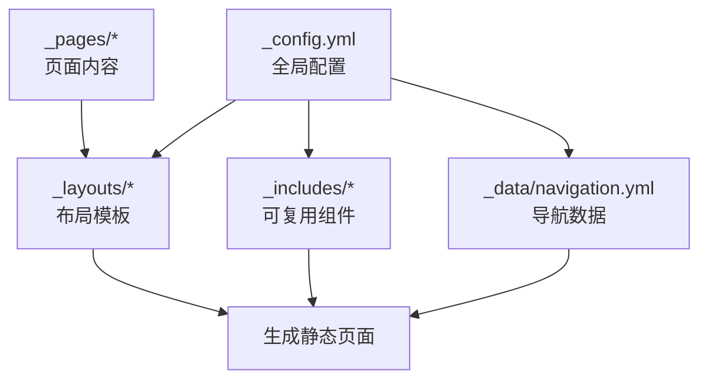
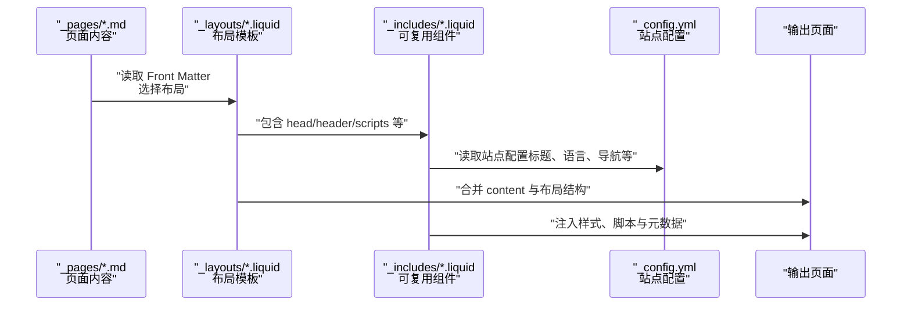
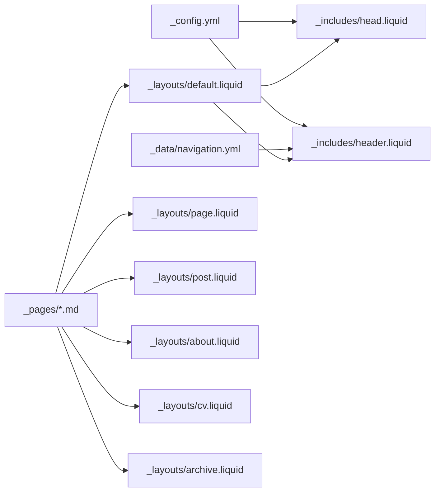

# 页面结构和布局

<cite>
**本文引用的文件**
- [_config.yml](file://_config.yml)
- [_layouts/default.liquid](file://_layouts/default.liquid)
- [_layouts/page.liquid](file://_layouts/page.liquid)
- [_layouts/post.liquid](file://_layouts/post.liquid)
- [_layouts/about.liquid](file://_layouts/about.liquid)
- [_layouts/cv.liquid](file://_layouts/cv.liquid)
- [_layouts/archive.liquid](file://_layouts/archive.liquid)
- [_includes/head.liquid](file://_includes/head.liquid)
- [_includes/header.liquid](file://_includes/header.liquid)
- [_pages/about.md](file://_pages/about.md)
- [_pages/projects.md](file://_pages/projects.md)
- [_pages/publications.md](file://_pages/publications.md)
- [_pages/blog.md](file://_pages/blog.md)
- [_pages/404.md](file://_pages/404.md)
- [_pages/competitions.md](file://_pages/competitions.md)
- [_data/navigation.yml](file://_data/navigation.yml)
</cite>

## 目录
1. [简介](#简介)
2. [项目结构](#项目结构)
3. [核心组件](#核心组件)
4. [架构总览](#架构总览)
5. [详细组件分析](#详细组件分析)
6. [依赖关系分析](#依赖关系分析)
7. [性能考量](#性能考量)
8. [故障排查指南](#故障排查指南)
9. [结论](#结论)
10. [附录](#附录)

## 简介
本文件系统性阐述该 Jekyll 站点的页面系统与布局架构，覆盖以下主题：
- 各布局模板（default、page、post、about、cv、archive 等）的作用与使用方式
- Front Matter 配置项（title、permalink、layout、description、nav、nav_order、lang、redirect 等）的含义与最佳实践
- _includes 中可复用组件（head、header、metadata 等）在不同页面中的组合使用
- 页面创建最佳实践：URL 结构设计、SEO 优化、响应式布局
- 实际页面示例与布局组合使用案例

## 项目结构
该站点采用典型的 Jekyll 组织方式：
- 根目录配置与全局设置位于 _config.yml
- 布局模板位于 _layouts，页面内容位于 _pages，博客文章通常位于 _posts（本仓库未提供示例）
- 可复用组件位于 _includes，导航数据位于 _data/navigation.yml
- 资源文件（CSS、JS、图片）位于 assets 下

图表来源
- [_config.yml](file://_config.yml)
- [_layouts/default.liquid](file://_layouts/default.liquid)
- [_includes/head.liquid](file://_includes/head.liquid)
- [_data/navigation.yml](file://_data/navigation.yml)

章节来源
- [_config.yml](file://_config.yml)
- [_data/navigation.yml](file://_data/navigation.yml)

## 核心组件
本节聚焦页面系统的关键构件：布局模板、可复用组件与页面内容。

- 布局模板
  - default：提供基础 HTML 结构、头部元数据、导航栏、内容容器、页脚与脚本加载
  - page：用于通用页面（如项目、论文、竞赛等），支持描述与评论组件
  - post：用于博客文章，支持标签、分类、目录、引用、相关文章与评论
  - about：用于个人介绍页，支持头像、简介、新闻、最新文章、精选论文与社交链接
  - cv：统一渲染 RenderCV 与 JSONResume 的简历内容
  - archive：用于按年/标签/分类归档列表
- 可复用组件
  - head：注入 SEO 元数据、样式表、第三方库与暗色主题脚本
  - header：生成导航栏、搜索入口、主题切换与语言切换
- 页面内容
  - _pages 下的 Markdown 文件通过 Front Matter 指定布局与路由，正文部分作为 content 注入布局

章节来源
- [_layouts/default.liquid](file://_layouts/default.liquid)
- [_layouts/page.liquid](file://_layouts/page.liquid)
- [_layouts/post.liquid](file://_layouts/post.liquid)
- [_layouts/about.liquid](file://_layouts/about.liquid)
- [_layouts/cv.liquid](file://_layouts/cv.liquid)
- [_layouts/archive.liquid](file://_layouts/archive.liquid)
- [_includes/head.liquid](file://_includes/head.liquid)
- [_includes/header.liquid](file://_includes/header.liquid)
- [_pages/about.md](file://_pages/about.md)
- [_pages/projects.md](file://_pages/projects.md)
- [_pages/publications.md](file://_pages/publications.md)
- [_pages/blog.md](file://_pages/blog.md)
- [_pages/404.md](file://_pages/404.md)
- [_pages/competitions.md](file://_pages/competitions.md)

## 架构总览
下图展示从页面内容到最终 HTML 的生成流程，以及布局与组件之间的依赖关系。

图表来源
- [_pages/about.md](file://_pages/about.md)
- [_layouts/default.liquid](file://_layouts/default.liquid)
- [_includes/head.liquid](file://_includes/head.liquid)
- [_includes/header.liquid](file://_includes/header.liquid)
- [_config.yml](file://_config.yml)

## 详细组件分析

### 布局模板：default
- 角色：所有布局的根模板，负责基础 HTML 结构、刷新重定向、响应式容器、侧边目录与脚本加载
- 关键特性
  - 支持 page.redirect 字段实现自动刷新跳转
  - 条件加载目录侧边栏与内容区域
  - 通过 include 引入 head、header、scripts
- 使用建议
  - 新增自定义布局时优先继承 default，以复用通用结构与资源加载

章节来源
- [_layouts/default.liquid](file://_layouts/default.liquid)

### 布局模板：page
- 角色：通用页面布局，适用于项目、论文、竞赛等静态内容
- 关键特性
  - 渲染页面标题与描述
  - 支持引用文献（related_publications）
  - 可选评论组件（giscus_comments）
- 使用建议
  - 为每个页面设置 title、description、permalink
  - 若需本地样式，可通过 _styles 注入

章节来源
- [_layouts/page.liquid](file://_layouts/page.liquid)
- [_pages/projects.md](file://_pages/projects.md)
- [_pages/publications.md](file://_pages/publications.md)

### 布局模板：post
- 角色：博客文章专用布局
- 关键特性
  - 展示创建时间、作者、最后更新时间与附加元信息
  - 自动解析标签与分类，生成可点击链接
  - 支持目录（toc）、引用（citation）、相关文章（related_posts）、评论（disqus/giscus）
- 使用建议
  - 在文章 Front Matter 中设置 tags、categories、date
  - 如需目录，启用 toc.beginning；如需引用，设置 citation

章节来源
- [_layouts/post.liquid](file://_layouts/post.liquid)
- [_pages/blog.md](file://_pages/blog.md)

### 布局模板：about
- 角色：个人介绍页
- 关键特性
  - 动态标题（根据站点配置或显式 title）
  - 支持头像、简介、更多信息块
  - 可选显示新闻、最新文章、精选论文与社交链接
- 使用建议
  - 在 Front Matter 中设置 subtitle、profile.align/image/image_circular、social 等
  - 控制 announcements/latest_posts 的启用与数量

章节来源
- [_layouts/about.liquid](file://_layouts/about.liquid)
- [_pages/about.md](file://_pages/about.md)

### 布局模板：cv
- 角色：统一简历布局，兼容 RenderCV 与 JSONResume
- 关键特性
  - 自动判断数据格式并渲染对应模块（联系方式、摘要、经验、教育、奖项、出版物、技能、语言、兴趣、证书、项目、参考）
  - 支持 PDF 链接按钮
- 使用建议
  - 在页面 Front Matter 中指定 cv_format 或留空以使用默认优先级
  - 数据来源于 _data 下的 cv.yml 或 resume.json

章节来源
- [_layouts/cv.liquid](file://_layouts/cv.liquid)

### 布局模板：archive
- 角色：归档页（按年/标签/分类）
- 关键特性
  - 根据 page.type 渲染不同标题与描述
  - 列出文档列表，支持外链与内部跳转
- 使用建议
  - 与 jekyll-archives 插件配合，生成归档页面

章节来源
- [_layouts/archive.liquid](file://_layouts/archive.liquid)

### 可复用组件：head
- 角色：页面头部元数据与资源注入
- 关键特性
  - 包含 metadata（SEO）、CSP 安全策略、Bootstrap/MDB、字体图标、代码高亮主题
  - 条件加载第三方库（如地图、对比滑块、lightbox、photoswipe、swiper、vega 等）
  - 支持暗色主题初始化与 Cookie 同意横幅
- 使用建议
  - 在页面 Front Matter 中通过布尔字段触发特定库的加载

章节来源
- [_includes/head.liquid](file://_includes/head.liquid)

### 可复用组件：header
- 角色：导航栏与工具条
- 关键特性
  - 从 _data/navigation.yml 读取多语言导航项
  - 支持搜索、主题切换、语言切换
  - 固定/粘性定位控制
- 使用建议
  - 在 _data/navigation.yml 中维护导航项与顺序

章节来源
- [_includes/header.liquid](file://_includes/header.liquid)
- [_data/navigation.yml](file://_data/navigation.yml)

### 页面示例与布局组合

#### 示例一：首页（about）
- 布局：about → 继承 default
- 关键 Front Matter：layout、title、permalink、subtitle、profile、social、announcements、latest_posts
- 内容：个人简介、头像、新闻、最新文章、精选论文、社交链接

章节来源
- [_pages/about.md](file://_pages/about.md)
- [_layouts/about.liquid](file://_layouts/about.liquid)
- [_layouts/default.liquid](file://_layouts/default.liquid)

#### 示例二：项目页（projects）
- 布局：page
- 关键 Front Matter：layout、title、permalink、description、nav、nav_order、lang、display_categories、horizontal
- 内容：项目卡片网格，支持横向/纵向排列与分类筛选

章节来源
- [_pages/projects.md](file://_pages/projects.md)
- [_layouts/page.liquid](file://_layouts/page.liquid)

#### 示例三：论文页（publications）
- 布局：page
- 关键 Front Matter：layout、permalink、title、description、nav、nav_order、lang
- 内容：通过 jekyll-scholar 生成的论文列表，集成搜索组件

章节来源
- [_pages/publications.md](file://_pages/publications.md)
- [_layouts/page.liquid](file://_layouts/page.liquid)

#### 示例四：博客页（blog）
- 布局：default
- 关键 Front Matter：layout、permalink、pagination（分页配置）
- 内容：博客列表、标签/分类导航、特色文章、分页组件

章节来源
- [_pages/blog.md](file://_pages/blog.md)
- [_layouts/default.liquid](file://_layouts/default.liquid)

#### 示例五：404 错误页
- 布局：page
- 关键 Front Matter：layout、permalink、title、description、redirect
- 内容：自动刷新至主页

章节来源
- [_pages/404.md](file://_pages/404.md)
- [_layouts/page.liquid](file://_layouts/page.liquid)

#### 示例六：竞赛相册页（competitions）
- 布局：page
- 关键 Front Matter：layout、title、permalink、description、nav、nav_order、lang、images.photoswipe
- 内容：照片画廊，支持点击放大浏览

章节来源
- [_pages/competitions.md](file://_pages/competitions.md)
- [_layouts/page.liquid](file://_layouts/page.liquid)

## 依赖关系分析
- 布局与组件
  - 所有布局均依赖 default 提供的基础结构
  - default 通过 include 引入 head、header、scripts
  - head 与 header 依赖 _config.yml 与 _data/navigation.yml
- 页面与布局
  - _pages 下的 Markdown 通过 Front Matter 指定布局
  - 布局再将页面内容作为 content 注入
- 导航与国际化
  - 导航项来自 _data/navigation.yml，支持中英文切换

图表来源
- [_config.yml](file://_config.yml)
- [_includes/head.liquid](file://_includes/head.liquid)
- [_includes/header.liquid](file://_includes/header.liquid)
- [_data/navigation.yml](file://_data/navigation.yml)
- [_pages/about.md](file://_pages/about.md)
- [_pages/projects.md](file://_pages/projects.md)
- [_pages/publications.md](file://_pages/publications.md)
- [_pages/blog.md](file://_pages/blog.md)
- [_pages/404.md](file://_pages/404.md)
- [_pages/competitions.md](file://_pages/competitions.md)
- [_layouts/default.liquid](file://_layouts/default.liquid)
- [_layouts/page.liquid](file://_layouts/page.liquid)
- [_layouts/post.liquid](file://_layouts/post.liquid)
- [_layouts/about.liquid](file://_layouts/about.liquid)
- [_layouts/cv.liquid](file://_layouts/cv.liquid)
- [_layouts/archive.liquid](file://_layouts/archive.liquid)

## 性能考量
- 资源加载
  - head 中按需加载第三方库，避免不必要的资源请求
  - 使用相对路径与缓存破坏参数，提升缓存命中率
- 图片与媒体
  - 启用懒加载与响应式 WebP 图像（由配置控制），减少首屏体积
- 代码压缩与最小化
  - 通过 jekyll-minifier 与 terser 对 JS/CSS 进行压缩
- 分页与归档
  - 博客列表使用分页，降低单页内容体积
- 目录与滚动
  - 仅在需要时启用目录与进度条，避免额外 DOM 开销

## 故障排查指南
- 页面无法访问或 404
  - 检查 permalink 设置是否正确
  - 确认 include/exclude 规则未排除目标文件
- 重定向不生效
  - 检查 page.redirect 是否为绝对 URL、相对路径或布尔值
  - 确认 default 布局中刷新逻辑已执行
- 导航与语言切换异常
  - 核对 _data/navigation.yml 中的 url 与当前页面 permalink
  - 确认语言切换逻辑与页面 lang 设置一致
- 样式或脚本缺失
  - 检查 head 中条件加载逻辑（如 images.photoswipe、pseudocode 等）
  - 确认 third_party_libraries 版本与完整性校验值有效
- 博客分页无效
  - 确认 pagination.enabled 与 collection/permalink 配置正确
  - 检查 jekyll-paginate-v2 插件是否启用

章节来源
- [_pages/404.md](file://_pages/404.md)
- [_layouts/default.liquid](file://_layouts/default.liquid)
- [_includes/head.liquid](file://_includes/head.liquid)
- [_data/navigation.yml](file://_data/navigation.yml)
- [_pages/blog.md](file://_pages/blog.md)
- [_config.yml](file://_config.yml)

## 结论
该站点通过清晰的布局层次与可复用组件，实现了高度一致且易于扩展的页面系统。遵循本文的 Front Matter 配置规范与最佳实践，可在保证 SEO 与性能的前提下快速构建高质量页面。

## 附录

### Front Matter 配置项速查
- title：页面标题（影响导航与 SEO）
- permalink：自定义 URL 路径
- layout：布局选择（default/page/post/about/cv/archive）
- description：页面描述（用于 SEO 与社交预览）
- nav/nav_order：控制导航显示与排序
- lang：页面语言（影响导航文案与组件行为）
- redirect：自动刷新跳转（支持布尔值、绝对 URL、相对路径）
- toc：目录相关（sidebar、beginning 等）
- profile：头像与更多信息（align、image、image_circular、more_info）
- social：是否显示社交链接
- announcements/latest_posts：控制新闻与最新文章模块
- selected_papers：是否显示精选论文
- display_categories/horizontal：项目分类与布局方向
- images.*：媒体库开关（photoswipe、lightbox2、slider、spotlight、venobox 等）
- pagination：分页配置（enabled、collection、permalink、per_page、sort_field/rev、trail）

章节来源
- [_pages/about.md](file://_pages/about.md)
- [_pages/projects.md](file://_pages/projects.md)
- [_pages/publications.md](file://_pages/publications.md)
- [_pages/blog.md](file://_pages/blog.md)
- [_pages/404.md](file://_pages/404.md)
- [_pages/competitions.md](file://_pages/competitions.md)
- [_layouts/post.liquid](file://_layouts/post.liquid)
- [_layouts/page.liquid](file://_layouts/page.liquid)
- [_layouts/about.liquid](file://_layouts/about.liquid)
- [_layouts/cv.liquid](file://_layouts/cv.liquid)
- [_layouts/archive.liquid](file://_layouts/archive.liquid)
- [_layouts/default.liquid](file://_layouts/default.liquid)
- [_includes/head.liquid](file://_includes/head.liquid)
- [_includes/header.liquid](file://_includes/header.liquid)
- [_data/navigation.yml](file://_data/navigation.yml)
- [_config.yml](file://_config.yml)