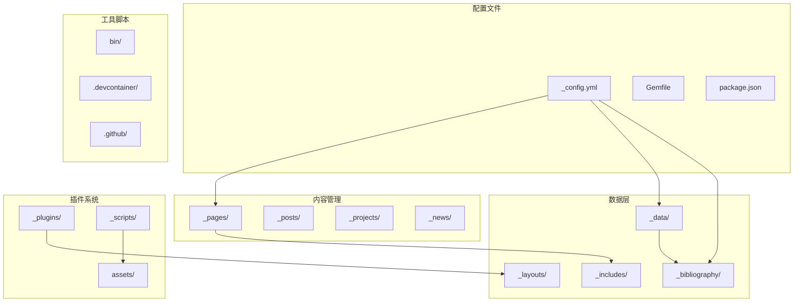
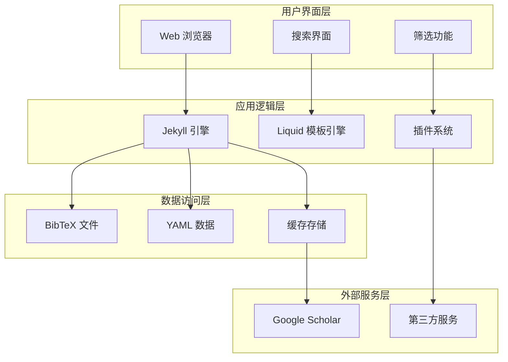
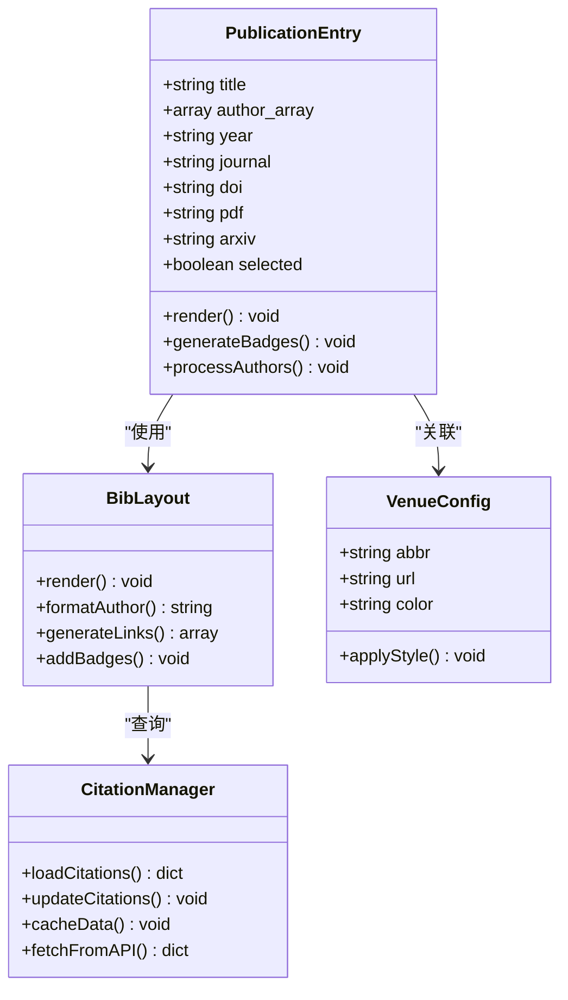
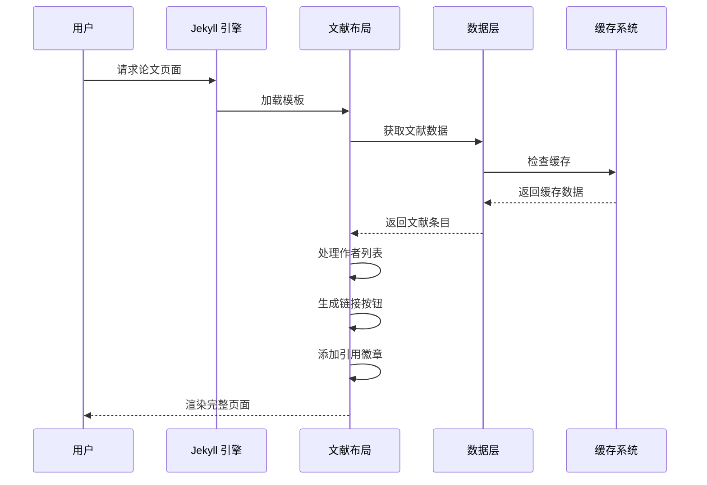
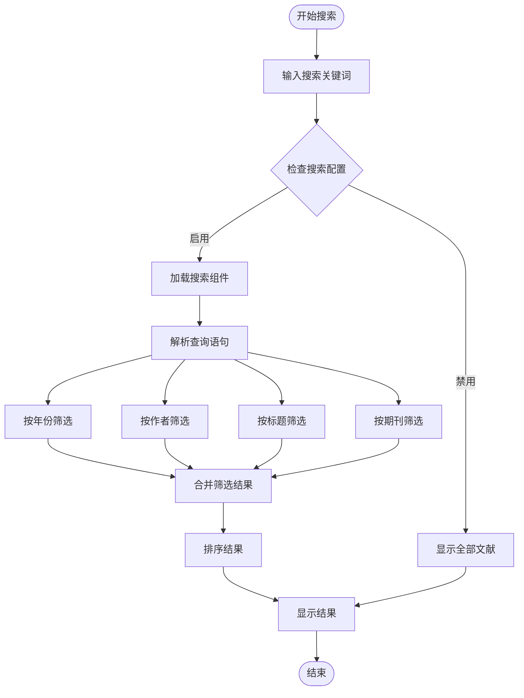
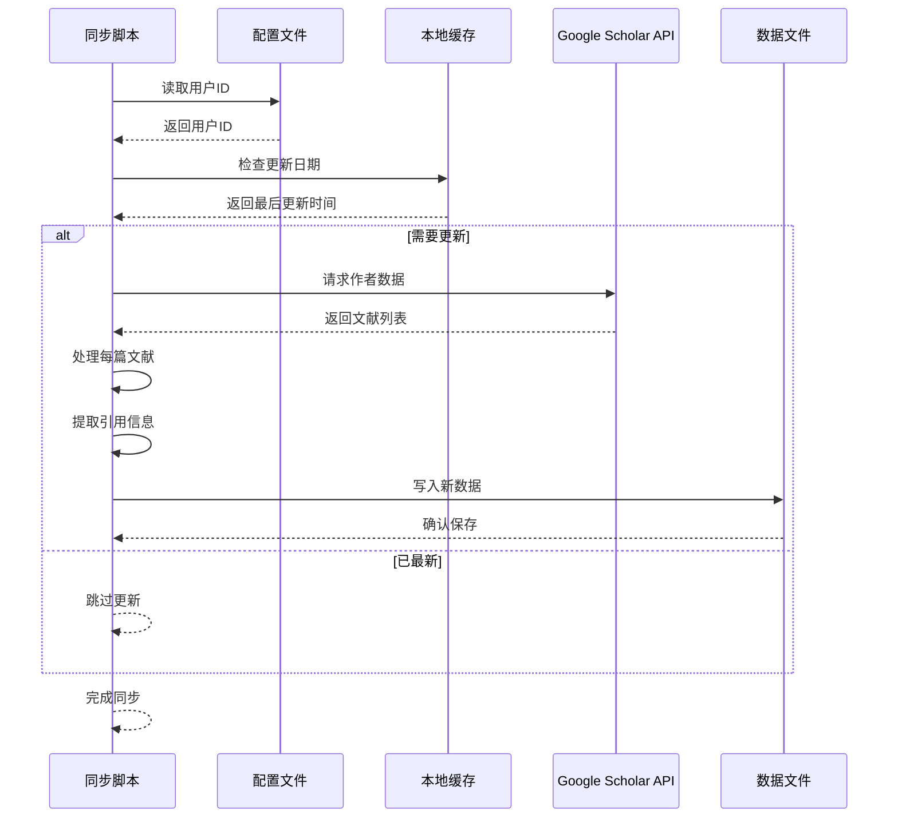
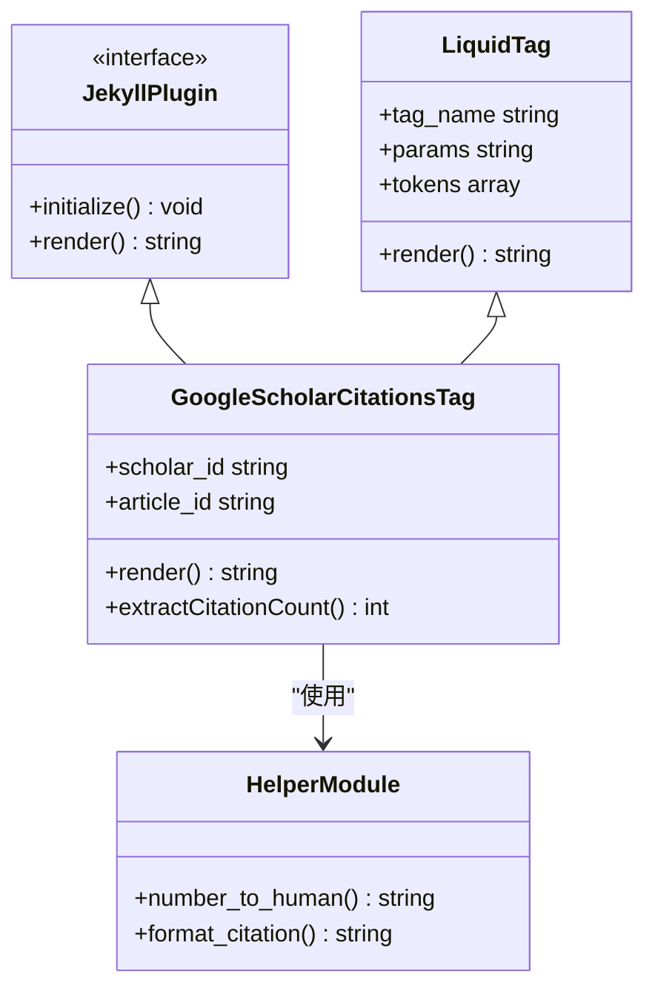
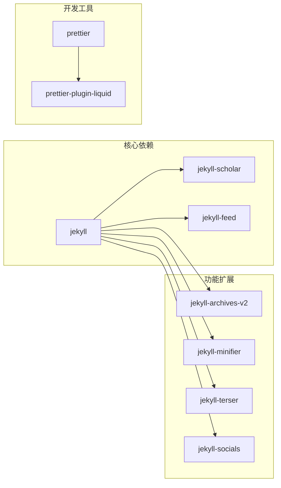
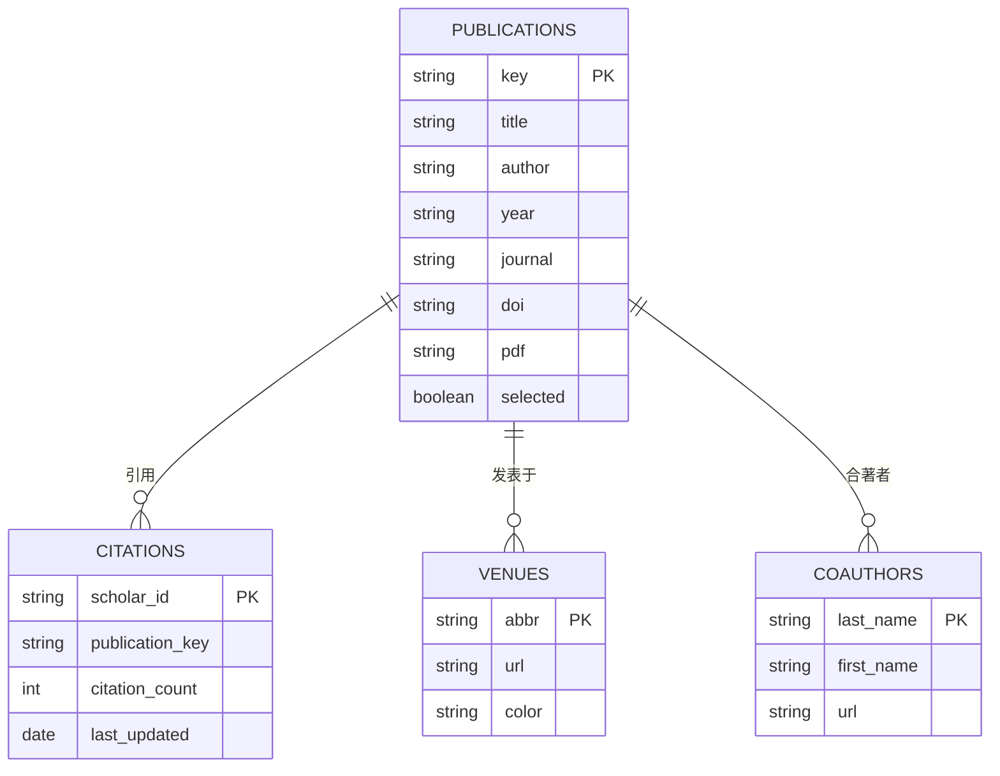

# 学术论文管理

<cite>
**本文档引用的文件**
- [_config.yml](file://_config.yml)
- [Gemfile](file://Gemfile)
- [package.json](file://package.json)
- [README.md](file://README.md)
- [update_scholar_citations.py](file://bin/update_scholar_citations.py)
- [papers.bib](file://_bibliography/papers.bib)
- [bib.liquid](file://_layouts/bib.liquid)
- [bib_search.liquid](file://_includes/bib_search.liquid)
- [citation.liquid](file://_includes/citation.liquid)
- [google-scholar-citations.rb](file://_plugins/google-scholar-citations.rb)
- [citations.yml](file://_data/citations.yml)
- [coauthors.yml](file://_data/coauthors.yml)
- [venues.yml](file://_data/venues.yml)
- [publications.md](file://_pages/publications.md)
- [selected_papers.liquid](file://_includes/selected_papers.liquid)
</cite>

## 目录
1. [简介](#简介)
2. [项目结构](#项目结构)
3. [核心组件](#核心组件)
4. [架构概览](#架构概览)
5. [详细组件分析](#详细组件分析)
6. [依赖关系分析](#依赖关系分析)
7. [性能考虑](#性能考虑)
8. [故障排除指南](#故障排除指南)
9. [结论](#结论)

## 简介

这是一个基于 Jekyll 的学术论文管理系统，专为研究人员和学者设计。该系统提供了完整的论文展示、管理和搜索功能，支持多种引用格式和外部数据库集成。

本项目基于 al-folio 主题构建，集成了 Google Scholar 数据同步、BibTeX 文献管理、多平台发布等功能。系统采用静态网站生成技术，确保快速加载和良好的 SEO 表现。

## 项目结构

该项目采用标准的 Jekyll 项目结构，主要包含以下目录：

**图表来源**
- [_config.yml:1-656](file://_config.yml#L1-L656)
- [Gemfile:1-42](file://Gemfile#L1-L42)

**章节来源**
- [_config.yml:1-656](file://_config.yml#L1-L656)
- [README.md:1-561](file://README.md#L1-L561)

## 核心组件

### 1. 配置管理系统

系统通过 `_config.yml` 实现集中式配置管理，涵盖站点设置、主题配置、功能开关等各个方面。

**主要配置类别：**
- **站点基本信息**：标题、描述、联系信息
- **主题配置**：颜色主题、布局选项
- **功能开关**：搜索、评论、统计等功能
- **外部服务**：Google Scholar、第三方库等

### 2. 文献管理引擎

基于 Jekyll Scholar 插件的文献管理系统，支持：

- **BibTeX 文件解析**：自动处理 `.bib` 格式的参考文献
- **多字段支持**：作者、标题、期刊、年份、DOI 等
- **自动生成页面**：根据文献数据动态生成论文页面
- **排序和分组**：按年份、作者等维度组织文献

### 3. 数据同步机制

集成 Google Scholar 数据同步功能，通过 Python 脚本实现：

- **自动数据抓取**：定期从 Google Scholar 获取引用数据
- **缓存机制**：避免重复请求，提高性能
- **增量更新**：只更新变化的数据
- **错误处理**：网络异常和数据格式错误的处理

**章节来源**
- [_config.yml:264-330](file://_config.yml#L264-L330)
- [update_scholar_citations.py:1-133](file://bin/update_scholar_citations.py#L1-L133)

## 架构概览

系统采用分层架构设计，各组件职责明确：

**图表来源**
- [_config.yml:196-218](file://_config.yml#L196-L218)
- [Gemfile:6-29](file://Gemfile#L6-L29)

## 详细组件分析

### 文献显示组件

文献显示组件是系统的核心功能模块，负责将学术论文以美观的方式展示给用户。

**图表来源**
- [_layouts/bib.liquid:1-396](file://_layouts/bib.liquid#L1-L396)
- [_data/venues.yml:1-10](file://_data/venues.yml#L1-L10)

#### 文献条目渲染流程

**图表来源**
- [_layouts/bib.liquid:50-260](file://_layouts/bib.liquid#L50-L260)

**章节来源**
- [_layouts/bib.liquid:1-396](file://_layouts/bib.liquid#L1-L396)

### 搜索和筛选系统

系统提供强大的文献搜索和筛选功能：

**图表来源**
- [_includes/bib_search.liquid:1-5](file://_includes/bib_search.liquid#L1-L5)

#### 高级筛选功能

系统支持多种筛选条件：

- **时间范围**：按年份区间筛选
- **作者匹配**：精确或模糊匹配作者姓名
- **关键词搜索**：在标题、摘要中搜索
- **期刊筛选**：按期刊名称或缩写筛选
- **引用数量**：按引用次数范围筛选

**章节来源**
- [_includes/bib_search.liquid:1-5](file://_includes/bib_search.liquid#L1-L5)

### 数据同步机制

Google Scholar 数据同步是系统的特色功能，确保引用数据的实时性。

**图表来源**
- [update_scholar_citations.py:39-125](file://bin/update_scholar_citations.py#L39-L125)

#### 数据同步策略

- **每日更新限制**：避免频繁请求 API
- **增量更新**：只处理变化的数据
- **错误重试**：网络异常时自动重试
- **数据验证**：确保数据格式正确

**章节来源**
- [update_scholar_citations.py:1-133](file://bin/update_scholar_citations.py#L1-L133)

### 插件系统架构

系统通过 Jekyll 插件扩展功能：

**图表来源**
- [_plugins/google-scholar-citations.rb:10-87](file://_plugins/google-scholar-citations.rb#L10-L87)

**章节来源**
- [_plugins/google-scholar-citations.rb:1-87](file://_plugins/google-scholar-citations.rb#L1-L87)

## 依赖关系分析

### Ruby Gem 依赖

系统使用多个 Ruby Gem 来实现不同功能：

**图表来源**
- [Gemfile:1-42](file://Gemfile#L1-L42)
- [package.json:1-7](file://package.json#L1-L7)

### 数据依赖关系

**图表来源**
- [_bibliography/papers.bib:1-14](file://_bibliography/papers.bib#L1-L14)
- [_data/citations.yml:1-10](file://_data/citations.yml#L1-L10)
- [_data/venues.yml:1-10](file://_data/venues.yml#L1-L10)
- [_data/coauthors.yml:1-3](file://_data/coauthors.yml#L1-L3)

**章节来源**
- [Gemfile:1-42](file://Gemfile#L1-L42)

## 性能考虑

### 缓存策略

系统实现了多层次的缓存机制：

1. **本地缓存**：存储 Google Scholar 数据
2. **浏览器缓存**：利用 HTTP 缓存头
3. **CDN 缓存**：静态资源通过 CDN 分发
4. **数据库缓存**：Jekyll 构建过程中的中间结果

### 优化建议

- **图片优化**：使用 WebP 格式和响应式图片
- **代码分割**：按需加载 JavaScript 组件
- **懒加载**：延迟加载非关键资源
- **压缩优化**：启用 CSS 和 JavaScript 压缩

## 故障排除指南

### 常见问题及解决方案

#### 1. Google Scholar 数据同步失败

**症状**：同步脚本报错或数据未更新

**解决步骤**：
1. 检查 `_data/socials.yml` 中的 `scholar_userid` 配置
2. 验证网络连接是否正常
3. 查看缓存文件是否存在且可写
4. 检查 API 限制和速率控制

#### 2. 文献页面显示异常

**症状**：论文列表显示不完整或格式错误

**解决步骤**：
1. 检查 `.bib` 文件语法是否正确
2. 验证 Liquid 模板语法
3. 查看浏览器控制台错误信息
4. 清除浏览器缓存重新加载

#### 3. 搜索功能失效

**症状**：搜索框无响应或返回空结果

**解决步骤**：
1. 检查 `site.bib_search` 配置是否启用
2. 验证搜索脚本是否正确加载
3. 检查 JavaScript 错误
4. 确认索引文件已生成

**章节来源**
- [update_scholar_citations.py:14-32](file://bin/update_scholar_citations.py#L14-L32)
- [_layouts/bib.liquid:177-180](file://_layouts/bib.liquid#L177-L180)

## 结论

本学术论文管理系统是一个功能完整、架构清晰的静态网站解决方案。系统的主要优势包括：

1. **完整的文献管理**：支持多种引用格式和丰富的元数据
2. **智能数据同步**：自动获取最新的引用数据
3. **灵活的展示方式**：支持多种筛选和排序选项
4. **良好的扩展性**：通过插件系统轻松添加新功能
5. **优秀的性能表现**：静态生成确保快速加载和良好 SEO

该系统特别适合研究人员、学者和学术机构使用，能够有效管理大量的学术论文和研究成果。通过合理的配置和维护，可以为用户提供优质的学术论文浏览体验。