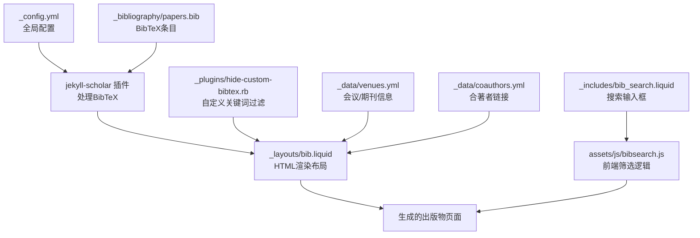
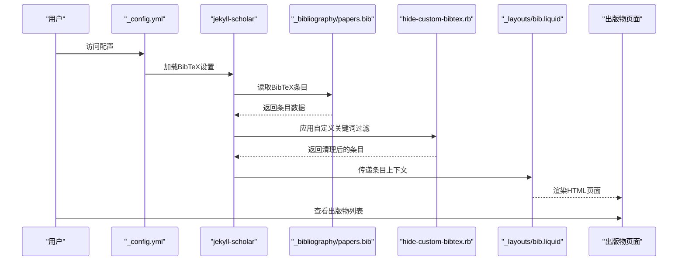
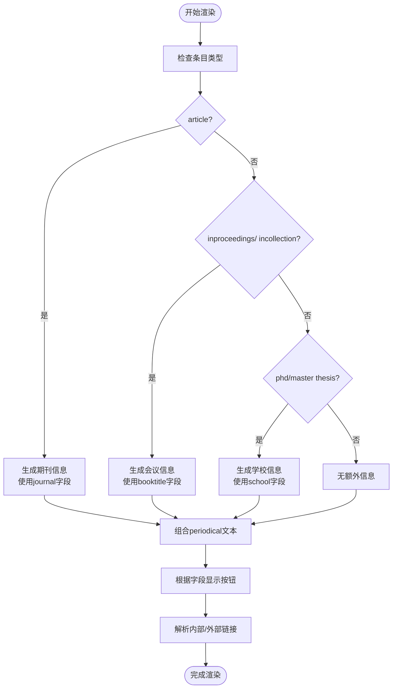
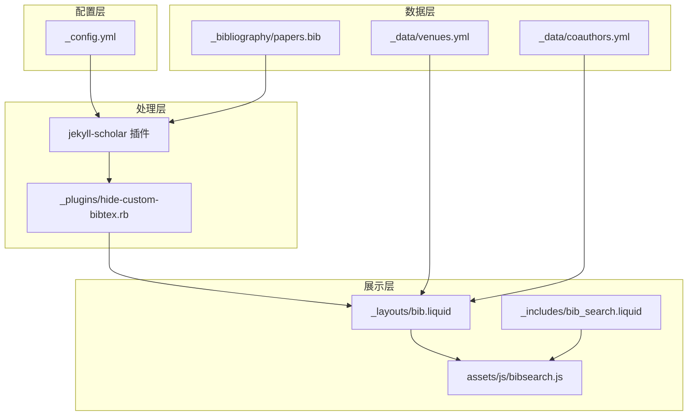

# BibTeX配置和格式

<cite>
**本文档引用的文件**
- [_bibliography/papers.bib](file://_bibliography/papers.bib)
- [_layouts/bib.liquid](file://_layouts/bib.liquid)
- [_includes/bib_search.liquid](file://_includes/bib_search.liquid)
- [_plugins/hide-custom-bibtex.rb](file://_plugins/hide-custom-bibtex.rb)
- [_config.yml](file://_config.yml)
- [assets/js/bibsearch.js](file://assets/js/bibsearch.js)
- [_data/venues.yml](file://_data/venues.yml)
- [_data/coauthors.yml](file://_data/coauthors.yml)
- [assets/bibliography/2018-12-22-distill.bib](file://assets/bibliography/2018-12-22-distill.bib)
- [CUSTOMIZE.md](file://CUSTOMIZE.md)
- [.github/instructions/bibtex-bibliography.instructions.md](file://.github/instructions/bibtex-bibliography.instructions.md)
</cite>

## 目录
1. [简介](#简介)
2. [项目结构](#项目结构)
3. [核心组件](#核心组件)
4. [架构概览](#架构概览)
5. [详细组件分析](#详细组件分析)
6. [依赖关系分析](#依赖关系分析)
7. [性能考虑](#性能考虑)
8. [故障排除指南](#故障排除指南)
9. [结论](#结论)
10. [附录](#附录)

## 简介

本文件为该Jekyll网站的BibTeX配置和格式技术文档，深入解释了BibTeX条目的字段定义、标准格式、自定义字段的作用与使用方法，以及不同文献类型的BibTeX格式要求。文档还详细说明了字段映射到HTML显示的机制、自定义显示格式的方法，并提供了完整的BibTeX条目示例、最佳实践、常见错误及解决方案，以及从其他引用管理工具导入时的注意事项。

## 项目结构

该站点采用Jekyll框架，结合jekyll-scholar插件实现BibTeX文献管理与展示。核心结构如下：

- 配置文件：通过_config.yml集中管理BibTeX源文件路径、样式、过滤关键词、搜索功能等全局设置
- 文献数据：BibTeX条目存储在/_bibliography/papers.bib中
- 布局模板：_layouts/bib.liquid负责将BibTeX条目渲染为HTML出版物列表
- 自定义过滤器：_plugins/hide-custom-bibtex.rb用于隐藏自定义关键词并清理作者标注
- 搜索功能：_includes/bib_search.liquid提供搜索输入框，assets/js/bibsearch.js实现前端筛选逻辑
- 数据支持：_data/venues.yml定义会议/期刊缩写及其链接和颜色；_data/coauthors.yml支持作者链接
- 示例条目：assets/bibliography/2018-12-22-distill.bib提供标准格式示例

**图表来源**
- [_config.yml:264-327](file://_config.yml#L264-L327)
- [_layouts/bib.liquid:1-396](file://_layouts/bib.liquid#L1-L396)
- [_plugins/hide-custom-bibtex.rb:1-19](file://_plugins/hide-custom-bibtex.rb#L1-L19)
- [_includes/bib_search.liquid:1-5](file://_includes/bib_search.liquid#L1-L5)
- [assets/js/bibsearch.js:1-71](file://assets/js/bibsearch.js#L1-L71)
- [_data/venues.yml:1-10](file://_data/venues.yml#L1-L10)
- [_data/coauthors.yml:1-3](file://_data/coauthors.yml#L1-L3)

**章节来源**
- [_config.yml:264-327](file://_config.yml#L264-L327)
- [_layouts/bib.liquid:1-396](file://_layouts/bib.liquid#L1-L396)
- [_plugins/hide-custom-bibtex.rb:1-19](file://_plugins/hide-custom-bibtex.rb#L1-L19)
- [_includes/bib_search.liquid:1-5](file://_includes/bib_search.liquid#L1-L5)
- [assets/js/bibsearch.js:1-71](file://assets/js/bibsearch.js#L1-L71)
- [_data/venues.yml:1-10](file://_data/venues.yml#L1-L10)
- [_data/coauthors.yml:1-3](file://_data/coauthors.yml#L1-L3)

## 核心组件

### BibTeX源文件与配置
- 源文件位置：/_bibliography/papers.bib
- jekyll-scholar配置：在_config.yml中指定source、bibliography、bibliography_template、style、group_by等参数
- 关键设置：
  - source: 指定BibTeX文件所在目录
  - bibliography: 指定主BibTeX文件名
  - bibliography_template: 使用自定义模板名称
  - style: 输出样式（如apa）
  - group_by: 按年份分组
  - filtered_bibtex_keywords: 定义不显示在最终输出中的自定义关键词

**章节来源**
- [_config.yml:271-287](file://_config.yml#L271-L287)
- [_config.yml:297-326](file://_config.yml#L297-L326)

### 布局模板（HTML渲染）
- 模板文件：_layouts/bib.liquid
- 功能：
  - 将BibTeX条目转换为HTML出版物卡片
  - 支持多种自定义字段（abbr、abstract、bibtex_show、selected等）控制按钮和内容显示
  - 根据条目类型（article、inproceedings、phdthesis等）动态生成期刊/会议/学校信息
  - 处理作者列表、缩略图、链接按钮、徽章等

**章节来源**
- [_layouts/bib.liquid:1-396](file://_layouts/bib.liquid#L1-L396)

### 自定义关键词过滤器
- 过滤器文件：_plugins/hide-custom-bibtex.rb
- 功能：
  - 移除filtered_bibtex_keywords中列出的自定义关键词行
  - 清理作者行中的特殊符号（如星号、上标符号）
  - 通过Liquid过滤器应用到最终输出

**章节来源**
- [_plugins/hide-custom-bibtex.rb:1-19](file://_plugins/hide-custom-bibtex.rb#L1-L19)
- [_config.yml:297-326](file://_config.yml#L297-L326)

### 搜索与筛选
- 搜索输入框：_includes/bib_search.liquid
- 前端逻辑：assets/js/bibsearch.js
- 功能：
  - 实时筛选出版物列表
  - 支持CSS高亮或降级方案
  - 根据筛选结果隐藏无匹配的分组元素

**章节来源**
- [_includes/bib_search.liquid:1-5](file://_includes/bib_search.liquid#L1-L5)
- [assets/js/bibsearch.js:1-71](file://assets/js/bibsearch.js#L1-L71)

### 数据支持
- 会议/期刊缩写：_data/venues.yml
  - 支持为abbr字段提供链接和颜色样式
- 合著者链接：_data/coauthors.yml
  - 为作者姓名提供外部链接

**章节来源**
- [_data/venues.yml:1-10](file://_data/venues.yml#L1-L10)
- [_data/coauthors.yml:1-3](file://_data/coauthors.yml#L1-L3)

## 架构概览

下图展示了从BibTeX条目到HTML页面的完整处理流程，包括jekyll-scholar插件处理、自定义过滤器应用、布局渲染和前端搜索交互。

**图表来源**
- [_config.yml:264-327](file://_config.yml#L264-L327)
- [_layouts/bib.liquid:1-396](file://_layouts/bib.liquid#L1-L396)
- [_plugins/hide-custom-bibtex.rb:1-19](file://_plugins/hide-custom-bibtex.rb#L1-L19)

## 详细组件分析

### BibTeX条目字段定义与标准格式

#### 标准BibTeX字段
- 必填字段（以常见类型为例）：
  - article：author、title、journal、year
  - inproceedings：author、title、booktitle、year
  - phdthesis：author、title、school、year
  - mastersthesis：author、title、school、year
- 常用字段：
  - title、author、journal、booktitle、year、volume、pages、month、address、edition、howpublished、note、abstract、url、doi、pdf、code、website、html、arxiv、hal、poster、slides、supp、video、blog、award、annotation、additional_info、preview、selected、abbr、bibtex_show、dimensions、altmetric、google_scholar_id、inspirehep_id、eprint、pmid、isbn

#### 字段映射到HTML显示机制
- 条目类型判断：根据entry.type选择显示逻辑（article、inproceedings、incollection、thesis、mastersthesis、phdthesis等）
- 期刊/会议/学校信息：根据类型动态生成periodical文本
- 按钮显示：根据是否存在对应字段（如abstract、bibtex_show、pdf、code等）决定按钮是否显示
- 链接解析：内部资源自动拼接至assets目录，外部URL保持原样
- 缩略图：当启用时，abbr字段可显示徽章，preview字段可显示预览图

**章节来源**
- [_layouts/bib.liquid:152-188](file://_layouts/bib.liquid#L152-L188)
- [_layouts/bib.liquid:190-261](file://_layouts/bib.liquid#L190-L261)
- [_layouts/bib.liquid:28-44](file://_layouts/bib.liquid#L28-L44)

### 自定义字段详解

#### abbr（会议/期刊缩写）
- 作用：左侧显示缩写徽章，可点击跳转至会议/期刊主页
- 配置：在_data/venues.yml中为abbr定义url和color
- 显示：若存在venue配置则使用链接和颜色，否则仅显示文本

**章节来源**
- [_layouts/bib.liquid:6-27](file://_layouts/bib.liquid#L6-L27)
- [_data/venues.yml:1-10](file://_data/venues.yml#L1-L10)

#### bibtex_show（显示完整BibTeX）
- 作用：点击"Bib"按钮展开隐藏的完整BibTeX条目
- 过滤：通过hideCustomBibtex过滤器移除filtered_bibtex_keywords中的自定义关键词
- 显示：使用语法高亮渲染

**章节来源**
- [_layouts/bib.liquid:209-211](file://_layouts/bib.liquid#L209-L211)
- [_layouts/bib.liquid:379-386](file://_layouts/bib.liquid#L379-L386)
- [_plugins/hide-custom-bibtex.rb:1-19](file://_plugins/hide-custom-bibtex.rb#L1-L19)
- [_config.yml:297-326](file://_config.yml#L297-L326)

#### selected（精选条目）
- 作用：标记精选条目，通常用于首页或特定页面的突出显示
- 行为：在布局中作为布尔值参与条件渲染

**章节来源**
- [_layouts/bib.liquid:1-396](file://_layouts/bib.liquid#L1-L396)
- [_config.yml:297-326](file://_config.yml#L297-L326)

#### abstract（摘要）
- 作用：点击"Abs"按钮展开隐藏的摘要文本
- 显示：默认以块级元素呈现

**章节来源**
- [_layouts/bib.liquid:197-199](file://_layouts/bib.liquid#L197-L199)
- [_layouts/bib.liquid:372-377](file://_layouts/bib.liquid#L372-L377)

#### 其他常用自定义字段
- pdf/poster/slides/supp/video/blog/code/website/html：分别生成对应的按钮并跳转到指定链接或本地资源
- arxiv/hal：生成相应平台的链接
- dimensions/altmetric/google_scholar_id/inspirehep_id：生成对应的徽章或链接
- annotation：在作者列表末尾添加信息图标，支持HTML内容
- additional_info：附加信息文本，会合并到期刊/会议信息中

**章节来源**
- [_layouts/bib.liquid:200-260](file://_layouts/bib.liquid#L200-L260)
- [_layouts/bib.liquid:139-148](file://_layouts/bib.liquid#L139-L148)
- [_layouts/bib.liquid:174-176](file://_layouts/bib.liquid#L174-L176)

### 不同文献类型的BibTeX格式与字段要求

#### article（期刊文章）
- 必需字段：author、title、journal、year
- 常用字段：volume、pages、number、month、note、doi、url、abstract、pdf、code、website
- 示例参考：assets/bibliography/2018-12-22-distill.bib中的article条目

**章节来源**
- [assets/bibliography/2018-12-22-distill.bib:1-8](file://assets/bibliography/2018-12-22-distill.bib#L1-L8)

#### inproceedings（会议论文）
- 必需字段：author、title、booktitle、year
- 常用字段：editor、pages、organization、publisher、address、month、note、doi、abstract、pdf、code、website
- 特殊处理：periodical部分会显示"In ... booktitle"

**章节来源**
- [_layouts/bib.liquid:156-157](file://_layouts/bib.liquid#L156-L157)

#### phdthesis（博士学位论文）
- 必需字段：author、title、school、year
- 常用字段：address、month、note、abstract、pdf、website

**章节来源**
- [_layouts/bib.liquid:158-159](file://_layouts/bib.liquid#L158-L159)

#### mastersthesis（硕士学位论文）
- 必需字段：author、title、school、year
- 常用字段：address、month、note、abstract、pdf、website

**章节来源**
- [_layouts/bib.liquid:158-159](file://_layouts/bib.liquid#L158-L159)

### 字段映射到HTML显示的机制

**图表来源**
- [_layouts/bib.liquid:152-188](file://_layouts/bib.liquid#L152-L188)

**章节来源**
- [_layouts/bib.liquid:152-188](file://_layouts/bib.liquid#L152-L188)

### 自定义显示格式

#### 会议/期刊缩写徽章
- 在_data/venues.yml中为abbr字段配置url和color
- 布局中根据是否存在venue配置决定是否添加链接和颜色样式

**章节来源**
- [_layouts/bib.liquid:6-27](file://_layouts/bib.liquid#L6-L27)
- [_data/venues.yml:1-10](file://_data/venues.yml#L1-L10)

#### 作者列表与自我标识
- 通过_config.yml中的scholar.last_name和scholar.first_name数组识别自我作者
- 作者姓名中的上标符号会被正确处理和显示

**章节来源**
- [_layouts/bib.liquid:61-102](file://_layouts/bib.liquid#L61-L102)
- [_config.yml:264-267](file://_config.yml#L264-L267)

#### 更多作者显示动画
- 当作者数量超过max_author_limit时，显示"更多作者"提示并支持点击展开动画效果

**章节来源**
- [_layouts/bib.liquid:104-138](file://_layouts/bib.liquid#L104-L138)
- [_config.yml:328-330](file://_config.yml#L328-L330)

### BibTeX条目示例与最佳实践

#### 示例条目
- 参考文件：_bibliography/papers.bib 和 assets/bibliography/2018-12-22-distill.bib
- 包含字段：title、author、journal、year、url、pdf、code、website、abstract、selected、abbr、bibtex_show等

**章节来源**
- [_bibliography/papers.bib:1-14](file://_bibliography/papers.bib#L1-L14)
- [assets/bibliography/2018-12-22-distill.bib:1-8](file://assets/bibliography/2018-12-22-distill.bib#L1-L8)

#### 最佳实践
- 使用唯一且有意义的条目标识符（key）
- 保护标题中的大写字母使用花括号
- URL使用花括号包裹
- 作者名使用"and"连接
- 文件路径遵循约定（pdf、poster、preview等）

**章节来源**
- [.github/instructions/bibtex-bibliography.instructions.md:78-95](file://.github/instructions/bibtex-bibliography.instructions.md#L78-L95)
- [CUSTOMIZE.md:737-751](file://CUSTOMIZE.md#L737-L751)

## 依赖关系分析

**图表来源**
- [_config.yml:264-327](file://_config.yml#L264-L327)
- [_layouts/bib.liquid:1-396](file://_layouts/bib.liquid#L1-L396)
- [_plugins/hide-custom-bibtex.rb:1-19](file://_plugins/hide-custom-bibtex.rb#L1-L19)
- [_includes/bib_search.liquid:1-5](file://_includes/bib_search.liquid#L1-L5)
- [assets/js/bibsearch.js:1-71](file://assets/js/bibsearch.js#L1-L71)

**章节来源**
- [_config.yml:264-327](file://_config.yml#L264-L327)
- [_layouts/bib.liquid:1-396](file://_layouts/bib.liquid#L1-L396)
- [_plugins/hide-custom-bibtex.rb:1-19](file://_plugins/hide-custom-bibtex.rb#L1-L19)
- [_includes/bib_search.liquid:1-5](file://_includes/bib_search.liquid#L1-L5)
- [assets/js/bibsearch.js:1-71](file://assets/js/bibsearch.js#L1-L71)

## 性能考虑

- 前端搜索优化：使用防抖机制减少DOM操作频率
- 条目数量控制：合理设置max_author_limit避免过长作者列表影响渲染性能
- 资源加载：图片和PDF等资源建议使用CDN或压缩以提升加载速度
- 过滤器应用：自定义关键词过滤在服务端进行，减少客户端渲染负担

## 故障排除指南

### 常见BibTeX构建错误
- Invalid bibtex reference 'key'：检查条目标识符是否存在于papers.bib
- Unmatched braces：检查花括号是否成对出现
- Unknown entry type：检查条目类型拼写（如article、inproceedings等）
- PDF not found：检查pdf字段路径是否正确（相对assets/pdf/或绝对URL）

**章节来源**
- [.github/instructions/bibtex-bibliography.instructions.md:140-146](file://.github/instructions/bibtex-bibliography.instructions.md#L140-L146)

### 自定义关键词未生效
- 检查_config.yml中的filtered_bibtex_keywords是否包含目标关键词
- 确认hideCustomBibtex过滤器已正确注册并应用到bibtex输出

**章节来源**
- [_config.yml:297-326](file://_config.yml#L297-L326)
- [_plugins/hide-custom-bibtex.rb:1-19](file://_plugins/hide-custom-bibtex.rb#L1-L19)

### 搜索功能异常
- 检查_search_enabled配置项
- 确认assets/js/bibsearch.js已正确加载
- 验证CSS高亮支持情况，确保降级方案正常工作

**章节来源**
- [_config.yml:57-60](file://_config.yml#L57-L60)
- [assets/js/bibsearch.js:1-71](file://assets/js/bibsearch.js#L1-L71)

## 结论

本技术文档全面阐述了该Jekyll网站的BibTeX配置与格式体系，包括字段定义、标准格式、自定义字段的作用与使用方法、不同文献类型的格式要求、HTML显示机制、自定义显示格式、示例与最佳实践、常见错误与解决方案，以及从其他引用管理工具导入的注意事项。通过jekyll-scholar插件、自定义过滤器和布局模板的协同工作，实现了灵活而强大的文献管理与展示功能。

## 附录

### BibTeX条目字段对照表

| 字段 | 类型 | 说明 | HTML显示 |
|---|---|---|---|
| author | 文本 | 作者列表，使用"and"连接 | 作者列表，自我标识加粗，支持合著者链接 |
| title | 文本 | 文章标题 | 标题文本 |
| journal | 文本 | 期刊名称 | 期刊信息（article类型） |
| booktitle | 文本 | 会议论文集名称 | 会议信息（inproceedings类型） |
| school | 文本 | 学校名称 | 学校信息（thesis类型） |
| year | 数字 | 发表年份 | 年份信息 |
| volume | 数字 | 卷号 | 期刊信息 |
| pages | 文本 | 页码范围 | 期刊信息 |
| month | 文本 | 月份 | 日期信息 |
| address | 文本 | 会议地点 | 附加信息 |
| note | 文本 | 备注 | 备注信息 |
| abstract | 文本 | 摘要 | "Abs"按钮展开 |
| url | 文本 | URL链接 | 无按钮（自动识别PDF/HTML） |
| doi | 文本 | 数字对象标识符 | "DOI"按钮 |
| pdf | 文本 | PDF文件路径或URL | "PDF"按钮 |
| code | 文本 | 代码仓库链接 | "Code"按钮 |
| website | 文本 | 主页链接 | "Website"按钮 |
| html | 文本 | HTML页面链接 | "HTML"按钮 |
| arxiv | 文本 | arXiv标识符 | "arXiv"按钮 |
| hal | 文本 | HAL标识符 | "HAL"按钮 |
| poster | 文本 | 海报文件路径或URL | "Poster"按钮 |
| slides | 文本 | 演示文稿文件路径或URL | "Slides"按钮 |
| supp | 文本 | 补充材料文件路径或URL | "Supp"按钮 |
| video | 文本 | 视频链接或嵌入地址 | "Video"按钮（可嵌入） |
| blog | 文本 | 博客链接 | "Blog"按钮 |
| award | 文本 | 奖项信息 | 奖项徽章 |
| annotation | 文本 | 注释信息（支持HTML） | 信息图标 |
| additional_info | 文本 | 附加信息 | 合并到期刊信息 |
| preview | 文本 | 预览图片路径 | 预览图 |
| selected | 布尔 | 是否精选 | 无直接显示 |
| abbr | 文本 | 会议/期刊缩写 | 缩写徽章（可链接） |
| bibtex_show | 布尔 | 是否显示完整BibTeX | "Bib"按钮 |
| dimensions | 文本/布尔 | Dimensions徽章标识 | 徽章 |
| altmetric | 文本/布尔 | Altmetric徽章标识 | 徽章 |
| google_scholar_id | 文本 | Google Scholar标识 | 徽章 |
| inspirehep_id | 文本 | InspireHEP标识 | 徽章 |
| eprint | 文本 | eprint标识符 | 无直接显示 |
| pmid | 文本 | PubMed标识符 | 无直接显示 |
| isbn | 文本 | ISBN标识符 | 无直接显示 |

### 导入注意事项

- 从其他引用管理工具导出时，注意字段名称的一致性
- URL字段建议使用花括号包裹以避免解析问题
- 作者名应使用标准格式，避免特殊字符导致的解析错误
- 对于中文作者名，建议使用LaTeX转义序列或保持英文格式
- 导入后建议先进行本地构建测试，确认无误后再提交

**章节来源**
- [.github/instructions/bibtex-bibliography.instructions.md:126-174](file://.github/instructions/bibtex-bibliography.instructions.md#L126-L174)
- [CUSTOMIZE.md:778-797](file://CUSTOMIZE.md#L778-L797)