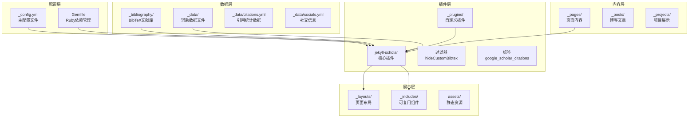
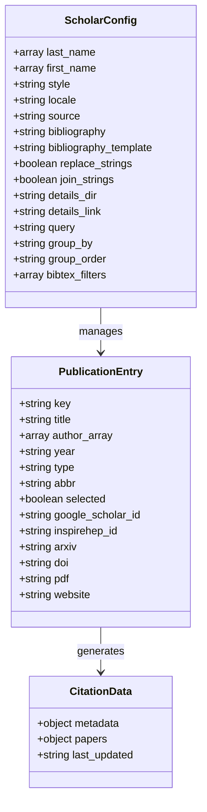
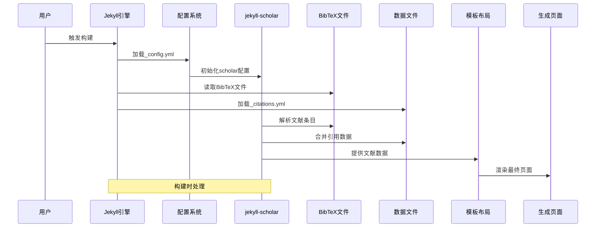
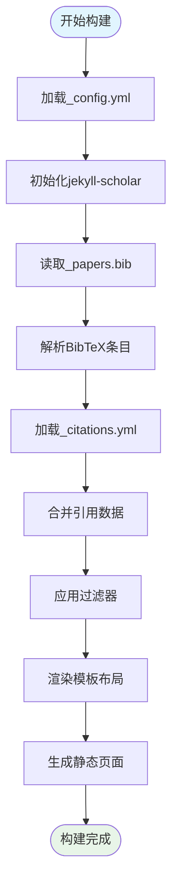
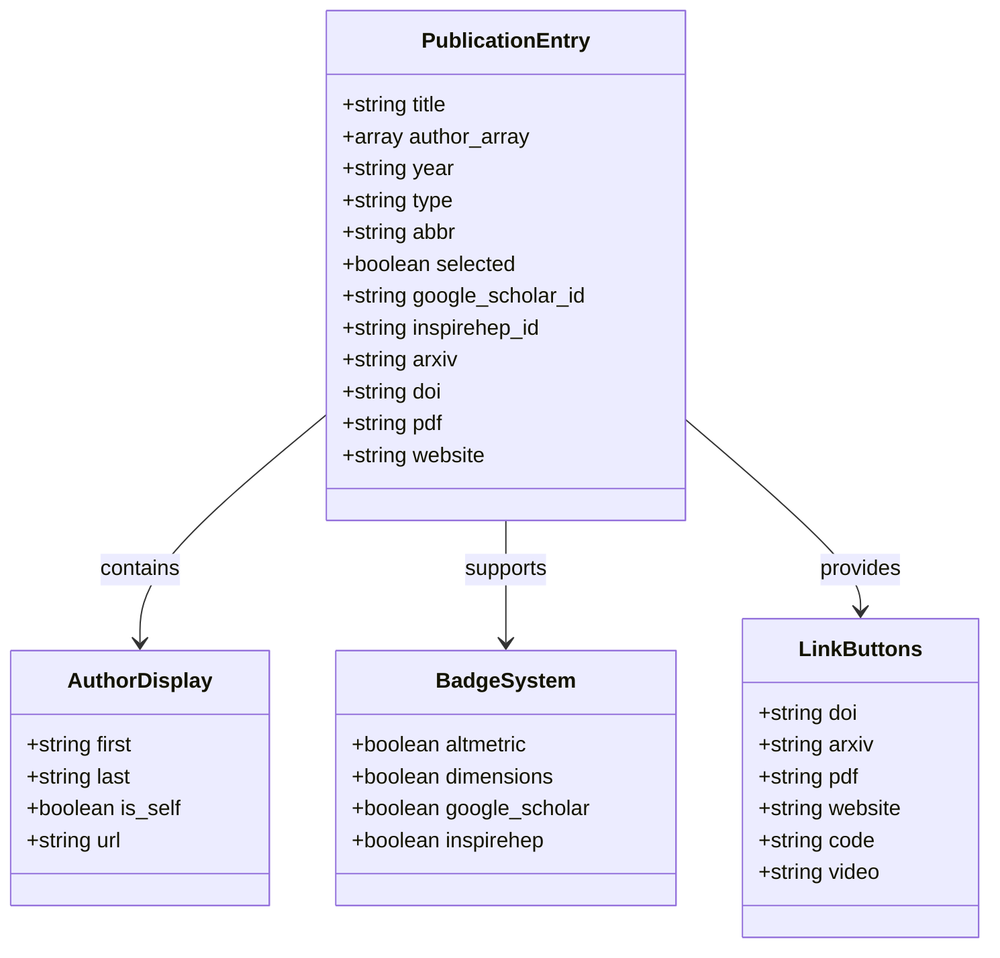
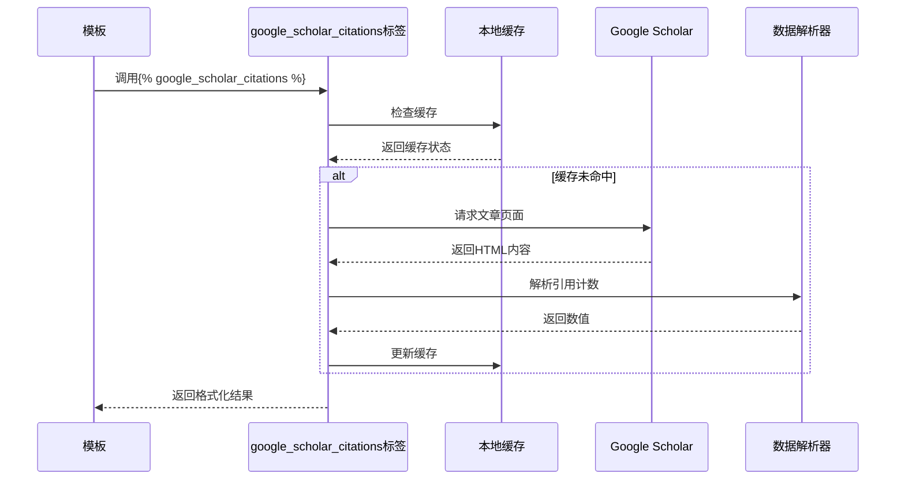
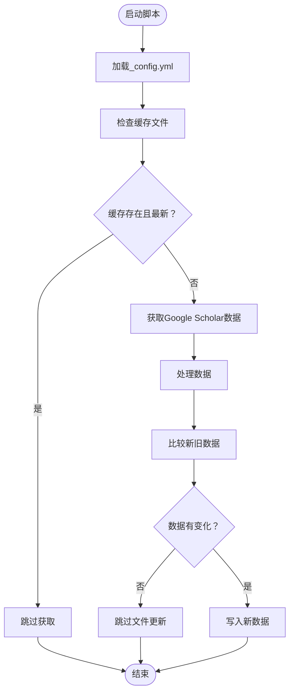
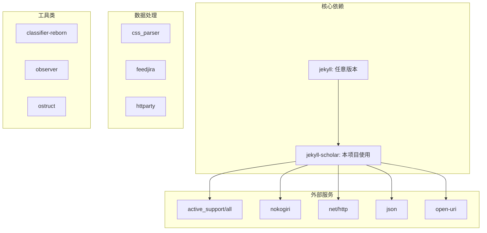
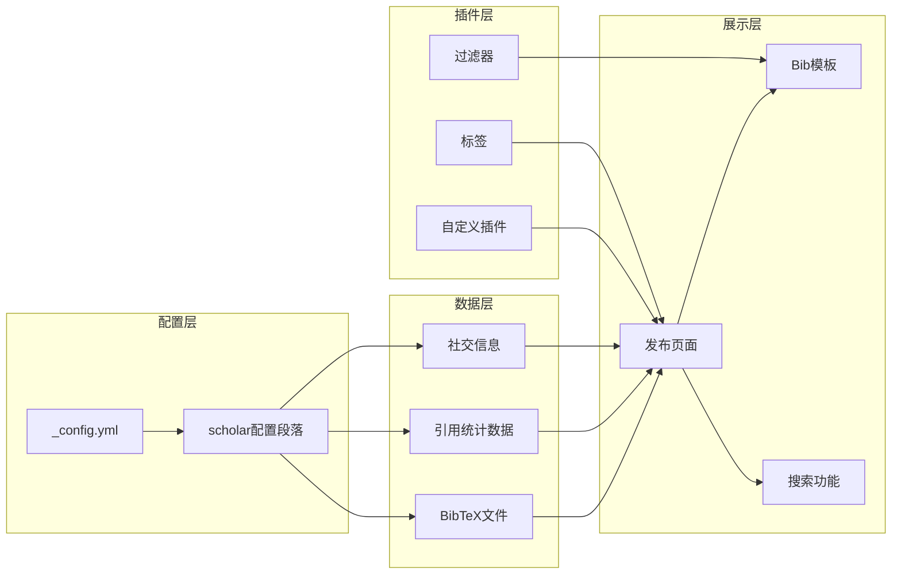

# jekyll-scholar插件集成

<cite>
**本文档引用的文件**
- [_config.yml](file://_config.yml)
- [Gemfile](file://Gemfile)
- [_plugins/google-scholar-citations.rb](file://_plugins/google-scholar-citations.rb)
- [_plugins/inspirehep-citations.rb](file://_plugins/inspirehep-citations.rb)
- [_plugins/hide-custom-bibtex.rb](file://_plugins/hide-custom-bibtex.rb)
- [_plugins/details.rb](file://_plugins/details.rb)
- [_plugins/remove-accents.rb](file://_plugins/remove-accents.rb)
- [_layouts/bib.liquid](file://_layouts/bib.liquid)
- [_pages/publications.md](file://_pages/publications.md)
- [_bibliography/papers.bib](file://_bibliography/papers.bib)
- [_data/citations.yml](file://_data/citations.yml)
- [_data/socials.yml](file://_data/socials.yml)
- [bin/update_scholar_citations.py](file://bin/update_scholar_citations.py)
</cite>

## 目录
1. [简介](#简介)
2. [项目结构](#项目结构)
3. [核心组件](#核心组件)
4. [架构概览](#架构概览)
5. [详细组件分析](#详细组件分析)
6. [依赖关系分析](#依赖关系分析)
7. [性能考虑](#性能考虑)
8. [故障排除指南](#故障排除指南)
9. [结论](#结论)

## 简介

jekyll-scholar是一个强大的Jekyll插件，专门用于管理和展示学术文献。在本项目中，它被深度集成以管理个人学术出版物，提供自动化的文献排序、作者识别、引用统计和美观的文献展示。

该插件支持多种文献格式，包括BibTeX、EndNote和RIS，并提供了丰富的过滤器和标签来增强文献管理功能。通过与外部学术数据库的集成，可以自动获取最新的引用统计数据。

## 项目结构

该项目采用标准的Jekyll目录结构，专门为学术出版物管理进行了优化：



**图表来源**
- [_config.yml:261-331](file://_config.yml#L261-L331)
- [Gemfile:19-26](file://Gemfile#L19-L26)

**章节来源**
- [_config.yml:142-218](file://_config.yml#L142-L218)
- [Gemfile:1-42](file://Gemfile#L1-L42)

## 核心组件

### jekyll-scholar配置系统

jekyll-scholar通过_config.yml中的scholar配置段落进行管理，提供了全面的文献管理选项：



**图表来源**
- [_config.yml:264-288](file://_config.yml#L264-L288)
- [_data/citations.yml:1-3](file://_data/citations.yml#L1-L3)

### 文献集合配置

项目使用标准的Jekyll集合来组织不同类型的学术内容：

| 集合名称 | 输出设置 | 默认布局 | 用途 |
|---------|---------|---------|------|
| news | true | post | 新闻公告 |
| projects | true | 无默认布局 | 项目展示 |
| publications | 自动从BibTeX生成 | bib.liquid | 学术论文 |

**章节来源**
- [_config.yml:145-152](file://_config.yml#L145-L152)

### 自定义插件生态系统

项目实现了多个自定义插件来扩展jekyll-scholar的功能：

```mermaid
classDiagram
class GoogleScholarCitationsTag {
+initialize(tag_name, params, tokens)
+render(context) string
-Citations Hash
-CITED_BY_REGEX Regex
}
class InspireHEPCitationsTag {
+initialize(tag_name, params, tokens)
+render(context) string
-Citations Hash
}
class HideCustomBibtexFilter {
+hideCustomBibtex(input) string
-keywords Array
}
class DetailsTag {
+initialize(tag_name, markup, tokens)
+render(context) string
-caption String
}
GoogleScholarCitationsTag --> Liquid : : Tag : inherits
InspireHEPCitationsTag --> Liquid : : Tag : inherits
HideCustomBibtexFilter --> Liquid : : Template : registers
DetailsTag --> Liquid : : Block : inherits
```

**图表来源**
- [_plugins/google-scholar-citations.rb:10-83](file://_plugins/google-scholar-citations.rb#L10-L83)
- [_plugins/inspirehep-citations.rb:11-54](file://_plugins/inspirehep-citations.rb#L11-L54)
- [_plugins/hide-custom-bibtex.rb:3-14](file://_plugins/hide-custom-bibtex.rb#L3-L14)
- [_plugins/details.rb:5-19](file://_plugins/details.rb#L5-L19)

**章节来源**
- [_plugins/google-scholar-citations.rb:1-87](file://_plugins/google-scholar-citations.rb#L1-L87)
- [_plugins/inspirehep-citations.rb:1-58](file://_plugins/inspirehep-citations.rb#L1-L58)
- [_plugins/hide-custom-bibtex.rb:1-19](file://_plugins/hide-custom-bibtex.rb#L1-L19)
- [_plugins/details.rb:1-23](file://_plugins/details.rb#L1-L23)

## 架构概览

jekyll-scholar在整个Jekyll构建流程中的集成方式如下：



**图表来源**
- [_config.yml:261-331](file://_config.yml#L261-L331)
- [_pages/publications.md:19-19](file://_pages/publications.md#L19-L19)

### 数据流处理

文献数据在构建过程中的流转路径：



**图表来源**
- [_layouts/bib.liquid:1-396](file://_layouts/bib.liquid#L1-L396)
- [_plugins/hide-custom-bibtex.rb:3-14](file://_plugins/hide-custom-bibtex.rb#L3-L14)

**章节来源**
- [_config.yml:261-331](file://_config.yml#L261-L331)
- [_layouts/bib.liquid:1-396](file://_layouts/bib.liquid#L1-L396)

## 详细组件分析

### 文献管理核心功能

#### BibTeX文件结构

项目使用标准的BibTeX格式来管理学术文献：

| 字段名称 | 类型 | 描述 | 示例值 |
|---------|------|------|--------|
| author | string/array | 作者列表 | "Li, Mingyu" |
| title | string | 论文标题 | "ICARM 2025 Paper Title" |
| year | integer/string | 发表年份 | 2025 |
| journal/booktitle | string | 期刊或会议名称 | "IEEE ICARM" |
| abbr | string | 会议缩写标识 | "ICARM" |
| selected | boolean | 是否精选文章 | true |
| google_scholar_id | string | Google Scholar ID | "qc6CJjYAAAAJ:..." |
| arxiv | string | arXiv编号 | "2312.12345" |
| doi | string | 数字对象标识符 | "10.xxxx/xxxxx" |
| pdf | string | PDF文件路径 | "assets/pdf/paper.pdf" |

**章节来源**
- [_bibliography/papers.bib:4-13](file://_bibliography/papers.bib#L4-L13)

#### 文献展示布局

bib.liquid模板提供了完整的文献展示功能：



**图表来源**
- [_layouts/bib.liquid:53-261](file://_layouts/bib.liquid#L53-L261)

**章节来源**
- [_layouts/bib.liquid:1-396](file://_layouts/bib.liquid#L1-L396)

### 引用统计系统

#### Google Scholar集成

项目实现了两个主要的引用统计功能：

1. **实时引用计数获取**
2. **本地缓存机制**



**图表来源**
- [_plugins/google-scholar-citations.rb:29-82](file://_plugins/google-scholar-citations.rb#L29-L82)

#### 自动更新脚本

项目包含一个Python脚本来自动生成引用统计数据：



**图表来源**
- [bin/update_scholar_citations.py:39-125](file://bin/update_scholar_citations.py#L39-L125)

**章节来源**
- [_plugins/google-scholar-citations.rb:1-87](file://_plugins/google-scholar-citations.rb#L1-L87)
- [bin/update_scholar_citations.py:1-133](file://bin/update_scholar_citations.py#L1-L133)

### 过滤器和标签系统

#### 自定义过滤器

项目实现了多个自定义Liquid过滤器：

1. **hideCustomBibtex过滤器**
   - 移除BibTeX文件中的内部关键字
   - 清理作者列表中的特殊字符
   - 支持配置化的关键词过滤

2. **remove_accents过滤器**
   - 移除字符串中的重音符号
   - 支持国际化文本处理

**章节来源**
- [_plugins/hide-custom-bibtex.rb:1-19](file://_plugins/hide-custom-bibtex.rb#L1-L19)
- [_plugins/remove-accents.rb:1-32](file://_plugins/remove-accents.rb#L1-L32)

#### 自定义标签

1. **details标签**
   - 创建可折叠的内容区域
   - 支持Markdown内容转换
   - 提供摘要和详细内容分离

2. **InspireHEP引用标签**
   - 获取高能物理领域的引用统计
   - 支持API数据获取
   - 实现智能缓存机制

**章节来源**
- [_plugins/details.rb:1-23](file://_plugins/details.rb#L1-L23)
- [_plugins/inspirehep-citations.rb:1-58](file://_plugins/inspirehep-citations.rb#L1-L58)

## 依赖关系分析

### Ruby Gem依赖

项目对jekyll-scholar及其相关依赖的管理：



**图表来源**
- [Gemfile:6-29](file://Gemfile#L6-L29)

### 配置依赖关系

jekyll-scholar与其他系统组件的依赖关系：



**图表来源**
- [_config.yml:261-331](file://_config.yml#L261-L331)
- [_pages/publications.md:1-22](file://_pages/publications.md#L1-L22)

**章节来源**
- [Gemfile:1-42](file://Gemfile#L1-L42)
- [_config.yml:261-331](file://_config.yml#L261-L331)

## 性能考虑

### 缓存策略

项目实现了多层次的缓存机制来优化性能：

1. **本地缓存**
   - 引用统计数据持久化存储
   - 避免重复的网络请求
   - 支持数据更新检测

2. **内存缓存**
   - Liquid标签的运行时缓存
   - 减少重复的数据处理
   - 提高模板渲染效率

3. **静态资源缓存**
   - 图片和PDF文件的浏览器缓存
   - CDN支持
   - 压缩和优化

### 优化建议

1. **批量处理**
   - 使用Python脚本批量更新引用数据
   - 避免在构建过程中进行实时查询

2. **懒加载**
   - 对于大型文献集，实现分页显示
   - 按需加载详细的引用统计

3. **压缩优化**
   - 启用Jekyll的压缩功能
   - 优化CSS和JavaScript文件
   - 使用CDN加速静态资源

## 故障排除指南

### 常见配置问题

#### jekyll-scholar插件未启用

**问题症状**：文献页面无法正常显示，出现未知标签错误

**解决步骤**：
1. 检查Gemfile中是否包含jekyll-scholar
2. 确认_config.yml中的plugins段落包含jekyll/scholar
3. 验证Ruby环境的gem安装

**章节来源**
- [Gemfile:19-19](file://Gemfile#L19-L19)
- [_config.yml:210-210](file://_config.yml#L210-L210)

#### BibTeX文件格式错误

**问题症状**：构建失败，提示BibTeX解析错误

**解决步骤**：
1. 使用在线BibTeX验证器检查语法
2. 确保所有必填字段完整
3. 检查特殊字符的转义

#### 引用统计获取失败

**问题症状**：Google Scholar引用计数显示"N/A"

**解决步骤**：
1. 检查网络连接和防火墙设置
2. 验证Google Scholar用户ID配置
3. 查看Python脚本的错误日志

**章节来源**
- [bin/update_scholar_citations.py:70-74](file://bin/update_scholar_citations.py#L70-L74)

### 开发调试技巧

1. **启用详细日志**
   - 在_config.yml中调整日志级别
   - 使用Jekyll的--verbose选项

2. **单元测试**
   - 为自定义插件编写测试用例
   - 测试BibTeX文件解析逻辑

3. **性能监控**
   - 监控构建时间
   - 分析内存使用情况
   - 优化大数据集的处理

## 结论

jekyll-scholar插件在本项目中的成功集成展示了如何将学术文献管理与静态网站生成完美结合。通过合理的配置、自定义插件开发和缓存策略，实现了高效、可维护的学术出版物管理系统。

关键成功因素包括：
- 清晰的配置管理
- 完善的自定义插件生态
- 智能的缓存和性能优化
- 可扩展的数据处理流程

未来可以进一步改进的方向包括：
- 更智能的文献分类算法
- 增强的搜索和过滤功能
- 更好的移动端适配
- 集成更多学术数据库