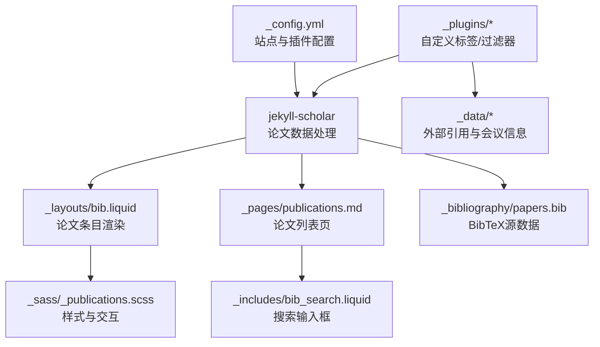
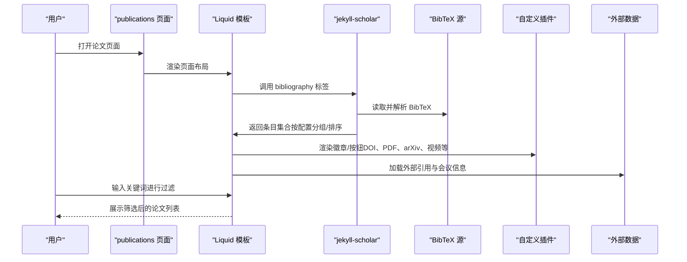
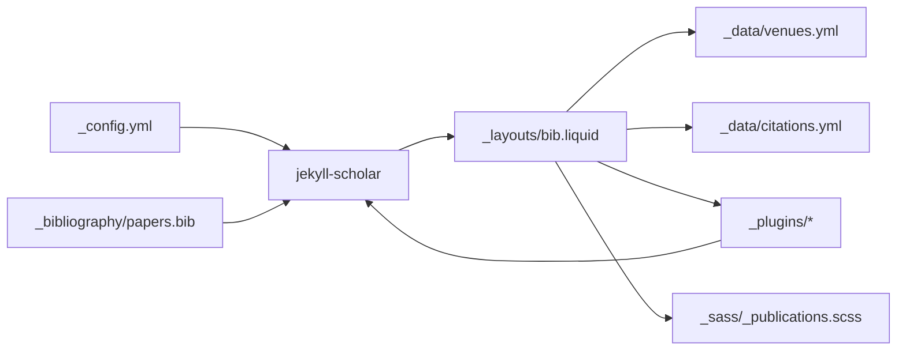

# 学术论文管理

<cite>
**本文档引用的文件**
- [_config.yml](file://_config.yml)
- [_pages/publications.md](file://_pages/publications.md)
- [_layouts/bib.liquid](file://_layouts/bib.liquid)
- [_includes/bib_search.liquid](file://_includes/bib_search.liquid)
- [_includes/citation.liquid](file://_includes/citation.liquid)
- [_plugins/google-scholar-citations.rb](file://_plugins/google-scholar-citations.rb)
- [_plugins/inspirehep-citations.rb](file://_plugins/inspirehep-citations.rb)
- [_plugins/hide-custom-bibtex.rb](file://_plugins/hide-custom-bibtex.rb)
- [_plugins/remove-accents.rb](file://_plugins/remove-accents.rb)
- [_plugins/details.rb](file://_plugins/details.rb)
- [_plugins/external-posts.rb](file://_plugins/external-posts.rb)
- [_data/citations.yml](file://_data/citations.yml)
- [_data/venues.yml](file://_data/venues.yml)
- [_sass/_publications.scss](file://_sass/_publications.scss)
- [_bibliography/papers.bib](file://_bibliography/papers.bib)
</cite>

## 目录
1. [简介](#简介)
2. [项目结构](#项目结构)
3. [核心组件](#核心组件)
4. [架构总览](#架构总览)
5. [详细组件分析](#详细组件分析)
6. [依赖关系分析](#依赖关系分析)
7. [性能考虑](#性能考虑)
8. [故障排查指南](#故障排查指南)
9. [结论](#结论)
10. [附录](#附录)

## 简介
本技术文档面向学术论文展示系统，围绕BibTeX数据与jekyll-scholar插件展开，系统性阐述以下内容：
- BibTeX格式使用与配置：字段定义、引用样式、排序与分组规则
- jekyll-scholar工作原理与配置项详解
- 论文数据结构设计思路与最佳实践
- 论文页面生成机制（按年份、主题、类型等维度）
- 搜索功能实现原理与自定义扩展
- 高级功能：论文预览、下载链接、DOI解析、引用统计与徽章
- 实际BibTeX条目示例与常见问题解决方案

## 项目结构
该站点采用Jekyll静态站点生成器，结合jekyll-scholar插件与自定义Liquid模板、SCSS样式、Ruby插件，形成完整的论文展示体系。

图示来源
- [_config.yml:264-330](file://_config.yml#L264-L330)
- [_layouts/bib.liquid:1-396](file://_layouts/bib.liquid#L1-L396)
- [_pages/publications.md:1-22](file://_pages/publications.md#L1-L22)
- [_includes/bib_search.liquid:1-5](file://_includes/bib_search.liquid#L1-L5)
- [_sass/_publications.scss:1-189](file://_sass/_publications.scss#L1-L189)
- [_plugins/google-scholar-citations.rb:1-87](file://_plugins/google-scholar-citations.rb#L1-L87)
- [_plugins/inspirehep-citations.rb:1-58](file://_plugins/inspirehep-citations.rb#L1-L58)
- [_plugins/hide-custom-bibtex.rb:1-19](file://_plugins/hide-custom-bibtex.rb#L1-L19)
- [_plugins/remove-accents.rb:1-32](file://_plugins/remove-accents.rb#L1-L32)
- [_plugins/details.rb:1-23](file://_plugins/details.rb#L1-L23)
- [_plugins/external-posts.rb:1-125](file://_plugins/external-posts.rb#L1-L125)
- [_data/citations.yml:1-800](file://_data/citations.yml#L1-L800)
- [_data/venues.yml:1-10](file://_data/venues.yml#L1-L10)
- [_bibliography/papers.bib:1-14](file://_bibliography/papers.bib#L1-L14)

章节来源
- [_config.yml:196-330](file://_config.yml#L196-L330)
- [_pages/publications.md:1-22](file://_pages/publications.md#L1-L22)

## 核心组件
- 配置中心：通过站点配置控制jekyll-scholar参数、搜索开关、徽章显示、作者上限等
- 数据源：BibTeX文件作为主数据源；外部引用与会议信息来自_yaml数据文件
- 渲染层：Liquid模板负责论文条目的HTML结构、按钮与徽章生成
- 插件层：Ruby插件提供自定义标签（如Google Scholar引用计数）、过滤器（隐藏关键字、去重音）与生成器（抓取外部博客）
- 样式层：SCSS统一管理论文列表的排版、交互与响应式设计

章节来源
- [_config.yml:264-330](file://_config.yml#L264-L330)
- [_layouts/bib.liquid:1-396](file://_layouts/bib.liquid#L1-L396)
- [_plugins/google-scholar-citations.rb:1-87](file://_plugins/google-scholar-citations.rb#L1-L87)
- [_plugins/inspirehep-citations.rb:1-58](file://_plugins/inspirehep-citations.rb#L1-L58)
- [_plugins/hide-custom-bibtex.rb:1-19](file://_plugins/hide-custom-bibtex.rb#L1-L19)
- [_sass/_publications.scss:1-189](file://_sass/_publications.scss#L1-L189)

## 架构总览
下图展示了从数据到页面渲染的端到端流程，以及搜索与徽章增强的集成点。

图示来源
- [_pages/publications.md:17-21](file://_pages/publications.md#L17-L21)
- [_layouts/bib.liquid:190-396](file://_layouts/bib.liquid#L190-L396)
- [_includes/bib_search.liquid:1-5](file://_includes/bib_search.liquid#L1-L5)
- [_config.yml:264-330](file://_config.yml#L264-L330)
- [_data/citations.yml:1-800](file://_data/citations.yml#L1-L800)
- [_data/venues.yml:1-10](file://_data/venues.yml#L1-L10)

## 详细组件分析

### BibTeX与jekyll-scholar配置
- 数据源与模板
  - 数据源路径与文件名：在配置中指定源目录与BibTeX文件名
  - 模板名称：指定用于渲染的Liquid模板
- 引用样式与本地化
  - 使用APA样式与英文本地化
- 过滤与字符串处理
  - 启用字符串替换与连接，以提升显示一致性
  - 预定义过滤关键字，自动隐藏内部字段
- 分组与排序
  - 默认按年份分组，降序排列
  - 查询表达式默认匹配所有条目
- 作者与缩略名
  - 作者上限与动画延迟可配置
  - 会议缩略名映射到颜色与链接
- 徽章与外部服务
  - 支持Altmetric、Dimensions、Google Scholar、InspireHEP徽章
  - 可根据条目字段或arXiv/DOI/PubMed/ISBN自动填充徽章参数

章节来源
- [_config.yml:264-330](file://_config.yml#L264-L330)
- [_plugins/hide-custom-bibtex.rb:1-19](file://_plugins/hide-custom-bibtex.rb#L1-L19)
- [_data/venues.yml:1-10](file://_data/venues.yml#L1-L10)

### 论文条目渲染与交互
- 缩略图与会议徽标
  - 若启用缩略图，优先使用条目中的预览图片；否则显示会议缩略名徽标
- 作者列表与自我标注
  - 自动识别“我”的作者并加粗；支持协作者链接跳转
  - 超过上限的作者以动画方式展开显示
- 出版信息
  - 根据条目类型（期刊、会议、论文集、学位论文）动态生成出版信息
  - 支持月份、地点、附加信息等字段
- 链接与按钮
  - DOI、arXiv、HAL、PDF、Supp、Video、Blog、Code、Poster、Slides、Website等
  - 视频嵌入可通过配置开关控制
- 徽章
  - Altmetric、Dimensions、Google Scholar、InspireHEP徽章
  - Google Scholar徽章支持本地缓存引用计数
  - InspireHEP徽章通过Liquid标签调用远程API获取引用数
- 抽屉式内容
  - Abstract、BibTeX、Award等隐藏块，点击展开

章节来源
- [_layouts/bib.liquid:1-396](file://_layouts/bib.liquid#L1-L396)
- [_plugins/inspirehep-citations.rb:1-58](file://_plugins/inspirehep-citations.rb#L1-L58)
- [_plugins/google-scholar-citations.rb:1-87](file://_plugins/google-scholar-citations.rb#L1-L87)

### 搜索功能实现
- 前端搜索
  - 在论文页面引入搜索输入框与脚本
  - 通过JavaScript对论文条目进行实时过滤
- 配置开关
  - 通过站点配置开启/关闭搜索与相关模块
- 与jekyll-scholar协作
  - 搜索基于已渲染的条目集合进行，确保与模板一致的显示效果

章节来源
- [_includes/bib_search.liquid:1-5](file://_includes/bib_search.liquid#L1-L5)
- [_config.yml:57-60](file://_config.yml#L57-L60)

### 外部引用与徽章增强
- Google Scholar引用计数
  - 通过自定义Liquid标签抓取网页元信息，提取“被引次数”
  - 结果缓存于内存，避免重复请求
- InspireHEP引用计数
  - 通过REST API查询文献记录的引用数
  - 使用人类可读格式（K/M/B）展示
- 引用徽章
  - Altmetric与Dimensions徽章通过标准嵌入脚本加载
  - Google Scholar徽章支持本地缓存计数回退

章节来源
- [_plugins/google-scholar-citations.rb:1-87](file://_plugins/google-scholar-citations.rb#L1-L87)
- [_plugins/inspirehep-citations.rb:1-58](file://_plugins/inspirehep-citations.rb#L1-L58)
- [_layouts/bib.liquid:262-362](file://_layouts/bib.liquid#L262-L362)
- [_data/citations.yml:1-800](file://_data/citations.yml#L1-L800)

### 数据结构设计与最佳实践
- BibTeX条目字段建议
  - 必填：title、author、year
  - 建议：journal/booktitle、pages、doi/arxiv/hal、pdf/poster/slides/code/blog/website
  - 内部字段：abbr、additional_info、annotation、selected、preview、bibtex_show等
- 字段命名与一致性
  - 使用小写与短横线风格，避免空格
  - 会议缩略名统一维护在venues数据文件中，便于全局复用
- 数据组织
  - 将多篇论文集中于单一BibTeX文件，便于版本控制与备份
  - 对长作者列表使用“et al.”或分批拆分，保持可读性
- 隐藏内部字段
  - 利用过滤器自动隐藏内部关键字，避免污染输出

章节来源
- [_layouts/bib.liquid:28-44](file://_layouts/bib.liquid#L28-L44)
- [_plugins/hide-custom-bibtex.rb:1-19](file://_plugins/hide-custom-bibtex.rb#L1-L19)
- [_data/venues.yml:1-10](file://_data/venues.yml#L1-L10)

### 论文页面生成机制
- 按年份分组
  - 默认按year分组，降序排列，符合学术展示习惯
- 类型与主题分类
  - 可通过自定义查询与过滤实现按类型（article、inproceedings等）与关键词分类
- 排序规则
  - 年份降序；同年内可按其他字段二次排序（需在模板中扩展）
- 详情页与摘要
  - 通过“Details”标签实现折叠/展开的摘要与补充材料

章节来源
- [_config.yml:286-287](file://_config.yml#L286-L287)
- [_plugins/details.rb:1-23](file://_plugins/details.rb#L1-L23)

### 高级功能配置
- 论文预览
  - 支持外链或本地资源预览图；本地路径自动注入图片组件
- 下载链接
  - PDF、Poster、Slides、Supplementary等链接自动识别协议
- DOI解析
  - 直接生成DOI链接；徽章可基于DOI自动填充
- 引用格式
  - 提供模板化的BibTeX引用块，便于复制粘贴
- 外部博客聚合
  - 通过生成器抓取RSS或URL内容，统一注入到文章集合

章节来源
- [_layouts/bib.liquid:219-260](file://_layouts/bib.liquid#L219-L260)
- [_includes/citation.liquid:1-27](file://_includes/citation.liquid#L1-L27)
- [_plugins/external-posts.rb:1-125](file://_plugins/external-posts.rb#L1-L125)

### 示例与常见问题
- BibTeX条目示例
  - 参考仓库中的示例条目，包含abbr、bibtex_show、selected、abstract等常用字段
- 常见问题
  - 引用计数为空：检查网络访问与目标站点结构变化
  - 搜索无结果：确认搜索脚本已加载且条目已渲染
  - 徽章不显示：检查对应服务的可用性与参数是否正确
  - 作者列表异常：检查过滤器对特殊字符的处理与作者字段格式

章节来源
- [_bibliography/papers.bib:1-14](file://_bibliography/papers.bib#L1-L14)
- [_plugins/google-scholar-citations.rb:72-78](file://_plugins/google-scholar-citations.rb#L72-L78)
- [_plugins/inspirehep-citations.rb:43-49](file://_plugins/inspirehep-citations.rb#L43-L49)

## 依赖关系分析
- 配置驱动：站点配置决定jekyll-scholar行为、搜索开关、徽章显示与作者上限
- 模板耦合：论文渲染模板依赖数据源字段与外部数据（会议、引用）
- 插件协作：过滤器与标签共同完成字段清理、徽章参数填充与远程数据抓取
- 样式支撑：SCSS为论文列表提供统一视觉与交互体验

图示来源
- [_config.yml:264-330](file://_config.yml#L264-L330)
- [_layouts/bib.liquid:1-396](file://_layouts/bib.liquid#L1-L396)
- [_data/venues.yml:1-10](file://_data/venues.yml#L1-L10)
- [_data/citations.yml:1-800](file://_data/citations.yml#L1-L800)
- [_sass/_publications.scss:1-189](file://_sass/_publications.scss#L1-L189)
- [_plugins/*:1-19](file://_plugins/hide-custom-bibtex.rb#L1-L19)

章节来源
- [_config.yml:196-330](file://_config.yml#L196-L330)
- [_layouts/bib.liquid:1-396](file://_layouts/bib.liquid#L1-L396)

## 性能考虑
- 缓存策略
  - Google Scholar引用计数在内存中缓存，减少重复请求
  - 引用徽章参数可结合本地缓存数据，降低外部依赖
- 渲染优化
  - 作者列表动画延迟可调，平衡交互与性能
  - 搜索在前端执行，建议控制条目数量或增加索引
- 资源加载
  - 图片懒加载与响应式WebP可显著提升首屏性能
  - 样式压缩与第三方库完整性校验保障稳定性

## 故障排查指南
- 引用计数异常
  - 检查网络连通性与目标站点结构变更
  - 查看错误日志定位具体异常类与消息
- BibTeX字段显示异常
  - 确认过滤器是否正确移除内部关键字
  - 检查字段值是否包含特殊字符导致渲染问题
- 搜索无响应
  - 确认搜索脚本已加载且页面已完全渲染
  - 检查浏览器控制台是否存在脚本错误
- 徽章不显示
  - 检查对应服务的可用性与参数是否正确
  - 确认网络环境允许加载外部脚本

章节来源
- [_plugins/google-scholar-citations.rb:72-78](file://_plugins/google-scholar-citations.rb#L72-L78)
- [_plugins/inspirehep-citations.rb:43-49](file://_plugins/inspirehep-citations.rb#L43-L49)
- [_plugins/hide-custom-bibtex.rb:1-19](file://_plugins/hide-custom-bibtex.rb#L1-L19)

## 结论
本系统通过jekyll-scholar与自定义插件、Liquid模板、数据文件与SCSS样式的协同，构建了功能完备的学术论文展示平台。其优势在于：
- 配置驱动的灵活性：通过站点配置即可控制样式、分组、排序与徽章
- 易扩展的数据模型：BibTeX条目字段标准化，配合过滤器与数据文件实现强可塑性
- 丰富的交互与可视化：搜索、展开抽屉、徽章与预览图提升用户体验
- 可靠的外部集成：Google Scholar与InspireHEP引用计数增强论文影响力展示

## 附录
- 关键配置项速览
  - 数据源与模板：source、bibliography、bibliography_template
  - 样式与本地化：style、locale
  - 过滤与字符串处理：replace_strings、join_strings
  - 分组与排序：group_by、group_order
  - 作者与缩略名：max_author_limit、more_authors_animation_delay
  - 徽章与外部服务：enable_publication_badges、filtered_bibtex_keywords
- 论文页面入口
  - 通过页面文件中的Liquid标签调用jekyll-scholar生成论文列表

章节来源
- [_config.yml:264-330](file://_config.yml#L264-L330)
- [_pages/publications.md:17-21](file://_pages/publications.md#L17-L21)