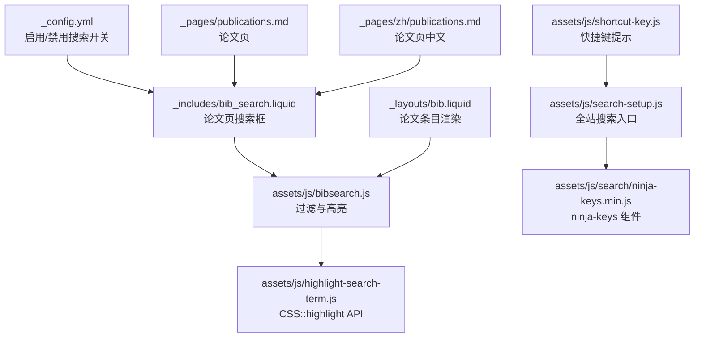
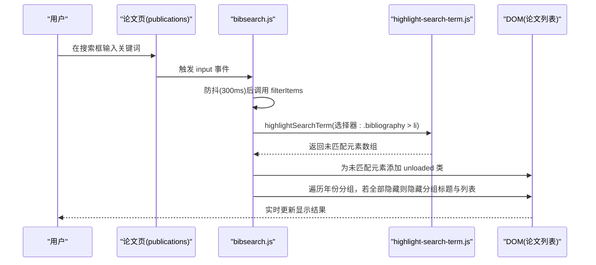
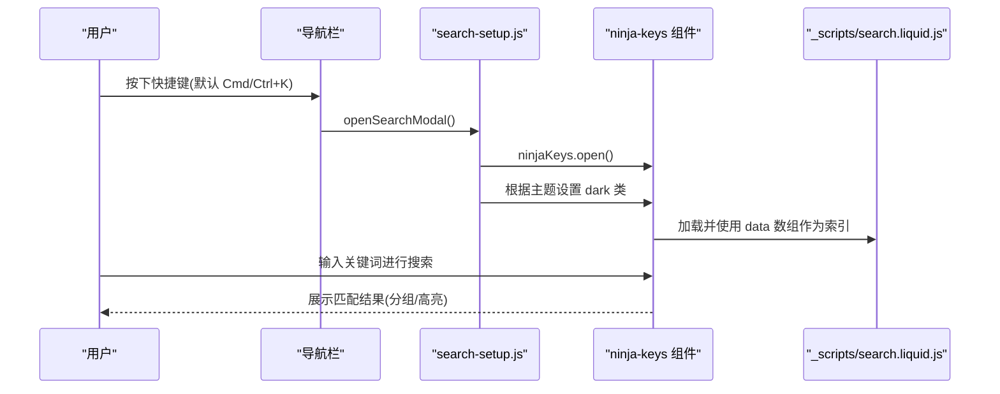
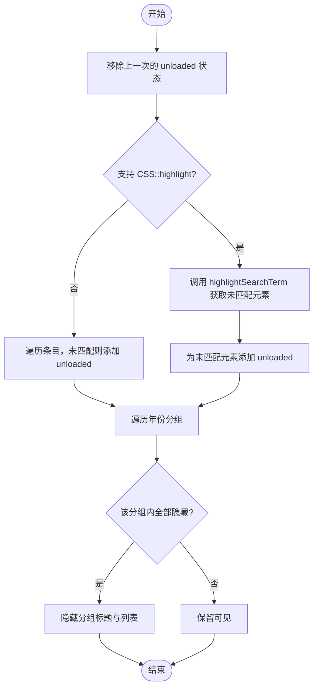
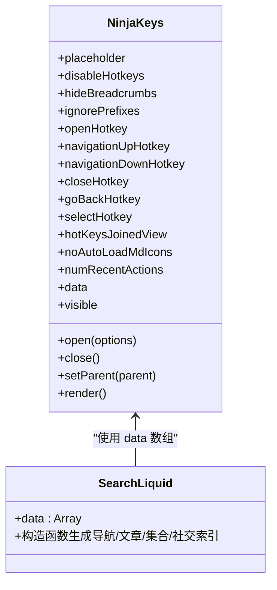
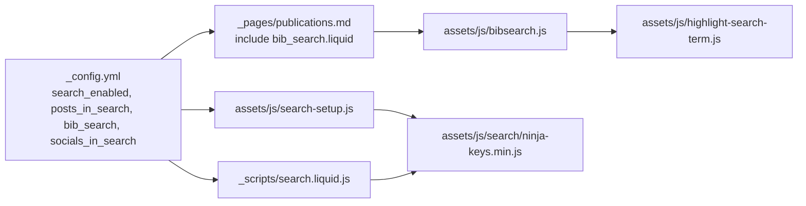

# 搜索和筛选功能

<cite>
**本文档引用的文件**
- [_scripts/search.liquid.js](file://_scripts/search.liquid.js)
- [assets/js/bibsearch.js](file://assets/js/bibsearch.js)
- [assets/js/highlight-search-term.js](file://assets/js/highlight-search-term.js)
- [assets/js/search-setup.js](file://assets/js/search-setup.js)
- [assets/js/shortcut-key.js](file://assets/js/shortcut-key.js)
- [assets/js/search/ninja-keys.min.js](file://assets/js/search/ninja-keys.min.js)
- [_includes/bib_search.liquid](file://_includes/bib_search.liquid)
- [_pages/publications.md](file://_pages/publications.md)
- [_pages/zh/publications.md](file://_pages/zh/publications.md)
- [_layouts/bib.liquid](file://_layouts/bib.liquid)
- [_sass/_publications.scss](file://_sass/_publications.scss)
- [_config.yml](file://_config.yml)
- [CUSTOMIZE.md](file://CUSTOMIZE.md)
- [TROUBLESHOOTING.md](file://TROUBLESHOOTING.md)
</cite>

## 目录
1. [简介](#简介)
2. [项目结构](#项目结构)
3. [核心组件](#核心组件)
4. [架构总览](#架构总览)
5. [详细组件分析](#详细组件分析)
6. [依赖关系分析](#依赖关系分析)
7. [性能考虑](#性能考虑)
8. [故障排查指南](#故障排查指南)
9. [结论](#结论)
10. [附录](#附录)

## 简介
本文件系统性梳理该站点的搜索与筛选功能，覆盖以下方面：
- 论文搜索：基于浏览器原生 API 的高亮与过滤、按年份分组隐藏逻辑
- 全站搜索：基于 ninja-keys 的快捷搜索框，支持导航、文章、社交等多维索引
- 实时搜索：防抖输入、URL 哈希联动、无刷新更新
- 用户体验：主题适配、快捷键提示、移动端兼容
- 自定义扩展：如何新增搜索字段与筛选条件
- 性能优化：大体量数据下的处理策略
- 调试与测试：常见问题定位与验证方法

## 项目结构
围绕搜索与筛选的关键文件组织如下：
- 配置开关：在站点配置中启用/禁用各类搜索功能
- 页面集成：论文页通过 include 引入搜索框
- 样式支持：论文列表与高亮样式
- 功能脚本：论文搜索、高亮、全站搜索入口、快捷键提示

**图表来源**
- [_config.yml:57-60](file://_config.yml#L57-L60)
- [_includes/bib_search.liquid:1-4](file://_includes/bib_search.liquid#L1-L4)
- [assets/js/bibsearch.js:1-71](file://assets/js/bibsearch.js#L1-L71)
- [assets/js/highlight-search-term.js:1-111](file://assets/js/highlight-search-term.js#L1-L111)
- [_pages/publications.md:1-22](file://_pages/publications.md#L1-L22)
- [_pages/zh/publications.md:1-19](file://_pages/zh/publications.md#L1-L19)
- [_layouts/bib.liquid:1-396](file://_layouts/bib.liquid#L1-L396)
- [assets/js/search-setup.js:1-18](file://assets/js/search-setup.js#L1-L18)
- [assets/js/search/ninja-keys.min.js:1-39](file://assets/js/search/ninja-keys.min.js#L1-L39)
- [assets/js/shortcut-key.js:1-11](file://assets/js/shortcut-key.js#L1-L11)

**章节来源**
- [_config.yml:57-60](file://_config.yml#L57-L60)
- [_includes/bib_search.liquid:1-4](file://_includes/bib_search.liquid#L1-L4)
- [_pages/publications.md:1-22](file://_pages/publications.md#L1-L22)
- [_pages/zh/publications.md:1-19](file://_pages/zh/publications.md#L1-L19)
- [_layouts/bib.liquid:1-396](file://_layouts/bib.liquid#L1-L396)
- [assets/js/bibsearch.js:1-71](file://assets/js/bibsearch.js#L1-L71)
- [assets/js/highlight-search-term.js:1-111](file://assets/js/highlight-search-term.js#L1-L111)
- [assets/js/search-setup.js:1-18](file://assets/js/search-setup.js#L1-L18)
- [assets/js/search/ninja-keys.min.js:1-39](file://assets/js/search/ninja-keys.min.js#L1-L39)
- [assets/js/shortcut-key.js:1-11](file://assets/js/shortcut-key.js#L1-L11)

## 核心组件
- 论文搜索与高亮
  - 使用 CSS::highlight API 进行语义高亮；若不支持则回退到类名控制
  - 对每个条目进行匹配判断，未匹配项添加“unloaded”类以隐藏
  - 年份分组逻辑：当某年份下所有条目均被隐藏时，连同年份标题与列表一并隐藏
- 全站搜索（ninja-keys）
  - 支持导航菜单、文章、集合文档、社交链接等多维索引
  - 键盘快捷键打开/关闭、上下选择、回车执行
  - 主题切换时自动适配深色/浅色样式
- 交互与体验
  - 输入防抖（300ms），避免频繁重绘
  - URL 哈希联动：页面加载或哈希变化时同步搜索框内容
  - 快捷键提示：根据平台显示 Cmd/Ctrl + K

**章节来源**
- [assets/js/bibsearch.js:5-51](file://assets/js/bibsearch.js#L5-L51)
- [assets/js/highlight-search-term.js:42-79](file://assets/js/highlight-search-term.js#L42-L79)
- [assets/js/search-setup.js:1-18](file://assets/js/search-setup.js#L1-L18)
- [assets/js/shortcut-key.js:1-11](file://assets/js/shortcut-key.js#L1-L11)
- [assets/js/search/ninja-keys.min.js:1-39](file://assets/js/search/ninja-keys.min.js#L1-L39)

## 架构总览
整体流程分为两部分：论文搜索与全站搜索。

**图表来源**
- [assets/js/bibsearch.js:5-51](file://assets/js/bibsearch.js#L5-L51)
- [assets/js/highlight-search-term.js:42-79](file://assets/js/highlight-search-term.js#L42-L79)
- [_pages/publications.md:15-15](file://_pages/publications.md#L15-L15)

**图表来源**
- [assets/js/search-setup.js:10-17](file://assets/js/search-setup.js#L10-L17)
- [assets/js/search/ninja-keys.min.js:1-39](file://assets/js/search/ninja-keys.min.js#L1-L39)
- [_scripts/search.liquid.js:8-102](file://_scripts/search.liquid.js#L8-L102)

## 详细组件分析

### 论文搜索与高亮组件
- 高亮实现
  - 优先使用 CSS.highlights API 创建高亮范围，支持语义化高亮
  - 若浏览器不支持，则回退为对未匹配条目添加“unloaded”类
- 过滤逻辑
  - 清除上一次的“unloaded”状态
  - 针对每个条目计算是否包含关键词，未匹配则隐藏
  - 年份分组：当某年份下所有条目都被隐藏时，隐藏该年份标题与列表
- 实时性
  - 输入事件采用 300ms 防抖
  - URL 哈希变化时同步搜索框内容

**图表来源**
- [assets/js/bibsearch.js:5-51](file://assets/js/bibsearch.js#L5-L51)
- [assets/js/highlight-search-term.js:42-79](file://assets/js/highlight-search-term.js#L42-L79)

**章节来源**
- [assets/js/bibsearch.js:1-71](file://assets/js/bibsearch.js#L1-L71)
- [assets/js/highlight-search-term.js:1-111](file://assets/js/highlight-search-term.js#L1-L111)
- [_sass/_publications.scss:136-182](file://_sass/_publications.scss#L136-L182)

### 全站搜索（ninja-keys）组件
- 数据源
  - 通过 Liquid 模板生成 ninja-keys 的 data 数组，包含导航、文章、集合文档、社交链接等
- 交互
  - 打开/关闭：默认 Cmd/Ctrl+K；支持上下移动、回车选择
  - 分组展示：按 section 分组，支持面包屑导航
- 主题适配
  - 根据当前主题自动添加/移除“dark”类，确保视觉一致

**图表来源**
- [assets/js/search/ninja-keys.min.js:1-39](file://assets/js/search/ninja-keys.min.js#L1-L39)
- [_scripts/search.liquid.js:8-102](file://_scripts/search.liquid.js#L8-L102)

**章节来源**
- [assets/js/search-setup.js:1-18](file://assets/js/search-setup.js#L1-L18)
- [assets/js/shortcut-key.js:1-11](file://assets/js/shortcut-key.js#L1-L11)
- [assets/js/search/ninja-keys.min.js:1-39](file://assets/js/search/ninja-keys.min.js#L1-L39)
- [_scripts/search.liquid.js:1-342](file://_scripts/search.liquid.js#L1-L342)

### 页面与布局集成
- 论文页集成
  - 在论文页通过 include 引入搜索框与脚本
  - 使用 jekyll-scholar 生成的条目渲染模板
- 样式支持
  - “unloaded”类用于隐藏条目与分组
  - 高亮样式通过 ::highlight 伪元素实现

**章节来源**
- [_pages/publications.md:15-15](file://_pages/publications.md#L15-L15)
- [_pages/zh/publications.md:12-12](file://_pages/zh/publications.md#L12-L12)
- [_layouts/bib.liquid:1-396](file://_layouts/bib.liquid#L1-L396)
- [_sass/_publications.scss:136-182](file://_sass/_publications.scss#L136-L182)

## 依赖关系分析
- 配置依赖
  - 各项搜索功能由站点配置开关控制（论文搜索、文章搜索、全站搜索、社交搜索）
- 运行时依赖
  - 论文搜索依赖 CSS::highlight API 或回退机制
  - 全站搜索依赖 ninja-keys 组件及其数据源
- 样式依赖
  - “unloaded”类控制显示/隐藏
  - 主题切换影响 ninja-keys 的样式类

**图表来源**
- [_config.yml:57-60](file://_config.yml#L57-L60)
- [_pages/publications.md:15-15](file://_pages/publications.md#L15-L15)
- [assets/js/bibsearch.js:1-71](file://assets/js/bibsearch.js#L1-L71)
- [assets/js/highlight-search-term.js:1-111](file://assets/js/highlight-search-term.js#L1-L111)
- [assets/js/search-setup.js:1-18](file://assets/js/search-setup.js#L1-L18)
- [assets/js/search/ninja-keys.min.js:1-39](file://assets/js/search/ninja-keys.min.js#L1-L39)
- [_scripts/search.liquid.js:1-342](file://_scripts/search.liquid.js#L1-L342)

**章节来源**
- [_config.yml:57-60](file://_config.yml#L57-L60)
- [_pages/publications.md:1-22](file://_pages/publications.md#L1-L22)
- [assets/js/bibsearch.js:1-71](file://assets/js/bibsearch.js#L1-L71)
- [assets/js/search-setup.js:1-18](file://assets/js/search-setup.js#L1-L18)
- [assets/js/search/ninja-keys.min.js:1-39](file://assets/js/search/ninja-keys.min.js#L1-L39)
- [_scripts/search.liquid.js:1-342](file://_scripts/search.liquid.js#L1-L342)

## 性能考虑
- 防抖策略
  - 论文搜索对输入事件使用 300ms 防抖，减少高频重绘
- 高亮策略
  - 优先使用 CSS::highlight API，具备更好的性能与语义化能力
  - 不支持时回退到类名控制，避免全量 DOM 查询
- 分组隐藏
  - 仅在必要时隐藏年份分组，降低 DOM 变更成本
- 大数据量建议
  - 将搜索数据拆分为多个页面或分页，减少单页渲染压力
  - 使用服务端搜索或静态索引（如 Algolia）替代纯前端过滤
  - 对高亮范围进行批量处理，避免逐节点创建 Range

[本节为通用指导，无需特定文件引用]

## 故障排查指南
- 论文搜索无效
  - 确认已启用论文搜索开关
  - 检查页面是否正确引入搜索框与脚本
  - 确保站点配置包含有效 URL
- 全站搜索无响应
  - 检查快捷键是否触发（默认 Cmd/Ctrl+K）
  - 确认 ninja-keys 组件已加载且 data 数组非空
- 高亮不生效
  - 浏览器需支持 CSS::highlight API；若不支持会自动回退
- 快捷键显示异常
  - Mac 平台会自动替换为 Command 符号

**章节来源**
- [TROUBLESHOOTING.md:344-403](file://TROUBLESHOOTING.md#L344-L403)
- [assets/js/shortcut-key.js:1-11](file://assets/js/shortcut-key.js#L1-L11)
- [assets/js/search-setup.js:1-18](file://assets/js/search-setup.js#L1-L18)
- [assets/js/search/ninja-keys.min.js:1-39](file://assets/js/search/ninja-keys.min.js#L1-L39)

## 结论
该站点的搜索与筛选功能以轻量、可配置为核心设计原则：
- 论文搜索强调实时性与可读性，结合高亮与分组隐藏提升阅读体验
- 全站搜索通过 ninja-keys 提供统一入口，覆盖导航、文章、集合与社交
- 配置开关与主题适配确保功能灵活可控
- 面向大数据量场景，建议结合分页、服务端搜索或静态索引进一步优化

[本节为总结性内容，无需特定文件引用]

## 附录

### 自定义搜索字段与筛选条件
- 新增论文搜索字段
  - 在渲染模板中增加需要参与搜索的字段（如作者、会议、年份等）
  - 更新高亮选择器与过滤逻辑，确保新字段被纳入匹配
- 新增全站搜索索引
  - 在数据源生成处追加新的条目类型（如自定义集合、页面）
  - 设置 handler 函数以实现点击跳转或执行动作
- 筛选器扩展思路
  - 当前论文页采用“关键词匹配 + 分组隐藏”的方式
  - 如需多维筛选（年份、作者、会议等），可在现有基础上增加下拉筛选器，并结合“unloaded”类实现联动隐藏

**章节来源**
- [_layouts/bib.liquid:1-396](file://_layouts/bib.liquid#L1-L396)
- [_scripts/search.liquid.js:8-102](file://_scripts/search.liquid.js#L8-L102)
- [assets/js/bibsearch.js:5-51](file://assets/js/bibsearch.js#L5-L51)

### 搜索结果排序与高亮
- 排序
  - 全站搜索使用评分函数对结果进行排序
  - 论文搜索按匹配度与字母序综合排序
- 高亮
  - 使用 CSS::highlight API 创建高亮范围
  - 未匹配元素通过“unloaded”类隐藏，保持列表整洁

**章节来源**
- [assets/js/search/ninja-keys.min.js:1-39](file://assets/js/search/ninja-keys.min.js#L1-L39)
- [assets/js/highlight-search-term.js:42-79](file://assets/js/highlight-search-term.js#L42-L79)
- [assets/js/bibsearch.js:5-51](file://assets/js/bibsearch.js#L5-L51)

### 配置参考
- 启用/禁用开关
  - 论文搜索、文章搜索、全站搜索、社交搜索均可在站点配置中开启/关闭
- 快捷键与主题
  - 默认快捷键为 Cmd/Ctrl+K
  - 主题切换时自动适配 ninja-keys 样式

**章节来源**
- [_config.yml:57-60](file://_config.yml#L57-L60)
- [CUSTOMIZE.md:847-863](file://CUSTOMIZE.md#L847-L863)
- [assets/js/shortcut-key.js:1-11](file://assets/js/shortcut-key.js#L1-L11)
- [assets/js/search-setup.js:1-18](file://assets/js/search-setup.js#L1-L18)