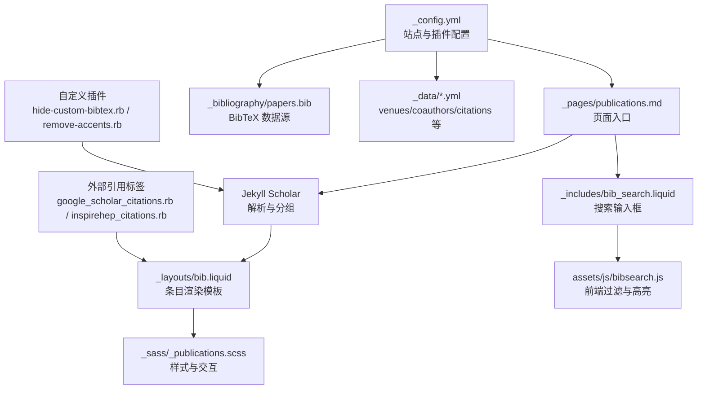
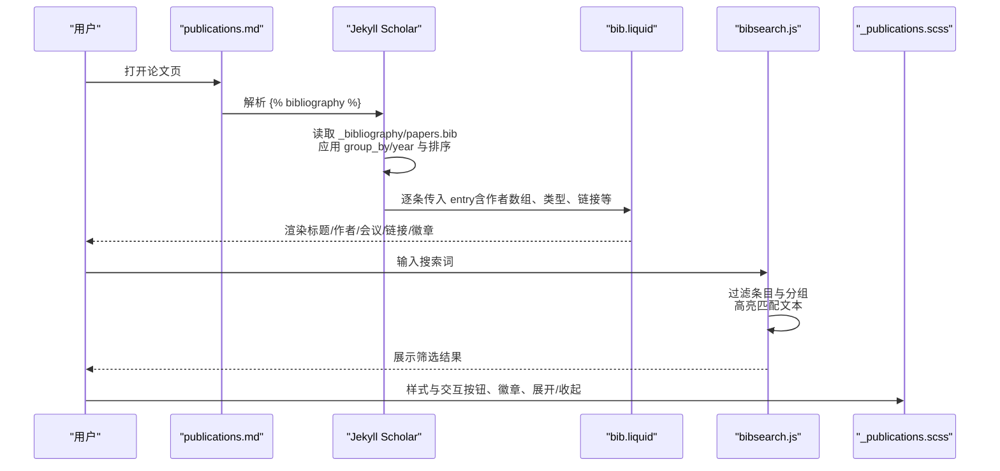
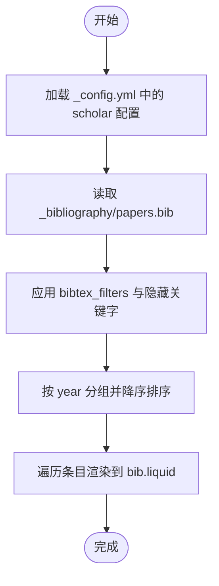
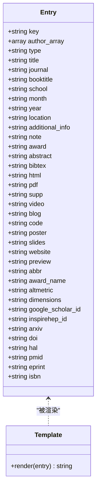
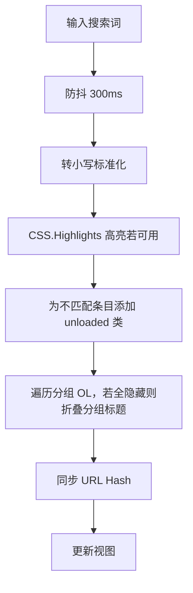
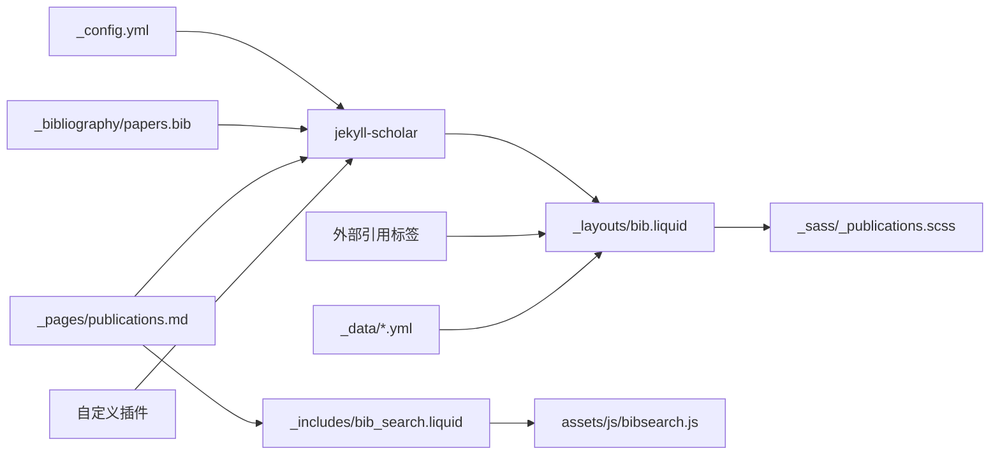

# 论文页面生成机制

<cite>
**本文引用的文件**
- [_config.yml](file://_config.yml)
- [_pages/publications.md](file://_pages/publications.md)
- [_layouts/bib.liquid](file://_layouts/bib.liquid)
- [_includes/bib_search.liquid](file://_includes/bib_search.liquid)
- [_includes/citation.liquid](file://_includes/citation.liquid)
- [_plugins/hide-custom-bibtex.rb](file://_plugins/hide-custom-bibtex.rb)
- [_plugins/google-scholar-citations.rb](file://_plugins/google-scholar-citations.rb)
- [_plugins/inspirehep-citations.rb](file://_plugins/inspirehep-citations.rb)
- [_plugins/remove-accents.rb](file://_plugins/remove-accents.rb)
- [_sass/_publications.scss](file://_sass/_publications.scss)
- [_data/venues.yml](file://_data/venues.yml)
- [_data/coauthors.yml](file://_data/coauthors.yml)
- [_data/citations.yml](file://_data/citations.yml)
- [_bibliography/papers.bib](file://_bibliography/papers.bib)
- [assets/js/bibsearch.js](file://assets/js/bibsearch.js)
</cite>

## 目录
1. [简介](#简介)
2. [项目结构](#项目结构)
3. [核心组件](#核心组件)
4. [架构总览](#架构总览)
5. [详细组件分析](#详细组件分析)
6. [依赖关系分析](#依赖关系分析)
7. [性能考量与缓存策略](#性能考量与缓存策略)
8. [故障排查指南](#故障排查指南)
9. [结论](#结论)
10. [附录](#附录)

## 简介
本文件面向“论文页面生成机制”，系统性阐述基于BibTeX数据自动生成论文页面的完整流程，覆盖数据读取、处理、渲染、排序与筛选、布局与样式定制、扩展元数据与显示逻辑，以及性能优化与缓存策略。目标读者既包括需要快速上手的使用者，也包括希望深度定制的开发者。

## 项目结构
该站点采用 Jekyll + jekyll-scholar 的组合：BibTeX 来源由配置项指定，页面通过 Liquid 模板渲染，前端 JavaScript 提供搜索与高亮功能，SCSS 负责样式组织。

图表来源
- [_config.yml](file://_config.yml)
- [_pages/publications.md](file://_pages/publications.md)
- [_layouts/bib.liquid](file://_layouts/bib.liquid)
- [_includes/bib_search.liquid](file://_includes/bib_search.liquid)
- [_sass/_publications.scss](file://_sass/_publications.scss)
- [_bibliography/papers.bib](file://_bibliography/papers.bib)
- [_plugins/hide-custom-bibtex.rb](file://_plugins/hide-custom-bibtex.rb)
- [_plugins/remove-accents.rb](file://_plugins/remove-accents.rb)
- [_plugins/google-scholar-citations.rb](file://_plugins/google-scholar-citations.rb)
- [_plugins/inspirehep-citations.rb](file://_plugins/inspirehep-citations.rb)

章节来源
- [_config.yml](file://_config.yml)
- [_pages/publications.md](file://_pages/publications.md)

## 核心组件
- 配置与数据源
  - 站点配置：Jekyll、jekyll-scholar、第三方库版本、可选特性开关等。
  - BibTeX 数据源：指定目录与文件名，模板名，分组字段与顺序。
  - 元数据：会议缩写映射、合著者链接、外部引用统计。
- 页面与模板
  - 页面入口：公开论文页，包含搜索组件与 bibliography 标签。
  - 条目模板：渲染单篇论文的标题、作者、会议信息、链接、徽章、隐藏块等。
- 前端交互
  - 搜索输入框与过滤脚本：支持关键词高亮与分组折叠。
- 自定义与扩展
  - 自定义过滤器：隐藏特定字段、去除重音符号。
  - 外部引用标签：从 Google Scholar 或 Inspire HEP 获取引用数。
- 样式层
  - 发表页样式：条目、缩略图、按钮、徽章、展开/收起动画等。

章节来源
- [_config.yml](file://_config.yml)
- [_layouts/bib.liquid](file://_layouts/bib.liquid)
- [_includes/bib_search.liquid](file://_includes/bib_search.liquid)
- [_sass/_publications.scss](file://_sass/_publications.scss)
- [_plugins/hide-custom-bibtex.rb](file://_plugins/hide-custom-bibtex.rb)
- [_plugins/remove-accents.rb](file://_plugins/remove-accents.rb)
- [_plugins/google-scholar-citations.rb](file://_plugins/google-scholar-citations.rb)
- [_plugins/inspirehep-citations.rb](file://_plugins/inspirehep-citations.rb)

## 架构总览
下图展示了从数据到页面渲染的关键路径，以及搜索与外部引用的集成点。

图表来源
- [_pages/publications.md](file://_pages/publications.md)
- [_config.yml](file://_config.yml)
- [_layouts/bib.liquid](file://_layouts/bib.liquid)
- [assets/js/bibsearch.js](file://assets/js/bibsearch.js)
- [_sass/_publications.scss](file://_sass/_publications.scss)

## 详细组件分析

### 数据读取与处理（Jekyll + jekyll-scholar）
- 数据源定位
  - 指定 BibTeX 目录与文件名，模板名，启用替换字符串与连接字符串。
- 分组与排序
  - 按年份分组，降序排列；查询表达式默认为全部条目。
- 字段预处理
  - 启用 LaTeX、小写、上标等过滤器；隐藏关键字字段（如 abbr、abstract、selected 等）。
- 作者与缩略图
  - 支持作者上限与“更多作者”动画；可选缩略图与会议徽章颜色。
- 外部徽章
  - 可选 Altmetric、Dimensions、Google Scholar、Inspire HEP 徽章。

图表来源
- [_config.yml](file://_config.yml)
- [_plugins/hide-custom-bibtex.rb](file://_plugins/hide-custom-bibtex.rb)

章节来源
- [_config.yml](file://_config.yml)
- [_plugins/hide-custom-bibtex.rb](file://_plugins/hide-custom-bibtex.rb)

### 页面布局模板（_layouts/bib.liquid）
- 结构组成
  - 缩略图区域（可选）：会议徽章、预览图。
  - 主内容区：标题、作者（含自我标注、合著者链接、更多作者动画）、会议/期刊/学位信息、日期与地点、附加信息。
  - 链接按钮：DOI、arXiv、HAL、HTML、PDF、Supp、Video、Blog、Code、Poster、Slides、Website、Award。
  - 外部徽章：Altmetric、Dimensions、Google Scholar（根据引用统计）、Inspire HEP。
  - 隐藏块：Award、Abstract、BibTeX、Video（嵌入或外链）。
- 关键逻辑
  - 作者上限与“更多作者”展开动画。
  - 会议类型判断（会议论文、期刊、论文集、学位论文）。
  - 会议徽章颜色与链接来自 venues.yml。
  - 引用徽章从 citations.yml 或外部服务获取。

图表来源
- [_layouts/bib.liquid](file://_layouts/bib.liquid)

章节来源
- [_layouts/bib.liquid](file://_layouts/bib.liquid)
- [_data/venues.yml](file://_data/venues.yml)
- [_data/citations.yml](file://_data/citations.yml)

### 论文列表排序与筛选
- 排序规则
  - 默认按年份降序；可通过配置调整 group_by 与 group_order。
- 筛选机制
  - 页面级：前端 JavaScript 实现关键词过滤，支持 CSS Highlights 高亮与分组折叠。
  - 搜索输入：防抖 300ms，支持 URL Hash 同步。
  - 隐藏未匹配条目与空分组，保持视觉整洁。

图表来源
- [_includes/bib_search.liquid](file://_includes/bib_search.liquid)
- [assets/js/bibsearch.js](file://assets/js/bibsearch.js)

章节来源
- [_includes/bib_search.liquid](file://_includes/bib_search.liquid)
- [assets/js/bibsearch.js](file://assets/js/bibsearch.js)

### 自定义页面布局与样式
- 布局扩展
  - 可在条目模板中插入钩子（hook），以在不修改核心模板的情况下扩展输出。
  - 作者上限与动画延迟可通过配置控制。
- 样式定制
  - 发表页样式集中于 _publications.scss，涵盖标题、作者、链接按钮、徽章、隐藏块展开动画等。
  - 缩略图、会议徽章颜色、悬停效果、响应式布局均可通过 SCSS 调整。

章节来源
- [_layouts/bib.liquid](file://_layouts/bib.liquid)
- [_sass/_publications.scss](file://_sass/_publications.scss)

### 添加额外元数据与自定义显示逻辑
- 在 BibTeX 中新增字段（如 award、annotation、additional_info 等），并在模板中读取与展示。
- 使用 venues.yml 为会议缩写提供颜色与链接；使用 coauthors.yml 为作者建立外部链接。
- 使用 hide-custom-bibtex.rb 过滤不需要出现在最终输出中的字段。
- 使用 remove-accents.rb 对作者名进行去重音处理，便于索引与匹配。

章节来源
- [_layouts/bib.liquid](file://_layouts/bib.liquid)
- [_plugins/hide-custom-bibtex.rb](file://_plugins/hide-custom-bibtex.rb)
- [_plugins/remove-accents.rb](file://_plugins/remove-accents.rb)
- [_data/venues.yml](file://_data/venues.yml)
- [_data/coauthors.yml](file://_data/coauthors.yml)

### 外部引用统计与徽章
- Google Scholar 引用数
  - 通过自定义 Liquid 标签抓取页面描述中的“被引次数”，并进行人性化数字格式化；带缓存字典避免重复请求。
- Inspire HEP 引用数
  - 通过 API 获取引用计数，同样进行人性化格式化与缓存。
- 模板集成
  - 在条目模板中根据是否存在 google_scholar_id 或 inspirehep_id 显示对应徽章；也可显示 Altmetric/Dimensions 徽章。

章节来源
- [_plugins/google-scholar-citations.rb](file://_plugins/google-scholar-citations.rb)
- [_plugins/inspirehep-citations.rb](file://_plugins/inspirehep-citations.rb)
- [_layouts/bib.liquid](file://_layouts/bib.liquid)

## 依赖关系分析
- 配置驱动：_config.yml 决定数据源、分组、排序、过滤器与可选特性。
- 模板耦合：页面入口依赖 jekyll-scholar 输出，条目模板依赖 venues/coauthors/citations 数据。
- 前端协作：搜索组件与样式共同实现交互体验。
- 插件扩展：自定义过滤器与外部引用标签增强数据处理与展示能力。

图表来源
- [_config.yml](file://_config.yml)
- [_pages/publications.md](file://_pages/publications.md)
- [_layouts/bib.liquid](file://_layouts/bib.liquid)
- [_includes/bib_search.liquid](file://_includes/bib_search.liquid)
- [_sass/_publications.scss](file://_sass/_publications.scss)
- [_plugins/hide-custom-bibtex.rb](file://_plugins/hide-custom-bibtex.rb)
- [_plugins/remove-accents.rb](file://_plugins/remove-accents.rb)
- [_plugins/google-scholar-citations.rb](file://_plugins/google-scholar-citations.rb)
- [_plugins/inspirehep-citations.rb](file://_plugins/inspirehep-citations.rb)
- [_data/venues.yml](file://_data/venues.yml)
- [_data/coauthors.yml](file://_data/coauthors.yml)
- [_data/citations.yml](file://_data/citations.yml)
- [_bibliography/papers.bib](file://_bibliography/papers.bib)

## 性能考量与缓存策略
- 服务器端缓存
  - Google Scholar 引用标签内部维护缓存字典，避免重复抓取同一文章的引用数。
  - BibTeX 关键字隐藏与 LaTeX/小写/上标等过滤器仅在构建时执行一次。
- 前端性能
  - 搜索输入采用 300ms 防抖，减少 DOM 更新频率。
  - CSS.Highlights 若不可用，回退为简单类名切换，保证兼容性与性能。
- 资源优化
  - 第三方库版本与完整性校验在配置中统一管理，便于缓存命中与安全校验。
  - 图片懒加载与响应式 WebP 图像处理提升加载速度（与论文页相关资源配合使用）。

章节来源
- [_plugins/google-scholar-citations.rb](file://_plugins/google-scholar-citations.rb)
- [assets/js/bibsearch.js](file://assets/js/bibsearch.js)
- [_config.yml](file://_config.yml)

## 故障排查指南
- 搜索无结果或异常
  - 检查是否启用了搜索功能与搜索输入框；确认前端脚本已加载。
  - 查看浏览器控制台是否有语法错误或模块加载失败。
- 引用数不显示或报错
  - 确认条目是否具备 google_scholar_id 或 inspirehep_id。
  - 查看外部服务接口是否可达，网络请求是否被拦截。
- BibTeX 字段未显示
  - 检查 filtered_bibtex_keywords 是否误删了所需字段。
  - 确认 bibtex_filters 是否影响了字段呈现。
- 作者链接或徽章异常
  - 检查 coauthors.yml 与 venues.yml 的键值是否正确。
  - 确认作者名去重音处理后能否匹配到预期条目。

章节来源
- [_includes/bib_search.liquid](file://_includes/bib_search.liquid)
- [assets/js/bibsearch.js](file://assets/js/bibsearch.js)
- [_plugins/google-scholar-citations.rb](file://_plugins/google-scholar-citations.rb)
- [_plugins/inspirehep-citations.rb](file://_plugins/inspirehep-citations.rb)
- [_plugins/hide-custom-bibtex.rb](file://_plugins/hide-custom-bibtex.rb)
- [_plugins/remove-accents.rb](file://_plugins/remove-accents.rb)
- [_data/venues.yml](file://_data/venues.yml)
- [_data/coauthors.yml](file://_data/coauthors.yml)

## 结论
该论文页面生成机制以 jekyll-scholar 为核心，结合自定义模板、前端搜索与样式系统，实现了从 BibTeX 到网页的自动化渲染。通过配置与插件扩展，可灵活控制排序、筛选、显示与性能表现；通过元数据与外部引用集成，进一步丰富了论文页的信息密度与可发现性。建议在团队协作中统一 BibTeX 字段命名与 venues/coauthors/citations 的维护规范，以获得更稳定与一致的生成结果。

## 附录
- 快速检查清单
  - 确认 _config.yml 中 scholar.source、scholar.bibliography、scholar.group_by、scholar.group_order 设置正确。
  - 确认 _pages/publications.md 中包含  与搜索组件。
  - 确认 _layouts/bib.liquid 中所需字段存在且模板逻辑符合预期。
  - 如需隐藏字段，确认 filtered_bibtex_keywords 包含目标关键字。
  - 如需作者链接或徽章，确认 venues.yml 与 coauthors.yml 键值正确。
  - 如需外部引用徽章，确认条目具备 google_scholar_id 或 inspirehep_id。