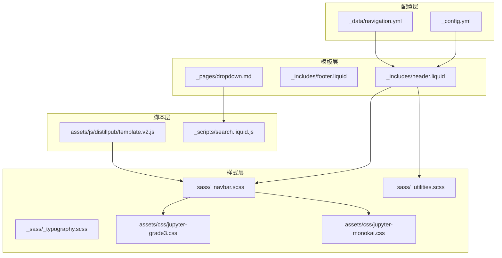
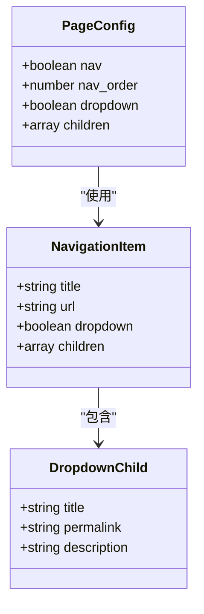
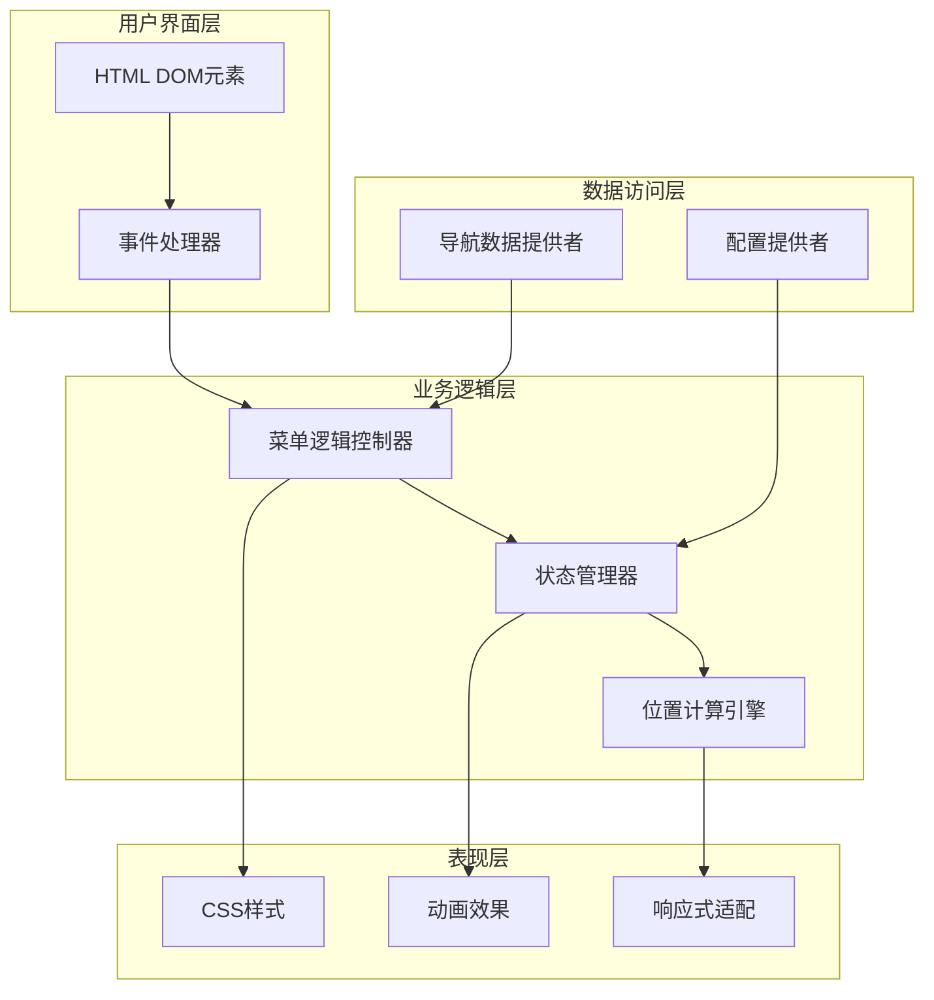
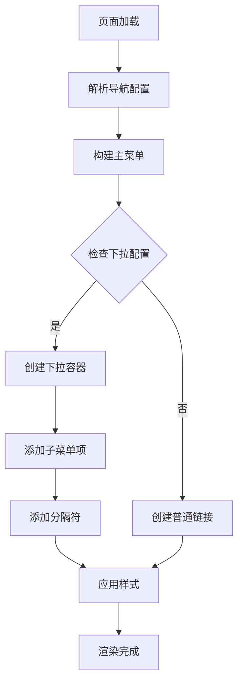
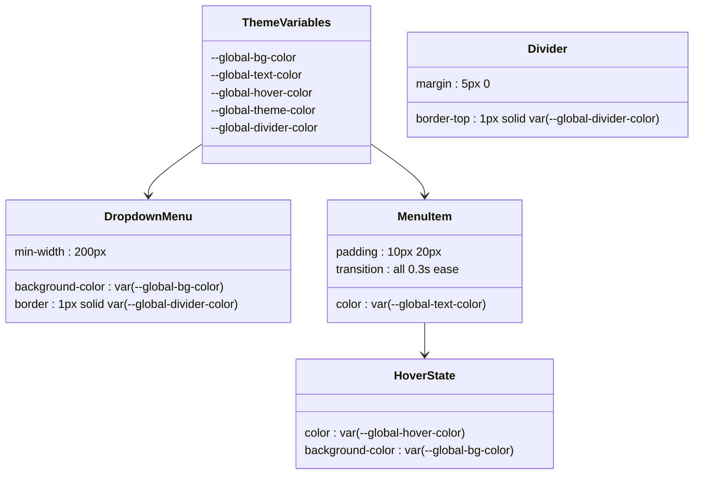
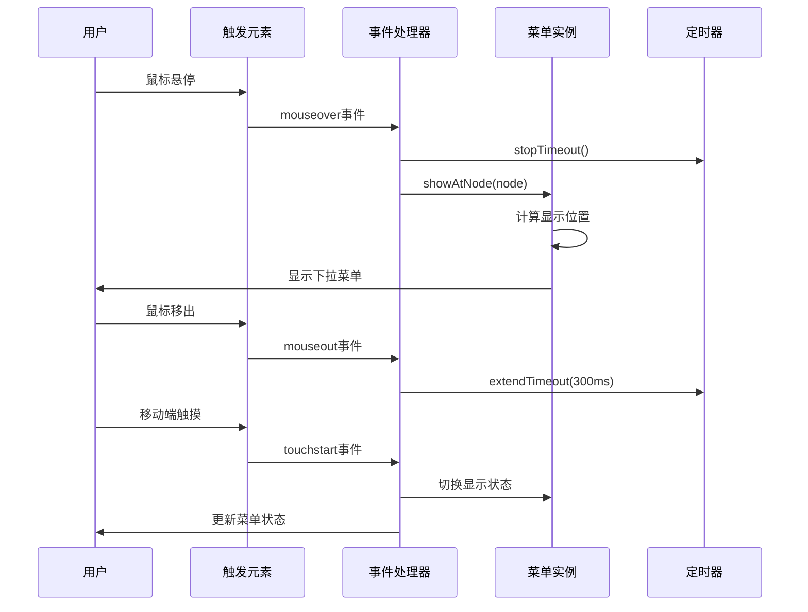
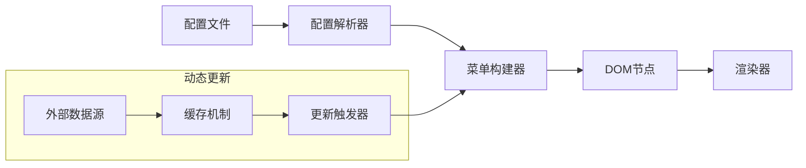
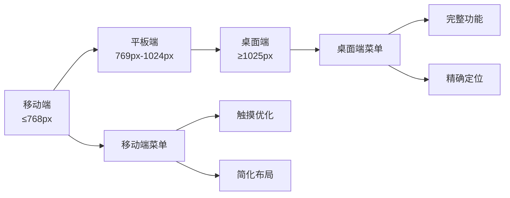
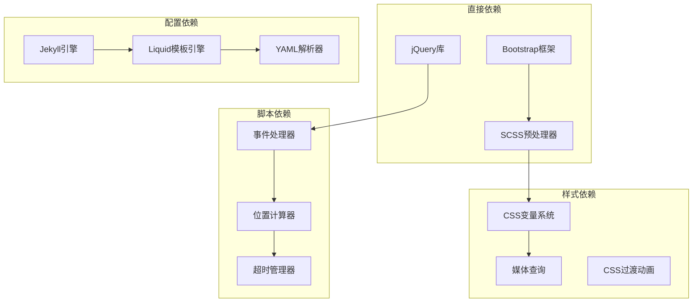

# 下拉菜单实现

<cite>
**本文档引用的文件**
- [_pages/dropdown.md](file://_pages/dropdown.md)
- [_sass/_navbar.scss](file://_sass/_navbar.scss)
- [_sass/_utilities.scss](file://_sass/_utilities.scss)
- [_sass/_typography.scss](file://_sass/_typography.scss)
- [_includes/header.liquid](file://_includes/header.liquid)
- [_includes/footer.liquid](file://_includes/footer.liquid)
- [_data/navigation.yml](file://_data/navigation.yml)
- [_config.yml](file://_config.yml)
- [assets/js/distillpub/template.v2.js](file://assets/js/distillpub/template.v2.js)
- [_scripts/search.liquid.js](file://_scripts/search.liquid.js)
- [assets/css/jupyter-grade3.css](file://assets/css/jupyter-grade3.css)
- [assets/css/jupyter-monokai.css](file://assets/css/jupyter-monokai.css)
</cite>

## 目录
1. [简介](#简介)
2. [项目结构](#项目结构)
3. [核心组件](#核心组件)
4. [架构概览](#架构概览)
5. [详细组件分析](#详细组件分析)
6. [依赖分析](#依赖分析)
7. [性能考虑](#性能考虑)
8. [故障排除指南](#故障排除指南)
9. [结论](#结论)

## 简介

本文件详细阐述了该Jekyll网站中下拉菜单的完整实现方案。下拉菜单作为主导航的重要组成部分，提供了层次化的页面导航功能，支持多级子菜单、响应式设计以及移动端触摸交互。系统通过Jekyll数据驱动的方式实现菜单的动态生成，并结合CSS和JavaScript确保良好的用户体验。

## 项目结构

下拉菜单实现涉及以下关键文件和目录：

**图表来源**
- [_config.yml:1-656](file://_config.yml#L1-L656)
- [_includes/header.liquid:1-108](file://_includes/header.liquid#L1-L108)
- [_sass/_navbar.scss:1-209](file://_sass/_navbar.scss#L1-L209)

**章节来源**
- [_config.yml:1-656](file://_config.yml#L1-L656)
- [_includes/header.liquid:1-108](file://_includes/header.liquid#L1-L108)
- [_sass/_navbar.scss:1-209](file://_sass/_navbar.scss#L1-L209)

## 核心组件

### 导航数据结构

下拉菜单的核心数据来源于Jekyll的数据文件系统，通过YAML格式定义导航结构：

**图表来源**
- [_data/navigation.yml:1-24](file://_data/navigation.yml#L1-L24)
- [_pages/dropdown.md:1-14](file://_pages/dropdown.md#L1-L14)

### 导航栏组件

主导航栏采用Bootstrap框架构建，支持响应式布局和主题切换：

**章节来源**
- [_includes/header.liquid:1-108](file://_includes/header.liquid#L1-L108)
- [_sass/_navbar.scss:1-209](file://_sass/_navbar.scss#L1-L209)

## 架构概览

下拉菜单系统采用分层架构设计，各层职责明确：

**图表来源**
- [_sass/_navbar.scss:13-30](file://_sass/_navbar.scss#L13-L30)
- [assets/js/distillpub/template.v2.js:4491-4587](file://assets/js/distillpub/template.v2.js#L4491-L4587)

## 详细组件分析

### HTML结构设计

下拉菜单的HTML结构基于Bootstrap的导航组件标准模式：

**图表来源**
- [_includes/header.liquid:47-59](file://_includes/header.liquid#L47-L59)
- [_pages/dropdown.md:6-13](file://_pages/dropdown.md#L6-L13)

### CSS样式实现

下拉菜单的样式系统采用CSS变量和媒体查询实现主题化和响应式设计：

#### 主题样式架构

**图表来源**
- [_sass/_navbar.scss:14-30](file://_sass/_navbar.scss#L14-L30)
- [_sass/_navbar.scss:32-49](file://_sass/_navbar.scss#L32-L49)

#### 响应式适配策略

下拉菜单在不同屏幕尺寸下采用自适应布局：

**章节来源**
- [_sass/_navbar.scss:175-209](file://_sass/_navbar.scss#L175-L209)
- [_sass/_utilities.scss:150-160](file://_sass/_utilities.scss#L150-L160)

### JavaScript事件处理机制

系统实现了完整的事件处理机制，支持多种交互方式：

#### 事件处理流程

**图表来源**
- [assets/js/distillpub/template.v2.js:4522-4547](file://assets/js/distillpub/template.v2.js#L4522-L4547)

#### 交互特性实现

系统支持以下交互方式：

1. **鼠标悬停触发**：通过mouseover/mouseout事件实现
2. **点击切换**：移动端触摸优化的点击行为
3. **延迟控制**：智能的显示/隐藏延迟机制
4. **边界检测**：自动调整菜单位置避免溢出

**章节来源**
- [assets/js/distillpub/template.v2.js:4495-4587](file://assets/js/distillpub/template.v2.js#L4495-L4587)

### 动态加载和内容更新

下拉菜单支持运行时的内容动态加载：

#### 数据驱动的菜单生成

**图表来源**
- [_scripts/search.liquid.js:22-35](file://_scripts/search.liquid.js#L22-L35)
- [_pages/dropdown.md:6-13](file://_pages/dropdown.md#L6-L13)

**章节来源**
- [_scripts/search.liquid.js:1-35](file://_scripts/search.liquid.js#L1-L35)
- [_pages/dropdown.md:1-14](file://_pages/dropdown.md#L1-L14)

### 样式定制选项

系统提供了丰富的样式定制能力：

#### 可定制属性列表

| 属性类别 | 可定制项 | 默认值 | 自定义方式 |
|---------|---------|--------|-----------|
| 颜色系统 | 背景色、文字色、悬停色 | CSS变量 | 修改主题变量 |
| 边框样式 | 边框宽度、样式、颜色 | 1px实线 | CSS覆盖 |
| 阴影效果 | 投影大小、模糊、颜色 | 无阴影 | box-shadow属性 |
| 内边距 | 上下左右内边距 | 10px 20px | padding属性 |
| 字体设置 | 字体族、大小、行高 | 系统默认 | font相关属性 |

**章节来源**
- [assets/css/jupyter-grade3.css:935-1022](file://assets/css/jupyter-grade3.css#L935-L1022)
- [assets/css/jupyter-monokai.css:935-1039](file://assets/css/jupyter-monokai.css#L935-L1039)

### 响应式适配和移动端支持

系统采用移动优先的设计理念：

#### 响应式断点策略

**图表来源**
- [_sass/_navbar.scss:175-209](file://_sass/_navbar.scss#L175-L209)

**章节来源**
- [_sass/_navbar.scss:118-156](file://_sass/_navbar.scss#L118-L156)
- [assets/js/distillpub/template.v2.js:4504-4519](file://assets/js/distillpub/template.v2.js#L4504-L4519)

## 依赖分析

下拉菜单系统的依赖关系如下：

**图表来源**
- [_config.yml:196-218](file://_config.yml#L196-L218)
- [_sass/_navbar.scss:1-6](file://_sass/_navbar.scss#L1-L6)

**章节来源**
- [_config.yml:196-218](file://_config.yml#L196-L218)
- [_sass/_typography.scss:46-46](file://_sass/_typography.scss#L46-L46)

## 性能考虑

### 加载优化策略

1. **懒加载实现**：下拉菜单仅在需要时加载相关内容
2. **CSS变量优化**：使用CSS变量减少重复样式定义
3. **事件委托**：通过事件委托减少事件监听器数量
4. **缓存机制**：利用浏览器缓存和CDN加速资源加载

### 运行时性能

1. **防抖处理**：鼠标悬停事件采用防抖机制避免频繁重绘
2. **虚拟滚动**：长列表采用虚拟滚动技术提升性能
3. **内存管理**：及时清理事件监听器和DOM引用
4. **GPU加速**：合理使用transform属性启用硬件加速

## 故障排除指南

### 常见问题及解决方案

#### 菜单不显示问题

**症状**：下拉菜单无法正常显示
**可能原因**：
1. JavaScript文件加载失败
2. CSS样式冲突
3. DOM元素未正确渲染

**解决步骤**：
1. 检查浏览器开发者工具中的错误信息
2. 验证CSS文件是否正确加载
3. 确认DOM结构符合预期

#### 响应式问题

**症状**：在移动设备上显示异常
**解决方法**：
1. 检查viewport元标签配置
2. 验证媒体查询断点设置
3. 测试不同设备的兼容性

#### 交互延迟问题

**症状**：菜单显示/隐藏有明显延迟
**优化建议**：
1. 减少DOM操作次数
2. 使用requestAnimationFrame优化动画
3. 启用硬件加速属性

**章节来源**
- [assets/js/distillpub/template.v2.js:4568-4579](file://assets/js/distillpub/template.v2.js#L4568-L4579)

## 结论

该下拉菜单实现方案展现了现代Web开发的最佳实践：

### 技术优势

1. **模块化设计**：清晰的分层架构便于维护和扩展
2. **主题化支持**：基于CSS变量的主题系统提供灵活的外观定制
3. **响应式适配**：全面的移动端支持确保跨设备一致性
4. **性能优化**：多项性能优化措施确保流畅的用户体验

### 扩展性特点

1. **数据驱动**：通过Jekyll数据文件实现内容的动态管理
2. **插件友好**：遵循标准的Web开发规范便于第三方集成
3. **可配置性强**：丰富的配置选项满足不同场景需求
4. **易于定制**：标准化的样式接口支持深度个性化

该实现为类似项目提供了完整的参考模板，既保证了功能完整性，又兼顾了性能和可维护性的平衡。