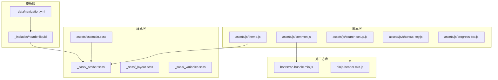
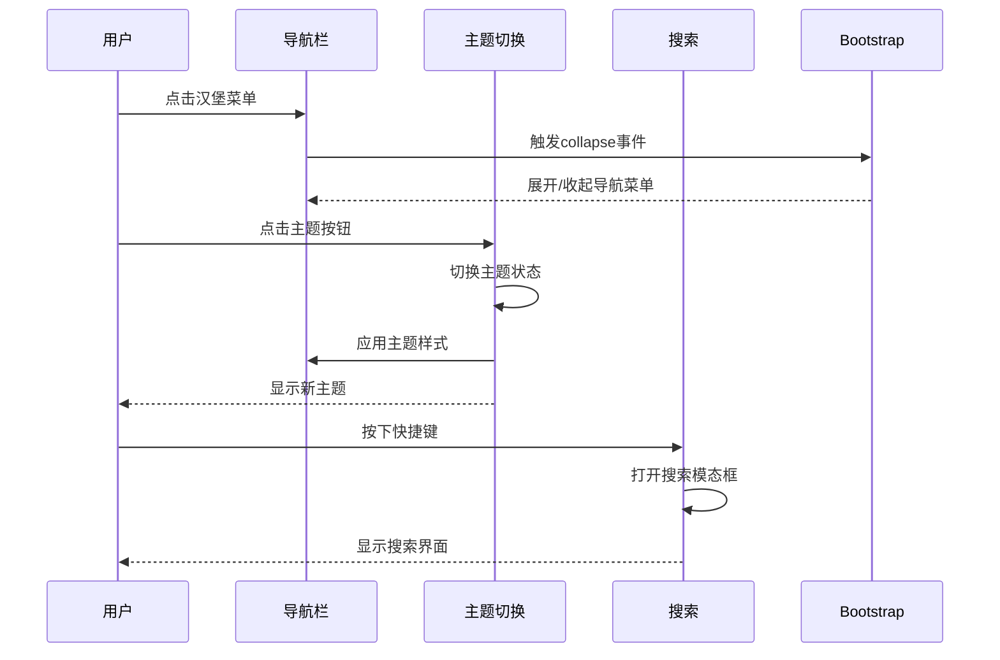
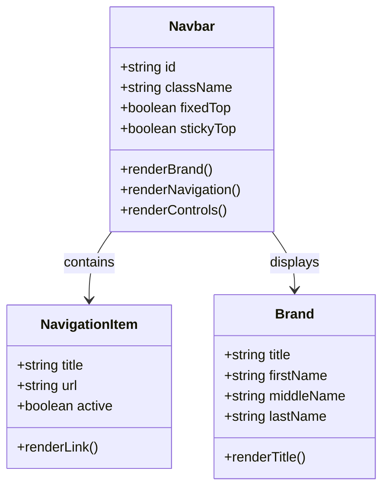
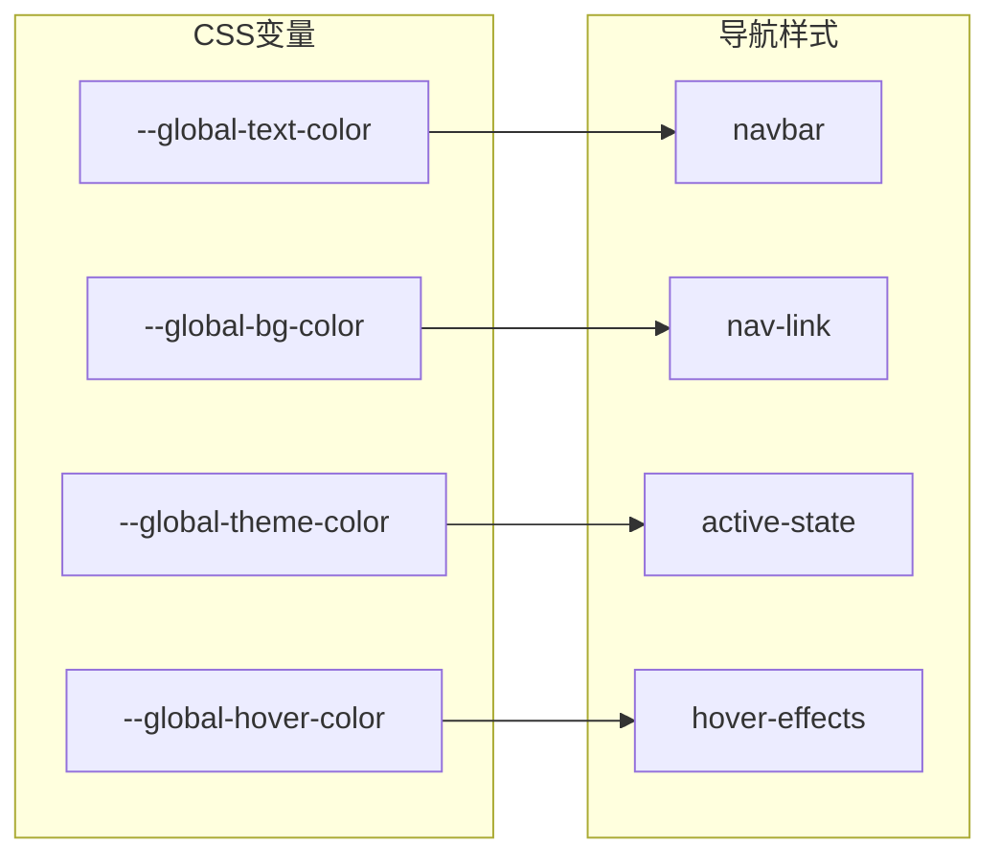
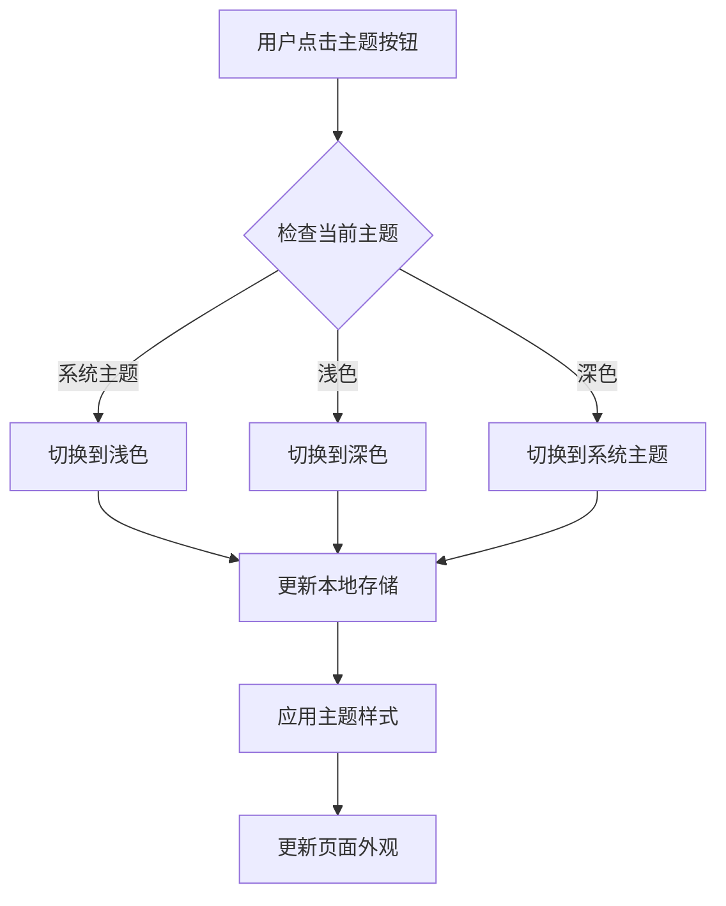
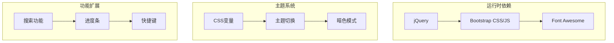

# 响应式导航设计

<cite>
**本文档引用的文件**
- [header.liquid](file://_includes/header.liquid)
- [_navbar.scss](file://_sass/_navbar.scss)
- [_layout.scss](file://_sass/_layout.scss)
- [_variables.scss](file://_sass/_variables.scss)
- [main.scss](file://assets/css/main.scss)
- [navigation.yml](file://_data/navigation.yml)
- [_config.yml](file://_config.yml)
- [common.js](file://assets/js/common.js)
- [theme.js](file://assets/js/theme.js)
- [search-setup.js](file://assets/js/search-setup.js)
- [shortcut-key.js](file://assets/js/shortcut-key.js)
- [progress-bar.js](file://assets/js/progress-bar.js)
- [bootstrap.bundle.min.js](file://assets/js/bootstrap.bundle.min.js)
- [ninja-header.min.js](file://assets/js/search/ninja-header.min.js)
</cite>

## 目录
1. [简介](#简介)
2. [项目结构](#项目结构)
3. [核心组件](#核心组件)
4. [架构概览](#架构概览)
5. [详细组件分析](#详细组件分析)
6. [依赖关系分析](#依赖关系分析)
7. [性能考虑](#性能考虑)
8. [故障排除指南](#故障排除指南)
9. [结论](#结论)

## 简介

本项目是一个基于Jekyll的个人网站，采用响应式导航设计。导航系统实现了从桌面端的水平布局到移动端的汉堡菜单的无缝适配，支持主题切换、搜索功能和无障碍访问。本文档将深入分析导航系统的架构设计、实现细节和最佳实践。

## 项目结构

该项目采用Jekyll静态站点生成器，导航系统主要由以下组件构成：

**图表来源**
- [header.liquid:1-108](file://_includes/header.liquid#L1-L108)
- [_navbar.scss:1-209](file://_sass/_navbar.scss#L1-L209)
- [main.scss:1-40](file://assets/css/main.scss#L1-L40)

**章节来源**
- [header.liquid:1-108](file://_includes/header.liquid#L1-L108)
- [_navbar.scss:1-209](file://_sass/_navbar.scss#L1-L209)
- [main.scss:1-40](file://assets/css/main.scss#L1-L40)

## 核心组件

### 导航栏容器
导航栏使用Bootstrap的navbar组件，支持固定定位和粘性定位两种模式。通过配置变量控制导航栏的位置行为。

### 汉堡菜单
移动端采用Bootstrap的navbar-toggler组件，通过CSS动画实现汉堡菜单的展开收起效果。菜单项使用flex布局实现水平排列。

### 主题切换
集成完整的主题切换系统，支持浅色、深色和系统主题三种模式，具有平滑的过渡动画效果。

### 搜索功能
集成ninja-keys搜索组件，提供快捷键触发的全局搜索功能，支持跨页面内容检索。

**章节来源**
- [header.liquid:3-45](file://_includes/header.liquid#L3-L45)
- [_navbar.scss:118-156](file://_sass/_navbar.scss#L118-L156)
- [theme.js:1-343](file://assets/js/theme.js#L1-L343)

## 架构概览

导航系统采用分层架构设计，各组件职责明确：

**图表来源**
- [header.liquid:32-45](file://_includes/header.liquid#L32-L45)
- [theme.js:4-22](file://assets/js/theme.js#L4-L22)
- [search-setup.js:10-17](file://assets/js/search-setup.js#L10-L17)

## 详细组件分析

### 导航栏结构分析

#### 桌面端布局
桌面端导航栏采用水平布局，导航项通过flex布局实现居右对齐。品牌区域显示网站标题或姓名，导航链接支持活动状态高亮。

**图表来源**
- [header.liquid:3-96](file://_includes/header.liquid#L3-L96)
- [navigation.yml:1-24](file://_data/navigation.yml#L1-L24)

#### 移动端适配
移动端采用汉堡菜单设计，通过CSS媒体查询在小屏幕上自动切换到折叠布局。菜单按钮使用三条线图标，点击时执行CSS变换动画。

**章节来源**
- [header.liquid:32-45](file://_includes/header.liquid#L32-L45)
- [_navbar.scss:118-156](file://_sass/_navbar.scss#L118-L156)

### 样式系统设计

#### CSS变量系统
导航系统使用CSS自定义属性实现主题化设计，所有颜色、字体和间距都可以通过变量进行统一管理。

**图表来源**
- [_navbar.scss:7-89](file://_sass/_navbar.scss#L7-L89)
- [_variables.scss:1-53](file://_sass/_variables.scss#L1-L53)

#### 媒体查询策略
系统采用移动优先的设计理念，通过多个断点实现不同屏幕尺寸的适配：

- `min-width: 576px`: 针对小型设备的额外样式调整
- `navbar-expand-sm`: Bootstrap内置的响应式断点

**章节来源**
- [_navbar.scss:175-179](file://_sass/_navbar.scss#L175-L179)
- [bootstrap.bundle.min.js:1-7](file://assets/js/bootstrap.bundle.min.js#L1-L7)

### JavaScript交互逻辑

#### 主题切换机制
主题切换系统支持三种模式：浅色、深色和系统跟随。通过本地存储持久化用户偏好，并实时更新DOM属性。

**图表来源**
- [theme.js:4-22](file://assets/js/theme.js#L4-L22)
- [theme.js:294-312](file://assets/js/theme.js#L294-L312)

#### 搜索交互流程
搜索功能通过快捷键触发，支持跨页面内容检索。系统会自动处理移动端菜单的折叠行为。

**章节来源**
- [search-setup.js:10-17](file://assets/js/search-setup.js#L10-L17)
- [shortcut-key.js:1-11](file://assets/js/shortcut-key.js#L1-L11)

### 无障碍访问实现

#### 键盘导航支持
导航系统完全支持键盘操作，包括Tab键导航、Enter键激活和Esc键关闭等功能。

#### 屏幕阅读器兼容
- 使用语义化的HTML结构
- 正确的ARIA属性设置
- 适当的语义标签使用

**章节来源**
- [header.liquid:35-39](file://_includes/header.liquid#L35-L39)

## 依赖关系分析

导航系统的主要依赖关系如下：

**图表来源**
- [bootstrap.bundle.min.js:1-7](file://assets/js/bootstrap.bundle.min.js#L1-L7)
- [main.scss:36-40](file://assets/css/main.scss#L36-L40)

**章节来源**
- [bootstrap.bundle.min.js:1-7](file://assets/js/bootstrap.bundle.min.js#L1-L7)
- [main.scss:1-40](file://assets/css/main.scss#L1-L40)

## 性能考虑

### 加载优化
- 使用CDN加载第三方库
- 启用压缩和缓存策略
- 按需加载JavaScript模块

### 渲染性能
- CSS动画使用GPU加速
- 减少重绘和回流操作
- 合理使用CSS变换而非改变布局属性

### 交互响应性
- 事件委托减少内存占用
- 防抖处理提升用户体验
- 平滑过渡动画优化视觉体验

## 故障排除指南

### 常见问题及解决方案

#### 导航栏不显示
检查CSS文件是否正确编译，确认navbar类名是否正确应用。

#### 主题切换无效
验证localStorage权限，检查CSS变量是否正确设置。

#### 搜索功能异常
确认ninja-keys组件是否正确加载，检查网络连接状态。

**章节来源**
- [theme.js:261-292](file://assets/js/theme.js#L261-L292)
- [search-setup.js:1-17](file://assets/js/search-setup.js#L1-L17)

## 结论

本响应式导航设计系统采用了现代化的前端技术栈，实现了优秀的跨设备兼容性和用户体验。通过模块化的架构设计、完善的无障碍访问支持和高效的性能优化，为用户提供了流畅的导航体验。系统的设计原则和实现模式可以作为类似项目的参考模板。