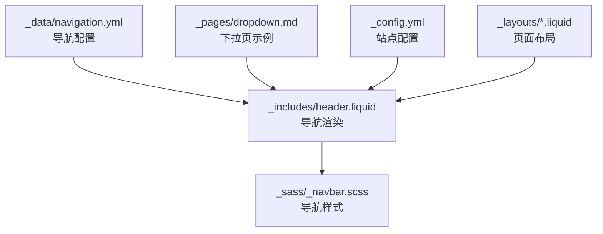
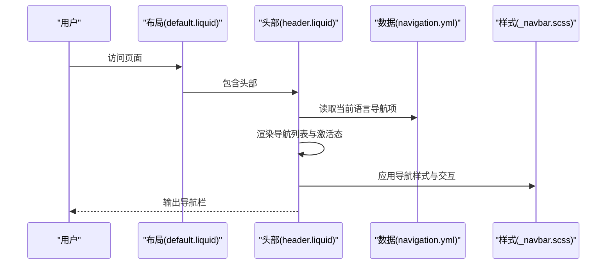
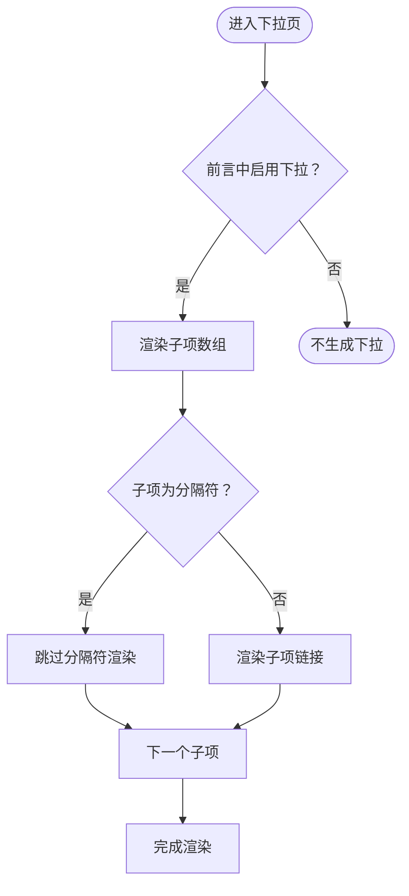
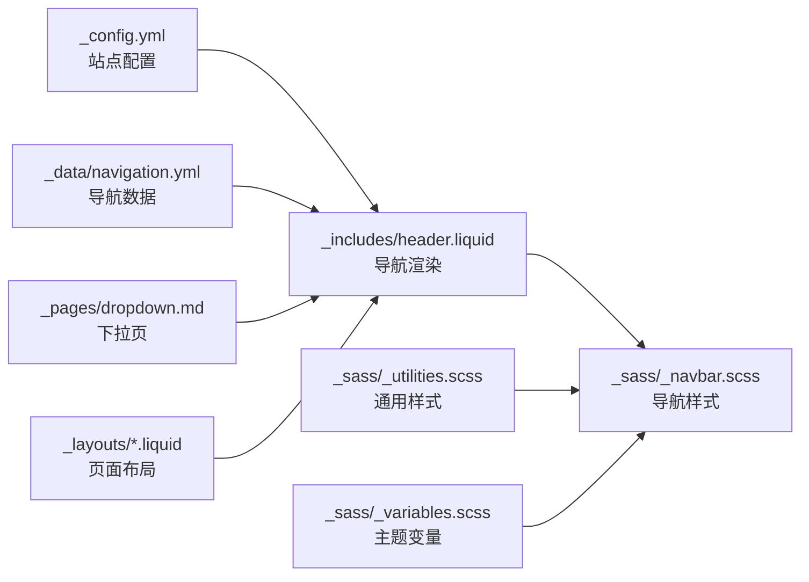
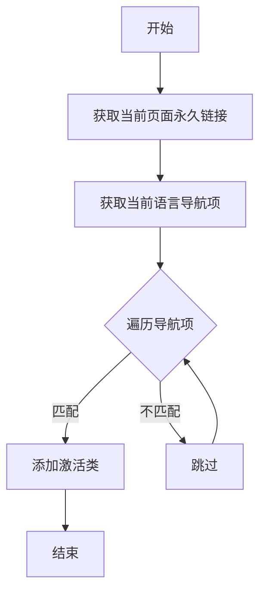

# 导航和菜单系统

<cite>
**本文档引用的文件**
- [_data/navigation.yml](file://_data/navigation.yml)
- [_includes/header.liquid](file://_includes/header.liquid)
- [_sass/_navbar.scss](file://_sass/_navbar.scss)
- [_pages/dropdown.md](file://_pages/dropdown.md)
- [_config.yml](file://_config.yml)
- [_layouts/default.liquid](file://_layouts/default.liquid)
- [_layouts/page.liquid](file://_layouts/page.liquid)
- [_sass/_utilities.scss](file://_sass/_utilities.scss)
- [_sass/_variables.scss](file://_sass/_variables.scss)
- [_sass/font-awesome/_animated.scss](file://_sass/font-awesome/_animated.scss)
- [_scripts/search.liquid.js](file://_scripts/search.liquid.js)
</cite>

## 目录
1. [简介](#简介)
2. [项目结构](#项目结构)
3. [核心组件](#核心组件)
4. [架构总览](#架构总览)
5. [详细组件分析](#详细组件分析)
6. [依赖关系分析](#依赖关系分析)
7. [性能考虑](#性能考虑)
8. [故障排除指南](#故障排除指南)
9. [结论](#结论)
10. [附录](#附录)

## 简介
本文件系统性阐述该 Jekyll 主题的导航与菜单系统，覆盖以下主题：
- 导航配置文件结构与字段定义（链接文本、URL 路径、下拉菜单等）
- 多语言导航支持机制与实现方法
- 下拉菜单的 HTML 结构与 CSS 样式配置
- 响应式导航栏设计与移动端适配策略
- 面包屑导航的生成逻辑与自定义方法
- 导航激活状态管理与样式定制
- 导航动画效果与用户体验优化
- 与页面内容的动态同步机制

## 项目结构
导航系统由三部分组成：
- 数据层：通过站点数据文件组织导航项
- 视图层：通过 Liquid 模板渲染导航结构
- 样式层：通过 SCSS 提供主题化与响应式样式

图表来源
- [_data/navigation.yml:1-24](file://_data/navigation.yml#L1-L24)
- [_includes/header.liquid:1-108](file://_includes/header.liquid#L1-L108)
- [_sass/_navbar.scss:1-209](file://_sass/_navbar.scss#L1-L209)
- [_pages/dropdown.md:1-14](file://_pages/dropdown.md#L1-L14)
- [_config.yml:1-200](file://_config.yml#L1-L200)

章节来源
- [_data/navigation.yml:1-24](file://_data/navigation.yml#L1-L24)
- [_includes/header.liquid:1-108](file://_includes/header.liquid#L1-L108)
- [_sass/_navbar.scss:1-209](file://_sass/_navbar.scss#L1-L209)
- [_pages/dropdown.md:1-14](file://_pages/dropdown.md#L1-L14)
- [_config.yml:1-200](file://_config.yml#L1-L200)

## 核心组件
- 导航配置文件：使用 YAML 组织多语言导航项，每项包含标题与 URL。
- 导航渲染模板：在头部模板中读取当前语言的导航项，渲染为列表项，并根据当前页面设置激活态。
- 下拉菜单：通过页面前言字段控制是否生成下拉菜单及子项。
- 样式与交互：SCSS 提供主题色、悬停态、激活态、汉堡菜单动画等；配置开关控制搜索、主题切换、语言切换等工具按钮。

章节来源
- [_data/navigation.yml:1-24](file://_data/navigation.yml#L1-L24)
- [_includes/header.liquid:47-96](file://_includes/header.liquid#L47-L96)
- [_sass/_navbar.scss:51-116](file://_sass/_navbar.scss#L51-L116)
- [_pages/dropdown.md:1-14](file://_pages/dropdown.md#L1-L14)

## 架构总览
导航系统采用“数据驱动 + 模板渲染 + 样式主题化”的分层架构。数据来自站点数据文件，渲染由 Liquid 模板完成，样式由 SCSS 变量与组件类提供。

图表来源
- [_layouts/default.liquid:1-57](file://_layouts/default.liquid#L1-L57)
- [_includes/header.liquid:1-108](file://_includes/header.liquid#L1-L108)
- [_data/navigation.yml:1-24](file://_data/navigation.yml#L1-L24)
- [_sass/_navbar.scss:1-209](file://_sass/_navbar.scss#L1-L209)

## 详细组件分析

### 导航配置文件结构与字段定义
- 文件位置：[_data/navigation.yml:1-24](file://_data/navigation.yml#L1-L24)
- 结构要点：
  - 顶层键为语言代码（如 en、zh），值为导航项数组
  - 每个导航项包含：
    - title：显示文本（支持多语言）
    - url：绝对或相对 URL 路径
- 作用：作为导航渲染的数据源，配合页面语言变量选择对应语言的导航项

章节来源
- [_data/navigation.yml:1-24](file://_data/navigation.yml#L1-L24)

### 导航渲染与激活状态管理
- 模板位置：[_includes/header.liquid:47-59](file://_includes/header.liquid#L47-L59)
- 关键逻辑：
  - 读取当前语言导航项
  - 遍历渲染每个导航项为列表项
  - 激活状态：当页面永久链接与导航项 URL 完全匹配时添加激活类
  - 屏幕阅读器辅助：在当前页面对应的链接内包含“当前”标识
- 语言切换：模板内根据当前语言生成反向语言的跳转链接

章节来源
- [_includes/header.liquid:5-96](file://_includes/header.liquid#L5-L96)

### 多语言导航支持机制
- 语言选择：从页面变量读取当前语言，默认为站点默认语言
- 数据映射：按语言键从站点数据中取导航项
- 切换逻辑：根据当前语言决定目标 URL（例如从英文切换到中文时将路径中的 / 替换为 /zh/）

章节来源
- [_includes/header.liquid:5-94](file://_includes/header.liquid#L5-L94)
- [_config.yml:17-17](file://_config.yml#L17-L17)

### 下拉菜单的 HTML 结构与 CSS 样式
- 页面示例：[_pages/dropdown.md:1-14](file://_pages/dropdown.md#L1-L14)
  - 使用前言字段控制下拉行为：
    - dropdown: true 启用下拉
    - children: 子项数组，支持普通项与分隔符
- 样式配置：[_sass/_navbar.scss:14-30](file://_sass/_navbar.scss#L14-L30)
  - 下拉菜单背景、边框、分隔线颜色
  - 下拉项悬停与激活态颜色
- 汉堡菜单动画：SCSS 中定义了三条线段的旋转与透明度变化，形成“×”与三条线的切换动画

图表来源
- [_pages/dropdown.md:1-14](file://_pages/dropdown.md#L1-L14)
- [_sass/_navbar.scss:14-30](file://_sass/_navbar.scss#L14-L30)

章节来源
- [_pages/dropdown.md:1-14](file://_pages/dropdown.md#L1-L14)
- [_sass/_navbar.scss:14-30](file://_sass/_navbar.scss#L14-L30)

### 响应式导航栏设计与移动端适配
- 固定定位：根据站点配置决定导航栏固定顶部或粘性定位
- 折叠行为：使用 Bootstrap 的折叠容器与触发按钮，点击切换展开/收起
- 移动端动画：汉堡菜单三条线的旋转与透明度过渡，提升交互反馈
- 样式细节：品牌名、社交图标、搜索与主题切换按钮在小屏下的对齐与间距

章节来源
- [_includes/header.liquid:3-45](file://_includes/header.liquid#L3-L45)
- [_sass/_navbar.scss:118-156](file://_sass/_navbar.scss#L118-L156)

### 面包屑导航的生成逻辑与自定义方法
- 当前实现：仓库未提供专门的面包屑生成逻辑或模板
- 自定义建议：
  - 在页面布局中引入面包屑生成脚本（如搜索脚本的思路），基于页面层级与前言顺序生成路径
  - 将面包屑输出到页面特定区域，结合 SCSS 实现样式定制
- 动态同步：面包屑可依据页面的父级关系与导航顺序动态计算，保持与导航结构一致

[本节为概念性说明，不直接分析具体文件，故无章节来源]

### 导航激活状态管理与样式定制
- 激活判断：精确匹配页面永久链接与导航项 URL
- 样式表现：
  - 文本颜色与主题色联动
  - 字体加粗强调当前页
  - 悬停态颜色变化
- 定制方式：通过 SCSS 变量与类名覆盖，调整颜色、字体与背景

章节来源
- [_includes/header.liquid:51-57](file://_includes/header.liquid#L51-L57)
- [_sass/_navbar.scss:70-78](file://_sass/_navbar.scss#L70-L78)

### 导航动画效果与用户体验优化
- 动画资源：Font Awesome 动画类与媒体查询减少动画偏好
- 进度条动画：滚动进度条使用 CSS 动画与过渡
- 交互反馈：汉堡菜单旋转、悬停颜色过渡、主题切换图标尺寸固定避免布局抖动

章节来源
- [_sass/font-awesome/_animated.scss:84-97](file://_sass/font-awesome/_animated.scss#L84-L97)
- [_sass/_utilities.scss:117-123](file://_sass/_utilities.scss#L117-L123)
- [_sass/_navbar.scss:158-173](file://_sass/_navbar.scss#L158-L173)

### 与页面内容的动态同步机制
- 搜索数据动态：搜索脚本通过 Liquid 循环构建数据数组，包含页面标题与处理函数，实现内容与导航的动态关联
- 同步策略：
  - 以页面 URL 为索引，将导航项与页面内容建立映射
  - 在导航中增加搜索入口，点击后打开搜索模态，展示与导航项相关的页面结果

章节来源
- [_scripts/search.liquid.js:76-87](file://_scripts/search.liquid.js#L76-L87)

## 依赖关系分析
导航系统的关键依赖链如下：

图表来源
- [_config.yml:1-200](file://_config.yml#L1-L200)
- [_includes/header.liquid:1-108](file://_includes/header.liquid#L1-L108)
- [_data/navigation.yml:1-24](file://_data/navigation.yml#L1-L24)
- [_pages/dropdown.md:1-14](file://_pages/dropdown.md#L1-L14)
- [_sass/_navbar.scss:1-209](file://_sass/_navbar.scss#L1-L209)
- [_sass/_utilities.scss:1-126](file://_sass/_utilities.scss#L1-L126)
- [_sass/_variables.scss:1-53](file://_sass/_variables.scss#L1-L53)

章节来源
- [_config.yml:1-200](file://_config.yml#L1-L200)
- [_includes/header.liquid:1-108](file://_includes/header.liquid#L1-L108)
- [_data/navigation.yml:1-24](file://_data/navigation.yml#L1-L24)
- [_pages/dropdown.md:1-14](file://_pages/dropdown.md#L1-L14)
- [_sass/_navbar.scss:1-209](file://_sass/_navbar.scss#L1-L209)
- [_sass/_utilities.scss:1-126](file://_sass/_utilities.scss#L1-L126)
- [_sass/_variables.scss:1-53](file://_sass/_variables.scss#L1-L53)

## 性能考虑
- 渲染开销：导航项数量与嵌套深度直接影响 DOM 结构复杂度，建议控制下拉层级与子项数量
- 样式体积：SCSS 变量集中管理颜色与尺寸，便于复用与压缩
- 交互成本：动画与过渡在低端设备上可能带来额外开销，可通过系统偏好减少动画

[本节为通用指导，不直接分析具体文件，故无章节来源]

## 故障排除指南
- 激活状态不生效
  - 检查页面永久链接与导航项 URL 是否完全一致
  - 确认页面前言中未覆盖语言或路径导致匹配失败
- 多语言切换异常
  - 确认当前语言变量正确传递至模板
  - 检查目标语言的导航数据是否存在对应路径
- 下拉菜单不显示
  - 确认页面前言中已启用下拉并正确配置子项数组
  - 检查样式是否被覆盖或变量未生效
- 移动端菜单无法展开
  - 检查折叠容器 ID 与触发按钮的目标属性是否一致
  - 确认外部库（如 Bootstrap）加载正常

章节来源
- [_includes/header.liquid:5-96](file://_includes/header.liquid#L5-L96)
- [_pages/dropdown.md:1-14](file://_pages/dropdown.md#L1-L14)
- [_sass/_navbar.scss:118-156](file://_sass/_navbar.scss#L118-L156)

## 结论
该导航系统以简洁的数据驱动模式实现了多语言、响应式与可扩展的菜单体验。通过配置文件与模板的解耦，开发者可以轻松维护导航结构；通过 SCSS 的主题化能力，能够快速适配不同风格需求。建议在实际项目中：
- 明确导航层级与命名规范，避免深层嵌套
- 使用系统偏好减少动画，提升无障碍体验
- 将导航与搜索、面包屑等模块统一规划，确保一致性

[本节为总结性内容，不直接分析具体文件，故无章节来源]

## 附录

### 导航配置字段参考
- 语言键：en、zh 等
- 导航项字段：
  - title：显示文本
  - url：链接地址

章节来源
- [_data/navigation.yml:1-24](file://_data/navigation.yml#L1-L24)

### 激活状态判定流程

图表来源
- [_includes/header.liquid:51-57](file://_includes/header.liquid#L51-L57)