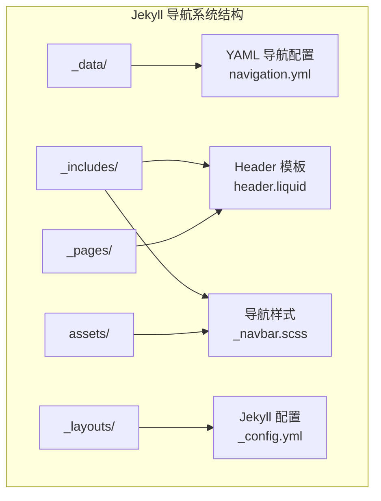
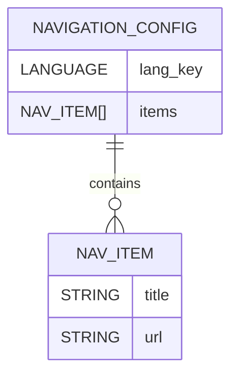
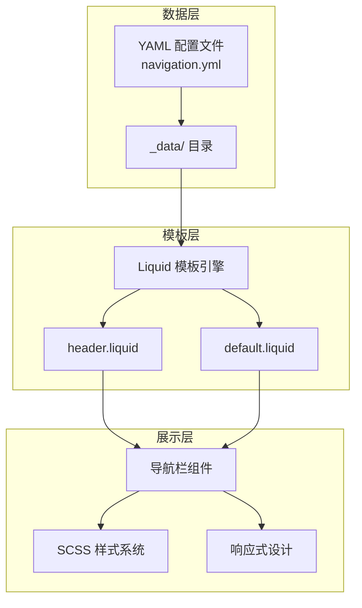
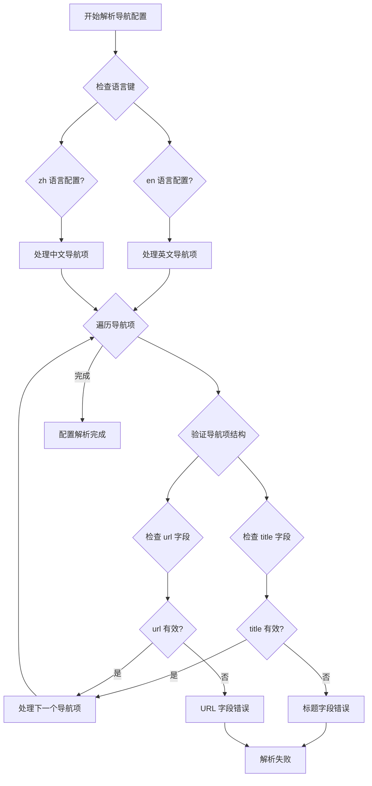
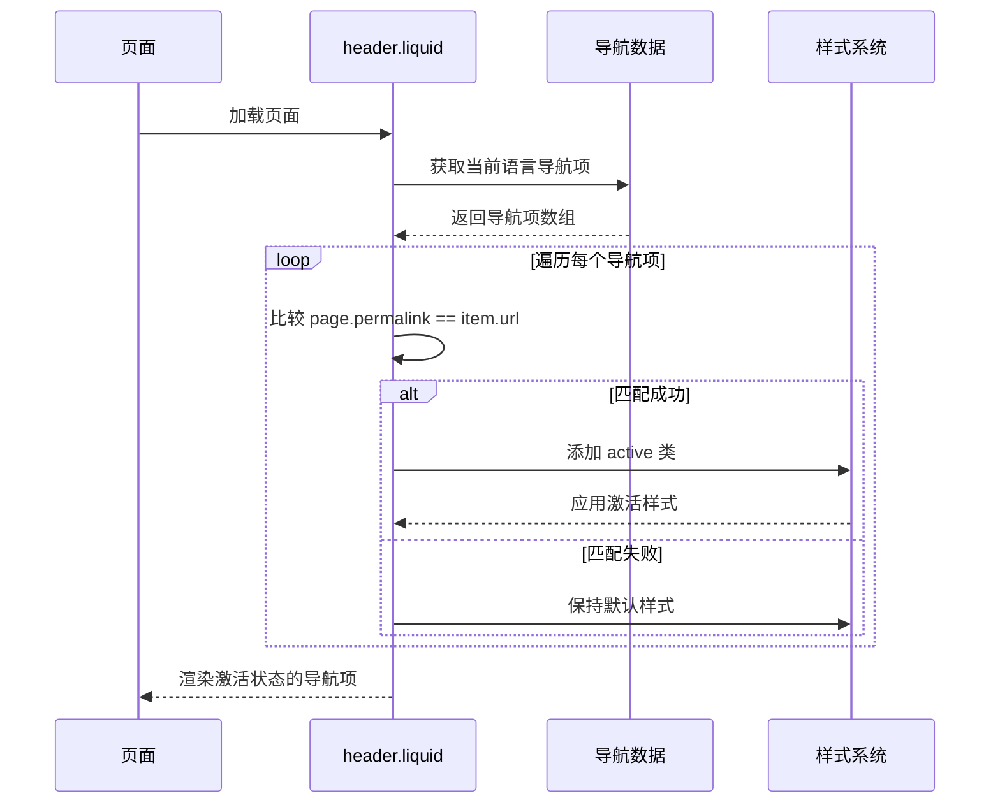
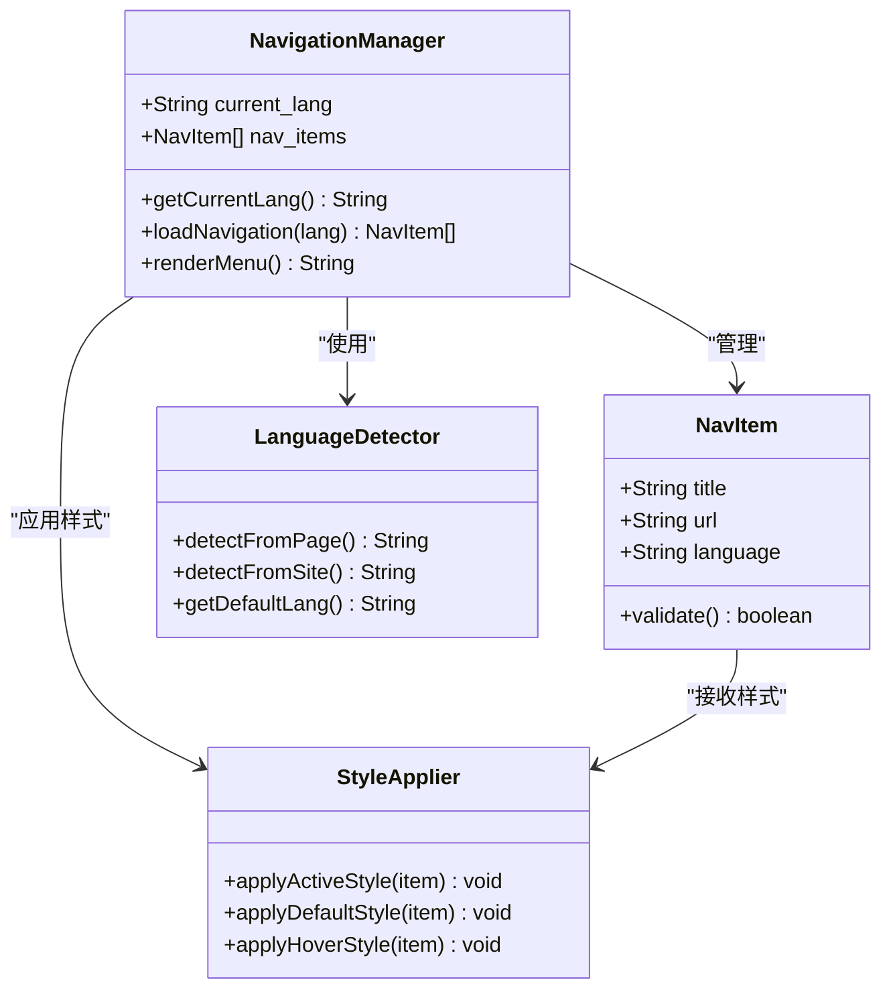
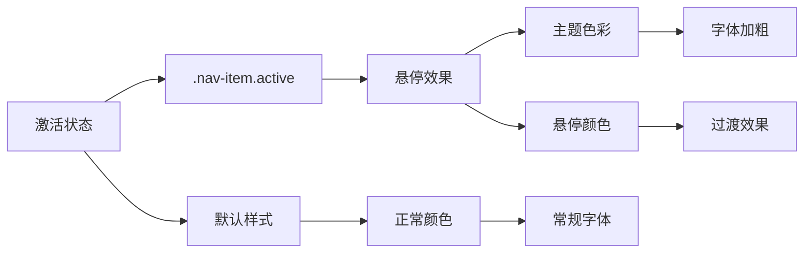
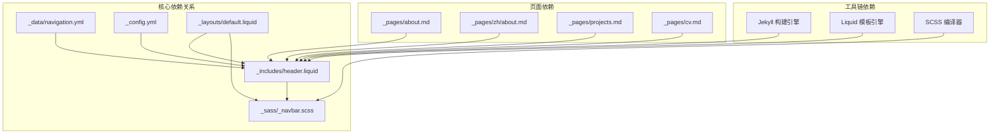

# 导航配置管理

<cite>
**本文档引用的文件**
- [_data/navigation.yml](file://_data/navigation.yml)
- [_includes/header.liquid](file://_includes/header.liquid)
- [_sass/_navbar.scss](file://_sass/_navbar.scss)
- [_config.yml](file://_config.yml)
- [_layouts/default.liquid](file://_layouts/default.liquid)
- [_pages/about.md](file://_pages/about.md)
- [_pages/projects.md](file://_pages/projects.md)
- [_pages/cv.md](file://_pages/cv.md)
- [_pages/zh/about.md](file://_pages/zh/about.md)
</cite>

## 目录
1. [简介](#简介)
2. [项目结构](#项目结构)
3. [核心组件](#核心组件)
4. [架构概览](#架构概览)
5. [详细组件分析](#详细组件分析)
6. [依赖关系分析](#依赖关系分析)
7. [性能考虑](#性能考虑)
8. [故障排除指南](#故障排除指南)
9. [结论](#结论)
10. [附录](#附录)

## 简介

导航配置管理系统是基于 Jekyll 和 Liquid 模板引擎构建的静态网站导航解决方案。该系统通过 YAML 配置文件管理导航菜单，结合 Liquid 模板实现动态渲染，并通过 SCSS 样式表提供响应式的视觉效果。

**更新** 系统已简化为单语言导航结构，移除了中文版本的 URL 前缀。所有页面 URL 现在直接指向英文路径，消除了之前的双语言导航结构差异。

本系统采用数据驱动的设计模式，通过 `_data` 目录中的 YAML 文件存储导航配置，通过 Liquid 模板在构建时进行渲染。当前实现支持单一语言导航，但保留了语言切换功能以适应未来的国际化需求。

## 项目结构

导航配置管理系统的文件组织遵循 Jekyll 的标准目录结构，主要涉及以下关键目录：



**图表来源**
- [_data/navigation.yml:1-24](file://_data/navigation.yml#L1-L24)
- [_includes/header.liquid:1-101](file://_includes/header.liquid#L1-L101)
- [_sass/_navbar.scss:1-209](file://_sass/_navbar.scss#L1-L209)

**章节来源**
- [_data/navigation.yml:1-24](file://_data/navigation.yml#L1-L24)
- [_includes/header.liquid:1-101](file://_includes/header.liquid#L1-L101)
- [_sass/_navbar.scss:1-209](file://_sass/_navbar.scss#L1-L209)

## 核心组件

### 导航配置数据结构

导航系统的核心是 `_data/navigation.yml` 文件，它采用层次化的 YAML 结构来定义导航菜单：



**图表来源**
- [_data/navigation.yml:1-24](file://_data/navigation.yml#L1-L24)

每个语言版本包含一个导航项数组，每个导航项具有以下属性：
- `title`: 显示在导航栏上的文本内容
- `url`: 导航链接的目标地址

**章节来源**
- [_data/navigation.yml:1-24](file://_data/navigation.yml#L1-L24)

### Liquid 模板渲染引擎

导航系统使用 Liquid 模板语言在构建时动态生成导航菜单。模板通过访问 `site.data.navigation` 变量来获取配置数据，并根据当前页面的语言设置选择相应的导航项。

**章节来源**
- [_includes/header.liquid:5-6](file://_includes/header.liquid#L5-L6)
- [_includes/header.liquid:50-59](file://_includes/header.liquid#L50-L59)

### 样式系统

导航栏的视觉表现通过 SCSS 样式表进行控制，支持主题切换、悬停效果和响应式设计。样式系统采用变量化设计，便于统一管理和定制。

**章节来源**
- [_sass/_navbar.scss:70-78](file://_sass/_navbar.scss#L70-L78)

## 架构概览

导航配置管理系统的整体架构采用三层设计模式：



**图表来源**
- [_data/navigation.yml:1-24](file://_data/navigation.yml#L1-L24)
- [_includes/header.liquid:1-101](file://_includes/header.liquid#L1-L101)
- [_layouts/default.liquid:1-57](file://_layouts/default.liquid#L1-L57)

系统的工作流程如下：

1. **配置加载**: Jekyll 在构建时读取 `_data/navigation.yml` 文件
2. **模板解析**: Liquid 模板引擎解析 `header.liquid` 模板
3. **数据绑定**: 将导航配置数据绑定到模板变量
4. **页面渲染**: 生成最终的 HTML 导航代码
5. **样式应用**: 应用 SCSS 样式表生成最终的视觉效果

**章节来源**
- [_config.yml:1-656](file://_config.yml#L1-L656)
- [_includes/header.liquid:1-101](file://_includes/header.liquid#L1-L101)

## 详细组件分析

### 导航配置文件结构

导航配置文件采用严格的 YAML 语法规范，确保数据的准确性和一致性：



**图表来源**
- [_data/navigation.yml:1-24](file://_data/navigation.yml#L1-L24)

**章节来源**
- [_data/navigation.yml:1-24](file://_data/navigation.yml#L1-L24)

### 导航激活状态判断逻辑

导航系统的激活状态判断基于页面的永久链接（permalink）与导航项 URL 的精确匹配：



**图表来源**
- [_includes/header.liquid:50-59](file://_includes/header.liquid#L50-L59)

激活状态的判断逻辑具有以下特点：
- 使用精确字符串比较确保匹配的准确性
- 支持相对路径和绝对路径的统一处理
- 自动处理首页的特殊显示逻辑

**章节来源**
- [_includes/header.liquid:50-59](file://_includes/header.liquid#L50-L59)

### 单语言导航实现机制

系统通过语言检测和动态数据加载实现单语言导航支持。虽然配置文件仍包含中英文键，但当前实现主要使用英文导航项：



**图表来源**
- [_includes/header.liquid:5-6](file://_includes/header.liquid#L5-L6)
- [_includes/header.liquid:80-94](file://_includes/header.liquid#L80-L94)

**章节来源**
- [_includes/header.liquid:5-6](file://_includes/header.liquid#L5-L6)
- [_includes/header.liquid:80-94](file://_includes/header.liquid#L80-L94)

### 导航项激活状态的样式应用

激活状态的视觉反馈通过 CSS 类实现，确保用户能够清晰识别当前所在页面：



**图表来源**
- [_sass/_navbar.scss:70-78](file://_sass/_navbar.scss#L70-L78)

**章节来源**
- [_sass/_navbar.scss:70-78](file://_sass/_navbar.scss#L70-L78)

## 依赖关系分析

导航配置管理系统各组件之间的依赖关系如下：



**图表来源**
- [_data/navigation.yml:1-24](file://_data/navigation.yml#L1-L24)
- [_includes/header.liquid:1-101](file://_includes/header.liquid#L1-L101)
- [_sass/_navbar.scss:1-209](file://_sass/_navbar.scss#L1-L209)
- [_config.yml:1-656](file://_config.yml#L1-L656)
- [_layouts/default.liquid:1-57](file://_layouts/default.liquid#L1-L57)

**章节来源**
- [_config.yml:1-656](file://_config.yml#L1-L656)
- [_layouts/default.liquid:1-57](file://_layouts/default.liquid#L1-L57)

## 性能考虑

导航系统的性能优化主要体现在以下几个方面：

### 数据加载优化
- 使用 Jekyll 的内置数据缓存机制
- 避免重复的数据解析和转换
- 合理的文件大小控制

### 渲染性能
- Liquid 模板的编译时优化
- 最小化的 DOM 操作
- CSS 样式的批量应用

### 缓存策略
- 浏览器端的静态资源缓存
- CDN 加速静态文件传输
- 增量构建支持

## 故障排除指南

### 常见配置错误及解决方案

#### YAML 语法错误
**问题症状**：构建时出现 YAML 解析错误
**解决方法**：
1. 检查缩进是否使用空格而非制表符
2. 验证冒号后的空格
3. 确认字符串值使用引号包围

#### 导航项缺失错误
**问题症状**：导航菜单显示不完整或空白
**解决方法**：
1. 验证导航项的 `title` 和 `url` 字段完整性
2. 检查 URL 路径的有效性
3. 确认语言键的正确性

#### 样式应用失败
**问题症状**：导航激活状态无法正确显示
**解决方法**：
1. 检查 CSS 类名的正确性
2. 验证样式文件的加载顺序
3. 确认样式优先级设置

**章节来源**
- [_data/navigation.yml:1-24](file://_data/navigation.yml#L1-L24)

### 调试技巧

#### 开发环境调试
- 使用浏览器开发者工具检查元素状态
- 验证 Liquid 模板的渲染结果
- 检查网络请求确认资源加载

#### 生产环境监控
- 监控页面加载性能指标
- 跟踪用户导航行为数据
- 定期检查配置文件的语法正确性

## 结论

导航配置管理系统通过精心设计的架构实现了高度可维护和可扩展的导航解决方案。系统采用数据驱动的设计理念，结合 Jekyll 的静态生成能力和 Liquid 模板的强大功能，为用户提供了流畅的导航体验。

**更新** 系统已简化为单语言导航结构，移除了复杂的双语言 URL 前缀处理，使配置更加简洁明了。当前实现支持单一语言导航，但保留了语言切换功能以适应未来的国际化需求。

该系统的主要优势包括：
- **模块化设计**：清晰的组件分离便于维护和扩展
- **简化的配置**：移除双语言结构后配置更加直观
- **性能优化**：静态生成确保快速的页面加载速度
- **样式灵活性**：SCSS 变量系统支持主题定制

未来可以考虑的功能增强包括：
- 动态导航项的条件显示
- 更丰富的导航交互效果
- 响应式导航菜单的进一步优化
- 导航历史记录和面包屑导航

## 附录

### 配置文件示例

#### 基础导航配置
```yaml
# 英文导航配置
en:
  - title: about
    url: /
  - title: publications
    url: /publications/
  - title: projects
    url: /projects/
  - title: cv
    url: /cv/
  - title: competitions
    url: /competitions/

# 中文导航配置（保留但当前不使用）
zh:
  - title: "关于"
    url: /zh/
  - title: "论文"
    url: /publications/
  - title: "项目"
    url: /projects/
  - title: "简历"
    url: /cv/
  - title: "竞赛"
    url: /competitions/
```

#### 高级配置选项
```yaml
# 支持子菜单的导航配置
en:
  - title: resources
    url: /resources/
    children:
      - title: books
        url: /books/
      - title: tools
        url: /tools/
```

### 最佳实践建议

#### 配置管理
- 保持导航项的有序排列
- 使用语义化的 URL 结构
- 统一的命名约定和缩进格式

#### 性能优化
- 控制导航项数量避免过度复杂
- 使用相对路径提高可移植性
- 定期清理无效的导航链接

#### 用户体验
- 确保导航项的可达性和有效性
- 提供清晰的导航层级结构
- 考虑移动设备的导航适配

**章节来源**
- [_data/navigation.yml:1-24](file://_data/navigation.yml#L1-L24)