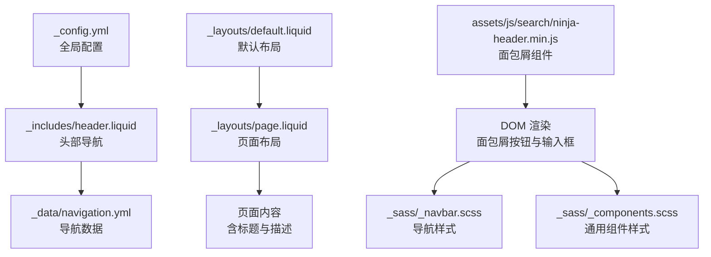
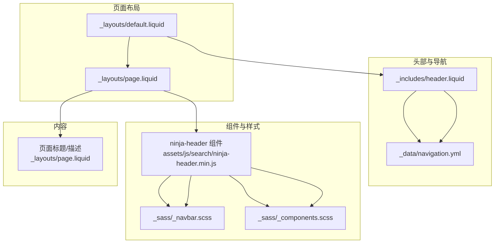
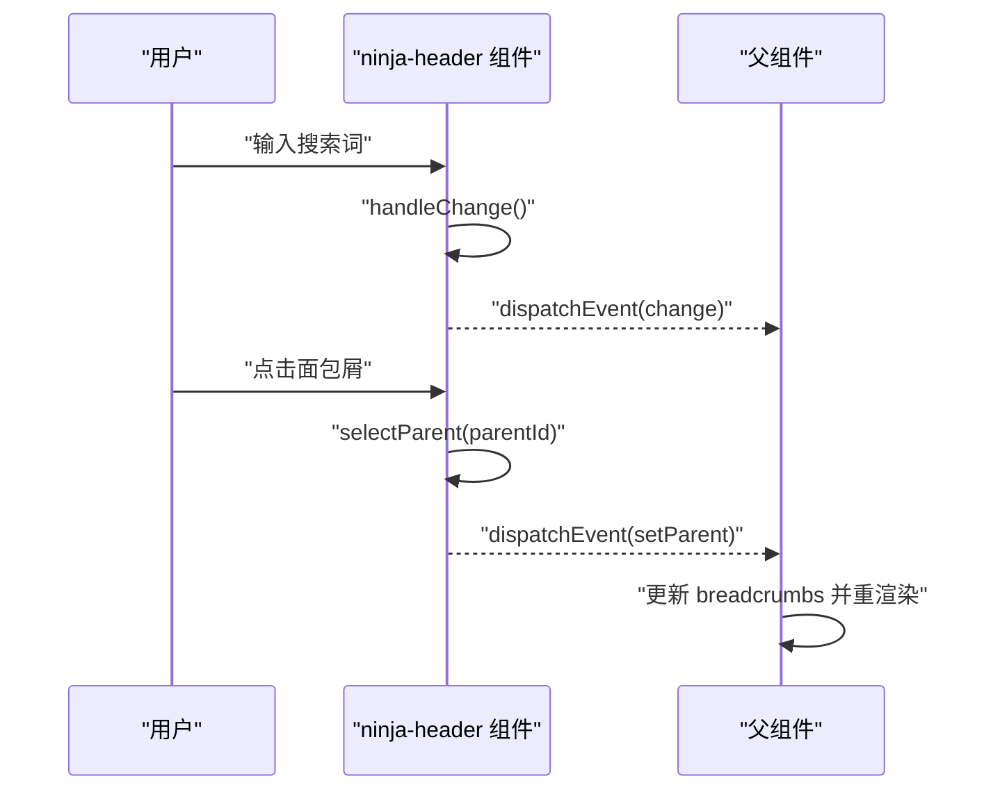
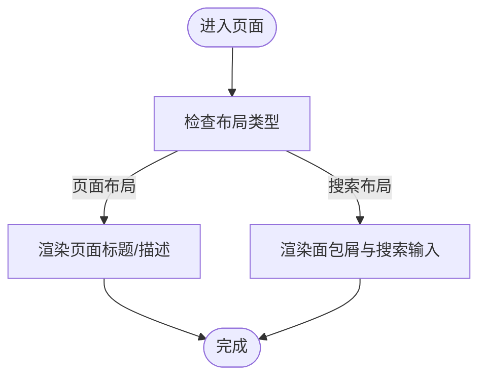
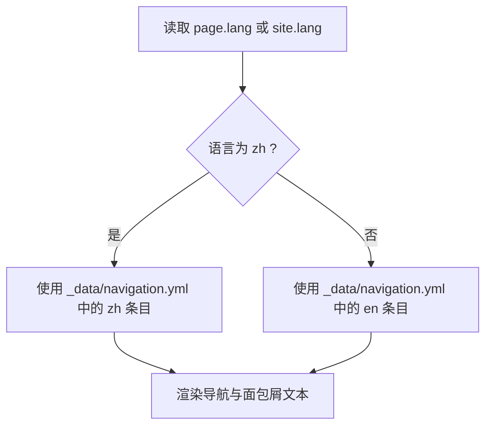
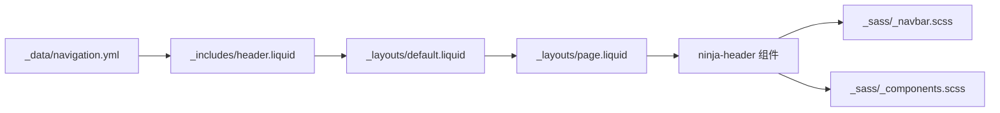

# 面包屑导航

<cite>
**本文档引用的文件**
- [_config.yml](file://_config.yml)
- [_layouts/default.liquid](file://_layouts/default.liquid)
- [_layouts/page.liquid](file://_layouts/page.liquid)
- [_includes/header.liquid](file://_includes/header.liquid)
- [_data/navigation.yml](file://_data/navigation.yml)
- [assets/js/search/ninja-header.min.js](file://assets/js/search/ninja-header.min.js)
- [_sass/_navbar.scss](file://_sass/_navbar.scss)
- [_sass/_components.scss](file://_sass/_components.scss)
</cite>

## 目录
1. [简介](#简介)
2. [项目结构](#项目结构)
3. [核心组件](#核心组件)
4. [架构总览](#架构总览)
5. [详细组件分析](#详细组件分析)
6. [依赖关系分析](#依赖关系分析)
7. [性能考量](#性能考量)
8. [故障排除指南](#故障排除指南)
9. [结论](#结论)
10. [附录](#附录)

## 简介
本文件系统性阐述该 Jekyll 站点中的“面包屑导航”实现与使用方式。根据仓库内容，站点采用基于 Web Components 的搜索入口组件（ninja-header）在搜索界面顶部展示面包屑式导航，用于层级浏览与返回上一级。文档覆盖以下主题：
- 面包屑的生成逻辑与显示规则（当前路径解析、上级页面自动识别）
- HTML 结构与语义化标记
- 样式定制与位置调整
- 与页面标题的关系与显示优先级
- 多语言环境下的文本翻译机制
- SEO 优化与结构化数据支持
- 可访问性与键盘导航支持

## 项目结构
与面包屑相关的关键文件分布如下：
- 布局层：default.liquid、page.liquid
- 导航数据：_data/navigation.yml
- 头部模板：_includes/header.liquid
- 搜索与面包屑组件：assets/js/search/ninja-header.min.js
- 样式：_sass/_navbar.scss、_sass/_components.scss
- 全局配置：_config.yml

图表来源
- [_config.yml:1-656](file://_config.yml#L1-L656)
- [_includes/header.liquid:1-108](file://_includes/header.liquid#L1-L108)
- [_data/navigation.yml:1-24](file://_data/navigation.yml#L1-L24)
- [_layouts/default.liquid:1-56](file://_layouts/default.liquid#L1-L56)
- [_layouts/page.liquid:1-32](file://_layouts/page.liquid#L1-L32)
- [assets/js/search/ninja-header.min.js:1-78](file://assets/js/search/ninja-header.min.js#L1-L78)
- [_sass/_navbar.scss:55-126](file://_sass/_navbar.scss#L55-L126)
- [_sass/_components.scss:1-262](file://_sass/_components.scss#L1-L262)

章节来源
- [_config.yml:1-656](file://_config.yml#L1-L656)
- [_layouts/default.liquid:1-56](file://_layouts/default.liquid#L1-L56)
- [_layouts/page.liquid:1-32](file://_layouts/page.liquid#L1-L32)
- [_includes/header.liquid:1-108](file://_includes/header.liquid#L1-L108)
- [_data/navigation.yml:1-24](file://_data/navigation.yml#L1-L24)
- [assets/js/search/ninja-header.min.js:1-78](file://assets/js/search/ninja-header.min.js#L1-L78)
- [_sass/_navbar.scss:55-126](file://_sass/_navbar.scss#L55-L126)
- [_sass/_components.scss:1-262](file://_sass/_components.scss#L1-L262)

## 核心组件
- Web Components 组件：ninja-header（面包屑与搜索输入）
  - 属性与行为
    - hideBreadcrumbs：控制是否隐藏面包屑
    - breadcrumbHome：首页面包屑文本
    - breadcrumbs：当前层级路径数组
    - placeholder：搜索输入占位符
  - 事件
    - change：搜索输入值变化时触发
    - setParent：点击面包屑返回上一级时触发
  - 渲染
    - 面包屑列表通过按钮元素渲染，点击后触发 setParent
    - 搜索输入位于面包屑下方，具备样式与交互

- 页面布局与标题
  - page.liquid 中包含页面标题与描述区域，作为页面内容的一部分
  - 默认布局 default.liquid 提供容器与脚本加载，确保组件可运行

- 导航数据与多语言
  - _data/navigation.yml 定义英文与中文导航项（标题与链接）
  - header.liquid 根据当前语言选择导航项，并在非首页显示站点标题

章节来源
- [assets/js/search/ninja-header.min.js:1-78](file://assets/js/search/ninja-header.min.js#L1-L78)
- [_layouts/page.liquid:1-32](file://_layouts/page.liquid#L1-L32)
- [_layouts/default.liquid:1-56](file://_layouts/default.liquid#L1-L56)
- [_includes/header.liquid:1-108](file://_includes/header.liquid#L1-L108)
- [_data/navigation.yml:1-24](file://_data/navigation.yml#L1-L24)

## 架构总览
下图展示了面包屑在页面中的位置、与布局和数据的关系：

图表来源
- [_layouts/default.liquid:1-56](file://_layouts/default.liquid#L1-L56)
- [_layouts/page.liquid:1-32](file://_layouts/page.liquid#L1-L32)
- [_includes/header.liquid:1-108](file://_includes/header.liquid#L1-L108)
- [_data/navigation.yml:1-24](file://_data/navigation.yml#L1-L24)
- [assets/js/search/ninja-header.min.js:1-78](file://assets/js/search/ninja-header.min.js#L1-L78)
- [_sass/_navbar.scss:55-126](file://_sass/_navbar.scss#L55-L126)
- [_sass/_components.scss:1-262](file://_sass/_components.scss#L1-L262)

## 详细组件分析

### Web Components：ninja-header（面包屑与搜索）
- 渲染逻辑
  - 当 hideBreadcrumbs 为 false 时，渲染面包屑列表；否则仅渲染搜索输入
  - 面包屑由 breadcrumbHome（首页）与 breadcrumbs 数组逐级拼接
  - 每个面包屑为按钮，点击触发 setParent 事件，父组件据此更新当前层级
- 事件流
  - 输入框变更：handleChange -> 触发 change 事件
  - 返回上一级：selectParent -> 触发 setParent 事件
- 样式要点
  - 面包屑按钮具有圆角、背景色、间距与字体族变量
  - 搜索输入区位于面包屑下方，具备占位符颜色与边框样式

图表来源
- [assets/js/search/ninja-header.min.js:1-78](file://assets/js/search/ninja-header.min.js#L1-L78)

章节来源
- [assets/js/search/ninja-header.min.js:1-78](file://assets/js/search/ninja-header.min.js#L1-L78)

### 页面布局与标题显示优先级
- page.liquid 中定义了页面标题与描述区域，作为页面内容的一部分
- 默认布局 default.liquid 提供容器与脚本加载，确保 ninja-header 组件可正常工作
- 面包屑与页面标题的关系
  - 面包屑位于搜索输入上方，属于导航辅助信息
  - 页面标题与描述位于内容区域，是页面主体信息
  - 两者显示优先级：面包屑（搜索界面）与页面标题（内容界面）分别在各自上下文中优先展示

图表来源
- [_layouts/page.liquid:1-32](file://_layouts/page.liquid#L1-L32)
- [_layouts/default.liquid:1-56](file://_layouts/default.liquid#L1-L56)
- [assets/js/search/ninja-header.min.js:1-78](file://assets/js/search/ninja-header.min.js#L1-L78)

章节来源
- [_layouts/page.liquid:1-32](file://_layouts/page.liquid#L1-L32)
- [_layouts/default.liquid:1-56](file://_layouts/default.liquid#L1-L56)

### 多语言环境与导航数据
- 导航数据通过 _data/navigation.yml 提供英文与中文两套
- header.liquid 根据 page.lang 或默认 site.lang 选择对应导航项
- 面包屑文本来源于导航数据中的标题字段，因此在多语言环境下会自动切换

图表来源
- [_includes/header.liquid:1-108](file://_includes/header.liquid#L1-L108)
- [_data/navigation.yml:1-24](file://_data/navigation.yml#L1-L24)

章节来源
- [_includes/header.liquid:1-108](file://_includes/header.liquid#L1-L108)
- [_data/navigation.yml:1-24](file://_data/navigation.yml#L1-L24)

## 依赖关系分析
- ninja-header 组件依赖于：
  - 自身样式（_sass/_navbar.scss、_sass/_components.scss）
  - 布局与页面容器（_layouts/default.liquid、_layouts/page.liquid）
  - 导航数据（_data/navigation.yml）
- 组件与布局的耦合度较低，通过属性与事件进行解耦

图表来源
- [_data/navigation.yml:1-24](file://_data/navigation.yml#L1-L24)
- [_includes/header.liquid:1-108](file://_includes/header.liquid#L1-L108)
- [_layouts/default.liquid:1-56](file://_layouts/default.liquid#L1-L56)
- [_layouts/page.liquid:1-32](file://_layouts/page.liquid#L1-L32)
- [assets/js/search/ninja-header.min.js:1-78](file://assets/js/search/ninja-header.min.js#L1-L78)
- [_sass/_navbar.scss:55-126](file://_sass/_navbar.scss#L55-L126)
- [_sass/_components.scss:1-262](file://_sass/_components.scss#L1-L262)

章节来源
- [_data/navigation.yml:1-24](file://_data/navigation.yml#L1-L24)
- [_includes/header.liquid:1-108](file://_includes/header.liquid#L1-L108)
- [_layouts/default.liquid:1-56](file://_layouts/default.liquid#L1-L56)
- [_layouts/page.liquid:1-32](file://_layouts/page.liquid#L1-L32)
- [assets/js/search/ninja-header.min.js:1-78](file://assets/js/search/ninja-header.min.js#L1-L78)
- [_sass/_navbar.scss:55-126](file://_sass/_navbar.scss#L55-L126)
- [_sass/_components.scss:1-262](file://_sass/_components.scss#L1-L262)

## 性能考量
- 组件渲染
  - 面包屑按钮数量与层级深度成正比，建议限制最大层级深度以避免 DOM 过大
- 事件处理
  - 输入变更事件在输入框中触发，建议在父组件中进行节流/防抖以减少重渲染
- 样式
  - 使用 CSS 变量统一主题色与字体族，有助于减少重复样式定义

## 故障排除指南
- 面包屑不显示
  - 检查 hideBreadcrumbs 是否被设置为 true
  - 确认 breadcrumbs 属性是否正确传入
- 文本不随语言切换
  - 确认 page.lang 与 _data/navigation.yml 中的语言键一致
  - 检查 header.liquid 中的语言选择逻辑
- 样式异常
  - 检查 _sass/_navbar.scss 与 _sass/_components.scss 是否被正确编译
  - 确认 CSS 变量是否在根节点定义

章节来源
- [assets/js/search/ninja-header.min.js:1-78](file://assets/js/search/ninja-header.min.js#L1-L78)
- [_includes/header.liquid:1-108](file://_includes/header.liquid#L1-L108)
- [_data/navigation.yml:1-24](file://_data/navigation.yml#L1-L24)
- [_sass/_navbar.scss:55-126](file://_sass/_navbar.scss#L55-L126)
- [_sass/_components.scss:1-262](file://_sass/_components.scss#L1-L262)

## 结论
该站点的面包屑导航由 Web Components ninja-header 实现，结合布局与导航数据，在搜索界面提供层级浏览能力。其实现遵循“属性驱动渲染、事件驱动更新”的模式，与页面标题等其他内容模块保持清晰边界。通过多语言导航数据与样式变量，系统具备良好的可扩展性与可维护性。

## 附录

### HTML 结构与语义化标记
- 面包屑容器与按钮
  - 容器类名：breadcrumb-list
  - 按钮类名：breadcrumb
  - 首页按钮：breadcrumbHome 文本
- 搜索输入
  - 容器类名：search-wrapper
  - 输入元素：id=search，占位符来自 placeholder 属性

章节来源
- [assets/js/search/ninja-header.min.js:1-78](file://assets/js/search/ninja-header.min.js#L1-L78)

### 样式定制与位置调整
- 可定制项
  - 面包屑按钮背景色、文字色、圆角、间距
  - 搜索输入占位符颜色、字体族
  - 面包屑与搜索输入的边框与背景
- 位置调整
  - 面包屑位于搜索输入上方，可通过修改组件渲染顺序或外部容器布局进行调整

章节来源
- [assets/js/search/ninja-header.min.js:1-78](file://assets/js/search/ninja-header.min.js#L1-L78)
- [_sass/_navbar.scss:55-126](file://_sass/_navbar.scss#L55-L126)
- [_sass/_components.scss:1-262](file://_sass/_components.scss#L1-L262)

### 与页面标题的关系与显示优先级
- 面包屑与页面标题分别位于不同上下文（搜索界面 vs 内容界面），显示优先级取决于当前布局
- 在页面布局中，页面标题与描述优先于面包屑展示

章节来源
- [_layouts/page.liquid:1-32](file://_layouts/page.liquid#L1-L32)
- [_layouts/default.liquid:1-56](file://_layouts/default.liquid#L1-L56)

### 多语言翻译机制
- 导航数据按语言分组，组件通过当前语言选择对应条目
- 面包屑文本直接来源于导航条目的标题字段

章节来源
- [_data/navigation.yml:1-24](file://_data/navigation.yml#L1-L24)
- [_includes/header.liquid:1-108](file://_includes/header.liquid#L1-L108)

### SEO 优化与结构化数据支持
- 当前实现未包含结构化数据（如 BreadcrumbList）输出
- 建议在页面头部添加结构化数据以提升 SEO 表现（具体实现需在布局中扩展）

### 可访问性与键盘导航支持
- 组件内部使用按钮元素，具备基本可聚焦性
- 建议补充：
  - 为面包屑按钮添加 aria-current 以标识当前页
  - 为搜索输入添加 aria-label 与 aria-describedby
  - 为面包屑容器添加 role="navigation" 与 aria-label