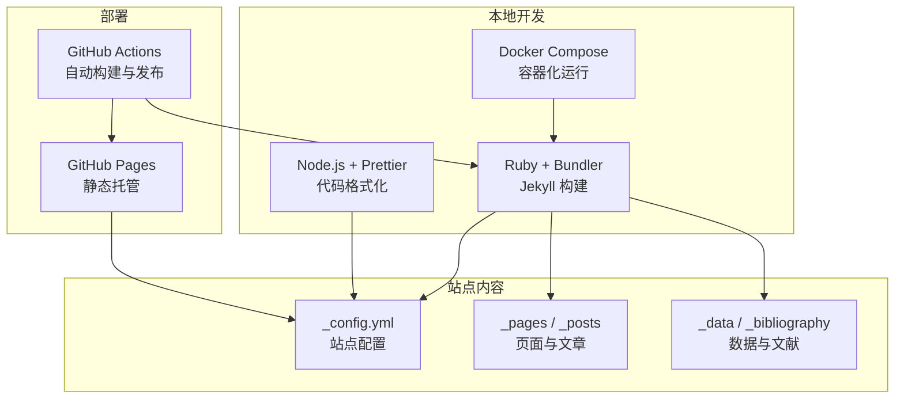
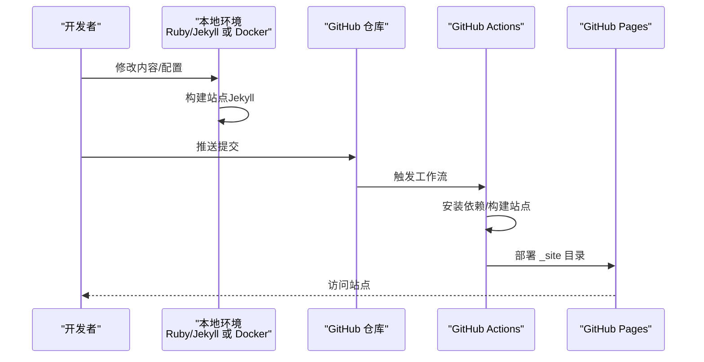
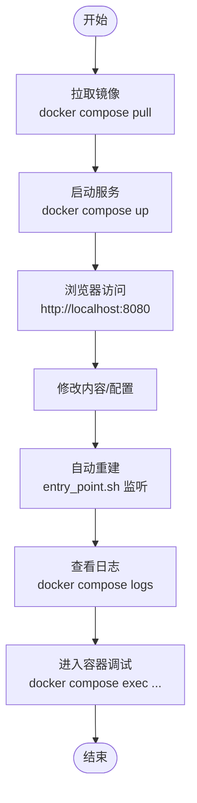
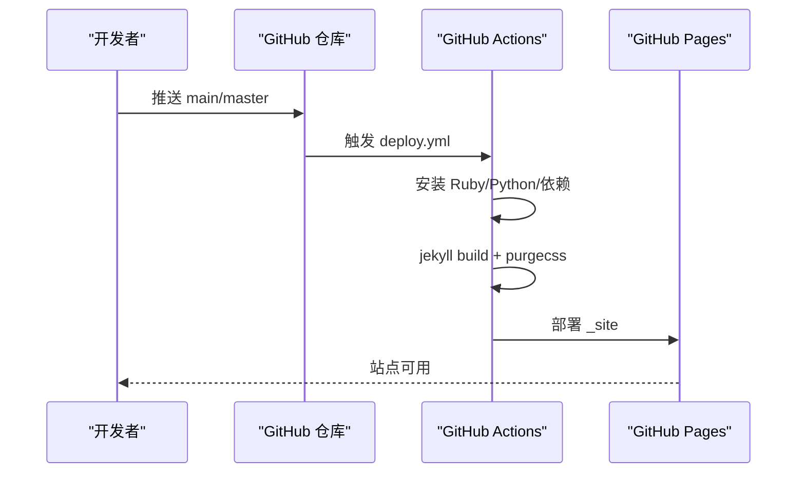
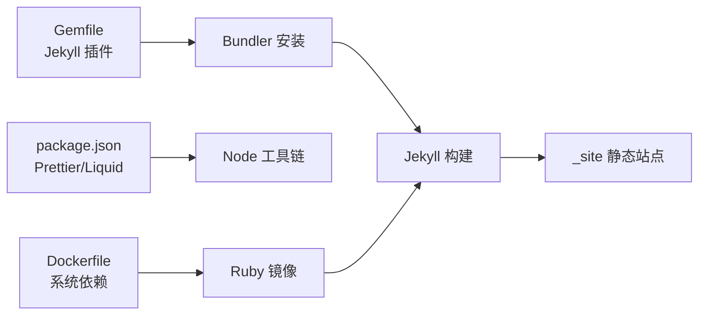

# 快速开始

<cite>
**本文引用的文件**   
- [README.md](file://README.md)
- [QUICKSTART.md](file://QUICKSTART.md)
- [INSTALL.md](file://INSTALL.md)
- [TROUBLESHOOTING.md](file://TROUBLESHOOTING.md)
- [FAQ.md](file://FAQ.md)
- [_config.yml](file://_config.yml)
- [Gemfile](file://Gemfile)
- [package.json](file://package.json)
- [Dockerfile](file://Dockerfile)
- [docker-compose.yml](file://docker-compose.yml)
- [bin/entry_point.sh](file://bin/entry_point.sh)
- [.github/workflows/deploy.yml](file://.github/workflows/deploy.yml)
</cite>

## 目录
1. [简介](#简介)
2. [项目结构](#项目结构)
3. [核心组件](#核心组件)
4. [架构总览](#架构总览)
5. [详细组件分析](#详细组件分析)
6. [依赖关系分析](#依赖关系分析)
7. [性能考虑](#性能考虑)
8. [故障排除指南](#故障排除指南)
9. [结论](#结论)
10. [附录](#附录)

## 简介
本指南面向首次搭建李明宇个人学术主页的用户，目标是在5分钟内完成环境准备与首次运行。内容覆盖：
- 环境准备：Ruby、Jekyll、Node.js 等依赖安装
- 两种部署方式：直接使用 Jekyll 与使用 Docker 容器化部署
- GitHub Pages 自动部署流程与自建服务器部署差异
- 常见安装问题与故障排除技巧

为保证可操作性，所有命令与配置均以仓库现有文件为准，避免引入外部假设。

## 项目结构
该站点基于 Jekyll 主题 al-folio 构建，采用静态站点生成器 + GitHub Pages 的典型组合。关键目录与文件：
- 配置与主题：_config.yml、Gemfile、package.json
- 模板与布局：_layouts、_includes、_sass
- 内容与数据：_pages、_posts、_data、_bibliography
- 开发与部署：Dockerfile、docker-compose.yml、bin/entry_point.sh、.github/workflows/deploy.yml
- 文档与工具：README.md、INSTALL.md、QUICKSTART.md、TROUBLESHOOTING.md、FAQ.md

图表来源
- [Dockerfile:1-77](file://Dockerfile#L1-L77)
- [docker-compose.yml:1-22](file://docker-compose.yml#L1-L22)
- [bin/entry_point.sh:1-38](file://bin/entry_point.sh#L1-L38)
- [.github/workflows/deploy.yml:1-106](file://.github/workflows/deploy.yml#L1-L106)

章节来源
- [README.md:294-311](file://README.md#L294-L311)
- [INSTALL.md:1-297](file://INSTALL.md#L1-L297)

## 核心组件
- 站点配置：通过 _config.yml 控制站点标题、作者信息、URL、基础路径、功能开关、第三方集成等
- Ruby 生态：Gemfile 声明 Jekyll 及插件依赖；Bundler 管理安装
- Node 生态：package.json 提供 Prettier 与 Liquid 格式化工具
- 容器化：Dockerfile 定义镜像与系统依赖；docker-compose.yml 映射端口与卷；entry_point.sh 启动 Jekyll 并监听配置变更
- 自动部署：.github/workflows/deploy.yml 在推送或 PR 触发时自动构建并发布到 GitHub Pages

章节来源
- [_config.yml:1-656](file://_config.yml#L1-L656)
- [Gemfile:1-42](file://Gemfile#L1-L42)
- [package.json:1-7](file://package.json#L1-L7)
- [Dockerfile:1-77](file://Dockerfile#L1-L77)
- [docker-compose.yml:1-22](file://docker-compose.yml#L1-L22)
- [bin/entry_point.sh:1-38](file://bin/entry_point.sh#L1-L38)
- [.github/workflows/deploy.yml:1-106](file://.github/workflows/deploy.yml#L1-L106)

## 架构总览
下图展示从本地开发到 GitHub Pages 发布的完整流程，以及容器化与直接本地运行两种路径的对比。

图表来源
- [.github/workflows/deploy.yml:1-106](file://.github/workflows/deploy.yml#L1-L106)
- [INSTALL.md:154-182](file://INSTALL.md#L154-L182)

## 详细组件分析

### 环境准备与依赖安装
- Ruby 与 Bundler
  - 使用 Ruby 版本管理工具（如 rbenv）安装 Ruby
  - 使用 Bundler 安装 Gemfile 中声明的 Jekyll 与插件
  - 参考：Gemfile 声明了 Jekyll 与多个插件；Bundler 负责安装
- Node.js 与 Prettier
  - 安装 Node.js
  - 安装 Prettier 与相关 Liquid 格式化工具（package.json）
- 可选：ImageMagick
  - 用于响应式图片处理（_config.yml 中启用），需系统安装

章节来源
- [Gemfile:1-42](file://Gemfile#L1-L42)
- [package.json:1-7](file://package.json#L1-L7)
- [_config.yml:350-376](file://_config.yml#L350-L376)

### 直接使用 Jekyll 运行
- 步骤概览
  - 安装 Ruby 与 Bundler
  - 安装 Node.js 与 Prettier
  - 安装依赖：bundle install
  - 启动本地服务：bundle exec jekyll serve
  - 浏览器访问 http://localhost:4000
- 注意事项
  - 若端口被占用，可更换端口或停止占用进程
  - 如需实时刷新，可结合 LiveReload（Docker 方案已内置）

章节来源
- [INSTALL.md:139-152](file://INSTALL.md#L139-L152)

### 使用 Docker 容器化部署
- 优势
  - 统一环境，避免本地依赖冲突
  - 端口映射与卷挂载便于开发调试
- 步骤概览
  - 安装 Docker 与 Docker Compose
  - 拉取镜像并启动：docker compose pull && docker compose up
  - 浏览器访问 http://localhost:8080
  - 修改内容后自动重建（entry_point.sh 监听配置变更）
- 调试
  - 查看日志：docker compose logs
  - 进入容器调试：docker compose exec -it jekyll /bin/bash
  - 重新安装依赖：bundle install

图表来源
- [docker-compose.yml:1-22](file://docker-compose.yml#L1-L22)
- [bin/entry_point.sh:1-38](file://bin/entry_point.sh#L1-L38)
- [INSTALL.md:104-133](file://INSTALL.md#L104-L133)

章节来源
- [INSTALL.md:70-133](file://INSTALL.md#L70-L133)
- [Dockerfile:1-77](file://Dockerfile#L1-L77)
- [docker-compose.yml:1-22](file://docker-compose.yml#L1-L22)
- [bin/entry_point.sh:1-38](file://bin/entry_point.sh#L1-L38)

### GitHub Pages 自动部署流程
- 工作流触发
  - 推送到 main/master 分支或发起 PR 时触发
  - 仅对特定路径变更进行缓存优化
- 执行步骤
  - 检出代码、设置 Ruby 与 Python 环境
  - 更新 giscus.repo 字段（自动）
  - 安装依赖、构建站点、清理未使用 CSS
  - 将 _site 目录部署到 GitHub Pages
- 页面源分支
  - 默认使用 gh-pages 分支作为发布源（需在仓库 Settings → Pages 中设置）

图表来源
- [.github/workflows/deploy.yml:1-106](file://.github/workflows/deploy.yml#L1-L106)
- [INSTALL.md:174-182](file://INSTALL.md#L174-L182)

章节来源
- [INSTALL.md:154-182](file://INSTALL.md#L154-L182)
- [.github/workflows/deploy.yml:1-106](file://.github/workflows/deploy.yml#L1-L106)

### 自建服务器部署（非 GitHub Pages）
- 适用场景
  - 不使用 GitHub Pages，自行托管静态站点
- 步骤概览
  - 本地构建：bundle exec jekyll build
  - 复制 _site 目录至目标服务器
  - 可选：运行 purgecss 清理未使用 CSS
- 关键配置
  - 在 _config.yml 中正确设置 url 与 baseurl

章节来源
- [INSTALL.md:206-226](file://INSTALL.md#L206-L226)

### 配置示例与要点
- 站点基本信息
  - title、first_name、last_name、description、footer_text
- 基础 URL 设置
  - 个人/组织网站：url 为 https://<username>.github.io，baseurl 留空
  - 项目页面：url 为 https://<username>.github.io，baseurl 为 /<repo-name>/
- 功能开关
  - 启用/禁用搜索、数学公式、暗色模式、懒加载等
- 第三方集成
  - Google Analytics、Cookie 同意对话框、Giscus 评论等

章节来源
- [_config.yml:1-656](file://_config.yml#L1-L656)
- [INSTALL.md:46-51](file://INSTALL.md#L46-L51)

## 依赖关系分析
- Ruby 插件生态
  - Jekyll 核心与插件由 Gemfile 声明，Bundler 安装
  - 包含 jekyll-scholar、jekyll-toc、jekyll-twitter-plugin 等
- Node 工具链
  - Prettier 与 Liquid 格式化工具由 package.json 管理
- 容器镜像
  - Dockerfile 基于 Ruby Slim，安装 build-essential、curl、git、imagemagick、nodejs、python3-pip 等
  - ENTRYPOINT 使用 entry_point.sh 启动 Jekyll 并监听配置变更

图表来源
- [Gemfile:1-42](file://Gemfile#L1-L42)
- [package.json:1-7](file://package.json#L1-L7)
- [Dockerfile:1-77](file://Dockerfile#L1-L77)

章节来源
- [Gemfile:1-42](file://Gemfile#L1-L42)
- [package.json:1-7](file://package.json#L1-L7)
- [Dockerfile:1-77](file://Dockerfile#L1-L77)

## 性能考虑
- 图片优化
  - 启用响应式图片与懒加载（_config.yml 中相关开关）
  - 使用 ImageMagick 生成多尺寸 WebP 图片
- CSS 优化
  - 构建阶段使用 purgecss 清理未使用 CSS
- 构建缓存
  - GitHub Actions 对 Ruby 与 Python 依赖进行缓存
- 实时预览
  - Docker 方案内置 LiveReload，提升开发体验

章节来源
- [_config.yml:350-396](file://_config.yml#L350-L396)
- [.github/workflows/deploy.yml:97-100](file://.github/workflows/deploy.yml#L97-L100)

## 故障排除指南
- GitHub Pages 部署失败
  - 检查 Actions 日志中的错误信息
  - 确认已按 QUICKSTART.md 设置工作流权限
  - 校验 _config.yml 中 url 与 baseurl 是否正确
- 自定义域名空白
  - 在仓库根添加 CNAME 文件，写入域名
- “Unknown tag 'toc'” 错误
  - 确保 Pages 源分支设置为 gh-pages（非 main）
- 本地 Docker 构建失败
  - 更新镜像并重建：docker compose pull && docker compose up --build
  - 检查系统资源与 Docker 权限
- 端口占用
  - 停止容器或更换端口
- CSS/JS 加载异常
  - 清除浏览器缓存或使用隐私窗口
  - 确认 url/baseurl 设置正确
- YAML 语法错误
  - 使用在线校验工具或本地运行 jekyll build 获取具体错误行

章节来源
- [TROUBLESHOOTING.md:1-455](file://TROUBLESHOOTING.md#L1-L455)
- [FAQ.md:1-176](file://FAQ.md#L1-L176)
- [QUICKSTART.md:1-112](file://QUICKSTART.md#L1-L112)

## 结论
通过本指南，您可以在5分钟内完成环境准备与首次运行。建议优先使用 Docker 以获得一致的开发体验；若希望更贴近生产环境，可直接使用 Jekyll。GitHub Pages 自动部署流程简单可靠，配合本指南的配置与故障排除建议，可快速上线您的个人学术主页。

## 附录

### 快速开始清单（5分钟）
- 创建仓库（使用模板，非 Fork）
- 配置工作流权限
- 修改 _config.yml 基本信息
- 等待 Actions 完成并查看站点
- 可选：使用 Docker 本地开发

章节来源
- [QUICKSTART.md:22-64](file://QUICKSTART.md#L22-L64)