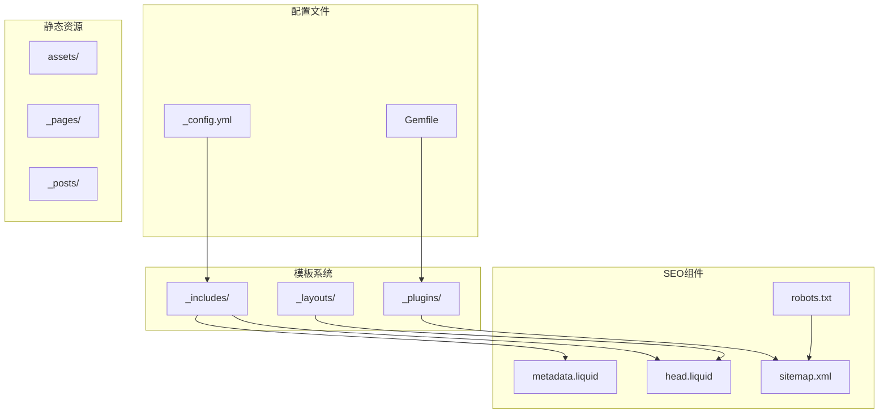
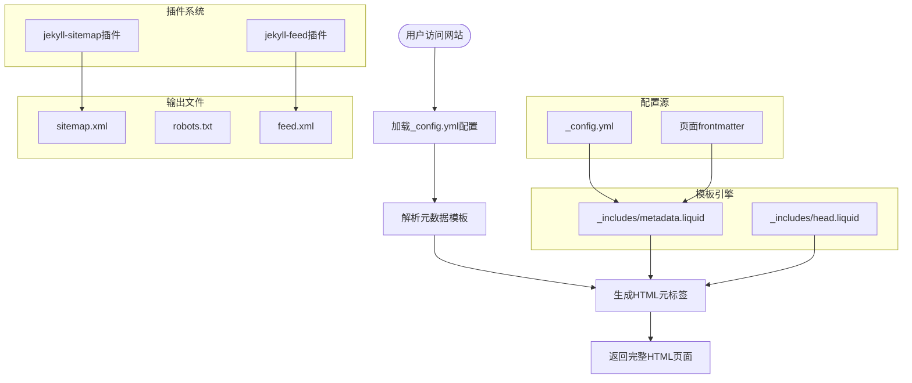
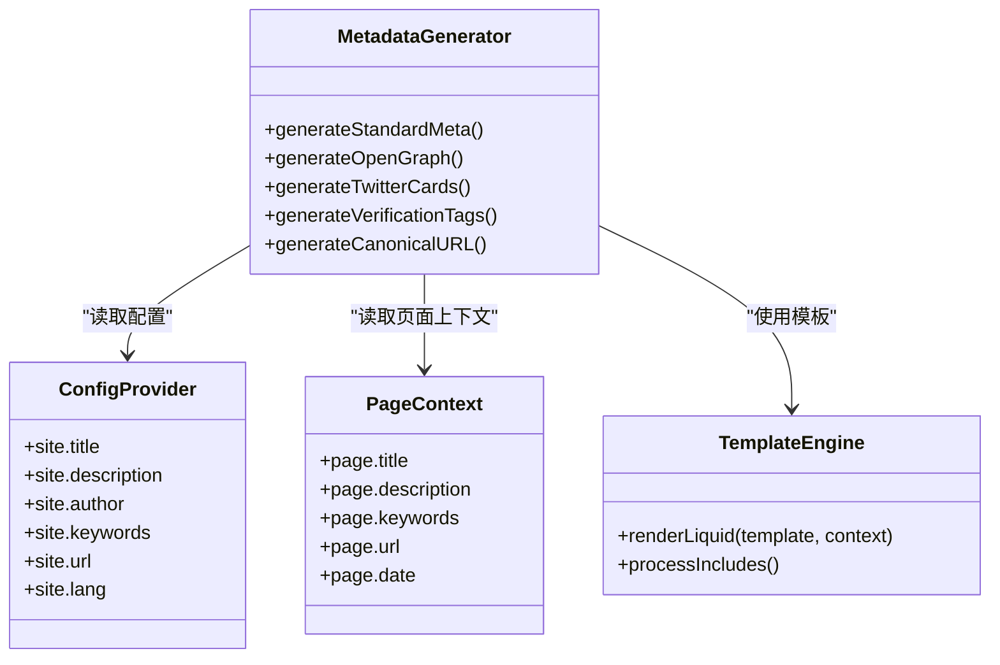
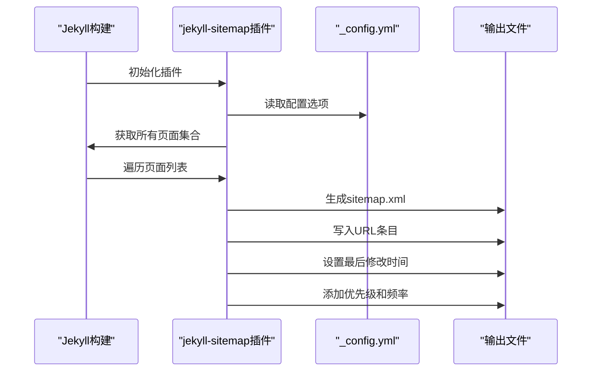
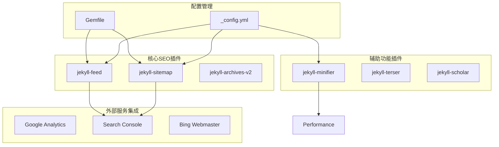

# SEO配置和基础设置

<cite>
**本文档引用的文件**
- [_config.yml](file://_config.yml)
- [SEO.md](file://SEO.md)
- [robots.txt](file://robots.txt)
- [_includes/metadata.liquid](file://_includes/metadata.liquid)
- [_includes/head.liquid](file://_includes/head.liquid)
- [Gemfile](file://Gemfile)
- [_layouts/default.liquid](file://_layouts/default.liquid)
- [.github/instructions/yaml-configuration.instructions.md](file://.github/instructions/yaml-configuration.instructions.md)
- [_plugins/external-posts.rb](file://_plugins/external-posts.rb)
- [_layouts/bib.liquid](file://_layouts/bib.liquid)
</cite>

## 目录
1. [简介](#简介)
2. [项目结构](#项目结构)
3. [核心组件](#核心组件)
4. [架构概览](#架构概览)
5. [详细组件分析](#详细组件分析)
6. [依赖关系分析](#依赖关系分析)
7. [性能考虑](#性能考虑)
8. [故障排除指南](#故障排除指南)
9. [结论](#结论)

## 简介

本指南专注于基于Jekyll的al-folio主题网站的SEO配置和基础设置。文档详细解释了_config.yml中的基本SEO元数据配置，包括title、description、author、url等字段的重要性；阐述了sitemap.xml和robots.txt的自动生成机制与验证方法；提供了正确的配置示例和常见错误的解决方案；解释了搜索引擎爬虫的工作原理以及如何优化网站结构以提高索引效率；包含了页面标题和描述的优化策略，以及关键词的合理使用方法。

## 项目结构

该Jekyll项目采用标准的Jekyll目录结构，包含以下与SEO相关的关键组件：

**图表来源**
- [_config.yml:1-656](file://_config.yml#L1-L656)
- [_includes/metadata.liquid:1-84](file://_includes/metadata.liquid#L1-L84)
- [_includes/head.liquid:1-209](file://_includes/head.liquid#L1-L209)
- [robots.txt:1-8](file://robots.txt#L1-L8)

**章节来源**
- [_config.yml:1-656](file://_config.yml#L1-L656)
- [Gemfile:1-42](file://Gemfile#L1-L42)

## 核心组件

### 基础SEO配置

在_config.yml中，SEO相关的核心配置包括：

**站点基本信息**
- `title`: 网站标题（用于搜索结果展示）
- `description`: 站点描述（150字符左右最佳）
- `author`: 作者信息
- `keywords`: 关键词列表
- `url`: 完整的基础URL
- `lang`: 语言代码

**元数据生成机制**
- 自动从_config.yml读取配置
- 支持页面级覆盖（frontmatter）
- 动态生成Open Graph和Twitter Card标签

**章节来源**
- [_config.yml:5-25](file://_config.yml#L5-L25)
- [_includes/metadata.liquid:17-45](file://_includes/metadata.liquid#L17-L45)

### 站点地图和机器人文件

**自动生成功能**
- 使用jekyll-sitemap插件自动生成sitemap.xml
- robots.txt通过Liquid模板动态生成
- 支持Sitemap协议自动指向

**配置位置**
- sitemap.xml: 默认由jekyll-sitemap插件处理
- robots.txt: 通过Liquid模板渲染

**章节来源**
- [_config.yml:211-211](file://_config.yml#L211-L211)
- [robots.txt:1-8](file://robots.txt#L1-L8)

## 架构概览

SEO配置的整体架构如下：

**图表来源**
- [_includes/metadata.liquid:1-84](file://_includes/metadata.liquid#L1-L84)
- [_includes/head.liquid:1-209](file://_includes/head.liquid#L1-L209)
- [_config.yml:196-218](file://_config.yml#L196-L218)

## 详细组件分析

### 元数据生成系统

#### 标准元数据生成

元数据生成系统负责创建所有标准的SEO元标签：

**图表来源**
- [_includes/metadata.liquid:17-84](file://_includes/metadata.liquid#L17-L84)
- [_config.yml:5-25](file://_config.yml#L5-L25)

#### Open Graph集成

Open Graph支持允许社交媒体平台正确显示页面预览：

**启用步骤**
1. 在_config.yml中设置`serve_og_meta: true`
2. 提供默认OG图像路径
3. 支持页面级OG图像覆盖

**支持的属性**
- og:site_name
- og:type (article或website)
- og:title
- og:description
- og:url
- og:image
- og:locale

**章节来源**
- [_includes/metadata.liquid:54-77](file://_includes/metadata.liquid#L54-L77)
- [SEO.md:110-145](file://SEO.md#L110-L145)

### 站点地图生成机制

#### 自动化流程

**图表来源**
- [_config.yml:211-211](file://_config.yml#L211-L211)
- [Gemfile:20-20](file://Gemfile#L20-L20)

#### 配置选项

**默认设置**
- 自动生成所有页面（除明确排除的）
- 支持资产文件排除
- 自动处理相对URL到绝对URL的转换

**自定义规则**
- 通过defaults配置排除特定路径
- 支持为不同页面类型设置不同优先级

**章节来源**
- [_config.yml:219-225](file://_config.yml#L219-L225)

### 机器人文件管理

#### 动态生成逻辑

robots.txt通过Liquid模板实现动态生成：

**核心功能**
- 自动包含Sitemap地址
- 支持User-agent规则
- 可配置Disallow路径

**生成过程**
1. 读取_config.yml中的url和baseurl
2. 动态构建Sitemap完整URL
3. 渲染Liquid模板输出

**章节来源**
- [robots.txt:1-8](file://robots.txt#L1-L8)
- [_includes/metadata.liquid:78-78](file://_includes/metadata.liquid#L78-L78)

### RSS订阅支持

#### 自动化RSS生成

**配置要求**
- 确保title、description、url完整设置
- jekyll-feed插件自动处理生成

**验证方法**
- 访问`/feed.xml`检查XML格式
- 使用RSS阅读器测试订阅功能

**章节来源**
- [SEO.md:419-444](file://SEO.md#L419-L444)
- [_config.yml:202-202](file://_config.yml#L202-L202)

## 依赖关系分析

### 插件生态系统

**图表来源**
- [_config.yml:196-218](file://_config.yml#L196-L218)
- [Gemfile:6-29](file://Gemfile#L6-L29)

### 关键依赖关系

**SEO功能依赖**
- jekyll-sitemap: 站点地图生成
- jekyll-feed: RSS订阅支持  
- jekyll-minifier: 性能优化
- jekyll-terser: JavaScript压缩

**配置依赖**
- _config.yml中的URL配置影响所有链接生成
- 插件版本控制确保兼容性
- Liquid模板依赖配置变量

**章节来源**
- [_config.yml:196-244](file://_config.yml#L196-L244)
- [Gemfile:1-42](file://Gemfile#L1-L42)

## 性能考虑

### 加载性能优化

**图片优化**
- 启用响应式WebP图片
- 支持懒加载减少初始加载时间
- 多分辨率适配移动端

**代码优化**
- JavaScript压缩和混淆
- CSS最小化处理
- 缓存头设置

**网络优化**
- CDN资源引用
- 连接复用和持久连接
- 减少HTTP请求次数

### 移动端优化

**响应式设计**
- 移动优先的设计理念
- 触摸友好的交互元素
- 优化的字体大小和行高

**性能指标**
- 页面加载时间 < 3秒
- TTFB < 200ms
- Lighthouse评分优秀

## 故障排除指南

### 常见问题诊断

#### 站点地图未生成

**症状**: 访问`/sitemap.xml`返回404

**排查步骤**
1. 检查_config.yml中的url配置是否正确
2. 验证jekyll-sitemap插件已安装
3. 重新构建站点检查输出目录
4. 检查是否有页面被意外排除

**解决方案**
- 确保baseurl为空字符串（个人站点）
- 检查assets目录的sitemap排除规则
- 验证GitHub Pages部署权限

#### 机器人文件配置错误

**症状**: 搜索引擎无法正确抓取页面

**排查步骤**
1. 检查robots.txt模板语法
2. 验证Sitemap地址的完整性
3. 测试User-agent规则

**解决方案**
- 确保Sitemap使用完整的绝对URL
- 检查Disallow规则是否过于严格
- 验证robots.txt文件的Liquid语法

#### 元数据缺失问题

**症状**: 社交媒体分享无预览图

**排查步骤**
1. 检查serve_og_meta配置
2. 验证OG图像路径和尺寸
3. 测试Facebook分享调试器

**解决方案**
- 设置合适的OG图像尺寸（1200x630像素）
- 确保图像可公开访问
- 验证Open Graph标签生成

### 验证工具使用

**Google Search Console**
- 添加网站并完成所有权验证
- 监控覆盖率报告
- 查看索引状态和错误

**Facebook Sharing Debugger**
- 测试OG标签有效性
- 预览社交分享效果
- 调试图片和描述问题

**章节来源**
- [SEO.md:200-246](file://SEO.md#L200-L246)
- [SEO.md:53-69](file://SEO.md#L53-L69)

## 结论

本指南详细介绍了基于al-folio主题的Jekyll网站SEO配置方案。通过合理配置_config.yml中的元数据、启用必要的插件、以及正确设置sitemap和robots.txt，可以显著提升网站在搜索引擎中的可见性和索引效率。

**关键要点总结**：
- 基础元数据配置是SEO的基石
- 自动化的sitemap和robots管理减少了维护成本
- Open Graph和Schema.org标记提升了社交媒体和搜索结果的丰富度
- 性能优化与SEO密切相关，需要持续监控和改进

建议定期检查Search Console报告，监控索引状态，并根据数据分析调整SEO策略。同时保持配置文件的更新和插件版本的维护，确保SEO功能的持续有效运行。