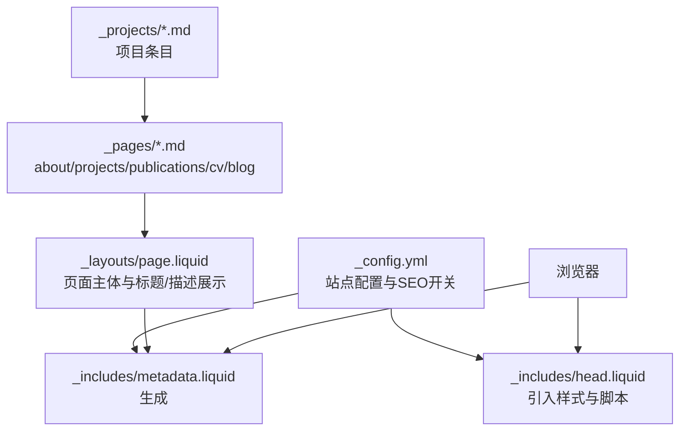
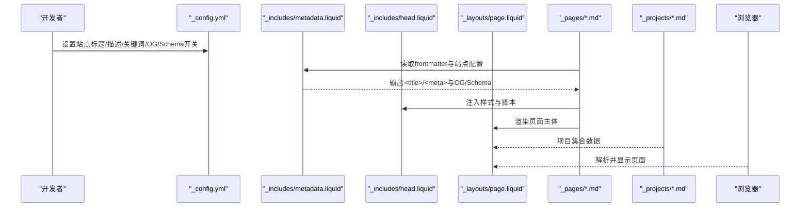
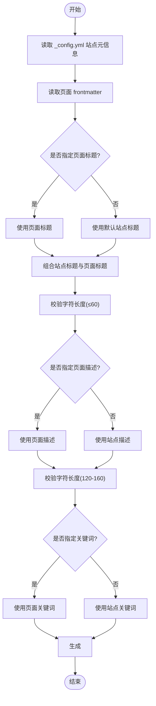
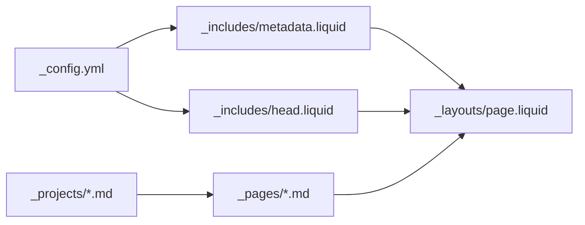

# 内容优化和用户体验

<cite>
**本文引用的文件**
- [_config.yml](file://_config.yml)
- [SEO.md](file://SEO.md)
- [README.md](file://README.md)
- [_includes/head.liquid](file://_includes/head.liquid)
- [_includes/metadata.liquid](file://_includes/metadata.liquid)
- [_layouts/page.liquid](file://_layouts/page.liquid)
- [_pages/about.md](file://_pages/about.md)
- [_pages/projects.md](file://_pages/projects.md)
- [_pages/publications.md](file://_pages/publications.md)
- [_pages/cv.md](file://_pages/cv.md)
- [_pages/blog.md](file://_pages/blog.md)
- [_projects/1_project.md](file://_projects/1_project.md)
</cite>

## 目录
1. [简介](#简介)
2. [项目结构](#项目结构)
3. [核心组件](#核心组件)
4. [架构总览](#架构总览)
5. [详细组件分析](#详细组件分析)
6. [依赖关系分析](#依赖关系分析)
7. [性能考量](#性能考量)
8. [故障排查指南](#故障排查指南)
9. [结论](#结论)
10. [附录](#附录)

## 简介
本指南面向内容创作者与站点维护者，聚焦于页面标题与描述优化、HTML标题层级规范、图片优化最佳实践、内部链接与导航策略、内容可访问性与移动端友好设计等主题。结合本仓库的 Jekyll + al-folio 主题实现，给出可操作的策略与落地建议，并通过可视化图示帮助理解页面元数据生成、页面渲染流程与图片资源处理链路。

## 项目结构
该站点采用 Jekyll 静态生成，核心由配置文件、页面与集合（Collections）构成，配合 Liquid 模板系统输出 HTML。关键目录与文件如下：
- 根配置：_config.yml 定义站点元信息、搜索引擎与结构化数据开关、第三方库版本等
- 页面与集合：_pages 下的 about、projects、publications、cv、blog 等；_projects、_posts 等集合
- 模板与元数据：_layouts/page.liquid、_includes/head.liquid、_includes/metadata.liquid 负责页面头部、标题与描述、OG/Schema 结构化数据注入
- SEO 文档：SEO.md 提供 SEO 最佳实践与检查清单

图表来源
- [_config.yml](file://_config.yml)
- [_includes/head.liquid](file://_includes/head.liquid)
- [_includes/metadata.liquid](file://_includes/metadata.liquid)
- [_layouts/page.liquid](file://_layouts/page.liquid)
- [_pages/about.md](file://_pages/about.md)
- [_pages/projects.md](file://_pages/projects.md)
- [_pages/publications.md](file://_pages/publications.md)
- [_pages/cv.md](file://_pages/cv.md)
- [_pages/blog.md](file://_pages/blog.md)
- [_projects/1_project.md](file://_projects/1_project.md)

章节来源
- [_config.yml](file://_config.yml)
- [_includes/head.liquid](file://_includes/head.liquid)
- [_includes/metadata.liquid](file://_includes/metadata.liquid)
- [_layouts/page.liquid](file://_layouts/page.liquid)
- [_pages/about.md](file://_pages/about.md)
- [_pages/projects.md](file://_pages/projects.md)
- [_pages/publications.md](file://_pages/publications.md)
- [_pages/cv.md](file://_pages/cv.md)
- [_pages/blog.md](file://_pages/blog.md)
- [_projects/1_project.md](file://_projects/1_project.md)

## 核心组件
- 元数据与标题生成：_includes/metadata.liquid 基于站点配置与页面 frontmatter 动态生成页面标题、描述、关键词、OpenGraph 与 Schema.org 结构化数据
- 页面头部与资源加载：_includes/head.liquid 引入样式、图标、第三方库与暗色模式脚本
- 页面主体模板：_layouts/page.liquid 展示页面标题与描述，并在需要时渲染参考文献或评论区
- 页面内容：_pages 下各页面定义导航、描述与内容；_projects 下集合条目用于项目卡片展示
- SEO 指南：SEO.md 提供标题长度、描述长度、标题层级、图片优化、内部链接与性能等策略

章节来源
- [_includes/metadata.liquid](file://_includes/metadata.liquid)
- [_includes/head.liquid](file://_includes/head.liquid)
- [_layouts/page.liquid](file://_layouts/page.liquid)
- [_pages/about.md](file://_pages/about.md)
- [_pages/projects.md](file://_pages/projects.md)
- [_pages/publications.md](file://_pages/publications.md)
- [_pages/cv.md](file://_pages/cv.md)
- [_pages/blog.md](file://_pages/blog.md)
- [_projects/1_project.md](file://_projects/1_project.md)
- [SEO.md](file://SEO.md)

## 架构总览
下图展示从配置到页面渲染的关键路径：站点配置驱动元数据生成，页面模板负责内容展示，最终输出 HTML 并由浏览器解析执行。

图表来源
- [_config.yml](file://_config.yml)
- [_includes/metadata.liquid](file://_includes/metadata.liquid)
- [_includes/head.liquid](file://_includes/head.liquid)
- [_layouts/page.liquid](file://_layouts/page.liquid)
- [_pages/about.md](file://_pages/about.md)
- [_pages/projects.md](file://_pages/projects.md)
- [_projects/1_project.md](file://_projects/1_project.md)

## 详细组件分析

### 页面标题与描述优化策略
- 标题长度控制：建议页面标题不超过 60 字符，确保在搜索结果中完整显示
- 描述长度控制：建议页面描述在 120–160 字符之间，突出价值与关键信息
- 关键词自然融入：在站点标题与页面描述中自然嵌入与领域相关的关键词，避免堆砌
- 标题层级：每个页面仅保留一个 H1，通常为页面主标题；后续使用 H2/H3 维持清晰层级
- 元数据来源：站点级 title/description/keywords 来自 _config.yml；页面级 title/description/keywords 可在页面 frontmatter 中覆盖

图表来源
- [_includes/metadata.liquid](file://_includes/metadata.liquid)
- [_config.yml](file://_config.yml)
- [_pages/about.md](file://_pages/about.md)
- [_pages/projects.md](file://_pages/projects.md)
- [_pages/publications.md](file://_pages/publications.md)
- [_pages/cv.md](file://_pages/cv.md)
- [_pages/blog.md](file://_pages/blog.md)

章节来源
- [_includes/metadata.liquid](file://_includes/metadata.liquid)
- [_config.yml](file://_config.yml)
- [_pages/about.md](file://_pages/about.md)
- [_pages/projects.md](file://_pages/projects.md)
- [_pages/publications.md](file://_pages/publications.md)
- [_pages/cv.md](file://_pages/cv.md)
- [_pages/blog.md](file://_pages/blog.md)
- [SEO.md](file://SEO.md)

### HTML 标题层级与 SEO 影响
- 规范做法：使用 # 作为 H1，## 作为 H2，### 作为 H3，依此类推
- 作用：利于搜索引擎理解页面结构，同时提升可访问性（屏幕阅读器导航）
- 在 al-folio 中，页面主标题由 _layouts/page.liquid 输出，正文内容由 Markdown 渲染，建议在 Markdown 中严格遵循层级顺序

章节来源
- [_layouts/page.liquid](file://_layouts/page.liquid)
- [SEO.md](file://SEO.md)

### 图片优化最佳实践
- 文件命名：使用语义化、描述性的文件名（如 neural-network-architecture.png），避免无意义名称
- Alt 文本：为图片添加描述性 alt 文本，既提升可访问性，也有助于 SEO
- 响应式图片：启用懒加载与现代格式（如 WebP），以降低带宽与提升加载速度
- 实现要点（基于配置）：懒加载开关与响应式 WebP 图像处理已在 _config.yml 中开启，可直接使用

章节来源
- [SEO.md](file://SEO.md)
- [_config.yml](file://_config.yml)

### 内部链接策略与网站导航优化
- 内部链接：在页面内容中自然地链接到相关页面（如项目、论文、博客），有助于搜索引擎爬行与用户发现更多内容
- 导航：通过页面 frontmatter 的 nav 与 nav_order 控制导航菜单项的出现与排序
- 示例：项目页通过 display_categories 控制分类展示；博客页支持标签与分类归档链接

章节来源
- [_pages/projects.md](file://_pages/projects.md)
- [_pages/blog.md](file://_pages/blog.md)
- [_pages/publications.md](file://_pages/publications.md)
- [_pages/about.md](file://_pages/about.md)

### 内容可访问性与移动端友好设计
- 可访问性：确保图片具备描述性 alt 文本；使用语义化标题层级；提供键盘可操作性与对比度良好的配色
- 移动端：站点默认响应式；建议测试小屏可点击区域大小、字体可读性与交互元素尺寸
- 技术支撑：_includes/head.liquid 引入 viewport 元标签与响应式样式；_includes/metadata.liquid 生成结构化数据，提升可发现性

章节来源
- [_includes/head.liquid](file://_includes/head.liquid)
- [_includes/metadata.liquid](file://_includes/metadata.liquid)
- [SEO.md](file://SEO.md)

## 依赖关系分析
- 配置驱动：_config.yml 控制站点元信息、OG/Schema 开关、第三方库版本与图片优化策略
- 模板依赖：_layouts/page.liquid 依赖 _includes/head.liquid 与 _includes/metadata.liquid 提供的头部与元数据
- 页面依赖：_pages 下各页面通过 frontmatter 控制标题、描述、导航与展示逻辑
- 集合依赖：_projects 与 _posts 等集合通过 Jekyll 集成在页面模板中渲染

图表来源
- [_config.yml](file://_config.yml)
- [_includes/metadata.liquid](file://_includes/metadata.liquid)
- [_includes/head.liquid](file://_includes/head.liquid)
- [_layouts/page.liquid](file://_layouts/page.liquid)
- [_pages/about.md](file://_pages/about.md)
- [_pages/projects.md](file://_pages/projects.md)
- [_projects/1_project.md](file://_projects/1_project.md)

章节来源
- [_config.yml](file://_config.yml)
- [_includes/metadata.liquid](file://_includes/metadata.liquid)
- [_includes/head.liquid](file://_includes/head.liquid)
- [_layouts/page.liquid](file://_layouts/page.liquid)
- [_pages/about.md](file://_pages/about.md)
- [_pages/projects.md](file://_pages/projects.md)
- [_projects/1_project.md](file://_projects/1_project.md)

## 性能考量
- 图片优化：启用懒加载与 WebP 响应式图片，减少首屏体积
- 资源加载：合理使用 defer 与相对路径，避免阻塞渲染
- 构建优化：Jekyll 插件自动压缩与最小化静态资源
- 测试工具：使用 PageSpeed Insights 等工具评估与优化性能

章节来源
- [_config.yml](file://_config.yml)
- [_includes/head.liquid](file://_includes/head.liquid)
- [README.md](file://README.md)

## 故障排查指南
- 标题/描述未生效：确认 _config.yml 与页面 frontmatter 中的 title/description/keywords 是否填写完整且未被覆盖
- OG/Schema 未显示：检查 _config.yml 中 serve_og_meta 与 serve_schema_org 是否开启
- 导航不显示：检查页面 frontmatter 中 nav 与 nav_order 设置
- 图片加载异常：确认图片路径正确、已启用懒加载与 WebP 处理

章节来源
- [_includes/metadata.liquid](file://_includes/metadata.liquid)
- [_pages/projects.md](file://_pages/projects.md)
- [_config.yml](file://_config.yml)

## 结论
通过规范页面标题与描述、遵循 HTML 标题层级、实施图片优化与内部链接策略、强化可访问性与移动端体验，可显著提升站点的可发现性、可用性与用户体验。本指南结合 al-folio 的模板实现，提供了可操作的策略与可视化流程，便于快速落地与持续优化。

## 附录
- SEO 最佳实践与检查清单可参考 SEO.md
- 项目特性与部署说明可参考 README.md

章节来源
- [SEO.md](file://SEO.md)
- [README.md](file://README.md)