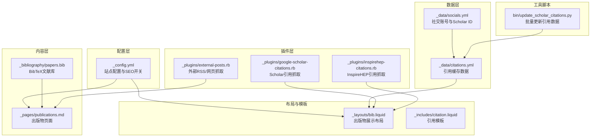
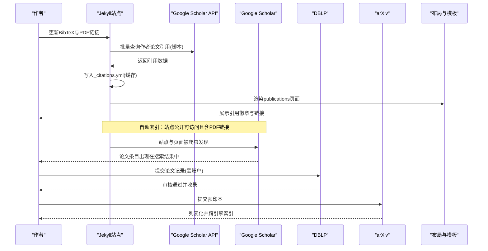
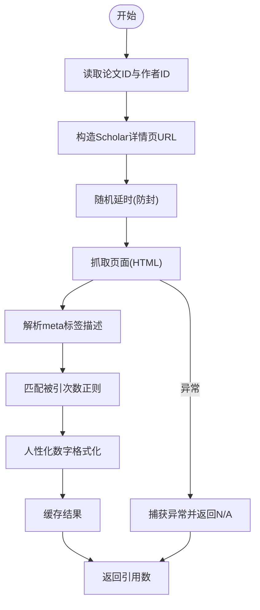
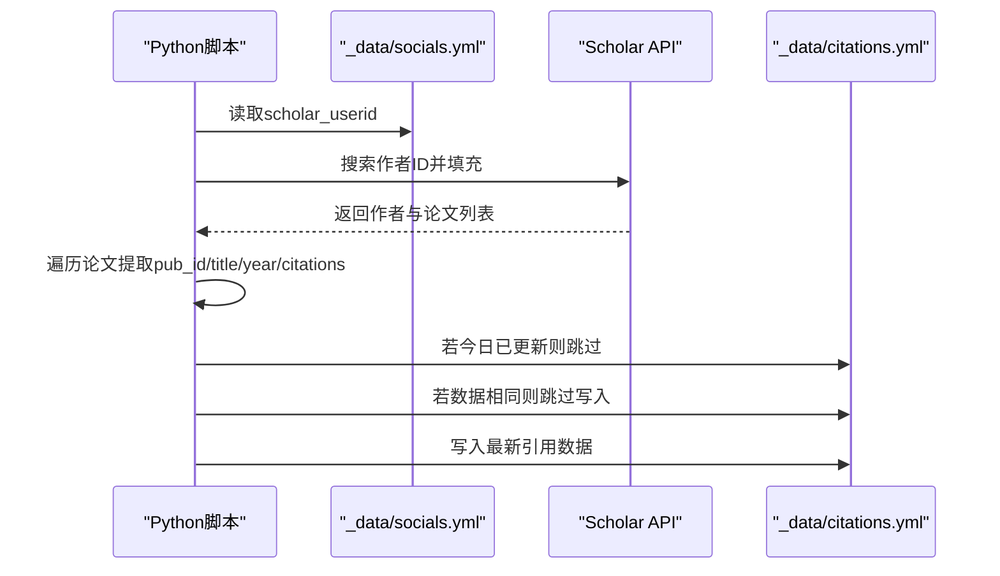
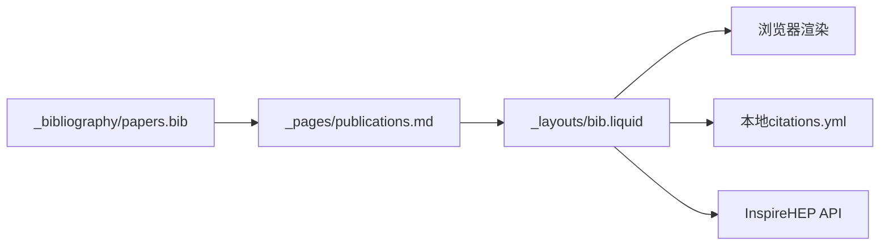
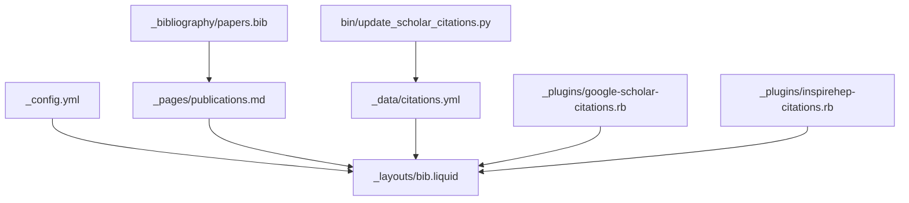

# 学术出版物索引优化

<cite>
**本文引用的文件**
- [google-scholar-citations.rb](file://_plugins/google-scholar-citations.rb)
- [update_scholar_citations.py](file://bin/update_scholar_citations.py)
- [_config.yml](file://_config.yml)
- [papers.bib](file://_bibliography/papers.bib)
- [README.md](file://README.md)
- [socials.yml](file://_data/socials.yml)
- [citations.yml](file://_data/citations.yml)
- [citation.liquid](file://_includes/citation.liquid)
- [inspirehep-citations.rb](file://_plugins/inspirehep-citations.rb)
- [external-posts.rb](file://_plugins/external-posts.rb)
- [publications.md](file://_pages/publications.md)
- [bib.liquid](file://_layouts/bib.liquid)
- [SEO.md](file://SEO.md)
</cite>

## 目录
1. [简介](#简介)
2. [项目结构](#项目结构)
3. [核心组件](#核心组件)
4. [架构总览](#架构总览)
5. [详细组件分析](#详细组件分析)
6. [依赖关系分析](#依赖关系分析)
7. [性能考量](#性能考量)
8. [故障排查指南](#故障排查指南)
9. [结论](#结论)
10. [附录](#附录)

## 简介
本指南面向学术研究者与技术团队，系统阐述如何通过网站与工具链实现学术出版物的高质量索引与优化。结合本仓库中已有的 Jekyll 主题、Google Scholar 引用抓取插件、arXiv/DBLP 链接标注以及 BibTeX 规范，帮助您：
- 理解 Google Scholar 的索引机制与优化策略
- 掌握 DBLP 计算机科学索引的提交流程与要求
- 明确 arXiv 预印本的提交方法与链接添加规范
- 确保 BibTeX 格式正确性与 PDF 链接的重要性
- 创建与维护 Google Scholar Author Profile
- 合理设定索引时间预期并解决常见问题

## 项目结构
该站点基于 Jekyll 模板（al-folio），采用模块化组织方式：
- 配置层：站点元数据、搜索引擎优化、第三方集成等集中在配置文件中
- 数据层：作者社交信息、引用数据、会议与期刊映射等
- 内容层：页面、文章、公开出版物列表等
- 插件层：自定义 Liquid 标签与生成器，扩展引用抓取与外部内容聚合
- 资源层：样式、脚本、媒体资源等

图表来源
- [_config.yml:264-296](file://_config.yml#L264-L296)
- [_pages/publications.md:1-22](file://_pages/publications.md#L1-L22)
- [_layouts/bib.liquid:319-348](file://_layouts/bib.liquid#L319-L348)
- [_plugins/google-scholar-citations.rb:9-87](file://_plugins/google-scholar-citations.rb#L9-L87)
- [_plugins/inspirehep-citations.rb:10-58](file://_plugins/inspirehep-citations.rb#L10-L58)
- [bin/update_scholar_citations.py:10-36](file://bin/update_scholar_citations.py#L10-L36)

章节来源
- [_config.yml:264-296](file://_config.yml#L264-L296)
- [_pages/publications.md:1-22](file://_pages/publications.md#L1-L22)
- [_layouts/bib.liquid:319-348](file://_layouts/bib.liquid#L319-L348)

## 核心组件
- Google Scholar 引用抓取插件：在构建时抓取单篇论文的被引次数，支持缓存与错误处理
- 引用数据更新脚本：周期性从 Google Scholar API 获取作者论文引用数据，写入本地数据文件
- 出版物页面与布局：自动渲染 BibTeX 文献库，展示链接、徽章与摘要等
- BibTeX 规范与字段：确保标题、作者、年份、DOI、arXiv、pdf 等字段完整
- 外部内容聚合：从 RSS 或网页抓取外部博客/文章，统一纳入站点内容流

章节来源
- [_plugins/google-scholar-citations.rb:9-87](file://_plugins/google-scholar-citations.rb#L9-L87)
- [bin/update_scholar_citations.py:39-125](file://bin/update_scholar_citations.py#L39-L125)
- [_layouts/bib.liquid:190-261](file://_layouts/bib.liquid#L190-L261)
- [_bibliography/papers.bib:4-13](file://_bibliography/papers.bib#L4-L13)
- [_plugins/external-posts.rb:7-23](file://_plugins/external-posts.rb#L7-L23)

## 架构总览
下图展示了“发布—索引—展示”的端到端流程，包括手动与自动两种路径。

图表来源
- [bin/update_scholar_citations.py:39-125](file://bin/update_scholar_citations.py#L39-L125)
- [_layouts/bib.liquid:319-348](file://_layouts/bib.liquid#L319-L348)
- [SEO.md:250-323](file://SEO.md#L250-L323)

## 详细组件分析

### Google Scholar 引用抓取与展示
- 抓取逻辑：在构建阶段根据论文的 Google Scholar ID 请求页面，解析 meta 标签中的“被引次数”，并进行人性化数字格式化
- 缓存机制：同一论文 ID 的引用计数会缓存在内存中，避免重复请求
- 错误处理：捕获异常并输出错误日志，返回“N/A”
- 展示方式：在出版物布局中以徽章形式显示引用数；同时支持在页面中使用 Liquid 标签动态获取引用数

图表来源
- [_plugins/google-scholar-citations.rb:29-82](file://_plugins/google-scholar-citations.rb#L29-L82)

章节来源
- [_plugins/google-scholar-citations.rb:9-87](file://_plugins/google-scholar-citations.rb#L9-L87)
- [_layouts/bib.liquid:319-348](file://_layouts/bib.liquid#L319-L348)

### 引用数据更新脚本（批量）
- 输入：从配置文件读取 Google Scholar 用户 ID
- 查询：调用 Scholar API 获取作者论文列表与引用数
- 去重与幂等：若当日已更新则跳过；若数据未变化也跳过写入
- 输出：将引用数据写入本地数据文件，供页面渲染使用

图表来源
- [bin/update_scholar_citations.py:10-125](file://bin/update_scholar_citations.py#L10-L125)

章节来源
- [bin/update_scholar_citations.py:10-125](file://bin/update_scholar_citations.py#L10-L125)
- [_data/socials.yml:1-6](file://_data/socials.yml#L1-L6)
- [_data/citations.yml:1-3](file://_data/citations.yml#L1-L3)

### 出版物页面与布局
- 页面入口：公开出版物页面通过 Bibliography 标签渲染 BibTeX 库
- 布局能力：自动识别文章/会议/论文集等类型，生成作者列表、链接按钮（PDF/HTML/arXiv/DOI/网站等）、徽章（Altmetric/Dimensions/Google Scholar/InspireHEP）
- 徽章来源：Google Scholar 引用来自本地缓存数据；InspireHEP 引用通过 API 动态抓取

图表来源
- [_pages/publications.md:17-21](file://_pages/publications.md#L17-L21)
- [_layouts/bib.liquid:190-362](file://_layouts/bib.liquid#L190-L362)

章节来源
- [_pages/publications.md:1-22](file://_pages/publications.md#L1-L22)
- [_layouts/bib.liquid:190-362](file://_layouts/bib.liquid#L190-L362)

### BibTeX 规范与 PDF 链接
- 字段完整性：确保标题、作者、年份、期刊/会议、页码、DOI 等字段齐全
- 链接标注：为每篇论文添加 PDF 链接，便于搜索引擎与 Scholar 索引
- arXiv 标注：如适用，添加 arXiv ID 并在页面上显示对应链接
- 自动化：通过脚本或手动更新 BibTeX 文件后，站点重新构建即可生效

章节来源
- [_bibliography/papers.bib:4-13](file://_bibliography/papers.bib#L4-L13)
- [_layouts/bib.liquid:219-225](file://_layouts/bib.liquid#L219-L225)
- [SEO.md:278-322](file://SEO.md#L278-L322)

### 外部内容聚合
- 支持从 RSS 源或指定 URL 抓取外部文章，统一生成站点文章条目
- 可设置默认分类与标签，便于站点内容扩展与索引

章节来源
- [_plugins/external-posts.rb:7-23](file://_plugins/external-posts.rb#L7-L23)
- [_plugins/external-posts.rb:12-21](file://_plugins/external-posts.rb#L12-L21)

## 依赖关系分析
- 配置依赖：站点配置控制是否启用 Open Graph、Schema.org、引用徽章等
- 数据依赖：页面渲染依赖 BibTeX 与引用缓存数据
- 插件依赖：引用徽章依赖本地缓存与 API 插件
- 工具依赖：引用数据由 Python 脚本定期更新

图表来源
- [_config.yml:264-296](file://_config.yml#L264-L296)
- [_layouts/bib.liquid:319-348](file://_layouts/bib.liquid#L319-L348)
- [_pages/publications.md:17-21](file://_pages/publications.md#L17-L21)
- [bin/update_scholar_citations.py:35-36](file://bin/update_scholar_citations.py#L35-L36)

章节来源
- [_config.yml:264-296](file://_config.yml#L264-L296)
- [_layouts/bib.liquid:319-348](file://_layouts/bib.liquid#L319-L348)
- [_pages/publications.md:17-21](file://_pages/publications.md#L17-L21)
- [bin/update_scholar_citations.py:35-36](file://bin/update_scholar_citations.py#L35-L36)

## 性能考量
- 构建期抓取：引用抓取在构建阶段执行，避免运行时延迟
- 缓存策略：本地缓存引用数据，减少重复请求
- 图片与媒体：启用懒加载与响应式图片，提升移动端体验
- 站点地图与 robots：自动生成 sitemap.xml 与 robots.txt，利于搜索引擎发现

章节来源
- [_plugins/google-scholar-citations.rb:34-41](file://_plugins/google-scholar-citations.rb#L34-L41)
- [_config.yml:375-376](file://_config.yml#L375-L376)
- [SEO.md:51-68](file://SEO.md#L51-L68)

## 故障排查指南
- Google Scholar 引用显示为 N/A
  - 检查论文是否已在 Google Scholar 中被索引
  - 确认页面包含 PDF 链接，有助于 Scholar 更好地抓取与索引
  - 查看构建日志中的异常输出，确认网络与权限正常
- 引用数据未更新
  - 确认 Python 脚本成功读取配置文件中的 Scholar ID
  - 检查输出文件是否被跳过（今日已更新或数据未变化）
  - 确认网络连通性与 Scholar API 限制
- 页面未显示引用徽章
  - 检查布局中是否启用了相应徽章
  - 确认论文条目中存在对应的 Google Scholar ID 或 InspireHEP ID
- 外部内容未抓取
  - 检查 RSS 地址或 URL 是否可达
  - 确认日期解析格式正确

章节来源
- [_plugins/google-scholar-citations.rb:72-78](file://_plugins/google-scholar-citations.rb#L72-L78)
- [bin/update_scholar_citations.py:44-62](file://bin/update_scholar_citations.py#L44-L62)
- [_layouts/bib.liquid:319-348](file://_layouts/bib.liquid#L319-L348)
- [_plugins/external-posts.rb:92-101](file://_plugins/external-posts.rb#L92-L101)

## 结论
通过本仓库提供的工具链与模板，您可以系统地优化学术出版物的索引与展示：
- 使用 BibTeX 规范与 PDF 链接提升 Scholar 与搜索引擎的索引质量
- 通过引用数据脚本与插件实现自动化与可视化
- 在合适场景下提交至 DBLP 与 arXiv，扩大可见度
- 借助 SEO 最佳实践与结构化标记，增强发现与呈现效果

## 附录

### Google Scholar 索引机制与优化策略
- 自动索引：公开可访问的站点与页面、包含 PDF 链接的论文更易被发现
- 手动提交：可在 Google Scholar Author Profile 中创建并维护个人资料
- 时间预期：通常需要数周至数月，具体取决于页面可抓取性与链接质量

章节来源
- [SEO.md:250-293](file://SEO.md#L250-L293)

### DBLP 计算机科学索引的提交流程与要求
- 流程：登录 DBLP，搜索作者或论文；如缺失，按要求提交
- 要求：通常需要账户与必要的元数据验证

章节来源
- [SEO.md:296-304](file://SEO.md#L296-L304)

### arXiv 预印本的提交方法与链接添加规范
- 提交：在 arXiv.org 提交预印本，待列出后自动被搜索引擎索引
- 链接：在 BibTeX 中添加 arXiv 字段并在页面显示对应链接

章节来源
- [SEO.md:307-322](file://SEO.md#L307-L322)
- [_layouts/bib.liquid:203-205](file://_layouts/bib.liquid#L203-L205)

### BibTeX 格式正确性与 PDF 链接的重要性
- 字段建议：标题、作者、年份、期刊/会议、页码、DOI、arXiv、pdf
- PDF 链接：有助于搜索引擎与 Scholar 更准确地索引与展示

章节来源
- [_bibliography/papers.bib:4-13](file://_bibliography/papers.bib#L4-L13)
- [SEO.md:264-285](file://SEO.md#L264-L285)

### Google Scholar Author Profile 的创建与维护
- 创建：访问 Google Scholar Author Profile，按提示完成个人资料
- 维护：保持页面公开、链接完整、BibTeX 字段规范

章节来源
- [SEO.md:287-291](file://SEO.md#L287-L291)

### 索引时间预期与常见问题
- 预期：Scholar 索引通常需要数周至数月
- 常见问题：缺少 PDF 链接、字段不完整、网络异常、数据未更新

章节来源
- [SEO.md:292-293](file://SEO.md#L292-L293)
- [bin/update_scholar_citations.py:44-62](file://bin/update_scholar_citations.py#L44-L62)