# 性能优化和SEO

<cite>
**本文档引用的文件**
- [_config.yml](file://_config.yml)
- [SEO.md](file://SEO.md)
- [ANALYTICS.md](file://ANALYTICS.md)
- [lighthouse_results/desktop/alshedivat_github_io_al_folio_.html](file://lighthouse_results/desktop/alshedivat_github_io_al_folio_.html)
- [assets/js/common.js](file://assets/js/common.js)
- [assets/js/theme.js](file://assets/js/theme.js)
- [assets/js/search-setup.js](file://assets/js/search-setup.js)
- [_scripts/google-analytics-setup.js](file://_scripts/google-analytics-setup.js)
- [_scripts/cookie-consent-setup.js](file://_scripts/cookie-consent-setup.js)
- [package.json](file://package.json)
</cite>

## 目录
1. [简介](#简介)
2. [项目结构](#项目结构)
3. [核心组件](#核心组件)
4. [架构概览](#架构概览)
5. [详细组件分析](#详细组件分析)
6. [依赖关系分析](#依赖关系分析)
7. [性能考虑](#性能考虑)
8. [故障排除指南](#故障排除指南)
9. [结论](#结论)
10. [附录](#附录)

## 简介

本指南为基于Jekyll的静态站点提供全面的性能优化和搜索引擎优化（SEO）解决方案。该站点采用al-folio主题，集成了多种优化技术和分析工具。文档涵盖静态站点性能优化策略、图片优化最佳实践、CSS和JavaScript优化方法、SEO配置实现、分析工具集成与隐私合规要求，以及Lighthouse性能测试和移动端优化方案。

## 项目结构

该项目采用标准的Jekyll项目结构，主要包含以下关键目录：

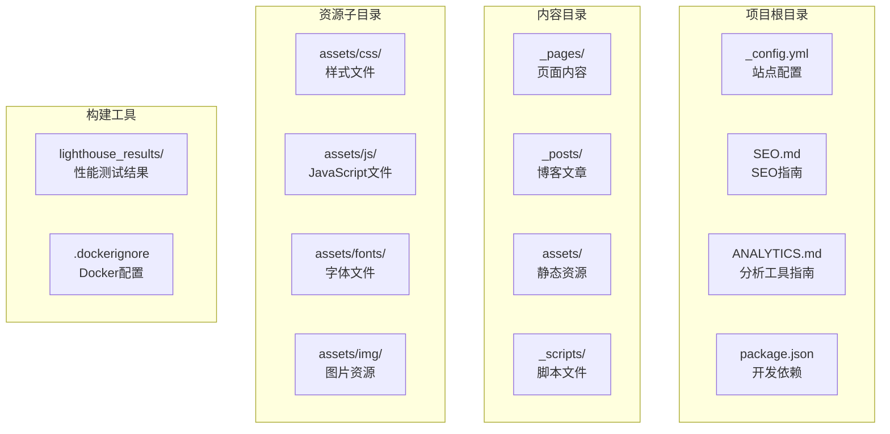

**图表来源**
- [_config.yml](file://_config.yml)
- [package.json](file://package.json)

**章节来源**
- [_config.yml](file://_config.yml)
- [package.json](file://package.json)

## 核心组件

### 配置管理系统

站点通过 `_config.yml` 实现集中式配置管理，涵盖以下关键功能模块：

- **性能优化配置**：启用响应式WebP图片、懒加载、JavaScript压缩等
- **SEO配置**：Open Graph元数据、Schema.org结构化数据、站点验证
- **分析工具集成**：Google Analytics、Pirsch、Cronitor等多平台支持
- **第三方库管理**：CDN资源版本控制和完整性校验

### 资源优化系统

项目实现了多层次的资源优化策略：

- **图片优化**：自动响应式WebP转换、懒加载支持
- **CSS优化**：压缩编译、SRI完整性校验
- **JavaScript优化**：Terser压缩、Tree Shaking、按需加载
- **缓存策略**：HTTP缓存头、CDN集成

**章节来源**
- [_config.yml](file://_config.yml)

## 架构概览

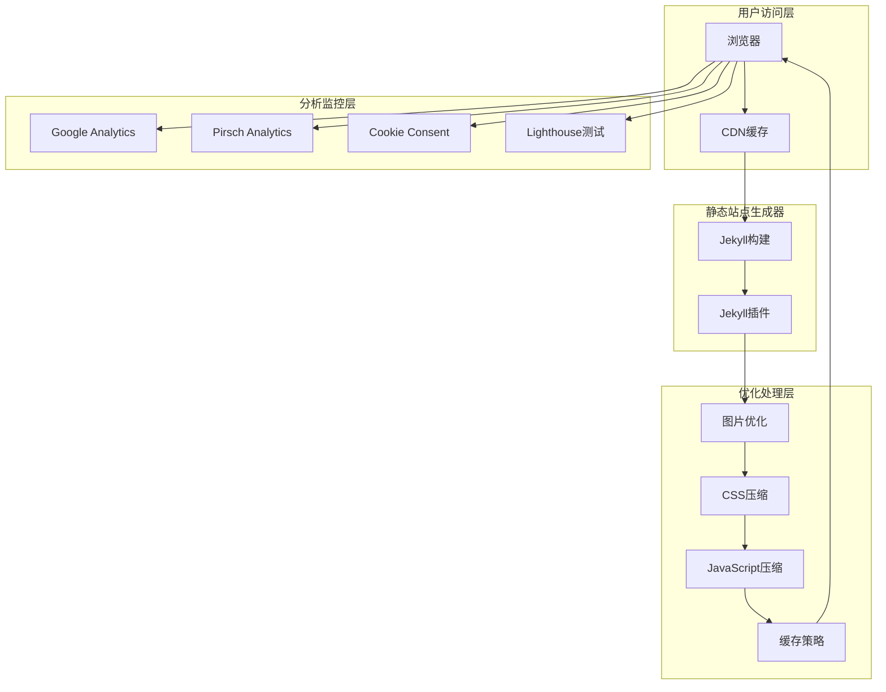

**图表来源**
- [_config.yml](file://_config.yml)
- [SEO.md](file://SEO.md)
- [ANALYTICS.md](file://ANALYTICS.md)

## 详细组件分析

### 图片优化系统

#### 响应式WebP转换

项目实现了自动化的图片优化流程：

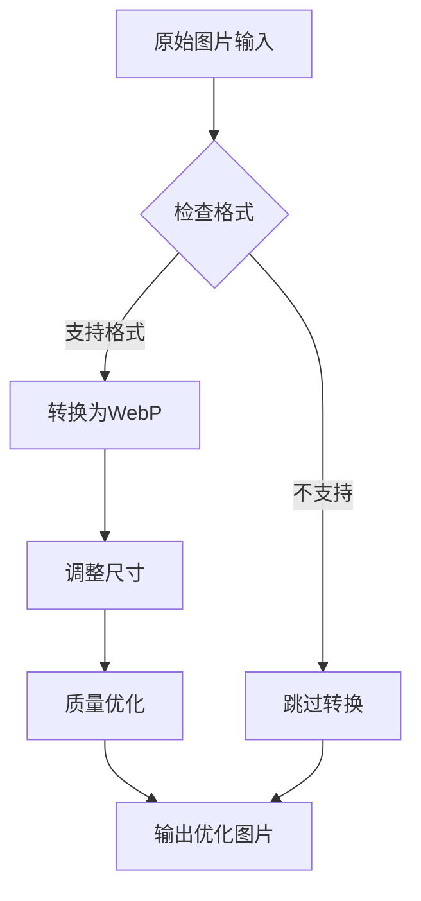

**图表来源**
- [_config.yml](file://_config.yml)

**配置要点**：
- 支持格式：`.jpg`, `.jpeg`, `.png`, `.tiff`, `.gif`
- 输出质量：85%
- 尺寸配置：480px, 800px, 1400px
- 自动添加 `loading="lazy"` 属性

#### 图片懒加载实现

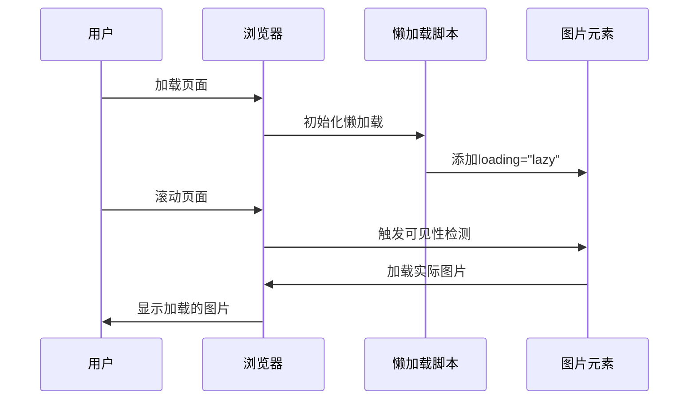

**图表来源**
- [_config.yml](file://_config.yml)

**章节来源**
- [_config.yml](file://_config.yml)

### JavaScript优化策略

#### Tree Shaking和按需加载

项目采用模块化JavaScript架构：

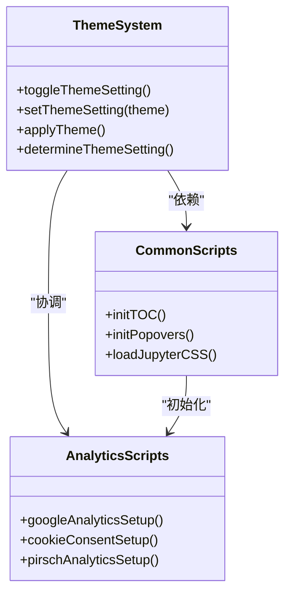

**图表来源**
- [assets/js/theme.js](file://assets/js/theme.js)
- [assets/js/common.js](file://assets/js/common.js)

#### Terser压缩配置

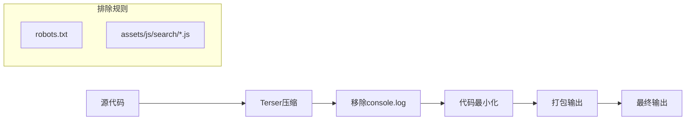

**图表来源**
- [_config.yml](file://_config.yml)

**章节来源**
- [_config.yml](file://_config.yml)
- [assets/js/theme.js](file://assets/js/theme.js)
- [assets/js/common.js](file://assets/js/common.js)

### SEO配置实现

#### 结构化数据标记

项目支持多种结构化数据格式：

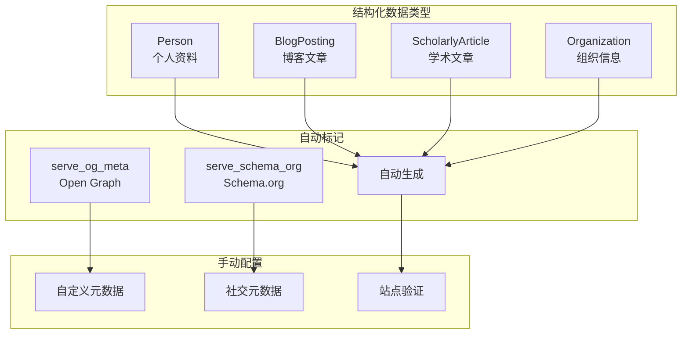

**图表来源**
- [_config.yml](file://_config.yml)
- [SEO.md](file://SEO.md)

#### 搜索引擎优化最佳实践

**页面标题和描述优化**：
- 每个页面都应包含独特的标题（60字符以内）
- 描述长度控制在120-160字符之间
- 包含关键词但保持自然流畅

**内部链接策略**：
- 在相关内容间建立逻辑连接
- 使用描述性锚文本
- 维持网站的整体导航结构

**内容结构优化**：
- 合理使用HTML标题层级
- 保持语义化标记
- 优化可读性和可访问性

**章节来源**
- [SEO.md](file://SEO.md)

### 分析工具集成

#### 多平台分析系统

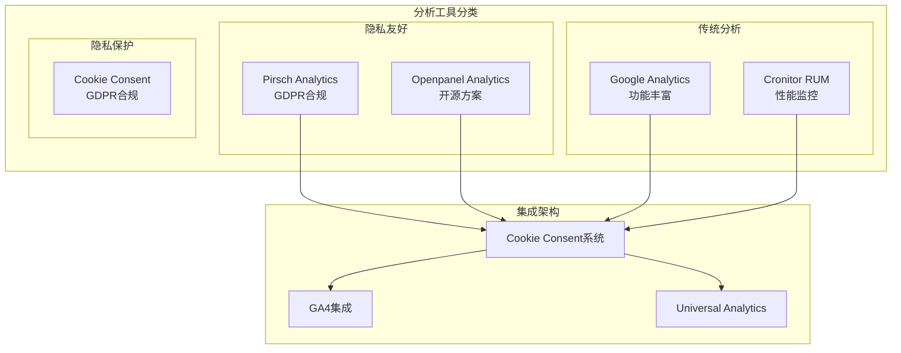

**图表来源**
- [ANALYTICS.md](file://ANALYTICS.md)
- [_scripts/cookie-consent-setup.js](file://_scripts/cookie-consent-setup.js)

#### Cookie同意管理

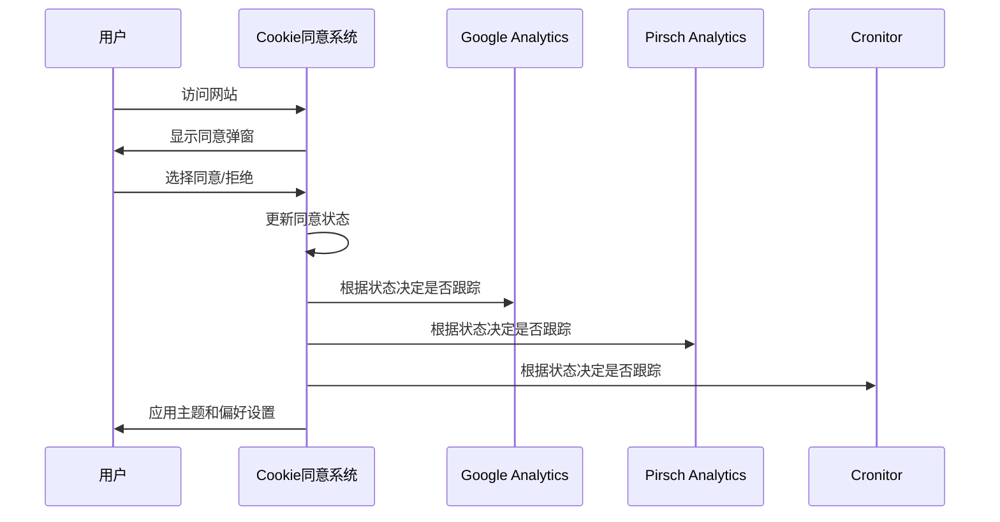

**图表来源**
- [_scripts/cookie-consent-setup.js](file://_scripts/cookie-consent-setup.js)

**章节来源**
- [ANALYTICS.md](file://ANALYTICS.md)
- [_scripts/cookie-consent-setup.js](file://_scripts/cookie-consent-setup.js)

### Lighthouse性能测试

#### 性能指标分析

根据Lighthouse桌面端测试结果，当前站点的关键性能指标如下：

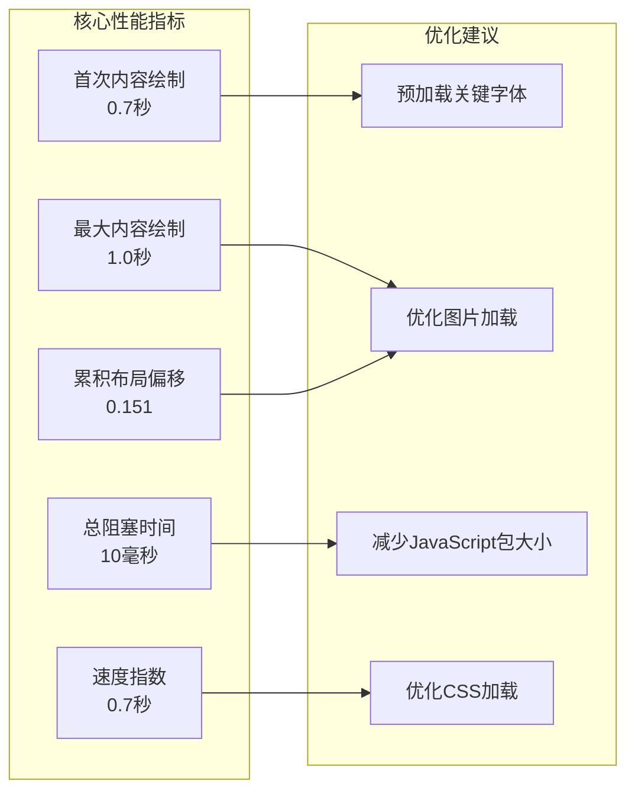

**图表来源**
- [lighthouse_results/desktop/alshedivat_github_io_al_folio_.html](file://lighthouse_results/desktop/alshedivat_github_io_al_folio_.html)

**性能优化建议**：
1. **字体预加载**：为关键字体添加 `rel="preload"`
2. **图片优化**：使用现代格式如WebP，实现响应式图片
3. **JavaScript优化**：进一步拆分大型脚本，实现按需加载
4. **CSS优化**：内联关键CSS，延迟非关键样式

**章节来源**
- [lighthouse_results/desktop/alshedivat_github_io_al_folio_.html](file://lighthouse_results/desktop/alshedivat_github_io_al_folio_.html)

## 依赖关系分析

### 第三方库管理

项目通过CDN方式管理第三方库，确保版本一致性和安全性：

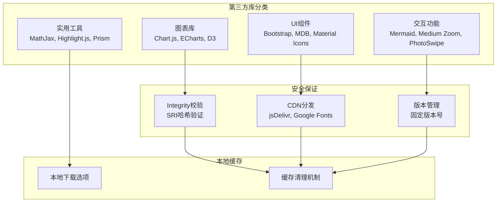

**图表来源**
- [_config.yml](file://_config.yml)

### 构建工具链

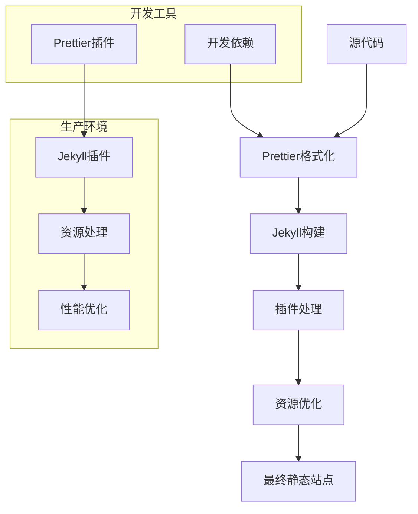

**图表来源**
- [package.json](file://package.json)

**章节来源**
- [_config.yml](file://_config.yml)
- [package.json](file://package.json)

## 性能考虑

### 缓存策略

项目实现了多层次的缓存机制：

1. **浏览器缓存**：通过Jekyll插件自动添加适当的缓存头
2. **CDN缓存**：利用CDN进行全球内容分发
3. **服务端缓存**：GitHub Pages提供的静态文件缓存
4. **应用缓存**：浏览器应用缓存机制

### 移动端优化

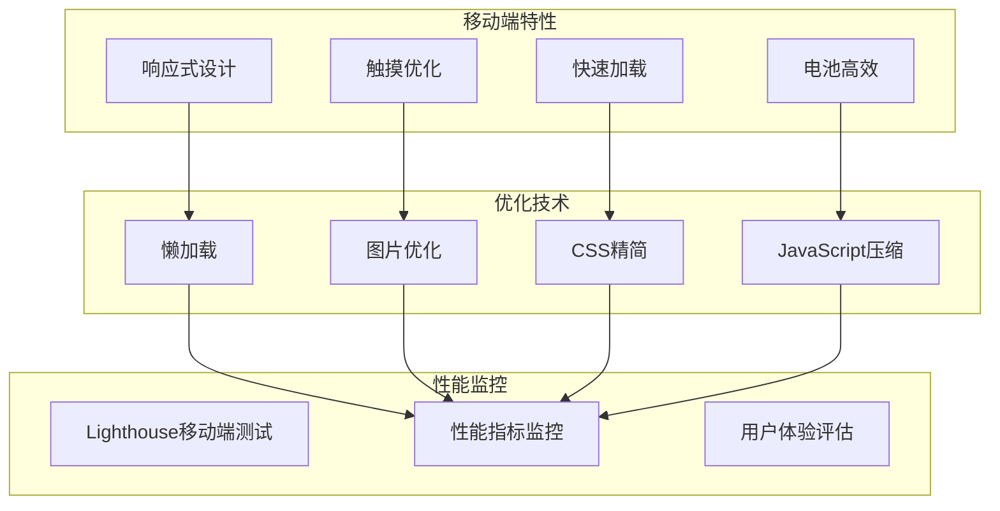

**章节来源**
- [_config.yml](file://_config.yml)

## 故障排除指南

### 常见问题诊断

#### 图片加载问题

**症状**：图片无法显示或加载缓慢
**解决方案**：
1. 检查图片路径是否正确
2. 验证WebP转换是否成功
3. 确认懒加载配置是否启用
4. 检查CDN连接状态

#### 分析工具问题

**症状**：分析数据缺失或错误
**解决方案**：
1. 验证Google Analytics ID配置
2. 检查Cookie同意系统的初始化
3. 确认第三方库的CDN可用性
4. 验证SRI完整性校验

#### SEO配置问题

**症状**：搜索引擎抓取异常
**解决方案**：
1. 检查Open Graph元数据配置
2. 验证Schema.org标记生成
3. 确认robots.txt规则
4. 测试结构化数据有效性

**章节来源**
- [ANALYTICS.md](file://ANALYTICS.md)
- [SEO.md](file://SEO.md)

## 结论

本指南提供了基于Jekyll的静态站点性能优化和SEO的完整解决方案。通过实施响应式图片优化、JavaScript模块化、结构化数据标记、多平台分析工具集成等策略，可以显著提升网站性能和搜索引擎可见性。

关键成功因素包括：
- 持续的性能监控和优化
- 遵循隐私保护法规
- 定期更新第三方库版本
- 建立完善的测试流程

建议定期运行Lighthouse测试，监控关键性能指标，并根据测试结果持续优化网站性能和用户体验。

## 附录

### 快速参考清单

**性能优化检查项**：
- [ ] 图片已转换为WebP格式
- [ ] 启用了图片懒加载
- [ ] JavaScript已压缩和模块化
- [ ] CSS已压缩和内联关键样式
- [ ] CDN缓存配置正确
- [ ] Lighthouse性能评分达标

**SEO配置检查项**：
- [ ] Open Graph元数据完整
- [ ] Schema.org结构化数据启用
- [ ] robots.txt配置正确
- [ ] sitemap.xml生成和提交
- [ ] 页面标题和描述优化
- [ ] 内部链接结构合理

**分析工具配置检查项**：
- [ ] Cookie同意系统正确初始化
- [ ] Google Analytics配置正确
- [ ] 分析工具隐私合规
- [ ] 数据收集权限明确
- [ ] 用户选择权得到保障