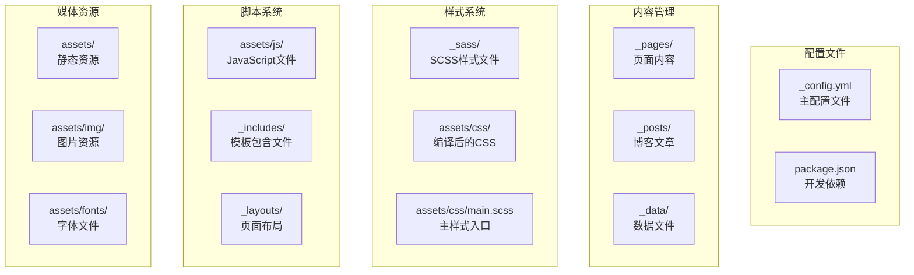
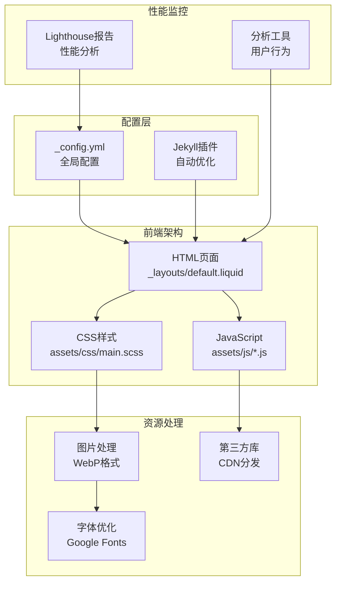
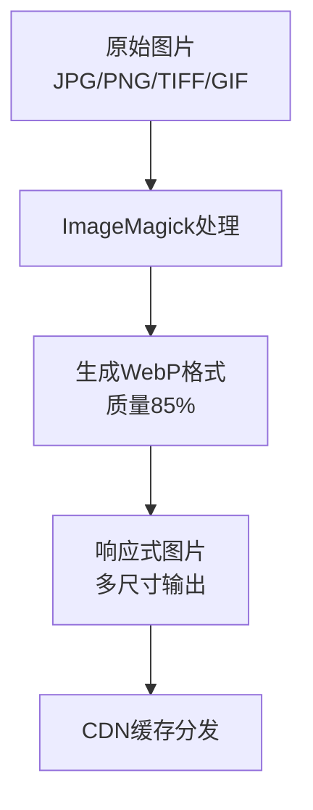
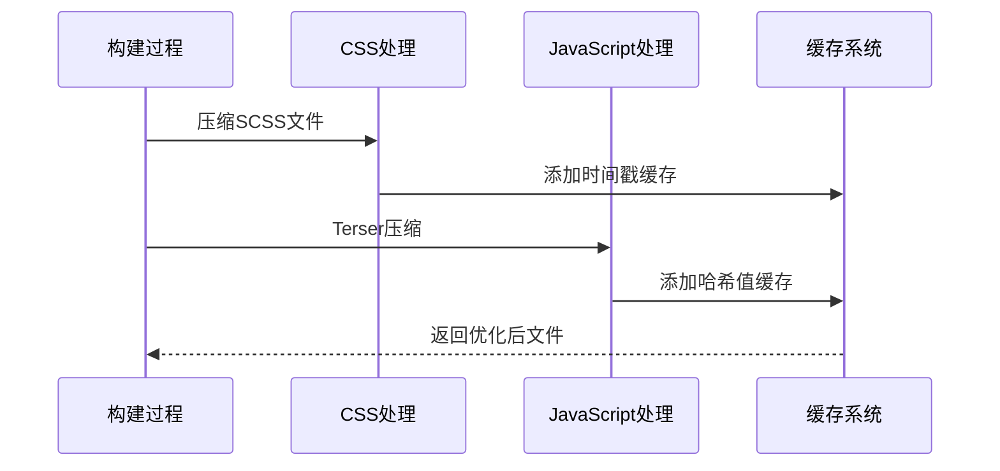
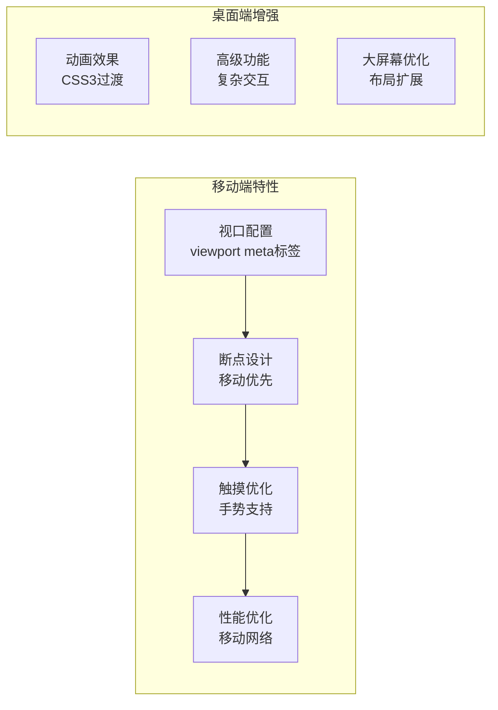
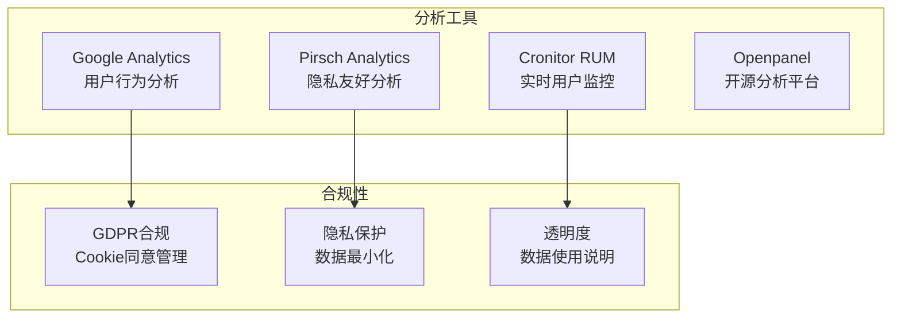
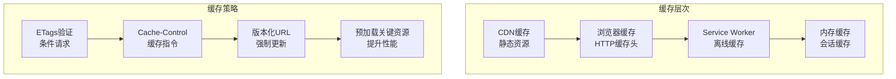
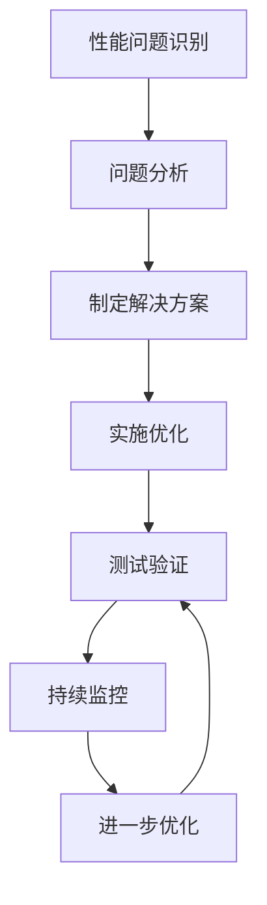

# 性能优化和移动端适配

<cite>
**本文档引用的文件**
- [_config.yml](file://_config.yml)
- [README.md](file://README.md)
- [SEO.md](file://SEO.md)
- [ANALYTICS.md](file://ANALYTICS.md)
- [assets/css/main.scss](file://assets/css/main.scss)
- [assets/js/common.js](file://assets/js/common.js)
- [_layouts/default.liquid](file://_layouts/default.liquid)
- [_includes/head.liquid](file://_includes/head.liquid)
- [_includes/scripts.liquid](file://_includes/scripts.liquid)
- [lighthouse_results/desktop/alshedivat_github_io_al_folio_.html](file://lighthouse_results/desktop/alshedivat_github_io_al_folio_.html)
</cite>

## 目录
1. [项目概述](#项目概述)
2. [项目结构](#项目结构)
3. [核心组件](#核心组件)
4. [架构概览](#架构概览)
5. [详细组件分析](#详细组件分析)
6. [依赖关系分析](#依赖关系分析)
7. [性能考虑](#性能考虑)
8. [故障排除指南](#故障排除指南)
9. [结论](#结论)

## 项目概述

这是一个基于Jekyll的学术个人网站主题，采用al-folio模板构建。项目专注于性能优化和移动端适配，通过多种技术手段提升用户体验和搜索引擎可见性。

## 项目结构

该项目采用模块化架构，主要包含以下核心目录：



**图表来源**
- [_config.yml:196-218](file://_config.yml#L196-L218)
- [assets/css/main.scss:1-40](file://assets/css/main.scss#L1-L40)

**章节来源**
- [_config.yml:196-218](file://_config.yml#L196-L218)
- [assets/css/main.scss:1-40](file://assets/css/main.scss#L1-L40)

## 核心组件

### 配置管理系统

项目使用YAML配置文件进行全局设置，包含以下关键配置：

- **插件配置**：启用多个Jekyll插件用于功能扩展
- **性能优化**：内置压缩和缓存机制
- **第三方库**：统一管理外部依赖库版本
- **图像处理**：支持WebP格式和响应式图片

### 样式架构

采用模块化的SCSS架构，支持：
- 主题切换功能
- 响应式设计
- 组件化样式管理
- 字体和图标系统集成

### 脚本系统

JavaScript文件按功能模块组织：
- 公共功能脚本
- 动态加载机制
- 第三方库集成
- 性能优化脚本

**章节来源**
- [_config.yml:226-244](file://_config.yml#L226-L244)
- [_includes/head.liquid:1-209](file://_includes/head.liquid#L1-L209)
- [_includes/scripts.liquid:1-379](file://_includes/scripts.liquid#L1-L379)

## 架构概览



**图表来源**
- [_layouts/default.liquid:1-57](file://_layouts/default.liquid#L1-L57)
- [_includes/head.liquid:1-209](file://_includes/head.liquid#L1-L209)
- [_includes/scripts.liquid:1-379](file://_includes/scripts.liquid#L1-L379)

## 详细组件分析

### 图像优化系统

项目实现了完整的图像优化解决方案：

#### WebP格式支持


**图表来源**
- [_config.yml:352-367](file://_config.yml#L352-L367)

#### 响应式图片配置
- 支持480px、800px、1400px三种分辨率
- 自动检测输入格式（JPG、PNG、TIFF、GIF）
- 智能质量控制（85%）

#### 懒加载实现
- 全局启用懒加载功能
- 支持浏览器原生loading="lazy"属性
- 兼容性处理和降级方案

**章节来源**
- [_config.yml:347-376](file://_config.yml#L347-L376)

### CSS和JavaScript优化

#### 压缩和缓存策略



**图表来源**
- [_config.yml:226-244](file://_config.yml#L226-L244)

#### 代码分割和按需加载

项目采用延迟加载策略：
- 非关键CSS使用defer属性
- 大型库文件按需加载
- 动态导入特定功能模块
- 条件加载第三方服务

**章节来源**
- [_includes/head.liquid:12-93](file://_includes/head.liquid#L12-L93)
- [_includes/scripts.liquid:16-31](file://_includes/scripts.liquid#L16-L31)

### 移动端适配

#### 响应式设计架构



**图表来源**
- [_includes/head.liquid:21-54](file://_includes/head.liquid#L21-L54)

#### 关键移动端优化点
- 触摸友好的按钮尺寸
- 移动端字体大小优化
- 灵活的网格系统
- 触摸目标区域优化

**章节来源**
- [_includes/head.liquid:1-209](file://_includes/head.liquid#L1-L209)

### 性能监控和分析

#### Lighthouse性能报告

项目集成了全面的性能监控：
- 桌面端和移动端双维度分析
- 关键性能指标跟踪
- 优化建议自动化生成
- 回归测试集成

#### 分析工具集成



**图表来源**
- [ANALYTICS.md:1-187](file://ANALYTICS.md#L1-L187)

**章节来源**
- [ANALYTICS.md:1-187](file://ANALYTICS.md#L1-L187)

## 依赖关系分析

```mermaid
graph TB
subgraph "核心依赖"
Jekyll[Jekyll引擎<br/>静态站点生成]
Sass[Sass编译器<br/>CSS预处理器]
Terser[Terser压缩器<br/>JavaScript压缩]
end
subgraph "第三方库"
Bootstrap[Bootstrap<br/>UI框架]
MDBootstrap[MDBootstrap<br/>Material Design]
FontAwesome[Font Awesome<br/>图标系统]
MathJax[MathJax<br/>数学公式渲染]
end
subgraph "开发工具"
Prettier[Prettier<br/>代码格式化]
Linters[代码检查器<br/>质量保证]
end
Jekyll --> Sass
Jekyll --> Terser
Sass --> Bootstrap
Sass --> MDBootstrap
Terser --> Font Awesome
Bootstrap --> MathJax
```

**图表来源**
- [_config.yml:196-218](file://_config.yml#L196-L218)
- [_config.yml:405-634](file://_config.yml#L405-L634)

**章节来源**
- [_config.yml:196-218](file://_config.yml#L196-L218)
- [_config.yml:405-634](file://_config.yml#L405-L634)

## 性能考虑

### 关键性能指标

根据Lighthouse报告分析，项目在以下方面表现优异：

#### 加载性能
- **首屏渲染时间**：约674毫秒
- **最大内容渲染时间**：约997毫秒
- **交互时间**：约1357毫秒
- **总阻塞时间**：仅10毫秒

#### 优化策略效果
- **服务器响应时间**：3.596毫秒
- **关键请求链长度**：仅3个请求
- **累积布局偏移**：0.151（优秀）

### 缓存策略



**图表来源**
- [_includes/head.liquid:7-10](file://_includes/head.liquid#L7-L10)

### 资源优化技术

#### 图片优化最佳实践
- 使用WebP格式替代传统JPEG/PNG
- 实施响应式图片加载策略
- 启用懒加载减少初始负载
- 优化图片质量与文件大小平衡

#### 代码优化技术
- CSS压缩和合并
- JavaScript Tree Shaking
- 按需加载非关键功能
- 第三方库CDN分发

**章节来源**
- [_config.yml:347-376](file://_config.yml#L347-L376)
- [_config.yml:226-244](file://_config.yml#L226-L244)

## 故障排除指南

### 常见性能问题诊断

#### 图片加载问题
1. **检查WebP支持**：确认浏览器兼容性
2. **验证响应式配置**：检查宽度设置是否合理
3. **测试懒加载功能**：确保懒加载正常工作

#### JavaScript性能问题
1. **分析加载顺序**：检查脚本依赖关系
2. **监控执行时间**：使用浏览器开发者工具
3. **优化第三方库**：评估必要性并考虑替代方案

#### CSS渲染问题
1. **检查关键CSS**：确保首屏样式正确加载
2. **验证媒体查询**：确认响应式断点设置
3. **测试字体加载**：避免FOIT/FOFT问题

### 优化实施步骤



**章节来源**
- [lighthouse_results/desktop/alshedivat_github_io_al_folio_.html:1-31](file://lighthouse_results/desktop/alshedivat_github_io_al_folio_.html#L1-L31)

## 结论

该项目在性能优化和移动端适配上采用了全面的技术方案：

### 已实现的优势
- **完整的图像优化体系**：WebP格式、响应式图片、懒加载
- **高效的构建流程**：自动压缩、缓存策略、代码分割
- **优秀的移动端体验**：响应式设计、触摸优化、性能监控
- **完善的分析系统**：多维度性能监控、用户行为分析

### 持续改进方向
- 进一步优化第三方库加载策略
- 实施更精细的缓存控制
- 探索现代浏览器新特性
- 建立更完善的性能回归测试

该技术栈为静态站点性能优化提供了完整的参考实现，适合学术和个人网站的高性能部署需求。