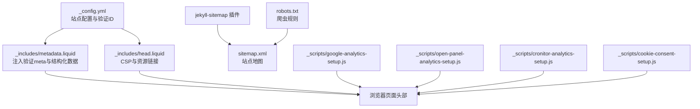
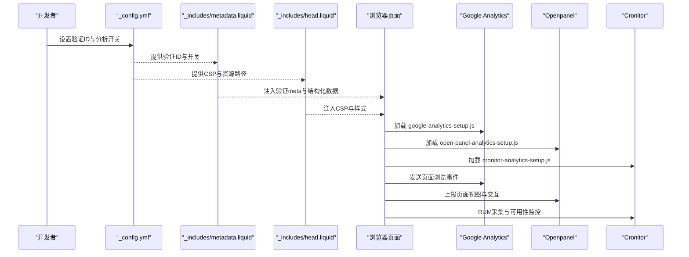
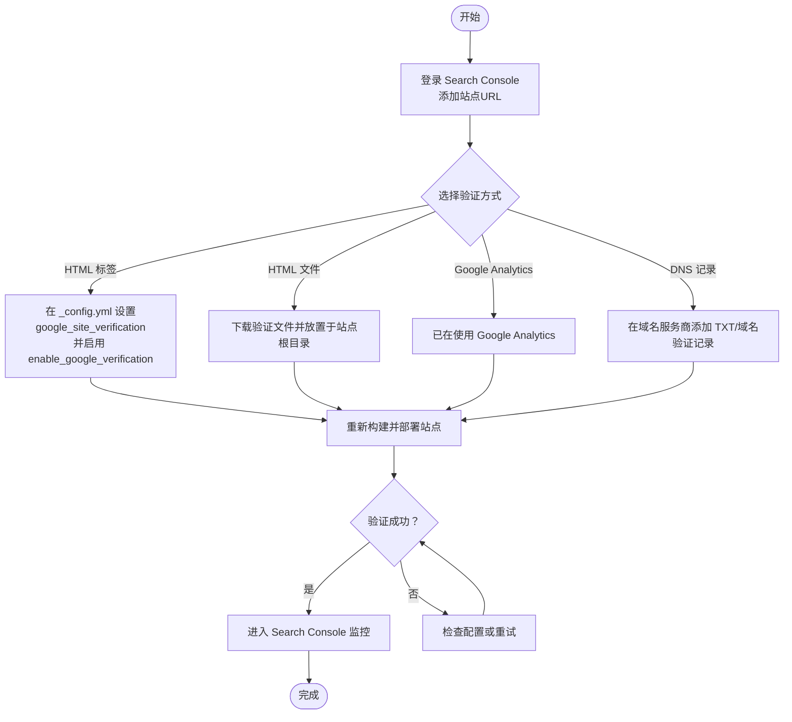
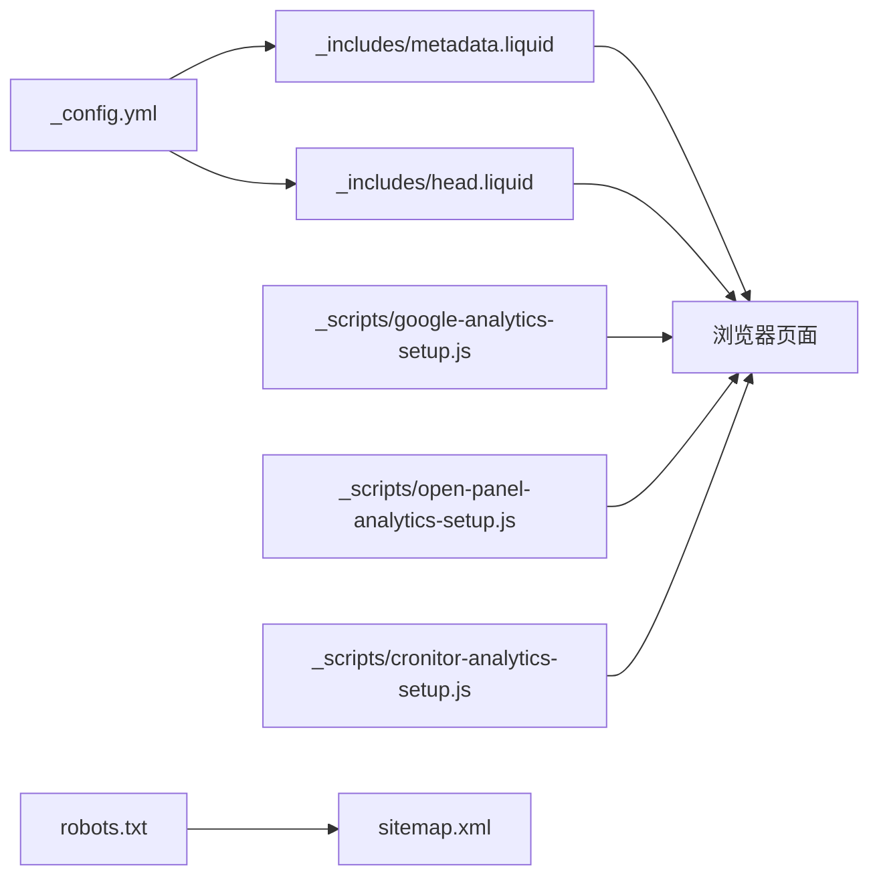

# 搜索引擎控制台和分析工具

<cite>
**本文引用的文件**
- [_config.yml](file://_config.yml)
- [SEO.md](file://SEO.md)
- [ANALYTICS.md](file://ANALYTICS.md)
- [_includes/head.liquid](file://_includes/head.liquid)
- [_includes/metadata.liquid](file://_includes/metadata.liquid)
- [robots.txt](file://robots.txt)
- [_scripts/google-analytics-setup.js](file://_scripts/google-analytics-setup.js)
- [_scripts/open-panel-analytics-setup.js](file://_scripts/open-panel-analytics-setup.js)
- [_scripts/cronitor-analytics-setup.js](file://_scripts/cronitor-analytics-setup.js)
- [_scripts/cookie-consent-setup.js](file://_scripts/cookie-consent-setup.js)
</cite>

## 目录
1. [简介](#简介)
2. [项目结构](#项目结构)
3. [核心组件](#核心组件)
4. [架构总览](#架构总览)
5. [详细组件分析](#详细组件分析)
6. [依赖关系分析](#依赖关系分析)
7. [性能考量](#性能考量)
8. [故障排查指南](#故障排查指南)
9. [结论](#结论)
10. [附录](#附录)

## 简介
本指南面向使用 al-folio 主题的学术型网站，系统讲解搜索引擎控制台与分析工具的配置与运维。内容覆盖：
- Google Search Console 的添加、所有权验证与监控设置
- Bing Webmaster Tools 的配置与双重验证优势
- 验证代码在站点中的正确添加方式与 _config.yml 中的配置项
- 如何监控搜索表现、覆盖率错误、增强功能与 sitemap 状态
- 定期检查与维护的最佳实践

## 项目结构
围绕搜索引擎控制台与分析工具的关键文件与职责如下：
- 配置中心：_config.yml 提供站点元数据、验证 ID、分析服务开关与默认行为
- 元数据注入：_includes/metadata.liquid 在页面头部动态注入验证 meta 标签与结构化数据
- 分析脚本：_scripts/*.js 负责加载各分析服务（如 Google Analytics、Openpanel、Cronitor）
- 站点地图与爬虫规则：jekyll-sitemap 插件生成 sitemap.xml；robots.txt 声明 sitemap 地址
- 头部与安全策略：_includes/head.liquid 设置 CSP、favicon、主题样式等

图表来源
- [_config.yml](file://_config.yml)
- [_includes/metadata.liquid](file://_includes/metadata.liquid)
- [_includes/head.liquid](file://_includes/head.liquid)
- [robots.txt](file://robots.txt)

章节来源
- [_config.yml](file://_config.yml)
- [_includes/metadata.liquid](file://_includes/metadata.liquid)
- [_includes/head.liquid](file://_includes/head.liquid)
- [robots.txt](file://robots.txt)

## 核心组件
- 搜索引擎验证与结构化数据
  - 验证标签：通过 _includes/metadata.liquid 条件注入 google-site-verification 与 msvalidate.01
  - 结构化数据：在开启时输出 Schema.org JSON-LD
- 分析工具集成
  - Google Analytics：通过 _scripts/google-analytics-setup.js 注入 GA4 配置
  - Openpanel：通过 _scripts/open-panel-analytics-setup.js 初始化客户端
  - Cronitor：通过 _scripts/cronitor-analytics-setup.js 初始化 RUM
  - Cookie 同意：_scripts/cookie-consent-setup.js 统一管理隐私合规与分类同意
- 爬虫与索引
  - robots.txt 指向 sitemap.xml，确保搜索引擎可发现站点地图
  - jekyll-sitemap 插件自动生成 sitemap.xml

章节来源
- [_includes/metadata.liquid](file://_includes/metadata.liquid)
- [_scripts/google-analytics-setup.js](file://_scripts/google-analytics-setup.js)
- [_scripts/open-panel-analytics-setup.js](file://_scripts/open-panel-analytics-setup.js)
- [_scripts/cronitor-analytics-setup.js](file://_scripts/cronitor-analytics-setup.js)
- [_scripts/cookie-consent-setup.js](file://_scripts/cookie-consent-setup.js)
- [robots.txt](file://robots.txt)

## 架构总览
下图展示从配置到页面渲染再到分析上报的整体流程。

图表来源
- [_config.yml](file://_config.yml)
- [_includes/metadata.liquid](file://_includes/metadata.liquid)
- [_includes/head.liquid](file://_includes/head.liquid)
- [_scripts/google-analytics-setup.js](file://_scripts/google-analytics-setup.js)
- [_scripts/open-panel-analytics-setup.js](file://_scripts/open-panel-analytics-setup.js)
- [_scripts/cronitor-analytics-setup.js](file://_scripts/cronitor-analytics-setup.js)

## 详细组件分析

### Google Search Console 配置
- 添加网站
  - 登录 Google Search Console，选择“URL Prefix”，输入站点地址（例如 https://MingyuLi.com）
- 所有权验证
  - 支持多种方式：HTML 文件上传、HTML 标签、Google Analytics（已接入 GA）、DNS 记录
  - 使用 HTML 标签方式时，需在 _config.yml 中设置 google_site_verification 并启用 enable_google_verification
- 监控设置
  - 性能：查看查询词、点击率、排名位置
  - 覆盖率：检查索引错误与失败原因
  - 增强功能：Schema.org 验证与 Rich Results
  - Sitemaps：确认 sitemap.xml 已提交且状态正常

图表来源
- [SEO.md](file://SEO.md)
- [_config.yml](file://_config.yml)
- [_includes/metadata.liquid](file://_includes/metadata.liquid)

章节来源
- [SEO.md](file://SEO.md)
- [_config.yml](file://_config.yml)
- [_includes/metadata.liquid](file://_includes/metadata.liquid)

### Bing Webmaster Tools 配置
- 添加与验证
  - 登录 Bing Webmaster Tools，添加站点
  - 若已验证 Google Search Console，通常可自动验证
  - 将 bing_site_verification 写入 _config.yml 并启用 enable_bing_verification
- 双重验证的好处
  - 同时覆盖两大主流搜索引擎，提升索引覆盖面与稳定性
  - 双面板监控，便于交叉验证与问题定位

章节来源
- [SEO.md](file://SEO.md)
- [_config.yml](file://_config.yml)
- [_includes/metadata.liquid](file://_includes/metadata.liquid)

### 验证代码的正确添加方式与 _config.yml 配置项
- 在 _config.yml 中设置以下键值：
  - google_site_verification：Google 验证码
  - bing_site_verification：Bing 验证码
  - enable_google_verification：是否注入 Google 验证 meta
  - enable_bing_verification：是否注入 Bing 验证 meta
- _includes/metadata.liquid 会根据上述开关与值动态插入对应 meta 标签

章节来源
- [_config.yml](file://_config.yml)
- [_includes/metadata.liquid](file://_includes/metadata.liquid)

### 监控搜索性能、覆盖率错误、增强功能与 sitemap 状态
- 性能与覆盖率
  - 在 Search Console 查看查询表现、点击率、排名位置
  - 关注覆盖率报告中的错误类型与频率，及时修复
- 增强功能
  - 使用结构化数据验证工具检查 Schema.org 标记
  - 在 _config.yml 开启 serve_schema_org 后，模板会自动输出 JSON-LD
- Sitemap 状态
  - 确认 sitemap.xml 可访问
  - robots.txt 中声明了 Sitemap 地址
  - 在 Search Console 的 Sitemaps 标签页提交并监控状态

章节来源
- [SEO.md](file://SEO.md)
- [_includes/metadata.liquid](file://_includes/metadata.liquid)
- [robots.txt](file://robots.txt)

### 分析工具配置与最佳实践
- Google Analytics
  - 获取 Measurement ID（G-XXXXXXXXXX），在 _config.yml 中设置 google_analytics，并启用 enable_google_analytics
  - 页面加载后由 _scripts/google-analytics-setup.js 注入配置
- Pirsch/Openpanel/Cronitor
  - 在 _config.yml 中分别设置对应的 Site ID 或 Client ID，并启用相应开关
  - 对应的 _scripts/*.js 会在页面中初始化
- Cookie 同意与隐私合规
  - 启用 enable_cookie_consent 后，_scripts/cookie-consent-setup.js 以分类同意模式统一管理
  - Google Consent Mode 默认拒绝存储，用户同意后才放行分析脚本

章节来源
- [ANALYTICS.md](file://ANALYTICS.md)
- [_config.yml](file://_config.yml)
- [_scripts/google-analytics-setup.js](file://_scripts/google-analytics-setup.js)
- [_scripts/open-panel-analytics-setup.js](file://_scripts/open-panel-analytics-setup.js)
- [_scripts/cronitor-analytics-setup.js](file://_scripts/cronitor-analytics-setup.js)
- [_scripts/cookie-consent-setup.js](file://_scripts/cookie-consent-setup.js)

## 依赖关系分析
- 配置到注入
  - _config.yml 提供验证 ID 与开关
  - _includes/metadata.liquid 条件注入验证 meta 与结构化数据
- 分析脚本加载
  - 页面头部由 _includes/head.liquid 统一引入样式与安全策略
  - 各分析脚本通过 Liquid 变量读取 _config.yml 中的 ID 并初始化
- 索引与爬虫
  - robots.txt 指向 sitemap.xml，确保搜索引擎可抓取
  - jekyll-sitemap 插件自动生成 sitemap.xml

图表来源
- [_config.yml](file://_config.yml)
- [_includes/metadata.liquid](file://_includes/metadata.liquid)
- [_includes/head.liquid](file://_includes/head.liquid)
- [_scripts/google-analytics-setup.js](file://_scripts/google-analytics-setup.js)
- [_scripts/open-panel-analytics-setup.js](file://_scripts/open-panel-analytics-setup.js)
- [_scripts/cronitor-analytics-setup.js](file://_scripts/cronitor-analytics-setup.js)
- [robots.txt](file://robots.txt)

章节来源
- [_config.yml](file://_config.yml)
- [_includes/metadata.liquid](file://_includes/metadata.liquid)
- [_includes/head.liquid](file://_includes/head.liquid)
- [_scripts/google-analytics-setup.js](file://_scripts/google-analytics-setup.js)
- [_scripts/open-panel-analytics-setup.js](file://_scripts/open-panel-analytics-setup.js)
- [_scripts/cronitor-analytics-setup.js](file://_scripts/cronitor-analytics-setup.js)
- [robots.txt](file://robots.txt)

## 性能考量
- 站点地图与 robots.txt
  - 确保 sitemap.xml 可访问，robots.txt 正确指向 sitemap
- 结构化数据与 Open Graph
  - 合理开启 serve_schema_org 与 serve_og_meta，避免过度标记导致体积增大
- 分析脚本与隐私
  - 使用 Cookie 同意与分类同意，减少不必要的数据采集
  - 优先选择隐私友好的分析服务（如 Pirsch、Openpanel）

## 故障排查指南
- 验证未生效
  - 检查 _config.yml 是否设置 google_site_verification/ bing_site_verification
  - 确认已启用 enable_google_verification/ enable_bing_verification
  - 确认已重新构建并部署站点
- 结构化数据错误
  - 使用 Schema.org 验证器检查 JSON-LD 输出
  - 确认 serve_schema_org 已开启
- 分析数据异常
  - 检查各分析服务的 ID 是否正确
  - 确认对应开关已启用
  - 使用浏览器开发者工具查看网络请求与控制台错误
- 索引问题
  - 在 Search Console 查看覆盖率报告，修复错误
  - 确认 robots.txt 未阻止关键页面
  - 确认 sitemap.xml 已提交并可访问

章节来源
- [_config.yml](file://_config.yml)
- [_includes/metadata.liquid](file://_includes/metadata.liquid)
- [robots.txt](file://robots.txt)
- [ANALYTICS.md](file://ANALYTICS.md)

## 结论
通过在 _config.yml 中正确配置验证 ID 与分析开关，并结合 _includes/metadata.liquid 的条件注入机制，可以高效完成 Google Search Console 与 Bing Webmaster Tools 的验证与监控。配合结构化数据、robots.txt 与 sitemap.xml，可显著提升搜索引擎的索引质量与覆盖面。同时，采用 Cookie 同意与隐私友好的分析方案，有助于满足 GDPR 等合规要求并获得更稳定的长期数据。

## 附录
- 快速核对清单
  - 验证：已设置 google_site_verification/ bing_site_verification，已启用对应开关
  - 分析：已设置 google_analytics/ pirsch_analytics/ openpanel_analytics/ cronitor_analytics，已启用对应开关
  - 结构化数据：已启用 serve_schema_org
  - 索引：sitemap.xml 可访问，robots.txt 指向 sitemap
  - 合规：已启用 enable_cookie_consent 并按需配置隐私政策与同意流程