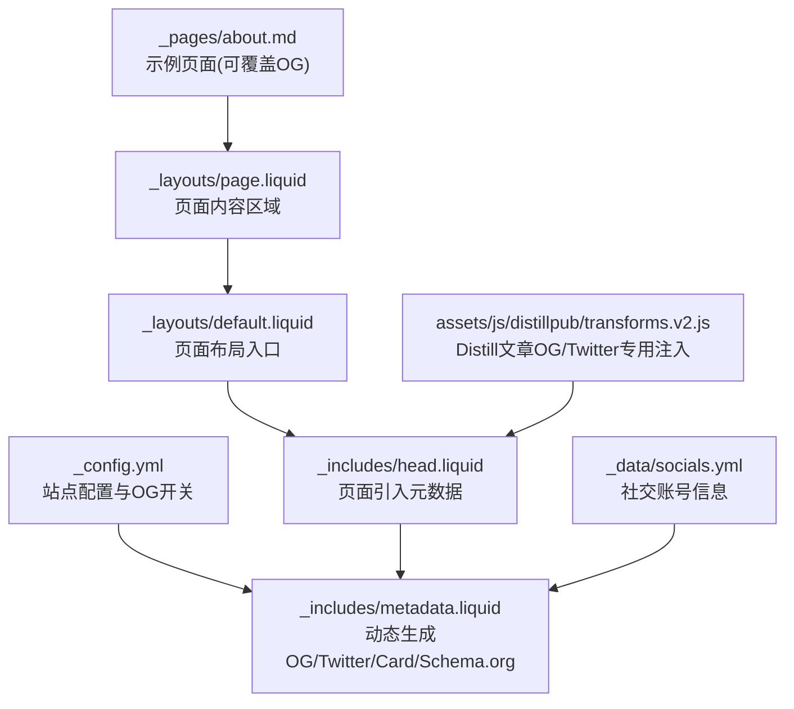
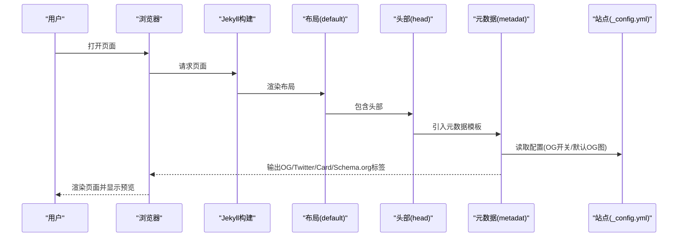
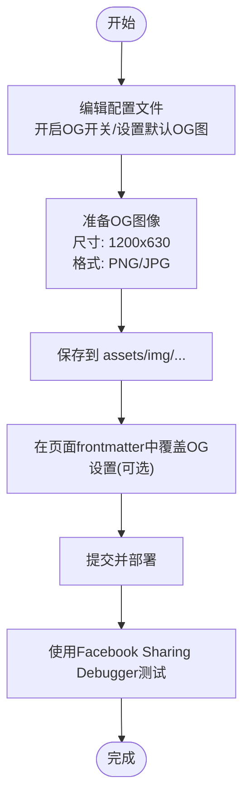
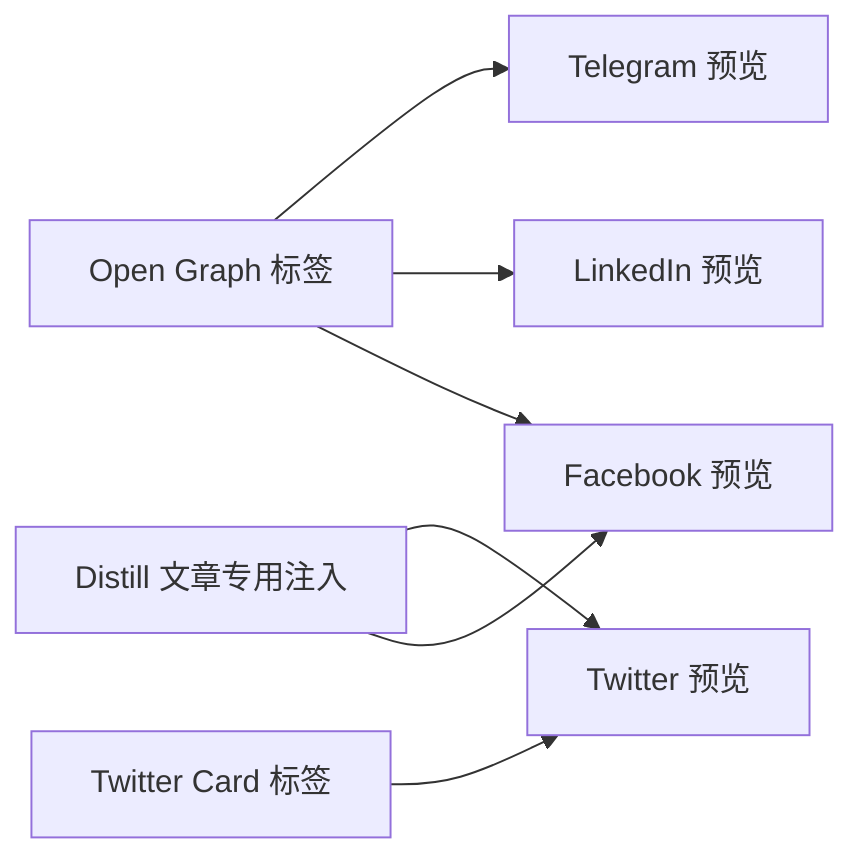
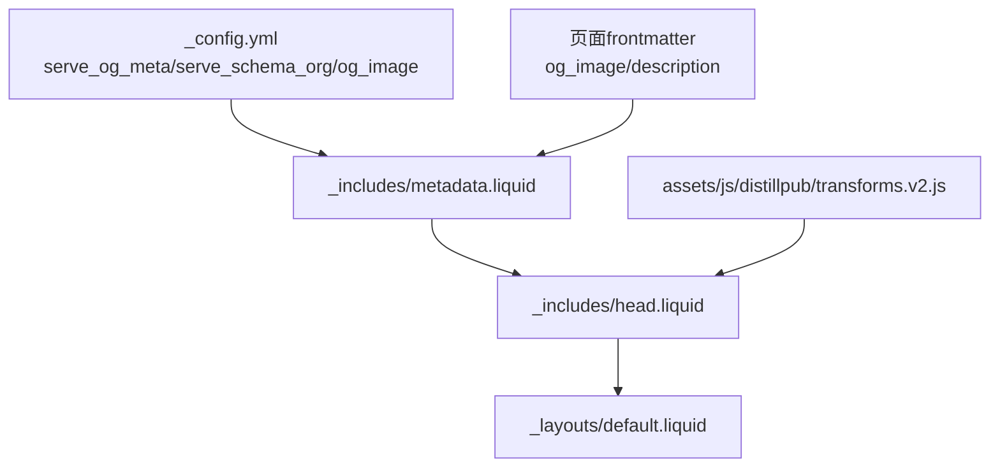

# 社交媒体标记和预览

<cite>
**本文档引用的文件**
- [_config.yml](file://_config.yml)
- [SEO.md](file://SEO.md)
- [_includes/head.liquid](file://_includes/head.liquid)
- [_includes/metadata.liquid](file://_includes/metadata.liquid)
- [_layouts/default.liquid](file://_layouts/default.liquid)
- [_layouts/page.liquid](file://_layouts/page.liquid)
- [_pages/about.md](file://_pages/about.md)
- [_data/socials.yml](file://_data/socials.yml)
- [README.md](file://README.md)
- [assets/js/distillpub/transforms.v2.js](file://assets/js/distillpub/transforms.v2.js)
</cite>

## 目录
1. [简介](#简介)
2. [项目结构](#项目结构)
3. [核心组件](#核心组件)
4. [架构总览](#架构总览)
5. [详细组件分析](#详细组件分析)
6. [依赖关系分析](#依赖关系分析)
7. [性能考量](#性能考量)
8. [故障排查指南](#故障排查指南)
9. [结论](#结论)
10. [附录](#附录)

## 简介
本指南面向希望优化 al-folio 网站在社交媒体上分享预览的用户，系统讲解 Open Graph 协议的工作原理与在 al-folio 中的启用方式；提供 OG 图像的制作规范与保存位置；说明如何为不同页面设置个性化 OG 图像与描述；介绍 Facebook Sharing Debugger 等工具的使用方法；并解释 Twitter Cards 与其他社交媒体平台的集成方式。

## 项目结构
al-folio 通过 Jekyll 模板系统在页面渲染时注入元数据。核心涉及以下文件：
- 配置文件：用于开启 OG 与 Schema.org 标记、设置默认 OG 图像路径
- 元数据模板：在页面头部动态生成 Open Graph、Twitter Card 与 Schema.org 结构化数据
- 布局文件：组织页面结构并在头部引入元数据模板
- 页面示例：展示如何在单个页面中覆盖全局 OG 设置
- 数据文件：社交账号信息，用于 Schema.org 的 sameAs 链接生成

**图表来源**
- [_config.yml](file://_config.yml)
- [_includes/metadata.liquid](file://_includes/metadata.liquid)
- [_includes/head.liquid](file://_includes/head.liquid)
- [_layouts/default.liquid](file://_layouts/default.liquid)
- [_layouts/page.liquid](file://_layouts/page.liquid)
- [_pages/about.md](file://_pages/about.md)
- [_data/socials.yml](file://_data/socials.yml)
- [assets/js/distillpub/transforms.v2.js](file://assets/js/distillpub/transforms.v2.js)

**章节来源**
- [_config.yml](file://_config.yml)
- [_includes/metadata.liquid](file://_includes/metadata.liquid)
- [_includes/head.liquid](file://_includes/head.liquid)
- [_layouts/default.liquid](file://_layouts/default.liquid)
- [_layouts/page.liquid](file://_layouts/page.liquid)
- [_pages/about.md](file://_pages/about.md)
- [_data/socials.yml](file://_data/socials.yml)
- [README.md](file://README.md)

## 核心组件
- 站点配置与开关
  - 在配置文件中启用 OG 与 Schema.org，并可设置全局 OG 图像路径
- 动态元数据模板
  - 条件性输出 Open Graph、Twitter Card 与 Schema.org 结构化数据
  - 支持按页面覆盖全局 OG 图像与描述
- 页面布局与头部
  - 布局文件在页面头部引入元数据模板，确保每个页面都包含所需标记
- Distill 文章专用注入
  - 对 distill.pub 风格文章额外注入更丰富的 OG 与 Twitter 参数

**章节来源**
- [_config.yml](file://_config.yml)
- [_includes/metadata.liquid](file://_includes/metadata.liquid)
- [_includes/head.liquid](file://_includes/head.liquid)
- [_layouts/default.liquid](file://_layouts/default.liquid)
- [assets/js/distillpub/transforms.v2.js](file://assets/js/distillpub/transforms.v2.js)

## 架构总览
下图展示了从配置到页面渲染的端到端流程：

**图表来源**
- [_layouts/default.liquid](file://_layouts/default.liquid)
- [_includes/head.liquid](file://_includes/head.liquid)
- [_includes/metadata.liquid](file://_includes/metadata.liquid)
- [_config.yml](file://_config.yml)

## 详细组件分析

### Open Graph 协议与在 al-folio 中的启用
- 工作原理
  - 当用户在 Facebook、LinkedIn 等平台分享链接时，这些平台会抓取页面的 meta 标签，根据 Open Graph 属性决定预览标题、描述与图片
- al-folio 启用步骤
  - 在配置文件中开启 OG 开关并设置默认 OG 图像路径
  - 在页面 frontmatter 中可覆盖该页面的 OG 图像与描述
- 测试工具
  - 使用 Facebook Sharing Debugger 验证预览是否正确显示

**图表来源**
- [SEO.md](file://SEO.md)
- [_config.yml](file://_config.yml)
- [_includes/metadata.liquid](file://_includes/metadata.liquid)

**章节来源**
- [SEO.md](file://SEO.md)
- [_config.yml](file://_config.yml)
- [_includes/metadata.liquid](file://_includes/metadata.liquid)

### OG 图像制作规范与保存位置
- 尺寸与格式
  - 推荐尺寸：1200x630 像素
  - 推荐格式：PNG 或 JPG
- 保存位置
  - 建议放置于 `assets/img/` 目录下，例如 `assets/img/og-image.png`
- 路径引用
  - 在配置文件中设置全局 OG 图像路径
  - 在页面 frontmatter 中可单独指定该页面的 OG 图像路径

**章节来源**
- [SEO.md](file://SEO.md)
- [_config.yml](file://_config.yml)

### 为不同页面设置个性化 OG 图像与描述
- 全局设置
  - 在站点配置中设置默认 OG 图像与描述
- 页面级覆盖
  - 在页面 frontmatter 中添加 OG 图像与描述字段，优先级高于全局设置
- 示例页面
  - 参考示例页面以了解如何在单个页面中覆盖全局 OG 设置

**章节来源**
- [_config.yml](file://_config.yml)
- [_includes/metadata.liquid](file://_includes/metadata.liquid)
- [_pages/about.md](file://_pages/about.md)

### Facebook Sharing Debugger 等工具的使用
- Facebook Sharing Debugger
  - 将你的网站 URL 粘贴至调试器，检查标题、描述、图片是否正确
  - 若预览不更新，可使用“刷新缓存”按钮强制重新抓取
- 其他平台
  - Twitter Card 验证器可用于检查 Twitter 预览
  - LinkedIn Post Inspector 用于检查 LinkedIn 分享预览
- 建议流程
  - 修改 OG 设置后先本地验证，再用调试器确认线上效果

**章节来源**
- [SEO.md](file://SEO.md)

### Twitter Cards 与其他社交媒体平台集成
- Twitter Cards
  - al-folio 默认输出 Twitter summary 卡片，支持卡片标题、描述与图片
  - 可通过站点配置设置 Twitter 用户名，自动填充站点与作者标识
- 其他平台
  - LinkedIn、Telegram、Discord 等平台通常遵循 Open Graph 标准，因此启用 OG 后即可获得一致的预览效果
- Distill 文章
  - 对 distill.pub 风格的文章，系统会注入更丰富的 OG 与 Twitter 参数，提升学术文章的分享体验

**图表来源**
- [_includes/metadata.liquid](file://_includes/metadata.liquid)
- [assets/js/distillpub/transforms.v2.js](file://assets/js/distillpub/transforms.v2.js)

**章节来源**
- [_includes/metadata.liquid](file://_includes/metadata.liquid)
- [assets/js/distillpub/transforms.v2.js](file://assets/js/distillpub/transforms.v2.js)

### Schema.org 结构化数据
- 作用
  - 帮助搜索引擎理解页面内容类型（如人物、博客文章、出版物），提升搜索结果的丰富度
- 在 al-folio 中
  - 可通过配置开启 Schema.org 输出
  - 自动为首页、博客文章与出版物生成结构化数据
  - 利用社交账号数据生成 sameAs 链接

**章节来源**
- [_config.yml](file://_config.yml)
- [_includes/metadata.liquid](file://_includes/metadata.liquid)
- [_data/socials.yml](file://_data/socials.yml)

## 依赖关系分析
- 配置驱动
  - OG 与 Schema.org 的开关由站点配置控制
- 模板依赖
  - 页面头部引入元数据模板，元数据模板根据配置与页面 frontmatter 输出相应标签
- 页面覆盖
  - 页面可通过 frontmatter 覆盖全局 OG 设置，体现“页面优先”的设计原则
- 特殊页面
  - Distill 文章通过独立脚本注入更丰富的 OG 与 Twitter 参数

**图表来源**
- [_config.yml](file://_config.yml)
- [_includes/metadata.liquid](file://_includes/metadata.liquid)
- [_includes/head.liquid](file://_includes/head.liquid)
- [_layouts/default.liquid](file://_layouts/default.liquid)
- [assets/js/distillpub/transforms.v2.js](file://assets/js/distillpub/transforms.v2.js)

**章节来源**
- [_config.yml](file://_config.yml)
- [_includes/metadata.liquid](file://_includes/metadata.liquid)
- [_includes/head.liquid](file://_includes/head.liquid)
- [_layouts/default.liquid](file://_layouts/default.liquid)
- [assets/js/distillpub/transforms.v2.js](file://assets/js/distillpub/transforms.v2.js)

## 性能考量
- OG 图像体积
  - 控制 OG 图像文件大小，避免影响页面加载速度
- 缓存策略
  - 使用 CDN 或浏览器缓存机制，减少重复请求
- 多平台一致性
  - 统一的 OG 图像与描述有助于减少重复抓取，降低服务器压力

## 故障排查指南
- OG 未生效
  - 确认已在配置文件中开启 OG 开关并设置了默认 OG 图像路径
  - 检查页面 frontmatter 是否正确覆盖了 OG 图像与描述
- 预览不更新
  - 使用 Facebook Sharing Debugger 刷新缓存
  - 确认已重新部署站点
- Twitter 预览异常
  - 检查是否正确设置了 Twitter 用户名
  - 使用 Twitter Card 验证器进行测试
- Distill 文章预览问题
  - 确认文章中包含必要的预览参数，系统会自动注入 OG 与 Twitter 标签

**章节来源**
- [SEO.md](file://SEO.md)
- [_config.yml](file://_config.yml)
- [_includes/metadata.liquid](file://_includes/metadata.liquid)
- [assets/js/distillpub/transforms.v2.js](file://assets/js/distillpub/transforms.v2.js)

## 结论
通过合理配置 al-folio 的 OG 与 Schema.org 标记，结合规范的 OG 图像制作与页面级覆盖策略，可以显著提升在各主要社交媒体平台上的分享预览质量。配合 Facebook Sharing Debugger 等工具进行持续验证，能够确保预览效果稳定一致。

## 附录
- 快速检查清单
  - 已在配置文件中开启 OG 与 Schema.org
  - 已准备 1200x630 尺寸的 PNG/JPG OG 图像并放置于 assets/img/
  - 已在页面 frontmatter 中覆盖个性化 OG 图像与描述（如需要）
  - 已使用 Facebook Sharing Debugger 验证预览效果
  - 已使用 Twitter Card 验证器检查 Twitter 预览（如需要）

**章节来源**
- [SEO.md](file://SEO.md)
- [_config.yml](file://_config.yml)
- [_includes/metadata.liquid](file://_includes/metadata.liquid)
- [_pages/about.md](file://_pages/about.md)