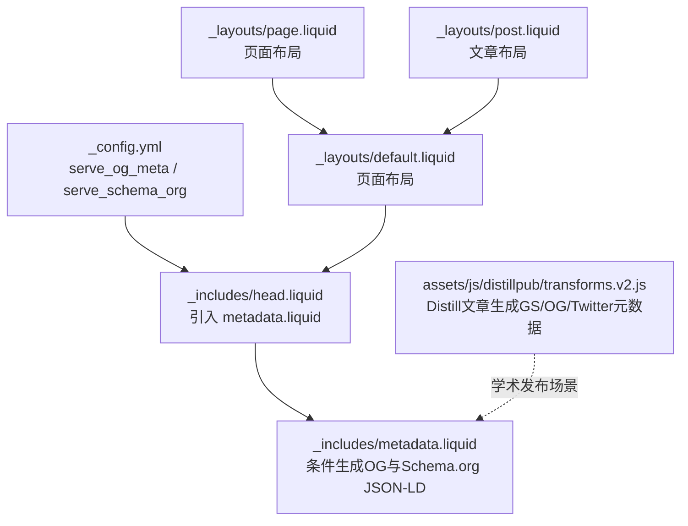
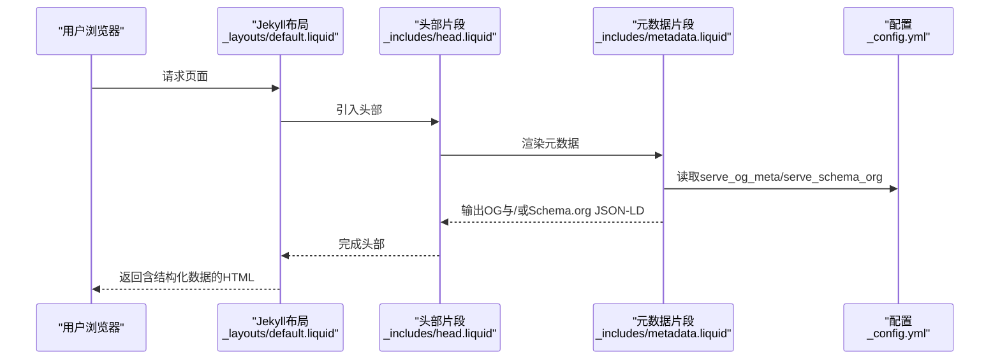
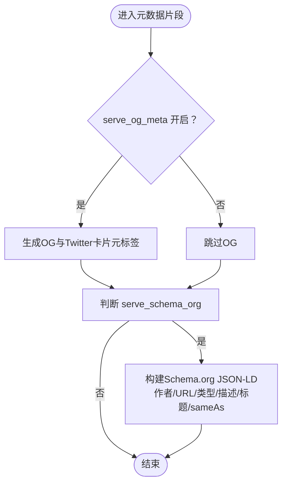
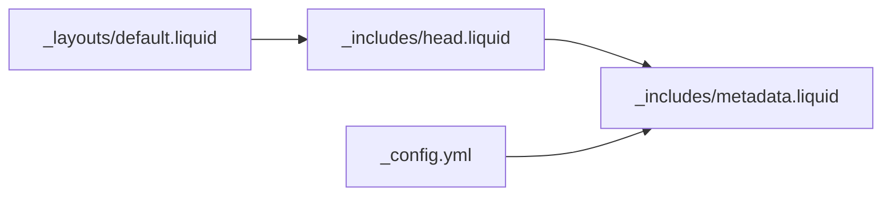
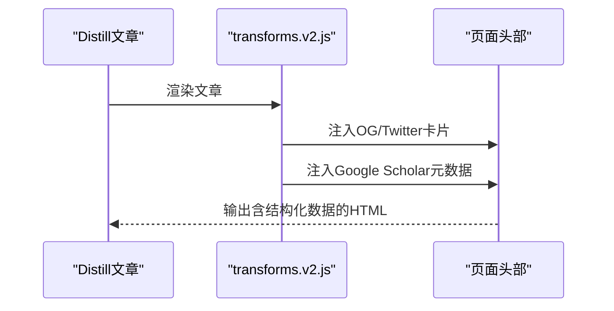
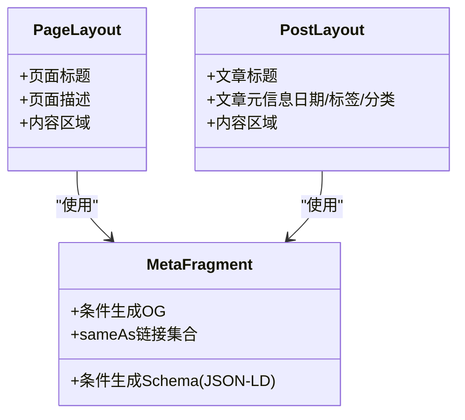
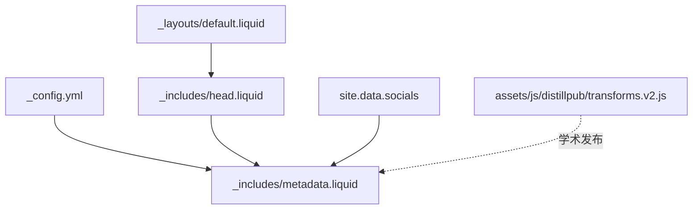

# 结构化数据和Schema.org标记

<cite>
**本文引用的文件**
- [_config.yml](file://_config.yml)
- [SEO.md](file://SEO.md)
- [_includes/head.liquid](file://_includes/head.liquid)
- [_includes/metadata.liquid](file://_includes/metadata.liquid)
- [_layouts/default.liquid](file://_layouts/default.liquid)
- [_layouts/page.liquid](file://_layouts/page.liquid)
- [_layouts/post.liquid](file://_layouts/post.liquid)
- [assets/js/distillpub/transforms.v2.js](file://assets/js/distillpub/transforms.v2.js)
</cite>

## 目录
1. [简介](#简介)
2. [项目结构](#项目结构)
3. [核心组件](#核心组件)
4. [架构总览](#架构总览)
5. [详细组件分析](#详细组件分析)
6. [依赖关系分析](#依赖关系分析)
7. [性能考量](#性能考量)
8. [故障排查指南](#故障排查指南)
9. [结论](#结论)
10. [附录](#附录)

## 简介
本指南面向学术与技术类网站（如个人主页、博客、作品集）的结构化数据与Schema.org标记实施，结合al-folio主题在Jekyll中的实现，系统讲解以下内容：
- Schema.org的作用及其对搜索结果丰富片段的影响
- al-folio自动标记的内容类型：Person、BlogPosting、CreativeWork/ScholarlyArticle等
- 手动添加结构化数据的方法与最佳实践
- 使用Schema.org验证工具进行校验与修复常见错误
- 面向学术网站的特殊标记需求：论文、会议、项目等

## 项目结构
al-folio通过配置开关与模板片段实现结构化数据与社交元数据的注入。关键位置如下：
- 全局配置：启用/禁用Open Graph与Schema.org
- 模板片段：在页面头部动态生成OG与Schema.org JSON-LD
- 布局：统一引入头部片段
- 学术发布（Distill）：额外生成Google Scholar等专用元数据

图示来源
- [_config.yml:69-71](file://_config.yml#L69-L71)
- [_includes/head.liquid:1-3](file://_includes/head.liquid#L1-L3)
- [_includes/metadata.liquid:79-247](file://_includes/metadata.liquid#L79-L247)
- [_layouts/default.liquid:15](file://_layouts/default.liquid#L15)
- [_layouts/page.liquid:1-32](file://_layouts/page.liquid#L1-L32)
- [_layouts/post.liquid:1-98](file://_layouts/post.liquid#L1-L98)
- [assets/js/distillpub/transforms.v2.js:13678-13739](file://assets/js/distillpub/transforms.v2.js#L13678-L13739)

章节来源
- [_config.yml:69-71](file://_config.yml#L69-L71)
- [_includes/head.liquid:1-3](file://_includes/head.liquid#L1-L3)
- [_includes/metadata.liquid:79-247](file://_includes/metadata.liquid#L79-L247)
- [_layouts/default.liquid:15](file://_layouts/default.liquid#L15)
- [_layouts/page.liquid:1-32](file://_layouts/page.liquid#L1-L32)
- [_layouts/post.liquid:1-98](file://_layouts/post.liquid#L1-L98)
- [assets/js/distillpub/transforms.v2.js:13678-13739](file://assets/js/distillpub/transforms.v2.js#L13678-L13739)

## 核心组件
- 全局配置开关
  - Open Graph开关：控制是否在<head>中注入OG元标签
  - Schema.org开关：控制是否在<head>中注入JSON-LD结构化数据
- 头部模板片段
  - 条件渲染OG与Twitter卡片
  - 条件渲染Schema.org JSON-LD，包含作者、URL、类型、描述、标题、同站链接等
- 布局模板
  - 统一引入头部片段，确保所有页面具备一致的元信息
- Distill学术发布
  - 在Distill文章中生成Google Scholar专用元数据与OG/Twitter卡片

章节来源
- [_config.yml:69-71](file://_config.yml#L69-L71)
- [_includes/metadata.liquid:54-77](file://_includes/metadata.liquid#L54-L77)
- [_includes/metadata.liquid:79-247](file://_includes/metadata.liquid#L79-L247)
- [_layouts/default.liquid:15](file://_layouts/default.liquid#L15)
- [assets/js/distillpub/transforms.v2.js:13678-13739](file://assets/js/distillpub/transforms.v2.js#L13678-L13739)

## 架构总览
下图展示从配置到页面输出的结构化数据生成流程：

图示来源
- [_layouts/default.liquid:15](file://_layouts/default.liquid#L15)
- [_includes/head.liquid:1-3](file://_includes/head.liquid#L1-L3)
- [_includes/metadata.liquid:79-247](file://_includes/metadata.liquid#L79-L247)
- [_config.yml:69-71](file://_config.yml#L69-L71)

## 详细组件分析

### 组件A：元数据片段（metadata.liquid）
- 功能要点
  - 条件性生成Open Graph与Twitter卡片
  - 条件性生成Schema.org JSON-LD，包含：
    - 作者信息（Person）
    - 页面URL
    - 内容类型：BlogPosting（文章）或WebSite（其他页面）
    - 描述与标题（优先页面，否则站点）
    - 同站链接（sameAs），基于站点社交数据生成
- 关键逻辑
  - 判断是否为博客文章以决定OG与Schema类型
  - 从站点社交数据构造多平台链接数组
  - 输出JSON-LD脚本块

图示来源
- [_includes/metadata.liquid:47-52](file://_includes/metadata.liquid#L47-L52)
- [_includes/metadata.liquid:82-227](file://_includes/metadata.liquid#L82-L227)
- [_includes/metadata.liquid:229-246](file://_includes/metadata.liquid#L229-L246)

章节来源
- [_includes/metadata.liquid:47-52](file://_includes/metadata.liquid#L47-L52)
- [_includes/metadata.liquid:82-227](file://_includes/metadata.liquid#L82-L227)
- [_includes/metadata.liquid:229-246](file://_includes/metadata.liquid#L229-L246)

### 组件B：布局与头部集成
- 布局模板统一引入头部片段，保证所有页面具备一致的元信息
- 头部片段再调用元数据片段，按配置动态输出OG与Schema.org

图示来源
- [_layouts/default.liquid:15](file://_layouts/default.liquid#L15)
- [_includes/head.liquid:1-3](file://_includes/head.liquid#L1-L3)
- [_includes/metadata.liquid:79-247](file://_includes/metadata.liquid#L79-L247)
- [_config.yml:69-71](file://_config.yml#L69-L71)

章节来源
- [_layouts/default.liquid:15](file://_layouts/default.liquid#L15)
- [_includes/head.liquid:1-3](file://_includes/head.liquid#L1-L3)
- [_includes/metadata.liquid:79-247](file://_includes/metadata.liquid#L79-L247)
- [_config.yml:69-71](file://_config.yml#L69-L71)

### 组件C：Distill学术发布（Google Scholar与社交卡片）
- 在Distill文章中，除生成标准OG/Twitter卡片外，还生成Google Scholar专用元数据（如标题、DOI、期刊信息等）
- 该机制补充了通用Schema.org标记在学术引用场景下的细节

图示来源
- [assets/js/distillpub/transforms.v2.js:13678-13739](file://assets/js/distillpub/transforms.v2.js#L13678-L13739)

章节来源
- [assets/js/distillpub/transforms.v2.js:13678-13739](file://assets/js/distillpub/transforms.v2.js#L13678-L13739)

### 组件D：页面布局与内容类型
- 页面布局（page.liquid）与文章布局（post.liquid）分别承载不同内容类型
- 元数据片段根据URL路径判断是否为博客文章，从而选择不同的Schema类型（BlogPosting或WebSite）

图示来源
- [_layouts/page.liquid:1-32](file://_layouts/page.liquid#L1-L32)
- [_layouts/post.liquid:1-98](file://_layouts/post.liquid#L1-L98)
- [_includes/metadata.liquid:79-247](file://_includes/metadata.liquid#L79-L247)

章节来源
- [_layouts/page.liquid:1-32](file://_layouts/page.liquid#L1-L32)
- [_layouts/post.liquid:1-98](file://_layouts/post.liquid#L1-L98)
- [_includes/metadata.liquid:79-247](file://_includes/metadata.liquid#L79-L247)

## 依赖关系分析
- 配置依赖
  - serve_og_meta与serve_schema_org控制元数据输出
- 模板依赖
  - default布局依赖head片段
  - head片段依赖metadata片段
- 数据依赖
  - metadata片段依赖站点配置与社交数据（site.data.socials）
- 学术发布依赖
  - Distill文章通过独立脚本生成GS/OG/Twitter元数据

图示来源
- [_config.yml:69-71](file://_config.yml#L69-L71)
- [_includes/metadata.liquid:79-247](file://_includes/metadata.liquid#L79-L247)
- [_layouts/default.liquid:15](file://_layouts/default.liquid#L15)
- [_includes/head.liquid:1-3](file://_includes/head.liquid#L1-L3)
- [assets/js/distillpub/transforms.v2.js:13678-13739](file://assets/js/distillpub/transforms.v2.js#L13678-L13739)

章节来源
- [_config.yml:69-71](file://_config.yml#L69-L71)
- [_includes/metadata.liquid:79-247](file://_includes/metadata.liquid#L79-L247)
- [_layouts/default.liquid:15](file://_layouts/default.liquid#L15)
- [_includes/head.liquid:1-3](file://_includes/head.liquid#L1-L3)
- [assets/js/distillpub/transforms.v2.js:13678-13739](file://assets/js/distillpub/transforms.v2.js#L13678-L13739)

## 性能考量
- 结构化数据体积小，对加载时间影响可忽略
- 建议仅在必要页面生成，避免重复输出
- 对于Distill文章，建议保持其专用元数据生成逻辑，以提升学术索引质量

## 故障排查指南
- 未显示结构化数据
  - 检查全局配置开关是否开启
  - 确认页面已正确引入头部片段
- Schema.org验证失败
  - 使用官方验证工具进行检查
  - 常见问题：缺少必需字段、类型不匹配、URL不完整
- 社交卡片预览异常
  - 检查OG图像尺寸与格式
  - 使用社交调试工具刷新缓存

章节来源
- [_config.yml:69-71](file://_config.yml#L69-L71)
- [_includes/head.liquid:1-3](file://_includes/head.liquid#L1-L3)
- [SEO.md:164-176](file://SEO.md#L164-L176)

## 结论
al-folio通过简洁的配置与模板机制，实现了对Open Graph与Schema.org的自动化输出，并在Distill场景下增强了学术引用元数据。遵循本指南的最佳实践，可显著提升学术内容在搜索引擎中的可见性与丰富片段质量。

## 附录

### Schema.org作用与丰富片段
- 作用：帮助搜索引擎理解页面内容类型与实体关系
- 影响：可能在搜索结果中呈现更丰富的摘要、作者、图片等信息

章节来源
- [SEO.md:150-163](file://SEO.md#L150-L163)

### al-folio自动标记的内容类型
- 作者信息：Person（姓名、URL）
- 博客文章：BlogPosting（日期、标题、描述、内容）
- 公开页面：WebSite（描述、标题、URL）
- 同站链接：sameAs（基于站点社交数据生成）

章节来源
- [SEO.md:172-176](file://SEO.md#L172-L176)
- [_includes/metadata.liquid:229-246](file://_includes/metadata.liquid#L229-L246)

### 手动添加结构化数据的方法与最佳实践
- 在页面frontmatter中提供描述与标题
- 为图片添加alt文本
- 为博客文章提供日期与标签
- 使用Distill发布学术文章时，确保引用信息完整

章节来源
- [SEO.md:328-356](file://SEO.md#L328-L356)
- [SEO.md:385-400](file://SEO.md#L385-L400)
- [SEO.md:403-416](file://SEO.md#L403-L416)

### 验证工具与常见错误修复
- 使用Schema.org验证器与社交调试工具
- 常见错误：缺少描述、标题过长、OG图像尺寸不当、URL不完整
- 修复建议：精简标题与描述、准备合适尺寸的OG图像、确保URL完整

章节来源
- [SEO.md:492](file://SEO.md#L492)
- [SEO.md:129-133](file://SEO.md#L129-L133)

### 学术网站特殊标记需求
- 论文：ScholarlyArticle或CreativeWork（标题、作者、摘要、发表日期、期刊/会议、DOI/PDF）
- 会议：Event（名称、开始/结束时间、地点、链接）
- 项目：Project（名称、描述、开始/结束时间、链接、成员）

章节来源
- [SEO.md:250-322](file://SEO.md#L250-L322)