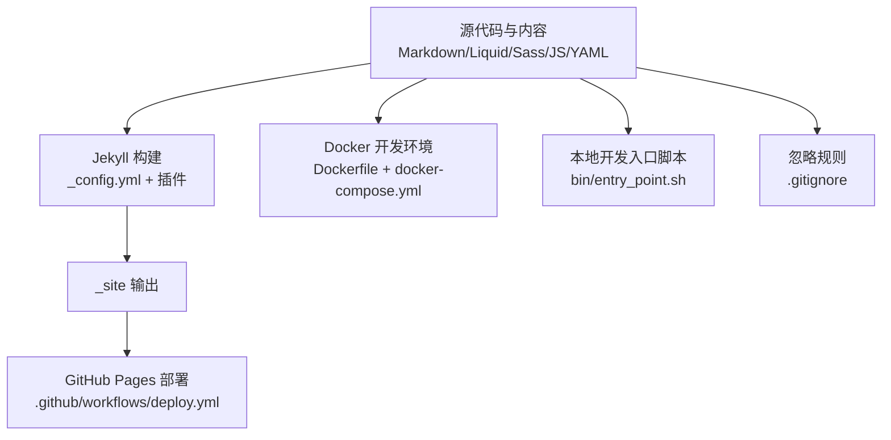
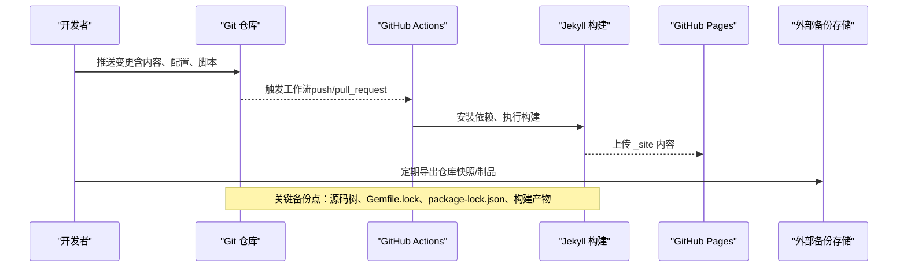
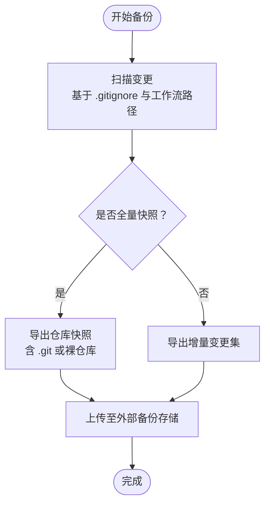
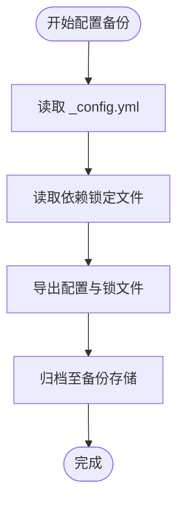
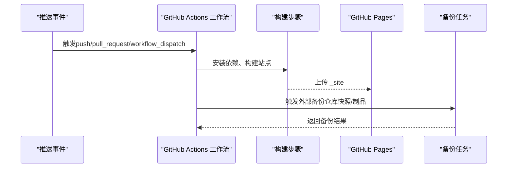
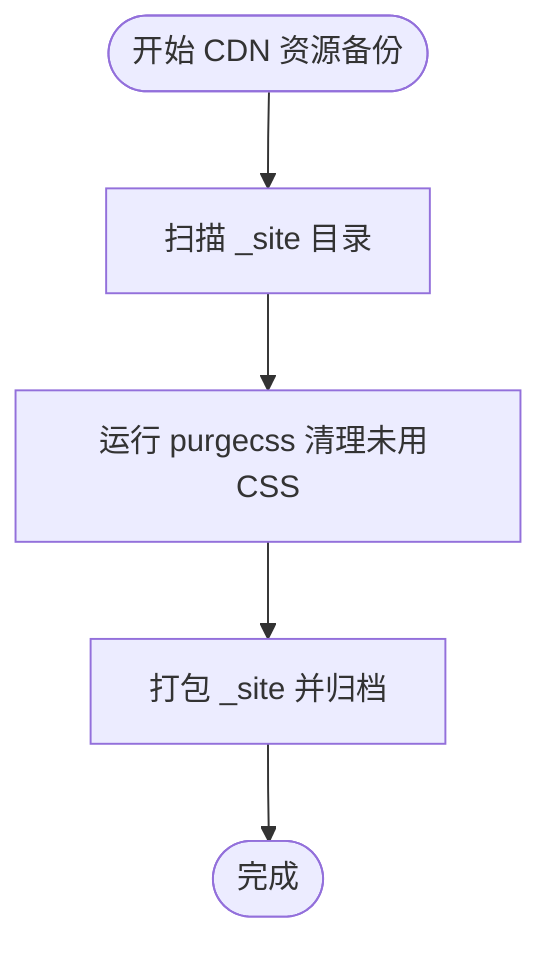
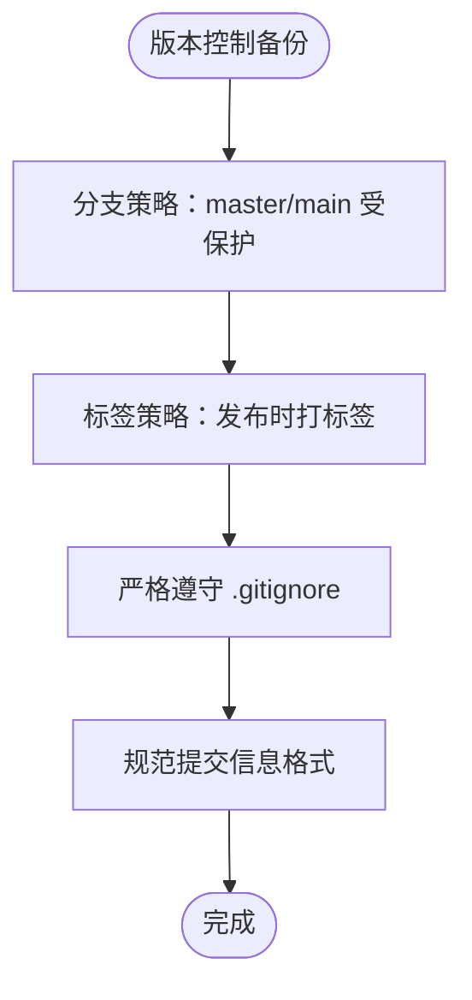
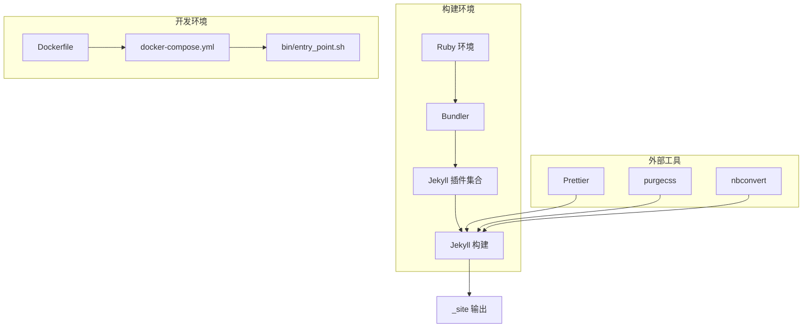

# 备份和恢复策略

<cite>
**本文引用的文件**
- [README.md](file://README.md)
- [_config.yml](file://_config.yml)
- [.github/GIT_WORKFLOW.md](file://.github/GIT_WORKFLOW.md)
- [.github/release.yml](file://.github/release.yml)
- [.github/workflows/deploy.yml](file://.github/workflows/deploy.yml)
- [.gitignore](file://.gitignore)
- [Dockerfile](file://Dockerfile)
- [docker-compose.yml](file://docker-compose.yml)
- [bin/entry_point.sh](file://bin/entry_point.sh)
- [Gemfile](file://Gemfile)
- [package.json](file://package.json)
- [requirements.txt](file://requirements.txt)
- [purgecss.config.js](file://purgecss.config.js)
</cite>

## 目录
1. [简介](#简介)
2. [项目结构](#项目结构)
3. [核心组件](#核心组件)
4. [架构总览](#架构总览)
5. [详细组件分析](#详细组件分析)
6. [依赖关系分析](#依赖关系分析)
7. [性能考量](#性能考量)
8. [故障排查指南](#故障排查指南)
9. [结论](#结论)
10. [附录](#附录)

## 简介
本文件面向备份与恢复策略，结合该 Jekyll 博客项目的实际配置与工作流，系统化梳理以下内容：
- 不同类型数据的备份策略：源代码、配置文件、内容数据、第三方服务配置
- 自动备份与自动化部署：Git 仓库、GitHub Pages、CDN 资源
- 灾难恢复计划：数据丢失检测、恢复流程、验证步骤
- 版本控制在备份中的作用：分支策略、标签管理、历史记录保护
- 紧急快速恢复指南与最佳实践

## 项目结构
该项目采用 Jekyll 静态站点生成器，核心由以下部分组成：
- 源代码与内容：Markdown、Liquid 模板、Sass 样式、JavaScript 脚本、数据文件（YAML）
- 配置与构建：Jekyll 配置、Gem 插件、Node 工具链、Docker 环境
- 自动化：GitHub Actions 工作流、入口脚本、清理工具
- 忽略规则：.gitignore 控制不纳入版本管理的产物与缓存

图表来源
- [_config.yml](file://_config.yml)
- [.github/workflows/deploy.yml](file://.github/workflows/deploy.yml)
- [Dockerfile](file://Dockerfile)
- [docker-compose.yml](file://docker-compose.yml)
- [bin/entry_point.sh](file://bin/entry_point.sh)
- [.gitignore](file://.gitignore)

章节来源
- [README.md:294-320](file://README.md#L294-L320)
- [_config.yml:154-218](file://_config.yml#L154-L218)
- [.github/workflows/deploy.yml:1-106](file://.github/workflows/deploy.yml#L1-L106)
- [Dockerfile:1-77](file://Dockerfile#L1-L77)
- [docker-compose.yml:1-22](file://docker-compose.yml#L1-L22)
- [bin/entry_point.sh:1-38](file://bin/entry_point.sh#L1-L38)
- [.gitignore:1-16](file://.gitignore#L1-L16)

## 核心组件
- Jekyll 配置与插件：决定站点功能、输出路径、压缩与缓存策略
- GitHub Actions 工作流：自动构建、部署到 GitHub Pages，并支持手动触发
- Docker 环境：提供可复现的本地开发与构建环境
- 入口脚本：监听配置变更并自动重启开发服务器
- 忽略规则：避免将构建产物、缓存、依赖目录提交到版本库

章节来源
- [_config.yml:196-218](file://_config.yml#L196-L218)
- [.github/workflows/deploy.yml:67-106](file://.github/workflows/deploy.yml#L67-L106)
- [Dockerfile:22-66](file://Dockerfile#L22-L66)
- [bin/entry_point.sh:8-25](file://bin/entry_point.sh#L8-L25)
- [.gitignore:1-16](file://.gitignore#L1-L16)

## 架构总览
下图展示从源码到发布的关键路径，以及备份与恢复涉及的节点。

图表来源
- [.github/workflows/deploy.yml:3-62](file://.github/workflows/deploy.yml#L3-L62)
- [_config.yml:170-195](file://_config.yml#L170-L195)
- [Gemfile:1-42](file://Gemfile#L1-L42)
- [package.json:1-7](file://package.json#L1-L7)

## 详细组件分析

### 组件A：源代码与内容数据备份
- 备份对象
  - 源代码与内容：Markdown、Liquid 模板、Sass、JS、数据文件（YAML）
  - 配置文件：_config.yml、Gemfile、package.json、requirements.txt
  - 构建产物：_site（受忽略规则控制）
- 备份策略
  - 增量备份：基于 Git 的变更集，保留完整历史
  - 全量备份：定期导出仓库快照，包含 .git 目录或裸仓库镜像
  - 变更范围：通过工作流的 paths 精确匹配，减少无关文件传输
- 恢复流程
  - 从仓库快照恢复源码树
  - 还原依赖：bundle install、npm ci、pip install
  - 重新构建并验证

图表来源
- [.github/workflows/deploy.yml:8-32](file://.github/workflows/deploy.yml#L8-L32)
- [.gitignore:1-16](file://.gitignore#L1-L16)

章节来源
- [.github/workflows/deploy.yml:8-32](file://.github/workflows/deploy.yml#L8-L32)
- [.gitignore:1-16](file://.gitignore#L1-L16)

### 组件B：配置文件备份与恢复
- 备份对象
  - Jekyll 配置：_config.yml（含插件、主题、第三方服务配置）
  - 依赖清单：Gemfile、Gemfile.lock、package.json、requirements.txt
- 备份策略
  - 随源码同步：配置文件与内容同仓管理，便于回溯
  - 锁定版本：Gemfile.lock、package-lock.json 确保可复现
- 恢复流程
  - 恢复配置与依赖清单
  - 执行安装命令（bundle、npm、pip）
  - 重建站点并核验

图表来源
- [_config.yml:196-218](file://_config.yml#L196-L218)
- [Gemfile:1-42](file://Gemfile#L1-L42)
- [package.json:1-7](file://package.json#L1-L7)
- [requirements.txt:1-5](file://requirements.txt#L1-L5)

章节来源
- [_config.yml:196-218](file://_config.yml#L196-L218)
- [Gemfile:1-42](file://Gemfile#L1-L42)
- [package.json:1-7](file://package.json#L1-L7)
- [requirements.txt:1-5](file://requirements.txt#L1-L5)

### 组件C：第三方服务配置备份
- 备份对象
  - 分析与验证：google_analytics、google_site_verification、bing_site_verification 等
  - 评论与社交：giscus、disqus 等
  - 外部服务 URL：github-readme-stats、github-profile-trophy
- 备份策略
  - 将敏感信息置于安全位置（如密钥管理服务），不在仓库中明文保存
  - 使用环境变量或外部配置文件，配合工作流参数注入
- 恢复流程
  - 在新环境中重新配置第三方服务
  - 更新 _config.yml 对应字段
  - 验证服务可用性与链接有效性

章节来源
- [_config.yml:78-87](file://_config.yml#L78-L87)
- [_config.yml:106-124](file://_config.yml#L106-L124)
- [_config.yml:38-44](file://_config.yml#L38-L44)

### 组件D：自动备份与自动化部署
- 自动化部署
  - 触发条件：push 到 master/main，或 pull_request；支持 workflow_dispatch
  - 步骤：检出、Ruby/Python 环境准备、更新配置、构建、清理 CSS、部署到 GitHub Pages
- 自动备份建议
  - 在部署前/后触发外部备份任务（仓库快照、制品备份）
  - 使用工作流的 permissions 控制权限，确保写入备份存储
- 验证
  - 通过访问站点确认部署成功
  - 校验关键页面与资源加载

图表来源
- [.github/workflows/deploy.yml:3-62](file://.github/workflows/deploy.yml#L3-L62)
- [.github/workflows/deploy.yml:67-106](file://.github/workflows/deploy.yml#L67-L106)

章节来源
- [.github/workflows/deploy.yml:3-62](file://.github/workflows/deploy.yml#L3-L62)
- [.github/workflows/deploy.yml:67-106](file://.github/workflows/deploy.yml#L67-L106)

### 组件E：CDN 资源备份
- 备份对象
  - 静态资源：CSS、JS、图片、字体等
  - 构建产物：_site 下的全部静态文件
- 备份策略
  - 以 _site 为单位进行全量/增量备份
  - 结合 purgecss 清理未使用 CSS，缩小备份体积
- 恢复流程
  - 将备份的 _site 恢复到对应目录
  - 重新部署到 GitHub Pages

图表来源
- [purgecss.config.js:1-7](file://purgecss.config.js#L1-L7)
- [.github/workflows/deploy.yml:97-100](file://.github/workflows/deploy.yml#L97-L100)

章节来源
- [purgecss.config.js:1-7](file://purgecss.config.js#L1-L7)
- [.github/workflows/deploy.yml:97-100](file://.github/workflows/deploy.yml#L97-L100)

### 组件F：版本控制系统在备份中的作用
- 分支策略
  - 使用 master/main 作为受保护分支，变更通过 PR 合并
  - 重要修复可建立 hotfix 分支，合并后再回并主干
- 标签管理
  - 发布时打标签，配合 release.yml 生成变更日志分类
- 历史记录保护
  - 严格遵循 .gitignore，避免误提交构建产物与机密
  - 提交信息格式规范，便于审计与回滚

图表来源
- [.github/GIT_WORKFLOW.md:5-33](file://.github/GIT_WORKFLOW.md#L5-L33)
- [.github/release.yml:1-15](file://.github/release.yml#L1-L15)
- [.gitignore:1-16](file://.gitignore#L1-L16)

章节来源
- [.github/GIT_WORKFLOW.md:5-33](file://.github/GIT_WORKFLOW.md#L5-L33)
- [.github/release.yml:1-15](file://.github/release.yml#L1-L15)
- [.gitignore:1-16](file://.gitignore#L1-L16)

### 组件G：灾难恢复计划
- 数据丢失检测
  - 校验仓库完整性：检查 .git 目录是否存在、HEAD 是否有效
  - 校验构建产物：_site 是否存在、关键页面可访问
  - 校验第三方服务：分析与验证配置项是否生效
- 恢复流程
  - 从最近备份恢复仓库与 _site
  - 重新安装依赖并重建
  - 部署到 GitHub Pages 并验证
- 验证步骤
  - 访问首页与关键页面
  - 校验资源加载（CSS/JS/图片）
  - 校验第三方服务（评论、统计、SEO 标记）

章节来源
- [_config.yml:78-87](file://_config.yml#L78-L87)
- [.github/workflows/deploy.yml:97-106](file://.github/workflows/deploy.yml#L97-L106)

### 组件H：紧急快速恢复指南与最佳实践
- 最佳实践
  - 定期全量备份 + 增量备份相结合
  - 将敏感配置外置，使用环境变量或密钥管理
  - 保持依赖锁定文件同步，确保可复现
  - 使用工作流权限最小化原则
- 紧急恢复步骤
  - 快速定位最近一次成功部署的提交
  - 从备份恢复仓库与 _site
  - 重新安装依赖并构建
  - 部署并进行端到端验证

章节来源
- [.github/workflows/deploy.yml:64-66](file://.github/workflows/deploy.yml#L64-L66)
- [bin/entry_point.sh:8-20](file://bin/entry_point.sh#L8-L20)

## 依赖关系分析
- 构建链路
  - Ruby 环境 → Bundler → Jekyll 插件 → Jekyll 构建 → GitHub Pages
- 开发链路
  - Docker 环境 → 本地入口脚本 → 实时预览与热重载
- 外部工具
  - Prettier、purgecss、nbconvert 等辅助工具参与质量与体积优化

图表来源
- [Gemfile:6-29](file://Gemfile#L6-L29)
- [Dockerfile:22-66](file://Dockerfile#L22-L66)
- [docker-compose.yml:1-22](file://docker-compose.yml#L1-L22)
- [bin/entry_point.sh:22-25](file://bin/entry_point.sh#L22-L25)
- [purgecss.config.js:1-7](file://purgecss.config.js#L1-L7)
- [requirements.txt:1-5](file://requirements.txt#L1-L5)

章节来源
- [Gemfile:6-29](file://Gemfile#L6-L29)
- [Dockerfile:22-66](file://Dockerfile#L22-L66)
- [docker-compose.yml:1-22](file://docker-compose.yml#L1-L22)
- [bin/entry_point.sh:22-25](file://bin/entry_point.sh#L22-L25)
- [purgecss.config.js:1-7](file://purgecss.config.js#L1-L7)
- [requirements.txt:1-5](file://requirements.txt#L1-L5)

## 性能考量
- 构建性能
  - 使用依赖缓存（bundle、pip）与生产环境变量
  - 启用压缩与懒加载，减小前端体积
- 存储与传输
  - purgecss 清理未使用 CSS，降低 _site 体积
  - 增量备份减少传输时间与存储开销

## 故障排查指南
- 常见问题
  - 构建失败：检查 Gemfile.lock、package-lock.json 与依赖版本
  - 预览异常：确认 docker-compose 端口映射与入口脚本热重载
  - 部署失败：核对工作流权限与部署动作配置
- 排查步骤
  - 在本地 Docker 环境复现
  - 查看工作流日志与构建产物
  - 对比最近一次成功的提交与当前差异

章节来源
- [bin/entry_point.sh:22-37](file://bin/entry_point.sh#L22-L37)
- [.github/workflows/deploy.yml:64-66](file://.github/workflows/deploy.yml#L64-L66)

## 结论
本项目的备份与恢复策略应围绕“源码 + 配置 + 构建产物 + 第三方服务配置”四类数据展开，结合 Git 历史、工作流自动化与容器化环境，形成可审计、可复现、可快速恢复的闭环。通过规范的分支与标签管理、严格的忽略规则、以及定期的全量/增量备份，能够在发生数据丢失时实现高效恢复与验证。

## 附录
- 关键文件索引
  - 配置与构建：_config.yml、Gemfile、package.json、requirements.txt
  - 自动化：.github/workflows/deploy.yml、.github/release.yml
  - 环境：Dockerfile、docker-compose.yml、bin/entry_point.sh
  - 忽略规则：.gitignore
  - 构建清理：purgecss.config.js