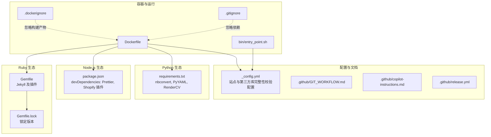
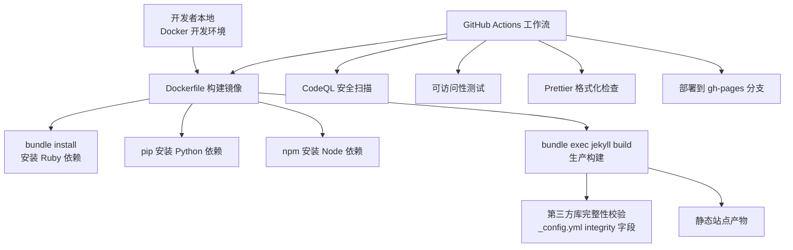
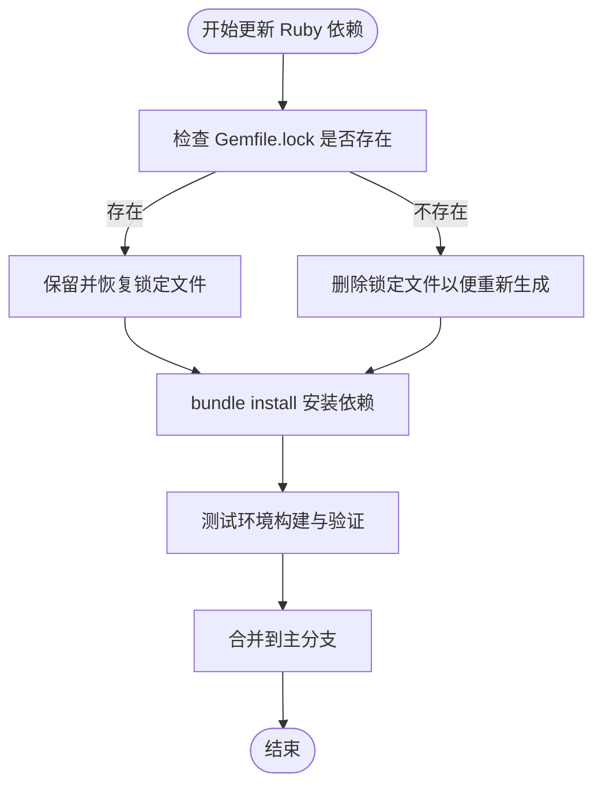
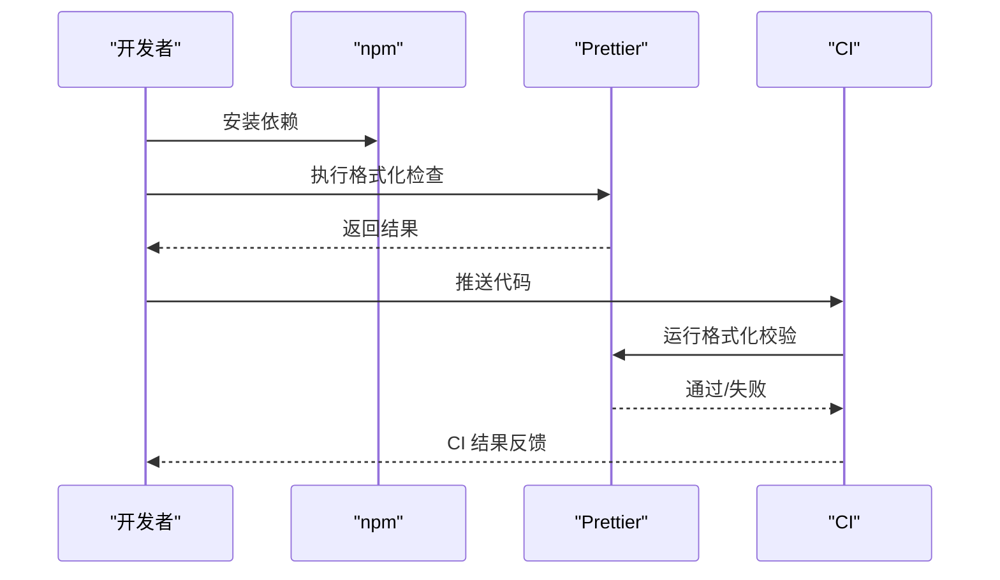
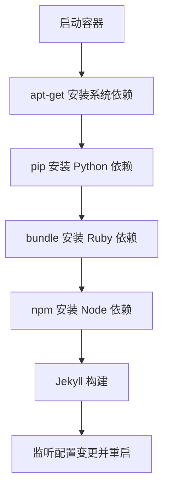
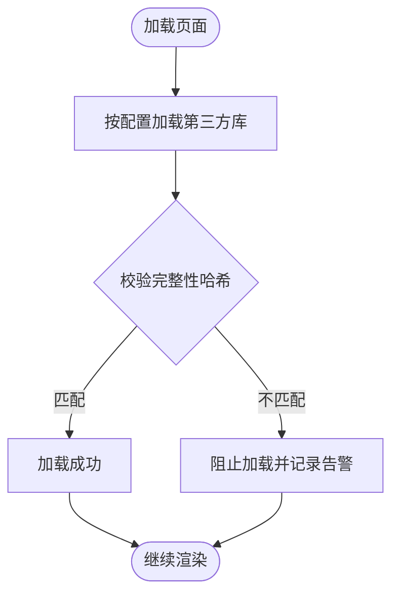
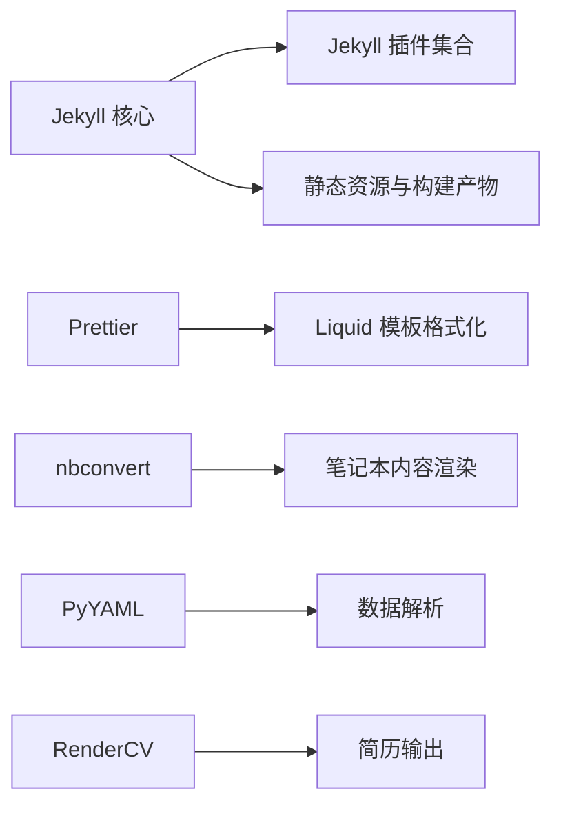
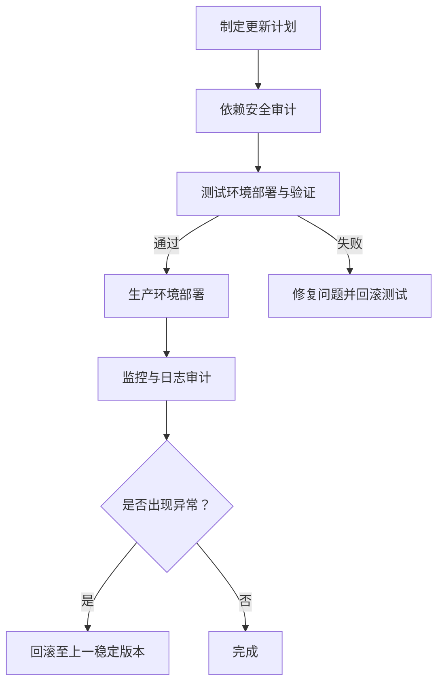

# 安全维护和更新

<cite>
**本文引用的文件**
- [Gemfile](file://Gemfile)
- [package.json](file://package.json)
- [requirements.txt](file://requirements.txt)
- [_config.yml](file://_config.yml)
- [Dockerfile](file://Dockerfile)
- [.dockerignore](file://.dockerignore)
- [.gitignore](file://.gitignore)
- [bin/entry_point.sh](file://bin/entry_point.sh)
- [.github/GIT_WORKFLOW.md](file://.github/GIT_WORKFLOW.md)
- [.github/copilot-instructions.md](file://.github/copilot-instructions.md)
- [.github/release.yml](file://.github/release.yml)
</cite>

## 目录
1. [简介](#简介)
2. [项目结构](#项目结构)
3. [核心组件](#核心组件)
4. [架构总览](#架构总览)
5. [详细组件分析](#详细组件分析)
6. [依赖关系分析](#依赖关系分析)
7. [性能考虑](#性能考虑)
8. [故障排查指南](#故障排查指南)
9. [结论](#结论)
10. [附录](#附录)

## 简介
本文件面向安全维护与更新，结合当前仓库中的实际配置与脚本，系统化说明以下内容：
- 定期安全更新的重要性：Ruby gems、npm 包、GitHub Actions 工作流的安全配置
- 漏洞扫描与评估方法：依赖项安全审计、代码安全审查、配置安全检查
- 安全更新实施流程：测试环境验证、生产环境部署、回滚机制
- 常见安全威胁与防护：XSS 防护、CSRF 防护、敏感信息泄露防范
- 安全事件响应流程与应急处理方案

本指南以仓库现有配置为依据，避免臆测，确保可操作性与可追溯性。

## 项目结构
该 Jekyll 静态站点项目采用多语言技术栈与容器化开发模式：
- Ruby 生态：Jekyll 核心与插件通过 Gemfile 管理
- Node.js 生态：仅使用 Prettier 与 Shopify 插件进行代码格式化（devDependencies）
- Python 生态：nbconvert、PyYAML、RenderCV 等用于内容生成与简历渲染
- 容器化：Dockerfile 与 docker-compose 提供一致的构建与运行环境
- CI/CD：Copilot 指南中列出多种 GitHub Actions 工作流（如 deploy、prettier、axe、codeql 等）

**图表来源**
- [Gemfile:1-42](file://Gemfile#L1-L42)
- [package.json:1-7](file://package.json#L1-L7)
- [requirements.txt:1-5](file://requirements.txt#L1-L5)
- [Dockerfile:1-77](file://Dockerfile#L1-L77)
- [.dockerignore:1-4](file://.dockerignore#L1-L4)
- [.gitignore:1-16](file://.gitignore#L1-L16)
- [bin/entry_point.sh:1-38](file://bin/entry_point.sh#L1-L38)
- [_config.yml:405-634](file://_config.yml#L405-L634)
- [.github/GIT_WORKFLOW.md:1-48](file://.github/GIT_WORKFLOW.md#L1-L48)
- [.github/copilot-instructions.md:122-142](file://.github/copilot-instructions.md#L122-L142)
- [.github/release.yml:1-15](file://.github/release.yml#L1-L15)

**章节来源**
- [Gemfile:1-42](file://Gemfile#L1-L42)
- [package.json:1-7](file://package.json#L1-L7)
- [requirements.txt:1-5](file://requirements.txt#L1-L5)
- [Dockerfile:1-77](file://Dockerfile#L1-L77)
- [.dockerignore:1-4](file://.dockerignore#L1-L4)
- [.gitignore:1-16](file://.gitignore#L1-L16)
- [bin/entry_point.sh:1-38](file://bin/entry_point.sh#L1-L38)
- [_config.yml:405-634](file://_config.yml#L405-L634)
- [.github/GIT_WORKFLOW.md:1-48](file://.github/GIT_WORKFLOW.md#L1-L48)
- [.github/copilot-instructions.md:122-142](file://.github/copilot-instructions.md#L122-L142)
- [.github/release.yml:1-15](file://.github/release.yml#L1-L15)

## 核心组件
- Ruby 依赖与插件：Jekyll 主体与多个功能插件，通过 Gemfile 管理；容器内使用 bundle 安装
- Node.js 依赖：仅 Prettier 与 Shopify 插件，用于代码格式化；容器内使用 npm 安装
- Python 依赖：nbconvert、PyYAML、RenderCV，用于笔记本与简历渲染；容器内使用 pip 安装
- 容器入口脚本：自动处理 Gemfile.lock 的存在性与版本一致性，并在配置变更时重启服务
- 第三方库完整性校验：通过 _config.yml 中的 integrity 字段对 CDN 资源进行哈希校验
- CI/CD 工作流：包含部署、格式化、链接检测、可访问性测试、安全扫描等

**章节来源**
- [Gemfile:1-42](file://Gemfile#L1-L42)
- [package.json:1-7](file://package.json#L1-L7)
- [requirements.txt:1-5](file://requirements.txt#L1-L5)
- [Dockerfile:63-66](file://Dockerfile#L63-L66)
- [bin/entry_point.sh:8-25](file://bin/entry_point.sh#L8-L25)
- [_config.yml:405-634](file://_config.yml#L405-L634)
- [.github/copilot-instructions.md:122-142](file://.github/copilot-instructions.md#L122-L142)

## 架构总览
下图展示从本地开发到 CI/CD 的整体安全路径：容器化构建、依赖锁定、完整性校验、自动化扫描与发布。

**图表来源**
- [Dockerfile:22-40](file://Dockerfile#L22-L40)
- [Dockerfile:63-66](file://Dockerfile#L63-L66)
- [_config.yml:405-634](file://_config.yml#L405-L634)
- [.github/copilot-instructions.md:122-142](file://.github/copilot-instructions.md#L122-L142)

## 详细组件分析

### Ruby 依赖与安全更新
- 依赖来源：Gemfile 中声明了 Jekyll 与多个插件，容器内通过 bundle 安装
- 版本锁定：Gemfile.lock 在容器内由 bundle 生成，entry_point.sh 对其存在性进行处理
- 更新策略建议：
  - 使用 bundle 更新命令升级依赖，注意插件兼容性
  - 在测试环境验证构建与功能，再合并到主分支
  - 关注上游插件的安全公告与 CVE

**图表来源**
- [bin/entry_point.sh:8-20](file://bin/entry_point.sh#L8-L20)
- [Dockerfile:63-66](file://Dockerfile#L63-L66)

**章节来源**
- [Gemfile:1-42](file://Gemfile#L1-L42)
- [bin/entry_point.sh:8-20](file://bin/entry_point.sh#L8-L20)
- [Dockerfile:63-66](file://Dockerfile#L63-L66)

### npm 包与前端安全
- 依赖范围：仅 devDependencies，包含 Prettier 与 Shopify 插件，用于模板格式化
- 安全建议：
  - 定期更新 Prettier 与插件版本
  - 在本地执行格式化检查，避免 CI 失败
  - 不在生产构建中引入额外 npm 依赖

**图表来源**
- [package.json:1-7](file://package.json#L1-L7)
- [.github/copilot-instructions.md:133-137](file://.github/copilot-instructions.md#L133-L137)

**章节来源**
- [package.json:1-7](file://package.json#L1-L7)
- [.github/copilot-instructions.md:133-137](file://.github/copilot-instructions.md#L133-L137)

### Python 依赖与安全
- 依赖范围：nbconvert、PyYAML、RenderCV，用于内容生成与简历渲染
- 安全建议：
  - 定期升级 nbconvert 以修复已知漏洞
  - 在容器内使用 pip 安装并升级依赖
  - 限制不必要的第三方库，降低供应链风险

**章节来源**
- [requirements.txt:1-5](file://requirements.txt#L1-L5)
- [Dockerfile:33-35](file://Dockerfile#L33-L35)

### 容器与运行时安全
- 容器基础镜像：ruby:slim，减少攻击面
- 系统依赖：安装 ImageMagick、Node.js、Python3-pip 等，满足构建需求
- 入口脚本：自动处理 Gemfile.lock 并监听配置变更重启服务
- 忽略规则：.dockerignore 与 .gitignore 避免将构建产物与依赖提交到仓库

**图表来源**
- [Dockerfile:22-40](file://Dockerfile#L22-L40)
- [Dockerfile:63-66](file://Dockerfile#L63-L66)
- [bin/entry_point.sh:22-37](file://bin/entry_point.sh#L22-L37)

**章节来源**
- [Dockerfile:1-77](file://Dockerfile#L1-L77)
- [bin/entry_point.sh:1-38](file://bin/entry_point.sh#L1-L38)
- [.dockerignore:1-4](file://.dockerignore#L1-L4)
- [.gitignore:1-16](file://.gitignore#L1-L16)

### 第三方库完整性校验（SRI）
- 配置位置：_config.yml 中 third_party_libraries.integrity 字段
- 作用：通过 integrity 哈希确保从 CDN 加载的库未被篡改
- 维护要点：
  - 当库版本升级时同步更新哈希值
  - 优先使用可信 CDN（如 jsdelivr）并启用 SRI
  - 如需本地托管，保持与配置一致的文件路径

**图表来源**
- [_config.yml:405-634](file://_config.yml#L405-L634)

**章节来源**
- [_config.yml:405-634](file://_config.yml#L405-L634)

### GitHub Actions 安全配置与扫描
- 工作流清单：Copilot 指南列出多种工作流，包括部署、Prettier、链接检测、可访问性测试、CodeQL 安全扫描
- 安全扫描：CodeQL 用于静态分析，发现潜在安全问题
- 配置建议：
  - 为敏感操作设置最小权限令牌
  - 对外部依赖的版本进行审计
  - 将扫描结果纳入发布流程门禁

**章节来源**
- [.github/copilot-instructions.md:122-142](file://.github/copilot-instructions.md#L122-L142)

## 依赖关系分析
- Ruby 与插件：Jekyll 为核心，多个插件负责归档、压缩、社交、学术文献等功能
- Node 与前端：仅格式化工具，不参与运行时逻辑
- Python 与内容：nbconvert、PyYAML、RenderCV 支撑内容生成
- 容器与构建：Dockerfile 统一安装系统与语言依赖，entry_point.sh 协助开发体验

**图表来源**
- [Gemfile:6-29](file://Gemfile#L6-L29)
- [package.json:1-7](file://package.json#L1-L7)
- [requirements.txt:1-5](file://requirements.txt#L1-L5)

**章节来源**
- [Gemfile:1-42](file://Gemfile#L1-L42)
- [package.json:1-7](file://package.json#L1-L7)
- [requirements.txt:1-5](file://requirements.txt#L1-L5)

## 性能考虑
- 构建优化：生产环境启用压缩与缓存，减少传输体积
- 资源加载：懒加载图片、CDN 与 SRI 校验提升安全性与稳定性
- CI 速度：并行任务与缓存策略缩短构建时间

[本节为通用指导，无需特定文件引用]

## 故障排查指南
- 容器构建失败
  - 检查磁盘空间与权限，必要时重建镜像
  - 确认 ImageMagick 与 nbconvert 版本要求
- 本地与 CI 构建差异
  - 使用 Docker 作为统一开发环境
  - 确保 JEKYLL_ENV=production 与生产构建一致
- 配置变更未生效
  - entry_point.sh 会监听 _config.yml 变更并重启服务
- 依赖冲突或版本不一致
  - 清理 Gemfile.lock 或移除后重新生成
  - 在测试环境验证后再合并

**章节来源**
- [.github/copilot-instructions.md:66-87](file://.github/copilot-instructions.md#L66-L87)
- [bin/entry_point.sh:22-37](file://bin/entry_point.sh#L22-L37)
- [Dockerfile:47-51](file://Dockerfile#L47-L51)

## 结论
本项目通过容器化、依赖锁定、完整性校验与多维 CI/CD 工作流，建立了较为完善的安全基线。建议持续关注上游依赖的安全公告，定期更新并进行端到端验证，确保安全更新在测试环境充分验证后再进入生产。

[本节为总结性内容，无需特定文件引用]

## 附录

### 定期安全更新清单
- Ruby gems：使用 bundle 更新并验证构建
- npm 包：更新 Prettier 与插件版本，本地格式化检查
- Python 依赖：升级 nbconvert 与相关库
- 第三方库完整性：随版本升级同步更新 SRI 哈希
- CI/CD：启用并监控 CodeQL、链接检测与可访问性测试

**章节来源**
- [Gemfile:1-42](file://Gemfile#L1-L42)
- [package.json:1-7](file://package.json#L1-L7)
- [requirements.txt:1-5](file://requirements.txt#L1-L5)
- [_config.yml:405-634](file://_config.yml#L405-L634)
- [.github/copilot-instructions.md:122-142](file://.github/copilot-instructions.md#L122-L142)

### 安全更新实施流程（测试→生产→回滚）

[本图为概念流程，无需图表来源]

### 常见安全威胁与防护
- XSS 防护：避免直接输出用户输入；对第三方库启用 SRI；严格控制外链 rel 属性
- CSRF 防护：本项目为静态站点，无服务端表单；若引入动态功能需增加 CSRF Token
- 敏感信息泄露：遵循 .gitignore 与 .dockerignore 规则，不在仓库中提交密钥与缓存文件

**章节来源**
- [_config.yml:340-345](file://_config.yml#L340-L345)
- [.gitignore:1-16](file://.gitignore#L1-L16)
- [.dockerignore:1-4](file://.dockerignore#L1-L4)

### 安全事件响应与应急处理
- 快速定位：利用 CI 日志与构建产物差异
- 临时降级：回滚至上一个稳定版本的 gh-pages 分支
- 根因分析：结合 CodeQL 报告与依赖版本，确认漏洞来源
- 修复与验证：在隔离分支修复并经测试环境验证后合并

**章节来源**
- [.github/release.yml:1-15](file://.github/release.yml#L1-L15)
- [.github/copilot-instructions.md:122-142](file://.github/copilot-instructions.md#L122-L142)