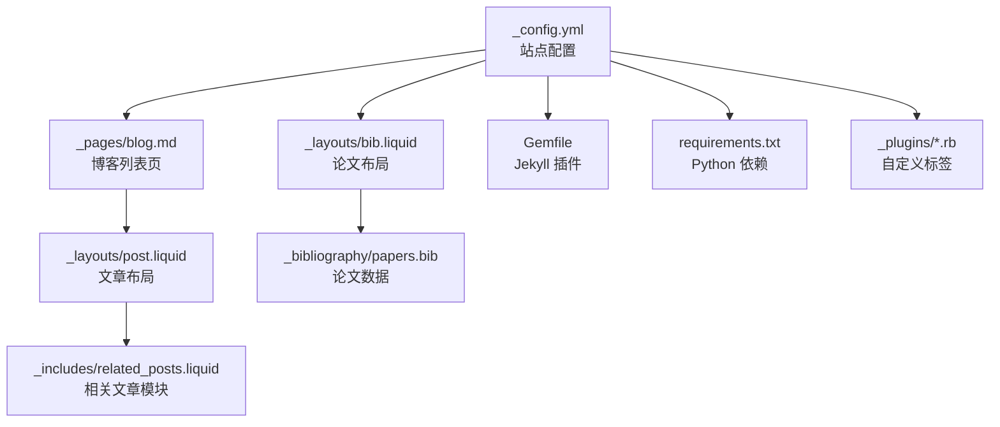
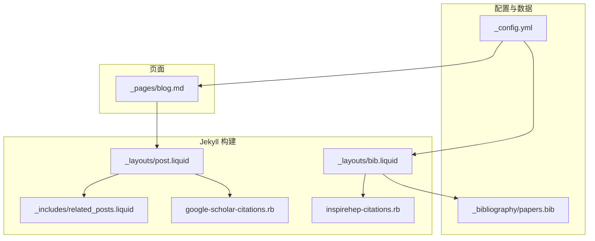
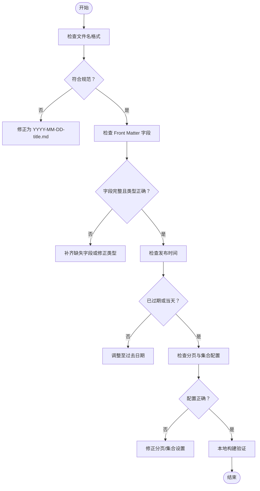
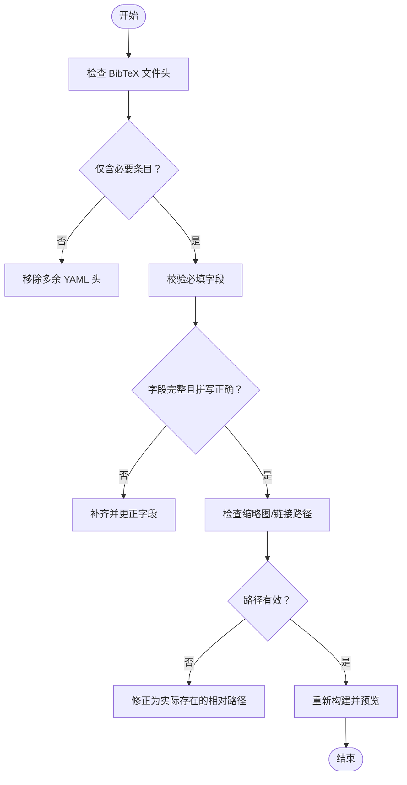
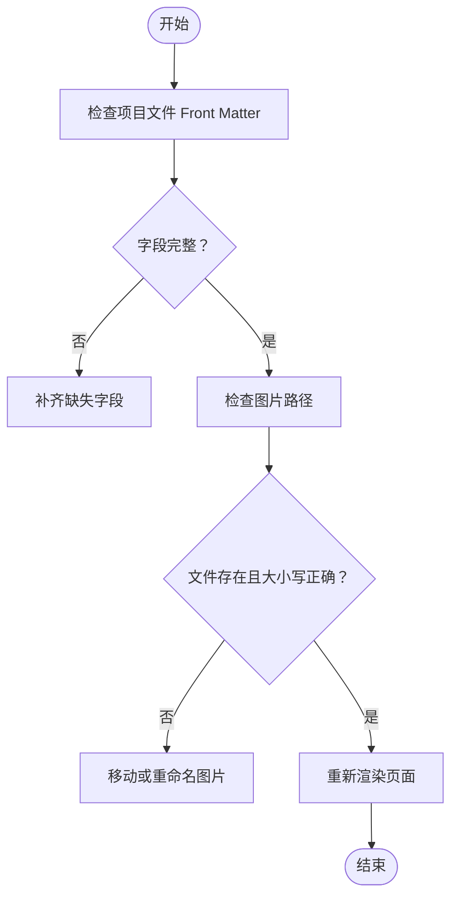
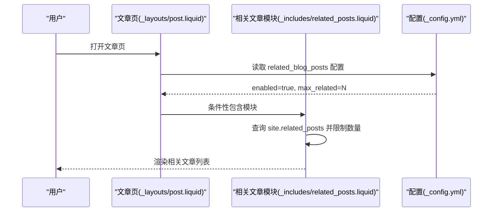
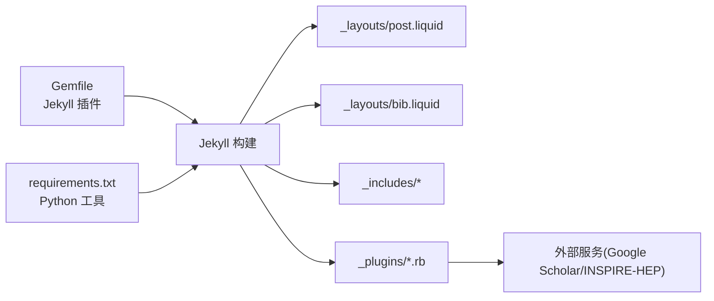

# 内容显示问题

<cite>
**本文档引用的文件**
- [_config.yml](file://_config.yml)
- [TROUBLESHOOTING.md](file://TROUBLESHOOTING.md)
- [Gemfile](file://Gemfile)
- [requirements.txt](file://requirements.txt)
- [_pages/blog.md](file://_pages/blog.md)
- [_layouts/post.liquid](file://_layouts/post.liquid)
- [_includes/related_posts.liquid](file://_includes/related_posts.liquid)
- [_layouts/bib.liquid](file://_layouts/bib.liquid)
- [_bibliography/papers.bib](file://_bibliography/papers.bib)
- [_plugins/google-scholar-citations.rb](file://_plugins/google-scholar-citations.rb)
- [_plugins/inspirehep-citations.rb](file://_plugins/inspirehep-citations.rb)
- [_projects/1_project.md](file://_projects/1_project.md)
- [_includes/projects.liquid](file://_includes/projects.liquid)
</cite>

## 目录
1. [简介](#简介)
2. [项目结构](#项目结构)
3. [核心组件](#核心组件)
4. [架构总览](#架构总览)
5. [详细组件分析](#详细组件分析)
6. [依赖关系分析](#依赖关系分析)
7. [性能考虑](#性能考虑)
8. [故障排除指南](#故障排除指南)
9. [结论](#结论)

## 简介
本指南聚焦于内容显示问题的系统化排查与修复，覆盖以下典型症状：
- 博客文章不显示
- 论文列表异常
- 项目卡片布局错误
- 图片加载失败
- 相关文章功能失效

我们将围绕以下关键点进行深入分析：YAML Front Matter 格式错误、Liquid 模板语法问题、BibTeX 引用格式错误、以及 related_blog_posts 插件的 LSI 计算相关问题，并提供可操作的验证方法、调试技巧与修复方案。

## 项目结构
该站点基于 Jekyll + al-folio 主题，采用标准目录组织：
- 配置与构建：_config.yml、Gemfile、requirements.txt
- 页面与集合：_pages、_posts（未在仓库中）、_projects、_bibliography
- 布局与包含：_layouts、_includes
- 插件：_plugins（自定义 Liquid 标签与外部服务集成）
- 资源：assets（图片、脚本、样式）

图表来源
- [_config.yml:90-130](file://_config.yml#L90-L130)
- [_pages/blog.md:1-20](file://_pages/blog.md#L1-L20)
- [_layouts/post.liquid:85-89](file://_layouts/post.liquid#L85-L89)
- [_includes/related_posts.liquid:1-37](file://_includes/related_posts.liquid#L1-L37)
- [_layouts/bib.liquid:1-20](file://_layouts/bib.liquid#L1-L20)
- [_bibliography/papers.bib:1-14](file://_bibliography/papers.bib#L1-L14)
- [Gemfile:6-29](file://Gemfile#L6-L29)
- [requirements.txt:1-5](file://requirements.txt#L1-L5)
- [_plugins/google-scholar-citations.rb:1-20](file://_plugins/google-scholar-citations.rb#L1-L20)
- [_plugins/inspirehep-citations.rb:1-15](file://_plugins/inspirehep-citations.rb#L1-L15)

章节来源
- [_config.yml:90-130](file://_config.yml#L90-L130)
- [_pages/blog.md:1-20](file://_pages/blog.md#L1-L20)
- [_layouts/post.liquid:85-89](file://_layouts/post.liquid#L85-L89)
- [_includes/related_posts.liquid:1-37](file://_includes/related_posts.liquid#L1-L37)
- [_layouts/bib.liquid:1-20](file://_layouts/bib.liquid#L1-L20)
- [_bibliography/papers.bib:1-14](file://_bibliography/papers.bib#L1-L14)
- [Gemfile:6-29](file://Gemfile#L6-L29)
- [requirements.txt:1-5](file://requirements.txt#L1-L5)
- [_plugins/google-scholar-citations.rb:1-20](file://_plugins/google-scholar-citations.rb#L1-L20)
- [_plugins/inspirehep-citations.rb:1-15](file://_plugins/inspirehep-citations.rb#L1-L15)

## 核心组件
- 博客列表页与分页：通过 _pages/blog.md 配置分页与集合，驱动文章列表渲染。
- 文章布局与相关文章：_layouts/post.liquid 条件性引入 _includes/related_posts.liquid，实现“相关文章”展示。
- 论文展示：_layouts/bib.liquid 渲染论文条目，支持缩略图、链接、徽章等。
- 论文数据：_bibliography/papers.bib 提供 BibTeX 数据源。
- 自定义插件：_plugins/google-scholar-citations.rb 与 _plugins/inspirehep-citations.rb 提供引用计数等动态信息。
- 构建依赖：Gemfile 声明 Jekyll 核心与第三方插件；requirements.txt 提供 Python 工具链。

章节来源
- [_pages/blog.md:7-17](file://_pages/blog.md#L7-L17)
- [_layouts/post.liquid:85-89](file://_layouts/post.liquid#L85-L89)
- [_includes/related_posts.liquid:1-37](file://_includes/related_posts.liquid#L1-L37)
- [_layouts/bib.liquid:1-20](file://_layouts/bib.liquid#L1-L20)
- [_bibliography/papers.bib:1-14](file://_bibliography/papers.bib#L1-L14)
- [_plugins/google-scholar-citations.rb:1-20](file://_plugins/google-scholar-citations.rb#L1-L20)
- [_plugins/inspirehep-citations.rb:1-15](file://_plugins/inspirehep-citations.rb#L1-L15)
- [Gemfile:6-29](file://Gemfile#L6-L29)
- [requirements.txt:1-5](file://requirements.txt#L1-L5)

## 架构总览
下图展示了从配置到页面渲染的关键路径，以及与外部服务的交互。

图表来源
- [_config.yml:90-130](file://_config.yml#L90-L130)
- [_pages/blog.md:1-20](file://_pages/blog.md#L1-L20)
- [_layouts/post.liquid:85-89](file://_layouts/post.liquid#L85-L89)
- [_includes/related_posts.liquid:1-37](file://_includes/related_posts.liquid#L1-L37)
- [_layouts/bib.liquid:1-20](file://_layouts/bib.liquid#L1-L20)
- [_bibliography/papers.bib:1-14](file://_bibliography/papers.bib#L1-L14)
- [_plugins/google-scholar-citations.rb:1-20](file://_plugins/google-scholar-citations.rb#L1-L20)
- [_plugins/inspirehep-citations.rb:1-15](file://_plugins/inspirehep-citations.rb#L1-L15)

## 详细组件分析

### 组件A：博客文章不显示
- 可能原因
  - 文件名格式不符合 Jekyll 规范（缺少日期前缀或非法字符）
  - Front Matter 缺失或字段类型错误（如 layout、date）
  - 发布日期在未来（默认不发布）
  - 分页配置或集合未启用导致列表为空
- 定位步骤
  - 检查 _pages/blog.md 的分页与集合配置
  - 在本地执行构建命令查看具体报错
  - 核对文章 Front Matter 字段是否完整且类型正确
- 修复建议
  - 统一使用 YYYY-MM-DD-title.md 格式
  - 确保 date 早于等于当前时间
  - 如需启用分页，确认分页参数与集合名称一致

图表来源
- [_pages/blog.md:7-17](file://_pages/blog.md#L7-L17)
- [TROUBLESHOOTING.md:204-229](file://TROUBLESHOOTING.md#L204-L229)

章节来源
- [_pages/blog.md:7-17](file://_pages/blog.md#L7-L17)
- [TROUBLESHOOTING.md:204-229](file://TROUBLESHOOTING.md#L204-L229)

### 组件B：论文列表异常
- 可能原因
  - BibTeX 文件头存在多余 YAML 头（如三个连字符）
  - 条目字段缺失或拼写错误（如 title、author、year）
  - 布局中对缩略图或链接路径处理不当
- 定位步骤
  - 使用构建命令过滤 BibTeX 错误输出
  - 对照 _layouts/bib.liquid 中的字段映射逐项核验
- 修复建议
  - 移除 _bibliography/papers.bib 开头的多余 YAML 头
  - 补齐必要字段并确保字段名大小写一致
  - 若使用缩略图，确保路径存在且相对路径正确

图表来源
- [_bibliography/papers.bib:1-3](file://_bibliography/papers.bib#L1-L3)
- [_layouts/bib.liquid:28-44](file://_layouts/bib.liquid#L28-L44)
- [TROUBLESHOOTING.md:231-251](file://TROUBLESHOOTING.md#L231-L251)

章节来源
- [_bibliography/papers.bib:1-3](file://_bibliography/papers.bib#L1-L3)
- [_layouts/bib.liquid:28-44](file://_layouts/bib.liquid#L28-L44)
- [TROUBLESHOOTING.md:231-251](file://TROUBLESHOOTING.md#L231-L251)

### 组件C：项目卡片布局错误
- 可能原因
  - Front Matter 中缺少必要字段（如 layout、title、description、img）
  - 图片路径不存在或大小写不匹配
  - 布局模板中对 img 字段的条件判断与包含逻辑不一致
- 定位步骤
  - 对照 _includes/projects.liquid 的包含逻辑，逐项核对项目文件的 img、title、description
  - 检查图片文件是否存在且命名大小写一致
- 修复建议
  - 在项目文件中补齐 Front Matter 字段
  - 将图片放置于 assets/img 下并使用相对路径
  - 确保 img 字段与包含模板中的路径拼接一致

图表来源
- [_projects/1_project.md:1-8](file://_projects/1_project.md#L1-L8)
- [_includes/projects.liquid:4-13](file://_includes/projects.liquid#L4-L13)

章节来源
- [_projects/1_project.md:1-8](file://_projects/1_project.md#L1-L8)
- [_includes/projects.liquid:4-13](file://_includes/projects.liquid#L4-L13)

### 组件D：图片加载失败
- 可能原因
  - Markdown 或 Front Matter 中的路径错误
  - 文件名大小写不一致（Linux/Mac 区分大小写）
  - 路径层级不正确或相对路径解析错误
- 定位步骤
  - 在 Markdown 中使用相对路径，避免绝对路径
  - 核对 assets/img 下的实际文件名与引用一致
- 修复建议
  - 统一使用小写文件名，避免空格
  - 使用 assets/img/... 的相对路径引用

章节来源
- [TROUBLESHOOTING.md:254-284](file://TROUBLESHOOTING.md#L254-L284)

### 组件E：相关文章功能失效
- 可能原因
  - _config.yml 中 related_blog_posts.enabled 未启用
  - LSI 计算未生成或被禁用（site.lsi=false）
  - 模板中对 page.related_posts 的条件判断导致模块未渲染
- 定位步骤
  - 检查 _config.yml 中 related_blog_posts.enabled 与 max_related
  - 确认文章具备 tags/categories 以触发相关性匹配
  - 查看 _layouts/post.liquid 中的 include 条件
- 修复建议
  - 启用 related_blog_posts 并设置合理的 max_related
  - 确保文章包含至少一个标签或分类
  - 如需 LSI 支持，可在构建环境中启用相应选项（注意与主题默认配置的兼容性）

图表来源
- [_layouts/post.liquid:85-89](file://_layouts/post.liquid#L85-L89)
- [_includes/related_posts.liquid:1-37](file://_includes/related_posts.liquid#L1-L37)
- [_config.yml:102-105](file://_config.yml#L102-L105)

章节来源
- [_layouts/post.liquid:85-89](file://_layouts/post.liquid#L85-L89)
- [_includes/related_posts.liquid:1-37](file://_includes/related_posts.liquid#L1-L37)
- [_config.yml:102-105](file://_config.yml#L102-L105)

## 依赖关系分析
- Jekyll 插件生态：Gemfile 声明了 jekyll-scholar、jekyll-paginate-v2、jekyll-archives-v2 等，直接影响论文与博客分页、归档等功能。
- Python 工具链：requirements.txt 提供 nbconvert、rendercv、scholarly 等工具，用于笔记转换与学术数据抓取。
- 自定义 Liquid 标签：google-scholar-citations.rb 与 inspirehep-citations.rb 通过网络请求获取引用计数，需注意网络稳定性与速率限制。

图表来源
- [Gemfile:6-29](file://Gemfile#L6-L29)
- [requirements.txt:1-5](file://requirements.txt#L1-L5)
- [_layouts/post.liquid:85-89](file://_layouts/post.liquid#L85-L89)
- [_layouts/bib.liquid:1-20](file://_layouts/bib.liquid#L1-L20)
- [_plugins/google-scholar-citations.rb:1-20](file://_plugins/google-scholar-citations.rb#L1-L20)
- [_plugins/inspirehep-citations.rb:1-15](file://_plugins/inspirehep-citations.rb#L1-L15)

章节来源
- [Gemfile:6-29](file://Gemfile#L6-L29)
- [requirements.txt:1-5](file://requirements.txt#L1-L5)
- [_plugins/google-scholar-citations.rb:1-20](file://_plugins/google-scholar-citations.rb#L1-L20)
- [_plugins/inspirehep-citations.rb:1-15](file://_plugins/inspirehep-citations.rb#L1-L15)

## 性能考虑
- 构建时间优化
  - 合理设置分页数量与集合范围，避免一次性渲染过多内容
  - 控制论文条目数量与缩略图尺寸，减少静态资源体积
- 外部服务调用
  - 自定义插件对远程 API 的调用可能成为瓶颈，建议缓存结果或降低请求频率
- 图片懒加载与响应式
  - 启用懒加载与响应式 WebP 图像可显著提升首屏性能

## 故障排除指南

### YAML Front Matter 格式错误
- 常见问题
  - 特殊字符未加引号（如冒号、与符号）
  - 缩进不一致（应使用 2 空格）
  - 必填字段缺失（如 layout、title、date）
- 排查步骤
  - 使用在线 YAML 校验器或本地运行构建命令定位错误行
  - 对照 TROUBLESHOOTING.md 中的示例修正
- 修复建议
  - 对包含特殊字符的字符串加双引号
  - 统一缩进为 2 空格
  - 确保 Front Matter 结尾有分隔线

章节来源
- [TROUBLESHOOTING.md:288-324](file://TROUBLESHOOTING.md#L288-L324)

### Liquid 模板语法问题
- 常见问题
  - 标签未闭合或嵌套错误
  - 变量作用域或过滤器使用不当
  - include 条件判断导致模块未渲染
- 排查步骤
  - 逐段注释定位问题区块
  - 在本地构建时关注错误提示
- 修复建议
  - 严格遵循 Liquid 语法规则，确保所有标签闭合
  - 对 include 条件进行逻辑校验，确保分支覆盖所有场景

章节来源
- [_layouts/post.liquid:85-89](file://_layouts/post.liquid#L85-L89)
- [_includes/related_posts.liquid:1-37](file://_includes/related_posts.liquid#L1-L37)

### BibTeX 引用格式错误
- 常见问题
  - 文件头多余 YAML 头
  - 缺少必填字段（如 title、author、year）
  - 字段拼写错误或大小写不一致
- 排查步骤
  - 使用构建命令过滤 bibtex 相关错误
  - 对照 _layouts/bib.liquid 的字段映射逐项核验
- 修复建议
  - 移除多余文件头，仅保留条目
  - 补齐并更正字段，确保大小写一致

章节来源
- [_bibliography/papers.bib:1-3](file://_bibliography/papers.bib#L1-L3)
- [_layouts/bib.liquid:1-20](file://_layouts/bib.liquid#L1-L20)
- [TROUBLESHOOTING.md:231-251](file://TROUBLESHOOTING.md#L231-L251)

### related_blog_posts 插件的 LSI 计算错误
- 常见问题
  - site.lsi=false 导致相关性索引未生成
  - related_blog_posts.enabled 未启用
  - 文章缺少标签或分类导致无相关结果
- 排查步骤
  - 检查 _config.yml 中相关配置项
  - 确认文章具备 tags/categories
- 修复建议
  - 启用 related_blog_posts 并设置合理数量上限
  - 为文章添加至少一个标签或分类

章节来源
- [_config.yml:96-105](file://_config.yml#L96-L105)
- [_layouts/post.liquid:85-89](file://_layouts/post.liquid#L85-L89)
- [_includes/related_posts.liquid:1-37](file://_includes/related_posts.liquid#L1-L37)

### 图片加载失败
- 常见问题
  - 路径错误或大小写不一致
  - 文件不存在或权限不足
- 排查步骤
  - 使用相对路径引用 assets/img 下的文件
  - 核对文件名大小写与实际一致
- 修复建议
  - 统一使用小写文件名，避免空格
  - 将图片放置于 assets/img 下并使用相对路径

章节来源
- [TROUBLESHOOTING.md:254-284](file://TROUBLESHOOTING.md#L254-L284)
- [_includes/projects.liquid:4-13](file://_includes/projects.liquid#L4-L13)

## 结论
通过系统化的排查流程与针对性修复，大多数内容显示问题均可快速定位并解决。建议优先检查 YAML Front Matter 与 Liquid 语法的规范性，再逐步深入到数据源（BibTeX）与模板包含逻辑，最后结合构建与依赖配置进行最终验证。对于外部服务（如 Google Scholar/INSPIRE-HEP），需关注网络稳定性与请求频率控制，以保障站点性能与可靠性。