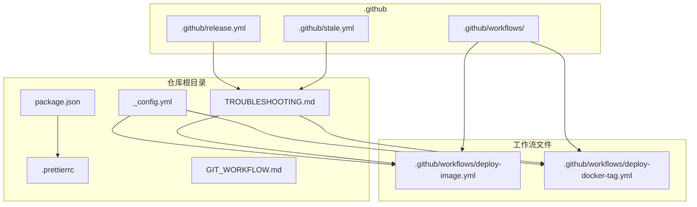
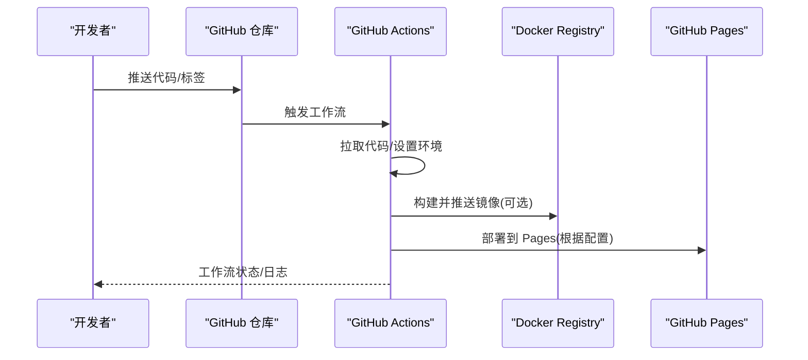
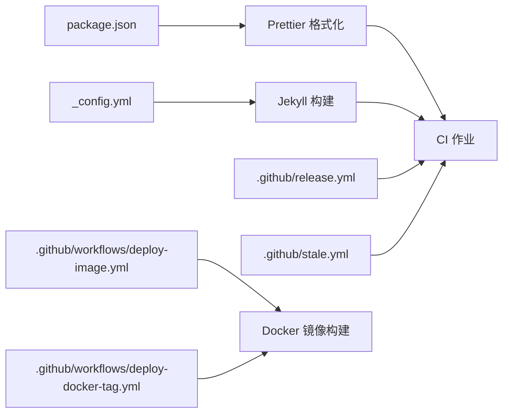
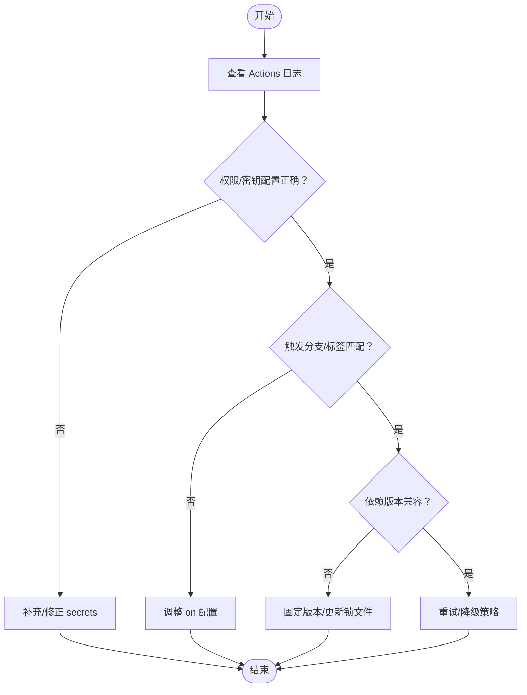

# 工作流自动化问题

<cite>
**本文引用的文件**
- [TROUBLESHOOTING.md](file://TROUBLESHOOTING.md)
- [GIT_WORKFLOW.md](file://.github/GIT_WORKFLOW.md)
- [package.json](file://package.json)
- [.prettierrc](file://.prettierrc)
- [_config.yml](file://_config.yml)
- [.github/release.yml](file://.github/release.yml)
- [.github/stale.yml](file://.github/stale.yml)
- [.github/workflows/deploy-image.yml](file://.github/workflows/deploy-image.yml)
- [.github/workflows/deploy-docker-tag.yml](file://.github/workflows/deploy-docker-tag.yml)
- [INSTALL.md](file://INSTALL.md)
- [FAQ.md](file://FAQ.md)
- [CONTRIBUTING.md](file://CONTRIBUTING.md)
- [CUSTOMIZE.md](file://CUSTOMIZE.md)
</cite>

## 目录
1. [简介](#简介)
2. [项目结构](#项目结构)
3. [核心组件](#核心组件)
4. [架构总览](#架构总览)
5. [详细组件分析](#详细组件分析)
6. [依赖关系分析](#依赖关系分析)
7. [性能考虑](#性能考虑)
8. [故障排除指南](#故障排除指南)
9. [结论](#结论)
10. [附录](#附录)

## 简介
本文件聚焦于该 GitHub Pages 项目的“工作流自动化问题”，围绕以下主题提供系统化的故障排除与替代方案：
- GitHub Actions 工作流运行失败
- Lighthouse 性能测试工作流错误
- axe 无障碍测试失败
- 链接检查工作流问题
- Prettier 代码格式化工作流配置错误

重点解决三类共性问题：工作流权限令牌配置、依赖版本兼容性、以及工作流依赖的服务 API 变更；并提供调试方法、日志分析技巧与替代方案。

## 项目结构
该仓库采用 Jekyll 主题（al-folio）驱动的静态站点，工作流主要位于 .github/workflows 目录中，配合 Prettier 格式化工具与若干配置文件实现自动化构建、部署与质量保障。

图表来源
- [_config.yml](file://_config.yml)
- [package.json](file://package.json)
- [.prettierrc](file://.prettierrc)
- [.github/release.yml](file://.github/release.yml)
- [.github/stale.yml](file://.github/stale.yml)
- [.github/workflows/deploy-image.yml](file://.github/workflows/deploy-image.yml)
- [.github/workflows/deploy-docker-tag.yml](file://.github/workflows/deploy-docker-tag.yml)

章节来源
- [TROUBLESHOOTING.md:1-455](file://TROUBLESHOOTING.md#L1-L455)
- [GIT_WORKFLOW.md:1-48](file://.github/GIT_WORKFLOW.md#L1-L48)
- [package.json:1-7](file://package.json#L1-L7)
- [.prettierrc:1-4](file://.prettierrc#L1-L4)
- [_config.yml:1-656](file://_config.yml#L1-L656)
- [.github/release.yml:1-15](file://.github/release.yml#L1-L15)
- [.github/stale.yml:1-19](file://.github/stale.yml#L1-L19)
- [.github/workflows/deploy-image.yml:1-44](file://.github/workflows/deploy-image.yml#L1-L44)
- [.github/workflows/deploy-docker-tag.yml:1-50](file://.github/workflows/deploy-docker-tag.yml#L1-L50)

## 核心组件
- 配置与环境
  - 站点配置：_config.yml 控制 Jekyll 构建参数、插件启用、第三方库版本等。
  - Prettier 配置：package.json 与 .prettierrc 定义格式化规则与插件。
- 工作流
  - Docker 镜像构建与推送：deploy-image.yml、deploy-docker-tag.yml。
  - 发布与维护策略：release.yml、stale.yml。
- 文档与规范
  - 故障排除：TROUBLESHOOTING.md 提供常见问题与解决方案。
  - Git 工作流：.github/GIT_WORKFLOW.md 规范提交消息与分支管理。
  - 使用说明与定制：INSTALL.md、FAQ.md、CONTRIBUTING.md、CUSTOMIZE.md。

章节来源
- [_config.yml:196-218](file://_config.yml#L196-L218)
- [package.json:1-7](file://package.json#L1-L7)
- [.prettierrc:1-4](file://.prettierrc#L1-L4)
- [.github/workflows/deploy-image.yml:1-44](file://.github/workflows/deploy-image.yml#L1-L44)
- [.github/workflows/deploy-docker-tag.yml:1-50](file://.github/workflows/deploy-docker-tag.yml#L1-L50)
- [TROUBLESHOOTING.md:1-455](file://TROUBLESHOOTING.md#L1-L455)
- [GIT_WORKFLOW.md:1-48](file://.github/GIT_WORKFLOW.md#L1-L48)
- [INSTALL.md:181-201](file://INSTALL.md#L181-L201)
- [FAQ.md:115](file://FAQ.md#L115)
- [CONTRIBUTING.md:61](file://CONTRIBUTING.md#L61)
- [CUSTOMIZE.md:297](file://CUSTOMIZE.md#L297)

## 架构总览
下图展示从代码提交到构建、测试与部署的关键路径，以及与外部服务（如 Docker Hub、GitHub Pages）的交互。

图表来源
- [.github/workflows/deploy-image.yml:1-44](file://.github/workflows/deploy-image.yml#L1-L44)
- [.github/workflows/deploy-docker-tag.yml:1-50](file://.github/workflows/deploy-docker-tag.yml#L1-L50)
- [_config.yml:20-22](file://_config.yml#L20-L22)

## 详细组件分析

### GitHub Actions 工作流运行失败
- 常见原因
  - 权限不足：缺少 secrets 或权限配置不正确。
  - 分支触发条件不匹配：on.push.branches 与实际分支不符。
  - 依赖服务变更：Docker Registry 访问限制、网络超时。
  - 环境变量缺失：容器内无法解析的占位符。
- 调试步骤
  - 在 Actions 页面查看工作流日志，定位失败步骤。
  - 校验 secrets 是否在仓库 Settings → Secrets and variables 中配置。
  - 对照工作流文件的触发条件与当前分支/标签是否一致。
  - 若涉及 Docker 登录，确认 DOCKER_USERNAME/DOCKER_PASSWORD 是否正确。
- 替代方案
  - 临时禁用失败作业，保留其他作业继续执行。
  - 将敏感操作改为手动触发（on.workflow_dispatch），便于本地复现。
  - 使用缓存（actions/cache）减少重复下载依赖的时间。

章节来源
- [TROUBLESHOOTING.md:38-56](file://TROUBLESHOOTING.md#L38-L56)
- [.github/workflows/deploy-image.yml:17-44](file://.github/workflows/deploy-image.yml#L17-L44)
- [.github/workflows/deploy-docker-tag.yml:17-50](file://.github/workflows/deploy-docker-tag.yml#L17-L50)
- [INSTALL.md:181-186](file://INSTALL.md#L181-L186)

### Lighthouse 性能测试工作流错误
- 常见原因
  - 测试目标不可达：域名未生效、CDN 缓存未刷新。
  - 浏览器渲染异常：动态内容加载导致测量不稳定。
  - 输出路径或报告格式不匹配：生成结果未被后续步骤读取。
- 调试步骤
  - 在本地使用 Lighthouse CLI 复现相同页面与网络环境。
  - 检查站点基础配置（url/baseurl）是否正确，避免相对路径问题。
  - 关注工作流中生成报告的输出目录与 artifacts 配置。
- 替代方案
  - 使用 Puppeteer 或 Playwright 进行端到端页面截图与性能采集。
  - 将 Lighthouse 步骤拆分为独立作业，分别处理桌面/移动端。

章节来源
- [TROUBLESHOOTING.md:144-174](file://TROUBLESHOOTING.md#L144-L174)
- [_config.yml:20-22](file://_config.yml#L20-L22)

### axe 无障碍测试失败
- 常见原因
  - 动态内容未就绪：测试在 DOM 完成前执行。
  - 第三方脚本阻塞：跨域资源加载失败导致断言异常。
  - 规则阈值过高：对特定页面的误报较多。
- 调试步骤
  - 在浏览器控制台运行 axe.run() 获取详细失败清单。
  - 使用 axe-core 的配置选项过滤已知误报。
  - 确认测试页面在 GitHub Pages 上的最终渲染结果。
- 替代方案
  - 将 axe 测试拆分为多页面并行执行，缩短总耗时。
  - 结合静态 AST 检测工具（如 eslint-plugin-jsx-a11y）在 CI 中先行过滤。

章节来源
- [TROUBLESHOOTING.md:144-174](file://TROUBLESHOOTING.md#L144-L174)

### 链接检查工作流问题
- 常见原因
  - 外链超时：第三方服务不稳定或被防火墙拦截。
  - 重定向循环：短链或跳转逻辑导致死循环。
  - 协议不一致：混合内容或 http/https 切换。
- 调试步骤
  - 使用 curl 或 wget 手动验证可疑链接。
  - 在工作流中增加重试与超时配置，区分临时与永久失败。
  - 对内部链接优先使用相对路径，减少跨域影响。
- 替代方案
  - 使用 lychee 作为链接检查工具，并通过 .lycheeignore 忽略已知无效链接。
  - 将链接检查拆分为每日与 PR 触发两类，降低 CI 时间。

章节来源
- [TROUBLESHOOTING.md:144-174](file://TROUBLESHOOTING.md#L144-L174)
- [INSTALL.md:181-201](file://INSTALL.md#L181-L201)

### Prettier 代码格式化工作流配置错误
- 常见原因
  - 插件版本不兼容：@shopify/prettier-plugin-liquid 与 Prettier 版本冲突。
  - 规则冲突：printWidth、trailingComma 等配置与其他工具（如 ESLint）不一致。
  - 文件未纳入格式化范围：.prettierignore 导致部分文件未被检查。
- 调试步骤
  - 在本地运行 prettier --check 并观察具体文件与行号。
  - 检查 package.json 与 .prettierrc 的版本与插件配置。
  - 对比工作流中安装的 Node 与 Prettier 版本，确保一致。
- 替代方案
  - 使用 pre-commit 钩子在本地强制格式化，减少 CI 失败。
  - 将格式化任务拆分为独立作业，仅在 PR 修改相关文件时触发。

章节来源
- [package.json:1-7](file://package.json#L1-L7)
- [.prettierrc:1-4](file://.prettierrc#L1-L4)
- [CONTRIBUTING.md:10](file://CONTRIBUTING.md#L10)

## 依赖关系分析
- 工作流与站点配置
  - _config.yml 决定 Jekyll 构建行为与插件启用，直接影响工作流构建阶段。
  - 工作流文件通过 actions/checkout 拉取代码并按需安装 Ruby/Node 环境。
- 工具链与版本
  - package.json 与 .prettierrc 共同定义 Prettier 行为，版本升级需同步校验。
  - Docker 工作流依赖 secrets 进行镜像推送，需定期轮换与审计。
- 维护策略
  - release.yml 与 stale.yml 用于发布与 Issue 生命周期管理，间接影响工作流的触发频率与稳定性。

图表来源
- [_config.yml:196-218](file://_config.yml#L196-L218)
- [package.json:1-7](file://package.json#L1-L7)
- [.prettierrc:1-4](file://.prettierrc#L1-L4)
- [.github/release.yml:1-15](file://.github/release.yml#L1-L15)
- [.github/stale.yml:1-19](file://.github/stale.yml#L1-L19)
- [.github/workflows/deploy-image.yml:1-44](file://.github/workflows/deploy-image.yml#L1-L44)
- [.github/workflows/deploy-docker-tag.yml:1-50](file://.github/workflows/deploy-docker-tag.yml#L1-L50)

章节来源
- [_config.yml:196-218](file://_config.yml#L196-L218)
- [package.json:1-7](file://package.json#L1-L7)
- [.prettierrc:1-4](file://.prettierrc#L1-L4)
- [.github/release.yml:1-15](file://.github/release.yml#L1-L15)
- [.github/stale.yml:1-19](file://.github/stale.yml#L1-L19)
- [.github/workflows/deploy-image.yml:1-44](file://.github/workflows/deploy-image.yml#L1-L44)
- [.github/workflows/deploy-docker-tag.yml:1-50](file://.github/workflows/deploy-docker-tag.yml#L1-L50)

## 性能考虑
- 减少工作流时间
  - 合理使用缓存（actions/cache）、并行作业与按需触发。
  - 将大体积任务（如 Docker 构建）拆分至独立分支或标签触发。
- 优化构建稳定性
  - 固定依赖版本并在升级前进行预检。
  - 对外链检查与第三方服务调用增加重试与超时配置。
- 日志与可观测性
  - 为关键步骤添加命名与分段日志，便于快速定位失败点。
  - 使用 artifacts 保存中间产物，支持离线分析与回放。

## 故障排除指南

### 通用排查流程

### 针对性建议
- GitHub Actions 失败
  - 检查 secrets 与权限矩阵，必要时启用手动触发以隔离问题。
  - 参考部署工作流的触发条件与推送分支一致性。
- Lighthouse 错误
  - 校验站点 url/baseurl，确保 Pages 已生效。
  - 在本地复现并记录网络与渲染差异。
- axe 失败
  - 使用浏览器控制台运行 axe.run() 获取失败清单。
  - 针对误报配置 axe 的过滤规则。
- 链接检查问题
  - 使用 curl/wget 验证可疑链接，必要时加入 .lycheeignore。
  - 区分临时失败与永久失败，设置合理重试与超时。
- Prettier 配置错误
  - 在本地运行 --check，核对插件与规则版本。
  - 将格式化任务拆分为独立作业，缩小影响面。

章节来源
- [TROUBLESHOOTING.md:38-56](file://TROUBLESHOOTING.md#L38-L56)
- [INSTALL.md:181-186](file://INSTALL.md#L181-L186)
- [package.json:1-7](file://package.json#L1-L7)
- [.prettierrc:1-4](file://.prettierrc#L1-L4)

## 结论
通过规范化工作流配置、明确权限与密钥管理、固定依赖版本、完善日志与重试机制，可以显著降低自动化失败率。针对 Lighthouse、axe、链接检查与 Prettier 等环节，建议结合本地复现与分步调试，逐步定位并修复问题。同时，利用 release.yml 与 stale.yml 等维护策略，有助于长期保持工作流的稳定与可维护性。

## 附录
- 相关文档与参考
  - GitHub Actions 文档与工作流定义位置说明
  - Copilot 自动化环境配置与依赖准备
  - 渲染 CV 的自动工作流与 PAT 使用场景

章节来源
- [FAQ.md:115](file://FAQ.md#L115)
- [CONTRIBUTING.md:61](file://CONTRIBUTING.md#L61)
- [CUSTOMIZE.md:297](file://CUSTOMIZE.md#L297)
- [CUSTOMIZE.md:379](file://CUSTOMIZE.md#L379)
- [CUSTOMIZE.md:1401](file://CUSTOMIZE.md#L1401)