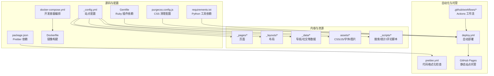
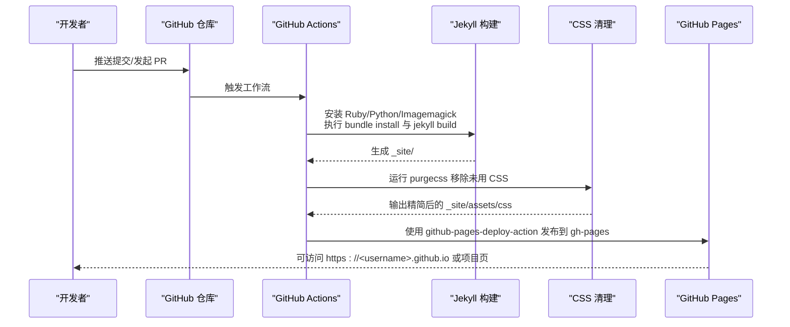
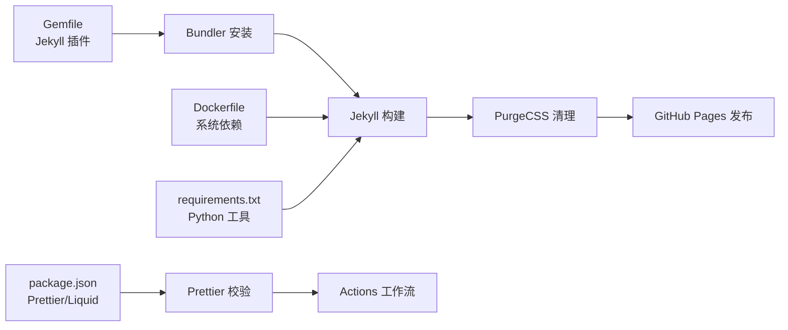

# 常见问题解答

<cite>
**本文引用的文件**
- [FAQ.md](file://FAQ.md)
- [TROUBLESHOOTING.md](file://TROUBLESHOOTING.md)
- [_config.yml](file://_config.yml)
- [Gemfile](file://Gemfile)
- [package.json](file://package.json)
- [INSTALL.md](file://INSTALL.md)
- [QUICKSTART.md](file://QUICKSTART.md)
- [.github/workflows/deploy.yml](file://.github/workflows/deploy.yml)
- [.github/workflows/prettier.yml](file://.github/workflows/prettier.yml)
- [Dockerfile](file://Dockerfile)
- [docker-compose.yml](file://docker-compose.yml)
- [docker-compose-slim.yml](file://docker-compose-slim.yml)
- [.dockerignore](file://.dockerignore)
- [requirements.txt](file://requirements.txt)
- [purgecss.config.js](file://purgecss.config.js)
</cite>

## 目录
1. [简介](#简介)
2. [项目结构](#项目结构)
3. [核心组件](#核心组件)
4. [架构总览](#架构总览)
5. [详细组件分析](#详细组件分析)
6. [依赖关系分析](#依赖关系分析)
7. [性能考虑](#性能考虑)
8. [故障排除指南](#故障排除指南)
9. [结论](#结论)
10. [附录](#附录)

## 简介
本文件面向使用基于 Jekyll 的 al-folio 主题进行个人/组织或项目页面搭建与维护的用户，系统性整理了部署、本地构建、样式布局、内容显示、配置与功能相关的常见问题与排障流程。内容来源于仓库内的官方文档与工作流配置，并结合实际错误场景提供可操作的诊断步骤、解决方案与预防措施。

## 项目结构
该站点采用 Jekyll 静态站点生成器，配合 GitHub Actions 自动化部署至 GitHub Pages；同时提供 Docker 开发容器与本地 Ruby 环境两种本地开发方式。核心配置集中在站点配置文件中，插件通过 Gemfile 管理，前端资源位于 assets 目录，页面与布局在 _pages 与 _layouts 中，数据与导航在 _data 中，脚本与搜索索引在 _scripts 中。

**图表来源**
- [_config.yml](file://_config.yml)
- [Gemfile](file://Gemfile)
- [package.json](file://package.json)
- [docker-compose.yml](file://docker-compose.yml)
- [Dockerfile](file://Dockerfile)
- [purgecss.config.js](file://purgecss.config.js)
- [.github/workflows/deploy.yml](file://.github/workflows/deploy.yml)
- [.github/workflows/prettier.yml](file://.github/workflows/prettier.yml)

**章节来源**
- [INSTALL.md](file://INSTALL.md)
- [QUICKSTART.md](file://QUICKSTART.md)

## 核心组件
- 站点配置：统一管理站点标题、URL、baseurl、功能开关（如搜索、数学公式、暗色模式）、插件列表、第三方库版本与完整性校验等。
- 插件生态：通过 Gemfile 定义 Jekyll 核心插件与外部数据处理插件，确保构建稳定性与功能扩展。
- 自动化部署：GitHub Actions 在推送/拉取请求时触发，安装依赖、构建站点、清理未使用 CSS 并发布到 gh-pages 分支供 GitHub Pages 使用。
- 本地开发：提供 Docker 与开发容器两种方式，减少环境差异导致的构建问题；亦支持传统 Ruby 环境。
- 前端与脚本：assets 与 _scripts 提供样式、图标、搜索与第三方脚本集成，确保交互与展示效果。

**章节来源**
- [_config.yml](file://_config.yml)
- [Gemfile](file://Gemfile)
- [.github/workflows/deploy.yml](file://.github/workflows/deploy.yml)
- [INSTALL.md](file://INSTALL.md)

## 架构总览
下图展示了从本地修改到 GitHub Pages 生产环境的关键路径与关键节点。

**图表来源**
- [.github/workflows/deploy.yml](file://.github/workflows/deploy.yml)
- [Dockerfile](file://Dockerfile)
- [purgecss.config.js](file://purgecss.config.js)

## 详细组件分析

### 组件一：部署与 GitHub Pages（部署问题）
- 问题类型
  - 自动部署未触发或失败
  - 自定义域名在每次部署后丢失
  - Actions 报错“未知标签 toc”
- 诊断与解决
  - 确认 Actions 权限已设置为“读写”，并已在 Settings → Pages 设置发布分支为 gh-pages
  - 自定义域名需在仓库根目录添加 CNAME 文件，内容为域名一行
  - 若本地可构建但 Actions 报 Unknown tag 'toc'，检查 Pages 源是否为 gh-pages 分支
- 预防措施
  - 遵循快速开始与安装文档中的部署步骤
  - 避免直接编辑 gh-pages 分支，所有更改应从 main/master 推送
  - 更新模板时同步更新工作流与依赖

**章节来源**
- [TROUBLESHOOTING.md](file://TROUBLESHOOTING.md)
- [FAQ.md](file://FAQ.md)
- [INSTALL.md](file://INSTALL.md)
- [QUICKSTART.md](file://QUICKSTART.md)
- [.github/workflows/deploy.yml](file://.github/workflows/deploy.yml)

### 组件二：本地构建（Docker/本地 Ruby）
- 问题类型
  - Docker 构建失败
  - Ruby 依赖冲突（Gemfile.lock 冲突、默认库版本不兼容）
  - 端口占用（本地 4000/8080）
- 诊断与解决
  - Docker：更新镜像、重建容器、检查系统资源与权限；必要时使用 slim 版本
  - Ruby：删除 Gemfile.lock，更新 Bundler 后重新安装依赖
  - 端口：停止占用进程或更换端口
- 预防措施
  - 优先使用 Docker 进行本地开发以避免环境差异
  - 定期更新依赖并测试本地构建

**章节来源**
- [TROUBLESHOOTING.md](file://TROUBLESHOOTING.md)
- [INSTALL.md](file://INSTALL.md)
- [Dockerfile](file://Dockerfile)
- [docker-compose.yml](file://docker-compose.yml)
- [docker-compose-slim.yml](file://docker-compose-slim.yml)

### 组件三：样式与布局（CSS/JS 加载、主题颜色）
- 问题类型
  - CSS/JS 未加载或样式异常
  - 主题颜色不生效
- 诊断与解决
  - 检查 _config.yml 中 url/baseurl 是否正确（个人/组织站点 baseurl 必须为空；项目页需匹配仓库名）
  - 清理浏览器缓存或使用隐私窗口访问
  - 重新构建并等待 Actions 完成
- 预防措施
  - 修改配置后先本地验证再推送
  - 使用 Docker 构建以复现 CI 环境

**章节来源**
- [TROUBLESHOOTING.md](file://TROUBLESHOOTING.md)
- [_config.yml](file://_config.yml)

### 组件四：内容显示（博客文章、论文、图片）
- 问题类型
  - 博客文章不显示
  - 论文不显示或 BibTeX 解析错误
  - 图片加载失败
- 诊断与解决
  - 博客：确认文件命名格式、front matter、日期不为未来时间、启用 blog_page
  - 论文：检查 papers.bib 路径、条目唯一键、语法正确性；使用本地构建命令查看 bibtex 错误
  - 图片：使用相对路径、确认文件存在且大小写正确
- 预防措施
  - 使用统一命名规范与 front matter 模板
  - 在本地先构建验证后再推送

**章节来源**
- [TROUBLESHOOTING.md](file://TROUBLESHOOTING.md)
- [_config.yml](file://_config.yml)

### 组件五：配置问题（YAML 语法、RSS、搜索）
- 问题类型
  - YAML 语法错误
  - RSS/Atom 订阅无效
  - 搜索功能不可用
- 诊断与解决
  - 使用在线 YAML 校验工具或本地运行 jekyll build 查看具体报错行
  - 确保 RSS 所需字段（title、url、description、author）完整
  - 检查 search_enabled、url 等配置项
- 预防措施
  - 编辑器启用 YAML 语法高亮与缩进检查
  - 在 PR 或推送前运行本地构建

**章节来源**
- [TROUBLESHOOTING.md](file://TROUBLESHOOTING.md)
- [_config.yml](file://_config.yml)

### 组件六：功能特性（评论、相关文章、代码高亮）
- 问题类型
  - Giscus 评论不显示
  - 相关文章计算失败
  - 代码块高亮异常
- 诊断与解决
  - Giscus：确认仓库开启 Discussions，配置 repo/repo_id/category_id 等参数
  - 相关文章：若出现零向量或开方域错误，调整或禁用相关功能
  - 代码高亮：确保语言标识受 Pygments 支持
- 预防措施
  - 功能开关与第三方服务均需按文档配置

**章节来源**
- [TROUBLESHOOTING.md](file://TROUBLESHOOTING.md)
- [_config.yml](file://_config.yml)

## 依赖关系分析
- Ruby 插件链路：Gemfile 定义插件集合，Actions 与本地均通过 bundle 安装；部分插件对系统库有依赖（如 Imagemagick）
- 前端与格式化：package.json 引入 Prettier 与 Liquid 插件，prettier.yml 在 PR/Push 时检查格式
- 构建与清理：Dockerfile 安装系统依赖；purgecss.config.js 在部署阶段清理未使用 CSS
- Python 工具：requirements.txt 提供 nbconvert、rendercv 等工具，用于 Jupyter/简历渲染

**图表来源**
- [Gemfile](file://Gemfile)
- [Dockerfile](file://Dockerfile)
- [package.json](file://package.json)
- [requirements.txt](file://requirements.txt)
- [.github/workflows/prettier.yml](file://.github/workflows/prettier.yml)
- [.github/workflows/deploy.yml](file://.github/workflows/deploy.yml)
- [purgecss.config.js](file://purgecss.config.js)

**章节来源**
- [Gemfile](file://Gemfile)
- [package.json](file://package.json)
- [requirements.txt](file://requirements.txt)
- [.github/workflows/deploy.yml](file://.github/workflows/deploy.yml)
- [.github/workflows/prettier.yml](file://.github/workflows/prettier.yml)

## 性能考虑
- 使用 Docker 本地开发可减少环境差异带来的构建失败与反复调试成本
- 启用 CSS 清理（PurgeCSS）可显著减小产物体积，提升加载速度
- 合理配置懒加载与响应式图片可优化移动端体验
- 关闭不必要的功能（如相关文章、暗色模式等）可降低构建复杂度

## 故障排除指南

### 部署问题
- 症状：部署失败或 Actions 报错
  - 步骤：检查 Actions 日志、确认工作流权限、核对 url/baseurl、确保推送至 main/master
  - 参考：[自动部署说明](file://INSTALL.md)、[部署工作流](file://.github/workflows/deploy.yml)
- 症状：自定义域名每次部署后清空
  - 步骤：在仓库根添加 CNAME 文件，内容为域名一行
  - 参考：[自定义域名说明](file://INSTALL.md)
- 症状：本地可构建但 Actions 报 Unknown tag 'toc'
  - 步骤：确认 Pages 源为 gh-pages 分支
  - 参考：[FAQ 相关问题](file://FAQ.md)

**章节来源**
- [TROUBLESHOOTING.md](file://TROUBLESHOOTING.md)
- [INSTALL.md](file://INSTALL.md)
- [FAQ.md](file://FAQ.md)
- [.github/workflows/deploy.yml](file://.github/workflows/deploy.yml)

### 本地构建问题
- 症状：Docker 构建失败
  - 步骤：更新镜像、重建容器、检查权限与系统资源；必要时使用 slim 版本
  - 参考：[Docker 配置](file://docker-compose.yml)、[Dockerfile](file://Dockerfile)
- 症状：Ruby 依赖冲突
  - 步骤：删除 Gemfile.lock，更新 Bundler 后重新安装
  - 参考：[Gemfile](file://Gemfile)
- 症状：端口占用
  - 步骤：停止占用进程或更换端口
  - 参考：[端口占用处理](file://TROUBLESHOOTING.md)

**章节来源**
- [TROUBLESHOOTING.md](file://TROUBLESHOOTING.md)
- [docker-compose.yml](file://docker-compose.yml)
- [Dockerfile](file://Dockerfile)
- [Gemfile](file://Gemfile)

### 样式布局问题
- 症状：CSS/JS 未加载或样式异常
  - 步骤：核对 url/baseurl、清理浏览器缓存、等待 Actions 完成
  - 参考：[样式问题排查](file://TROUBLESHOOTING.md)、[_config.yml](file://_config.yml)
- 症状：主题颜色不生效
  - 步骤：确认颜色名称有效、清理缓存、重新构建并等待发布

**章节来源**
- [TROUBLESHOOTING.md](file://TROUBLESHOOTING.md)
- [_config.yml](file://_config.yml)

### 内容显示问题
- 症状：博客文章不显示
  - 步骤：检查文件命名、front matter、日期、启用开关
  - 参考：[博客排查清单](file://TROUBLESHOOTING.md)
- 症状：论文不显示
  - 步骤：检查 papers.bib 路径与语法、条目唯一键、启用开关
  - 参考：[论文排查](file://TROUBLESHOOTING.md)
- 症状：图片加载失败
  - 步骤：使用相对路径、确认文件存在且大小写正确

**章节来源**
- [TROUBLESHOOTING.md](file://TROUBLESHOOTING.md)
- [_config.yml](file://_config.yml)

### 配置问题
- 症状：YAML 语法错误
  - 步骤：使用在线校验或本地构建查看报错行；注意特殊字符转义与缩进
  - 参考：[YAML 语法检查](file://TROUBLESHOOTING.md)
- 症状：RSS 不工作
  - 步骤：确保必需字段完整、baseurl 正确、至少有一篇有效文章
  - 参考：[RSS 排查](file://TROUBLESHOOTING.md)
- 症状：搜索功能不可用
  - 步骤：启用 search_enabled、确保 url 有效、等待索引生成

**章节来源**
- [TROUBLESHOOTING.md](file://TROUBLESHOOTING.md)
- [_config.yml](file://_config.yml)

### 功能特性问题
- 症状：Giscus 评论不显示
  - 步骤：确认仓库开启 Discussions、正确配置 repo/repo_id/category_id
  - 参考：[Giscus 排查](file://TROUBLESHOOTING.md)
- 症状：相关文章计算失败
  - 步骤：禁用相关功能或安装缺失依赖；必要时关闭 LSI
  - 参考：[相关文章问题](file://FAQ.md)
- 症状：代码高亮异常
  - 步骤：使用正确的语言标识，确保受 Pygments 支持

**章节来源**
- [TROUBLESHOOTING.md](file://TROUBLESHOOTING.md)
- [FAQ.md](file://FAQ.md)
- [_config.yml](file://_config.yml)

## 结论
通过遵循官方文档的部署与本地开发流程、严格校验配置与内容格式、利用 Docker 与 Actions 的一致性能力，绝大多数问题可在本地快速定位并修复。建议在变更较大时先在 PR 中验证，再合并至主分支，以最小化对生产环境的影响。

## 附录

### 常用诊断清单
- 部署：Actions 权限、gh-pages 源、url/baseurl、推送分支
- 本地：Docker 镜像/权限、Gemfile.lock、端口占用、浏览器缓存
- 内容：文件命名与 front matter、日期、启用开关、路径大小写
- 配置：必填字段、YAML 语法、缩进与特殊字符转义
- 功能：第三方服务配置、依赖安装、索引生成时间

### 参考文档与链接
- [快速开始](file://QUICKSTART.md)
- [安装与部署](file://INSTALL.md)
- [常见问题](file://FAQ.md)
- [故障排除](file://TROUBLESHOOTING.md)
- [部署工作流](file://.github/workflows/deploy.yml)
- [Prettier 工作流](file://.github/workflows/prettier.yml)