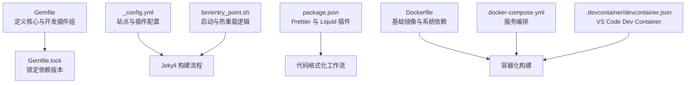
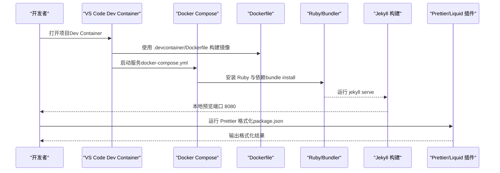
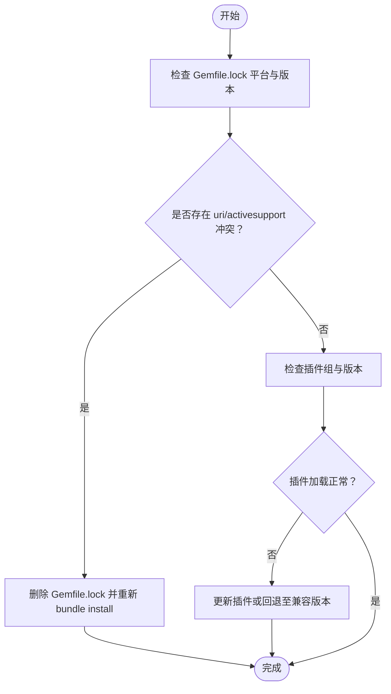
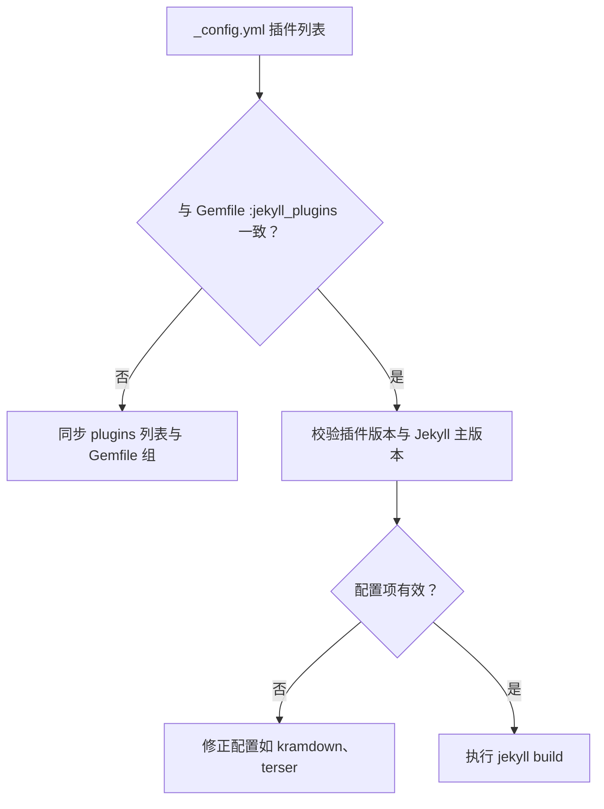
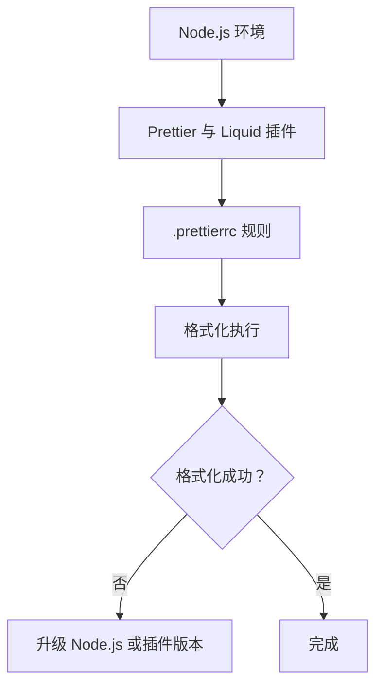
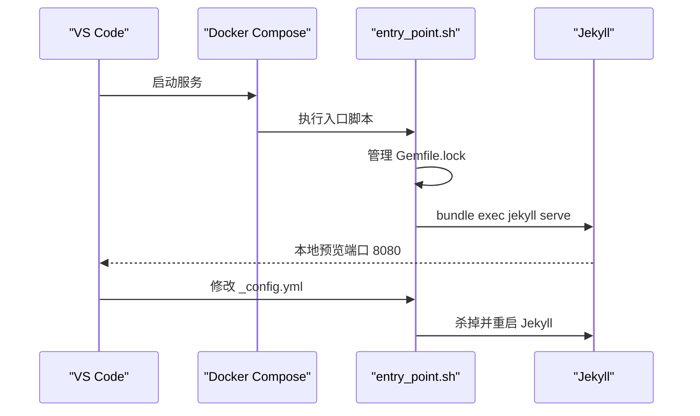
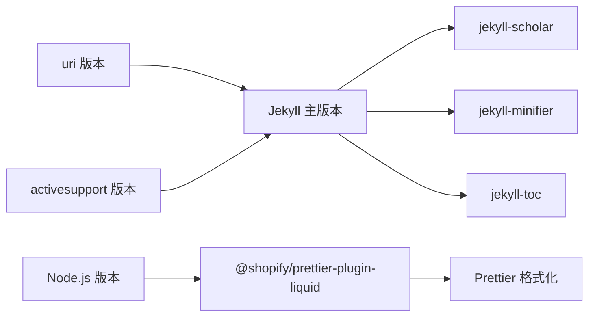

# 构建问题

<cite>
**本文引用的文件**
- [Gemfile](file://Gemfile)
- [_config.yml](file://_config.yml)
- [package.json](file://package.json)
- [Dockerfile](file://Dockerfile)
- [.devcontainer/Dockerfile](file://.devcontainer/Dockerfile)
- [TROUBLESHOOTING.md](file://TROUBLESHOOTING.md)
- [bin/entry_point.sh](file://bin/entry_point.sh)
- [docker-compose.yml](file://docker-compose.yml)
- [.devcontainer/devcontainer.json](file://.devcontainer/devcontainer.json)
- [Gemfile.lock](file://Gemfile.lock)
- [.prettierrc](file://.prettierrc)
- [FAQ.md](file://FAQ.md)
</cite>

## 目录
1. [简介](#简介)
2. [项目结构](#项目结构)
3. [核心组件](#核心组件)
4. [架构总览](#架构总览)
5. [详细组件分析](#详细组件分析)
6. [依赖关系分析](#依赖关系分析)
7. [性能考量](#性能考量)
8. [故障排除指南](#故障排除指南)
9. [结论](#结论)
10. [附录](#附录)

## 简介
本指南聚焦于本地构建问题的系统化排查与修复，覆盖以下常见场景：
- Ruby 版本与依赖兼容性问题
- Gem 依赖冲突（如 uri gem 版本冲突）
- Jekyll 插件加载错误
- Node.js 版本过旧导致的动作警告
- Prettier 代码格式化工作流失败
- Jekyll diagrams 插件弃用问题
同时提供依赖版本检查方法、具体错误堆栈分析思路、修复步骤，以及使用 Docker 容器化构建的替代方案。

## 项目结构
该 Jekyll 博客项目采用主题模板与多插件组合的方式组织内容，关键构建与运行相关文件如下：
- Ruby 依赖：Gemfile、Gemfile.lock
- 配置：_config.yml、.prettierrc
- 前端格式化：package.json（prettier 及其 Liquid 插件）
- 容器化：Dockerfile、docker-compose.yml、.devcontainer 相关文件
- 开发入口：bin/entry_point.sh
- 故障排除：TROUBLESHOOTING.md、FAQ.md

图表来源
- [Gemfile](file://Gemfile)
- [Gemfile.lock](file://Gemfile.lock)
- [_config.yml](file://_config.yml)
- [package.json](file://package.json)
- [Dockerfile](file://Dockerfile)
- [docker-compose.yml](file://docker-compose.yml)
- [.devcontainer/devcontainer.json](file://.devcontainer/devcontainer.json)
- [bin/entry_point.sh](file://bin/entry_point.sh)

章节来源
- [Gemfile](file://Gemfile)
- [_config.yml](file://_config.yml)
- [package.json](file://package.json)
- [Dockerfile](file://Dockerfile)
- [docker-compose.yml](file://docker-compose.yml)
- [.devcontainer/devcontainer.json](file://.devcontainer/devcontainer.json)
- [bin/entry_point.sh](file://bin/entry_point.sh)

## 核心组件
- Ruby 与 Bundler：通过 Gemfile 声明核心与开发插件，Gemfile.lock 锁定版本，确保可复现构建。
- Jekyll 配置：_config.yml 控制站点行为、插件启用、压缩与归档等。
- 前端格式化：package.json 指定 Prettier 与 @shopify/prettier-plugin-liquid；.prettierrc 提供格式化规则。
- 容器化：Dockerfile 安装 Ruby、Node.js、Imagemagick、Python3-pip 等系统依赖；docker-compose.yml 提供端口映射与卷挂载；.devcontainer 集成 VS Code 开发体验。
- 入口脚本：bin/entry_point.sh 负责管理 Gemfile.lock、启动 Jekyll 并监听配置变更自动重启。

章节来源
- [Gemfile](file://Gemfile)
- [Gemfile.lock](file://Gemfile.lock)
- [_config.yml](file://_config.yml)
- [package.json](file://package.json)
- [.prettierrc](file://.prettierrc)
- [Dockerfile](file://Dockerfile)
- [docker-compose.yml](file://docker-compose.yml)
- [.devcontainer/devcontainer.json](file://.devcontainer/devcontainer.json)
- [bin/entry_point.sh](file://bin/entry_point.sh)

## 架构总览
下图展示从本地或容器环境到 Jekyll 构建与前端格式化的整体流程：

图表来源
- [.devcontainer/devcontainer.json](file://.devcontainer/devcontainer.json)
- [Dockerfile](file://Dockerfile)
- [docker-compose.yml](file://docker-compose.yml)
- [Gemfile](file://Gemfile)
- [bin/entry_point.sh](file://bin/entry_point.sh)
- [package.json](file://package.json)

## 详细组件分析

### Ruby 与 Bundler 依赖管理
- Gemfile 将插件分为 :jekyll_plugins 与 :other_plugins 组，明确核心构建插件与外部数据获取类依赖。
- Gemfile.lock 记录了各平台的依赖版本与平台信息，是定位“uri gem 冲突”等兼容性问题的关键。
- 常见问题：
  - uri gem 版本冲突：当系统安装的 uri 与依赖要求不一致时，可能导致 require 失败或运行期异常。
  - 插件加载失败：若某插件缺失或版本不匹配，Jekyll 在初始化阶段会抛出加载错误。
- 排查要点：
  - 检查 Gemfile.lock 中 uri 与 activesupport 的版本范围是否满足。
  - 对比 Bundler 版本与 Gemfile.lock 的 BUNDLED WITH。
  - 清理 Gemfile.lock 后重新 bundle install，避免本地缓存干扰。

图表来源
- [Gemfile.lock](file://Gemfile.lock)
- [Gemfile](file://Gemfile)

章节来源
- [Gemfile](file://Gemfile)
- [Gemfile.lock](file://Gemfile.lock)

### Jekyll 配置与插件启用
- _config.yml 中 plugins 列表与 Gemfile 的 :jekyll_plugins 组需保持一致，否则会出现“插件未找到”或“加载失败”的错误。
- 关键配置项包括：
  - markdown、highlighter、kramdown 选项
  - include/exclude 列表
  - 插件组：jekyll-minifier、terser、jekyll-scholar、jekyll-archives 等
- 常见问题：
  - 插件未在 plugins 列表中声明
  - 插件版本与 Jekyll 主版本不兼容
  - 归档与压缩配置不当导致构建缓慢或失败

图表来源
- [_config.yml](file://_config.yml)
- [Gemfile](file://Gemfile)

章节来源
- [_config.yml](file://_config.yml)
- [Gemfile](file://Gemfile)

### Node.js 与 Prettier 代码格式化
- package.json 指定了 Prettier 与 @shopify/prettier-plugin-liquid。
- .prettierrc 提供插件、宽度与尾逗号等规则。
- 常见问题：
  - Node.js 版本过旧导致 Prettier 或插件无法加载
  - 未安装依赖或依赖版本不匹配
  - 与编辑器格式化设置冲突
- 排查要点：
  - 使用与容器一致的 Node.js 版本（Dockerfile 中已安装）
  - 在容器内运行 Prettier，避免宿主环境差异
  - 检查 .prettierrc 与编辑器默认格式化设置

图表来源
- [package.json](file://package.json)
- [.prettierrc](file://.prettierrc)
- [Dockerfile](file://Dockerfile)

章节来源
- [package.json](file://package.json)
- [.prettierrc](file://.prettierrc)
- [Dockerfile](file://Dockerfile)

### Jekyll diagrams 插件弃用问题
- FAQ 文档明确指出 jekyll-diagrams 支持已在特定 PR 中被移除，推荐改用 mermaid.js。
- 修复步骤：
  - 更新模板至最新版本，替换 diagrams 相关语法为 mermaid
  - 确保 _config.yml 中未再引用 jekyll-diagrams

章节来源
- [FAQ.md](file://FAQ.md)
- [_config.yml](file://_config.yml)

### 容器化构建与入口脚本
- Dockerfile 安装 Ruby、Node.js、Imagemagick、Python3-pip 等系统依赖，并设置环境变量与工作目录。
- docker-compose.yml 提供端口映射与卷挂载，便于本地开发。
- .devcontainer/devcontainer.json 集成 VS Code，自动运行 entry_point.sh。
- bin/entry_point.sh：
  - 管理 Gemfile.lock（根据是否被 Git 跟踪决定保留或删除）
  - 启动 Jekyll 服务并开启监听，支持热重载
  - 监控 _config.yml 变更后自动重启

图表来源
- [docker-compose.yml](file://docker-compose.yml)
- [bin/entry_point.sh](file://bin/entry_point.sh)
- [Dockerfile](file://Dockerfile)
- [.devcontainer/devcontainer.json](file://.devcontainer/devcontainer.json)

章节来源
- [Dockerfile](file://Dockerfile)
- [docker-compose.yml](file://docker-compose.yml)
- [.devcontainer/devcontainer.json](file://.devcontainer/devcontainer.json)
- [bin/entry_point.sh](file://bin/entry_point.sh)

## 依赖关系分析
- Ruby 生态链：Jekyll 主版本与各插件版本存在约束关系；uri 与 activesupport 的版本范围需满足。
- 平台差异：Gemfile.lock 包含多平台信息，跨平台构建需注意平台匹配。
- 前端生态链：Prettier 与 Liquid 插件对 Node.js 版本敏感，建议在容器内统一执行。

图表来源
- [Gemfile.lock](file://Gemfile.lock)
- [Gemfile](file://Gemfile)
- [package.json](file://package.json)

章节来源
- [Gemfile.lock](file://Gemfile.lock)
- [Gemfile](file://Gemfile)
- [package.json](file://package.json)

## 性能考量
- 构建性能受插件数量与复杂度影响，建议仅启用必要插件。
- 压缩与归档配置（如 jekyll-minifier、terser、jekyll-archives）会影响构建时间，按需调整。
- 使用容器化可减少宿主环境差异带来的性能波动。

## 故障排除指南

### Ruby 版本与依赖兼容性问题
- 现象：require uri 失败、activesupport 版本不匹配、bundle install 报错。
- 排查步骤：
  - 检查 Gemfile.lock 中 uri 与 activesupport 的版本范围
  - 对比 Bundler 版本与 BUNDLED WITH
  - 删除 Gemfile.lock 后重新 bundle install
- 参考来源
  - [Gemfile.lock](file://Gemfile.lock)
  - [Gemfile](file://Gemfile)

章节来源
- [Gemfile.lock](file://Gemfile.lock)
- [Gemfile](file://Gemfile)

### Gem 依赖冲突（如 uri gem 版本冲突）
- 现象：构建时报错提示 uri gem 版本冲突或加载失败。
- 修复步骤：
  - 清理 Gemfile.lock 并重新安装依赖
  - 固定 uri 与 activesupport 版本以满足 Jekyll 与插件需求
- 参考来源
  - [Gemfile.lock](file://Gemfile.lock)
  - [Gemfile](file://Gemfile)

章节来源
- [Gemfile.lock](file://Gemfile.lock)
- [Gemfile](file://Gemfile)

### Jekyll 插件加载错误
- 现象：Jekyll 初始化时报“插件未找到”或“加载失败”。
- 修复步骤：
  - 确保 _config.yml 的 plugins 列表与 Gemfile 的 :jekyll_plugins 组一致
  - 更新插件版本或回退至与 Jekyll 主版本兼容的版本
- 参考来源
  - [_config.yml](file://_config.yml)
  - [Gemfile](file://Gemfile)

章节来源
- [_config.yml](file://_config.yml)
- [Gemfile](file://Gemfile)

### Node.js 版本过旧导致的动作警告
- 现象：Prettier 或 Liquid 插件在旧版 Node.js 下报错或警告。
- 修复步骤：
  - 在容器内运行 Prettier，确保 Node.js 版本与 Dockerfile 一致
  - 或升级宿主 Node.js 至容器镜像中的版本
- 参考来源
  - [Dockerfile](file://Dockerfile)
  - [package.json](file://package.json)

章节来源
- [Dockerfile](file://Dockerfile)
- [package.json](file://package.json)

### Prettier 代码格式化工作流失败
- 现象：本地或 CI 中 Prettier 格式化失败。
- 修复步骤：
  - 在容器内执行 Prettier，避免宿主环境差异
  - 检查 .prettierrc 与编辑器默认格式化设置
  - 确认 @shopify/prettier-plugin-liquid 已安装且版本兼容
- 参考来源
  - [package.json](file://package.json)
  - [.prettierrc](file://.prettierrc)

章节来源
- [package.json](file://package.json)
- [.prettierrc](file://.prettierrc)

### Jekyll diagrams 插件弃用问题
- 现象：构建时报“找不到 jekyll-diagrams”或弃用警告。
- 修复步骤：
  - 升级模板至最新版本，替换 diagrams 语法为 mermaid
  - 确保 _config.yml 中不再引用 jekyll-diagrams
- 参考来源
  - [FAQ.md](file://FAQ.md)
  - [_config.yml](file://_config.yml)

章节来源
- [FAQ.md](file://FAQ.md)
- [_config.yml](file://_config.yml)

### Docker 容器化构建替代方案
- 使用 docker-compose.yml 启动服务，端口映射 8080 与 35729，卷挂载当前目录到 /srv/jekyll。
- .devcontainer/devcontainer.json 集成 VS Code，自动运行 entry_point.sh，实现热重载与本地预览。
- Dockerfile 安装 Ruby、Node.js、Imagemagick、Python3-pip 等系统依赖，避免宿主环境差异。
- 参考来源
  - [docker-compose.yml](file://docker-compose.yml)
  - [.devcontainer/devcontainer.json](file://.devcontainer/devcontainer.json)
  - [Dockerfile](file://Dockerfile)
  - [bin/entry_point.sh](file://bin/entry_point.sh)

章节来源
- [docker-compose.yml](file://docker-compose.yml)
- [.devcontainer/devcontainer.json](file://.devcontainer/devcontainer.json)
- [Dockerfile](file://Dockerfile)
- [bin/entry_point.sh](file://bin/entry_point.sh)

## 结论
本地构建问题通常源于 Ruby 与 Node.js 版本不匹配、依赖冲突、插件配置不一致或弃用功能未迁移。通过锁定依赖版本、在容器内统一执行、严格对照配置清单与插件组，可显著降低构建失败概率。遇到弃用功能（如 jekyll-diagrams），应尽快迁移至推荐方案（如 mermaid.js）。

## 附录
- 快速检查清单
  - Ruby：确认 Bundler 版本与 Gemfile.lock 一致，清理并重建 Gemfile.lock
  - Node.js：在容器内运行 Prettier，确保版本一致
  - 插件：_config.yml 与 Gemfile 的 :jekyll_plugins 保持一致
  - 弃用功能：迁移 diagrams 至 mermaid
  - 容器：使用 docker-compose.yml 与 .devcontainer/devcontainer.json