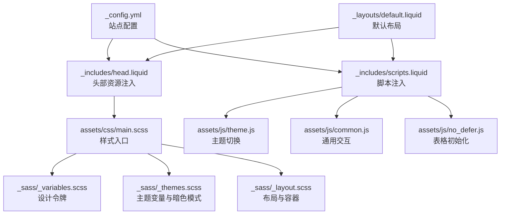
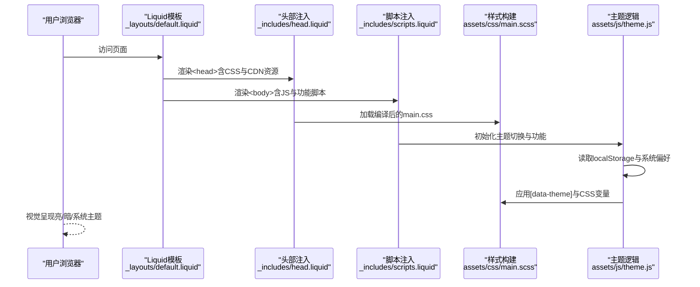
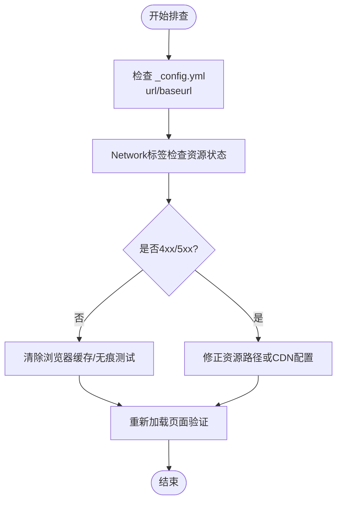
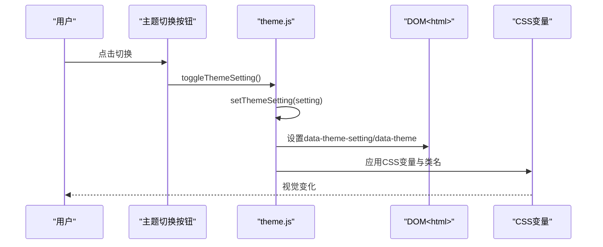
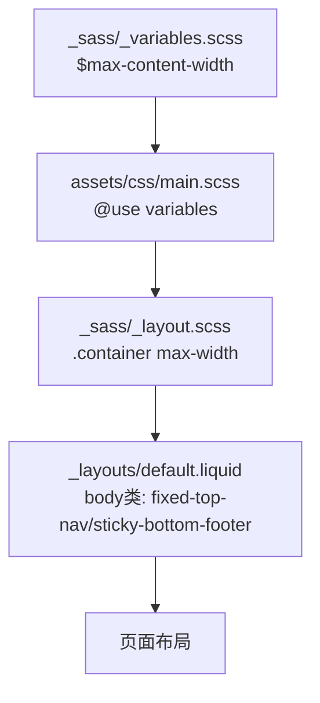
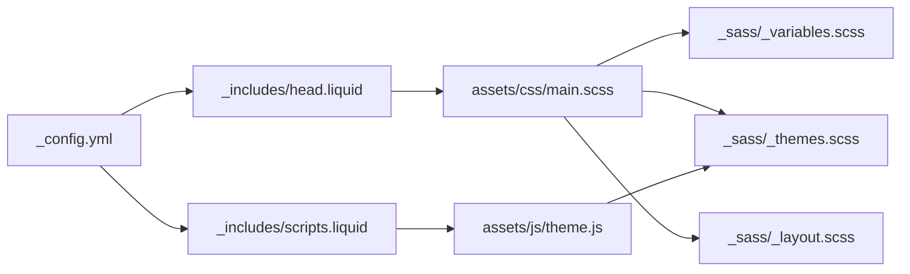

# 样式布局问题

<cite>
**本文档引用的文件**
- [_config.yml](file://_config.yml)
- [TROUBLESHOOTING.md](file://TROUBLESHOOTING.md)
- [README.md](file://README.md)
- [assets/css/main.scss](file://assets/css/main.scss)
- [assets/js/theme.js](file://assets/js/theme.js)
- [assets/js/common.js](file://assets/js/common.js)
- [_includes/head.liquid](file://_includes/head.liquid)
- [_layouts/default.liquid](file://_layouts/default.liquid)
- [_sass/_variables.scss](file://_sass/_variables.scss)
- [_sass/_themes.scss](file://_sass/_themes.scss)
- [_sass/_layout.scss](file://_sass/_layout.scss)
- [_includes/scripts.liquid](file://_includes/scripts.liquid)
- [assets/js/no_defer.js](file://assets/js/no_defer.js)
</cite>

## 目录
1. [简介](#简介)
2. [项目结构](#项目结构)
3. [核心组件](#核心组件)
4. [架构总览](#架构总览)
5. [详细组件分析](#详细组件分析)
6. [依赖关系分析](#依赖关系分析)
7. [性能考虑](#性能考虑)
8. [故障排除指南](#故障排除指南)
9. [结论](#结论)
10. [附录](#附录)

## 简介
本指南聚焦于样式与布局相关的问题排查，覆盖以下场景：
- CSS 和 JavaScript 资源加载失败
- 主题样式不生效
- 页面布局错乱
- 链接失效
- 基于 baseurl 与 url 的资源路径问题
- 浏览器缓存导致样式未更新
- 响应式布局在不同设备上的显示问题

目标是提供可操作的配置检查清单、浏览器调试方法与样式重载方案。

## 项目结构
该站点基于 Jekyll 模板（al-folio），采用 Liquid 模板语言与 SCSS/Sass 构建样式体系，并通过第三方库 CDN 引入前端功能模块。关键目录与文件如下：
- 配置：_config.yml
- 样式入口：assets/css/main.scss
- 样式变量与主题：_sass/_variables.scss、_sass/_themes.scss、_sass/_layout.scss
- 头部与脚本注入：_includes/head.liquid、_includes/scripts.liquid
- 默认布局：_layouts/default.liquid
- 主题切换逻辑：assets/js/theme.js
- 公共脚本与表格初始化：assets/js/common.js、assets/js/no_defer.js

图表来源
- [_config.yml](file://_config.yml)
- [_includes/head.liquid](file://_includes/head.liquid)
- [_includes/scripts.liquid](file://_includes/scripts.liquid)
- [assets/css/main.scss](file://assets/css/main.scss)
- [_sass/_variables.scss](file://_sass/_variables.scss)
- [_sass/_themes.scss](file://_sass/_themes.scss)
- [_sass/_layout.scss](file://_sass/_layout.scss)
- [assets/js/theme.js](file://assets/js/theme.js)
- [assets/js/common.js](file://assets/js/common.js)
- [assets/js/no_defer.js](file://assets/js/no_defer.js)
- [_layouts/default.liquid](file://_layouts/default.liquid)

章节来源
- [_config.yml](file://_config.yml)
- [assets/css/main.scss](file://assets/css/main.scss)
- [_sass/_variables.scss](file://_sass/_variables.scss)
- [_sass/_themes.scss](file://_sass/_themes.scss)
- [_sass/_layout.scss](file://_sass/_layout.scss)
- [_includes/head.liquid](file://_includes/head.liquid)
- [_includes/scripts.liquid](file://_includes/scripts.liquid)
- [_layouts/default.liquid](file://_layouts/default.liquid)
- [assets/js/theme.js](file://assets/js/theme.js)
- [assets/js/common.js](file://assets/js/common.js)
- [assets/js/no_defer.js](file://assets/js/no_defer.js)

## 核心组件
- 站点配置与路径
  - url/baseurl：决定资源绝对路径与子路径部署
  - 第三方库版本与完整性校验
- 样式系统
  - SCSS 分层组织（变量、主题、布局、组件）
  - 设计令牌统一管理最大宽度、颜色等
- 主题切换
  - 本地存储主题设置，动态应用到 DOM 属性与 CSS 变量
  - 同步多种可视化库的主题
- 资源注入
  - 头部按需引入 CSS（含高亮、字体、第三方库）
  - 脚本按需引入 JS（含图表、搜索、分析等）

章节来源
- [_config.yml](file://_config.yml)
- [assets/css/main.scss](file://assets/css/main.scss)
- [_sass/_variables.scss](file://_sass/_variables.scss)
- [_sass/_themes.scss](file://_sass/_themes.scss)
- [_sass/_layout.scss](file://_sass/_layout.scss)
- [_includes/head.liquid](file://_includes/head.liquid)
- [_includes/scripts.liquid](file://_includes/scripts.liquid)
- [assets/js/theme.js](file://assets/js/theme.js)

## 架构总览
下图展示从配置到渲染的关键流程：站点配置驱动资源注入，SCSS 编译生成 CSS，JS 在运行时根据主题设置动态调整界面与第三方组件。

图表来源
- [_layouts/default.liquid](file://_layouts/default.liquid)
- [_includes/head.liquid](file://_includes/head.liquid)
- [_includes/scripts.liquid](file://_includes/scripts.liquid)
- [assets/css/main.scss](file://assets/css/main.scss)
- [assets/js/theme.js](file://assets/js/theme.js)

## 详细组件分析

### 组件A：CSS与JS资源加载失败
- 常见原因
  - url/baseurl 配置错误导致相对路径解析异常
  - CDN 资源跨域或网络不可达
  - 缓存导致旧资源未更新
- 排查步骤
  - 检查 _config.yml 中 url/baseurl 是否与部署环境一致
  - 使用浏览器开发者工具 Network 标签查看 4xx/5xx 错误
  - 清除浏览器缓存或使用无痕模式验证
  - 若使用自定义域名，确认 CNAME 文件与 DNS 设置正确
- 解决方案
  - 修正 url/baseurl 并重新构建/部署
  - 如需离线使用，可在 _config.yml 中启用 third_party_libraries.download
  - 对于高亮主题，确保 id 与媒体查询匹配（见 head 注入）

图表来源
- [_config.yml](file://_config.yml)
- [_includes/head.liquid](file://_includes/head.liquid)
- [TROUBLESHOOTING.md](file://TROUBLESHOOTING.md)

章节来源
- [_config.yml](file://_config.yml)
- [_includes/head.liquid](file://_includes/head.liquid)
- [TROUBLESHOOTING.md](file://TROUBLESHOOTING.md)

### 组件B：主题样式不生效
- 原因
  - 未正确设置主题（localStorage 或系统偏好）
  - CSS 变量未被正确应用到根元素
  - 高亮主题与当前主题不匹配
- 排查步骤
  - 打开开发者工具 Elements，检查 html 上是否存在 data-theme 与 data-theme-setting
  - 检查 :root 与 html[data-theme="..."] 的 CSS 变量是否生效
  - 切换主题按钮是否触发 theme.js 的 setThemeSetting/initTheme
- 解决方案
  - 确保 theme.js 正常加载并在 DOMContentLoaded 后初始化
  - 检查 _sass/_themes.scss 中变量映射与 CSS 使用的一致性
  - 验证高亮主题 id 与媒体查询（如 highlight_theme_light/dark）是否正确

图表来源
- [assets/js/theme.js](file://assets/js/theme.js)
- [_sass/_themes.scss](file://_sass/_themes.scss)
- [_includes/head.liquid](file://_includes/head.liquid)

章节来源
- [assets/js/theme.js](file://assets/js/theme.js)
- [_sass/_themes.scss](file://_sass/_themes.scss)
- [_includes/head.liquid](file://_includes/head.liquid)

### 组件C：页面布局错乱
- 原因
  - 容器最大宽度未生效（$max-content-width）
  - 固定导航与底部留白冲突
  - Bootstrap 栅格使用不当
- 排查步骤
  - 检查 _sass/_variables.scss 中 $max-content-width 是否被 main.scss 使用
  - 检查 _sass/_layout.scss 中 .container 最大宽度与 body.padding
  - 检查 _layouts/default.liquid 中 fixed-top-nav 与 sticky-bottom-footer 类
- 解决方案
  - 确认 main.scss 中 @use "variables" with (...) 已传入 max-width
  - 调整布局类以适配内容区域与页脚固定需求

图表来源
- [_sass/_variables.scss](file://_sass/_variables.scss)
- [assets/css/main.scss](file://assets/css/main.scss)
- [_sass/_layout.scss](file://_sass/_layout.scss)
- [_layouts/default.liquid](file://_layouts/default.liquid)

章节来源
- [_sass/_variables.scss](file://_sass/_variables.scss)
- [assets/css/main.scss](file://assets/css/main.scss)
- [_sass/_layout.scss](file://_sass/_layout.scss)
- [_layouts/default.liquid](file://_layouts/default.liquid)

### 组件D：链接失效
- 原因
  - baseurl 未设置或与仓库名不一致
  - 相对链接在子路径部署中解析错误
- 排查步骤
  - 在 _config.yml 中确认 url/baseurl 与实际部署路径一致
  - 使用 Liquid 的 relative_url/absolute_url 进行链接拼接
- 解决方案
  - 个人站点：baseurl 留空；项目站点：baseurl 与仓库名一致
  - 使用 Liquid 过滤器保证路径正确

章节来源
- [_config.yml](file://_config.yml)
- [_includes/head.liquid](file://_includes/head.liquid)
- [_layouts/default.liquid](file://_layouts/default.liquid)

### 组件E：响应式布局问题
- 原因
  - Bootstrap 栅格未正确使用
  - 移动端字体大小、间距未优化
- 排查步骤
  - 检查容器与列类的使用是否符合 Bootstrap 约定
  - 使用浏览器设备模拟器测试断点表现
- 解决方案
  - 遵循 Bootstrap 栅格规范，合理使用 sm/md/lg/xl 断点
  - 在 _sass/_layout.scss 中补充移动端细节样式

章节来源
- [_sass/_layout.scss](file://_sass/_layout.scss)
- [_includes/scripts.liquid](file://_includes/scripts.liquid)

## 依赖关系分析
- 配置驱动资源注入
  - _config.yml 决定 url/baseurl 与第三方库版本
  - _includes/head.liquid 与 _includes/scripts.liquid 按配置动态输出资源
- 样式分层
  - main.scss 组织导入各模块，变量与主题先行
- 运行时联动
  - theme.js 读取系统偏好与本地设置，同步 CSS 变量与第三方组件主题

图表来源
- [_config.yml](file://_config.yml)
- [_includes/head.liquid](file://_includes/head.liquid)
- [_includes/scripts.liquid](file://_includes/scripts.liquid)
- [assets/css/main.scss](file://assets/css/main.scss)
- [_sass/_variables.scss](file://_sass/_variables.scss)
- [_sass/_themes.scss](file://_sass/_themes.scss)
- [_sass/_layout.scss](file://_sass/_layout.scss)
- [assets/js/theme.js](file://assets/js/theme.js)

章节来源
- [_config.yml](file://_config.yml)
- [_includes/head.liquid](file://_includes/head.liquid)
- [_includes/scripts.liquid](file://_includes/scripts.liquid)
- [assets/css/main.scss](file://assets/css/main.scss)
- [_sass/_variables.scss](file://_sass/_variables.scss)
- [_sass/_themes.scss](file://_sass/_themes.scss)
- [_sass/_layout.scss](file://_sass/_layout.scss)
- [assets/js/theme.js](file://assets/js/theme.js)

## 性能考虑
- 资源压缩与懒加载
  - jekyll-minifier 与 terser 已启用，注意排除列表与压缩策略
  - 图片懒加载与响应式 WebP 已开启，减少带宽占用
- 样式与脚本加载
  - defer 与 module 使用提升首屏渲染
  - 按需引入第三方库，避免不必要的资源加载

章节来源
- [_config.yml](file://_config.yml)
- [_includes/scripts.liquid](file://_includes/scripts.liquid)

## 故障排除指南

### 快速检查清单
- 路径与部署
  - url/baseurl 是否与实际访问一致
  - 子路径部署时 baseurl 与仓库名一致
  - 自定义域名已写入 CNAME 并生效
- 资源可用性
  - Network 标签无 4xx/5xx
  - CDN 资源可访问且 integrity 校验通过
- 主题与样式
  - html 上存在 data-theme 与 data-theme-setting
  - CSS 变量映射正确，高亮主题 id 与媒体查询匹配
- 响应式
  - 栅格类使用正确，断点测试通过

章节来源
- [TROUBLESHOOTING.md](file://TROUBLESHOOTING.md)
- [_config.yml](file://_config.yml)
- [_includes/head.liquid](file://_includes/head.liquid)
- [assets/js/theme.js](file://assets/js/theme.js)

### 浏览器调试方法
- 打开开发者工具
  - Elements：检查 data-theme 与 CSS 变量
  - Network：定位资源加载失败与缓存问题
  - Console：查看 JS 报错与初始化日志
- 无痕/隐私窗口复现
  - 排除浏览器缓存影响，验证最新构建效果

章节来源
- [TROUBLESHOOTING.md](file://TROUBLESHOOTING.md)

### 样式重载与缓存处理
- 强制刷新
  - Windows/Linux: Ctrl+Shift+R
  - macOS: Cmd+Shift+R 或 Cmd+R
- 清理缓存
  - 清空浏览器缓存或使用无痕窗口
- 等待静态托管更新
  - GitHub Pages 等平台可能需要几分钟生效

章节来源
- [TROUBLESHOOTING.md](file://TROUBLESHOOTING.md)

### 常见问题与修复
- CSS/JS 不加载
  - 检查 url/baseurl 与 relative_url/absolute_url 使用
  - 确认 CDN 可达与 integrity 校验
- 主题颜色不生效
  - 确保 theme.js 成功初始化
  - 检查 :root 与 html[data-theme] 变量映射
- 布局错乱
  - 检查 .container 最大宽度与 body padding
  - 确认固定导航与底部留白类的组合
- 链接失效
  - 修正 baseurl 或使用 Liquid 过滤器
- 响应式异常
  - 使用 Bootstrap 栅格规范，测试多设备断点

章节来源
- [TROUBLESHOOTING.md](file://TROUBLESHOOTING.md)
- [_config.yml](file://_config.yml)
- [_sass/_layout.scss](file://_sass/_layout.scss)
- [_includes/head.liquid](file://_includes/head.liquid)
- [assets/js/theme.js](file://assets/js/theme.js)

## 结论
样式与布局问题通常由三类因素引发：配置错误（url/baseurl）、资源加载失败（CDN/缓存）、主题与变量未正确应用。通过本指南的检查清单与调试方法，可快速定位并修复问题。建议在修改配置后进行多设备与多浏览器验证，并结合缓存清理与强制刷新确保变更生效。

## 附录

### 配置与路径参考
- 站点基础信息与部署路径
  - url: https://MingyuLi.com
  - baseurl: 空（个人站点）
- 第三方库版本与完整性校验
  - 通过 third_party_libraries 字段统一管理
- 样式与脚本缓存策略
  - bust_file_cache/bust_css_cache 用于绕过缓存

章节来源
- [_config.yml](file://_config.yml)