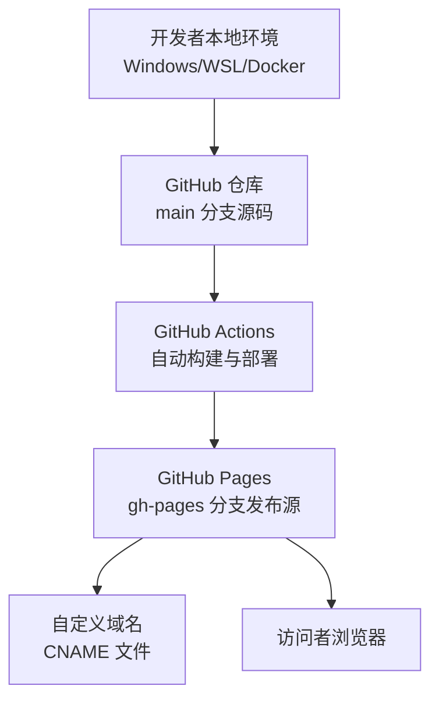
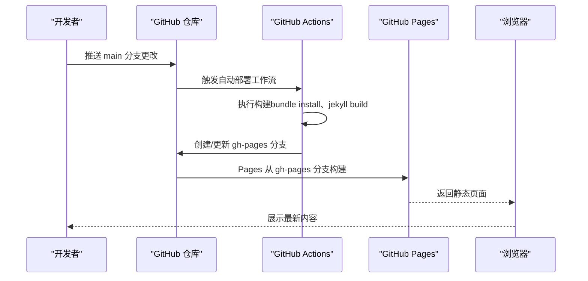
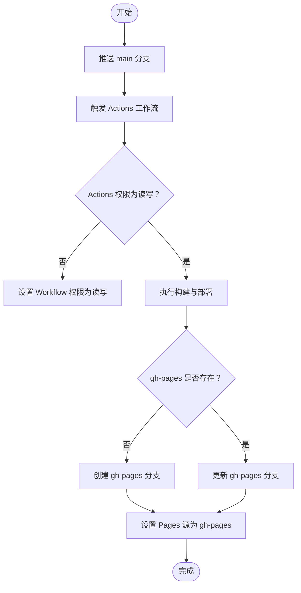
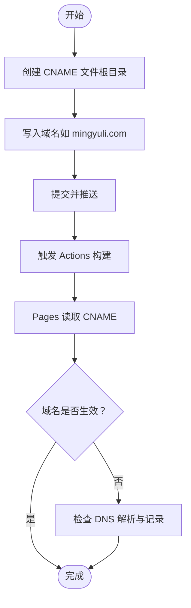
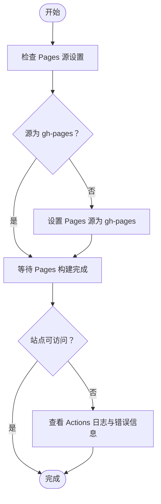
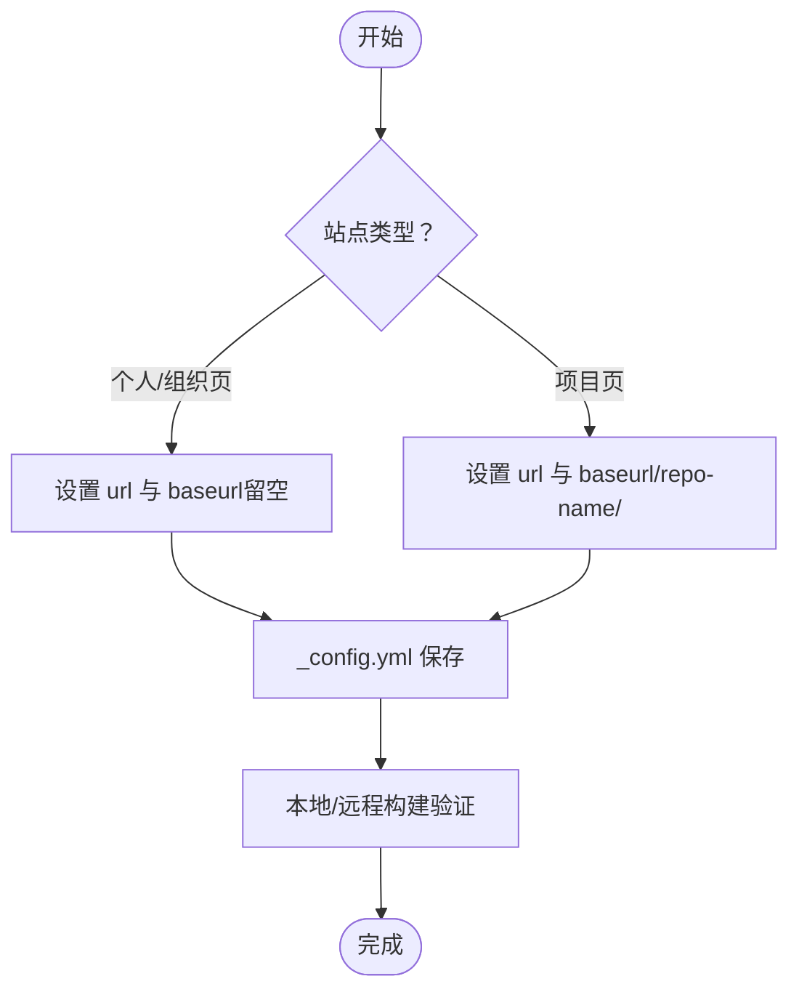
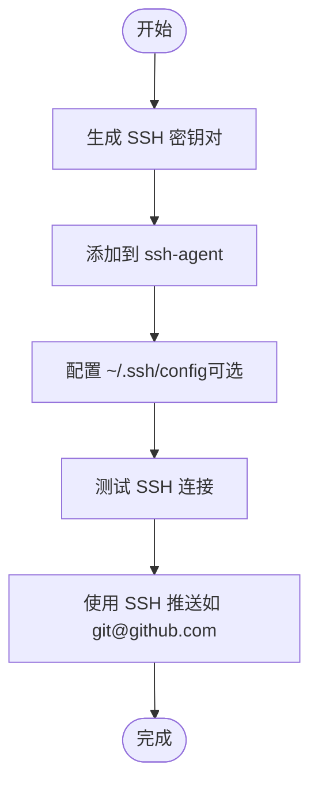
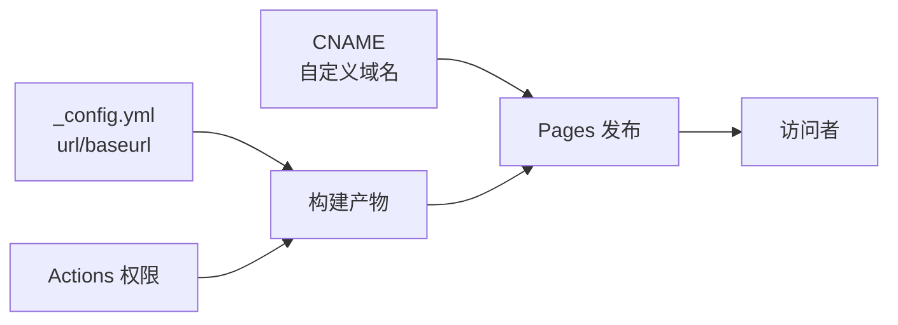

# 部署问题

<cite>
**本文引用的文件**
- [README.md](file://README.md)
- [INSTALL.md](file://INSTALL.md)
- [QUICKSTART.md](file://QUICKSTART.md)
- [_config.yml](file://_config.yml)
- [TROUBLESHOOTING.md](file://TROUBLESHOOTING.md)
- [CNAME](file://CNAME)
- [.github/GIT_WORKFLOW.md](file://.github/GIT_WORKFLOW.md)
- [.github/release.yml](file://.github/release.yml)
</cite>

## 目录
1. [简介](#简介)
2. [项目结构](#项目结构)
3. [核心组件](#核心组件)
4. [架构总览](#架构总览)
5. [详细组件分析](#详细组件分析)
6. [依赖关系分析](#依赖关系分析)
7. [性能考虑](#性能考虑)
8. [故障排除指南](#故障排除指南)
9. [结论](#结论)
10. [附录](#附录)

## 简介
本指南聚焦于 GitHub Pages 部署问题的系统化排查与解决，覆盖首次部署失败、自定义域名配置问题（CNAME 文件缺失导致域名重置）、部署分支设置错误（未设置 gh-pages 分支）、GitHub Actions 工作流配置问题、SSH 认证失败（密码认证已禁用）、以及部署权限和令牌配置问题。同时提供手动部署与自动部署两种场景的处理方法，并给出可操作的诊断步骤与完整解决方案。

## 项目结构
该仓库为基于 Jekyll 的学术主题网站，采用模板方式创建，支持本地开发与 GitHub Pages 自动部署。关键部署相关文件与位置如下：
- 自动部署工作流：位于 Actions 中（无需手动创建工作流文件）
- 配置文件：站点基础配置在 _config.yml，自定义域名通过根目录 CNAME 文件声明
- 快速开始与安装说明：分别在 QUICKSTART.md 与 INSTALL.md
- 故障排除：TROUBLESHOOTING.md 提供常见问题与解决方案
- 提交规范：.github/GIT_WORKFLOW.md 规范提交消息格式
- 发布变更日志：.github/release.yml 控制发布类别

图示来源
- [INSTALL.md: 自动部署流程:174-182](file://INSTALL.md#L174-L182)
- [QUICKSTART.md: 设置 Pages 源为 gh-pages:58-62](file://QUICKSTART.md#L58-L62)
- [CNAME: 自定义域名文件:1-2](file://CNAME#L1-L2)

章节来源
- [INSTALL.md: 自动部署与 Pages 源设置:174-182](file://INSTALL.md#L174-L182)
- [QUICKSTART.md: 部署与 Pages 源选择:58-62](file://QUICKSTART.md#L58-L62)
- [README.md: Actions 工作流徽章](file://README.md#L11)

## 核心组件
- 站点配置（_config.yml）：决定站点 URL、baseurl、插件与功能开关等
- 自定义域名（CNAME）：根目录声明自定义域名，确保部署后不被重置
- GitHub Actions：自动触发构建与部署，生成 gh-pages 分支用于 Pages 发布
- GitHub Pages：从 gh-pages 分支发布静态页面
- 提交与工作流规范：.github/GIT_WORKFLOW.md 与 .github/release.yml

章节来源
- [_config.yml: 站点与 Pages 相关配置:20-24](file://_config.yml#L20-L24)
- [CNAME: 域名文件:1-2](file://CNAME#L1-L2)
- [INSTALL.md: 自动部署与 gh-pages 设置:174-182](file://INSTALL.md#L174-L182)
- [.github/GIT_WORKFLOW.md: 提交规范:1-48](file://.github/GIT_WORKFLOW.md#L1-L48)
- [.github/release.yml: 发布分类:1-15](file://.github/release.yml#L1-L15)

## 架构总览
下图展示从源码到用户访问的端到端路径，强调自动部署与 Pages 发布的关键节点。

图示来源
- [INSTALL.md: 自动部署与 gh-pages 流程:174-182](file://INSTALL.md#L174-L182)
- [QUICKSTART.md: 部署与 Pages 源设置:58-62](file://QUICKSTART.md#L58-L62)

## 详细组件分析

### 组件一：自动部署工作流（GitHub Actions）
- 触发条件：推送至 main 分支或发起 Pull Request（默认已配置）
- 权限要求：需要将 Actions 工作流权限设为“读取和写入”
- 输出：自动生成 gh-pages 分支作为 Pages 发布源
- 常见问题：工作流无权限、分支源设置错误、构建失败

图示来源
- [INSTALL.md: 启用 Actions 并设置权限:174-182](file://INSTALL.md#L174-L182)
- [QUICKSTART.md: 设置 Pages 源为 gh-pages:58-62](file://QUICKSTART.md#L58-L62)

章节来源
- [INSTALL.md: 自动部署与 gh-pages 设置:174-182](file://INSTALL.md#L174-L182)
- [QUICKSTART.md: 部署与 Pages 源选择:58-62](file://QUICKSTART.md#L58-L62)

### 组件二：自定义域名与 CNAME 文件
- 域名持久化：必须在仓库根目录创建 CNAME 文件，内容为一行域名
- 常见问题：CNAME 缺失导致域名在后续部署中被重置为空
- DNS 配置：需在域名提供商处添加 CNAME 记录指向 username.github.io

图示来源
- [TROUBLESHOOTING.md: 自定义域名重置问题:59-71](file://TROUBLESHOOTING.md#L59-L71)
- [CNAME: 示例文件内容:1-2](file://CNAME#L1-L2)

章节来源
- [TROUBLESHOOTING.md: 自定义域名问题:59-71](file://TROUBLESHOOTING.md#L59-L71)
- [CNAME: 域名文件:1-2](file://CNAME#L1-L2)

### 组件三：部署分支与 Pages 源设置
- Pages 源必须设置为 gh-pages（非 main），否则无法正确发布
- 自动部署会生成 gh-pages 分支；若未出现，检查 Actions 权限与触发条件
- 若 Pages 源仍显示空或无效，请重新保存 Pages 设置

图示来源
- [QUICKSTART.md: 设置 Pages 源为 gh-pages:58-62](file://QUICKSTART.md#L58-L62)
- [INSTALL.md: gh-pages 作为发布源:174-182](file://INSTALL.md#L174-L182)

章节来源
- [QUICKSTART.md: Pages 源设置:58-62](file://QUICKSTART.md#L58-L62)
- [INSTALL.md: gh-pages 发布源说明:174-182](file://INSTALL.md#L174-L182)

### 组件四：站点配置（URL 与 Baseurl）
- 个人/组织页：url 应为 https://username.github.io，baseurl 留空（不要删除）
- 项目页：url 为 https://username.github.io，baseurl 为 /repo-name/
- 错误的 baseurl 会导致资源路径错误，表现为样式丢失或链接失效

图示来源
- [INSTALL.md: 个人与项目页配置要点:159-173](file://INSTALL.md#L159-L173)
- [TROUBLESHOOTING.md: url/baseurl 导致样式问题:146-174](file://TROUBLESHOOTING.md#L146-L174)

章节来源
- [INSTALL.md: 个人与项目页配置:159-173](file://INSTALL.md#L159-L173)
- [TROUBLESHOOTING.md: url/baseurl 问题:146-174](file://TROUBLESHOOTING.md#L146-L174)

### 组件五：SSH 认证与密钥配置（手动部署场景）
- 使用 SSH 克隆与推送时，若密码认证被禁用，需配置 SSH 密钥
- 常见问题：权限不足、密钥未添加到 ssh-agent、主机指纹校验失败
- 处理建议：生成新密钥、添加到 ssh-agent、配置 ~/.ssh/config、测试连接

图示来源
- [INSTALL.md: 使用 SSH 推送（参考说明）:60-63](file://INSTALL.md#L60-L63)

章节来源
- [INSTALL.md: SSH 推送参考:60-63](file://INSTALL.md#L60-L63)

## 依赖关系分析
- 自动部署依赖 Actions 工作流权限与 gh-pages 分支存在
- Pages 发布依赖 gh-pages 作为发布源
- 自定义域名依赖 CNAME 文件与正确的 DNS 记录
- 资源路径依赖 _config.yml 中 url 与 baseurl 正确配置

图示来源
- [_config.yml: url/baseurl:20-24](file://_config.yml#L20-L24)
- [CNAME: 域名文件:1-2](file://CNAME#L1-L2)
- [INSTALL.md: 自动部署与 gh-pages:174-182](file://INSTALL.md#L174-L182)

章节来源
- [_config.yml: 站点配置:20-24](file://_config.yml#L20-L24)
- [CNAME: 域名文件:1-2](file://CNAME#L1-L2)
- [INSTALL.md: 自动部署流程:174-182](file://INSTALL.md#L174-L182)

## 性能考虑
- 减少不必要的构建时间：仅推送必要文件，避免大体积资源频繁变动
- 使用缓存策略：在 Actions 中启用缓存（如 Ruby gem 缓存）
- 资源优化：压缩 CSS/JS、延迟加载图片、合理使用 CDN
- 避免重复构建：确认 Pages 源设置正确，减少失败重试

## 故障排除指南

### 场景一：首次部署失败
- 症状：Actions 显示构建失败或 Pages 无法访问
- 诊断步骤：
  1) 在 Actions 标签页查看具体错误信息
  2) 确认已按 QUICKSTART.md 设置 Actions 权限为“读取和写入”
  3) 检查 _config.yml 的 url 与 baseurl 是否符合个人/项目页要求
  4) 推送微小改动以触发重新部署
- 解决方案：
  - 修正配置后再次推送
  - 等待约 5 分钟让 Pages 生效

章节来源
- [TROUBLESHOOTING.md: 部署失败排查:38-51](file://TROUBLESHOOTING.md#L38-L51)
- [QUICKSTART.md: 设置 Actions 权限:35-40](file://QUICKSTART.md#L35-L40)
- [INSTALL.md: 个人/项目页配置:159-173](file://INSTALL.md#L159-L173)

### 场景二：自定义域名配置问题（CNAME 文件缺失导致域名重置）
- 症状：设置自定义域名后，部署后域名被重置为空
- 诊断步骤：
  1) 确认仓库根目录存在 CNAME 文件
  2) 检查 CNAME 内容是否为单行域名（例如 mingyuli.com）
  3) 检查 DNS 是否正确添加 CNAME 记录指向 username.github.io
- 解决方案：
  - 在根目录创建 CNAME 文件并写入域名
  - 提交并推送后等待 Pages 重建

章节来源
- [TROUBLESHOOTING.md: 自定义域名重置:59-71](file://TROUBLESHOOTING.md#L59-L71)
- [CNAME: 示例内容:1-2](file://CNAME#L1-L2)

### 场景三：部署分支设置错误（未设置 gh-pages 分支）
- 症状：Pages 源显示为空或无效，站点不可访问
- 诊断步骤：
  1) 在 Settings → Pages → Build and deployment 中检查源设置
  2) 确认源为“Deploy from a branch”，分支为 gh-pages
- 解决方案：
  - 将 Pages 源设置为 gh-pages
  - 等待 Pages 构建完成

章节来源
- [QUICKSTART.md: 设置 Pages 源为 gh-pages:58-62](file://QUICKSTART.md#L58-L62)
- [INSTALL.md: gh-pages 发布源:174-182](file://INSTALL.md#L174-L182)

### 场景四：GitHub Actions 工作流配置问题
- 症状：本地构建成功但 Actions 失败（如“未知标签 toc”）
- 诊断步骤：
  1) 检查 Pages 源是否为 gh-pages
  2) 等待几分钟后重试 Actions
- 解决方案：
  - 确认 Pages 源设置正确后再次触发 Actions

章节来源
- [TROUBLESHOOTING.md: Unknown tag toc 错误:74-84](file://TROUBLESHOOTING.md#L74-L84)

### 场景五：SSH 认证失败（密码认证已禁用）
- 症状：使用 SSH 推送时报权限错误或主机校验失败
- 诊断步骤：
  1) 确认已生成 SSH 密钥并添加到 ssh-agent
  2) 检查 ~/.ssh/config（如有）与主机别名配置
  3) 测试 SSH 连接至 GitHub
- 解决方案：
  1) 生成新的 SSH 密钥并添加到 ssh-agent
  2) 将公钥添加到 GitHub 账户
  3) 配置 ~/.ssh/config（可选）
  4) 使用 ssh 推送而非 https

章节来源
- [INSTALL.md: 使用 SSH 推送参考:60-63](file://INSTALL.md#L60-L63)

### 场景六：部署权限与令牌配置问题
- 症状：Actions 无权限写入或 Pages 无法更新
- 诊断步骤：
  1) 在 Settings → Actions → General → Workflow permissions 中检查权限
  2) 确认已开启 Actions 并授予“读取和写入权限”
- 解决方案：
  - 将权限设置为“读取和写入”
  - 重新推送以触发工作流

章节来源
- [QUICKSTART.md: 设置 Actions 权限:35-40](file://QUICKSTART.md#L35-L40)
- [INSTALL.md: 启用 Actions 并设置权限:174-182](file://INSTALL.md#L174-L182)

### 场景七：手动部署与自动部署差异
- 自动部署（推荐）：
  - 保持 main 分支为源码分支
  - Actions 自动生成 gh-pages 分支并由 Pages 发布
- 手动部署（不推荐）：
  - 本地构建后将 _site 目录推送到 gh-pages 分支
  - 需要自行管理构建与推送流程

章节来源
- [INSTALL.md: 自动部署与手动部署说明:174-187](file://INSTALL.md#L174-L187)

## 结论
- 自动部署是首选方案，确保 Actions 权限、Pages 源与配置正确即可稳定运行
- 自定义域名必须通过 CNAME 文件声明并配合 DNS 记录
- 部署失败多由配置错误或 Pages 源设置不当引起，按本文提供的诊断步骤逐一排查可快速定位并修复
- 对于 SSH 场景，优先使用密钥而非密码认证，确保推送顺畅

## 附录
- 参考文档与链接：
  - [README.md: Actions 徽章与项目概览](file://README.md#L11)
  - [INSTALL.md: 完整安装与部署指南:1-297](file://INSTALL.md#L1-L297)
  - [QUICKSTART.md: 快速开始与部署步骤:1-112](file://QUICKSTART.md#L1-L112)
  - [TROUBLESHOOTING.md: 常见问题与解决方案:1-455](file://TROUBLESHOOTING.md#L1-L455)
  - [CNAME: 自定义域名文件示例:1-2](file://CNAME#L1-L2)
  - [.github/GIT_WORKFLOW.md: 提交规范:1-48](file://.github/GIT_WORKFLOW.md#L1-L48)
  - [.github/release.yml: 发布分类配置:1-15](file://.github/release.yml#L1-L15)