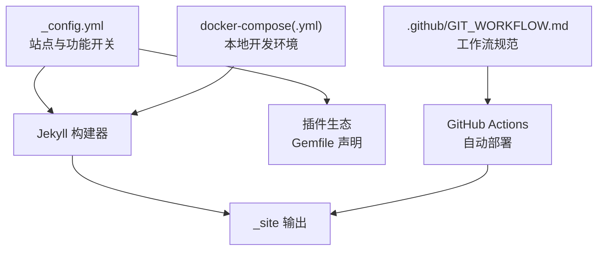
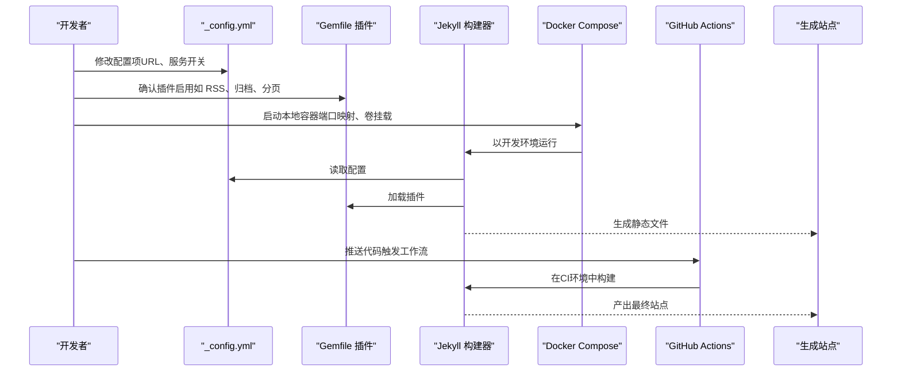
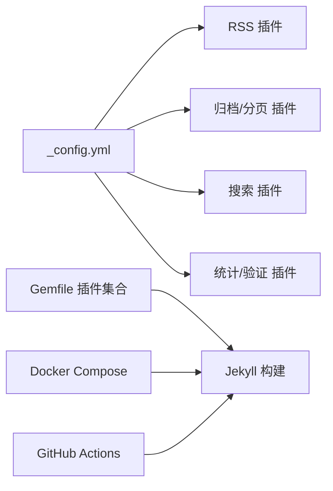

# 配置问题

<cite>
**本文引用的文件**
- [_config.yml](file://_config.yml)
- [TROUBLESHOOTING.md](file://TROUBLESHOOTING.md)
- [SEO.md](file://SEO.md)
- [Gemfile](file://Gemfile)
- [docker-compose.yml](file://docker-compose.yml)
- [docker-compose-slim.yml](file://docker-compose-slim.yml)
- [.github/GIT_WORKFLOW.md](file://.github/GIT_WORKFLOW.md)
- [requirements.txt](file://requirements.txt)
- [package.json](file://package.json)
</cite>

## 目录
1. [简介](#简介)
2. [项目结构](#项目结构)
3. [核心组件](#核心组件)
4. [架构总览](#架构总览)
5. [详细组件分析](#详细组件分析)
6. [依赖分析](#依赖分析)
7. [性能考虑](#性能考虑)
8. [故障排除指南](#故障排除指南)
9. [结论](#结论)
10. [附录](#附录)

## 简介
本文件聚焦于配置问题的系统化排查与修复，覆盖以下主题：
- YAML语法错误：常见缩进、引号、特殊字符导致的解析失败
- RSS订阅功能配置问题：站点URL、基础路径、插件启用与生成
- Google Search Console验证ID设置：在配置中正确添加与生效流程
- GitHub Actions工作流参数配置：分支、权限与构建参数
- 第三方服务集成问题：评论、统计、搜索等服务的开关与依赖

目标是帮助读者快速定位配置文件中的常见语法错误、环境变量设置、以及配置项之间的依赖关系，并提供验证工具、错误解析方法与最佳实践。

## 项目结构
本项目基于Jekyll与al-folio主题，核心配置集中在站点配置文件中，同时通过Gemfile声明插件生态，使用Docker进行本地开发与调试，配合GitHub Actions实现自动化部署。

图表来源
- [_config.yml](file://_config.yml)
- [Gemfile](file://Gemfile)
- [docker-compose.yml](file://docker-compose.yml)
- [docker-compose-slim.yml](file://docker-compose-slim.yml)
- [.github/GIT_WORKFLOW.md](file://.github/GIT_WORKFLOW.md)

章节来源
- [_config.yml](file://_config.yml)
- [Gemfile](file://Gemfile)
- [docker-compose.yml](file://docker-compose.yml)
- [docker-compose-slim.yml](file://docker-compose-slim.yml)
- [.github/GIT_WORKFLOW.md](file://.github/GIT_WORKFLOW.md)

## 核心组件
- 站点配置中心：用于控制站点标题、描述、语言、URL、基础路径、布局、元数据、第三方服务开关等
- 插件生态：通过Gemfile声明Jekyll插件集合，包括RSS、归档、压缩、分页、学术文献、社交链接等
- 本地开发环境：Docker Compose预置镜像，端口映射与卷挂载，便于一致化本地构建
- 自动化部署：GitHub Actions工作流（由仓库工作流目录管理），结合仓库设置与配置项完成部署
- 验证与排障：内置故障排除指南与SEO最佳实践，提供常见问题的诊断步骤与修复建议

章节来源
- [_config.yml](file://_config.yml)
- [Gemfile](file://Gemfile)
- [TROUBLESHOOTING.md](file://TROUBLESHOOTING.md)
- [SEO.md](file://SEO.md)

## 架构总览
下图展示从配置到构建、部署与验证的关键路径：

图表来源
- [_config.yml](file://_config.yml)
- [Gemfile](file://Gemfile)
- [docker-compose.yml](file://docker-compose.yml)
- [docker-compose-slim.yml](file://docker-compose-slim.yml)

## 详细组件分析

### YAML语法错误与验证
- 常见错误类型
  - 缩进不一致：YAML对缩进敏感，必须保持统一的空格数
  - 特殊字符未加引号：包含冒号、与符号等字符的字符串需用引号包裹
  - 删除或遗漏必需字段：如基础路径字段不应被删除
- 定位与修复
  - 本地构建验证：在本地执行构建命令以获得精确的错误行号
  - 使用在线工具：将配置粘贴至YAML校验器进行快速检查
  - 参考示例：对比配置文件中的正确写法与错误写法示例
- 最佳实践
  - 统一使用两空格缩进
  - 对包含特殊字符的字符串使用双引号
  - 保留所有必需字段，避免误删

章节来源
- [TROUBLESHOOTING.md](file://TROUBLESHOOTING.md)
- [_config.yml](file://_config.yml)

### RSS订阅功能配置
- 关键配置项
  - 站点标题、描述、完整URL：RSS源需要这些信息
  - 插件启用：确保RSS相关插件已加入插件列表
  - 归档与分页：影响文章索引与RSS条目数量
- 故障排查
  - 检查站点URL是否为绝对地址
  - 确认存在至少一篇符合格式的文章
  - 重新构建并等待部署完成
- 验证方法
  - 访问站点的RSS输出地址，确认XML内容有效
  - 使用RSS阅读器进行订阅测试

章节来源
- [TROUBLESHOOTING.md](file://TROUBLESHOOTING.md)
- [_config.yml](file://_config.yml)

### Google Search Console验证ID设置
- 设置位置
  - 在站点配置中添加验证ID字段
- 生效流程
  - 提交后需等待搜索引擎抓取与验证
  - 建议同时配置其他验证方式以提高成功率
- 注意事项
  - 验证ID应与控制台提供的值完全一致
  - 若使用自定义域名，需确保域名文件与配置同步

章节来源
- [SEO.md](file://SEO.md)
- [_config.yml](file://_config.yml)

### GitHub Actions工作流参数配置
- 分支与页面源
  - 确保页面源设置为分支，并选择正确的分支
- 权限与密钥
  - 工作流需要适当的权限以访问仓库与发布页面
- 参数与缓存
  - 如遇权限问题，可按工作流文件中的注释说明传入用户与组ID参数
- 常见问题
  - “未知标签”错误通常与页面源设置有关，切换到正确的分支后重试

章节来源
- [TROUBLESHOOTING.md](file://TROUBLESHOOTING.md)
- [.github/GIT_WORKFLOW.md](file://.github/GIT_WORKFLOW.md)
- [docker-compose.yml](file://docker-compose.yml)

### 第三方服务集成问题
- 评论系统（如Giscus）
  - 确认仓库已启用讨论功能
  - 校验配置中的仓库ID与分类ID
- 统计与分析
  - 开关与ID需在配置中启用并填写
  - 确保与站点URL一致
- 搜索功能
  - 需启用并确保站点URL有效
  - 构建完成后等待索引生成

章节来源
- [TROUBLESHOOTING.md](file://TROUBLESHOOTING.md)
- [_config.yml](file://_config.yml)

## 依赖分析
- 配置与插件的耦合
  - 某些功能（如RSS、归档、分页）依赖特定插件的存在
  - 插件版本与Jekyll版本兼容性需关注
- 本地与CI差异
  - Docker镜像与系统权限可能影响构建
  - CI环境下的权限与用户ID需与本地一致
- 工作流与仓库设置
  - 页面源、分支策略与工作流权限共同决定部署结果

图表来源
- [_config.yml](file://_config.yml)
- [Gemfile](file://Gemfile)
- [docker-compose.yml](file://docker-compose.yml)
- [docker-compose-slim.yml](file://docker-compose-slim.yml)

章节来源
- [_config.yml](file://_config.yml)
- [Gemfile](file://Gemfile)
- [docker-compose.yml](file://docker-compose.yml)
- [docker-compose-slim.yml](file://docker-compose-slim.yml)

## 性能考虑
- 构建优化
  - 合理启用压缩与缓存插件
  - 控制不必要的资源引入
- 资源加载
  - 使用相对路径与现代图片格式
  - 启用懒加载与响应式图片
- 索引与发现
  - 保证RSS与Sitemap可用
  - 优化页面标题与描述，提升搜索可见性

## 故障排除指南
- 快速检查清单
  - 确认站点URL与基础路径正确
  - 清除浏览器缓存并使用隐私窗口访问
  - 等待GitHub Actions完成部署
- YAML语法错误
  - 使用本地构建命令定位错误
  - 使用在线工具进行快速校验
- RSS与搜索
  - 确认必要字段与插件已启用
  - 检查文章数量与日期
- 评论与统计
  - 校验第三方服务ID与仓库设置
- Docker与CI
  - 检查端口占用与权限
  - 按需传入用户与组ID参数

章节来源
- [TROUBLESHOOTING.md](file://TROUBLESHOOTING.md)

## 结论
配置问题的核心在于“一致性”与“可验证性”。通过遵循统一的缩进规则、确保必需字段不缺失、启用正确的插件、并在本地与CI环境中保持一致的构建参数，大多数问题都能被快速定位与修复。建议在每次修改配置后，先在本地进行构建验证，再提交到仓库以减少CI失败的概率。

## 附录
- 验证工具与参考
  - YAML校验器：用于快速检测语法错误
  - 本地构建命令：用于获取精确的错误信息
  - RSS与Sitemap访问：用于确认功能是否正常
- 相关文件路径
  - 站点配置：[_config.yml](file://_config.yml)
  - 插件声明：[Gemfile](file://Gemfile)
  - 本地开发：[docker-compose.yml](file://docker-compose.yml)、[docker-compose-slim.yml](file://docker-compose-slim.yml)
  - 工作流规范：[.github/GIT_WORKFLOW.md](file://.github/GIT_WORKFLOW.md)
  - 依赖与脚本：[requirements.txt](file://requirements.txt)、[package.json](file://package.json)