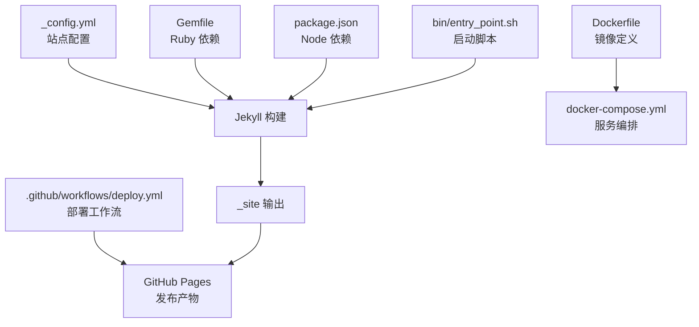
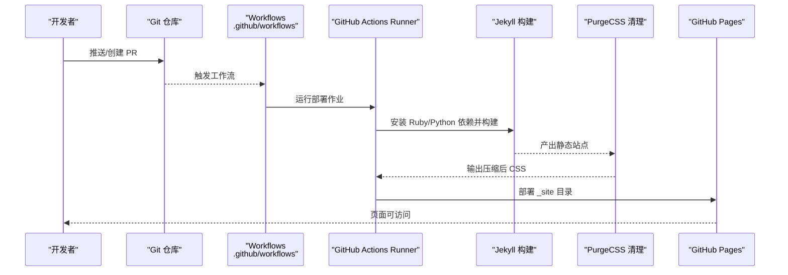
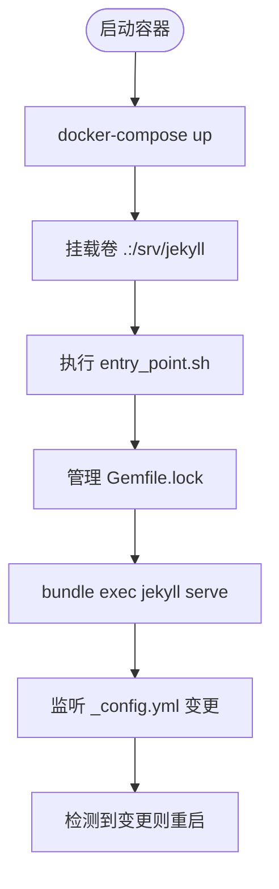
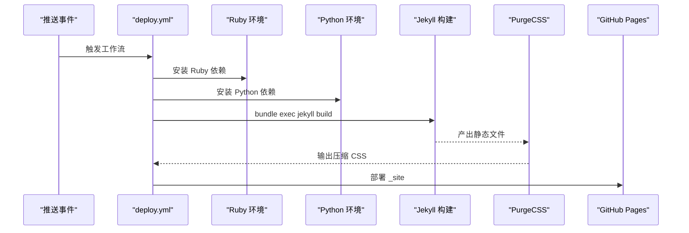
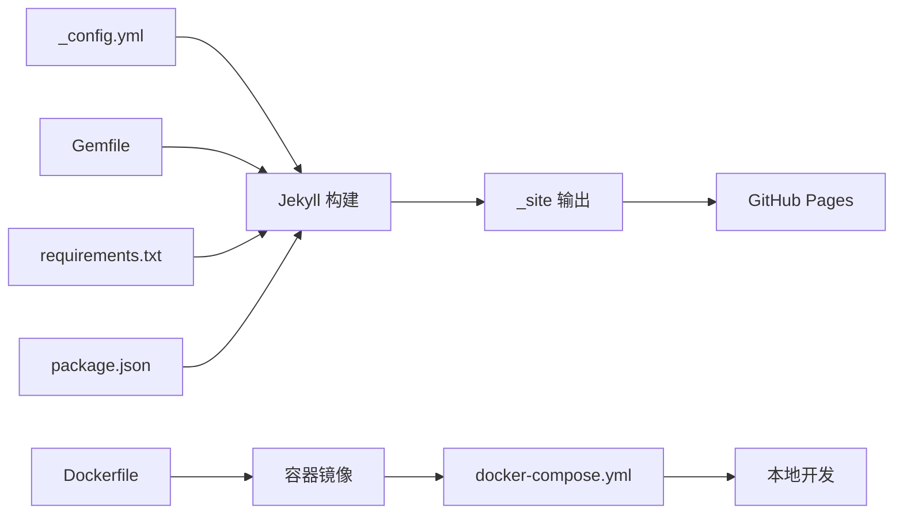

# 故障排除和维护

<cite>
**本文引用的文件**
- [README.md](file://README.md)
- [INSTALL.md](file://INSTALL.md)
- [TROUBLESHOOTING.md](file://TROUBLESHOOTING.md)
- [QUICKSTART.md](file://QUICKSTART.md)
- [_config.yml](file://_config.yml)
- [Gemfile](file://Gemfile)
- [package.json](file://package.json)
- [Dockerfile](file://Dockerfile)
- [docker-compose.yml](file://docker-compose.yml)
- [docker-compose-slim.yml](file://docker-compose-slim.yml)
- [bin/entry_point.sh](file://bin/entry_point.sh)
- [requirements.txt](file://requirements.txt)
- [.prettierrc](file://.prettierrc)
- [.github/workflows/deploy.yml](file://.github/workflows/deploy.yml)
- [.github/workflows/prettier.yml](file://.github/workflows/prettier.yml)
- [FAQ.md](file://FAQ.md)
- [purgecss.config.js](file://purgecss.config.js)
</cite>

## 目录
1. [简介](#简介)
2. [项目结构](#项目结构)
3. [核心组件](#核心组件)
4. [架构总览](#架构总览)
5. [详细组件分析](#详细组件分析)
6. [依赖关系分析](#依赖关系分析)
7. [性能考虑](#性能考虑)
8. [故障排除指南](#故障排除指南)
9. [结论](#结论)
10. [附录](#附录)

## 简介
本文件面向 al-folio Jekyll 主题的使用者与维护者，提供系统化的故障排除与维护支持文档。内容覆盖安装失败、构建错误、样式异常、功能失效等问题的诊断与修复；涵盖调试技巧（浏览器开发者工具、Jekyll 调试模式、日志分析）；版本升级注意事项与迁移步骤；依赖冲突排查与解决；备份与恢复策略；社区支持渠道与问题反馈流程；安全更新与漏洞修复最佳实践；以及长期维护检查清单与定期维护任务。

## 项目结构
该仓库采用 Jekyll 静态站点生成器组织内容，核心目录与文件如下：
- 配置与主题：_config.yml、Gemfile、package.json
- 构建与容器：Dockerfile、docker-compose.yml、docker-compose-slim.yml、bin/entry_point.sh
- 自动化工作流：.github/workflows/deploy.yml、.github/workflows/prettier.yml
- 文档与指南：README.md、INSTALL.md、TROUBLESHOOTING.md、QUICKSTART.md、FAQ.md
- 样式与资源：assets/css、assets/js、_sass、assets/webfonts
- 内容与数据：_posts、_pages、_data、_bibliography、_projects、_teachings、_news

图表来源
- [_config.yml](file://_config.yml)
- [Gemfile](file://Gemfile)
- [package.json](file://package.json)
- [Dockerfile](file://Dockerfile)
- [docker-compose.yml](file://docker-compose.yml)
- [bin/entry_point.sh](file://bin/entry_point.sh)
- [.github/workflows/deploy.yml](file://.github/workflows/deploy.yml)

章节来源
- [README.md](file://README.md)
- [INSTALL.md](file://INSTALL.md)

## 核心组件
- 站点配置与主题：通过 _config.yml 控制站点标题、URL、baseurl、布局、插件、第三方库版本与完整性校验等。
- Ruby 依赖管理：Gemfile 声明 Jekyll 核心插件组与开发/外部插件组，确保构建稳定性。
- Node 与前端工具：package.json 引入 Prettier 与 Liquid 插件，配合 .prettierrc 统一格式。
- 容器化本地开发：Dockerfile 定义基础镜像与系统依赖，docker-compose.yml 提供端口映射与卷挂载，entry_point.sh 实现热重载与配置变更监听。
- 自动化部署：GitHub Actions 工作流在推送或手动触发时执行构建、清理未使用 CSS、部署到 GitHub Pages。
- Python 生态：requirements.txt 支持 Jupyter Notebook 转换与学术数据抓取等扩展能力。

章节来源
- [_config.yml](file://_config.yml)
- [Gemfile](file://Gemfile)
- [package.json](file://package.json)
- [Dockerfile](file://Dockerfile)
- [docker-compose.yml](file://docker-compose.yml)
- [bin/entry_point.sh](file://bin/entry_point.sh)
- [.github/workflows/deploy.yml](file://.github/workflows/deploy.yml)
- [requirements.txt](file://requirements.txt)

## 架构总览
下图展示从代码提交到页面发布的完整链路，包括本地开发、容器化环境、CI/CD 与静态托管的关键节点。

图表来源
- [.github/workflows/deploy.yml](file://.github/workflows/deploy.yml)

## 详细组件分析

### 容器化本地开发与调试
- 使用 docker-compose 启动 Jekyll 服务，映射 8080 端口与 LiveReload 端口 35729，挂载当前目录至 /srv/jekyll。
- entry_point.sh 在启动时处理 Gemfile.lock 的 Git 跟踪状态，并在 _config.yml 变更时自动重启 Jekyll。
- Dockerfile 安装系统依赖（如 imagemagick、nodejs、python3-pip），设置生产环境变量，预装 Jekyll 与 Bundler 并执行 bundle install。

图表来源
- [docker-compose.yml](file://docker-compose.yml)
- [bin/entry_point.sh](file://bin/entry_point.sh)
- [Dockerfile](file://Dockerfile)

章节来源
- [docker-compose.yml](file://docker-compose.yml)
- [docker-compose-slim.yml](file://docker-compose-slim.yml)
- [bin/entry_point.sh](file://bin/entry_point.sh)
- [Dockerfile](file://Dockerfile)

### 部署工作流与发布路径
- 工作流在主分支推送或 PR 触发时运行，安装 Ruby 与 Python 依赖，构建站点并清理未使用 CSS，最后将 _site 目录部署到 GitHub Pages。
- 配置中包含对 giscus.repo 的动态更新，确保评论系统与仓库关联正确。

图表来源
- [.github/workflows/deploy.yml](file://.github/workflows/deploy.yml)

章节来源
- [.github/workflows/deploy.yml](file://.github/workflows/deploy.yml)

### 样式与资源管理
- 第三方库版本与完整性哈希在 _config.yml 中集中声明，便于缓存与安全校验。
- purgecss.config.js 指定清理范围，仅对 _site 下的 HTML 与 JS 进行扫描，输出到 _site/assets/css/。
- .prettierrc 配置 Prettier 与 Liquid 插件，统一代码风格。

章节来源
- [_config.yml](file://_config.yml)
- [purgecss.config.js](file://purgecss.config.js)
- [.prettierrc](file://.prettierrc)

### 依赖与版本控制
- Gemfile 明确声明 Jekyll 核心插件组与其他插件组，避免版本漂移导致的构建失败。
- requirements.txt 管理 Python 生态（如 nbconvert、rendercv、scholarly）。
- package.json 管理前端格式化工具（Prettier 与 Liquid 插件）。

章节来源
- [Gemfile](file://Gemfile)
- [requirements.txt](file://requirements.txt)
- [package.json](file://package.json)

## 依赖关系分析
- 站点配置依赖于 Ruby 与 Python 环境，以及 Jekyll 插件生态。
- 容器镜像层叠依赖系统包（imagemagick、nodejs、python3-pip）与 Ruby/Gem 生态。
- GitHub Actions 依赖 runner 环境与缓存策略，确保重复构建效率。

图表来源
- [_config.yml](file://_config.yml)
- [Gemfile](file://Gemfile)
- [requirements.txt](file://requirements.txt)
- [package.json](file://package.json)
- [Dockerfile](file://Dockerfile)
- [docker-compose.yml](file://docker-compose.yml)
- [.github/workflows/deploy.yml](file://.github/workflows/deploy.yml)

章节来源
- [_config.yml](file://_config.yml)
- [Gemfile](file://Gemfile)
- [requirements.txt](file://requirements.txt)
- [package.json](file://package.json)
- [Dockerfile](file://Dockerfile)
- [docker-compose.yml](file://docker-compose.yml)
- [.github/workflows/deploy.yml](file://.github/workflows/deploy.yml)

## 性能考虑
- 图片响应式与懒加载：启用 imagemin/imagemagick 生成 WebP 多尺寸图片，开启懒加载提升首屏性能。
- CSS 压缩：构建阶段使用 PurgeCSS 清理未使用样式，减少体积。
- 前端库完整性校验：通过 SRI 哈希确保第三方库未被篡改，同时利于浏览器缓存。
- 构建缓存：GitHub Actions 使用 bundler 缓存与 pip 缓存，缩短构建时间。

章节来源
- [_config.yml](file://_config.yml)
- [.github/workflows/deploy.yml](file://.github/workflows/deploy.yml)
- [purgecss.config.js](file://purgecss.config.js)

## 故障排除指南

### 安装与本地开发
- Docker 构建失败
  - 更新镜像并重建：先执行拉取命令，再重新构建。
  - 检查系统资源（磁盘空间、内存）与 Docker 版本兼容性。
  - 权限问题：Linux 用户需将用户加入 docker 组并重新登录。
- Ruby 依赖冲突
  - 删除 Gemfile.lock，更新 Bundler 并重新安装依赖。
  - 如仍失败，尝试使用 Docker 以隔离环境差异。
- 端口占用
  - Docker：停止并重启容器。
  - 本地 Ruby：查找并终止占用端口的进程，或指定其他端口。

章节来源
- [TROUBLESHOOTING.md](file://TROUBLESHOOTING.md)
- [INSTALL.md](file://INSTALL.md)
- [docker-compose.yml](file://docker-compose.yml)
- [bin/entry_point.sh](file://bin/entry_point.sh)

### 构建与部署
- GitHub Pages 部署失败
  - 检查 Actions 日志中的具体错误信息。
  - 确认 _config.yml 的 url 与 baseurl 设置正确（个人/组织站点 baseurl 必须为空）。
  - 确保推送至主分支而非 gh-pages 分支。
  - 手动触发一次部署以验证修复。
- 自定义域名空白
  - 在仓库根目录创建无扩展名的 CNAME 文件，写入域名并提交。
- “未知标签 toc”错误
  - 确认 Pages 设置源为“从分支部署”，并将分支设为 gh-pages。

章节来源
- [TROUBLESHOOTING.md](file://TROUBLESHOOTING.md)
- [INSTALL.md](file://INSTALL.md)

### 样式与布局
- CSS/JS 加载异常
  - 核对 _config.yml 的 url 与 baseurl，清除浏览器缓存或使用隐私窗口访问。
  - 等待 GitHub Actions 完成后重试。
- 主题颜色不生效
  - 检查颜色名称是否在变量文件中有效，清理缓存并重新构建/部署。

章节来源
- [TROUBLESHOOTING.md](file://TROUBLESHOOTING.md)
- [_config.yml](file://_config.yml)

### 内容与功能
- 博客文章未显示
  - 检查文件命名格式、所在目录、前置参数与日期（不得晚于当前日期）。
  - 确认博客页面已启用。
- 出版物未显示
  - 检查 BibTeX 文件位置与语法，确认入口键唯一，且已启用出版物页面。
- 图片无法加载
  - 使用相对路径，确保文件存在且大小写正确。
- RSS/Atom 订阅无效
  - 确认必需字段（title、description、url）已填写，baseurl 正确，至少有一篇有效文章。
- 搜索功能不可用
  - 确认已启用搜索并在 _config.yml 中设置有效 url。
- 评论（Giscus）不显示
  - 确认仓库启用了 Discussions，_config.yml 中 giscus 配置正确，且 disqus_shortname 已关闭。

章节来源
- [TROUBLESHOOTING.md](file://TROUBLESHOOTING.md)
- [_config.yml](file://_config.yml)

### 配置与 YAML
- YAML 语法错误
  - 使用在线工具或本地运行构建命令定位错误行。
  - 注意特殊字符需加引号，缩进保持一致（建议 2 空格）。
- 相关文章功能崩溃
  - 若禁用相关文章功能则无需额外依赖；若启用，确保安装所需 gems 并重新构建。

章节来源
- [TROUBLESHOOTING.md](file://TROUBLESHOOTING.md)
- [_config.yml](file://_config.yml)

### 调试技巧与工具
- 浏览器开发者工具
  - Network 面板检查静态资源加载状态与 404/缓存问题；Console 查看 JS 错误；Elements 检查样式应用情况。
- Jekyll 调试模式
  - 使用 Docker 时，entry_point.sh 启用 verbose 与 trace 参数，便于定位构建异常。
  - 本地 Ruby 开发时，使用 bundle exec jekyll serve --verbose --trace。
- 日志分析
  - Docker：查看容器日志以定位依赖缺失或权限问题。
  - GitHub Actions：在 Actions 标签页查看工作流日志，按步骤定位失败原因。
- Prettier 格式化
  - 本地运行 npx prettier . --check 或 --write，必要时在 CI 中上传差异文件以便审阅。

章节来源
- [bin/entry_point.sh](file://bin/entry_point.sh)
- [.github/workflows/deploy.yml](file://.github/workflows/deploy.yml)
- [.github/workflows/prettier.yml](file://.github/workflows/prettier.yml)
- [.prettierrc](file://.prettierrc)

### 版本升级与迁移
- 升级步骤
  - 添加上游远程并基于目标版本进行变基或手动合并。
  - 若自定义较多，建议新建仓库并使用模板重新安装，再逐项比对差异。
- 注意事项
  - 关注已弃用功能（如 jekyll-diagrams 替换为 mermaid.js）。
  - 更新第三方库版本与完整性哈希，确保 SRI 校验通过。
  - 在本地与 CI 环境分别测试，确认无依赖冲突与构建失败。

章节来源
- [INSTALL.md](file://INSTALL.md)
- [FAQ.md](file://FAQ.md)

### 依赖冲突排查
- Ruby 依赖
  - 删除 Gemfile.lock，更新 Bundler 并重新安装；如仍冲突，检查 Gemfile 中版本约束与插件兼容性。
- Node/Prettier
  - 确保本地与 CI 使用一致的 Node 版本；Prettier 插件与配置需与项目匹配。
- Python
  - 使用 requirements.txt 管理依赖，注意 nbconvert 等工具的升级可能影响笔记本渲染。

章节来源
- [Gemfile](file://Gemfile)
- [package.json](file://package.json)
- [requirements.txt](file://requirements.txt)
- [.github/workflows/deploy.yml](file://.github/workflows/deploy.yml)

### 备份与恢复策略
- 重要文件与目录
  - 配置：_config.yml、Gemfile、package.json、requirements.txt
  - 内容：_posts、_pages、_bibliography、assets（图片、PDF、JSON）
  - 自动化：.github/workflows、docker-compose.yml、Dockerfile
- 备份建议
  - 使用 Git 仓库作为主要备份；对敏感配置（如 giscus、分析密钥）使用仓库机密或环境变量。
  - 对大型媒体资源可单独归档至对象存储或 CDN。
- 恢复步骤
  - 从最近一次成功构建的 gh-pages 分支或 _site 目录恢复静态资源。
  - 在新环境中重新安装依赖并验证构建。

章节来源
- [_config.yml](file://_config.yml)
- [Gemfile](file://Gemfile)
- [package.json](file://package.json)
- [requirements.txt](file://requirements.txt)
- [.github/workflows/deploy.yml](file://.github/workflows/deploy.yml)

### 社区支持与问题反馈
- 使用渠道
  - GitHub Discussions：提问与交流经验。
  - GitHub Issues：报告缺陷与功能请求。
  - AI 助手：GitHub Copilot Customization Agent（需订阅）。
- 反馈规范
  - 提供最小可复现示例、错误日志、环境信息（Ruby/Node/OS 版本）、已尝试的修复步骤。

章节来源
- [README.md](file://README.md)
- [TROUBLESHOOTING.md](file://TROUBLESHOOTING.md)

### 安全更新与漏洞修复
- 第三方库完整性
  - 通过 _config.yml 中的 SRI 哈希校验确保库未被篡改。
  - 定期更新库版本并同步完整性哈希。
- 分析与验证
  - 使用 lychee 检测死链，Axe 进行可访问性测试（需手动运行）。
- 密钥与机密
  - 将分析平台、CDN、评论系统等密钥放入仓库机密，避免硬编码。

章节来源
- [_config.yml](file://_config.yml)
- [.github/workflows/deploy.yml](file://.github/workflows/deploy.yml)
- [FAQ.md](file://FAQ.md)

### 长期维护检查清单
- 周期性任务
  - 更新 Ruby/Python/Node 依赖，确保无高危漏洞。
  - 检查并更新第三方库版本与 SRI 哈希。
  - 运行 lychee 与 Axe，修复发现的问题。
  - 回顾并优化图片与 CSS，保持站点性能。
- 发布前检查
  - 本地构建并通过 Docker 验证。
  - 在不同浏览器与设备上验证样式与交互。
  - 确认 RSS/搜索/评论等功能正常。
- 版本升级
  - 制定升级计划，先在测试分支验证，再合并到主分支。

章节来源
- [INSTALL.md](file://INSTALL.md)
- [FAQ.md](file://FAQ.md)
- [.github/workflows/deploy.yml](file://.github/workflows/deploy.yml)

## 结论
通过系统化的故障排除流程、容器化本地开发、自动化部署与严格的依赖管理，可以显著降低 al-folio 站点的维护成本与风险。建议将本指南纳入团队知识库，结合定期维护检查清单，持续保障站点的稳定性、安全性与性能表现。

## 附录
- 快速开始：参考快速入门指南完成首次部署与个性化配置。
- 常见问题：查阅 FAQ 获取更多典型问题与解答。
- 文档导航：README 中提供了完整的文档索引与社区链接。

章节来源
- [QUICKSTART.md](file://QUICKSTART.md)
- [FAQ.md](file://FAQ.md)
- [README.md](file://README.md)