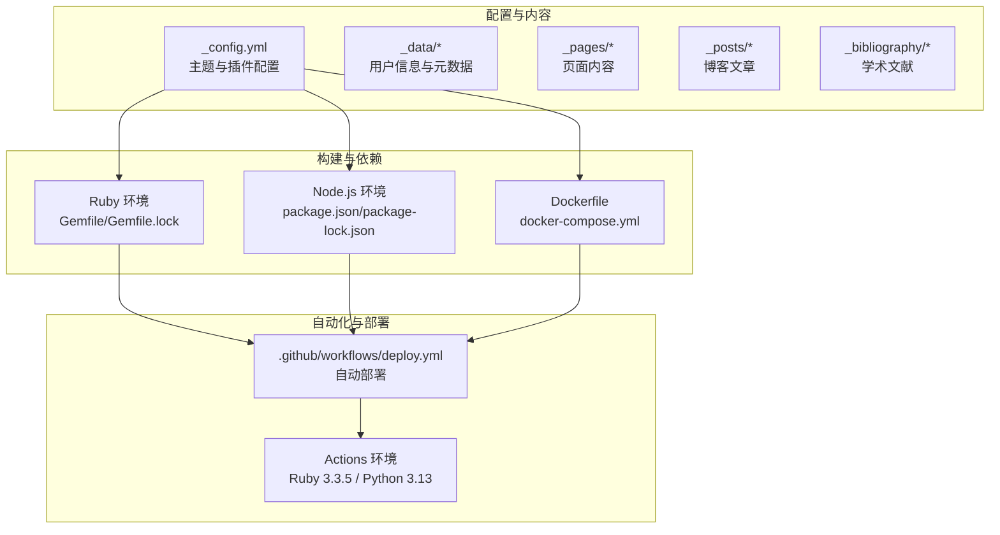
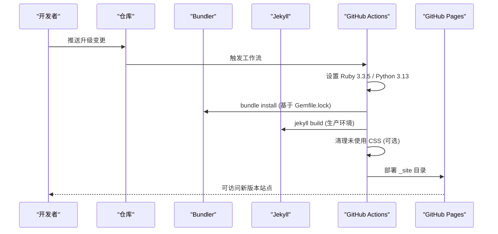
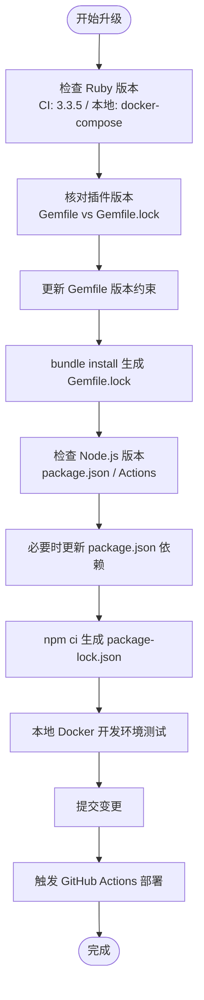
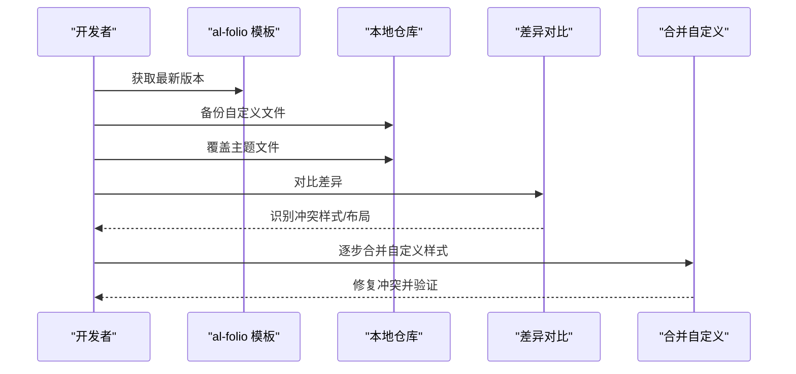
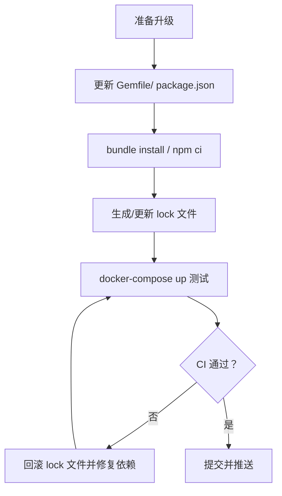
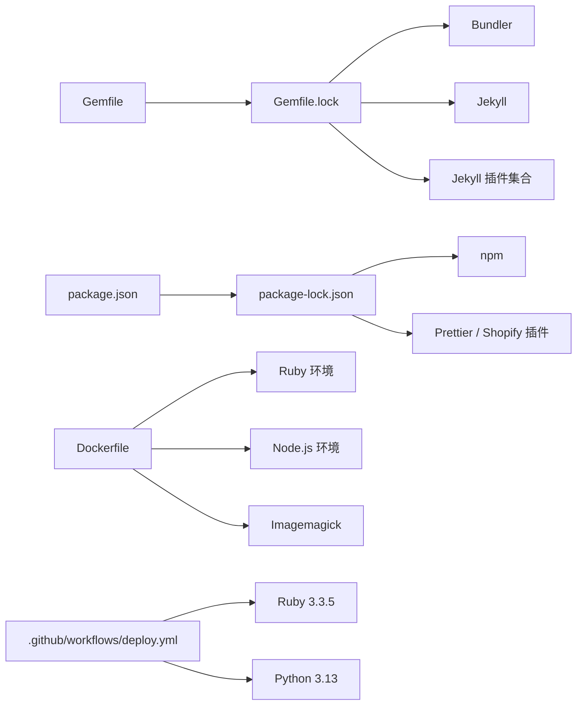

# 版本升级和迁移

<cite>
**本文档引用的文件**
- [_config.yml](file://_config.yml)
- [Gemfile](file://Gemfile)
- [Gemfile.lock](file://Gemfile.lock)
- [package.json](file://package.json)
- [package-lock.json](file://package-lock.json)
- [Dockerfile](file://Dockerfile)
- [docker-compose.yml](file://docker-compose.yml)
- [.github/workflows/deploy.yml](file://.github/workflows/deploy.yml)
- [INSTALL.md](file://INSTALL.md)
- [CUSTOMIZE.md](file://CUSTOMIZE.md)
- [README.md](file://README.md)
- [FAQ.md](file://FAQ.md)
- [bin/entry_point.sh](file://bin/entry_point.sh)
- [requirements.txt](file://requirements.txt)
- [.devcontainer/devcontainer.json](file://.devcontainer/devcontainer.json)
</cite>

## 目录
1. [简介](#简介)
2. [项目结构](#项目结构)
3. [核心组件](#核心组件)
4. [架构总览](#架构总览)
5. [详细组件分析](#详细组件分析)
6. [依赖关系分析](#依赖关系分析)
7. [性能考虑](#性能考虑)
8. [故障排除指南](#故障排除指南)
9. [结论](#结论)
10. [附录](#附录)

## 简介
本指南面向使用 al-folio 主题的 Jekyll 博客作者，系统阐述如何安全地进行版本升级与迁移，涵盖以下关键领域：
- Jekyll 版本升级注意事项与兼容性检查（含插件版本匹配、Ruby 版本要求、Node.js 兼容性）
- 主题升级步骤（文件覆盖策略、自定义配置保留、样式冲突解决）
- 依赖包升级最佳实践（Gemfile.lock 处理、package-lock.json 更新、缓存清理）
- 向后兼容性问题识别与解决
- 升级前备份策略与回滚方案

## 项目结构
该站点采用标准 Jekyll 结构，结合 al-folio 主题与多语言构建工具链：
- 配置层：Jekyll 核心配置与第三方库版本管理
- 构建层：Ruby 生态（Bundler）与 Node.js 生态（npm/Prettier）
- 运行层：Docker 容器化开发环境与 GitHub Actions 自动部署
- 内容层：Markdown、Liquid 模板、Sass 样式与静态资源

**图表来源**
- [_config.yml](file://_config.yml)
- [Gemfile](file://Gemfile)
- [Gemfile.lock](file://Gemfile.lock)
- [package.json](file://package.json)
- [package-lock.json](file://package-lock.json)
- [Dockerfile](file://Dockerfile)
- [docker-compose.yml](file://docker-compose.yml)
- [.github/workflows/deploy.yml](file://.github/workflows/deploy.yml)

**章节来源**
- [_config.yml](file://_config.yml)
- [Gemfile](file://Gemfile)
- [Gemfile.lock](file://Gemfile.lock)
- [package.json](file://package.json)
- [package-lock.json](file://package-lock.json)
- [Dockerfile](file://Dockerfile)
- [docker-compose.yml](file://docker-compose.yml)
- [.github/workflows/deploy.yml](file://.github/workflows/deploy.yml)

## 核心组件
- Jekyll 配置与插件生态：通过 [_config.yml](file://_config.yml) 统一声明主题、插件与第三方库版本；插件清单在 [Gemfile](file://Gemfile) 中定义。
- Ruby 依赖管理：使用 Bundler 管理 Ruby 包，锁定版本于 [Gemfile.lock](file://Gemfile.lock)，确保构建一致性。
- Node.js 依赖管理：前端格式化与模板解析依赖于 [package.json](file://package.json) 与 [package-lock.json](file://package-lock.json)。
- 容器化开发：Dockerfile 与 docker-compose.yml 提供一致的本地开发环境，包含 Ruby、Node.js、Imagemagick 等系统依赖。
- 自动化部署：GitHub Actions 在推送时自动构建并部署到 GitHub Pages，Ruby 版本固定为 3.3.5。

**章节来源**
- [_config.yml](file://_config.yml)
- [Gemfile](file://Gemfile)
- [Gemfile.lock](file://Gemfile.lock)
- [package.json](file://package.json)
- [package-lock.json](file://package-lock.json)
- [Dockerfile](file://Dockerfile)
- [docker-compose.yml](file://docker-compose.yml)
- [.github/workflows/deploy.yml](file://.github/workflows/deploy.yml)

## 架构总览
下图展示从源码到生成站点的关键流程，以及升级过程中的关键检查点：

**图表来源**
- [.github/workflows/deploy.yml](file://.github/workflows/deploy.yml)
- [Gemfile.lock](file://Gemfile.lock)
- [Dockerfile](file://Dockerfile)

**章节来源**
- [.github/workflows/deploy.yml](file://.github/workflows/deploy.yml)
- [Gemfile.lock](file://Gemfile.lock)
- [Dockerfile](file://Dockerfile)

## 详细组件分析

### Jekyll 版本升级与兼容性检查
- Ruby 版本要求
  - GitHub Actions 固定 Ruby 版本为 3.3.5，容器镜像基于 ruby:slim，需确保本地与 CI 使用相同 Ruby 版本。
  - Dockerfile 显式安装 Ruby 并设置环境变量，建议通过 docker-compose 或开发容器保持一致。
- 插件版本匹配
  - 插件清单与版本在 [Gemfile](file://Gemfile) 声明，锁定版本在 [Gemfile.lock](file://Gemfile.lock) 中体现。
  - 升级时优先升级 Gemfile 中的版本约束，再执行 bundle install 生成新的 Gemfile.lock。
- Node.js 兼容性
  - package.json 指定 Prettier 与 Shopify Liquid 插件，Node.js 版本由 Actions 与开发容器统一管理。
  - 若升级 Node.js，需同步更新 Actions 的 setup-node 步骤与开发容器配置。

**图表来源**
- [Gemfile](file://Gemfile)
- [Gemfile.lock](file://Gemfile.lock)
- [package.json](file://package.json)
- [package-lock.json](file://package-lock.json)
- [.github/workflows/deploy.yml](file://.github/workflows/deploy.yml)
- [docker-compose.yml](file://docker-compose.yml)

**章节来源**
- [Gemfile](file://Gemfile)
- [Gemfile.lock](file://Gemfile.lock)
- [package.json](file://package.json)
- [package-lock.json](file://package-lock.json)
- [.github/workflows/deploy.yml](file://.github/workflows/deploy.yml)
- [docker-compose.yml](file://docker-compose.yml)

### 主题升级步骤（al-folio）
- 文件覆盖策略
  - 使用官方“使用模板”方式创建独立仓库，避免与上游直接耦合，便于安全回退。
  - 升级前保留自定义文件（如 _pages、_data、_sass、assets 等），仅覆盖主题相关文件。
- 自定义配置保留
  - 将个人配置集中在 [_config.yml](file://_config.yml) 的用户信息、社交链接、分析与搜索等字段。
  - 通过 [CUSTOMIZE.md](file://CUSTOMIZE.md) 的“技术栈”与“项目结构”部分，明确哪些文件属于主题默认，哪些属于用户自定义。
- 样式冲突解决
  - 自定义样式位于 _sass 下，升级后优先对比 _sass/_themes.scss、_sass/_variables.scss 等关键文件。
  - 如出现样式异常，先回退主题文件，再逐项合并自定义样式，定位冲突来源。

**图表来源**
- [CUSTOMIZE.md](file://CUSTOMIZE.md)
- [_config.yml](file://_config.yml)

**章节来源**
- [CUSTOMIZE.md](file://CUSTOMIZE.md)
- [_config.yml](file://_config.yml)

### 依赖包升级最佳实践
- Ruby 依赖（Bundler）
  - 升级前：确认 Gemfile 中的版本范围与 Gemfile.lock 一致。
  - 升级中：执行 bundle update --all，生成新的 Gemfile.lock。
  - 升级后：使用 docker-compose 重新构建镜像并本地验证。
- Node.js 依赖（npm）
  - 升级前：查看 package.json 的 devDependencies。
  - 升级中：执行 npm ci（或 npm install）生成 package-lock.json。
  - 升级后：在本地与 Actions 环境分别验证构建。
- 缓存清理
  - Dockerfile 中已清理 apt 缓存；本地开发建议删除 node_modules/.cache 与 .sass-cache。
  - GitHub Actions 中使用 bundle cache 与 pip cache，减少重复安装时间。

**图表来源**
- [Gemfile](file://Gemfile)
- [Gemfile.lock](file://Gemfile.lock)
- [package.json](file://package.json)
- [package-lock.json](file://package-lock.json)
- [.github/workflows/deploy.yml](file://.github/workflows/deploy.yml)

**章节来源**
- [Gemfile](file://Gemfile)
- [Gemfile.lock](file://Gemfile.lock)
- [package.json](file://package.json)
- [package-lock.json](file://package-lock.json)
- [.github/workflows/deploy.yml](file://.github/workflows/deploy.yml)

### 向后兼容性问题识别与解决
- 常见问题与定位
  - “未知标签”错误：通常因部署分支设置不正确导致，需确保 Pages 分支为 gh-pages。
  - CSS/JS 加载失败：检查 _config.yml 中 url/baseurl 配置是否与实际域名一致。
  - related_blog_posts 报错：可能由于内容为空或仅含停用词，可通过禁用 LSI 或调整内容解决。
- 解决路径
  - 参考 [FAQ.md](file://FAQ.md) 中对应条目，按提示修改配置或回退相关功能。
  - 使用本地 Docker 环境复现问题，缩小到具体依赖或配置项。

**章节来源**
- [FAQ.md](file://FAQ.md)
- [_config.yml](file://_config.yml)

### 升级前备份策略与回滚方案
- 备份策略
  - 使用 Git 分支隔离升级变更，例如创建 my-upgrade 分支进行实验。
  - 重要文件（_config.yml、Gemfile.lock、package-lock.json、自定义样式与数据）在升级前提交快照。
- 回滚方案
  - 若 CI 失败或本地验证不通过，直接回退到上一个稳定的提交。
  - 回滚时同步恢复 Gemfile.lock 与 package-lock.json，确保依赖树一致。
  - 如需快速验证，使用 docker-compose 启动旧镜像或指定旧版本镜像标签。

**章节来源**
- [INSTALL.md](file://INSTALL.md)
- [bin/entry_point.sh](file://bin/entry_point.sh)

## 依赖关系分析
下图展示关键文件间的依赖关系与版本锁定点：

**图表来源**
- [Gemfile](file://Gemfile)
- [Gemfile.lock](file://Gemfile.lock)
- [package.json](file://package.json)
- [package-lock.json](file://package-lock.json)
- [Dockerfile](file://Dockerfile)
- [.github/workflows/deploy.yml](file://.github/workflows/deploy.yml)

**章节来源**
- [Gemfile](file://Gemfile)
- [Gemfile.lock](file://Gemfile.lock)
- [package.json](file://package.json)
- [package-lock.json](file://package-lock.json)
- [Dockerfile](file://Dockerfile)
- [.github/workflows/deploy.yml](file://.github/workflows/deploy.yml)

## 性能考虑
- 构建优化
  - 使用 Gemfile.lock 与 package-lock.json 锁定版本，减少构建不确定性。
  - 在 Actions 中启用 Bundler 与 pip 缓存，缩短构建时间。
- 资源优化
  - 通过 jekyll-minifier 与 terser 压缩 JS/CSS；必要时使用 purgecss 清理未使用 CSS。
- 开发体验
  - 使用 Docker 与开发容器统一环境，避免“在我机器上可以运行”的问题。

[本节为通用指导，无需特定文件引用]

## 故障排除指南
- 部署分支错误
  - 症状：构建报错“未知标签 toc”
  - 处理：确保 Pages 分支设置为 gh-pages，参考 FAQ 条目。
- CSS/JS 加载异常
  - 症状：页面样式缺失或链接失效
  - 处理：检查 _config.yml 中 url/baseurl，强制刷新浏览器缓存。
- 相关文章计算失败
  - 症状：related_blog_posts 报错
  - 处理：调整内容质量或禁用 LSI，参考 FAQ 条目。
- 依赖冲突
  - 症状：CI 报告版本冲突或弃用警告
  - 处理：升级至最新模板版本，手动合并差异，参考 INSTALL.md 的升级指引。

**章节来源**
- [FAQ.md](file://FAQ.md)
- [INSTALL.md](file://INSTALL.md)
- [_config.yml](file://_config.yml)

## 结论
遵循本指南的升级流程可显著降低风险：
- 以 Gemfile.lock 与 package-lock.json 为核心，确保依赖一致性
- 通过 Docker 与 Actions 统一环境，减少本地与 CI 差异
- 采用分支隔离与快照备份，保障可回滚能力
- 严格对照 al-folio 最新版的“技术栈”与“项目结构”，谨慎合并自定义改动

[本节为总结性内容，无需特定文件引用]

## 附录
- 快速参考
  - Ruby 版本：3.3.5（CI）；Node.js 版本：由 package.json 与 Actions 管理
  - 插件生态：Jekyll 4.x + 多个官方与社区插件
  - 部署：GitHub Pages，gh-pages 分支
  - 开发：Docker 与开发容器，本地实时预览

**章节来源**
- [.github/workflows/deploy.yml](file://.github/workflows/deploy.yml)
- [README.md](file://README.md)
- [INSTALL.md](file://INSTALL.md)